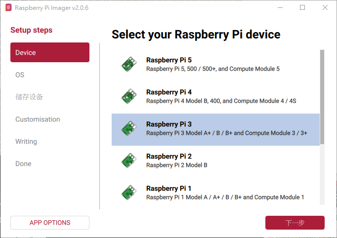
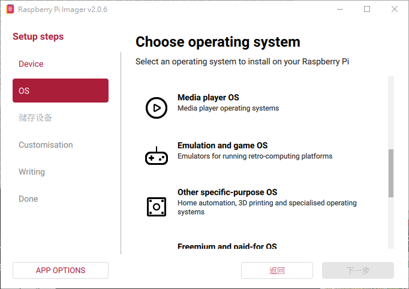
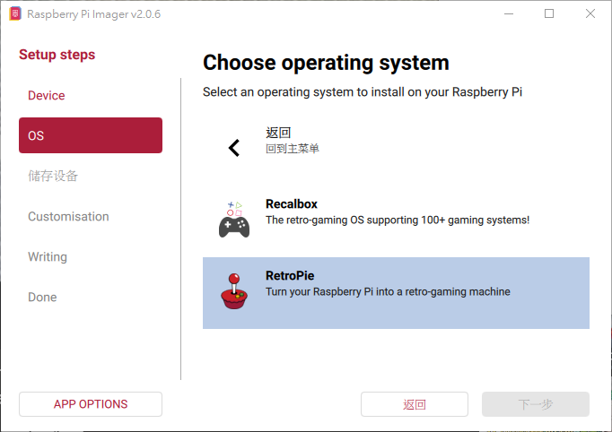

# [RetroPie](https://retropie.org.uk)

[](https://github.com/lankahsu520/HelperX)
[![GitHub license][license-image]][license-url]
[![GitHub stars][stars-image]][stars-url]
[![GitHub forks][forks-image]][forks-url]
[![GitHub issues][issues-image]][issues-image]
[![GitHub watchers][watchers-image]][watchers-image]

[license-image]: https://img.shields.io/github/license/lankahsu520/HelperX.svg
[license-url]: https://github.com/lankahsu520/HelperX/blob/master/LICENSE
[stars-image]: https://img.shields.io/github/stars/lankahsu520/HelperX.svg
[stars-url]: https://github.com/lankahsu520/HelperX/stargazers
[forks-image]: https://img.shields.io/github/forks/lankahsu520/HelperX.svg
[forks-url]: https://github.com/lankahsu520/HelperX/network
[issues-image]: https://img.shields.io/github/issues/lankahsu520/HelperX.svg
[issues-url]: https://github.com/lankahsu520/HelperX/issues
[watchers-image]: https://img.shields.io/github/watchers/lankahsu520/HelperX.svg
[watchers-url]: https://github.com/lankahsu520/HelperX/watchers

# 1. [RetroPie](https://retropie.org.uk)

> RetroPie 是一個基於 Linux 的開源軟體套件，專為 Raspberry Pi（樹莓派）單板電腦設計，用於將其轉變為復古遊戲模擬器。它整合了 EmulationStation 前端界面與 RetroArch 模擬器，支援超過 80 種舊遊戲平台（如 NES、PlayStation、大型電玩等），讓用戶能輕鬆 DIY 懷舊遊戲機。 

> 手邊多餘的 Raspberry Pi，讓它有發揮的空間。

# 2. Install Raspberry Pi OS with RetroPie

> 現在要產出 Raspberry Pi 的開機系統相當的方便，只要使用 [Raspberry Pi Imager](https://www.raspberrypi.com/software/) 就可以讓你輕輕鬆鬆完成。

> 以下使用Raspberry Pi Imager v2.0.6

#### A. Device

> 這邊只要注意持有的 Raspberry Pi 的硬體版本



#### B. OS

> 這邊只要注意持有的 Raspberry Pi 的硬體版本

> 選擇 `Emulation and game OS`



> 再選擇 `RetroPie`



# 3. 1st Bootup

> 第一次開機時會需要有控制設備，如搖桿、鍵盤等，有線搖桿為佳，如果沒有請先使用鍵盤。

## 3.1. Controller

> 詳細說明請見 [RetroArch Controller Configuration](https://retropie.org.uk/docs/RetroArch-Configuration/)

#### A. SNES Controller


#### B. XBox 360 Controller


#### C. PS3 Controller


#### D. PS4 Controller

> 因為 PS4 使用 Bluetooth 連結，所以要先進行 Bluetooth 配對。
>
> PS4 Controller  端，`PS4 SHARE + PS (HOLD ? seconds)` 直到 LED 快閃

# 4. Configuration

## 4.1. raspi-config

> 本體還是 Raspberry Pi OS；已經習慣使用命令列

> 列出常用的

```bash
$ sudo raspi-conf
1 System Options       Configure system settings
	S3 Password          Change password for the 'pi' user
	S4 Hostname          Set name for this computer on a network
	S5 Boot / Auto Login Select boot into desktop or to command line
		B2 Console Autologin Text console, automatically logged in as 'pi' user
2 Display Options      Configure display settings

3 Interface Options    Configure connections to peripherals
	P2 SSH         Enable/disable remote command line access using SSH

4 Performance Options  Configure performance settings

5 Localisation Options Configure language and regional settings

6 Advanced Options     Configure advanced settings

8 Update               Update this tool to the latest version

9 About raspi-config   Information about this configuration tool
```

#### A. /bin/sh

```bash
$ cd /bin/; sudo rm sh; sudo ln -s bash sh
```

## 4.2. RETROPIE SETUP

> 透過遊戲介面選擇相關設定外，也可以使用命令列進行操作
>
> `Configuration / tools` / `scraper` 這個用於建立遊戲的清單。

```bash
$ sudo ~/RetroPie-Setup/retropie_setup.sh
I Basic install
U Update
P Manage packages
C Configuration / tools
S Update RetroPie-Setup script
X Uninstall RetroPie
R Perform reboot
```

### 4.2.1. Basic install

> 記得有空時執行。

### 4.2.2. Update

> 記得有空時執行。

### 4.2.3. Manage packages

> `Manage Optional Packages` / `Install all optional packages` 就全部安裝。

### 4.2.4. Configuration / tools

#### A. [scraper](http://skraper.net)

>  這個用於建立遊戲的清單。因為執行時間過長，可使用 windows 版本建立後再移到 Raspberry Pi 上。
>
>  資料庫採用 [Screenscraper](https://www.screenscraper.fr)

```bash
5 Arcade Source (Screenscraper)
6 Concole Source (Screenscraper)
7 ROM Names (theGamesDB)
8 Gamelist (Overwrite)
9 Use rom folder for gamelist & images (Enabled)
V Download Videos (Enabled)
M Download Marguees (Enabled)

如果沒有開啟 9，抓取後的資料會存放在
/opt/retropie/configs/all/emulationstation/downloaded_images
```

#### B. usbromservice

> 當初使用的 MicroSD 容量不夠時，可以透過外部硬碟載入遊戲。
>
> usb 記得 format 成 FAT32，然後建立目錄 `retropie-mount`，並將 roms 放入即可。

> 記得插上usb 後要重新開機。

```bash
$ tree
.
+--- System Volume Information
|   +--- WPSettings.dat
|   +--- IndexerVolumeGuid
+--- retropie-mount
|   +--- roms
|   |   +--- pcengine
|   |   |   +--- Bonk III - Bonk's Big Adventure (USA).zip
|   |   |   +--- NEKKETSU KOUKOU DODGEBALL BU - PC BANGAI HEN (JAPAN).zip
|   |   |   +--- Super Mario Bros (J) [p1].zip
|   |   |   +--- gamelist.xml
|   |   |   +--- media
|   |   |   |   +--- images
|   |   |   |   |   +--- Bonk III - Bonk's Big Adventure (USA).png
|   |   |   |   |   +--- NEKKETSU KOUKOU DODGEBALL BU - PC BANGAI HEN (JAPAN).png
|   |   |   |   |   +--- Super Mario Bros (J) [p1].png
|   |   |   |   +--- screenshottitle
|   |   |   |   |   +--- Bonk III - Bonk's Big Adventure (USA).png
|   |   |   |   |   +--- NEKKETSU KOUKOU DODGEBALL BU - PC BANGAI HEN (JAPAN).png
|   |   |   |   |   +--- Super Mario Bros (J) [p1].png
|   |   |   |   +--- videos
|   |   |   |   |   +--- Bonk III - Bonk's Big Adventure (USA).mp4
|   |   |   |   |   +--- NEKKETSU KOUKOU DODGEBALL BU - PC BANGAI HEN (JAPAN).mp4
```

## 4.3. [RetroArch](https://retropie.org.uk/docs/RetroArch/)

> 裏面的設定很多，只要記得幾個重要的

### 4.3.1. Analog to Digital Type

> 透過遊戲介面選擇 `RETROPIE`  / `RetroArch`

> `RetroArch` -> `Settings` -> `Input`-> `RetroPad Binds` -> `Port 1 Controls` -> `Analog to Digital Type` -> `Left Analog`

> 之後記得存檔
>
> `RetroArch` -> `Configuration File `-> `Save Current Configuration`

```bash
# 可以查看
$ sudo nano /opt/retropie/configs/all/retroarch.cfg
input_player1_analog_dpad_mode = "1"
input_player2_analog_dpad_mode = "1"
input_player3_analog_dpad_mode = "1"
input_player4_analog_dpad_mode = "1"
input_player5_analog_dpad_mode = "1"
input_player6_analog_dpad_mode = "1"
input_player7_analog_dpad_mode = "1"
input_player8_analog_dpad_mode = "1"
```

### 4.3.2. Full screen

> `RetroArch` -> `Settings` -> `Video` -> `Scaling` -> `Aspect Ratio` -> `Fullscreen`

> 之後記得存檔
>
> `RetroArch` -> `Configuration File `-> `Save Current Configuration`

```bash
$ sudo nano /opt/retropie/configs/all/retroarch.cfg
video_fullscreen = "true"
video_force_aspect = "true"

video_scale = "3"
video_scale_integer = "false"
video_scale_integer_overscale = "false"
```

# 5. roms

> 這裏就需要存放相關的遊戲檔案，因避免版權的問題，遊戲就得自己想辦法。

> 至從手機流行後，1990 年後出生的不一定連紅白機是什麼都不知道，或是大型機台也沒見過。以前的遊戲都有一個故事做支撐，雖然沒有華麗的效果，但是玩起來有如角色，比較有成就感。說起來真的是時代的眼淚。

```bash
$ tree -L 1 ~/RetroPie/
/home/pi/RetroPie/
├── BIOS
├── retropiemenu
├── roms
└── splashscreens

3 directories, 1 file
```

## 5.1. [mame](https://zh.wikipedia.org/wiki/MAME)

```bash
$ ll ~/RetroPie/roms/mame-libretro
```

## 5.2. [neogeo](https://zh.wikipedia.org/zh-tw/Neo_Geo)

```bash
$ ll ~/RetroPie/roms/neogeo
```

## 5.3. [nes](https://zh.wikipedia.org/wiki/红白机)

```bash
$ ll ~/RetroPie/roms/nes
```

## 5.4. [pcengine](https://zh.wikipedia.org/zh-tw/PC_Engine)

```bash
$ ll ~/RetroPie/roms/pcengine
```

# 6. emulationstation

> 這個就是主程式

```bash
$ ps -aux | grep emulationstation
pi         563  0.0  0.3   7672  2776 tty1     S+   05:27   0:00 /bin/bash /usr/bin/emulationstation
pi         568  0.0  0.3   7672  2868 tty1     S+   05:27   0:00 /bin/sh /opt/retropie/supplementary/emulationstation/emulationstation.sh
pi         571 21.9 21.8 346760 166824 tty1    Sl+  05:27   1:25 /opt/retropie/supplementary/emulationstation/emulationstation
pi         958  0.0  0.0   7344   564 pts/0    S+   05:34   0:00 grep --color=auto emulationstation

```

# Appendix

# I. Study

## I.1. Official - [First Installation](https://retropie.org.uk/docs/First-Installation/)

# II. Debug

# III. Glossary

# IV. Tool Usage

# Author

> Created and designed by [Lanka Hsu](lankahsu@gmail.com).

# License

> [HelperX](https://github.com/lankahsu520/HelperX) is available under the BSD-3-Clause license. See the LICENSE file for more info.

