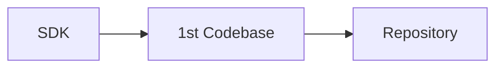
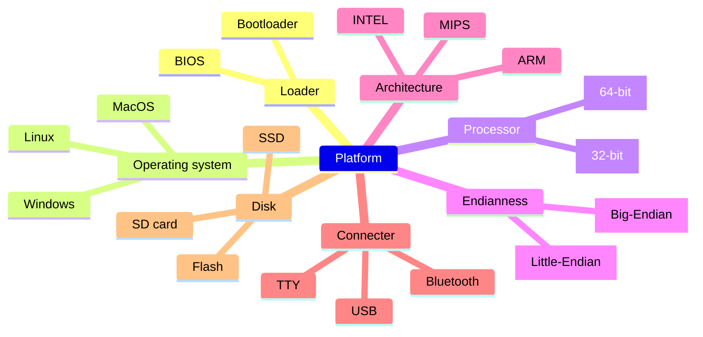
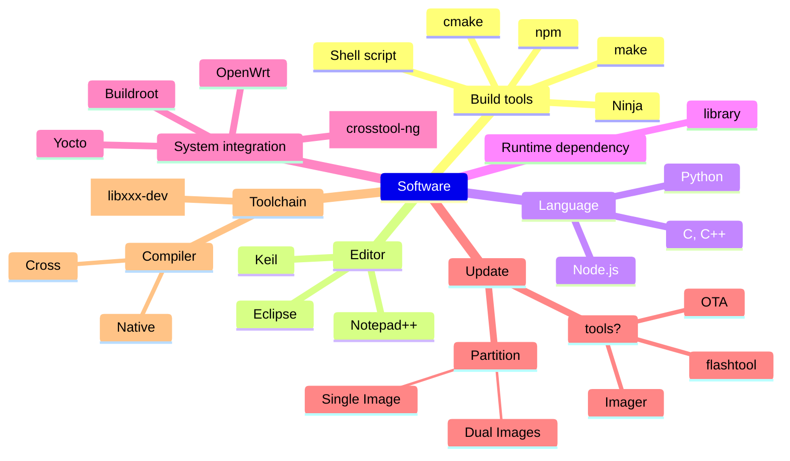
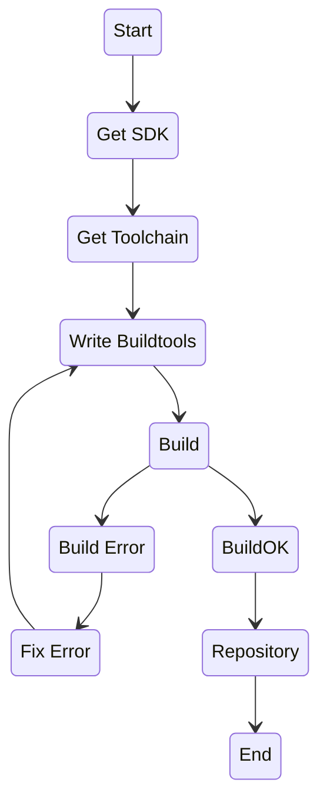

# SDK vs. Codebase (Repository)

[](https://github.com/lankahsu520/HelperX)
[![GitHub license][license-image]][license-url]
[![GitHub stars][stars-image]][stars-url]
[![GitHub forks][forks-image]][forks-url]
[![GitHub issues][issues-image]][issues-image]
[![GitHub watchers][watchers-image]][watchers-image]

[license-image]: https://img.shields.io/github/license/lankahsu520/HelperX.svg
[license-url]: https://github.com/lankahsu520/HelperX/blob/master/LICENSE
[stars-image]: https://img.shields.io/github/stars/lankahsu520/HelperX.svg
[stars-url]: https://github.com/lankahsu520/HelperX/stargazers
[forks-image]: https://img.shields.io/github/forks/lankahsu520/HelperX.svg
[forks-url]: https://github.com/lankahsu520/HelperX/network
[issues-image]: https://img.shields.io/github/issues/lankahsu520/HelperX.svg
[issues-url]: https://github.com/lankahsu520/HelperX/issues
[watchers-image]: https://img.shields.io/github/watchers/lankahsu520/HelperX.svg
[watchers-url]: https://github.com/lankahsu520/HelperX/watchers

# 1. Overview

>一般嵌入式系統開發，都是從 [NXP](https://www.nxp.com)、[SILICON](https://www.silabs.com) 或 [MediaTek](https://www.mediatek.tw) 等晶片廠購買開發板，進而取得相對應的 SDK，再加入自主的想法來進行開發。
>
>就我在嵌入式系統打滾多年的經驗，就算集齊 SDK + EVK + Specification + User guide，你也不可能招喚神龍，哈哈，說笑了！
>
>其實是距離建立第一份 Codebase 還有一大段的路要走。
>


> 不知各位是否有自己在網路上抓取 Opensource（SDK） 後，照著 Building guide 進行編譯，也會手足無措。
>
> 有可能系統環境不同，而欠缺 library。
>
> Python、node.js 版本差異造成問題！
>
> 編譯工具缺失！甚至已經抓取不到！
>
> 最糟的還有，Building guide 本身就是幌子！

>屈屈一個 Opensource 就可能發生這麼大的問題，更何況是整個作業系統！
>
>你可能認為 SDK 已經是前人“整理”出來的，為什麼還需要花時間或心血在上面。但當你吸收完下面的章節就會知道，不同的因素排列組合，就可能有千萬種結果，而前人也只是幫你指出其中一個可能而已。

## 1.1. Platform

> 先決定將在什麼環境上執行



## 1.2. Software




# 2. Codebase

>[ChatGPT] Codebase 的功用
>
>程式碼庫（Codebase）在軟體開發過程中具有多種重要功能，它是一個組織、儲存和管理程式碼的中心化地方。以下是程式碼庫的主要功能和好處：
>
>1. **程式碼管理：** 程式碼庫用於存儲和管理您的應用程式代碼。這包括源代碼文件、配置文件、資源文件等。它確保了代碼的安全性和一致性。
>2. **版本控制：** 程式碼庫允許您使用版本控制系統（Version Control System，VCS）來跟蹤和記錄代碼的不同版本。這有助於團隊協作、代碼追蹤和回滾到先前的版本。
>3. **團隊協作：** 多個開發者可以共享和協作於同一程式碼庫中。每個開發者可以檢查、編輯和提交他們的更改，並與團隊成員協作解決問題。
>4. **分支管理：** 程式碼庫允許您創建和管理不同的分支，每個分支可以用於不同的功能、修復錯誤或版本。這使得同時進行多個任務變得容易。
>5. **容錯和復原：** 使用版本控制系統，您可以輕鬆回滾到以前的代碼版本，以解決問題或恢復正常運行狀態，即使出現了錯誤或問題。
>6. **測試和部署：** 程式碼庫允許您創建版本標籤（tags）或發行分支，以便對應用程式進行測試和部署。這有助於確保生產環境中運行的是穩定和可靠的代碼。
>7. **文檔和註釋：** 程式碼庫通常允許開發者添加文檔和註釋，以說明代碼的功能、使用方法和重要信息。這有助於新成員理解代碼並提供支援。
>8. **共享和開源：** 如果您選擇將程式碼庫設為開源，您可以輕鬆地共享代碼和參與開源社區。這有助於促進知識共享和協作。
>9. **自動化：** 程式碼庫通常與自動化工具集成，以實現持續集成和持續交付（CI/CD），從而實現更快的開發和部署週期。
>10. **安全性：** 程式碼庫可以提供訪問控制和權限管理，以確保只有授權的人員能夠訪問、修改和提交代碼。這有助於維護代碼的安全性和完整性。
>
>總之，程式碼庫是軟體開發過程中的一個核心元素，它有助於組織、保護、協作和管理您的程式碼，同時提供了版本控制、容錯復原和協作的許多好處。不同的團隊和項目可以選擇不同的程式碼庫工具和流程，以滿足其需求。

## 2.1. State Diagram

> 從圖中可以知道，第一份 Codebase 是要花費多少功夫才能完成。
>
> 就算釋出第一份 Codebase，隨著專案進行，需求的變更，而額外的 Opensource（SDK） 會有所增減，因此牽動到整個 Codebase，那你還會覺得之後都不會再更動嗎？



## 2.2. SDK to Develop

> 從專案開啟，拿到 SDK 後，就需要花部分人力進行 Codebase 整合，之後進到版本控管後，才有利於開發/測試人員進行開發和測試！
>
> 就目前工作的經驗，一般要完成 1st Codebase，至少需要 3*人月。

 ```mermaid
flowchart LR
	Start
	subgraph Codebase
		direction LR
		
		subgraph SDK
			direction LR
			XXX-SDK
			Toolchain
		end
		subgraph Customer
			direction LR
			Application
		end		
		Opensource
		Buildtools
	end
	subgraph Repository
		direction LR
		svn
		git
	end
	subgraph Members
		direction LR
		memberA
		memberB
		memberC
		memberD
		memberX
		memberY
		memberZ		
		releaser
	end
	subgraph Target
		direction LR
		linux
		RaspberryPi
	end
	Start-->memberX-->|collect|Codebase-->|push|Repository<-->|clone / push|Members

	Members-->|burn / deploy|Target

	memberY-->|collect|Codebase
	memberZ-->|collect|Codebase

	FW[FW-verX.XX.XX]
	releaser -->|release| FW
	
	Target-->End
	FW-->End
 ```

# Appendix

# I. Study

# II. Debug

# III. Glossary

#### SDK, Software Development Kit

> [[維基百科] 軟體開發套件](https://zh.wikipedia.org/zh-tw/软件开发工具包)
>
> **軟體開發套件**（英語：Software Development Kit, SDK）指一些被[軟體工程師](https://zh.wikipedia.org/wiki/软件工程师)用於為特定的[軟體套件](https://zh.wikipedia.org/wiki/软件包)、[軟體框架](https://zh.wikipedia.org/wiki/软件框架)、[硬體平台](https://zh.wikipedia.org/w/index.php?title=硬件平台&action=edit&redlink=1)及[作業系統](https://zh.wikipedia.org/wiki/作業系統)等建立[應用軟體](https://zh.wikipedia.org/wiki/应用软件)的開發工具之集合。

# IV. Tool Usage


# Author

Created and designed by [Lanka Hsu](lankahsu@gmail.com).

# License

[HelperX](https://github.com/lankahsu520/HelperX) is available under the BSD-3-Clause license. See the LICENSE file for more info.
