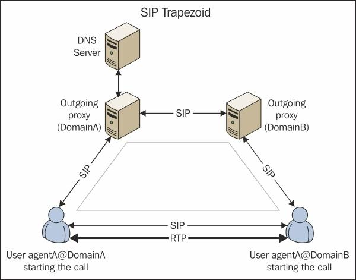
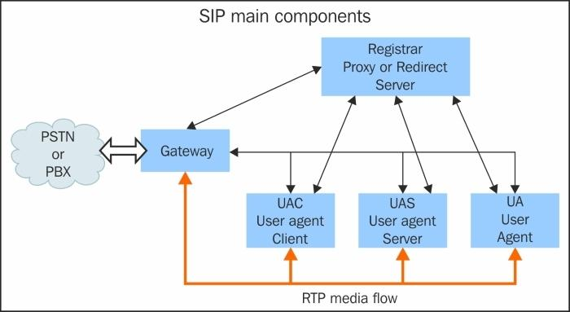
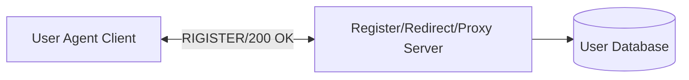
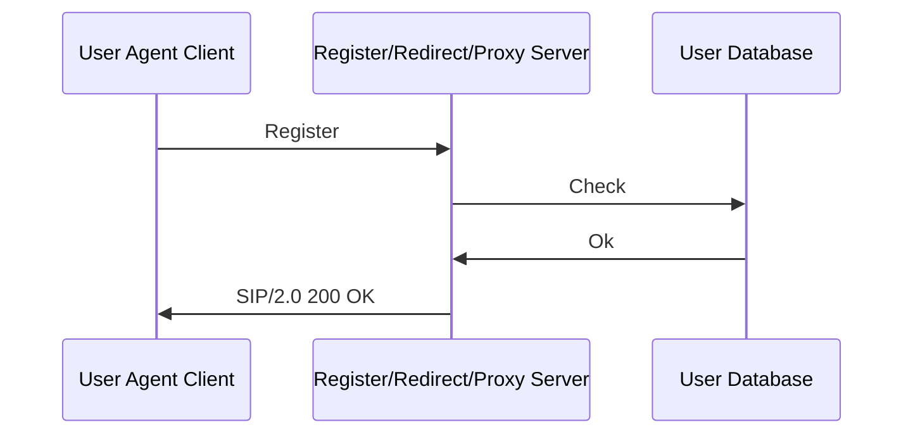
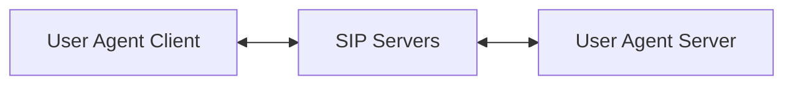

# Session Initiation Protocol
[](https://github.com/lankahsu520/HelperX)
[![GitHub license][license-image]][license-url]
[![GitHub stars][stars-image]][stars-url]
[![GitHub forks][forks-image]][forks-url]
[![GitHub issues][issues-image]][issues-image]
[![GitHub watchers][watchers-image]][watchers-image]

[license-image]: https://img.shields.io/github/license/lankahsu520/HelperX.svg
[license-url]: https://github.com/lankahsu520/HelperX/blob/master/LICENSE
[stars-image]: https://img.shields.io/github/stars/lankahsu520/HelperX.svg
[stars-url]: https://github.com/lankahsu520/HelperX/stargazers
[forks-image]: https://img.shields.io/github/forks/lankahsu520/HelperX.svg
[forks-url]: https://github.com/lankahsu520/HelperX/network
[issues-image]: https://img.shields.io/github/issues/lankahsu520/HelperX.svg
[issues-url]: https://github.com/lankahsu520/HelperX/issues
[watchers-image]: https://img.shields.io/github/watchers/lankahsu520/HelperX.svg
[watchers-url]: https://github.com/lankahsu520/HelperX/watchers

> 本篇主要是 SIP 的入門，教大家在自己的系統中安裝相關的服務；並沒有要細究協定本身，因此使用了很多網路上的文章，如有不適當的引用，煩請告知。

# 1. [SIP Introduction](https://github.com/Ci-Jie/OpenSIPS)

## 1.1. Topology

#### A. Caller and Answer


> [OpenSIPS 权威指南 / 第一章：介绍SIP#理解SIP架构](https://erhuabushuo.gitbooks.io/opensips-definitive-guide/content/chapter1.html)
#### B. Components


> [OpenSIPS 权威指南 / 第一章：介绍SIP#理解SIP架构](https://erhuabushuo.gitbooks.io/opensips-definitive-guide/content/chapter1.html)
#### C. over PSTN

  ```mermaid
flowchart LR
	UAC[User Agent Client]
	UAS[User Agent Server]

	SGateways[SIP Gateways]
	PSTN[PSTN]
	SGateways_s[SIP Gateways]

	UAC <--> SGateways <--> PSTN <--> SGateways_s  <--> UAS
  ```

## 1.2. Sequence

###  1.2.1. Rigister




> [OpenSIPS 权威指南 / 第一章：介绍SIP#SIP注册过程](https://erhuabushuo.gitbooks.io/opensips-definitive-guide/content/chapter1.html)

### 1.2.2. A Call

> UAC (User Agent Client) and UAS (User Agent Server)

#### A. Simple




> [OpenSIPS 权威指南 / 第一章：介绍SIP#Proxy 服务器](https://erhuabushuo.gitbooks.io/opensips-definitive-guide/content/chapter1.html)


[OpenSIPS 权威指南 / 第一章：介绍SIP#SIP dialog 流程](https://erhuabushuo.gitbooks.io/opensips-definitive-guide/content/chapter1.html)


>[SIP 簡介](https://github.com/Ci-Jie/OpenSIPS)
#### B. Redirect


> [OpenSIPS 权威指南 / 第一章：介绍SIP#Redirect 服务器](https://erhuabushuo.gitbooks.io/opensips-definitive-guide/content/chapter1.html)

## 1.3. Requests and Responses 

##### A. Requests/Method

- ACK: Acknowledges an INVITE
- BYE: Terminates an existing session
- CANCEL: Cancels a pending registration
- INFO: Provides mid-call signaling information
- INVITE: Session establishment
- MESSAGE: Instant message transport
- NOTIFY: Sends information after subscribing
- PRACK: Acknowledges a provisional response
- PUBLISH: Uploads the status information to the server
- REFER: Asks another UA to act on Uniform Resource Identifier (URI)
- REGISTER: Registers the user and updates the location table
- SUBSCRIBE: Established a session to receive future updates
- UPDATE: Updates a session state information

##### B. Responses

- 1XX: Information Messages. (訊息通知，請求處理中尚未完成。)
- 2XX: Successful Responses. (請求處理成功。)
- 3XX: Redirection Responses. (重新導向，將請求訊息重新導向至另一個 SIP 元件。)
- 4XX: Request Failure Responses. (客戶端錯誤，錯誤的原因在於請求端。可以矯正後重試。)
- 5XX: Server Failure Responses. (伺服器端錯誤，錯誤的原因在於目的端。可以重試其他的 location。)
- 6XX: Global Failure Responses. (錯誤 - Global Error ，請求失敗且無法重試。)

## 1.4. [SIP 相關的網路協定](https://github.com/Ci-Jie/OpenSIPS#sip-相關的網路協定)
- **SDP (會談描述協定)** : 此協定主要用來協商雙方建立多媒體資料封包通道之用，雙方會在邀請 (INVITE) 訊息的三向交握過程中交換彼此可以使用的通訊方式及資料格式。
- **RTP (即時傳輸協定)** : 此協定用於即時資料傳輸，如影像資料...等，由於 VoIP 所傳輸的多媒體資料大多屬於即時性優先於資料完整性，所以利用 RTP 的特性來編排及傳遞這些資料內容最適合。
- **LDAP (輕量及目錄訪問協定)** : 此協議主要是讓 SIP Server 用來與位址服務的伺服器溝通，以取得每個目的的正確位址。

# 2. SIP Server
## ~~2.1. OpenSIPS~~

> 安裝有難度！

```
# sudo apt-get update
# sudo apt-get install -y git make bison flex mysql-server mysql-client libmysqlclient-dev libncurses5 libncurses5-dev
# git clone https://github.com/OpenSIPS/opensips.git
# mkdir opensips_bin
# export HOMEX_ROOT_DIR=`pwd`/opensips_bin
# cd opensips
# make prefix=$HOMEX_ROOT_DIR all
# make prefix=`pwd`/../opensips_bin install

sudo apt install opensips
sudo apt install opensips-*
sudo apt install mariadb-server

```
## 2.2. Asterisk

> 最後選擇此套件。

### 2.2.1. APT Install
```
sudo apt --yes install asterisk asterisk-dahdi

```
### 2.2.2. Configuration Files - [SIP TLS Transport](https://wiki.asterisk.org/wiki/display/AST/SIP+TLS+Transport)
```
ls /etc/asterisk
cd /etc/asterisk
```
- sip.conf
```
echo | sudo tee /etc/asterisk/sip.conf
sudo nano /etc/asterisk/sip.conf
```
```
[general]
context=default
allowoverlap=no
udpbindaddr=0.0.0.0
tcpenable=yes
tcpbindaddr=0.0.0.0
transport=tcp
srvlookup=yes

#localnet=192.168.50.0/255.255.255.0
#externaddr=8.8.8.8
#nat=yes

allow=all
disallow=h263

videosupport=always

directmedia=yes
directmedia=outgoing
directrtpsetup=yes

[1001]
type=friend
host=dynamic
secret=1234567890

[1002]
type=friend
host=dynamic
secret=1234567890

[1003]
type=friend
host=dynamic
secret=1234567890

[1004]
type=friend
host=dynamic
secret=1234567890

[1005]
type=friend
host=dynamic
secret=1234567890

[1006]
type=friend
host=dynamic
secret=1234567890

[1007]
type=friend
host=dynamic
secret=1234567890

[1008]
type=friend
host=dynamic
secret=1234567890

[1009]
type=friend
host=dynamic
secret=1234567890

```
- extensions.conf
```
echo | sudo tee /etc/asterisk/extensions.conf
sudo nano /etc/asterisk/extensions.conf
```
```
[general]
static=yes
writeprotect=no
priorityjumping=no
autofallthrough=yes
clearglobalvars=no

[default]
exten => 1001,1,Dial(SIP/1001,10)
exten => 1002,1,Dial(SIP/1002,10)
exten => 1003,1,Dial(SIP/1003,10)
exten => 1004,1,Dial(SIP/1004,10)
exten => 1005,1,Dial(SIP/1005,10)
exten => 1006,1,Dial(SIP/1006,10)
exten => 1007,1,Dial(SIP/1007,10)
exten => 1008,1,Dial(SIP/1008,10)
exten => 1009,1,Dial(SIP/1009,10)
# timeout 60
exten => 1010,1,Dial(SIP/1010,60)
```

### 2.2.3. Service 
```bash
$ sudo systemctl restart asterisk

$ sudo systemctl status asterisk

$ sudo systemctl start asterisk

$ sudo systemctl stop asterisk
```

## ~~2.1. [FreeSWITCH-1.10.6-Release-x64.msi](https://files.freeswitch.org/windows/installer/x64/FreeSWITCH-1.10.6-Release-x64.msi)~~

> 除了版權問題，設定起來也不方便。

```
https://freeswitch.org/confluence/display/FREESWITCH/Windows+Install
https://files.freeswitch.org/windows/installer/x64/

C:\ProgramData\Microsoft\Windows\Start Menu\Programs\FreeSWITCH
以系統管理員身分執行 FreeSWITCH

以系統管理員身分執行 FS_Cli
```

- command

```
/help
/exit
```

- C:\Program Files\FreeSWITCH\conf\vars.xml

```
<X-PRE-PROCESS cmd="set" data="default_password=1234"/>

<X-PRE-PROCESS cmd="set" data="internal_sip_port=5060"/>
<X-PRE-PROCESS cmd="set" data="internal_tls_port=5061"/>
```

```
<X-PRE-PROCESS cmd="set" data="internal_ssl_dir=E:\work\sip\cert"/>
<X-PRE-PROCESS cmd="set" data="internal_ssl_dir=$${base_dir}/conf/ssl"/>
```

- C:\Program Files\FreeSWITCH\conf\directory\default\

```
1000.xml~1019.xml
```

- C:\Program Files\FreeSWITCH\conf\sip_profiles\internal.xml

```
<!-- ip address to use for rtp, DO NOT USE HOSTNAMES ONLY IP ADDRESSES -->
<param name="rtp-ip" value="$${local_ip_v4}"/>
<!-- ip address to bind to, DO NOT USE HOSTNAMES ONLY IP ADDRESSES -->
<param name="sip-ip" value="$${local_ip_v4}"/>
```

- C:\Program Files\FreeSWITCH\conf\autoload_configs\sofia.conf.xml

```
<param name="auto-restart" value="false"/>
```

- C:\Program Files\FreeSWITCH\conf\autoload_configs\modules.conf.xml

```
<!--<load module="mod_signalwire"/> -->
```

# 3. Client
## 3.1. linphone
```
https://www.linphone.org
```
### 3.1.1. USE A SIPACCOUNT
```
Username: 1001
SIP Domain: 192.168.50.10
Password: 1234567890
Transport: TCP
```
### 3.1.2. Make a call
```
sip:1002@192.168.50.10
```
## 3.2. MicroSIP
```
https://www.microsip.org
```

# Appendix

# I. Study

#### A. [OpenSIPS 权威指南](https://www.gitbook.com/book/erhuabushuo/opensips-definitive-guide)

#### B. [SIP 簡介](https://github.com/Ci-Jie/OpenSIPS)

# II. Debug

# III. Tool Usage

# IV. ErrorNO

```
100	正在嘗試	
180	正在撥打	
181	正在轉接	
182	正在排隊	
183	通話進展	
200	OK	        
202	被接受	    
300	多項選擇	  
301	被永久遷移	
302	被暫時遷移	
305	使用代理伺服器
380	替代服務
400	呼叫不當
401	未經授權
402	要求付費
403	被禁止的
404	未發現用戶
405	不允許的方法
406	不可接受的
407	需要代理伺服器授權
408	呼叫超時	                  
410	用戶曾經存在，但現在不存在	
413	呼叫實體過大	              
414	呼叫 URI 過長	              
415	不支援的媒體類型	          
416	不支援的 URI 方案	          
420	不當擴展	                  
421	需要擴展	                  
423	時間間隔過短	              
480	暫時不可以使用	            
481	通話/事務不存在
482	檢測到迴圈
483	跳數過多
484	位址不全
485	模糊不清
486	忙碌中
487	呼叫被終止
488	此處不可接受
491	呼叫待批
493	無法解讀
500	伺服器內部錯誤
501	SIP 呼叫方法在此無法實施
502	不當閘道
503	服務不可使用
504	伺服器超時
505	伺服器不支援 SIP 協定的這個版本
513	消息過長
600	各處忙碌
603	拒絕
604	無處存在
605	不可使用
```

