# SIP (Session Initiation Protocol)
[](https://github.com/lankahsu520/HelperX)
[![GitHub license][license-image]][license-url]
[![GitHub stars][stars-image]][stars-url]
[![GitHub forks][forks-image]][forks-url]
[![GitHub issues][issues-image]][issues-image]
[![GitHub watchers][watchers-image]][watchers-image]

[license-image]: https://img.shields.io/github/license/lankahsu520/HelperX.svg
[license-url]: https://github.com/lankahsu520/HelperX/blob/master/LICENSE
[stars-image]: https://img.shields.io/github/stars/lankahsu520/HelperX.svg
[stars-url]: https://github.com/lankahsu520/HelperX/stargazers
[forks-image]: https://img.shields.io/github/forks/lankahsu520/HelperX.svg
[forks-url]: https://github.com/lankahsu520/HelperX/network
[issues-image]: https://img.shields.io/github/issues/lankahsu520/HelperX.svg
[issues-url]: https://github.com/lankahsu520/HelperX/issues
[watchers-image]: https://img.shields.io/github/watchers/lankahsu520/HelperX.svg
[watchers-url]: https://github.com/lankahsu520/HelperX/watchers

> 本篇主要是 SIP 的入門，並沒有要細究協定本身，因此使用了很多網路上的文章，如有不適當的引用，煩請告知。
>
> 不過你想要知道如何架設 Server，這篇文章能大大的幫助你！
>
> 探訪很多網路教學，得到的都是很單純的架設，完全沒有考慮到現實可能的狀況；而且大多是複製貼上，可行性也是大大打折（很多作者有可能都沒有真的架設過）。
>
> 如果你想過是否要採用 [FreePBX ](https://www.freepbx.org) 等UI 來進行安裝設定，這邊良心的建議，「放手吧！」

# 1. [SIP Introduction](https://github.com/Ci-Jie/OpenSIPS)

## 1.1. Topology

#### A. Caller and Answer

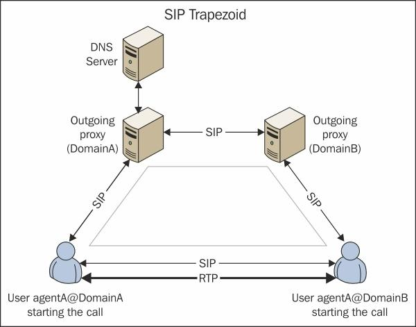
> [OpenSIPS 权威指南 / 第一章：介绍SIP#理解SIP架构](https://erhuabushuo.gitbooks.io/opensips-definitive-guide/content/chapter1.html)
#### B. Components

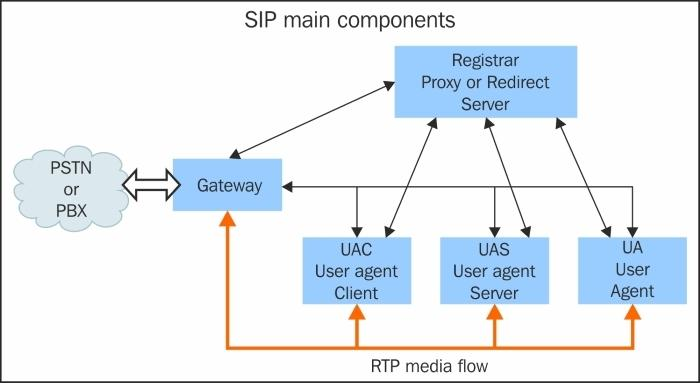
> [OpenSIPS 权威指南 / 第一章：介绍SIP#理解SIP架构](https://erhuabushuo.gitbooks.io/opensips-definitive-guide/content/chapter1.html)
#### C. over PSTN

  ```mermaid
flowchart LR
	UAC[User Agent Client]
	UAS[User Agent Server]

	SGateways[SIP Gateways]
	PSTN[PSTN]
	SGateways_s[SIP Gateways]

	UAC <--> SGateways <--> PSTN <--> SGateways_s  <--> UAS
  ```

## 1.2. Sequence

###  1.2.1. Rigister

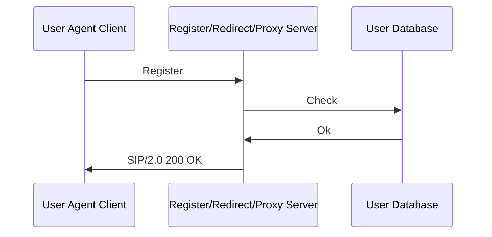
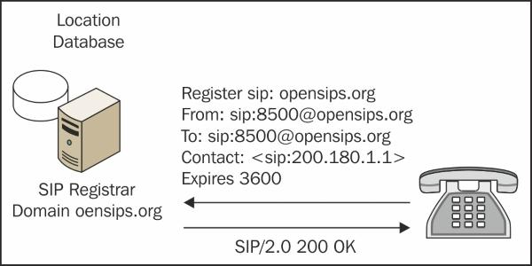

> [OpenSIPS 权威指南 / 第一章：介绍SIP#SIP注册过程](https://erhuabushuo.gitbooks.io/opensips-definitive-guide/content/chapter1.html)

### 1.2.2. A Call

> UAC (User Agent Client) and UAS (User Agent Server)

#### A. Simple


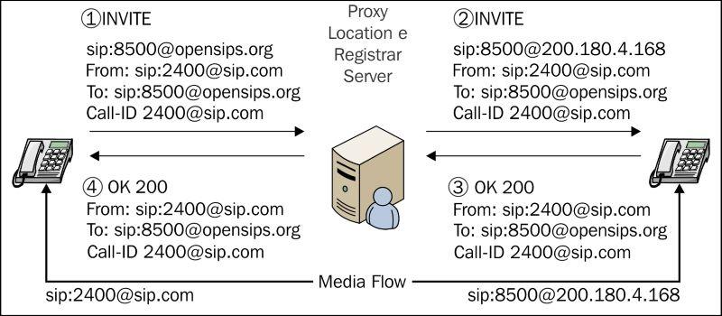

> [OpenSIPS 权威指南 / 第一章：介绍SIP#Proxy 服务器](https://erhuabushuo.gitbooks.io/opensips-definitive-guide/content/chapter1.html)

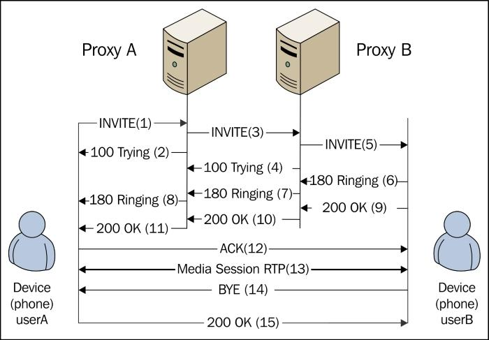
[OpenSIPS 权威指南 / 第一章：介绍SIP#SIP dialog 流程](https://erhuabushuo.gitbooks.io/opensips-definitive-guide/content/chapter1.html)

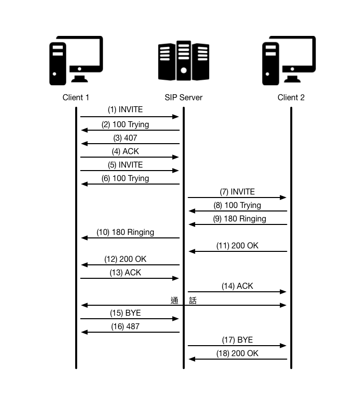
>[SIP 簡介](https://github.com/Ci-Jie/OpenSIPS)
#### B. Redirect

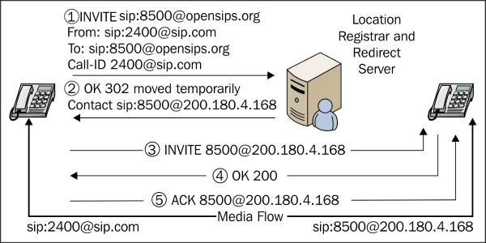

> [OpenSIPS 权威指南 / 第一章：介绍SIP#Redirect 服务器](https://erhuabushuo.gitbooks.io/opensips-definitive-guide/content/chapter1.html)

## 1.3. Requests and Responses 

##### A. Requests/Method

- ACK: Acknowledges an INVITE
- BYE: Terminates an existing session
- CANCEL: Cancels a pending registration
- INFO: Provides mid-call signaling information
- INVITE: Session establishment
- MESSAGE: Instant message transport
- NOTIFY: Sends information after subscribing
- PRACK: Acknowledges a provisional response
- PUBLISH: Uploads the status information to the server
- REFER: Asks another UA to act on Uniform Resource Identifier (URI)
- REGISTER: Registers the user and updates the location table
- SUBSCRIBE: Established a session to receive future updates
- UPDATE: Updates a session state information

##### B. Responses

- 1XX: Information Messages. (訊息通知，請求處理中尚未完成。)
- 2XX: Successful Responses. (請求處理成功。)
- 3XX: Redirection Responses. (重新導向，將請求訊息重新導向至另一個 SIP 元件。)
- 4XX: Request Failure Responses. (客戶端錯誤，錯誤的原因在於請求端。可以矯正後重試。)
- 5XX: Server Failure Responses. (伺服器端錯誤，錯誤的原因在於目的端。可以重試其他的 location。)
- 6XX: Global Failure Responses. (錯誤 - Global Error ，請求失敗且無法重試。)

## 1.4. [SIP 相關的網路協定](https://github.com/Ci-Jie/OpenSIPS#sip-相關的網路協定)
- **SDP (會談描述協定)** : 此協定主要用來協商雙方建立多媒體資料封包通道之用，雙方會在邀請 (INVITE) 訊息的三向交握過程中交換彼此可以使用的通訊方式及資料格式。
- **RTP (即時傳輸協定)** : 此協定用於即時資料傳輸，如影像資料...等，由於 VoIP 所傳輸的多媒體資料大多屬於即時性優先於資料完整性，所以利用 RTP 的特性來編排及傳遞這些資料內容最適合。
- **LDAP (輕量及目錄訪問協定)** : 此協議主要是讓 SIP Server 用來與位址服務的伺服器溝通，以取得每個目的的正確位址。

# 2. SIP Server
## ~~2.1. OpenSIPS~~

> 安裝有難度！

```
# sudo apt-get update
# sudo apt-get install -y git make bison flex mysql-server mysql-client libmysqlclient-dev libncurses5 libncurses5-dev
# git clone https://github.com/OpenSIPS/opensips.git
# mkdir opensips_bin
# export HOMEX_ROOT_DIR=`pwd`/opensips_bin
# cd opensips
# make prefix=$HOMEX_ROOT_DIR all
# make prefix=`pwd`/../opensips_bin install

sudo apt install opensips
sudo apt install opensips-*
sudo apt install mariadb-server

```
## 2.2. Asterisk

> 最後選擇此套件。

### 2.2.1. APT Install
```
sudo apt --yes install asterisk asterisk-dahdi

```
### 2.2.2. Setup 

- [SIP TLS Transport](https://wiki.asterisk.org/wiki/display/AST/SIP+TLS+Transport)

```
ls /etc/asterisk
cd /etc/asterisk
```
```bash
# Backup
sudo cp sip.conf sip.conf-old
sudo cp pjsip.conf pjsip.conf-old
sudo cp extensions.conf extensions.conf-old

# Restore
sudo cp sip.conf-old sip.conf
sudo cp pjsip.conf-old  pjsip.conf
sudo cp extensions.conf-old extensions.conf 
```

#### A. sip*1 - Only SIP Server1

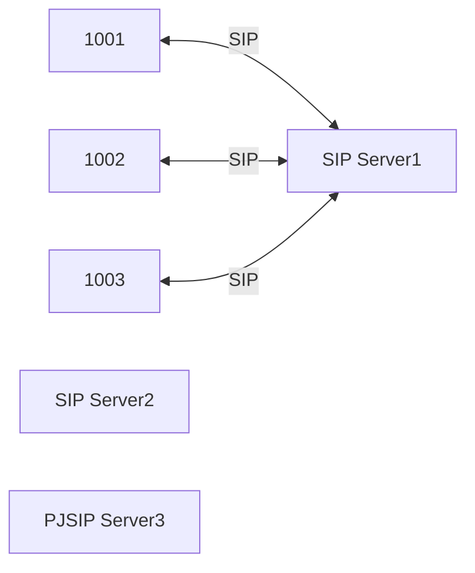

##### A.1. sip.conf

```bash
echo | sudo tee /etc/asterisk/sip.conf
sudo nano /etc/asterisk/sip.conf
```
```conf
[general]
context=default
; Disable overlap dialing support. (Default is yes)
;allowoverlap=no

; IP address to bind UDP listen socket to (0.0.0.0 binds to all)
udpbindaddr=0.0.0.0

; Enable server for incoming TCP connections (default is no)
tcpenable=yes
; IP address for TCP server to bind to (0.0.0.0 binds to all interfaces)
tcpbindaddr=0.0.0.0
; Set the default transports.  The order determines the primary default transport.
transport=udp,tcp

; Enable DNS SRV lookups on outbound calls
srvlookup=yes

;localnet=192.168.50.0/255.255.255.0
;externaddr=8.8.8.8
;nat=yes

; Allow codecs in order of preference
allow=all
; disallow h263 codecs
disallow=h263

; Turn on support for SIP video.
videosupport=always

; Asterisk by default tries to redirect the RTP media stream to go directly from the caller to the callee.
directmedia=yes
; When sending directmedia reinvites, do not send an immediate reinvite on an incoming call leg.
;directmedia=outgoing
; Enable the new experimental direct RTP setup.
;directrtpsetup=yes

[1001]
; Asterisk will create the entity as both a friend and a peer.
type=friend
host=dynamic
secret=1234567890

[1002]
type=friend
host=dynamic
secret=1234567890

[1003]
type=friend
host=dynamic
secret=1234567890

[1004]
type=friend
host=dynamic
secret=1234567890

[1005]
type=friend
host=dynamic
secret=1234567890

[1006]
type=friend
host=dynamic
secret=1234567890

[1007]
type=friend
host=dynamic
secret=1234567890

[1008]
type=friend
host=dynamic
secret=1234567890

[1009]
type=friend
host=dynamic
secret=1234567890

```
##### A.2. extensions.conf

```bash
echo | sudo tee /etc/asterisk/extensions.conf
sudo nano /etc/asterisk/extensions.conf
```
```conf
[general]
static=yes
writeprotect=no
priorityjumping=no
autofallthrough=yes
clearglobalvars=no

[default]
exten => _10XX,1,Dial(SIP/${EXTEN},60,tT)
;exten => _X0XX,1,Dial(SIP/${EXTEN},60,tT)

```

#### B. sip*2 - Add SIP Server2

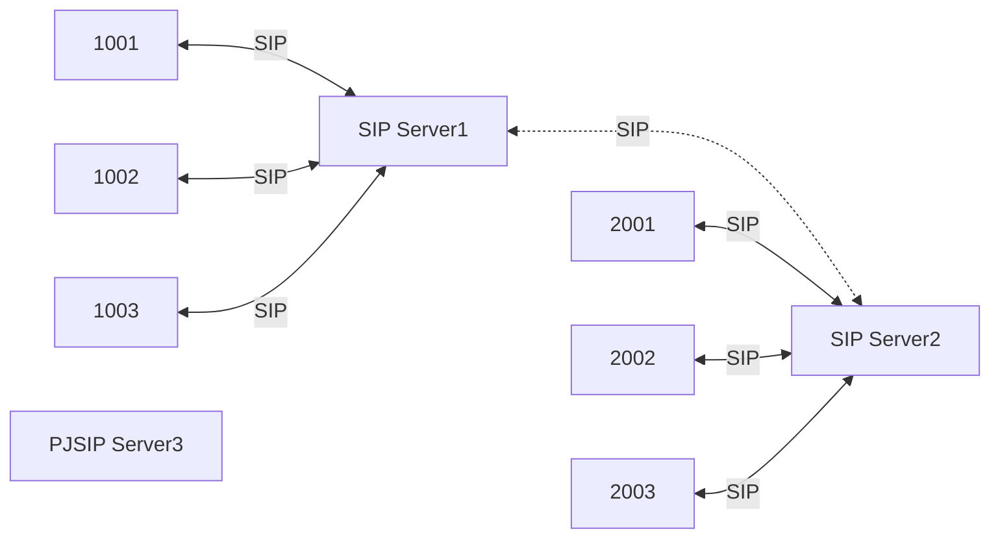

##### A.1. sip.conf

```bash
echo | sudo tee /etc/asterisk/sip.conf
sudo nano /etc/asterisk/sip.conf
```

```conf
[general]
context=default
; Disable overlap dialing support. (Default is yes)
;allowoverlap=no

; IP address to bind UDP listen socket to (0.0.0.0 binds to all)
udpbindaddr=0.0.0.0

; Enable server for incoming TCP connections (default is no)
tcpenable=yes
; IP address for TCP server to bind to (0.0.0.0 binds to all interfaces)
tcpbindaddr=0.0.0.0
; Set the default transports.  The order determines the primary default transport.
transport=udp,tcp

; Enable DNS SRV lookups on outbound calls
srvlookup=yes

;localnet=192.168.50.0/255.255.255.0
;externaddr=8.8.8.8
;nat=yes

; Allow codecs in order of preference
allow=all
; disallow h263 codecs
disallow=h263

; Turn on support for SIP video.
videosupport=always

; Asterisk by default tries to redirect the RTP media stream to go directly from the caller to the callee.
directmedia=yes
; When sending directmedia reinvites, do not send an immediate reinvite on an incoming call leg.
;directmedia=outgoing
; Enable the new experimental direct RTP setup.
;directrtpsetup=yes

[2001]
; Asterisk will create the entity as both a friend and a peer.
type=friend
host=dynamic
secret=1234567890

[2002]
type=friend
host=dynamic
secret=1234567890

[2003]
type=friend
host=dynamic
secret=1234567890

[2004]
type=friend
host=dynamic
secret=1234567890

[2005]
type=friend
host=dynamic
secret=1234567890

[2006]
type=friend
host=dynamic
secret=1234567890

[2007]
type=friend
host=dynamic
secret=1234567890

[2008]
type=friend
host=dynamic
secret=1234567890

[2009]
type=friend
host=dynamic
secret=1234567890

```

##### A.2. extensions.conf

```bash
echo | sudo tee /etc/asterisk/extensions.conf
sudo nano /etc/asterisk/extensions.conf
```

```conf
[general]
static=yes
writeprotect=no
priorityjumping=no
autofallthrough=yes
clearglobalvars=no

[default]
exten => _20XX,1,Dial(SIP/${EXTEN},60,tT)
```

#### C. sip\*2  & pjsip\*1 - Add SIP Server3 (directly access), match=Device's IP

> pjsip 對於 transport 限制很多，如果設定為 udp，你的 client 端也請指定 udp。
>
> 1001 dial 30XX@192.168.50.52
>
> 1002 dial 30XX@192.168.50.52
>
> 1003 can't dial 30XX@192.168.50.52
>
> 20xx can't dial 30XX@192.168.50.52
>
> 3001 dial 10XX@192.168.50.9, 20XX@192.168.50.9

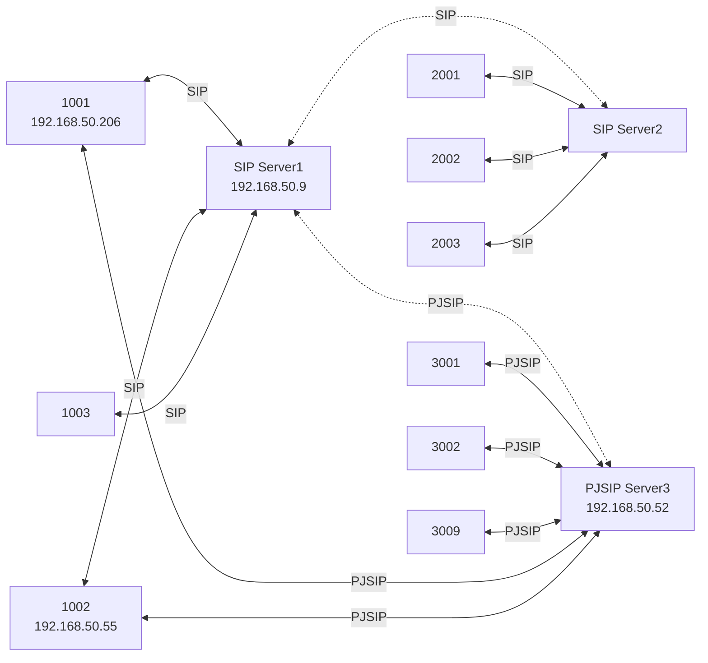

##### C.1. pjsip.conf

```bash
echo | sudo tee /etc/asterisk/pjsip.conf
sudo nano /etc/asterisk/pjsip.conf
```

```conf
;https://wiki.asterisk.org/wiki/display/AST/PJSIP+Configuration+Sections+and+Relationships
;[global]
; The order by which endpoint identifiers are given priority.
; Currently, "ip", "header", "username", "auth_username" and "anonymous"
; (default: ip,username,anonymous)
;endpoint_identifier_order=anonymous,username,ip

[transport-udp]
; Configures res_pjsip transport layer interaction.
type=transport
; Protocol to use for SIP traffic (default: "udp")
protocol=udp
; IP Address and optional port to bind to for this transport (default: "")
;儘量使用指定的 IP
;bind=0.0.0.0
bind=192.168.50.52

[transport-tcp]
type=transport
protocol=tcp
;bind=0.0.0.0
bind=192.168.50.52

[3001]
; Configures core SIP functionality related to SIP endpoints.
type=endpoint
; Authentication object to be used for outbound registrations (default: "")
outbound_auth=3001_auth
; AoR s to be used with the endpoint (default: "")
aors=3001
; Explicit transport configuration to use (default: "")
transport=transport-tcp
; Dialplan context for inbound sessions (default: "default")
context=default
; Media Codec s to disallow (default: "")
disallow=all
; Media Codec s to allow (default: "")
allow=ulaw
; DTMF mode (default: "rfc4733")
dtmf_mode=inband
; Force use of return port (default: "yes")
;force_rport=yes
; Enable the ICE mechanism to help traverse NAT (default: "no")
;ice_support=yes
; Determines whether media may flow directly between endpoints (default: "yes")
;direct_media=no
; Enforce that RTP must be symmetric (default: "no")
;rtp_symmetric=yes
; Allow Contact header to be rewritten with the source P address port (default: "no")
;rewrite_contact=yes

[3001_auth]
; Stores inbound or outbound authentication credentials for use by trunks, endpoints, registrations.
type=auth
; Authentication type (default: "userpass")
auth_type=userpass
; Username to use for account (default: "")
username=3001
; PlainText password used for authentication (default: "")
password=1234567890

[3001]
; Stores contact information for use by endpoints.
type=aor
; Maximum number of contacts that can bind to an AoR (default: "0")
max_contacts=1
; Allow a registration to succeed by displacing any existing contacts that now exceed the max_contacts count.
remove_existing=yes

[3002]
type=endpoint
outbound_auth=3002_auth
aors=3002
transport=transport-tcp
context=default
disallow=all
allow=ulaw

[3002_auth]
type=auth
auth_type=userpass
username=3002
password=1234567890

[3002]
type=aor
max_contacts=1
remove_existing=yes

[3009]
type=endpoint
outbound_auth=3009_auth
aors=3009
transport=transport-tcp
context=default
disallow=all
allow=ulaw

[3009_auth]
type=auth
auth_type=userpass
username=3009
password=1234567890

[3009]
type=aor
max_contacts=1
remove_existing=yes

[SIP1]
type=endpoint
aors=SIP1
transport=transport-tcp
context=default
disallow=all
allow=ulaw

[SIP1]
; Maps a host directly to an endpoint
type=identify
endpoint=SIP1
match=192.168.50.206, 192.168.50.55
;match=192.168.50.0/24
; SIP header with specified value to match against (default: "")
;match_header=To: <sip:3002@192.168.50.52>
;match_header=User-Agent: LinphoneiOS/5.0.2 (iPhone) LinphoneSDK/5.2.32

;[SIP1]
;type=aor
;contact=sip:192.168.50.9:5060

```

##### C.2. extensions.conf

```bash
echo | sudo tee /etc/asterisk/extensions.conf
sudo nano /etc/asterisk/extensions.conf
```

```conf
[general]
static=yes
writeprotect=no
clearglobalvars=no

[default]
exten => _30XX,1,Dial(PJSIP/${EXTEN},12,tT)
exten => _30XX,n,Answer()
exten => _30XX,n,SayDigits(${EXTEN})
exten => _30XX,n,Playback(invalid)
;exten => _30XX,n,Playback(transfer,skip)		; "Please hold while..."
;exten => _30XX,n,Playback(demo-thanks)	; "Thanks for trying the demo"
;exten => _30XX,n,Playback(invalid)		; "That's not valid, try again"
;exten => _30XX,n,Playback(demo-abouttotry)	; Let them know what's going on
;exten => _30XX,n,Playback(demo-nogo)	; Couldn't connect to the demo site
exten => _30XX,n,Hangup()

```

#### D. sip\*2  & pjsip\*1 - SIP Server3 (bridge mode), match=SIPServer's IP

> 10XX dial 30XX@192.168.50.9 -> 30XX@192.168.50.52
>
> 20xx can't dial 30XX@192.168.50.52
>
> 30XX dial 10XX@192.168.50.52 -> 10XX@192.168.50.9

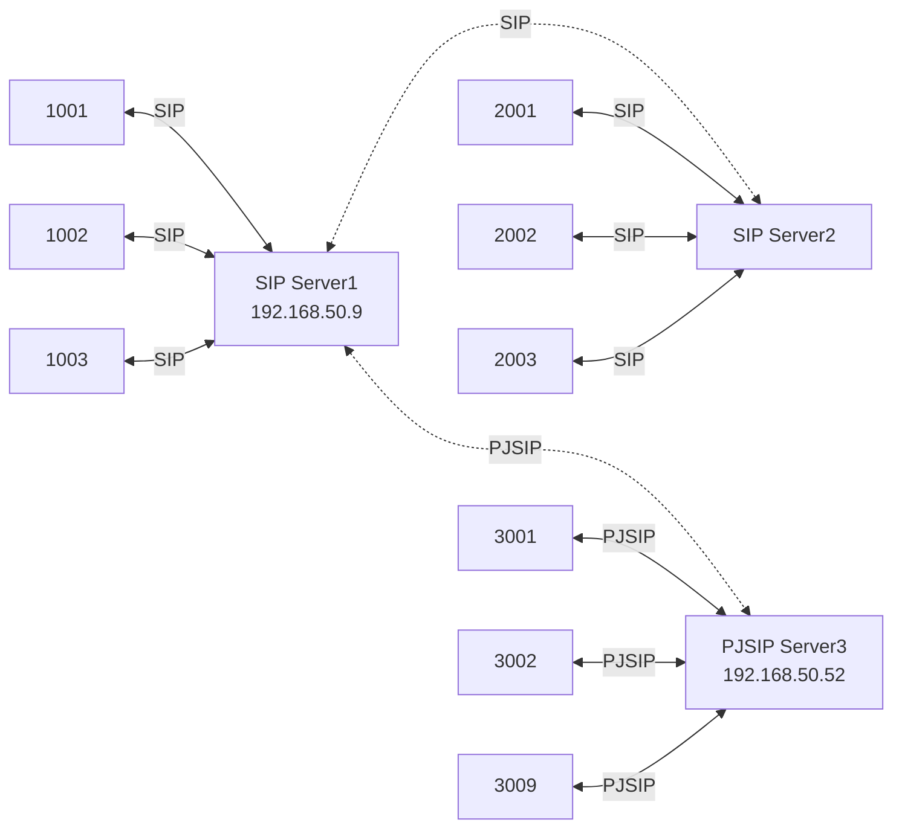

##### D.1. Dial ${EXTEN}@192.168.50.52

| Filename        | sip (192.168.50.9)                                           | pjsip (192.168.50.52)                                        |
| --------------- | ------------------------------------------------------------ | ------------------------------------------------------------ |
| extensions.conf | [default]<br/>exten => _10XX,1,Dial(SIP/${EXTEN},60,tT)<br/>exten => _30XX,1,Dial(SIP/${EXTEN}@192.168.50.52) | C.1.                                                         |
| sip.conf        | A.1.                                                         | No chanage                                                   |
| pjsip.conf      | No chanage                                                   | [SIP1]<br/>type=endpoint<br/>aors=SIP1<br/>transport=transport-tcp<br/>context=default<br/>disallow=all<br/>allow=ulaw<br/><br/>[SIP1]<br/>; Maps a host directly to an endpoint<br/>type=identify<br/>endpoint=SIP1<br/>match=192.168.50.9<br/>;match=192.168.50.206, 192.168.50.55 |

##### D.2. Dial ${EXTEN}@${DEST_IP} with Set(DEST_IP=192.168.50.52)

| Filename        | sip (192.168.50.9)                                           | pjsip (192.168.50.52) |
| --------------- | ------------------------------------------------------------ | --------------------- |
| extensions.conf | [default]<br/>exten => _10XX,1,Dial(SIP/${EXTEN},60,tT)<br/>;exten => _30XX,1,Dial(SIP/${EXTEN}@192.168.50.52)<br/>exten => _30XX,1,Set(DEST_IP=192.168.50.52)<br/>same => n,Dial(SIP/${EXTEN}@${DEST_IP}) | C.1.                  |
| sip.conf        | A.1.                                                         | No chanage            |
| pjsip.conf      | No chanage                                                   | D.1.                  |

##### D.3. Dial ${EXTEN}@${DEST_IP} with globals variable

| Filename        | sip (192.168.50.9)                                           | pjsip (192.168.50.52) |
| --------------- | ------------------------------------------------------------ | --------------------- |
| extensions.conf | [globals]<br/>DEST_IP=192.168.50.52<br/><br/>[default]<br/>exten => _10XX,1,Dial(SIP/${EXTEN},60,tT)<br/>;exten => _30XX,1,Dial(SIP/${EXTEN}@192.168.50.52)<br/>;exten => _30XX,1,Set(DEST_IP=192.168.50.52)<br/>;same => n,Dial(SIP/${EXTEN}@${DEST_IP})<br/>exten => _30XX,1,Dial(SIP/${EXTEN}@${DEST_IP}) | C.1.                  |
| sip.conf        | A.1.                                                         | No chanage            |
| pjsip.conf      | No chanage                                                   | D.1.                  |

##### D.4. Dial ${EXTEN}@${DEST_IP}, only 1009

| Filename        | sip (192.168.50.9)                                           | pjsip (192.168.50.52) |
| --------------- | ------------------------------------------------------------ | --------------------- |
| extensions.conf | ;[globals]<br/>;DEST_IP=192.168.50.52<br/><br/>[default]<br/>exten => _10XX,1,Dial(SIP/${EXTEN},60,tT)<br/>;exten => _30XX,1,Dial(SIP/${EXTEN}@192.168.50.52)<br/>;exten => _30XX,1,Set(DEST_IP=192.168.50.52)<br/>;same => n,Dial(SIP/${EXTEN}@${DEST_IP})<br/>exten => _30XX,1,Dial(SIP/${EXTEN}@${DEST_IP}) | C.1.                  |
| sip.conf        | [1009]<br/>type=friend<br/>host=dynamic<br/>secret=1234567890<br/>setvar=DEST_IP=192.168.50.52 | No chanage            |
| pjsip.conf      | No chanage                                                   | D.1.                  |

#### E. pjsip\*2 - Only SIP Server 1 and 3 (bridge mode)

> 10XX dial 30XX@192.168.50.9 -> 30XX@192.168.50.52
>
> 30XX dial 10XX@192.168.50.52 -> 10XX@192.168.50.9

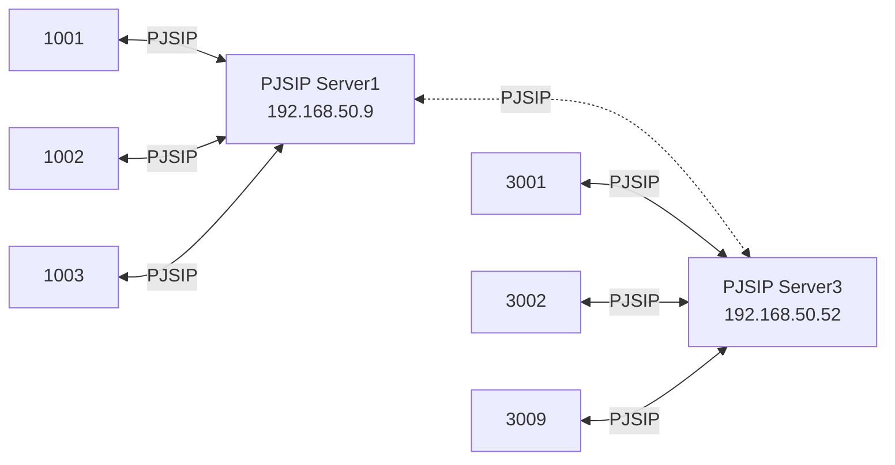

##### E.1. pjsip.conf

```bash
echo | sudo tee /etc/asterisk/pjsip.conf
sudo nano /etc/asterisk/pjsip.conf
```

###### E.1.1.  SIP1 (192.168.50.9)

```conf
;https://wiki.asterisk.org/wiki/display/AST/PJSIP+Configuration+Sections+and+Relationships
[transport-udp]
; Configures res_pjsip transport layer interaction.
type=transport
; Protocol to use for SIP traffic (default: "udp")
protocol=udp
; IP Address and optional port to bind to for this transport (default: "")
;儘量使用指定的 IP
;bind=0.0.0.0
bind=192.168.50.9

[transport-tcp]
type=transport
protocol=tcp
;bind=0.0.0.0
bind=192.168.50.9

[1001]
; Configures core SIP functionality related to SIP endpoints.
type=endpoint
; Authentication object to be used for outbound registrations (default: "")
outbound_auth=1001_auth
; AoR s to be used with the endpoint (default: "")
aors=1001
; Explicit transport configuration to use (default: "")
transport=transport-udp
; Dialplan context for inbound sessions (default: "default")
context=default
; Media Codec s to disallow (default: "")
disallow=all
; Media Codec s to allow (default: "")
allow=ulaw
; DTMF mode (default: "rfc4733")
dtmf_mode=inband
; Force use of return port (default: "yes")
;force_rport=yes
; Enable the ICE mechanism to help traverse NAT (default: "no")
;ice_support=yes
; Determines whether media may flow directly between endpoints (default: "yes")
;direct_media=no
; Enforce that RTP must be symmetric (default: "no")
;rtp_symmetric=yes
; Allow Contact header to be rewritten with the source P address port (default: "no")
;rewrite_contact=yes

[1001_auth]
; Stores inbound or outbound authentication credentials for use by trunks, endpoints, registrations.
type=auth
; Authentication type (default: "userpass")
auth_type=userpass
; Username to use for account (default: "")
username=3001
; PlainText password used for authentication (default: "")
password=1234567890

[1001]
; Stores contact information for use by endpoints.
type=aor
; Maximum number of contacts that can bind to an AoR (default: "0")
max_contacts=1
; Allow a registration to succeed by displacing any existing contacts that now exceed the max_contacts count.
remove_existing=yes

[1002]
type=endpoint
outbound_auth=1002_auth
aors=1002
transport=transport-tcp
context=default
disallow=all
allow=ulaw

[1002_auth]
type=auth
auth_type=userpass
username=1002
password=1234567890

[1002]
type=aor
max_contacts=1
remove_existing=yes

[1009]
type=endpoint
outbound_auth=1009_auth
aors=1009
transport=transport-tcp
context=default
disallow=all
allow=ulaw

[1009_auth]
type=auth
auth_type=userpass
username=1009
password=1234567890

[1009]
type=aor
max_contacts=1
remove_existing=yes

; SIP3 --> Myself (SIP1)
[SIP3]
type=endpoint
aors=SIP3
transport=transport-tcp
context=default
disallow=all
allow=ulaw

[SIP3]
; Maps a host directly to an endpoint
type=identify
endpoint=SIP3
match=192.168.50.52
;match=192.168.50.206, 192.168.50.55
;match=192.168.50.0/24
; SIP header with specified value to match against (default: "")
;match_header=To: <sip:3002@192.168.50.52>
;match_header=User-Agent: LinphoneiOS/5.0.2 (iPhone) LinphoneSDK/5.2.32

[SIP3]
type=aor
contact=sip:192.168.50.52

```

###### E.1.2.  SIP3 (192.168.50.52)

```conf
;https://wiki.asterisk.org/wiki/display/AST/PJSIP+Configuration+Sections+and+Relationships
[transport-udp]
; Configures res_pjsip transport layer interaction.
type=transport
; Protocol to use for SIP traffic (default: "udp")
protocol=udp
; IP Address and optional port to bind to for this transport (default: "")
;儘量使用指定的 IP
;bind=0.0.0.0
bind=192.168.50.52

[transport-tcp]
type=transport
protocol=tcp
;bind=0.0.0.0
bind=192.168.50.52

[3001]
; Configures core SIP functionality related to SIP endpoints.
type=endpoint
; Authentication object to be used for outbound registrations (default: "")
outbound_auth=3001_auth
; AoR s to be used with the endpoint (default: "")
aors=3001
; Explicit transport configuration to use (default: "")
transport=transport-udp
; Dialplan context for inbound sessions (default: "default")
context=default
; Media Codec s to disallow (default: "")
disallow=all
; Media Codec s to allow (default: "")
allow=ulaw
; DTMF mode (default: "rfc4733")
dtmf_mode=inband
; Force use of return port (default: "yes")
;force_rport=yes
; Enable the ICE mechanism to help traverse NAT (default: "no")
;ice_support=yes
; Determines whether media may flow directly between endpoints (default: "yes")
;direct_media=no
; Enforce that RTP must be symmetric (default: "no")
;rtp_symmetric=yes
; Allow Contact header to be rewritten with the source P address port (default: "no")
;rewrite_contact=yes

[3001_auth]
; Stores inbound or outbound authentication credentials for use by trunks, endpoints, registrations.
type=auth
; Authentication type (default: "userpass")
auth_type=userpass
; Username to use for account (default: "")
username=3001
; PlainText password used for authentication (default: "")
password=1234567890

[3001]
; Stores contact information for use by endpoints.
type=aor
; Maximum number of contacts that can bind to an AoR (default: "0")
max_contacts=1
; Allow a registration to succeed by displacing any existing contacts that now exceed the max_contacts count.
remove_existing=yes

[3002]
type=endpoint
outbound_auth=3002_auth
aors=3002
transport=transport-tcp
context=default
disallow=all
allow=ulaw

[3002_auth]
type=auth
auth_type=userpass
username=3002
password=1234567890

[3002]
type=aor
max_contacts=1
remove_existing=yes

[3009]
type=endpoint
outbound_auth=3009_auth
aors=3009
transport=transport-tcp
context=default
disallow=all
allow=ulaw

[3009_auth]
type=auth
auth_type=userpass
username=3009
password=1234567890

[3009]
type=aor
max_contacts=1
remove_existing=yes

; SIP1 --> Myself (SIP3)
[SIP1]
type=endpoint
aors=SIP1
transport=transport-tcp
context=default
disallow=all
allow=ulaw

[SIP1]
; Maps a host directly to an endpoint
type=identify
endpoint=SIP1
match=192.168.50.9
;match=192.168.50.206, 192.168.50.55
;match=192.168.50.0/24
; SIP header with specified value to match against (default: "")
;match_header=To: <sip:1001@192.168.50.9>
;match_header=User-Agent: LinphoneiOS/5.0.2 (iPhone) LinphoneSDK/5.2.32

[SIP1]
type=aor
contact=sip:192.168.50.9

```

##### E.2. extensions.conf

```bash
echo | sudo tee /etc/asterisk/extensions.conf
sudo nano /etc/asterisk/extensions.conf
```

###### E.2.1.  SIP1 (192.168.50.9)

```conf
[general]
static=yes
writeprotect=no
clearglobalvars=no

[default]
exten => _10XX,1,Dial(PJSIP/${EXTEN},12,tT)
exten => _10XX,n,Answer()
exten => _10XX,n,SayDigits(${EXTEN})
exten => _10XX,n,Playback(invalid)
;exten => _10XX,n,Playback(transfer,skip)		; "Please hold while..."
;exten => _10XX,n,Playback(demo-thanks)	; "Thanks for trying the demo"
;exten => _10XX,n,Playback(invalid)		; "That's not valid, try again"
;exten => _10XX,n,Playback(demo-abouttotry)	; Let them know what's going on
;exten => _10XX,n,Playback(demo-nogo)	; Couldn't connect to the demo site
exten => _10XX,n,Hangup()

exten => _30XX,1,Dial(PJSIP/${EXTEN}@SIP3)
same =>> n,Hangup()

```

###### E.2.2.  SIP3 (192.168.50.52)

```conf
[general]
static=yes
writeprotect=no
clearglobalvars=no

[default]
exten => _30XX,1,Dial(PJSIP/${EXTEN},12,tT)
exten => _30XX,n,Answer()
exten => _30XX,n,SayDigits(${EXTEN})
exten => _30XX,n,Playback(invalid)
;exten => _30XX,n,Playback(transfer,skip)		; "Please hold while..."
;exten => _30XX,n,Playback(demo-thanks)	; "Thanks for trying the demo"
;exten => _30XX,n,Playback(invalid)		; "That's not valid, try again"
;exten => _30XX,n,Playback(demo-abouttotry)	; Let them know what's going on
;exten => _30XX,n,Playback(demo-nogo)	; Couldn't connect to the demo site
exten => _30XX,n,Hangup()

exten => _10XX,1,Dial(PJSIP/${EXTEN}@SIP1)
same =>> n,Hangup()

```

### 2.2.3. Service 

```bash
$ sudo systemctl restart asterisk

$ sudo systemctl status asterisk

$ sudo systemctl start asterisk

$ systemctl unmask asterisk.service

$ sudo systemctl stop asterisk
```

### 2.2.4. asterisk CLI

```bash
$ sudo asterisk -rvvvvv
[sudo] password for lanka:
Asterisk 16.2.1~dfsg-2ubuntu1, Copyright (C) 1999 - 2018, Digium, Inc. and others.
Created by Mark Spencer <markster@digium.com>
Asterisk comes with ABSOLUTELY NO WARRANTY; type 'core show warranty' for details.
This is free software, with components licensed under the GNU General Public
License version 2 and other licenses; you are welcome to redistribute it under
certain conditions. Type 'core show license' for details.
=========================================================================
Connected to Asterisk 16.2.1~dfsg-2ubuntu1 currently running on build20-vbx (pid = 1940)

```

#### A. [Debug](https://wiki.asterisk.org/wiki/display/AST/Collecting+Debug+Information)

| Module (version)                | CLI Command           |
| :------------------------------ | :-------------------- |
| New PJSIP driver (12 or higher) | `pjsip set logger on` |
| SIP (1.6.0 or higher)           | `sip set debug on`    |
| SIP (1.4)                       | `sip set debug`       |
| IAX2 (1.6.0 or higher)          | `iax2 set debug on`   |
| IAX2 (1.4)                      | `iax2 set debug`      |
| CDR engine                      | `cdr set debug on`    |

#### B. Commands

```bash
pjsip set logger on

sip set debug on

pjsip show endpoints

pjsip show contacts

database deltree registrar/contact
```

## ~~2.3. [FreeSWITCH-1.10.6-Release-x64.msi](https://files.freeswitch.org/windows/installer/x64/FreeSWITCH-1.10.6-Release-x64.msi)~~

> 除了版權問題，設定起來也不方便。

```
https://freeswitch.org/confluence/display/FREESWITCH/Windows+Install
https://files.freeswitch.org/windows/installer/x64/

C:\ProgramData\Microsoft\Windows\Start Menu\Programs\FreeSWITCH
以系統管理員身分執行 FreeSWITCH

以系統管理員身分執行 FS_Cli
```

- command

```
/help
/exit
```

- C:\Program Files\FreeSWITCH\conf\vars.xml

```
<X-PRE-PROCESS cmd="set" data="default_password=1234"/>

<X-PRE-PROCESS cmd="set" data="internal_sip_port=5060"/>
<X-PRE-PROCESS cmd="set" data="internal_tls_port=5061"/>
```

```
<X-PRE-PROCESS cmd="set" data="internal_ssl_dir=E:\work\sip\cert"/>
<X-PRE-PROCESS cmd="set" data="internal_ssl_dir=$${base_dir}/conf/ssl"/>
```

- C:\Program Files\FreeSWITCH\conf\directory\default\

```
1000.xml~1019.xml
```

- C:\Program Files\FreeSWITCH\conf\sip_profiles\internal.xml

```
<!-- ip address to use for rtp, DO NOT USE HOSTNAMES ONLY IP ADDRESSES -->
<param name="rtp-ip" value="$${local_ip_v4}"/>
<!-- ip address to bind to, DO NOT USE HOSTNAMES ONLY IP ADDRESSES -->
<param name="sip-ip" value="$${local_ip_v4}"/>
```

- C:\Program Files\FreeSWITCH\conf\autoload_configs\sofia.conf.xml

```
<param name="auto-restart" value="false"/>
```

- C:\Program Files\FreeSWITCH\conf\autoload_configs\modules.conf.xml

```
<!--<load module="mod_signalwire"/> -->
```

# 3. Client
## 3.1. linphone
```
https://www.linphone.org
```
### 3.1.1. USE A SIPACCOUNT
```
Username: 1001
SIP Domain: 192.168.50.9
Password: 1234567890
Transport: TCP
```
### 3.1.2. Make a call
```
sip:1009@192.168.50.9
```
## 3.2. MicroSIP
```
https://www.microsip.org
```

# Appendix

# I. Study

## I.1. [OpenSIPS 权威指南](https://www.gitbook.com/book/erhuabushuo/opensips-definitive-guide)

## I.2. [SIP 簡介](https://github.com/Ci-Jie/OpenSIPS)

## I.3. [Asterisk Project](https://wiki.asterisk.org/wiki/display/AST)

## I.4. Youtube - [How to Setup FreePBX Server on AWS (VoIP Asterisk Solution)](https://www.youtube.com/watch?v=MVoI8Qv5tFU)

## I.5. [Asterisk CLI 進階用法](http://www.osslab.tw:8880/index.php?title=VoIP/IP_PBX/軟體式_IP_PBX/Asterisk_-_免費_IP_PBX_網路電話交換平台/Tips/CLI_進階用法)

# II. Debug

# III. Glossary

# IV. Tool Usage

## IV.1. [asterisk cli Usage](https://wiki.asterisk.org/wiki/display/AST/Asterisk+Command+Line+Interface)

```bash
$ asterisk -V
Asterisk 16.2.1~dfsg-2ubuntu1
$ sudo asterisk -rvvvvv
[sudo] password for lanka:
Asterisk 16.2.1~dfsg-2ubuntu1, Copyright (C) 1999 - 2018, Digium, Inc. and others.
Created by Mark Spencer <markster@digium.com>
Asterisk comes with ABSOLUTELY NO WARRANTY; type 'core show warranty' for details.
This is free software, with components licensed under the GNU General Public
License version 2 and other licenses; you are welcome to redistribute it under
certain conditions. Type 'core show license' for details.
=========================================================================
Connected to Asterisk 16.2.1~dfsg-2ubuntu1 currently running on build20-vbx (pid = 1940)
build20-vbx*CLI>?
!              acl            ael            agent          agi            aoc            ari            bridge         calendar       cc             cdr
cel            channel        cli            confbridge     config         core           database       devstate       dialplan       dnsmgr         fax
features       file           group          hangup         help           http           iax2           indication     keys           local          logger
malloc         manager        media          mgcp           minivm         mixmonitor     module         moh            no             odbc           originate
parking        phoneprov      pjproject      pjsip          presencestate  pri            queue          realtime       reload         rtcp           rtp
say            sip            sorcery        stun           test           timing         udptl          ulimit         voicemail      xmldoc         xmpp

```

#### A. pjsip

```bash
build20-vbx*CLI> core show help pjsip
pjsip dump endpt               -- Dump the res_pjsip endpt internals
pjsip export config_wizard primitives [to] -- Export config wizard primitives
pjsip list aors                -- List PJSIP Aors
pjsip list auths               -- List PJSIP Auths
pjsip list channels            -- List PJSIP Channels
pjsip list ciphers             -- List available OpenSSL cipher names
pjsip list contacts            -- List PJSIP Contacts
pjsip list endpoints           -- List PJSIP Endpoints
pjsip list identifies          -- List PJSIP Identifies
pjsip list registrations       -- List PJSIP Registrations
pjsip list subscriptions {inbound|outbound} [like] -- List active inbound/outbound subscriptions
pjsip list transports          -- List PJSIP Transports
pjsip qualify                  -- Send an OPTIONS request to a PJSIP endpoint
pjsip reload qualify aor       -- Synchronize the PJSIP Aor qualify options
pjsip reload qualify endpoint  -- Synchronize the qualify options for all Aors on the PJSIP endpoint
pjsip reload                   -- <no description available>
pjsip send notify              -- Send a NOTIFY request to a SIP endpoint
pjsip send register            -- Registers an outbound registration target
pjsip send unregister          -- Unregisters outbound registration target
pjsip set history {on|off|clear} -- Enable/Disable PJSIP History
pjsip set logger {on|off|host} -- Enable/Disable PJSIP Logger Output
pjsip show aors                -- Show PJSIP Aors
pjsip show aor                 -- Show PJSIP Aor
pjsip show auths               -- Show PJSIP Auths
pjsip show auth                -- Show PJSIP Auth
pjsip show channels            -- Show PJSIP Channels
pjsip show channel             -- Show PJSIP Channel
pjsip show channelstats        -- Show PJSIP Channel Stats
pjsip show contacts            -- Show PJSIP Contacts
pjsip show contact             -- Show PJSIP Contact
pjsip show endpoints           -- Show PJSIP Endpoints
pjsip show endpoint            -- Show PJSIP Endpoint
pjsip show history             -- Display PJSIP History
pjsip show identifiers         -- List registered endpoint identifiers
pjsip show identifies          -- Show PJSIP Identifies
pjsip show identify            -- Show PJSIP Identify
pjsip show qualify aor         -- Show the PJSIP Aor current qualify options
pjsip show qualify endpoint    -- Show the current qualify options for all Aors on the PJSIP endpoint
pjsip show registrations       -- Show PJSIP Registrations
pjsip show registration        -- Show PJSIP Registration
pjsip show scheduled_tasks     -- Show all scheduled tasks
pjsip show settings            -- Show global and system configuration options
pjsip show subscription {inbound|outbound} -- Show active subscription details
pjsip show subscriptions {inbound|outbound} [like] -- Show active inbound/outbound subscriptions
pjsip show transports          -- Show PJSIP Transports
pjsip show transport           -- Show PJSIP Transport
pjsip show unidentified_requests -- Show PJSIP Unidentified Requests
pjsip show version             -- Show the version of pjproject in use
Really destroying SIP dialog '3b7e21ec46b54d2ab813c44c1a77b121' Method: REGISTER
build20-vbx*CLI>

```

#### B. sip

```bash
build20-vbx*CLI> core show help sip
sip notify                     -- Send a notify packet to a SIP peer
sip prune realtime [peer|all]  -- Prune cached Realtime users/peers
sip qualify peer               -- Send an OPTIONS packet to a peer
sip reload                     -- Reload SIP configuration
sip set debug {on|off|ip|peer} -- Enable/Disable SIP debugging
sip set history {on|off}       -- Enable/Disable SIP history
sip show {channels|subscriptions} -- List active SIP channels or subscriptions
sip show channelstats          -- List statistics for active SIP channels
sip show channel               -- Show detailed SIP channel info
sip show domains               -- List our local SIP domains
sip show history               -- Show SIP dialog history
sip show inuse [all]           -- List all inuse/limits
sip show mwi                   -- Show MWI subscriptions
sip show objects               -- List all SIP object allocations
sip show peers [like]          -- List defined SIP peers
sip show peer                  -- Show details on specific SIP peer
sip show registry              -- List SIP registration status
sip show sched                 -- Present a report on the status of the scheduler queue
sip show settings              -- Show SIP global settings
sip show tcp                   -- List TCP Connections
sip show users [like]          -- List defined SIP users
sip show user                  -- Show details on specific SIP user
sip unregister                 -- Unregister (force expiration) a SIP peer from the registry

```

# V. ErrorNO

```
100	正在嘗試	
180	正在撥打	
181	正在轉接	
182	正在排隊	
183	通話進展	
200	OK	        
202	被接受	    
300	多項選擇	  
301	被永久遷移	
302	被暫時遷移	
305	使用代理伺服器
380	替代服務
400	呼叫不當
401	未經授權
402	要求付費
403	被禁止的
404	未發現用戶
405	不允許的方法
406	不可接受的
407	需要代理伺服器授權
408	呼叫超時	                  
410	用戶曾經存在，但現在不存在	
413	呼叫實體過大	              
414	呼叫 URI 過長	              
415	不支援的媒體類型	          
416	不支援的 URI 方案	          
420	不當擴展	                  
421	需要擴展	                  
423	時間間隔過短	              
480	暫時不可以使用	            
481	通話/事務不存在
482	檢測到迴圈
483	跳數過多
484	位址不全
485	模糊不清
486	忙碌中
487	呼叫被終止
488	此處不可接受
491	呼叫待批
493	無法解讀
500	伺服器內部錯誤
501	SIP 呼叫方法在此無法實施
502	不當閘道
503	服務不可使用
504	伺服器超時
505	伺服器不支援 SIP 協定的這個版本
513	消息過長
600	各處忙碌
603	拒絕
604	無處存在
605	不可使用
```

