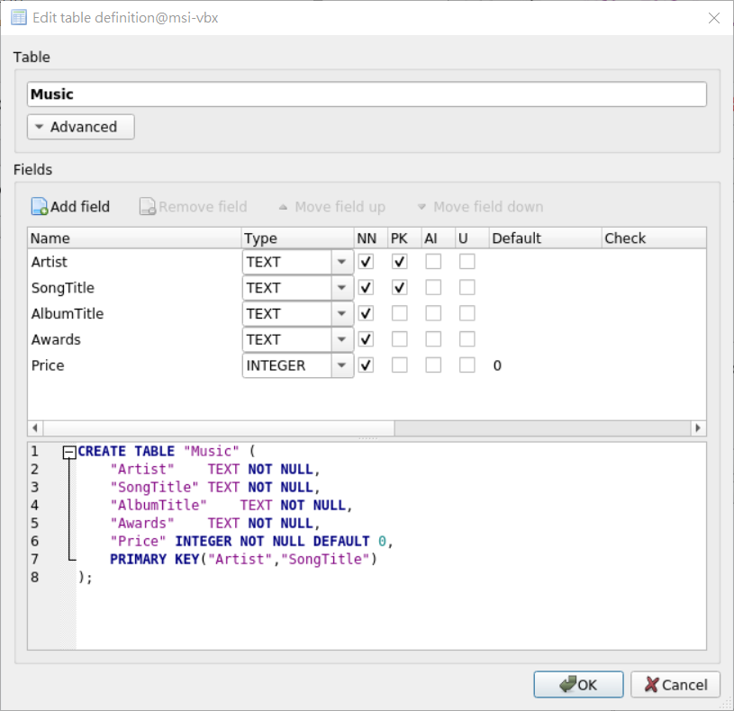
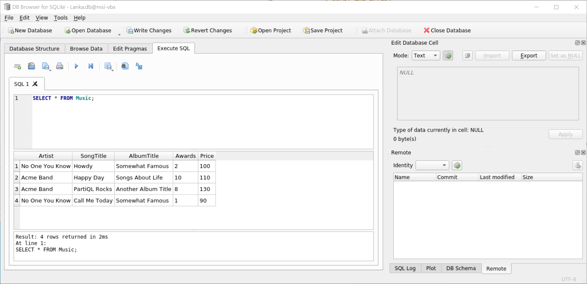
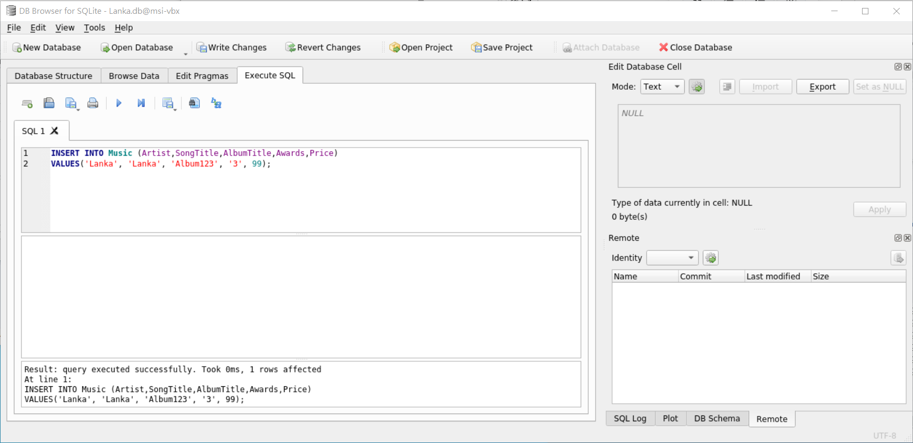

# [SQLite](https://github.com/sqlite/sqlite)
[](https://github.com/lankahsu520/HelperX)
[![GitHub license][license-image]][license-url]
[![GitHub stars][stars-image]][stars-url]
[![GitHub forks][forks-image]][forks-url]
[![GitHub issues][issues-image]][issues-image]
[![GitHub watchers][watchers-image]][watchers-image]

[license-image]: https://img.shields.io/github/license/lankahsu520/HelperX.svg
[license-url]: https://github.com/lankahsu520/HelperX/blob/master/LICENSE
[stars-image]: https://img.shields.io/github/stars/lankahsu520/HelperX.svg
[stars-url]: https://github.com/lankahsu520/HelperX/stargazers
[forks-image]: https://img.shields.io/github/forks/lankahsu520/HelperX.svg
[forks-url]: https://github.com/lankahsu520/HelperX/network
[issues-image]: https://img.shields.io/github/issues/lankahsu520/HelperX.svg
[issues-url]: https://github.com/lankahsu520/HelperX/issues
[watchers-image]: https://img.shields.io/github/watchers/lankahsu520/HelperX.svg
[watchers-url]: https://github.com/lankahsu520/HelperX/watchers

# 1. Overview

> SQLite is a C-language library that implements a small, fast, self-contained, high-reliability, full-featured, SQL database engine.

## 1.1. Install SQLite 3

```bash
$ sudo apt update
$ sudo apt install sqlite3
$ sqlite3 --version
3.31.1 2020-01-27 19:55:54 3bfa9cc97da10598521b342961df8f5f68c7388fa117345eeb516eaa837balt1

```

## 1.2. Installing SQLite browser

```bash
$ sudo apt install sqlitebrowser
$ sqlitebrowser -v
This is DB Browser for SQLite version 3.11.2.
```

# 2. sqlite3

```bash
$ sqlite3 Lanka.db
SQLite version 3.31.1 2020-01-27 19:55:54
Enter ".help" for usage hints.
sqlite>
```

#### A. List database

```bash
sqlite> .databases
main: /work/codebase/Lanka.db
```

#### B. Quit

```bash
sqlite> .quit
```

#### C. Attributes

```bash
# 顯示表格欄位名稱
sqlite> .header on
# 以欄位表示
sqlite> .mode column
# 設定欄位寬度
sqlite> .width 10 20 30 40
sqlite> .timer on
```

#### D. SQL command

>
> 結束符號 ;

```bash
sqlite> SELECT * FROM Music;
No One You Know|Howdy|Somewhat Famous|4
Acme Band|Happy Day|Songs About Life|4
Acme Band|PartiQL Rocks|Another Album Title|4
No One You Know|Call Me Today|Somewhat Famous|4
Lanka|Lanka|Album123|4
```

#### E. Dump / Export database

```bash
sqlite> .dump
PRAGMA foreign_keys=OFF;
BEGIN TRANSACTION;
CREATE TABLE IF NOT EXISTS "Music" (
        "Artist"        TEXT NOT NULL,
        "SongTitle"     TEXT NOT NULL,
        "AlbumTitle"    TEXT NOT NULL,
        "Awards"        TEXT NOT NULL,
        PRIMARY KEY("Artist","SongTitle")
);
INSERT INTO Music VALUES('No One You Know','Howdy','Somewhat Famous','4');
INSERT INTO Music VALUES('Acme Band','Happy Day','Songs About Life','4');
INSERT INTO Music VALUES('Acme Band','PartiQL Rocks','Another Album Title','4'                          );
INSERT INTO Music VALUES('No One You Know','Call Me Today','Somewhat Famous','                          4');
INSERT INTO Music VALUES('Lanka','Lanka','Album123','4');
COMMIT;
sqlite>
```

```bash
$ sqlite3 Lanka.db .dump > Lanka.sql
```

#### F. Import database

```bash
$ sqlite3 Lanka.db < Lanka.sql
```

#### G. List table(s) 

```bash
sqlite> .tables
Music
```

#### H. Describe table

```bash
sqlite> .schema Music
CREATE TABLE IF NOT EXISTS "Music" (
        "Artist"        TEXT NOT NULL,
        "SongTitle"     TEXT NOT NULL,
        "AlbumTitle"    TEXT NOT NULL,
        "Awards"        TEXT NOT NULL,
        PRIMARY KEY("Artist","SongTitle")
);

```

# 3. sqlitebrowser

```bash
$ sqlitebrowser
```

#### A. New Database


#### B. New Table

> NN: Not Null 非空
> PK: Primary Key 主鍵
> AI: Auto Increment 自增
> U: Unique 不重複



#### C. New Record


#### D. New Record(s)


# 4. Execute SQL

## 4.1. CREATE

> CREATE TABLE "Music" (
> 	"Artist"	TEXT NOT NULL,
> 	"SongTitle"	TEXT NOT NULL,
> 	"AlbumTitle"	TEXT NOT NULL,
> 	"Awards"	TEXT NOT NULL,
> 	PRIMARY KEY("Artist","SongTitle")
> );

## 4.2. SELECT

> SELECT * FROM Music;



## 4.3. INSERT

> INSERT INTO Music (Artist,SongTitle,AlbumTitle,Awards)
> VALUES('Lanka', 'Lanka', 'Album123', '3');



## 4.4. UPDATE

>UPDATE Music SET Awards='4';


## 4.5. DELETE

> DELETE FROM Music
> WHERE Artist='Lanka' and SongTitle='Lanka';


## 4.6. DROP

> DROP TABLE Music

# Appendix

# I. Study

## I.1. [SQLite](https://sqlite.org/index.html)

## I.2. [Datatypes In SQLite](https://www.sqlite.org/datatype3.html)

## I.3. [SQL 教學 - SQL 語法教學 Tutorial](https://www.fooish.com/sql/)

## I.4. [`sqlite3`](https://docs.python.org/zh-tw/3/library/sqlite3.html#module-sqlite3) --- SQLite 資料庫的 DB-API 2.0 介面

# II. Debug

# III. Glossary

# IV. Tool Usage

## IV.1. sqlite3 Usage

```bash
$ sqlite3 --help
Usage: sqlite3 [OPTIONS] FILENAME [SQL]
FILENAME is the name of an SQLite database. A new database is created
if the file does not previously exist.
OPTIONS include:
   -A ARGS...           run ".archive ARGS" and exit
   -append              append the database to the end of the file
   -ascii               set output mode to 'ascii'
   -bail                stop after hitting an error
   -batch               force batch I/O
   -column              set output mode to 'column'
   -cmd COMMAND         run "COMMAND" before reading stdin
   -csv                 set output mode to 'csv'
   -deserialize         open the database using sqlite3_deserialize()
   -echo                print commands before execution
   -init FILENAME       read/process named file
   -[no]header          turn headers on or off
   -help                show this message
   -html                set output mode to HTML
   -interactive         force interactive I/O
   -line                set output mode to 'line'
   -list                set output mode to 'list'
   -lookaside SIZE N    use N entries of SZ bytes for lookaside memory
   -maxsize N           maximum size for a --deserialize database
   -memtrace            trace all memory allocations and deallocations
   -mmap N              default mmap size set to N
   -newline SEP         set output row separator. Default: '\n'
   -nofollow            refuse to open symbolic links to database files
   -nullvalue TEXT      set text string for NULL values. Default ''
   -pagecache SIZE N    use N slots of SZ bytes each for page cache memory
   -quote               set output mode to 'quote'
   -readonly            open the database read-only
   -separator SEP       set output column separator. Default: '|'
   -stats               print memory stats before each finalize
   -version             show SQLite version
   -vfs NAME            use NAME as the default VFS
   -zip                 open the file as a ZIP Archive

```

## IV.2. [sqlitebrowser](https://sqlitebrowser.org/about/) Usage

```bash
$ sqlitebrowser  --help
Usage: sqlitebrowser [options] [db]

Possible command line arguments:
  -h, --help            Show command line options
  -q, --quit            Exit application after running scripts
  -s, --sql [file]      Execute this SQL file after opening the DB
  -t, --table [table]   Browse this table after opening the DB
  -R, --read-only       Open database in read-only mode
  -o, --option [group/setting=value]    Run application with this setting temporarily set to value
  -v, --version         Display the current version
  [file]                Open this SQLite database

```

# Author

Created and designed by [Lanka Hsu](lankahsu@gmail.com).

# License

[HelperX](https://github.com/lankahsu520/HelperX) is available under the BSD-3-Clause license. See the LICENSE file for more info.

