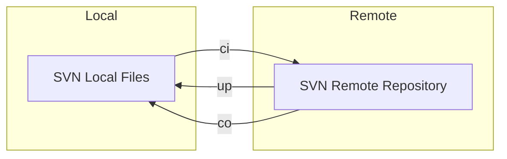
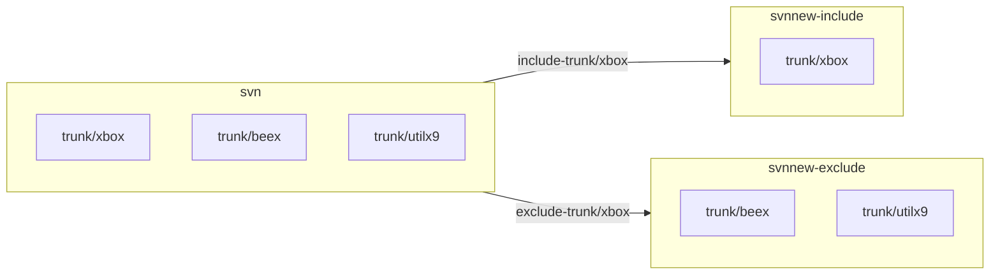
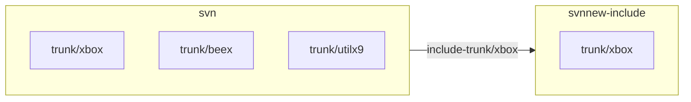
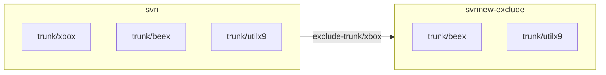
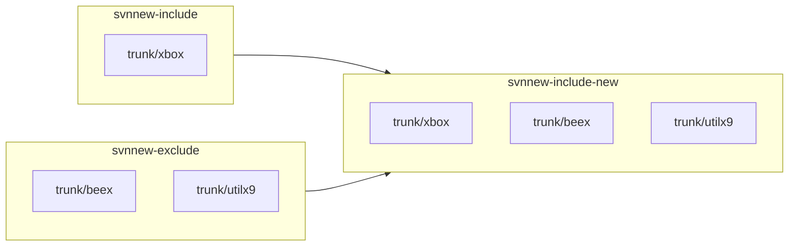
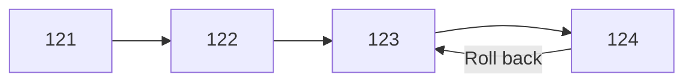
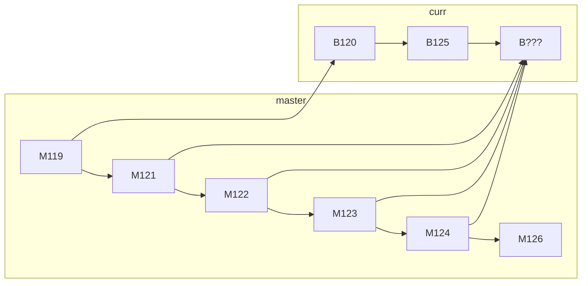
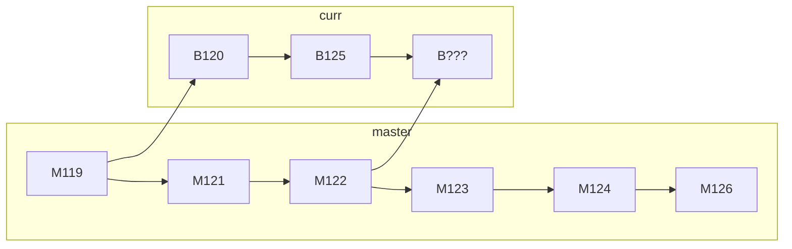

# SVN vs. Git

# 1. Repository

#### svn


> SVN：沒有所謂的 Local Repository。需要一個 SVN Server 擺放 Repository。
```bash
# to set the default editor
$ export SVN_EDITOR=vim
```

#### git

```mermaid
flowchart LR
	subgraph Local
		Git-Local[Git Local Repository]
		Git-Staging[Git Staging]
		Git-Working[Git Working]
<<<<<<< HEAD
		Git-Untracked[Git Untracked]
=======
>>>>>>> 42301914a2fe92dfd154227db7cad2a28eeb303e
	end
	subgraph Remote
		Git-Remote[Git Remote Repository]
	end

<<<<<<< HEAD
	Git-Untracked --> |add|Git-Staging
	Git-Staging --> |restore / restore --staged| Git-Untracked

	Git-Working --> |add|Git-Staging
	Git-Staging --> |restore / restore --staged| Git-Working
	
=======
	Git-Working --> |add|Git-Staging
>>>>>>> 42301914a2fe92dfd154227db7cad2a28eeb303e
	Git-Staging --> |commit|Git-Local
	Git-Local --> |clone|Git-Remote
  Git-Local --> |push|Git-Remote
	Git-Remote --> |pull|Git-Local
```
> Git：分別存在 Remote Repository 和 Local Repository。
```bash
$ git config –global user.name "name"
$ git config –global user.email "email address"
<<<<<<< HEAD
$ git config --global user.email "lankahsu@gmail.com"
$ git config --global user.name "Lanka Hsu"
=======
>>>>>>> 42301914a2fe92dfd154227db7cad2a28eeb303e

# Create an empty Git repository or reinitialize an existing one
$ mkdir HelloWorld
$ cd HelloWorld
$ git init

# to set the default editor
$ export GIT_EDITOR=vim
<<<<<<< HEAD
$ git config --global core.editor "vim"

```

## 1.1. Branch

#### svn

> svn 基本上沒有 git branch 的概念，那要如何實作相同的功能，就用不同目錄來代表。如 svnroot/trunk/xbox、svnroot/brancees/xbox-b1。
>
> 也因此 svn 可以擷取單一目錄，不用抓取整個 repository，也因此省下不少時間！
>
> 

## 1.2. Git Local Repository

```bash
#** 四個狀態 **
Untracked files

Working directory
	Changes not staged for commit
		$ git checkout -- *
Staging area
	Changes to be committed
		$ git reset
Repository
	Committed
		$ git reset --hard HEAD
=======
>>>>>>> 42301914a2fe92dfd154227db7cad2a28eeb303e
```

# 2. General Commands

## 2.1. Clone a repository into a new directory

#### svn co

```bash
<<<<<<< HEAD
$ svn co http://trac-vbx/svnroot/trunk/xbox xbox-123

# to get the special folder - test 
$ svn co http://trac-vbx/svnroot/trunk/xbox/test xbox-test
=======
$ svn co http://trac-vbx/svnroot/trunk/xbox

>>>>>>> 42301914a2fe92dfd154227db7cad2a28eeb303e
```

#### git clone

```bash
<<<<<<< HEAD
$ git clone http://trac-vbx/gitroot/xbox xbox-123
$ git clone --recurse-submodules http://trac-vbx/gitroot/xbox xbox-456

# to get the special branch - test
$ git clone -b test http://trac-vbx/gitroot/xbox xbox-test
=======
$ git clone http://trac-vbx/svnroot/trunk/xbox
$ git clone --recurse-submodules http://trac-vbx/svnroot/trunk/xbox
>>>>>>> 42301914a2fe92dfd154227db7cad2a28eeb303e
```

## 2.2. Record changes to the repository

#### svn ci

```bash
$ svn ci ./
or
$ svn commit ./
```

#### git commit and git push

```bash
$ git commit ./
# Update remote refs along with associated objects.
$ git push ./
<<<<<<< HEAD

# 不建議使用，要就一起上，Not pushed + most recent commit
git commit --amend ./
=======
>>>>>>> 42301914a2fe92dfd154227db7cad2a28eeb303e
```

## 2.3. Fetch from and integrate with another repository or a local branch.

#### svn up

```bash
$ svn up
```

#### git pull

```bash
$ git pull
```

## 2.4. Add file contents to the index

#### svn add

```bash
$ svn add helloworld.c
```

#### git add

```bash
$ git add helloworld.c
```

## 2.5. Manage set of tracked repositories

#### svn relocate

```bash
# to check the repository root URL 
$ svn info

$ svn relocate http://trac-vbx/svnroot/trunk/xbox
```

#### git remote

```bash
# to check the repository root name
$ git remote
origin

# to check the repository root URL
$ git remote -v

<<<<<<< HEAD
$ git remote set-url origin http://trac-vbx/gitroot/xbox
```

## 2.6. Show the working tree status

#### svn status

```bash
$ svn status

# don't print unversioned items
$ svn st -q

# disregard default and svn:ignore and svn:global-ignores property ignores
$ svn status --no-ignore
```

#### git status

```bash
$ git status
```

## 2.7. Show commit logs

#### svn log

```bash
$ svn log | more
```

#### git log

```bash
$ git log
$ git log --oneline
```

## 2.8. List, create, or delete branches.

#### git branch

```bash
# List all
$ git branch -a


```

# 3. Others
## 3.1. ???

```bash

$ git gc --prune=now #清除 git reflog

```


## 3.2. svn copy between repositories with history
=======
$ git remote set-url origin http://trac-vbx/svnroot/trunk/xbox
```

# 

# 3. svn copy between repositories with history
>>>>>>> 42301914a2fe92dfd154227db7cad2a28eeb303e



```bash
$ ls -al 
drwxrwxrwx 12 lanka    lanka            4096  八  22 13:18 ./
drwxr-xr-x 30 root     root             4096  八  12 06:19 ../
drwx------  2 root     root            16384  一   6  2021 lost+found/
drwxrwxrwx  6 www-data www-data         4096  一   3  2019 svn/
-rwxrwxr-x  1 lanka    lanka           52072  八  22 13:16 svndumpsanitizer*

```

<<<<<<< HEAD
#### A. generate history

##### A.1. dump 
=======
## 3.1. generate history

#### A. dump
>>>>>>> 42301914a2fe92dfd154227db7cad2a28eeb303e

```bash
export SVN_NAME_SRC=svn
export SVN_DUMP_SOURCE_FILE="./dump_svn_20220822"

svnadmin dump $SVN_NAME_SRC > $SVN_DUMP_SOURCE_FILE
```

<<<<<<< HEAD
##### A.2. filter
=======
#### B. filter
>>>>>>> 42301914a2fe92dfd154227db7cad2a28eeb303e

```bash
export SVN_DUMP_FILTER=""
export SVN_DUMP_FILTER="$SVN_DUMP_FILTER trunk/xbox"

```

<<<<<<< HEAD
##### A.3. include/exclude
=======
#### C. include/exclude
>>>>>>> 42301914a2fe92dfd154227db7cad2a28eeb303e

```bash
export SVN_DUMP_FILTER_FILE_INCLUDE="./dump_svn_20220822include"

./svndumpsanitizer \
	--infile $SVN_DUMP_SOURCE_FILE \
	--outfile $SVN_DUMP_FILTER_FILE_INCLUDE \
	--include $SVN_DUMP_FILTER \
	--drop-empty

```

```bash
export SVN_DUMP_FILTER_FILE_EXCLUDE="./dump_svn_20220822exclude"

./svndumpsanitizer \
	--infile $SVN_DUMP_SOURCE_FILE \
	--outfile $SVN_DUMP_FILTER_FILE_EXCLUDE \
	--exclude $SVN_DUMP_FILTER \
	--drop-empty

```

<<<<<<< HEAD
#### B. create new repository

##### B.1. include
=======
## 3.2. create new repository

### 3.2.1. include
>>>>>>> 42301914a2fe92dfd154227db7cad2a28eeb303e


```bash
export SVN_DUMP_FILTER_FILE_INCLUDE="./dump_svn_20220822include"
export SVN_NAME_DST=svnnew-include

svnadmin create $SVN_NAME_DST
svnadmin load --ignore-uuid $SVN_NAME_DST < $SVN_DUMP_FILTER_FILE_INCLUDE
sudo chown -R www-data:www-data $SVN_NAME_DST

sudo chmod -R 775 $SVN_NAME_DST
sudo chmod -R 777 $SVN_NAME_DST/db

```

<<<<<<< HEAD
##### B.2. exclude
=======
### 3.2.2. exclude
>>>>>>> 42301914a2fe92dfd154227db7cad2a28eeb303e

```bash
export SVN_DUMP_FILTER_FILE_EXCLUDE="./dump_svn_20220822exclude"
export SVN_NAME_DST=svnnew-exclude

svnadmin create $SVN_NAME_DST
svnadmin load --ignore-uuid $SVN_NAME_DST < $SVN_DUMP_FILTER_FILE_EXCLUDE
sudo chown -R www-data:www-data $SVN_NAME_DST

sudo chmod -R 775 $SVN_NAME_DST
sudo chmod -R 777 $SVN_NAME_DST/db

```
## 3.3. ? Merge repository - include (main) + exclude

```bash
svnadmin load --parent-dir svnnew-include < $SVN_DUMP_FILTER_FILE_EXCLUDE

```

# 4. svn merge

## 4.1. Remove svn:mergeinfo

```bash
svn propget svn:mergeinfo --depth=infinity | grep -v "^/" | grep -v "^\." | cut -d- -f1 | xargs svn propdel svn:mergeinfo

svn ci ./

```

## 4.2. Roll back



```bash
# Undo a committed change
SVN_LAST=`svn info 2>/dev/null | grep 'Last Changed Rev' | cut -d':' -f2 | awk '{print $1}'`
svn merge -c -${SVN_LAST} .

svn ci ./
```

## 4.3. Merge



```bash
# Merge a range of changes
svn merge -r 121:124 http://trac-vbx/svnroot/trunk/xbox ./
svn ci ./
```


```bash
# Merge one specific change
svn merge -c 122 ./
svn ci ./
```

# Appendix

# I. Study
## I.1. SVN
#### A. [Chapter 4. Branching and Merging](https://svnbook.red-bean.com/en/1.7/svn.branchmerge.summary.html)

## I.2. Git

#### A. [Git 初學筆記 - 指令操作教學](https://blog.longwin.com.tw/2009/05/git-learn-initial-command-2009/)

# II. Debug

# III. Usage

## III.1. svn Usage

```bash
$ svn help
usage: svn <subcommand> [options] [args]
Subversion command-line client.
Type 'svn help <subcommand>' for help on a specific subcommand.
Type 'svn --version' to see the program version and RA modules,
     'svn --version --verbose' to see dependency versions as well,
     'svn --version --quiet' to see just the version number.

Most subcommands take file and/or directory arguments, recursing
on the directories.  If no arguments are supplied to such a
command, it recurses on the current directory (inclusive) by default.

Available subcommands:
   add
   auth
   blame (praise, annotate, ann)
   cat
   changelist (cl)
   checkout (co)
   cleanup
   commit (ci)
   copy (cp)
   delete (del, remove, rm)
   diff (di)
   export
   help (?, h)
   import
   info
   list (ls)
   lock
   log
   merge
   mergeinfo
   mkdir
   move (mv, rename, ren)
   patch
   propdel (pdel, pd)
   propedit (pedit, pe)
   propget (pget, pg)
   proplist (plist, pl)
   propset (pset, ps)
   relocate
   resolve
   resolved
   revert
   status (stat, st)
   switch (sw)
   unlock
   update (up)
   upgrade

(Use '-v' to show experimental subcommands.)

Subversion is a tool for version control.
For additional information, see http://subversion.apache.org/

```

## III.2. git Usage

```bash
$ git help
usage: git [--version] [--help] [-C <path>] [-c <name>=<value>]
           [--exec-path[=<path>]] [--html-path] [--man-path] [--info-path]
           [-p | --paginate | -P | --no-pager] [--no-replace-objects] [--bare]
           [--git-dir=<path>] [--work-tree=<path>] [--namespace=<name>]
           <command> [<args>]

These are common Git commands used in various situations:

start a working area (see also: git help tutorial)
   clone             Clone a repository into a new directory
   init              Create an empty Git repository or reinitialize an existing one

work on the current change (see also: git help everyday)
   add               Add file contents to the index
   mv                Move or rename a file, a directory, or a symlink
   restore           Restore working tree files
   rm                Remove files from the working tree and from the index
   sparse-checkout   Initialize and modify the sparse-checkout

examine the history and state (see also: git help revisions)
   bisect            Use binary search to find the commit that introduced a bug
   diff              Show changes between commits, commit and working tree, etc
   grep              Print lines matching a pattern
   log               Show commit logs
   show              Show various types of objects
   status            Show the working tree status

grow, mark and tweak your common history
   branch            List, create, or delete branches
   commit            Record changes to the repository
   merge             Join two or more development histories together
   rebase            Reapply commits on top of another base tip
   reset             Reset current HEAD to the specified state
   switch            Switch branches
   tag               Create, list, delete or verify a tag object signed with GPG

collaborate (see also: git help workflows)
   fetch             Download objects and refs from another repository
   pull              Fetch from and integrate with another repository or a local branch
   push              Update remote refs along with associated objects

'git help -a' and 'git help -g' list available subcommands and some
concept guides. See 'git help <command>' or 'git help <concept>'
to read about a specific subcommand or concept.
See 'git help git' for an overview of the system.

```


# IV. **[svndumpsanitizer](https://github.com/dsuni/svndumpsanitizer)**

# V. ~/.bash_aliases

```bash
#** svn **
export SVN_EDITOR=vim

alias svn-up="svn up"

alias svn-diff="svn diff $*"
alias svn-diff2file="svn diff $* > /tmp/diff"

alias svn-stq="svn st -q"
alias svn-new="svn status | grep -e ^?"
alias svn-st="svn status --no-ignore"

alias svn-log="svn log | perl -l40pe 's/^-+/\n/'"

alias svn-revision="svn info 2>/dev/null | grep Revision | cut -d' ' -f2"

function svn-rm()
{
	svn st | grep '^!' | awk '{$1=""; print " --force \""substr($0,2)"@\"" }' | xargs svn delete
}

function svn-add()
{
	svn status | grep -e ^? | awk '{$1=""; print "\""substr($0,2)"\"" }' | xargs svn add
}

function svn-rollback()
{
	SVN_LAST=`svn info 2>/dev/null | grep 'Last Changed Rev' | cut -d':' -f2 | awk '{print $1}'`
	svn merge -c -${SVN_LAST} .
}

function svn-revert()
{
	HINT="Usage: ${FUNCNAME[0]} <files>"
	FILES="$*"

	if [ ! -z "$FILES" ]; then
		svn revert $FILES
	else
		echo $HINT
	fi
}
```

