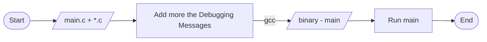
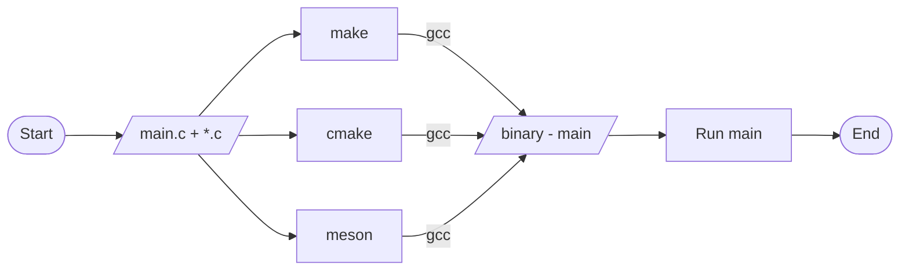
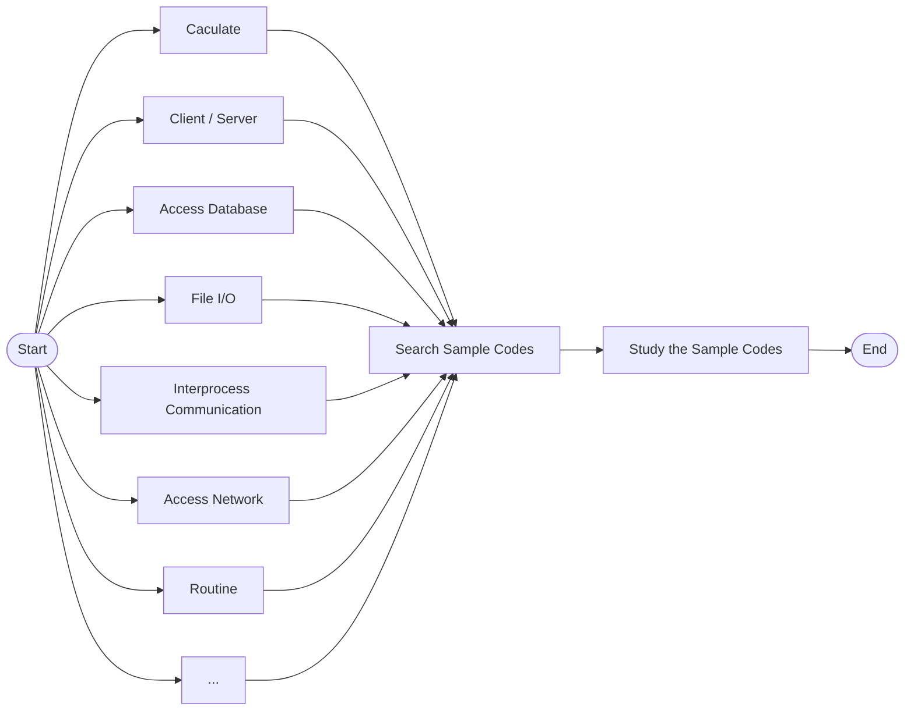
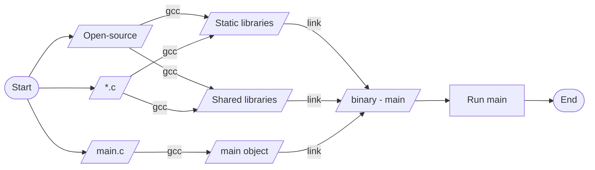

# Software Enginner X9 (in C)

[![GitHub license][license-image]][license-url]
[![GitHub stars][stars-image]][stars-url]
[![GitHub forks][forks-image]][forks-url]
[![GitHub issues][issues-image]][issues-image]
[![GitHub watchers][watchers-image]][watchers-image]

[license-image]: https://img.shields.io/github/license/lankahsu520/HelperX.svg
[license-url]: https://github.com/lankahsu520/HelperX/blob/master/LICENSE
[stars-image]: https://img.shields.io/github/stars/lankahsu520/HelperX.svg
[stars-url]: https://github.com/lankahsu520/HelperX/stargazers
[forks-image]: https://img.shields.io/github/forks/lankahsu520/HelperX.svg
[forks-url]: https://github.com/lankahsu520/HelperX/network
[issues-image]: https://img.shields.io/github/issues/lankahsu520/HelperX.svg
[issues-url]: https://github.com/lankahsu520/HelperX/issues
[watchers-image]: https://img.shields.io/github/watchers/lankahsu520/HelperX.svg
[watchers-url]: https://github.com/lankahsu520/HelperX/watchers

# 1. How to become a software engineer

> 以下是幾個 milestones，有志者可以先朝著這些前進。

## 1.1. HelloWorld

> 先從一個簡單的 HelloWorld 開始

## 1.2. Study C language

## 1.3. Add more the Debugging Messages

> 學會加入 Debugging Messages。

## 1.4. Learn make, cmake or meson

>此時寫程式已經不是問題了；將程式分類，存放在不同檔案裏，並學習軟體工具來自動化編譯程式。

## 1.5. Static/Shared libraries

>將程式內容分類，儲存成不同檔案後，再打包成 Static/Shared libraries

## 1.6. Search Sample Codes

> 先弄清楚該程式目的或意圖，是要存取檔案、抓取圖片、例行工作、或是要進行計算等。
>
> 然後至網路上尋找（以前網路沒這麼發達時，看文件後自己慢慢刻，不然就是要問前輩，然後寫過的程式要當下次的範本）

## 1.7. Link with Open-source

>隨著需求增加，並不需要每個程式都要自己寫，可至網路尋找 Open-source。

# 2. 培養態度和習慣

> 這幾項，我跟某些人說了n次，他們還是做不到

#### A. 導入版本控管

> 網路上免錢的有GitHub 和 GitLab。
>
> 另外也可以自建 git  或 svn server。

#### B. 設立里程碑 （milestone），並用版本（version）來區格

>這對專案管理很重要，可幫助預估時間，事後可以分析那些部分延遲。
>
>曾有個學霸跑來嗆我，東西都還沒做，就訂這麼多版本，這東西是什麼鬼啊！經過我一番的解釋，他還是相當不屑。
>
>我很平庸，不是學霸，至於你覺得有道理，就參考看看。
>
>這裏還有個隱藏的能力，就是預估。

#### C. 寫文件

>身為一個人，建議善用 MarkDown 記錄相關筆記，少用 doc。

#### D. copy-paste

>當你的樣本夠多時，寫程式真的就是不斷的 copy-paste。
>
>版權的問題，算是很大的課題，這邊就不討論。

# 3. Know-how

> 基本常識、技能要補足。

#### A. 作業系統 OS 的基本概念

> 這邊不是要你深入特定 OS的操作和設定。而是要去清楚 OS 管理整個電腦、硬體資源，而我們要如何跟 OS 獲取相對應的資源。

#### B. Thread、Mutex 和 Semaphore

> 這些其實在 OS 中有提到，不過特別拉出成一個項目，是因為後面寫程式時很常用到。

#### C. 同步（synchronous）、 非同步 （asynchronous）、並行（Parallel）和序列（Sequential）

> 要了解這些是什麼。不然跟人家討論合作時，會被認為知識水平過低。

#### D. 堆疊（Stack）& 佇列（Queue）

>要知道資料存放和取用的順序，這些常與並行、序列共用。
>
>像是存取RS232時，放入Queue再處理，就能解決掉包和系統卡住等問題。

#### E. [OSI模型](https://zh.wikipedia.org/zh-tw/OSI模型)

> 因為現在已經是網路的時代，建議要了解其基本概要。

#### F. [Network socket](https://en.wikipedia.org/wiki/Network_socket) 

>也因為是網路時代，就要知道什麼是 Socket。這個很重要，一定要搞清楚！
>
>不管 HTTP、FTP、WebSocket 等都是從其衍生出來。我曾有問過一位Web UI的設計者，關於 Client / Server 的概念，結果得到的答案是一無所知，那更不可能討論 MQTT、WebSocket 等協定。

# 4. ChatGPT Master
> [ChatGPT] 如何成為軟件工程師
>
> 成為軟件工程師需要以下步驟：
>
> 1. 學習編程語言和計算機科學基礎知識。有許多在線課程和教程可供選擇，如Codecademy、Udemy、Coursera等。您可以選擇學習流行的編程語言，如Java、Python、JavaScript等。
>
> 2. 通過練習編程來提高自己的技能。編寫小型項目，例如編寫游戲、制作網站或移動應用程序等，以實踐所學知識。
>
> 3. 參加編程社區活動。例如，加入GitHub社區並與其他開發人員協作，了解其他人是如何解決問題的。
>
> 4. 獲得學位或證書。雖然學位或證書並不是成為軟件工程師的必要條件，但它們可以證明您具備必要的知識和技能。例如，您可以獲得計算機科學學位或編程證書。
>
> 5. 在實際項目中獲得經驗。通過在實際項目中工作，您可以獲得實際的編程經驗，了解如何與客戶合作，並學習如何處理現實世界的編程挑戰。
>
> 6. 不斷學習和更新技能。技術在不斷發展，因此您需要不斷學習和更新自己的技能，以保持競爭力並適應新的編程技術和工具。
>
> 最重要的是，成為軟件工程師需要持續學習、實踐和不斷更新自己的技能。與其他開發人員和專業人士互動，分享經驗和知識，並積極參與開發社區和項目。

>ChatGPT 算是 google 大神的進階版，相當不錯的工具。雖好用，但是還是要靠自己學習，不然有些知識會很不完整。

# Appendix

# I. Study

# II. Debug

# III. Glossary

#### GOPS, Giga Operations per second

>[ChatGPT] 什麼是 GOPS
>
>**GOPS（Giga Operations Per Second）** 是衡量計算機系統處理能力的一個單位，指的是每秒執行的十億次操作。它通常用於描述處理器、計算集群或其他計算系統的性能。
>
>### 1. **GOPS 的概念**：
>
>- **運算能力**：GOPS 主要用來衡量系統的運算能力。這些操作可以是各種數學運算，如加法、乘法、邏輯操作等。
>- **性能指標**：它提供了一個關於系統處理能力的量化指標，有助於比較不同系統或處理器的性能。
>
>### 2. **如何計算 GOPS**：
>
>- **計算公式**：GOPS 的計算基於處理器或系統每秒能夠執行的操作數量。假設某處理器每秒能執行 5 × 10^9 次操作，那麼它的性能就是 5 GOPS。
>
>### 3. **與其他性能指標的比較**：
>
>- **FLOPS（Floating Point Operations Per Second）**：與 GOPS 類似，FLOPS 是衡量浮點運算性能的單位。對於需要進行大量浮點數計算的應用，如科學計算和模擬，FLOPS 是一個重要的指標。
>- **IPS（Instructions Per Second）**：IPS 是另一種性能指標，衡量每秒能執行的指令數。它通常用來評估處理器的整體性能，但不如 GOPS 和 FLOPS 具體於操作數量。
>- **MIPS（Million Instructions Per Second）**：這是每秒執行的百萬條指令數，類似於 GOPS，但主要用於指令數的衡量。
>
>### 4. **應用領域**：
>
>- **高性能計算（HPC）**：在高性能計算領域，GOPS 可以用來評估計算集群或超級計算機的性能，這些系統通常需要處理大量數據和進行複雜的計算。
>- **嵌入式系統**：在嵌入式系統中，如數字信號處理器（DSP），GOPS 用於衡量其處理能力，尤其是在音頻處理、影像處理和通信系統中。
>
>### 5. **實例**：
>
>- **處理器性能**：現代處理器的性能通常以更高的數值來衡量，例如數十億次操作每秒（GOPS），反映了它們處理大量運算的能力。
>- **計算集群**：大型計算集群的性能可以達到幾十或幾百 GOPS，取決於其配置和用途。
>
>### 總結
>
>**GOPS（Giga Operations Per Second）** 是一個衡量計算機系統或處理器性能的單位，表示每秒執行的十億次操作。它是一個重要的性能指標，特別是在需要大量計算的應用領域，如高性能計算和嵌入式系統中。

#### SDK, Software Development Kit

>一句話，就是協助軟體工程師開發的資源和工具。

>[ChatGPT] 什麼是 SDK
>
>**SDK（Software Development Kit，軟件開發工具包）** 是一組用於開發應用程序的工具和庫。它提供了開發者所需的所有資源，以便在特定平台或框架上創建應用程序。SDK 通常包含以下幾種組件：
>
>### 1. **SDK 的主要組件**：
>
>- **API（應用程序編程接口）**：提供了與平台或服務進行交互的接口，使開發者能夠調用平台提供的功能或服務。
>- **文檔**：詳細的說明書和指南，包括 API 文檔、使用範例、教程等，幫助開發者理解如何使用 SDK 進行開發。
>- **庫和框架**：包括預先編譯的代碼庫和開發框架，可以用來簡化開發過程，例如提供通用功能或工具。
>- **工具**：開發和調試應用程序的工具，如編譯器、調試器、性能分析工具等。
>- **示例代碼**：示範如何使用 SDK 進行開發的範例，幫助開發者快速上手。
>
>### 2. **SDK 的功能**：
>
>- **簡化開發過程**：通過提供現成的工具和庫，SDK 可以大大簡化開發過程，讓開發者專注於應用程序的業務邏輯而非底層技術。
>- **促進集成**：SDK 使開發者能夠輕鬆地將應用程序與特定平台或服務進行集成，例如集成支付系統、社交媒體功能或地圖服務。
>- **提高效率**：提供的文檔和示例代碼可以幫助開發者更快地理解和實現特定功能，提高開發效率。
>
>### 3. **常見的 SDK 類型**：
>
>- **操作系統 SDK**：例如 Windows SDK 或 macOS SDK，提供了開發與操作系統交互的工具和 API。
>- **移動平台 SDK**：如 Android SDK 和 iOS SDK，這些 SDK 提供了針對 Android 和 iOS 平台開發應用所需的工具和接口。
>- **Web 開發 SDK**：例如 Google Maps SDK 或 Facebook SDK，這些 SDK 提供了在 Web 應用中集成第三方功能所需的資源。
>- **雲服務 SDK**：如 AWS SDK 和 Azure SDK，這些 SDK 提供了與雲服務平台（如亞馬遜 Web 服務或微軟 Azure）進行交互的工具和庫。
>
>### 4. **使用 SDK 的步驟**：
>
>- **下載和安裝**：首先需要下載和安裝 SDK。這通常包括安裝工具和庫，並配置開發環境。
>- **閱讀文檔**：查閱 SDK 提供的文檔，了解 API 和工具的使用方法。
>- **編寫代碼**：使用 SDK 提供的 API 和工具來編寫應用程序的代碼。
>- **測試和調試**：利用 SDK 提供的調試工具進行測試和故障排除，確保應用程序的正確性和穩定性。
>- **集成和部署**：將應用程序與其他系統或服務進行集成，並部署到目標環境中。
>
>### 5. **示例**：
>
>- **Android SDK**：提供了開發 Android 應用所需的 API、工具和庫，包括 Android Studio IDE 和 Android 相關的工具。
>- **AWS SDK for JavaScript**：提供了與亞馬遜 Web 服務進行交互的 JavaScript 庫和工具，使開發者能夠輕鬆集成 AWS 服務。
>
>### 總結
>
>**SDK（Software Development Kit）** 是一組工具和資源，幫助開發者在特定平台或框架上開發應用程序。它包括 API、文檔、庫、工具和示例代碼，旨在簡化開發過程，提高開發效率。根據使用的技術和平台，SDK 可以涵蓋不同的功能和服務。

# IV. Tool Usage

# Author

> Created and designed by [Lanka Hsu](lankahsu@gmail.com).

# License

> [HelperX](https://github.com/lankahsu520/HelperX) is available under the BSD-3-Clause license. See the LICENSE file for more info.

