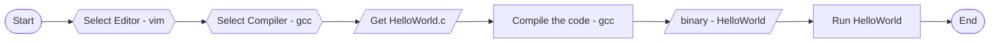

# Software Enginner X9 (in C)

[![GitHub license][license-image]][license-url]
[![GitHub stars][stars-image]][stars-url]
[![GitHub forks][forks-image]][forks-url]
[![GitHub issues][issues-image]][issues-image]
[![GitHub watchers][watchers-image]][watchers-image]

[license-image]: https://img.shields.io/github/license/lankahsu520/HelperX.svg
[license-url]: https://github.com/lankahsu520/HelperX/blob/master/LICENSE
[stars-image]: https://img.shields.io/github/stars/lankahsu520/HelperX.svg
[stars-url]: https://github.com/lankahsu520/HelperX/stargazers
[forks-image]: https://img.shields.io/github/forks/lankahsu520/HelperX.svg
[forks-url]: https://github.com/lankahsu520/HelperX/network
[issues-image]: https://img.shields.io/github/issues/lankahsu520/HelperX.svg
[issues-url]: https://github.com/lankahsu520/HelperX/issues
[watchers-image]: https://img.shields.io/github/watchers/lankahsu520/HelperX.svg
[watchers-url]: https://github.com/lankahsu520/HelperX/watchers

# 1. How to Become a Software Engineer

> 以下是幾個 milestones，有志者可以先朝著這些前進。

## 1.1. HelloWorld

> 先從一個簡單的 HelloWorld 開始

## 1.2. Study C language

## 1.3. Add more the Debugging Messages

> 學會加入 Debugging Messages。

## 1.4. Learn make, cmake or meson

>此時寫程式已經不是問題了；將程式分類，存放在不同檔案裏，並學習軟體工具來自動化編譯程式。

## 1.5. Static/Shared libraries

>將程式內容分類，儲存成不同檔案後，再打包成 Static/Shared libraries

## 1.6. Search Sample Codes

> 先弄清楚該程式目的或意圖，是要存取檔案、抓取圖片、例行工作、或是要進行計算等。
>
> 然後至網路上尋找（以前網路沒這麼發達時，看文件後自己慢慢刻，不然就是要問前輩，然後寫過的程式要當下次的範本）

## 1.7. Link with Open-source

>隨著需求增加，並不需要每個程式都要自己寫，可至網路尋找 Open-source。

# 2. 培養態度和習慣

> 這幾項，我跟某些人說了n次，他們還是做不到

#### A. 導入版本控管

> 網路上免錢的有GitHub 和 GitLab。
>
> 另外也可以自建 git  或 svn server。

#### B. 設立里程碑 （milestone），並用版本（version）來區格

>這對專案管理很重要，可幫助預估時間，事後可以分析那些部分延遲。
>
>曾有個學霸跑來嗆我，東西都還沒做，就訂這麼多版本，這東西是什麼鬼啊！經過我一番的解釋，他還是相當不屑。
>
>我很平庸，不是學霸，至於你覺得我有道理，就參考看看。
>
>這裏還有個隱藏的能力，就是預估。

#### C. 寫文件

>身為一個人，建議善用 MarkDown 記錄相關筆記，少用 doc。

# 3. Know-how

> 基本常識、技能要補足。

#### A. 作業系統 OS 的基本概念

> 這邊不是要你深入特定 OS的操作和設定。而是要去清楚 OS 管理整個電腦、硬體資源，而我們要如何跟 OS 獲取相對應的資源。

#### B. Thread、Mutex 和 Semaphore

> 這些其實在 OS 中有提到，不過特別拉出成一個項目，是因為後面寫程式時很常用到。

#### C. 同步（synchronous）、 非同步 （asynchronous）、並行和序列

> 要了解這些是什麼。不然跟人家討論合作時，會被認為知識水平過低。

#### D. [OSI模型](https://zh.wikipedia.org/zh-tw/OSI模型)

> 因為現在已經是網路的時代，建議要了解其基本概要。

#### E. [Network socket](https://en.wikipedia.org/wiki/Network_socket) 

>也因為是網路時代，就要知道什麼是 Socket。這個很重要，一定要搞清楚！
>
>不管 HTTP、FTP、WebSocket 等都是從其衍生出來。我曾有問過一位Web UI的設計者，關於 Client / Server 的概念，結果得到的答案是一無所知，那更不可能討論 MQTT、WebSocket 等協定。

# 3. From ChatGPT
> 成為軟件工程師需要以下步驟：
>
> 1. 學習編程語言和計算機科學基礎知識。有許多在線課程和教程可供選擇，如Codecademy、Udemy、Coursera等。您可以選擇學習流行的編程語言，如Java、Python、JavaScript等。
>
> 2. 通過練習編程來提高自己的技能。編寫小型項目，例如編寫游戲、制作網站或移動應用程序等，以實踐所學知識。
>
> 3. 參加編程社區活動。例如，加入GitHub社區並與其他開發人員協作，了解其他人是如何解決問題的。
>
> 4. 獲得學位或證書。雖然學位或證書並不是成為軟件工程師的必要條件，但它們可以證明您具備必要的知識和技能。例如，您可以獲得計算機科學學位或編程證書。
>
> 5. 在實際項目中獲得經驗。通過在實際項目中工作，您可以獲得實際的編程經驗，了解如何與客戶合作，並學習如何處理現實世界的編程挑戰。
>
> 6. 不斷學習和更新技能。技術在不斷發展，因此您需要不斷學習和更新自己的技能，以保持競爭力並適應新的編程技術和工具。
>
> 最重要的是，成為軟件工程師需要持續學習、實踐和不斷更新自己的技能。與其他開發人員和專業人士互動，分享經驗和知識，並積極參與開發社區和項目。

>ChatGPT 算是 google 大神的進階版，相當不錯的工具。雖好用，但是還是要靠自己學習，不然有些知識會很不完整。

# Appendix

# I. Study

# II. Debug

# III. Glossary

# IV. Tool Usage

# Author

Created and designed by [Lanka Hsu](lankahsu@gmail.com).

# License

[HelperX](https://github.com/lankahsu520/HelperX) is available under the BSD-3-Clause license. See the LICENSE file for more info.
