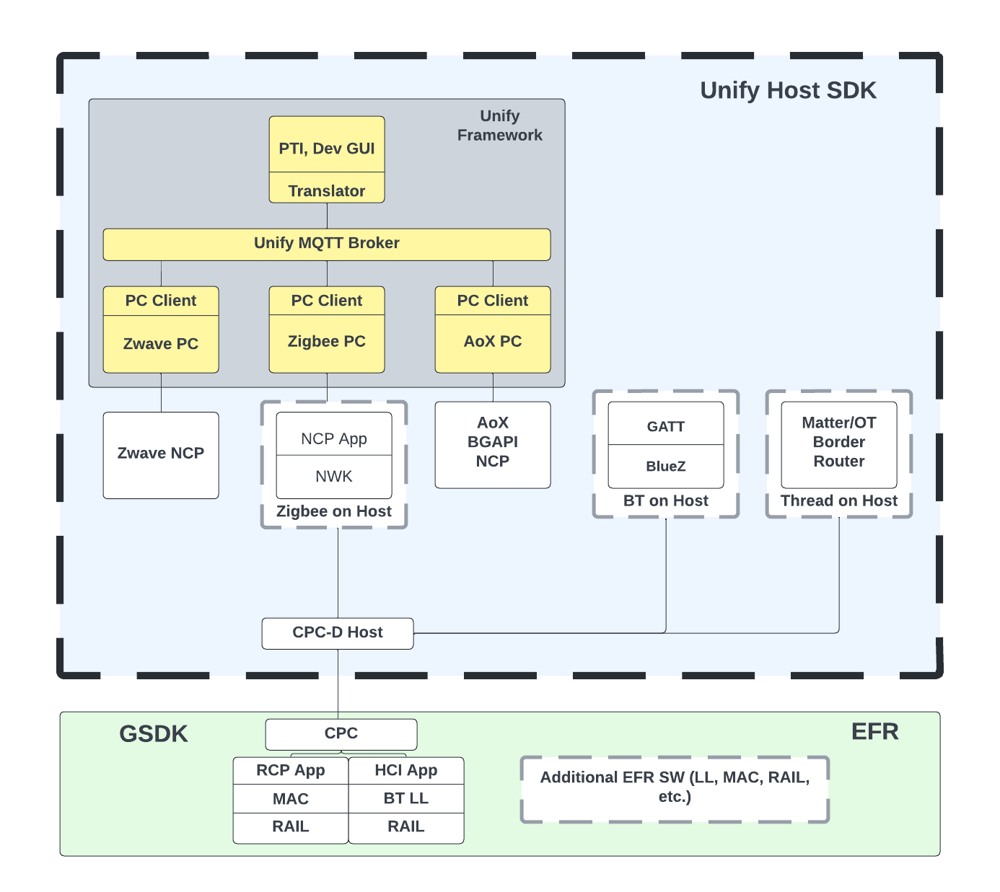
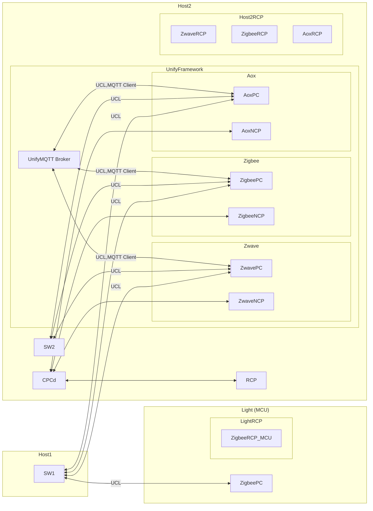
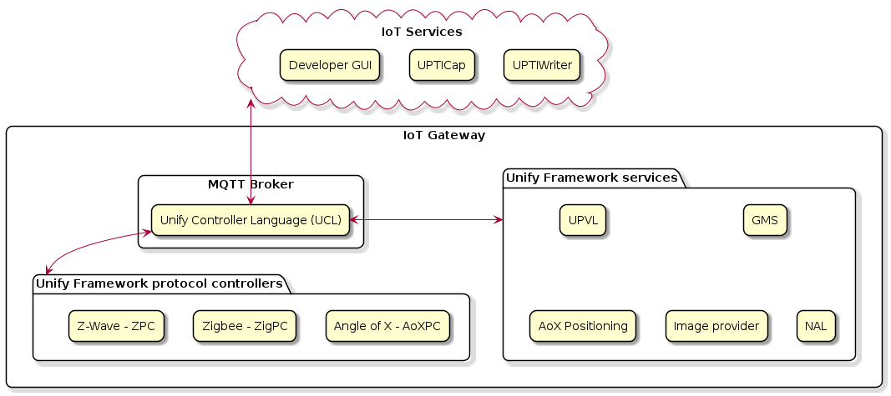
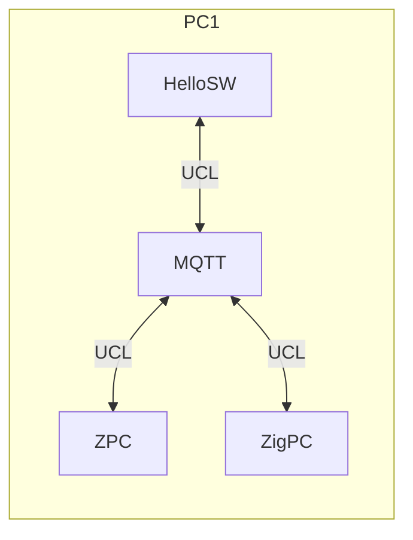
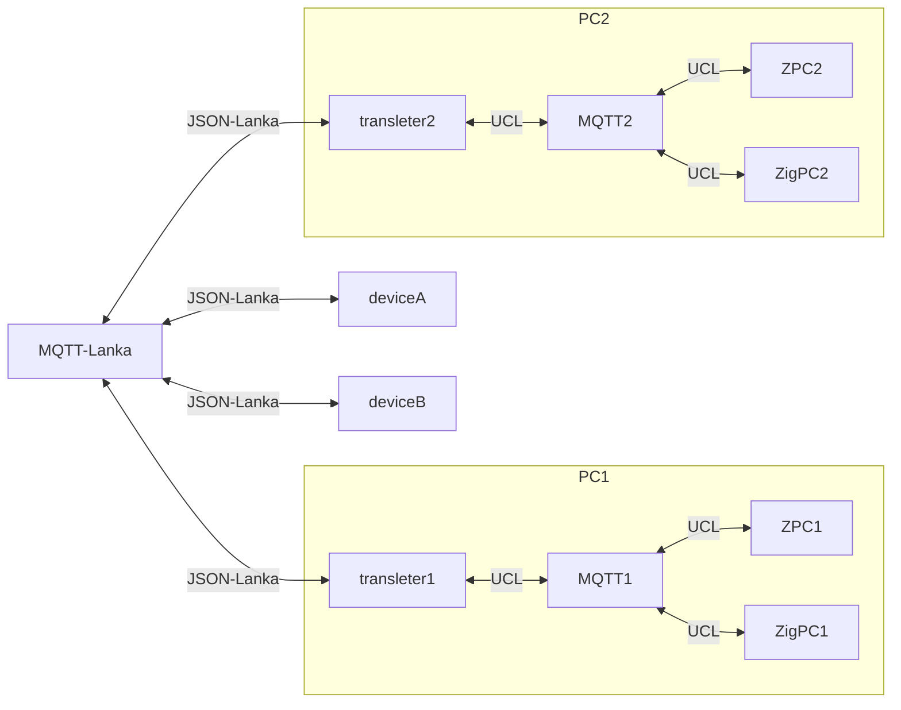
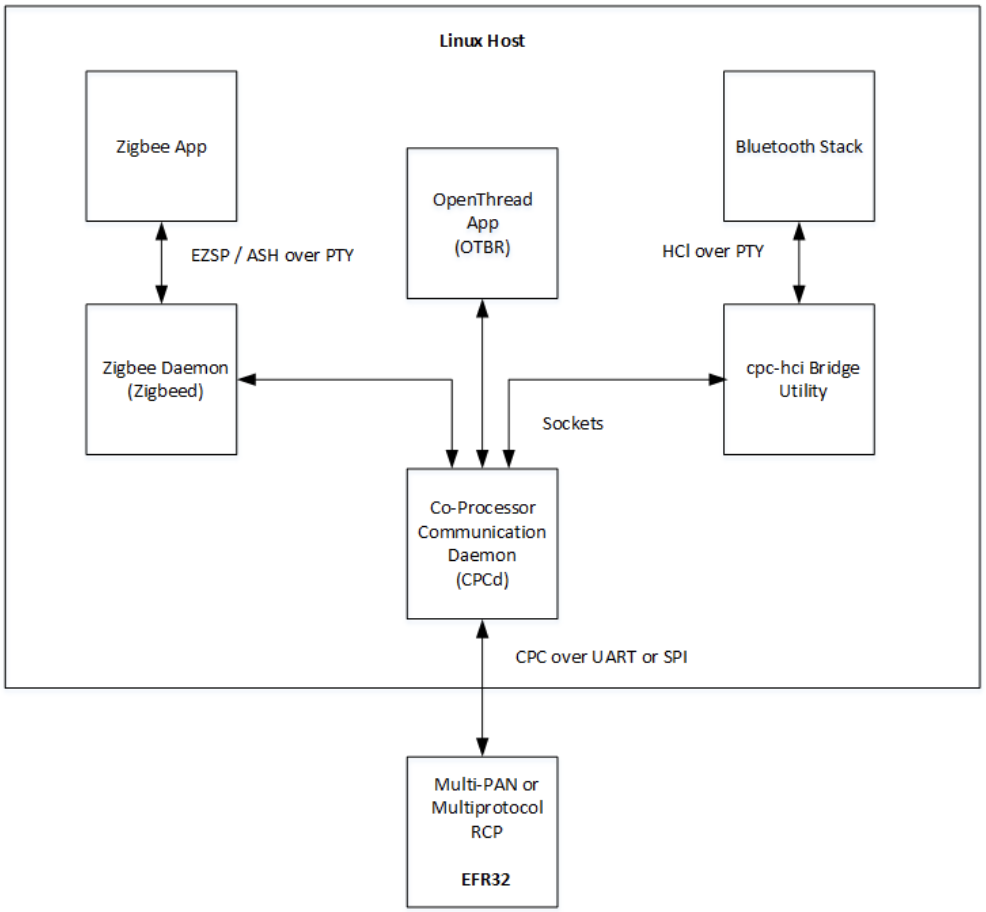
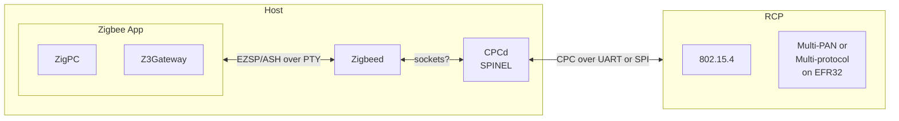
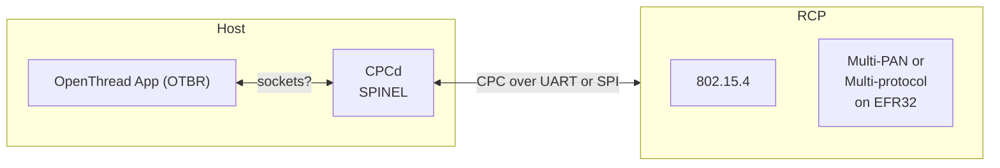
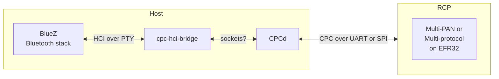

# [Unify SDK](https://github.com/SiliconLabs/UnifySDK) and [Gecko SDK](https://github.com/SiliconLabs/gecko_sdk/)

[![GitHub license][license-image]][license-url]
[![GitHub stars][stars-image]][stars-url]
[![GitHub forks][forks-image]][forks-url]
[![GitHub issues][issues-image]][issues-image]
[![GitHub watchers][watchers-image]][watchers-image]

[license-image]: https://img.shields.io/github/license/lankahsu520/HelperX.svg
[license-url]: https://github.com/lankahsu520/HelperX/blob/master/LICENSE
[stars-image]: https://img.shields.io/github/stars/lankahsu520/HelperX.svg
[stars-url]: https://github.com/lankahsu520/HelperX/stargazers
[forks-image]: https://img.shields.io/github/forks/lankahsu520/HelperX.svg
[forks-url]: https://github.com/lankahsu520/HelperX/network
[issues-image]: https://img.shields.io/github/issues/lankahsu520/HelperX.svg
[issues-url]: https://github.com/lankahsu520/HelperX/issues
[watchers-image]: https://img.shields.io/github/watchers/lankahsu520/HelperX.svg
[watchers-url]: https://github.com/lankahsu520/HelperX/watchers

# 1. Overview

> 從 [Unify SDK](https://github.com/SiliconLabs/UnifySDK) 和 [Gecko SDK](https://github.com/SiliconLabs/gecko_sdk/) 的簡介中，都只會知道都是 Silicon Labs 發佈出來，為了開發 IoT 開發套件。
>
> Unify SDK 主要偏重於開發 Linux user mode，以 service (daemon) 存在。而使用者開發的程式要如何與之溝，還需開發者去研究。
>
> Gecko SDK 就是用於開發 MCU 的開發套件。

## 1.1. Questions

> 以上只是我個人的發想

#### A. lower costs ?

> 從這張圖 (unify_host_sdk.png)，得到一個結論，〝完蛋了！”。
>
> 在系統廠開發這麼多年，一個晶片廠弄出這麼多 services 幹什麼，要跟 Z-Wave 溝通，直接跟 ZPC溝通就好，要跟 ZigBee  溝通，直接跟 ZigPC溝通就好；而且量產的板子，能 lower costs 就儘量偷，會留這麼多RAM 和 FLASH 資源嗎？

#### B. disable some services ?

> 把程式弄得這麼複雜，當使用者要 disable 部分 services，是不是整個系統都不能用了？

#### C. hard to debug

>接上，既然 xxxPC 和 xxxNCP 的相依性這麼高，應該就它們合成一個，
>
>因為設計是讓開發者著重在 UCL，就讓它們維持黑箱身份。
>
>另外合成一個有個好處，要碼啟動成功，不然就是失敗！不用擔心 xxxPC or xxxNCP 其中一個 service 忘了啟動或是那個 service 有問題。

#### D.  The value of an MQTT Broker on embedded system ?

> MQTT Broker 在嵌入式系統的存在性 ? 嵌入式系統可能有 MQTT client，不見得都能支援 MQTT Broker。

## 1.2. Why Not ?

>現在的 mcu 處理能力越來越強，Silicon Labs 應該也要花點心思在將 xxxPC 最小化到能放入 mcu 的系統。

# 2. [UnifySDK](https://github.com/SiliconLabs/UnifySDK)

> This SDK contains non-embedded applications developed by Silicon Labs. The Host SDK is the main source for Silicon Labs customers who are working with Linux based applications in conjunction with Silicon Labs products.

## 2.1. [Unify Framework](https://siliconlabs.github.io/UnifySDK/doc/UnifySDK.html) == Unified IoT Controller (UIC)

>A powerful IoT gateway framework that supports multiple wireless protocols.
>
>從圖中可以知道，使用都開發之軟體，必需透過 MQTT 與 ZPC, ZigPC, AoXPC 溝通。
>

### 2.1.1. UCL and MQTT

> Silicon 是把MQTT當成 IPC在用。感覺有點大材小用，不知他們的軟體工程師有沒有考慮到多個電腦或是多個設備之間也會存在 MQTT，這樣不是就得 register Broker*n。
>

#### A. MQTT * n, ???

### 2.1.2. Protocol Controller (Hardware Controller)

> An MQTT client that controls a PHY Radio and translates commands between the UCL and the native language of that PHY. Also known as a PHY Translator.
>
> 這邊可以想像 BlueZ 控制 Bluetooth module or Bluetooth dongle。(這邊說個題外話，目前同一台電腦只能驅動一組 Bluetooth；當電腦 with Bluetooth on board，再插上 Bluetooth dongle 時，有可能造成電腦混亂)

#### A. Z-Wave Protocol Controller ([ZPC](https://siliconlabs.github.io/UnifySDK/applications/zpc/readme_user.html))

#### B. ZigBee Protocol Controller ([ZigPC](https://siliconlabs.github.io/UnifySDK/applications/zigpc/readme_user.html))

#### C. Angle of Arrival/Departure Protocol Controller ([AoXPC](https://siliconlabs.github.io/UnifySDK/applications/aox/applications/aoxpc/readme_user.html))

### 2.1.3. Overview of relations among Unify Applications

|                                                              | [ ZPC](https://siliconlabs.github.io/UnifySDK/applications/zpc/readme_user.md) | [ZigPC](https://siliconlabs.github.io/UnifySDK/applications/zigpc/readme_user.md) | [AoXPC](https://siliconlabs.github.io/UnifySDK/applications/aox/applications/aoxpc/readme_user.md) |
| :----------------------------------------------------------- | :----------------------------------------------------------- | :----------------------------------------------------------- | ------------------------------------------------------------ |
| [UPVL](https://siliconlabs.github.io/UnifySDK/applications/upvl/readme_user.md) | [x]                                                          | [x]                                                          |                                                              |
| [GMS](https://siliconlabs.github.io/UnifySDK/applications/gms/readme_user.md) | [x]                                                          | [x]                                                          |                                                              |
| [NAL](https://siliconlabs.github.io/UnifySDK/applications/nal/readme_user.md) | [x]                                                          | [x]                                                          | [x]                                                          |
| [OTA Image Provider](https://siliconlabs.github.io/UnifySDK/applications/image_provider/readme_user.md) | [x]                                                          | [x]                                                          |                                                              |
| [AoX Positioning](https://siliconlabs.github.io/UnifySDK/applications/aox/applications/positioning/readme_user.md) |                                                              |                                                              | [x]                                                          |
|                                                              |                                                              |                                                              |                                                              |
| [Dev GUI](https://siliconlabs.github.io/UnifySDK/applications/dev_ui/dev_gui/readme_user.md) | [x]                                                          | [x]                                                          | [x]                                                          |
| [UPTICap](https://siliconlabs.github.io/UnifySDK/applications/upti_cap/readme_user.md) | [x]                                                          | [x]                                                          |                                                              |
| [UPTIWriter](https://siliconlabs.github.io/UnifySDK/applications/upti_writer/readme_user.md) | [x]                                                          | [x]                                                          |                                                              |
|                                                              |                                                              |                                                              |                                                              |

### 2.1.4. Services

#### A. The Unify Framework Provisioning List (UPVL)

> [The UPVL](https://siliconlabs.github.io/UnifySDK/applications/upvl/readme_user.html) serves the SmartStart Provisioning list to perform SmartStart Security 2 (S2) inclusions and maintains the ucl/SmartStart MQTT topic.

#### B. The Unify Framework Group Manager (GMS)

> [GMS](https://siliconlabs.github.io/UnifySDK/applications/gms/readme_user.html) manages groups and bookkeeping between protocol controllers and also publishes group state changes to the ucl/by-group MQTT topic.

#### C. The Unify Name and Location service (NAL)

> [NAL](https://siliconlabs.github.io/UnifySDK/applications/nal/readme_user.html) is a helper MQTT component that allows for book-keeping of text names and locations that have been assigned. This functionality allows IoT Services to assign and read back a Name and a Location for each node/endpoint.

#### D. The Unify Framework OTA Image Provider

> [OTA Image Provider](https://siliconlabs.github.io/UnifySDK/applications/image_provider/readme_user.html) announces OTA images available in OTA storage and publishes OTA binary on request.

#### E. The Unify AoX Positioning Application

> [AoX Positioning application](https://siliconlabs.github.io/UnifySDK/applications/aox/applications/positioning/readme_user.html) reads configuration and data from AoXPCs and publishes the calculated position of asset tags in the system.

### 2.1.5. IoT Services

> An MQTT client that translates the UCL language into the API of a cloud service or locally running high-level service (e.g., Web UI). This is a translator to a cloud service, not the actual cloud service. An AWS-IoT IoT Service runs on Unify hardware and connects to AWS IoT cloud, for example.

#### A. [Developer GUI](https://siliconlabs.github.io/UnifySDK/applications/dev_ui/dev_gui/readme_user.html)

> [Dev GUI User’s Guide](https://siliconlabs.github.io/UnifySDK/applications/dev_ui/dev_gui/readme_user.html)
>
> The [Developer GUI (dev_gui)](https://siliconlabs.github.io/UnifySDK/applications/dev_ui/dev_gui/readme_user.html)  service is a graphical user interface provided for operating and provisioning IoT devices using UCL. The dev_gui can be used as a reference for basic Unify concepts, such as device provisioning and control. The user interface is provided strictly for test and demonstration purposes only and is not suitable for production.

#### B. The UPTICap

> [UPTICap (upti_cap)](https://siliconlabs.github.io/UnifySDK/applications/upti_cap/readme_user.html) is an application to communicate with Silicon Labs WSTK adapters. The adapters capture data on the debug channel and publish the captured data as MQTT messages. Application provided strictly for test and demonstration purposes only and is not suitable for production.

#### C. The UPTIWriter

> [UPTIWriter (upti_writer)](https://siliconlabs.github.io/UnifySDK/applications/upti_writer/readme_user.html) is an application to receive trace packages captured with *UPTI_CAP* application and save them to a file in [Network Analyzer](https://docs.silabs.com/simplicity-studio-5-users-guide/latest/ss-5-users-guide-tools-network-analyzer/) compatible format. Application provided strictly for test and demonstration purposes only and is not suitable for production.

## 2.2. [Multiprotocol Host Software](https://siliconlabs.github.io/UnifySDK/doc/multiprotocol.html)

> A collection of host software for simultaneously running multiple protocol stacks on the host. Using a single radio co-processor, you can run Zigbee, OpenThread, and Bluetooth.
>
> 這邊最熟悉的就是 BlueZ，一般都是用 D-Bus 與之溝通。

### 2.2.1. Services

#### A. [CPCd, CPC Daemon](https://siliconlabs.github.io/UnifySDK/applications/cpcd/readme_user.html)

> The key host software component at the heart of the multiprotocol architecture is a multiplexer called CPCd (Co-Processor Communication daemon). CPCd runs on the host and acts as a reliable and secure serial transport layer to the RCP over either a UART or SPI serial bus. Each protocol stack running on the host connects to CPCd in order to communicate with the RCP. For more information see the [CPCd page](https://siliconlabs.github.io/UnifySDK/applications/cpcd/readme_user.html).

#### B. [Zigbeed](https://siliconlabs.github.io/UnifySDK/applications/zigbeed/readme_user.html)

> The Zigbee protocol stack runs on the host in a daemon called zigbeed. Zigbeed communicates with an 802.15.4 stack on the RCP via the SPINEL protocol. Zigbeed connects via sockets to CPCd, which transports the SPINEL messages over the serial bus to the RCP. A Zigbee host application connects to Zigbeed via a PTY (pseudo terminal) and communicates using the EZSP protocol. Two host applications are included with the Unify Host SDK: ZigPC, and Z3Gateway. To get started running zigbeed with CPCd, see the [Multiprotocol Setup](https://siliconlabs.github.io/UnifySDK/doc/getting_started_multiprotocol_cpc.html) page.

> NOTE: The Zigbeed application is only built for arm32 bit targets using Unify

#### C. [OTBR, OpenThread Border Router](https://siliconlabs.github.io/UnifySDK/applications/openthread_border_router/readme_user.html)

>The OpenThread Border Router (OTBR) is included in a binary Debian package with the Unify Host SDK. The version included is compiled from the GSDK with CPCd connectivity and multiprotocol capabilities enabled. It communicates to the 802.15.4 RCP using SPINEL via CPCd. It can run alongside zigbeed using the same RCP, provided both networks use the same 802.15.4 channel. To get started running OTBR with CPCd, see the [Multiprotocol Setup](https://siliconlabs.github.io/UnifySDK/doc/getting_started_multiprotocol_cpc.html) page.
>
>There are four OTBR services included in the uic-otbr package:
>- otbr-agent - service to instantiate an OpenThread networking agent
>- otbr-web - service to provide a web UI for configuration and management
>- otbr-firewall - service to implement ingress filtering rules
>- otbr-nat44 - service to allow connections to IPV4 endpoints
>
>These services can be independently controlled, or they can be started and stopped together with the top-level **uic-otbr** service.

#### D. [cpc-hci-bridge](https://siliconlabs.github.io/UnifySDK/applications/cpc-hci-bridge/readme_user.html)

> BlueZ is the official Linux Bluetooth stack. A small utility called the cpc-hci-bridge is provided to connect BlueZ to CPCd so that it can communicate to a BLE link-layer enabled RCP using the HCI protocol. For more information see the [CPC HCI Bridge page](https://siliconlabs.github.io/UnifySDK/applications/cpc-hci-bridge/readme_user.html).

# 3. [GeckoSDK](https://github.com/SiliconLabs/gecko_sdk/)

> The Gecko SDK (GSDK) combines Silicon Labs wireless software development kits (SDKs) and Gecko Platform into a single, integrated package. The GSDK is your primary tool for developing in the Silicon Labs IoT Software ecosystem.

# Appendix

# I. Study

## I.1. [Unify Host SDK](https://siliconlabs.github.io/UnifySDK/doc/introduction.html)

> This documentation is for the [latest release of the Unify Host SDK](https://github.com/SiliconLabs/UnifySDK/releases/latest).
>
> The Unify Host SDK contains non-embedded applications developed by Silicon Labs.

## I.2. [Unify Software Development Kit (SDK)](https://www.silabs.com/developers/unify-sdk?tab=overview)

> Unify SDK simplifies IoT infrastructure development including gateways, access points, hubs, bridges, and application processor-based end products.

## I.3. [Gecko Platform](https://docs.silabs.com/gecko-platform/4.3/platform-overview/)

> Gecko Platform is the common foundation for the Gecko SDK Suite.

## I.4. [Zigbee stack layers](https://www.digi.com/resources/documentation/Digidocs/90002002/Content/Reference/r_zb_stack.htm?TocPath=zigbee%20networks%7C_____3)

| Zigbee layer | Descriptions                                                 |
| ------------ | ------------------------------------------------------------ |
| ZDO          | Application layer that provides device and service discovery features and advanced network management capabilities. |
| APS (AF)     | Application layer that defines various addressing objects including profiles, clusters, and endpoints. |
| Network      | Adds routing capabilities that allows RF data packets to traverse multiple devices (multiple hops) to route data from source to destination (peer to peer). |
| MAC          | Manages RF data transactions between neighboring devices (point to point). The MAC includes services such as transmission retry and acknowledgment management, and collision avoidance techniques (CSMA-CA). |
| PHY          | Defines the physical operation of the Zigbee device including receive sensitivity, channel rejection, output power, number of channels, chip modulation, and transmission rate specifications. Most Zigbee applications operate on the 2.4 GHz ISM band at a 250 kb/s data rate. See the IEEE 802.15.4 specification for details. |

## I.5. Unify Specifications

- [1. Unify Architecture Overview](https://siliconlabs.github.io/UnifySDK/doc/unify_specifications/Chapter01-architecture-overview.html)
- [2. Dotdot ZCL in Unify Framework for Application Level Control](https://siliconlabs.github.io/UnifySDK/doc/unify_specifications/Chapter02-ZCL-in-uic.html)
- [3. Network Management Commands](https://siliconlabs.github.io/UnifySDK/doc/unify_specifications/Chapter03-network-management.html)
- [4. Scenario mapping to specific PHYs: Z-Wave, BLE and ZigBee](https://siliconlabs.github.io/UnifySDK/doc/unify_specifications/Chapter04-scenario-mappings.html)
- [5. Common OTA FW Update Service](https://siliconlabs.github.io/UnifySDK/doc/unify_specifications/Chapter05-common-ota.html)
- [6. Service Discovery](https://siliconlabs.github.io/UnifySDK/doc/unify_specifications/Chapter06-service-discovery.html)
- [7. Scene Cluster and the Scene Table](https://siliconlabs.github.io/UnifySDK/doc/unify_specifications/Chapter07-scenes.html)
- [8. AoX Application](https://siliconlabs.github.io/UnifySDK/doc/unify_specifications/Chapter08-aox-application.html)
- [9. Binding](https://siliconlabs.github.io/UnifySDK/doc/unify_specifications/Chapter09-binding.html)
- [10. Name and Location Service](https://siliconlabs.github.io/UnifySDK/doc/unify_specifications/Chapter10-name-and-location-service.html)
- [11. System Metrics](https://siliconlabs.github.io/UnifySDK/doc/unify_specifications/Chapter11-system-metrics.html)
- [12. Unify Applications Monitoring](https://siliconlabs.github.io/UnifySDK/doc/unify_specifications/Chapter12-unify-applications-monitoring.html)

## I.6. [AN1333: Running Zigbee, OpenThread, and Bluetooth Concurrently on a Linux Host with a Multiprotocol Co-Processo](https://www.silabs.com/documents/public/application-notes/an1333-concurrent-protocols-with-802-15-4-rcp.pdf)

# II. Debug

# III. Glossary

#### AGI, 

> Association Group Information

#### AoX,
> Common name for the Angle of Arrival/Departure direction finding technologies

#### CPC-D, CPC Daemon

> The Co-Processor Daemon (CPCd) enables users to have multiple stack protocols interact with a secondary processor over a shared physical link using multiple endpoints.

#### DRL, Device Reset Locally

> 

#### EndPointID, Endpoint

>Endpoints are sub-addresses in unsigned integers of a UNID. Devices without PAN-side support for endpoints use ep0.

#### EZSP, EmberZNet Serial Protocol

>[ChatGPT]
>
>EZSP（EmberZNet Serial Protocol）是一種串行通信協議，用於在無線感測網絡（WSN）中的設備和主控制器之間進行通信。EZSP是由Silicon Labs開發的，主要用於其EmberZNet無線網絡協議堆棧。
>
>EZSP協議提供了一個標準的介面，用於設備和主控制器之間的通信和交互。它使用串行通信（如UART或SPI）將指令和數據傳輸到無線設備上的EmberZNet協議堆棧。
>
>以下是EZSP的一些特點和功能：
>
>1. 簡潔的消息格式：EZSP使用簡單且輕量的消息格式進行通信。消息包括指令和相應的參數，用於執行各種操作，如網絡配置、節點管理、數據傳輸等。
>2. 高效的通信：EZSP提供高效的通信機制，以最小化通信開銷和延遲。它支援異步通信，使主控制器能夠同時處理多個EZSP指令和回應。
>3. 配置和管理功能：EZSP允許主控制器配置和管理無線設備的各種參數和功能。這包括網絡配置、節點註冊、安全性設置、鍵管理等。
>4. 數據傳輸：EZSP支援無線數據傳輸，主控制器可以使用EZSP指令將數據發送到無線設備，並接收來自設備的數據。
>5. 安全性：EZSP提供了安全性功能，用於加密和驗證無線通信。它支援各種安全協議和演算法，以確保無線設備之間的安全通信。
>
>EZSP被廣泛應用於無線感測網絡和物聯網應用中，其中包括智能家居、工業自動化、環境監測等領域。它提供了一個方便且標準的介面，使主控制器能夠輕鬆地與無線設備進行通信和控制，實現無線

#### GMS, Group Management Service

> Group Management Service

#### GW, Gateway

> An IP host connecting two different domains. A Unify Gateway consists of the Unify components and SDK installed on an IP host providing OS functionality and hardware support.

#### Gecko Platform

> 一般我們稱公板為 Board - Gecko Board。也就是 Silicon 的開發公板，名字稱為 Gecko 壁虎。

#### IPC, Inter Process Communication

> 這邊的 IPC 是程序間通訊的機制。不是工業電腦。

#### [NCP, Network Co-Processor](https://openthread.io/platforms/co-processor#network_co-processor_ncp)

> Network Co-processor, eg. a radio connected via USB, which handles PHY/MAC and routing
>
> [ChatGPT, 軟體層]
>
> NCP是一個專門處理網路通信的處理器。它通常用於網絡設備（如路由器、交換機、網絡伺服器等）或網絡介面卡中。NCP負責處理網絡協議、數據封包的轉發、路由、處理等功能。它能夠處理不同層次的網絡協議，如IP（Internet Protocol）、TCP（Transmission Control Protocol）、UDP（User Datagram Protocol）等，並確保數據在網絡中的正確傳遞。

#### NIF,

> Node Information Frame

#### NWK, Network layer

>[ChatGPT]
>
>在 Zigbee 協議中，NWK (Network layer) 是指網路層，負責處理網路拓撲、路由和節點之間的通信。它是 Zigbee 協議堆疊中的其中一個層級。
>
>NWK 層的主要功能包括：
>
>1. 網路拓撲管理：NWK 層負責管理 Zigbee 網路的拓撲結構，包括建立網路、加入新節點、節點之間的連接等。它確保網路中的節點能夠有效地通信。
>2. 路由控制：NWK 層負責處理路由功能，確定數據從源節點到目標節點的最佳路徑。它使用一種稱為路由表的數據結構來存儲和維護路由信息。
>3. 節點地址分配：NWK 層負責為每個節點分配唯一的網路地址。這些地址在整個 Zigbee 網路中是唯一的，並且用於節點之間的識別和通信。
>4. 安全性管理：NWK 層負責實現網路層的安全性機制，包括節點之間的加密和驗證。它確保網路中的數據傳輸是安全可靠的。
>
>總的來說，NWK 層在 Zigbee 網路中扮演著關鍵的角色，負責管理網路拓撲、路由和節點間的通信，以實現可靠和安全的無線物聯網應用。

#### PAN, Personal Area Network

> The network of end nodes behind a PHY Radio controlled by Unify.

#### [PHY, Port Physical Layer](https://zh.wikipedia.org/zh-tw/PHY)

> [維基百科] 
>
> PHY連接一個[數據鏈路層](https://zh.wikipedia.org/wiki/数据链路层)的裝置（[MAC](https://zh.wikipedia.org/wiki/媒體存取控制)）到一個物理媒介，如光纖或銅纜線。典型的PHY包括PCS（Physical Coding Sublayer，物理編碼子層）和PMD（Physical Media Dependent，物理介質相關子層）。PCS對被傳送和接受的資訊加碼和解碼，目的是使接收器更容易恢復訊號。

#### [RCP, Radio Co-Processor](https://openthread.io/platforms/co-processor#radio_co-processor_rcp) 

>The RCP (Radio Co-Processor) is an embedded application running on a Silicon Labs EFR32 radio chip connected to the host processor via a UART or SPI serial connection. There are different flavors of RCP depending on which protocol stacks are running on the host. The RCP software is distributed with the GSDK. For details on building RCP images for the co-processor, see [AN1333](https://www.silabs.com/documents/public/application-notes/an1333-concurrent-protocols-with-802-15-4-rcp.pdf).
>
>[ChatGPT, 硬體層]
>
>RCP是一個專門處理無線通信的處理器。它通常用於行動設備（如智能手機、平板電腦等）或無線通信模組中。RCP負責處理無線訊號的傳輸、接收、調製和解調製等功能。它能夠與無線網路（如蜂窩網絡、Wi-Fi、藍牙等）進行通信，使設備能夠連接到網絡，進行數據的傳輸和接收。

#### Spinel,

>[ChatGPT]
>
>Spinel是一種通信協議，特別用於物聯網（IoT）設備之間的無線通信。它是Thread協議的基礎，Thread是一種低功耗、IPv6網路協議，用於在物聯網設備之間建立可靠的無線連接。
>
>Spinel協議旨在提供一個標準的介面，用於設備和Thread網路之間的通信。它定義了一組命令和屬性，用於設置、配置和監控Thread設備。Spinel消息可以通過各種傳輸介質（如UART、SPI、USB等）進行傳輸。
>
>Spinel協議具有以下特點：
>
>1. 簡潔的消息格式：Spinel消息使用輕量且簡單的格式，以便於在資源有限的設備上實現。
>2. 支援命令和屬性：Spinel定義了一組命令和屬性，用於設備的配置、管理和操作。這些命令和屬性可以用於設置網路參數、配置安全性、控制連接等。
>3. 支援異步通信：Spinel允許非同步的消息傳遞，使設備可以同時處理多個消息，提高效率和靈活性。
>4. 支援擴展：Spinel具有擴展性，可以根據不同應用需求定義自定義的命令和屬性。
>
>Spinel協議被廣泛應用於Thread網路中的物聯網設備，如智能家居、工業自動化、智能照明等。它提供了一個統一的介面，使得不同廠商的設備可以相互通信和協作，從而實現更高效、互操作性的物聯網系統。

#### UAM,

> Unified Attribute Mapping: Filename for the Attribute Mapper language

#### UCL, Unify Controller Language

> The unified command language used as an internal abstraction layer in the Unify Framework.
>
> Silicon 自創的交換格式。
> 基本上我不是把 MQTT 的資料稱為 Language，比較準確的說是資料格式。

#### UIC, Unify IoT Controller
> Old name of the Unify Framework

#### UNID, Unified Node Identifier

>A unified addressing system with a separate sub-namespace for each PHY supported by the Unify Framework. It is a string that uniquely represents a PAN node.

#### Unify, Unify Framework

> The system whose design is described here. Formerly known as Unified IoT  Controller (UIC).

#### UPVL, Unify Provisioning List

>

#### XXX Gecko XXX Microcontroller

> 就是Silicon 的 Gecko 模組。

#### (Z-Wave) LR, (Z-Wave) Long Range

>

# IV. Tool Usage

## IV.1. 
# Author

Created and designed by [Lanka Hsu](lankahsu@gmail.com).

# License

[HelperX](https://github.com/lankahsu520/HelperX) is available under the BSD-3-Clause license. See the LICENSE file for more info.

