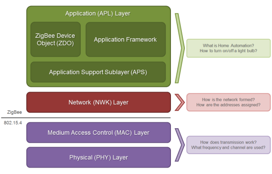

# [Unify SDK](https://github.com/SiliconLabs/UnifySDK) and [Gecko SDK](https://github.com/SiliconLabs/gecko_sdk/)
[](https://github.com/lankahsu520/HelperX)
[![GitHub license][license-image]][license-url]
[![GitHub stars][stars-image]][stars-url]
[![GitHub forks][forks-image]][forks-url]
[![GitHub issues][issues-image]][issues-image]
[![GitHub watchers][watchers-image]][watchers-image]

[license-image]: https://img.shields.io/github/license/lankahsu520/HelperX.svg
[license-url]: https://github.com/lankahsu520/HelperX/blob/master/LICENSE
[stars-image]: https://img.shields.io/github/stars/lankahsu520/HelperX.svg
[stars-url]: https://github.com/lankahsu520/HelperX/stargazers
[forks-image]: https://img.shields.io/github/forks/lankahsu520/HelperX.svg
[forks-url]: https://github.com/lankahsu520/HelperX/network
[issues-image]: https://img.shields.io/github/issues/lankahsu520/HelperX.svg
[issues-url]: https://github.com/lankahsu520/HelperX/issues
[watchers-image]: https://img.shields.io/github/watchers/lankahsu520/HelperX.svg
[watchers-url]: https://github.com/lankahsu520/HelperX/watchers

# 1. Overview

> 從 [Unify SDK](https://github.com/SiliconLabs/UnifySDK) 和 [Gecko SDK](https://github.com/SiliconLabs/gecko_sdk/) 的簡介中，都只會知道都是 Silicon Labs 發佈出來，為了開發 IoT 開發套件。
>
> Unify SDK 主要偏重於開發 Linux user mode，以 service (daemon) 存在。而使用者開發的程式要如何與之溝，還需開發者去研究。
>
> Gecko SDK 就是用於開發 MCU 的開發套件。


## 1.1. Questions

> 以下只是我個人的發想

#### A. How to lower costs  ?  (To minimize the resource utilization of the gateway)

> 從這張圖 (unify_host_sdk.png)，得到一個結論，〝完蛋了！”。
>
> 在系統廠開發這麼多年，一個晶片廠弄出這麼多 services 幹什麼，要跟 Z-Wave 溝通，直接跟 ZPC溝通就好，要跟 ZigBee  溝通，直接跟 ZigPC溝通就好；而且量產的板子，能 lower costs 就儘量偷，會留這麼多RAM 和 FLASH 資源嗎？

#### B. How to disable some services ?

> 把程式弄得這麼複雜，當使用者要 disable 部分 services，是不是整個系統都不能用了？
>
> 真的太複雜了 !!!

#### C. It is hardly to debug.

>接上，既然 xxxPC 和 xxxNCP 的相依性這麼高，應該就它們合成一個，
>
>因為設計是讓開發者著重在 UCL，就讓它們維持黑箱身份。
>
>另外合成一個有個好處，要碼啟動成功，不然就是失敗！不用擔心 xxxPC or xxxNCP 其中一個 service 忘了啟動或是那個 service 有問題。

#### D.  The value of an MQTT Broker on embedded system ?

> MQTT Broker 在嵌入式系統的存在性 ? 嵌入式系統可能有 MQTT client，不見得都能支援 MQTT Broker。

#### E. How to rebuild the prebuild libraries in GeckoSDK ?

>這部分的 source codes ?

## 1.2. Why Not ?

>現在的 mcu 處理能力越來越強，Silicon Labs 應該也要花點心思在將 xxxPC 最小化到能放入 mcu 的系統。


# 2. [UnifySDK](https://github.com/SiliconLabs/UnifySDK)

> This SDK contains non-embedded applications developed by Silicon Labs. The Host SDK is the main source for Silicon Labs customers who are working with Linux based applications in conjunction with Silicon Labs products.

## 2.1. [Unify Framework](https://siliconlabs.github.io/UnifySDK/doc/UnifySDK.html) == Unified IoT Controller (UIC)

>A powerful IoT gateway framework that supports multiple wireless protocols.
>
>從圖中可以知道，使用都開發之軟體，必需透過 MQTT 與 ZPC, ZigPC, AoXPC 溝通。
>


### 2.1.1. UCL and MQTT

> Silicon 是把MQTT當成 IPC在用。感覺有點大材小用，不知他們的軟體工程師有沒有考慮到多個電腦或是多個設備之間也會存在 MQTT，這樣不是就得 register Broker*n。
>


#### A. MQTT * n, ???


### 2.1.2. Protocol Controller (Hardware Controller)

> An MQTT client that controls a PHY Radio and translates commands between the UCL and the native language of that PHY. Also known as a PHY Translator.
>
> 這邊可以想像 BlueZ 控制 Bluetooth module or Bluetooth dongle。(這邊說個題外話，目前同一台電腦只能驅動一組 Bluetooth；當電腦 with Bluetooth on board，再插上 Bluetooth dongle 時，有可能造成電腦混亂)

#### A. Z-Wave Protocol Controller ([ZPC User’s Guide](https://siliconlabs.github.io/UnifySDK/applications/zpc/readme_user.html))

#### B. ZigBee Protocol Controller ([ZigPC User’s Guide](https://siliconlabs.github.io/UnifySDK/applications/zigpc/readme_user.html))

#### C. Bluetooth Angle of Arrival/Departure Protocol Controller ([AoXPC User’s Guide](https://siliconlabs.github.io/UnifySDK/applications/aox/applications/aoxpc/readme_user.html))

### 2.1.3. Overview of relations among Unify Applications

|                                                              | [ ZPC](https://siliconlabs.github.io/UnifySDK/applications/zpc/readme_user.md) | [ZigPC](https://siliconlabs.github.io/UnifySDK/applications/zigpc/readme_user.md) | [AoXPC](https://siliconlabs.github.io/UnifySDK/applications/aox/applications/aoxpc/readme_user.md) |
| :----------------------------------------------------------- | :----------------------------------------------------------- | :----------------------------------------------------------- | ------------------------------------------------------------ |
| [UPVL](https://siliconlabs.github.io/UnifySDK/applications/upvl/readme_user.md) | [x]                                                          | [x]                                                          |                                                              |
| [GMS](https://siliconlabs.github.io/UnifySDK/applications/gms/readme_user.md) | [x]                                                          | [x]                                                          |                                                              |
| [NAL](https://siliconlabs.github.io/UnifySDK/applications/nal/readme_user.md) | [x]                                                          | [x]                                                          | [x]                                                          |
| [OTA Image Provider](https://siliconlabs.github.io/UnifySDK/applications/image_provider/readme_user.md) | [x]                                                          | [x]                                                          |                                                              |
| [AoX Positioning](https://siliconlabs.github.io/UnifySDK/applications/aox/applications/positioning/readme_user.md) |                                                              |                                                              | [x]                                                          |
|                                                              |                                                              |                                                              |                                                              |
| [Dev GUI](https://siliconlabs.github.io/UnifySDK/applications/dev_ui/dev_gui/readme_user.md) | [x]                                                          | [x]                                                          | [x]                                                          |
| [UPTICap](https://siliconlabs.github.io/UnifySDK/applications/upti_cap/readme_user.md) | [x]                                                          | [x]                                                          |                                                              |
| [UPTIWriter](https://siliconlabs.github.io/UnifySDK/applications/upti_writer/readme_user.md) | [x]                                                          | [x]                                                          |                                                              |
|                                                              |                                                              |                                                              |                                                              |

### 2.1.4. Services

#### A. The Unify Framework Provisioning List ([UPVL User’s Guide](https://siliconlabs.github.io/UnifySDK/applications/upvl/readme_user.html))

> The UPVL serves the SmartStart Provisioning list to perform SmartStart Security 2 (S2) inclusions and maintains the ucl/SmartStart MQTT topic.

#### B. The Unify Framework Group Manager ([GMS User’s Guide](https://siliconlabs.github.io/UnifySDK/applications/gms/readme_user.html))

> GMS manages groups and bookkeeping between protocol controllers and also publishes group state changes to the ucl/by-group MQTT topic.

#### C. The Unify Name and Location service ([NAL User’s Guide](https://siliconlabs.github.io/UnifySDK/applications/nal/readme_user.html))

> NAL is a helper MQTT component that allows for book-keeping of text names and locations that have been assigned. This functionality allows IoT Services to assign and read back a Name and a Location for each node/endpoint.

#### D. The Unify Framework OTA Image Provider  ([Image Provider User’s Guide](https://siliconlabs.github.io/UnifySDK/applications/image_provider/readme_user.html))

> OTA Image Provider announces OTA images available in OTA storage and publishes OTA binary on request.

#### E. The Unify AoX Positioning Application (AoX [Positioning](https://siliconlabs.github.io/UnifySDK/applications/aox/applications/positioning/readme_user.html) User Guide)

> AoX Positioning application reads configuration and data from AoXPCs and publishes the calculated position of asset tags in the system.

### 2.1.5. IoT Services

> An MQTT client that translates the UCL language into the API of a cloud service or locally running high-level service (e.g., Web UI). This is a translator to a cloud service, not the actual cloud service. An AWS-IoT IoT Service runs on Unify hardware and connects to AWS IoT cloud, for example.

#### A. [Developer GUI](https://siliconlabs.github.io/UnifySDK/applications/dev_ui/dev_gui/readme_user.html)

> The [Developer GUI (dev_gui)](https://siliconlabs.github.io/UnifySDK/applications/dev_ui/dev_gui/readme_user.html)  service is a graphical user interface provided for operating and provisioning IoT devices using UCL. The dev_gui can be used as a reference for basic Unify concepts, such as device provisioning and control. The user interface is provided strictly for test and demonstration purposes only and is not suitable for production.

> After a reboot the Unify Framework Developer GUI can be accessed from a browser at [http://raspberrypi.local:3080](http://raspberrypi.local:3080/).
>
> *Note* that the Unify Framework Developer GUI needs TCP access to the port 3080 and 1337 on the Raspberry Pi.

#### B. [UPTI Cap](https://siliconlabs.github.io/UnifySDK/applications/upti_cap/readme_user.html)

> UPTICap (upti_cap) is an application to communicate with Silicon Labs WSTK adapters. The adapters capture data on the debug channel and publish the captured data as MQTT messages. Application provided strictly for test and demonstration purposes only and is not suitable for production.

#### C. [UPTIWriter](https://siliconlabs.github.io/UnifySDK/applications/upti_writer/readme_user.html)

> UPTIWriter (upti_writer) is an application to receive trace packages captured with *UPTI_CAP* application and save them to a file in [Network Analyzer](https://docs.silabs.com/simplicity-studio-5-users-guide/latest/ss-5-users-guide-tools-network-analyzer/) compatible format. Application provided strictly for test and demonstration purposes only and is not suitable for production.

## 2.2. [Multiprotocol Host Software](https://siliconlabs.github.io/UnifySDK/doc/multiprotocol.html)

> A collection of host software for simultaneously running multiple protocol stacks on the host. Using a single radio co-processor, you can run Zigbee, OpenThread, and Bluetooth.
>
> 這邊最熟悉的就是 BlueZ，一般都是用 D-Bus 與之溝通。


### 2.2.1. Services

#### A. [CPCd, CPC Daemon](https://siliconlabs.github.io/UnifySDK/applications/cpcd/readme_user.html)

> The key host software component at the heart of the multiprotocol architecture is a multiplexer called CPCd (Co-Processor Communication daemon). CPCd runs on the host and acts as a reliable and secure serial transport layer to the RCP over either a UART or SPI serial bus. Each protocol stack running on the host connects to CPCd in order to communicate with the RCP. For more information see the [CPCd page](https://siliconlabs.github.io/UnifySDK/applications/cpcd/readme_user.html).

#### B. [Zigbeed](https://siliconlabs.github.io/UnifySDK/applications/zigbeed/readme_user.html)

> The Zigbee protocol stack runs on the host in a daemon called zigbeed. Zigbeed communicates with an 802.15.4 stack on the RCP via the SPINEL protocol. Zigbeed connects via sockets to CPCd, which transports the SPINEL messages over the serial bus to the RCP. A Zigbee host application connects to Zigbeed via a PTY (pseudo terminal) and communicates using the EZSP protocol. Two host applications are included with the Unify Host SDK: ZigPC, and Z3Gateway. To get started running zigbeed with CPCd, see the [Multiprotocol Setup](https://siliconlabs.github.io/UnifySDK/doc/getting_started_multiprotocol_cpc.html) page.

> <font color="red">[NOTE](https://siliconlabs.github.io/UnifySDK/applications/zigbeed/readme_user.html?highlight=zigbeed+application+only+built): The Zigbeed application is only built for arm32 bit targets using Unify</font>


#### C. [OTBR, OpenThread Border Router](https://siliconlabs.github.io/UnifySDK/applications/openthread_border_router/readme_user.html)

>The OpenThread Border Router (OTBR) is included in a binary Debian package with the Unify Host SDK. The version included is compiled from the GSDK with CPCd connectivity and multiprotocol capabilities enabled. It communicates to the 802.15.4 RCP using SPINEL via CPCd. It can run alongside zigbeed using the same RCP, provided both networks use the same 802.15.4 channel. To get started running OTBR with CPCd, see the [Multiprotocol Setup](https://siliconlabs.github.io/UnifySDK/doc/getting_started_multiprotocol_cpc.html) page.
>
>There are four OTBR services included in the uic-otbr package:
>- otbr-agent - service to instantiate an OpenThread networking agent
>- otbr-web - service to provide a web UI for configuration and management
>- otbr-firewall - service to implement ingress filtering rules
>- otbr-nat44 - service to allow connections to IPV4 endpoints
>
>These services can be independently controlled, or they can be started and stopped together with the top-level **uic-otbr** service.

#### D. [cpc-hci-bridge](https://siliconlabs.github.io/UnifySDK/applications/cpc-hci-bridge/readme_user.html)

> BlueZ is the official Linux Bluetooth stack. A small utility called the cpc-hci-bridge is provided to connect BlueZ to CPCd so that it can communicate to a BLE link-layer enabled RCP using the HCI protocol. For more information see the [CPC HCI Bridge page](https://siliconlabs.github.io/UnifySDK/applications/cpc-hci-bridge/readme_user.html).


## 2.3. Target Host (RPi4 64-BIT) via USB

- [Z-Wave module](https://www.silabs.com/wireless/z-wave) flashed with Z-Wave - NCP Serial API Controller.
- [Zigbee module](https://www.silabs.com/wireless/zigbee) EFR32MG12/EFR32xG22 running NCP for Zigbee or RCP for Multiprotocol
- [Bluetooth module](https://www.silabs.com/wireless/bluetooth) EFR32xG22 running NCP Firmware for AoXPC

## 2.4. Build with Docker Image on Ubuntu (Cross Compilation)

> 官方文件使用 Docker 進行 Cross Compilation；於編譯時相依的套件並未提及，這是很大的敗筆。不知是不是忘了，還是想隱藏什麼。
>
> 因為照著文件很順利的就可以編譯完成，但是這也只是能用在 RPi4 64-BIT。

```bash
$ cd /work/codebase/UUnifySDK-ver_1.3.2/docker

# Build Docker Image
$ ./docker/build_docker.sh arm64 uic_arm64

$ docker images
REPOSITORY   TAG        IMAGE ID       CREATED          SIZE
uic_arm64    latest     df5de72bdb3b   20 minutes ago   5.7GB

$ cd /work/codebase/UnifySDK-ver_1.3.2
$ docker run -it --rm -v $PWD:$PWD -w $PWD uic_arm64:latest
$ mkdir build_xxx
$ cd build_xxx \
	&& cmake \
		-DCMAKE_TOOLCHAIN_FILE=../cmake/arm64_debian.cmake \
		-GNinja \
		..
# Build binaries
$ ninja
# Build Debian Installers (optional)
$ ninja deb

$ ls -al build_xxx/deb-packages/unify_1.3.2_arm64.zip
$ ls -al build_xxx/_CPack_Packages/Linux/DEB
```

# 3. [GeckoSDK](https://github.com/SiliconLabs/gecko_sdk/)

> The Gecko SDK (GSDK) combines Silicon Labs wireless software development kits (SDKs) and Gecko Platform into a single, integrated package. The GSDK is your primary tool for developing in the Silicon Labs IoT Software ecosystem.

## 3.1. Prebuild libraries (without Source codes)

> 請見 V.2. Prebuild libraries  of GeckoSDK

# Appendix

# I. Study

## I.1. [Unify Host SDK](https://siliconlabs.github.io/UnifySDK/doc/introduction.html)

> This documentation is for the [latest release of the Unify Host SDK](https://github.com/SiliconLabs/UnifySDK/releases/latest).
>
> The Unify Host SDK contains non-embedded applications developed by Silicon Labs.

## I.2. [Unify Software Development Kit (SDK)](https://www.silabs.com/developers/unify-sdk?tab=overview)

> Unify SDK simplifies IoT infrastructure development including gateways, access points, hubs, bridges, and application processor-based end products.

## I.3. [Gecko Platform](https://docs.silabs.com/gecko-platform/4.3/platform-overview/)

> Gecko Platform is the common foundation for the Gecko SDK Suite.

## I.4. [Zigbee stack layers](https://www.digi.com/resources/documentation/Digidocs/90002002/Content/Reference/r_zb_stack.htm?TocPath=zigbee%20networks%7C_____3)



| Zigbee layer | Descriptions                                                 |
| ------------ | ------------------------------------------------------------ |
| ZDO          | Application layer that provides device and service discovery features and advanced network management capabilities. |
| APS (AF)     | Application layer that defines various addressing objects including profiles, clusters, and endpoints. |
| Network      | Adds routing capabilities that allows RF data packets to traverse multiple devices (multiple hops) to route data from source to destination (peer to peer). |
| MAC          | Manages RF data transactions between neighboring devices (point to point). The MAC includes services such as transmission retry and acknowledgment management, and collision avoidance techniques (CSMA-CA). |
| PHY          | Defines the physical operation of the Zigbee device including receive sensitivity, channel rejection, output power, number of channels, chip modulation, and transmission rate specifications. Most Zigbee applications operate on the 2.4 GHz ISM band at a 250 kb/s data rate. See the IEEE 802.15.4 specification for details. |

## I.5. Unify Specifications

- [1. Unify Architecture Overview](https://siliconlabs.github.io/UnifySDK/doc/unify_specifications/Chapter01-architecture-overview.html)
- [2. Dotdot ZCL in Unify Framework for Application Level Control](https://siliconlabs.github.io/UnifySDK/doc/unify_specifications/Chapter02-ZCL-in-uic.html)
- [3. Network Management Commands](https://siliconlabs.github.io/UnifySDK/doc/unify_specifications/Chapter03-network-management.html)
- [4. Scenario mapping to specific PHYs: Z-Wave, BLE and ZigBee](https://siliconlabs.github.io/UnifySDK/doc/unify_specifications/Chapter04-scenario-mappings.html)
- [5. Common OTA FW Update Service](https://siliconlabs.github.io/UnifySDK/doc/unify_specifications/Chapter05-common-ota.html)
- [6. Service Discovery](https://siliconlabs.github.io/UnifySDK/doc/unify_specifications/Chapter06-service-discovery.html)
- [7. Scene Cluster and the Scene Table](https://siliconlabs.github.io/UnifySDK/doc/unify_specifications/Chapter07-scenes.html)
- [8. AoX Application](https://siliconlabs.github.io/UnifySDK/doc/unify_specifications/Chapter08-aox-application.html)
- [9. Binding](https://siliconlabs.github.io/UnifySDK/doc/unify_specifications/Chapter09-binding.html)
- [10. Name and Location Service](https://siliconlabs.github.io/UnifySDK/doc/unify_specifications/Chapter10-name-and-location-service.html)
- [11. System Metrics](https://siliconlabs.github.io/UnifySDK/doc/unify_specifications/Chapter11-system-metrics.html)
- [12. Unify Applications Monitoring](https://siliconlabs.github.io/UnifySDK/doc/unify_specifications/Chapter12-unify-applications-monitoring.html)

## I.6. [AN1333: Running Zigbee, OpenThread, and Bluetooth Concurrently on a Linux Host with a Multiprotocol Co-Processo](https://www.silabs.com/documents/public/application-notes/an1333-concurrent-protocols-with-802-15-4-rcp.pdf)

## I.7. [How to Install Rust and Cargo on Ubuntu and Other Linux Distributions](https://itsfoss.com/install-rust-cargo-ubuntu-linux/)

```bash
$ export RUSTUP_HOME=/opt/rustup-home
$ export CARGO_HOME=/opt/cargo-home

$ curl --proto '=https' --tlsv1.2 -sSf https://sh.rustup.rs | sh
# reconnect
$ rustup default stable

```

```bash
# Removing Rust installed the official way
$ rustup self uninstall

```

## I.8. [Rust 程式設計語言](https://rust-lang.tw/book-tw/title-page.html)

# II. Debug

# III. Glossary

#### AGI, 

> Association Group Information

#### AoX,
> Common name for the Angle of Arrival/Departure direction finding technologies

#### CPC-D, CPC Daemon

> The Co-Processor Daemon (CPCd) enables users to have multiple stack protocols interact with a secondary processor over a shared physical link using multiple endpoints.

#### DRL, Device Reset Locally

> 

#### EndPointID, Endpoint

>Endpoints are sub-addresses in unsigned integers of a UNID. Devices without PAN-side support for endpoints use ep0.

#### EZSP, EmberZNet Serial Protocol

>[ChatGPT]
>
>EZSP（EmberZNet Serial Protocol）是一種串行通信協議，用於在無線感測網絡（WSN）中的設備和主控制器之間進行通信。EZSP是由Silicon Labs開發的，主要用於其EmberZNet無線網絡協議堆棧。
>
>EZSP協議提供了一個標準的介面，用於設備和主控制器之間的通信和交互。它使用串行通信（如UART或SPI）將指令和數據傳輸到無線設備上的EmberZNet協議堆棧。
>
>以下是EZSP的一些特點和功能：
>
>1. 簡潔的消息格式：EZSP使用簡單且輕量的消息格式進行通信。消息包括指令和相應的參數，用於執行各種操作，如網絡配置、節點管理、數據傳輸等。
>2. 高效的通信：EZSP提供高效的通信機制，以最小化通信開銷和延遲。它支援異步通信，使主控制器能夠同時處理多個EZSP指令和回應。
>3. 配置和管理功能：EZSP允許主控制器配置和管理無線設備的各種參數和功能。這包括網絡配置、節點註冊、安全性設置、鍵管理等。
>4. 數據傳輸：EZSP支援無線數據傳輸，主控制器可以使用EZSP指令將數據發送到無線設備，並接收來自設備的數據。
>5. 安全性：EZSP提供了安全性功能，用於加密和驗證無線通信。它支援各種安全協議和演算法，以確保無線設備之間的安全通信。
>
>EZSP被廣泛應用於無線感測網絡和物聯網應用中，其中包括智能家居、工業自動化、環境監測等領域。它提供了一個方便且標準的介面，使主控制器能夠輕鬆地與無線設備進行通信和控制，實現無線

#### GMS, Group Management Service

> Group Management Service

#### GW, Gateway

> An IP host connecting two different domains. A Unify Gateway consists of the Unify components and SDK installed on an IP host providing OS functionality and hardware support.

#### Gecko Platform

> 一般我們稱公板為 Board - Gecko Board。也就是 Silicon 的開發公板，名字稱為 Gecko 壁虎。

#### IPC, Inter Process Communication

> 這邊的 IPC 是程序間通訊的機制。不是工業電腦。

#### [NCP, Network Co-Processor](https://openthread.io/platforms/co-processor#network_co-processor_ncp)

> Network Co-processor, eg. a radio connected via USB, which handles PHY/MAC and routing
>
> [ChatGPT, 軟體層]
>
> NCP是一個專門處理網路通信的處理器。它通常用於網絡設備（如路由器、交換機、網絡伺服器等）或網絡介面卡中。NCP負責處理網絡協議、數據封包的轉發、路由、處理等功能。它能夠處理不同層次的網絡協議，如IP（Internet Protocol）、TCP（Transmission Control Protocol）、UDP（User Datagram Protocol）等，並確保數據在網絡中的正確傳遞。

#### NIF,

> Node Information Frame

#### NWK, Network layer

>[ChatGPT]
>
>在 Zigbee 協議中，NWK (Network layer) 是指網路層，負責處理網路拓撲、路由和節點之間的通信。它是 Zigbee 協議堆疊中的其中一個層級。
>
>NWK 層的主要功能包括：
>
>1. 網路拓撲管理：NWK 層負責管理 Zigbee 網路的拓撲結構，包括建立網路、加入新節點、節點之間的連接等。它確保網路中的節點能夠有效地通信。
>2. 路由控制：NWK 層負責處理路由功能，確定數據從源節點到目標節點的最佳路徑。它使用一種稱為路由表的數據結構來存儲和維護路由信息。
>3. 節點地址分配：NWK 層負責為每個節點分配唯一的網路地址。這些地址在整個 Zigbee 網路中是唯一的，並且用於節點之間的識別和通信。
>4. 安全性管理：NWK 層負責實現網路層的安全性機制，包括節點之間的加密和驗證。它確保網路中的數據傳輸是安全可靠的。
>
>總的來說，NWK 層在 Zigbee 網路中扮演著關鍵的角色，負責管理網路拓撲、路由和節點間的通信，以實現可靠和安全的無線物聯網應用。

#### PAN, Personal Area Network

> The network of end nodes behind a PHY Radio controlled by Unify.

#### [PHY, Port Physical Layer](https://zh.wikipedia.org/zh-tw/PHY)

> [維基百科] 
>
> PHY連接一個[數據鏈路層](https://zh.wikipedia.org/wiki/数据链路层)的裝置（[MAC](https://zh.wikipedia.org/wiki/媒體存取控制)）到一個物理媒介，如光纖或銅纜線。典型的PHY包括PCS（Physical Coding Sublayer，物理編碼子層）和PMD（Physical Media Dependent，物理介質相關子層）。PCS對被傳送和接受的資訊加碼和解碼，目的是使接收器更容易恢復訊號。

#### pts, Pseudo Terminal Slave

>[ChatGPT]
>
>pts 是 pty 的一個實例，它是 pty 的從屬端口。當應用程序使用 pty 創建了一個虛擬終端環境後，該虛擬終端的從屬端口就是 pts。pts 提供了對虛擬終端的操作和控制。

#### pty, Pseudo Terminal

>[維基百科] 
>
>pty 是偽終端，它模擬了一個真實的終端環境。pty 通常用於建立用戶應用程序和終端仿真器之間的通信。它提供了一個虛擬的終端介面，使應用程序可以像操作真實終端一樣與終端仿真器進行交互。

#### [RCP, Radio Co-Processor](https://openthread.io/platforms/co-processor#radio_co-processor_rcp) 

>The RCP (Radio Co-Processor) is an embedded application running on a Silicon Labs EFR32 radio chip connected to the host processor via a UART or SPI serial connection. There are different flavors of RCP depending on which protocol stacks are running on the host. The RCP software is distributed with the GSDK. For details on building RCP images for the co-processor, see [AN1333](https://www.silabs.com/documents/public/application-notes/an1333-concurrent-protocols-with-802-15-4-rcp.pdf).
>
>[ChatGPT, 硬體層]
>
>RCP是一個專門處理無線通信的處理器。它通常用於行動設備（如智能手機、平板電腦等）或無線通信模組中。RCP負責處理無線訊號的傳輸、接收、調製和解調製等功能。它能夠與無線網路（如蜂窩網絡、Wi-Fi、藍牙等）進行通信，使設備能夠連接到網絡，進行數據的傳輸和接收。

#### Spinel,

>[ChatGPT]
>
>Spinel是一種通信協議，特別用於物聯網（IoT）設備之間的無線通信。它是Thread協議的基礎，Thread是一種低功耗、IPv6網路協議，用於在物聯網設備之間建立可靠的無線連接。
>
>Spinel協議旨在提供一個標準的介面，用於設備和Thread網路之間的通信。它定義了一組命令和屬性，用於設置、配置和監控Thread設備。Spinel消息可以通過各種傳輸介質（如UART、SPI、USB等）進行傳輸。
>
>Spinel協議具有以下特點：
>
>1. 簡潔的消息格式：Spinel消息使用輕量且簡單的格式，以便於在資源有限的設備上實現。
>2. 支援命令和屬性：Spinel定義了一組命令和屬性，用於設備的配置、管理和操作。這些命令和屬性可以用於設置網路參數、配置安全性、控制連接等。
>3. 支援異步通信：Spinel允許非同步的消息傳遞，使設備可以同時處理多個消息，提高效率和靈活性。
>4. 支援擴展：Spinel具有擴展性，可以根據不同應用需求定義自定義的命令和屬性。
>
>Spinel協議被廣泛應用於Thread網路中的物聯網設備，如智能家居、工業自動化、智能照明等。它提供了一個統一的介面，使得不同廠商的設備可以相互通信和協作，從而實現更高效、互操作性的物聯網系統。

#### tty, Teletypewriter

>[ChatGPT]
>
>tty 是真實的終端設備，通常指稱連接到計算機的實體終端（如終端機或控制台）。tty 可以接收用戶輸入並顯示輸出，是用戶與計算機進行交互的介面。

#### UAM,

> Unified Attribute Mapping: Filename for the Attribute Mapper language

#### UCL, Unify Controller Language

> The unified command language used as an internal abstraction layer in the Unify Framework.
>
> Silicon 自創的交換格式。
> 基本上我不是把 MQTT 的資料稱為 Language，比較準確的說是資料格式。

#### UIC, Unify IoT Controller
> Old name of the Unify Framework

#### UNID, Unified Node Identifier

>A unified addressing system with a separate sub-namespace for each PHY supported by the Unify Framework. It is a string that uniquely represents a PAN node.

#### Unify, Unify Framework

> The system whose design is described here. Formerly known as Unified IoT  Controller (UIC).

#### UPVL, Unify Provisioning List

>

#### XXX Gecko XXX Microcontroller

> 就是Silicon 的 Gecko 模組。

#### (Z-Wave) LR, (Z-Wave) Long Range

>

# IV. Tool Usage

## IV.1. 
# V. Info

## V.1. dpkg -c *.deb (unify_1.3.2_arm64.zip)

```bash
$
dpkg -c libunify_1.3.2_arm64.deb
dpkg -c libunify-dev_1.3.2_arm64.deb
dpkg -c uic-aoxpc_1.3.2_arm64.deb
dpkg -c uic-bt-host-empty_1.3.2_arm64.deb
dpkg -c uic-cpcd_1.3.2_arm64.deb
dpkg -c uic-cpc-hci-bridge_1.3.2_arm64.deb
dpkg -c uic-dev-gui_1.3.2_arm64.deb
dpkg -c uic-gms_1.3.2_arm64.deb
dpkg -c uic-image-provider_1.3.2_arm64.deb
dpkg -c uic-nal_1.3.2_arm64.deb
dpkg -c uic-otbr_1.3.2_arm64.deb
dpkg -c uic-positioning_1.3.2_arm64.deb
dpkg -c uic-upti-cap_1.3.2_arm64.deb
dpkg -c uic-upti-writer_1.3.2_arm64.deb
dpkg -c uic-upvl_1.3.2_arm64.deb
dpkg -c uic-zigbeed_1.3.2_arm64.deb
dpkg -c uic-zigpc_1.3.2_arm64.deb
dpkg -c uic-zpc_1.3.2_arm64.deb


drwxr-xr-x root/root         0 2023-06-07 18:15 ./usr/
drwxr-xr-x root/root         0 2023-06-07 18:15 ./usr/lib/
-rw-r--r-- root/root 246659408 2023-06-07 18:14 ./usr/lib/libunify.so
drwxr-xr-x root/root         0 2023-06-07 18:15 ./usr/share/
drwxr-xr-x root/root         0 2023-06-07 18:15 ./usr/share/doc/
drwxr-xr-x root/root         0 2023-06-07 18:15 ./usr/share/doc/libunify/
-rw-r--r-- root/root       715 2023-06-07 18:05 ./usr/share/doc/libunify/copyright


lanka@build20-vbx:/work/codebase/unify_1.3.2_arm64$ dpkg -c libunify-dev_1.3.2_arm64.deb
drwxr-xr-x root/root         0 2023-06-07 18:15 ./usr/
drwxr-xr-x root/root         0 2023-06-07 18:15 ./usr/include/
drwxr-xr-x root/root         0 2023-06-07 18:15 ./usr/include/uic/
-rw-r--r-- root/root      9231 2023-06-07 18:05 ./usr/include/uic/sl_status.h
-rw-r--r-- root/root      2257 2023-06-07 18:05 ./usr/include/uic/uic_enum.h
-rw-r--r-- root/root      1240 2023-06-07 18:05 ./usr/include/uic/uic_version.h.in
drwxr-xr-x root/root         0 2023-06-07 18:15 ./usr/lib/
-rw-r--r-- root/root 246659408 2023-06-07 18:14 ./usr/lib/libunify.so
-rw-r--r-- root/root 887490872 2023-06-07 18:14 ./usr/lib/libunify_static.a
drwxr-xr-x root/root         0 2023-06-07 18:15 ./usr/share/
drwxr-xr-x root/root         0 2023-06-07 18:15 ./usr/share/doc/
drwxr-xr-x root/root         0 2023-06-07 18:15 ./usr/share/doc/libunify-dev/
-rw-r--r-- root/root       715 2023-06-07 18:05 ./usr/share/doc/libunify-dev/copyright
drwxr-xr-x root/root         0 2023-06-07 18:15 ./usr/share/pkgconfig/
-rw-r--r-- root/root       761 2023-06-07 18:09 ./usr/share/pkgconfig/libunify.pc
-rw-r--r-- root/root       773 2023-06-07 18:09 ./usr/share/pkgconfig/libunify_static.pc


lanka@build20-vbx:/work/codebase/unify_1.3.2_arm64$ dpkg -c uic-aoxpc_1.3.2_arm64.deb
drwxr-xr-x root/root         0 2023-06-07 18:15 ./lib/
drwxr-xr-x root/root         0 2023-06-07 18:15 ./lib/systemd/
drwxr-xr-x root/root         0 2023-06-07 18:15 ./lib/systemd/system/
-rw-r--r-- root/root       221 2023-06-07 18:05 ./lib/systemd/system/uic-aoxpc.service
drwxr-xr-x root/root         0 2023-06-07 18:15 ./usr/
drwxr-xr-x root/root         0 2023-06-07 18:15 ./usr/bin/
-rwxr-xr-x root/root   2548088 2023-06-07 18:14 ./usr/bin/aoxpc
drwxr-xr-x root/root         0 2023-06-07 18:15 ./usr/share/
drwxr-xr-x root/root         0 2023-06-07 18:15 ./usr/share/doc/
drwxr-xr-x root/root         0 2023-06-07 18:15 ./usr/share/doc/uic-aoxpc/
-rw-r--r-- root/root       715 2023-06-07 18:05 ./usr/share/doc/uic-aoxpc/copyright
drwxr-xr-x root/root         0 2023-06-07 18:15 ./var/
drwxr-xr-x root/root         0 2023-06-07 18:15 ./var/lib/
drwxr-xr-x root/root         0 2023-06-07 18:15 ./var/lib/aoxpc/


lanka@build20-vbx:/work/codebase/unify_1.3.2_arm64$ dpkg -c uic-bt-host-empty_1.3.2_arm64.deb
drwxr-xr-x root/root         0 2023-06-07 18:15 ./usr/
drwxr-xr-x root/root         0 2023-06-07 18:15 ./usr/bin/
-rwxr-xr-x root/root    442088 2023-06-07 18:10 ./usr/bin/bt_host_empty
drwxr-xr-x root/root         0 2023-06-07 18:15 ./usr/share/
drwxr-xr-x root/root         0 2023-06-07 18:15 ./usr/share/doc/
drwxr-xr-x root/root         0 2023-06-07 18:15 ./usr/share/doc/uic-bt-host-empty/
-rw-r--r-- root/root       715 2023-06-07 18:05 ./usr/share/doc/uic-bt-host-empty/copyright


lanka@build20-vbx:/work/codebase/unify_1.3.2_arm64$ dpkg -c uic-cpcd_1.3.2_arm64.deb
drwxr-xr-x root/root         0 2023-06-07 18:15 ./lib/
drwxr-xr-x root/root         0 2023-06-07 18:15 ./lib/systemd/
drwxr-xr-x root/root         0 2023-06-07 18:15 ./lib/systemd/system/
-rw-r--r-- root/root       224 2023-06-07 18:09 ./lib/systemd/system/uic-cpcd-bind.service
-rw-r--r-- root/root       383 2023-06-07 18:09 ./lib/systemd/system/uic-cpcd.service
drwxr-xr-x root/root         0 2023-06-07 18:15 ./usr/
drwxr-xr-x root/root         0 2023-06-07 18:15 ./usr/bin/
-rwxr-xr-x root/root   1087792 2023-06-07 18:10 ./usr/bin/cpcd
drwxr-xr-x root/root         0 2023-06-07 18:15 ./usr/etc/
-rw-r--r-- root/root      3179 2023-06-07 18:07 ./usr/etc/cpcd.conf
drwxr-xr-x root/root         0 2023-06-07 18:15 ./usr/include/
-rwxr-xr-x root/root     36250 2023-06-07 18:07 ./usr/include/sl_cpc.h
drwxr-xr-x root/root         0 2023-06-07 18:15 ./usr/lib/
lrwxrwxrwx root/root         0 2023-06-07 18:15 ./usr/lib/libcpc.so -> libcpc.so.3
lrwxrwxrwx root/root         0 2023-06-07 18:15 ./usr/lib/libcpc.so.3 -> libcpc.so.4.2.2.0
-rwxr-xr-x root/root    146712 2023-06-07 18:10 ./usr/lib/libcpc.so.4.2.2.0
drwxr-xr-x root/root         0 2023-06-07 18:15 ./usr/share/
drwxr-xr-x root/root         0 2023-06-07 18:15 ./usr/share/doc/
drwxr-xr-x root/root         0 2023-06-07 18:15 ./usr/share/doc/uic-cpcd/
-rw-r--r-- root/root       715 2023-06-07 18:05 ./usr/share/doc/uic-cpcd/copyright


lanka@build20-vbx:/work/codebase/unify_1.3.2_arm64$ dpkg -c uic-cpc-hci-bridge_1.3.2_arm64.deb
drwxr-xr-x root/root         0 2023-06-07 18:15 ./lib/
drwxr-xr-x root/root         0 2023-06-07 18:15 ./lib/systemd/
drwxr-xr-x root/root         0 2023-06-07 18:15 ./lib/systemd/system/
-rw-r--r-- root/root       375 2023-06-07 18:05 ./lib/systemd/system/uic-cpc-hci-bridge.service
drwxr-xr-x root/root         0 2023-06-07 18:15 ./usr/
drwxr-xr-x root/root         0 2023-06-07 18:15 ./usr/bin/
-rwxr-xr-x root/root     26560 2023-06-07 18:14 ./usr/bin/cpc-hci-bridge
drwxr-xr-x root/root         0 2023-06-07 18:15 ./usr/share/
drwxr-xr-x root/root         0 2023-06-07 18:15 ./usr/share/doc/
drwxr-xr-x root/root         0 2023-06-07 18:15 ./usr/share/doc/uic-cpc-hci-bridge/
-rw-r--r-- root/root       715 2023-06-07 18:05 ./usr/share/doc/uic-cpc-hci-bridge/copyright
drwxr-xr-x root/root         0 2023-06-07 18:15 ./var/
drwxr-xr-x root/root         0 2023-06-07 18:15 ./var/lib/
drwxr-xr-x root/root         0 2023-06-07 18:15 ./var/lib/cpc-hci-bridge/


lanka@build20-vbx:/work/codebase/unify_1.3.2_arm64$ dpkg -c uic-dev-gui_1.3.2_arm64.deb
drwxr-xr-x root/root         0 2023-06-07 18:15 ./lib/
drwxr-xr-x root/root         0 2023-06-07 18:15 ./lib/systemd/
drwxr-xr-x root/root         0 2023-06-07 18:15 ./lib/systemd/system/
-rw-r--r-- root/root       398 2023-06-07 18:05 ./lib/systemd/system/uic-dev-gui-api.service
-rw-r--r-- root/root       377 2023-06-07 18:05 ./lib/systemd/system/uic-dev-gui-client.service
drwxr-xr-x root/root         0 2023-06-07 18:15 ./usr/
drwxr-xr-x root/root         0 2023-06-07 18:15 ./usr/bin/
-rwxr-xr-x root/root  48089395 2023-06-07 18:13 ./usr/bin/dev-gui-api
-rwxr-xr-x root/root  75763377 2023-06-07 18:13 ./usr/bin/dev-gui-client
drwxr-xr-x root/root         0 2023-06-07 18:15 ./usr/share/
drwxr-xr-x root/root         0 2023-06-07 18:15 ./usr/share/doc/
drwxr-xr-x root/root         0 2023-06-07 18:15 ./usr/share/doc/uic-dev-gui/
-rw-r--r-- root/root       715 2023-06-07 18:05 ./usr/share/doc/uic-dev-gui/copyright
drwxr-xr-x root/root         0 2023-06-07 18:15 ./var/
drwxr-xr-x root/root         0 2023-06-07 18:15 ./var/lib/
drwxr-xr-x root/root         0 2023-06-07 18:15 ./var/lib/dev-gui/
-rw-r--r-- root/root      1411 2023-06-07 18:05 ./var/lib/dev-gui/cert.pem
-rw-r--r-- root/root      1704 2023-06-07 18:05 ./var/lib/dev-gui/key.pem


lanka@build20-vbx:/work/codebase/unify_1.3.2_arm64$ dpkg -c uic-gms_1.3.2_arm64.deb
drwxr-xr-x 0/0               0 2023-06-07 18:16 usr/
drwxr-xr-x 0/0               0 2023-06-07 18:16 usr/share/
drwxr-xr-x 0/0               0 2023-06-07 18:16 usr/share/doc/
drwxr-xr-x 0/0               0 2023-06-07 18:16 usr/share/doc/uic-gms/
-rw-r--r-- 0/0             553 2023-06-07 18:16 usr/share/doc/uic-gms/copyright
drwxr-xr-x 0/0               0 2023-06-07 18:16 lib/
drwxr-xr-x 0/0               0 2023-06-07 18:16 lib/systemd/
drwxr-xr-x 0/0               0 2023-06-07 18:16 lib/systemd/system/
-rw-r--r-- 0/0             215 2023-06-07 18:16 lib/systemd/system/uic-gms.service
drwxr-xr-x 0/0               0 2023-06-07 18:16 usr/bin/
-rwxr-xr-x 0/0         9141056 2023-06-07 18:16 usr/bin/uic-gms


lanka@build20-vbx:/work/codebase/unify_1.3.2_arm64$ dpkg -c uic-image-provider_1.3.2_arm64.deb
drwxr-xr-x 0/0               0 2023-06-07 18:16 usr/
drwxr-xr-x 0/0               0 2023-06-07 18:16 usr/share/
drwxr-xr-x 0/0               0 2023-06-07 18:16 usr/share/doc/
drwxr-xr-x 0/0               0 2023-06-07 18:16 usr/share/doc/uic-image-provider/
-rw-r--r-- 0/0             564 2023-06-07 18:16 usr/share/doc/uic-image-provider/copyright
drwxr-xr-x 0/0               0 2023-06-07 18:16 lib/
drwxr-xr-x 0/0               0 2023-06-07 18:16 lib/systemd/
drwxr-xr-x 0/0               0 2023-06-07 18:16 lib/systemd/system/
-rw-r--r-- 0/0             231 2023-06-07 18:16 lib/systemd/system/uic-image-provider.service
drwxr-xr-x 0/0               0 2023-06-07 18:16 usr/bin/
-rwxr-xr-x 0/0         8897464 2023-06-07 18:16 usr/bin/uic-image-provider


lanka@build20-vbx:/work/codebase/unify_1.3.2_arm64$ dpkg -c uic-nal_1.3.2_arm64.deb
drwxr-xr-x 0/0               0 2023-06-07 18:16 usr/
drwxr-xr-x 0/0               0 2023-06-07 18:16 usr/share/
drwxr-xr-x 0/0               0 2023-06-07 18:16 usr/share/doc/
drwxr-xr-x 0/0               0 2023-06-07 18:16 usr/share/doc/uic-nal/
-rw-r--r-- 0/0             553 2023-06-07 18:16 usr/share/doc/uic-nal/copyright
drwxr-xr-x 0/0               0 2023-06-07 18:16 lib/
drwxr-xr-x 0/0               0 2023-06-07 18:16 lib/systemd/
drwxr-xr-x 0/0               0 2023-06-07 18:16 lib/systemd/system/
-rw-r--r-- 0/0             256 2023-06-07 18:16 lib/systemd/system/uic-nal.service
drwxr-xr-x 0/0               0 2023-06-07 18:16 usr/bin/
-rwxr-xr-x 0/0         9297176 2023-06-07 18:16 usr/bin/uic-nal


lanka@build20-vbx:/work/codebase/unify_1.3.2_arm64$ dpkg -c uic-otbr_1.3.2_arm64.deb
drwxr-xr-x root/root         0 2023-06-07 18:15 ./etc/
drwxr-xr-x root/root         0 2023-06-07 18:15 ./etc/dbus-1/
drwxr-xr-x root/root         0 2023-06-07 18:15 ./etc/dbus-1/system.d/
-rw-r--r-- root/root       700 2023-06-07 18:09 ./etc/dbus-1/system.d/otbr-agent.conf
drwxr-xr-x root/root         0 2023-06-07 18:15 ./etc/default/
-rw-r--r-- root/root       195 2023-06-07 18:09 ./etc/default/otbr-agent
-rw-r--r-- root/root       230 2023-06-07 18:09 ./etc/default/uic-otbr
drwxr-xr-x root/root         0 2023-06-07 18:15 ./etc/systemd/
drwxr-xr-x root/root         0 2023-06-07 18:15 ./etc/systemd/system/
drwxr-xr-x root/root         0 2023-06-07 18:15 ./etc/systemd/system/otbr-agent.service.d/
-rwxr-xr-x root/root        79 2023-06-07 18:05 ./etc/systemd/system/otbr-agent.service.d/override.conf
drwxr-xr-x root/root         0 2023-06-07 18:15 ./etc/systemd/system/otbr-firewall.service.d/
-rw-r--r-- root/root        31 2023-06-07 18:05 ./etc/systemd/system/otbr-firewall.service.d/override.conf
drwxr-xr-x root/root         0 2023-06-07 18:15 ./etc/systemd/system/otbr-nat44.service.d/
-rw-r--r-- root/root        31 2023-06-07 18:05 ./etc/systemd/system/otbr-nat44.service.d/override.conf
drwxr-xr-x root/root         0 2023-06-07 18:15 ./etc/systemd/system/otbr-web.service.d/
-rwxr-xr-x root/root       139 2023-06-07 18:05 ./etc/systemd/system/otbr-web.service.d/override.conf
drwxr-xr-x root/root         0 2023-06-07 18:15 ./lib/
drwxr-xr-x root/root         0 2023-06-07 18:15 ./lib/systemd/
drwxr-xr-x root/root         0 2023-06-07 18:15 ./lib/systemd/system/
-rw-r--r-- root/root       413 2023-06-07 18:09 ./lib/systemd/system/otbr-agent.service
-rw-r--r-- root/root       321 2023-06-07 18:09 ./lib/systemd/system/otbr-web.service
-rw-r--r-- root/root       210 2023-06-07 18:09 ./lib/systemd/system/uic-otbr.service
drwxr-xr-x root/root         0 2023-06-07 18:15 ./usr/
drwxr-xr-x root/root         0 2023-06-07 18:15 ./usr/sbin/
-rwxr-xr-x root/root     48120 2023-06-07 18:10 ./usr/sbin/ot-ctl
-rwxr-xr-x root/root  63348616 2023-06-07 18:11 ./usr/sbin/otbr-agent
-rwxr-xr-x root/root   8973176 2023-06-07 18:11 ./usr/sbin/otbr-web
drwxr-xr-x root/root         0 2023-06-07 18:15 ./usr/share/
drwxr-xr-x root/root         0 2023-06-07 18:15 ./usr/share/doc/
drwxr-xr-x root/root         0 2023-06-07 18:15 ./usr/share/doc/uic-otbr/
-rw-r--r-- root/root       715 2023-06-07 18:05 ./usr/share/doc/uic-otbr/copyright
drwxr-xr-x root/root         0 2023-06-07 18:15 ./usr/share/otbr/
drwxr-xr-x root/root         0 2023-06-07 18:15 ./usr/share/otbr-web/
drwxr-xr-x root/root         0 2023-06-07 18:15 ./usr/share/otbr-web/frontend/
-rw-r--r-- root/root     22187 2023-06-07 18:09 ./usr/share/otbr-web/frontend/index.html
-rw-r--r-- root/root      4957 2023-06-07 18:09 ./usr/share/otbr-web/frontend/join.dialog.html
drwxr-xr-x root/root         0 2023-06-07 18:15 ./usr/share/otbr-web/frontend/res/
drwxr-xr-x root/root         0 2023-06-07 18:15 ./usr/share/otbr-web/frontend/res/css/
-rw-r--r-- root/root    324180 1985-10-26 16:15 ./usr/share/otbr-web/frontend/res/css/angular-material.min.css
-rw-r--r-- root/root    139816 2016-12-21 21:14 ./usr/share/otbr-web/frontend/res/css/material.min.css
-rw-r--r-- root/root     30325 2023-06-07 18:09 ./usr/share/otbr-web/frontend/res/css/styles.css
drwxr-xr-x root/root         0 2023-06-07 18:15 ./usr/share/otbr-web/frontend/res/img/
-rw-r--r-- root/root      7861 2023-06-07 18:09 ./usr/share/otbr-web/frontend/res/img/android-desktop.png
-rw-r--r-- root/root    345771 2023-06-07 18:09 ./usr/share/otbr-web/frontend/res/img/borderrouter.png
-rw-r--r-- root/root       564 2023-06-07 18:09 ./usr/share/otbr-web/frontend/res/img/favicon.png
-rw-r--r-- root/root     22269 2023-06-07 18:09 ./usr/share/otbr-web/frontend/res/img/icon-info.png
-rw-r--r-- root/root      4639 2023-06-07 18:09 ./usr/share/otbr-web/frontend/res/img/ios-desktop.png
-rw-r--r-- root/root     41210 2023-06-07 18:09 ./usr/share/otbr-web/frontend/res/img/openthread_logo.png
drwxr-xr-x root/root         0 2023-06-07 18:15 ./usr/share/otbr-web/frontend/res/js/
-rw-r--r-- root/root     26809 1985-10-26 16:15 ./usr/share/otbr-web/frontend/res/js/angular-animate.min.js
-rw-r--r-- root/root      4203 1985-10-26 16:15 ./usr/share/otbr-web/frontend/res/js/angular-aria.min.js
-rw-r--r-- root/root    427234 1985-10-26 16:15 ./usr/share/otbr-web/frontend/res/js/angular-material.min.js
-rw-r--r-- root/root      3223 1985-10-26 16:15 ./usr/share/otbr-web/frontend/res/js/angular-messages.min.js
-rw-r--r-- root/root    177368 1985-10-26 16:15 ./usr/share/otbr-web/frontend/res/js/angular.min.js
-rw-r--r-- root/root     34768 2023-06-07 18:09 ./usr/share/otbr-web/frontend/res/js/app.js
-rw-r--r-- root/root    151725 2016-05-05 08:29 ./usr/share/otbr-web/frontend/res/js/d3.min.js
-rw-r--r-- root/root     62491 2016-12-21 21:14 ./usr/share/otbr-web/frontend/res/js/material.min.js
drwxr-xr-x root/root         0 2023-06-07 18:15 ./usr/share/otbr/script/
-rwxr-xr-x root/root      3828 2023-06-07 18:09 ./usr/share/otbr/script/_border_routing
-rwxr-xr-x root/root     11681 2023-06-07 18:09 ./usr/share/otbr/script/_dhcpv6_pd
-rwxr-xr-x root/root      3073 2023-06-07 18:09 ./usr/share/otbr/script/_disable_services
-rwxr-xr-x root/root      5683 2023-06-07 18:09 ./usr/share/otbr/script/_dns64
-rwxr-xr-x root/root      2753 2023-06-07 18:09 ./usr/share/otbr/script/_firewall
-rwxr-xr-x root/root      4103 2023-06-07 18:09 ./usr/share/otbr/script/_initrc
-rwxr-xr-x root/root      2321 2023-06-07 18:09 ./usr/share/otbr/script/_ipforward
-rwxr-xr-x root/root      8773 2023-06-07 18:09 ./usr/share/otbr/script/_nat64
-rwxr-xr-x root/root     11973 2023-06-07 18:09 ./usr/share/otbr/script/_network_manager
-rwxr-xr-x root/root      4834 2023-06-07 18:09 ./usr/share/otbr/script/_otbr
-rwxr-xr-x root/root      2374 2023-06-07 18:09 ./usr/share/otbr/script/_rt_tables
-rwxr-xr-x root/root      2679 2023-06-07 18:09 ./usr/share/otbr/script/_sudo_extend
-rwxr-xr-x root/root      3283 2023-06-07 18:09 ./usr/share/otbr/script/_swapfile
-rwxr-xr-x root/root      6103 2023-06-07 18:09 ./usr/share/otbr/script/bootstrap
-rwxr-xr-x root/root      1938 2023-06-07 18:09 ./usr/share/otbr/script/cibuild
-rwxr-xr-x root/root      2448 2023-06-07 18:09 ./usr/share/otbr/script/clang-format
-rwxr-xr-x root/root      2142 2023-06-07 18:09 ./usr/share/otbr/script/clang-format-check
-rwxr-xr-x root/root      2756 2023-06-07 18:09 ./usr/share/otbr/script/cmake-build
-rwxr-xr-x root/root      3988 2023-06-07 18:09 ./usr/share/otbr/script/cmake-build-android
-rwxr-xr-x root/root      2594 2023-06-07 18:09 ./usr/share/otbr/script/console
-rwxr-xr-x root/root      6222 2023-06-07 18:09 ./usr/share/otbr/script/make-pretty
-rwxr-xr-x root/root      3874 2023-06-07 18:09 ./usr/share/otbr/script/otbr-firewall
drwxr-xr-x root/root         0 2023-06-07 18:15 ./usr/share/otbr/script/reference-device/
-rwxr-xr-x root/root      5967 2023-06-07 18:09 ./usr/share/otbr/script/reference-device/send_mld_query.py
-rwxr-xr-x root/root      2854 2023-06-07 18:09 ./usr/share/otbr/script/reference-device/send_udp.py
-rwxr-xr-x root/root      3492 2023-06-07 18:09 ./usr/share/otbr/script/server
-rwxr-xr-x root/root      2542 2023-06-07 18:09 ./usr/share/otbr/script/setup
-rwxr-xr-x root/root      9137 2023-06-07 18:09 ./usr/share/otbr/script/standalone_ipv6
-rwxr-xr-x root/root      6009 2023-06-07 18:09 ./usr/share/otbr/script/test
-rwxr-xr-x root/root      2321 2023-06-07 18:09 ./usr/share/otbr/script/update


lanka@build20-vbx:/work/codebase/unify_1.3.2_arm64$ dpkg -c uic-positioning_1.3.2_arm64.deb
drwxr-xr-x root/root         0 2023-06-07 18:15 ./lib/
drwxr-xr-x root/root         0 2023-06-07 18:15 ./lib/systemd/
drwxr-xr-x root/root         0 2023-06-07 18:15 ./lib/systemd/system/
-rw-r--r-- root/root       224 2023-06-07 18:05 ./lib/systemd/system/uic-positioning.service
drwxr-xr-x root/root         0 2023-06-07 18:15 ./usr/
drwxr-xr-x root/root         0 2023-06-07 18:15 ./usr/bin/
-rwxr-xr-x root/root   1967432 2023-06-07 18:14 ./usr/bin/positioning
drwxr-xr-x root/root         0 2023-06-07 18:15 ./usr/share/
drwxr-xr-x root/root         0 2023-06-07 18:15 ./usr/share/doc/
drwxr-xr-x root/root         0 2023-06-07 18:15 ./usr/share/doc/uic-positioning/
-rw-r--r-- root/root       715 2023-06-07 18:05 ./usr/share/doc/uic-positioning/copyright
drwxr-xr-x root/root         0 2023-06-07 18:15 ./var/
drwxr-xr-x root/root         0 2023-06-07 18:15 ./var/lib/
drwxr-xr-x root/root         0 2023-06-07 18:15 ./var/lib/positioning/


lanka@build20-vbx:/work/codebase/unify_1.3.2_arm64$ dpkg -c uic-upti-cap_1.3.2_arm64.deb
drwxr-xr-x 0/0               0 2023-06-07 18:16 usr/
drwxr-xr-x 0/0               0 2023-06-07 18:16 usr/share/
drwxr-xr-x 0/0               0 2023-06-07 18:16 usr/share/doc/
drwxr-xr-x 0/0               0 2023-06-07 18:16 usr/share/doc/uic-upti-cap/
-rw-r--r-- 0/0             590 2023-06-07 18:16 usr/share/doc/uic-upti-cap/copyright
drwxr-xr-x 0/0               0 2023-06-07 18:16 lib/
drwxr-xr-x 0/0               0 2023-06-07 18:16 lib/systemd/
drwxr-xr-x 0/0               0 2023-06-07 18:16 lib/systemd/system/
-rw-r--r-- 0/0             215 2023-06-07 18:16 lib/systemd/system/uic-upti-cap.service
drwxr-xr-x 0/0               0 2023-06-07 18:16 usr/bin/
-rwxr-xr-x 0/0         9071952 2023-06-07 18:16 usr/bin/uic-upti-cap


lanka@build20-vbx:/work/codebase/unify_1.3.2_arm64$ dpkg -c uic-upti-writer_1.3.2_arm64.deb
drwxr-xr-x 0/0               0 2023-06-07 18:16 usr/
drwxr-xr-x 0/0               0 2023-06-07 18:16 usr/share/
drwxr-xr-x 0/0               0 2023-06-07 18:16 usr/share/doc/
drwxr-xr-x 0/0               0 2023-06-07 18:16 usr/share/doc/uic-upti-writer/
-rw-r--r-- 0/0             597 2023-06-07 18:16 usr/share/doc/uic-upti-writer/copyright
drwxr-xr-x 0/0               0 2023-06-07 18:16 usr/bin/
-rwxr-xr-x 0/0         8686536 2023-06-07 18:16 usr/bin/uic-upti-writer


lanka@build20-vbx:/work/codebase/unify_1.3.2_arm64$ dpkg -c uic-upvl_1.3.2_arm64.deb
drwxr-xr-x 0/0               0 2023-06-07 18:15 usr/
drwxr-xr-x 0/0               0 2023-06-07 18:15 usr/share/
drwxr-xr-x 0/0               0 2023-06-07 18:15 usr/share/doc/
drwxr-xr-x 0/0               0 2023-06-07 18:15 usr/share/doc/uic-upvl/
-rw-r--r-- 0/0             554 2023-06-07 18:15 usr/share/doc/uic-upvl/copyright
drwxr-xr-x 0/0               0 2023-06-07 18:15 lib/
drwxr-xr-x 0/0               0 2023-06-07 18:15 lib/systemd/
drwxr-xr-x 0/0               0 2023-06-07 18:15 lib/systemd/system/
-rw-r--r-- 0/0             267 2023-06-07 18:15 lib/systemd/system/uic-upvl.service
drwxr-xr-x 0/0               0 2023-06-07 18:15 usr/bin/
-rwxr-xr-x 0/0         9457248 2023-06-07 18:15 usr/bin/uic-upvl


lanka@build20-vbx:/work/codebase/unify_1.3.2_arm64$ dpkg -c uic-zigbeed_1.3.2_arm64.deb
drwxr-xr-x root/root         0 2023-06-07 18:15 ./lib/
drwxr-xr-x root/root         0 2023-06-07 18:15 ./lib/systemd/
drwxr-xr-x root/root         0 2023-06-07 18:15 ./lib/systemd/system/
-rw-r--r-- root/root       376 2023-06-07 18:09 ./lib/systemd/system/uic-zigbeed-socat.service
-rw-r--r-- root/root       425 2023-06-07 18:09 ./lib/systemd/system/uic-zigbeed.service
drwxr-xr-x root/root         0 2023-06-07 18:15 ./usr/
drwxr-xr-x root/root         0 2023-06-07 18:15 ./usr/bin/
-rwxr-xr-x root/root    621584 2023-06-07 18:05 ./usr/bin/Z3Gateway
-rwxr-xr-x root/root   3561416 2023-06-07 18:11 ./usr/bin/zigbeed
drwxr-xr-x root/root         0 2023-06-07 18:15 ./usr/local/
drwxr-xr-x root/root         0 2023-06-07 18:15 ./usr/local/etc/
-rw-r--r-- root/root      1775 2023-06-07 18:05 ./usr/local/etc/zigbeed.conf
drwxr-xr-x root/root         0 2023-06-07 18:15 ./usr/share/
drwxr-xr-x root/root         0 2023-06-07 18:15 ./usr/share/doc/
drwxr-xr-x root/root         0 2023-06-07 18:15 ./usr/share/doc/uic-zigbeed/
-rw-r--r-- root/root       715 2023-06-07 18:05 ./usr/share/doc/uic-zigbeed/copyright


lanka@build20-vbx:/work/codebase/unify_1.3.2_arm64$ dpkg -c uic-zigpc_1.3.2_arm64.deb
drwxr-xr-x root/root         0 2023-06-07 18:15 ./lib/
drwxr-xr-x root/root         0 2023-06-07 18:15 ./lib/systemd/
drwxr-xr-x root/root         0 2023-06-07 18:15 ./lib/systemd/system/
-rw-r--r-- root/root       260 2023-06-07 18:05 ./lib/systemd/system/uic-zigpc.service
drwxr-xr-x root/root         0 2023-06-07 18:15 ./usr/
drwxr-xr-x root/root         0 2023-06-07 18:15 ./usr/bin/
-rwxrwxr-x root/root  21506624 2023-06-07 18:14 ./usr/bin/zigpc
drwxr-xr-x root/root         0 2023-06-07 18:15 ./usr/share/
drwxr-xr-x root/root         0 2023-06-07 18:15 ./usr/share/doc/
drwxr-xr-x root/root         0 2023-06-07 18:15 ./usr/share/doc/uic-zigpc/
-rw-r--r-- root/root       715 2023-06-07 18:05 ./usr/share/doc/uic-zigpc/copyright
drwxr-xr-x root/root         0 2023-06-07 18:15 ./var/
drwxr-xr-x root/root         0 2023-06-07 18:15 ./var/lib/
drwxr-xr-x root/root         0 2023-06-07 18:15 ./var/lib/zigpc/


lanka@build20-vbx:/work/codebase/unify_1.3.2_arm64$ dpkg -c uic-zpc_1.3.2_arm64.deb
drwxr-xr-x root/root         0 2023-06-07 18:15 ./etc/
drwxr-xr-x root/root         0 2023-06-07 18:15 ./etc/udev/
drwxr-xr-x root/root         0 2023-06-07 18:15 ./etc/udev/rules.d/
-rw-r--r-- root/root       368 2023-06-07 18:05 ./etc/udev/rules.d/99-leds.rules
drwxr-xr-x root/root         0 2023-06-07 18:15 ./lib/
drwxr-xr-x root/root         0 2023-06-07 18:15 ./lib/systemd/
drwxr-xr-x root/root         0 2023-06-07 18:15 ./lib/systemd/system/
-rw-r--r-- root/root       253 2023-06-07 18:05 ./lib/systemd/system/uic-zpc.service
drwxr-xr-x root/root         0 2023-06-07 18:15 ./usr/
drwxr-xr-x root/root         0 2023-06-07 18:15 ./usr/bin/
-rwxr-xr-x root/root  48503232 2023-06-07 18:15 ./usr/bin/zpc
drwxr-xr-x root/root         0 2023-06-07 18:15 ./usr/share/
drwxr-xr-x root/root         0 2023-06-07 18:15 ./usr/share/bash-completion/
drwxr-xr-x root/root         0 2023-06-07 18:15 ./usr/share/bash-completion/completions/
-rw-r--r-- root/root       694 2023-06-07 18:05 ./usr/share/bash-completion/completions/zpc
drwxr-xr-x root/root         0 2023-06-07 18:15 ./usr/share/doc/
drwxr-xr-x root/root         0 2023-06-07 18:15 ./usr/share/doc/uic-zpc/
-rw-r--r-- root/root       715 2023-06-07 18:05 ./usr/share/doc/uic-zpc/copyright
drwxr-xr-x root/root         0 2023-06-07 18:15 ./usr/share/uic/
-rwxr-xr-x root/root      3476 2023-06-07 18:09 ./usr/share/uic/node_identify_rpi4_led.sh
drwxr-xr-x root/root         0 2023-06-07 18:15 ./usr/share/uic/rules/
-rw-r--r-- root/root      2641 2023-06-07 18:05 ./usr/share/uic/rules/BarrierControl_to_Barrier_Operator.uam
-rw-r--r-- root/root      3094 2023-06-07 18:05 ./usr/share/uic/rules/Basic.uam
-rw-r--r-- root/root      1211 2023-06-07 18:05 ./usr/share/uic/rules/CarbonDioxideMeasurement_to_MultilevelSensorCC.uam
-rw-r--r-- root/root      2053 2023-06-07 18:05 ./usr/share/uic/rules/CarbonMonoxideMeasurement_to_MultilevelSensorCC.uam
-rw-r--r-- root/root     11680 2023-06-07 18:05 ./usr/share/uic/rules/ColorControl_to_ColorSwitchCC.uam
-rw-r--r-- root/root      3043 2023-06-07 18:05 ./usr/share/uic/rules/DoorLock_to_DoorLockCC.uam
-rw-r--r-- root/root      3180 2023-06-07 18:05 ./usr/share/uic/rules/ElectricalMeasurement_to_MeterCC.uam
-rw-r--r-- root/root      2976 2023-06-07 18:05 ./usr/share/uic/rules/IasZone_CO_Sensor_Notification_CO_Alarm.uam
-rw-r--r-- root/root      1439 2023-06-07 18:05 ./usr/share/uic/rules/IasZone_DoorWindow_Handle_V1_Alarm_Type.uam
-rw-r--r-- root/root      4036 2023-06-07 18:05 ./usr/share/uic/rules/IasZone_FireSensor_Notification_SmokeAlarm.uam
-rw-r--r-- root/root      1346 2023-06-07 18:05 ./usr/share/uic/rules/IasZone_MotionSensor_Binary_Sensor.uam
-rw-r--r-- root/root      3571 2023-06-07 18:05 ./usr/share/uic/rules/IasZone_MotionSensor_Notification_HomeSecurity.uam
-rw-r--r-- root/root       831 2023-06-07 18:05 ./usr/share/uic/rules/IasZone_MotionSensor_to_AlarmSensor.uam
-rw-r--r-- root/root      3166 2023-06-07 18:05 ./usr/share/uic/rules/IasZone_Water_Sensor_Notification_Water_Sensor.uam
-rw-r--r-- root/root      9274 2023-06-07 18:05 ./usr/share/uic/rules/Identify_to_IndicatorCC.uam
-rw-r--r-- root/root      2243 2023-06-07 18:05 ./usr/share/uic/rules/IlluminanceLevelSensing_to_NotificationCC.uam
-rw-r--r-- root/root      1716 2023-06-07 18:05 ./usr/share/uic/rules/Level.uam
-rw-r--r-- root/root      1958 2023-06-07 18:05 ./usr/share/uic/rules/Level_cluster_simulation.uam
-rw-r--r-- root/root      3327 2023-06-07 18:05 ./usr/share/uic/rules/Level_to_MultilevelSwitchCC.uam
-rw-r--r-- root/root      8325 2023-06-07 18:05 ./usr/share/uic/rules/Metering_to_Meter.uam
-rw-r--r-- root/root      1634 2023-06-07 18:05 ./usr/share/uic/rules/OccupancySensing_to_BinarySensorCC.uam
-rw-r--r-- root/root      5455 2023-06-07 18:05 ./usr/share/uic/rules/OccupancySensing_to_NotificationCC.uam
-rw-r--r-- root/root      1570 2023-06-07 18:05 ./usr/share/uic/rules/OnOff_cluster_simulation.uam
-rw-r--r-- root/root       755 2023-06-07 18:05 ./usr/share/uic/rules/OnOff_to_BasicCC.uam
-rw-r--r-- root/root       999 2023-06-07 18:05 ./usr/share/uic/rules/OnOff_to_BinarySwitchCC.uam
-rw-r--r-- root/root      1462 2023-06-07 18:05 ./usr/share/uic/rules/OnOff_to_MultilevelSwitchCC.uam
-rw-r--r-- root/root       394 2023-06-07 18:05 ./usr/share/uic/rules/PowerConfiguration_to_BatteryCC.uam
-rw-r--r-- root/root      3040 2023-06-07 18:05 ./usr/share/uic/rules/PressureMeasurement_to_MultilevelSensorCC.uam
-rw-r--r-- root/root       849 2023-06-07 18:05 ./usr/share/uic/rules/Quirks_ZDB5100_logic_group_matrix.uam
-rw-r--r-- root/root       560 2023-06-07 18:05 ./usr/share/uic/rules/Quirks_ZRB5120_logic_group_matrix.uam
-rw-r--r-- root/root       723 2023-06-07 18:05 ./usr/share/uic/rules/Quirks_aeotec_multisensor_7.uam
-rw-r--r-- root/root       756 2023-06-07 18:05 ./usr/share/uic/rules/Quirks_agi_data.uam
-rw-r--r-- root/root      1410 2023-06-07 18:05 ./usr/share/uic/rules/Quirks_force_estalish_lifeline.uam
-rw-r--r-- root/root      2120 2023-06-07 18:05 ./usr/share/uic/rules/Quirks_indicator_capabilities.uam
-rw-r--r-- root/root      1006 2023-06-07 18:05 ./usr/share/uic/rules/Quirks_mh3900_thermostat.uam
-rw-r--r-- root/root       826 2023-06-07 18:05 ./usr/share/uic/rules/Quirks_set_wake_up_interval.uam
-rw-r--r-- root/root      1899 2023-06-07 18:05 ./usr/share/uic/rules/Quirks_thermostat_setpoint_capabilities.uam
-rw-r--r-- root/root      1537 2023-06-07 18:05 ./usr/share/uic/rules/RelativeHumidity_to_MultilevelSensorCC.uam
-rw-r--r-- root/root      3738 2023-06-07 18:05 ./usr/share/uic/rules/Scenes.uam
-rw-r--r-- root/root      1465 2023-06-07 18:05 ./usr/share/uic/rules/SoilMoisture_to_MultilevelSensorCC.uam
-rw-r--r-- root/root      1549 2023-06-07 18:05 ./usr/share/uic/rules/TemperatureMeasurement_to_MultilevelSensorCC.uam
-rw-r--r-- root/root     10533 2023-06-07 18:05 ./usr/share/uic/rules/Thermostat.uam
-rw-r--r-- root/root       482 2023-06-07 18:05 ./usr/share/uic/rules/Time_to_MultilevelSensorCC.uam
-rw-r--r-- root/root      1803 2023-06-07 18:05 ./usr/share/uic/rules/pHMeasurement_to_MultilevelSensorCC.uam
-rw-r--r-- root/root      3514 2023-06-07 18:05 ./usr/share/uic/zwave_poll_config.yaml
drwxr-xr-x root/root         0 2023-06-07 18:15 ./var/
drwxr-xr-x root/root         0 2023-06-07 18:15 ./var/lib/
drwxr-xr-x root/root         0 2023-06-07 18:15 ./var/lib/zpc/

```

## V.2. Prebuild libraries  of GeckoSDK

```bash
lanka@build20-vbx:/work/codebase/GeckoSDK-4.2.2-prebuild-libs$ tree
.
├── app
│   ├── bluetooth
│   │   └── common
│   │       └── cbap_lib
│   │           └── lib
│   │               ├── cbap_CM33_gcc.a
│   │               └── cbap_CM33_iar.a
│   └── mcu_example
│       └── micriumos_webmic
│           └── libs
│               ├── libogg_gcc.a
│               ├── libogg_iar.a
│               ├── libopus_gcc.a
│               └── libopus_iar.a
├── platform
│   ├── CMSIS
│   │   └── libs
│   │       └── GCC
│   │           ├── cortex-m0plus
│   │           │   ├── libCMSISDSPBasicMath.a
│   │           │   ├── libCMSISDSPBayes.a
│   │           │   ├── libCMSISDSPCommon.a
│   │           │   ├── libCMSISDSPComplexMath.a
│   │           │   ├── libCMSISDSPController.a
│   │           │   ├── libCMSISDSPDistance.a
│   │           │   ├── libCMSISDSPFastMath.a
│   │           │   ├── libCMSISDSPFiltering.a
│   │           │   ├── libCMSISDSPInterpolation.a
│   │           │   ├── libCMSISDSPMatrix.a
│   │           │   ├── libCMSISDSPQuaternionMath.a
│   │           │   ├── libCMSISDSPStatistics.a
│   │           │   ├── libCMSISDSPSupport.a
│   │           │   ├── libCMSISDSPSVM.a
│   │           │   └── libCMSISDSPTransform.a
│   │           ├── cortex-m3
│   │           │   ├── libCMSISDSPBasicMath.a
│   │           │   ├── libCMSISDSPBayes.a
│   │           │   ├── libCMSISDSPCommon.a
│   │           │   ├── libCMSISDSPComplexMath.a
│   │           │   ├── libCMSISDSPController.a
│   │           │   ├── libCMSISDSPDistance.a
│   │           │   ├── libCMSISDSPFastMath.a
│   │           │   ├── libCMSISDSPFiltering.a
│   │           │   ├── libCMSISDSPInterpolation.a
│   │           │   ├── libCMSISDSPMatrix.a
│   │           │   ├── libCMSISDSPQuaternionMath.a
│   │           │   ├── libCMSISDSPStatistics.a
│   │           │   ├── libCMSISDSPSupport.a
│   │           │   ├── libCMSISDSPSVM.a
│   │           │   └── libCMSISDSPTransform.a
│   │           ├── cortex-m33
│   │           │   ├── libCMSISDSPBasicMath.a
│   │           │   ├── libCMSISDSPBayes.a
│   │           │   ├── libCMSISDSPCommon.a
│   │           │   ├── libCMSISDSPComplexMath.a
│   │           │   ├── libCMSISDSPController.a
│   │           │   ├── libCMSISDSPDistance.a
│   │           │   ├── libCMSISDSPFastMath.a
│   │           │   ├── libCMSISDSPFiltering.a
│   │           │   ├── libCMSISDSPInterpolation.a
│   │           │   ├── libCMSISDSPMatrix.a
│   │           │   ├── libCMSISDSPQuaternionMath.a
│   │           │   ├── libCMSISDSPStatistics.a
│   │           │   ├── libCMSISDSPSupport.a
│   │           │   ├── libCMSISDSPSVM.a
│   │           │   └── libCMSISDSPTransform.a
│   │           └── cortex-m4
│   │               ├── libCMSISDSPBasicMath.a
│   │               ├── libCMSISDSPBayes.a
│   │               ├── libCMSISDSPCommon.a
│   │               ├── libCMSISDSPComplexMath.a
│   │               ├── libCMSISDSPController.a
│   │               ├── libCMSISDSPDistance.a
│   │               ├── libCMSISDSPFastMath.a
│   │               ├── libCMSISDSPFiltering.a
│   │               ├── libCMSISDSPInterpolation.a
│   │               ├── libCMSISDSPMatrix.a
│   │               ├── libCMSISDSPQuaternionMath.a
│   │               ├── libCMSISDSPStatistics.a
│   │               ├── libCMSISDSPSupport.a
│   │               ├── libCMSISDSPSVM.a
│   │               └── libCMSISDSPTransform.a
│   ├── emdrv
│   │   └── nvm3
│   │       └── lib
│   │           ├── libnvm3_CM0P_gcc.a
│   │           ├── libnvm3_CM0P_iar.a
│   │           ├── libnvm3_CM33_gcc.a
│   │           ├── libnvm3_CM33_iar.a
│   │           ├── libnvm3_CM3_gcc.a
│   │           ├── libnvm3_CM3_iar.a
│   │           ├── libnvm3_CM4_gcc.a
│   │           └── libnvm3_CM4_iar.a
│   ├── middleware
│   │   └── cslib
│   │       └── lib
│   │           ├── libCSLIB_M0_CSEN_gcc.a
│   │           ├── libCSLIB_M0_CSEN_iar7.a
│   │           ├── libCSLIB_M0_CSEN_iar.a
│   │           ├── libCSLIB_M0_gcc.a
│   │           ├── libCSLIB_M0_iar7.a
│   │           ├── libCSLIB_M0_iar.a
│   │           ├── libCSLIB_M3_4_CSEN_gcc.a
│   │           ├── libCSLIB_M3_4_CSEN_iar7.a
│   │           ├── libCSLIB_M3_4_CSEN_iar.a
│   │           ├── libCSLIB_M3_4_gcc.a
│   │           ├── libCSLIB_M3_4_iar7.a
│   │           └── libCSLIB_M3_4_iar.a
│   ├── radio
│   │   └── rail_lib
│   │       └── autogen
│   │           └── librail_release
│   │               ├── librail_config_bgm111a256v2_gcc.a
│   │               ├── librail_config_bgm111a256v2_iar.a
│   │               ├── librail_config_bgm111e256v2_gcc.a
│   │               ├── librail_config_bgm111e256v2_iar.a
│   │               ├── librail_config_bgm113a256v2_gcc.a
│   │               ├── librail_config_bgm113a256v2_iar.a
│   │               ├── librail_config_bgm11s12f256ga_gcc.a
│   │               ├── librail_config_bgm11s12f256ga_iar.a
│   │               ├── librail_config_bgm11s22f256ga_gcc.a
│   │               ├── librail_config_bgm11s22f256ga_iar.a
│   │               ├── librail_config_bgm121a256v2_gcc.a
│   │               ├── librail_config_bgm121a256v2_iar.a
│   │               ├── librail_config_bgm121n256v2_gcc.a
│   │               ├── librail_config_bgm121n256v2_iar.a
│   │               ├── librail_config_bgm123a256v2_gcc.a
│   │               ├── librail_config_bgm123a256v2_iar.a
│   │               ├── librail_config_bgm123n256v2_gcc.a
│   │               ├── librail_config_bgm123n256v2_iar.a
│   │               ├── librail_config_bgm13p22f512ga_gcc.a
│   │               ├── librail_config_bgm13p22f512ga_iar.a
│   │               ├── librail_config_bgm13p22f512ge_gcc.a
│   │               ├── librail_config_bgm13p22f512ge_iar.a
│   │               ├── librail_config_bgm13p32f512ga_gcc.a
│   │               ├── librail_config_bgm13p32f512ga_iar.a
│   │               ├── librail_config_bgm13p32f512ge_gcc.a
│   │               ├── librail_config_bgm13p32f512ge_iar.a
│   │               ├── librail_config_bgm13s22f512ga_gcc.a
│   │               ├── librail_config_bgm13s22f512ga_iar.a
│   │               ├── librail_config_bgm13s22f512gn_gcc.a
│   │               ├── librail_config_bgm13s22f512gn_iar.a
│   │               ├── librail_config_bgm13s32f512ga_gcc.a
│   │               ├── librail_config_bgm13s32f512ga_iar.a
│   │               ├── librail_config_bgm13s32f512gn_gcc.a
│   │               ├── librail_config_bgm13s32f512gn_iar.a
│   │               ├── librail_config_bgm210l022jif_gcc.a
│   │               ├── librail_config_bgm210l022jif_iar.a
│   │               ├── librail_config_bgm210l022jnf_gcc.a
│   │               ├── librail_config_bgm210l022jnf_iar.a
│   │               ├── librail_config_bgm210la22jif_gcc.a
│   │               ├── librail_config_bgm210la22jif_iar.a
│   │               ├── librail_config_bgm210la22jnf_gcc.a
│   │               ├── librail_config_bgm210la22jnf_iar.a
│   │               ├── librail_config_bgm210p022jia_gcc.a
│   │               ├── librail_config_bgm210p022jia_iar.a
│   │               ├── librail_config_bgm210p022jna_gcc.a
│   │               ├── librail_config_bgm210p022jna_iar.a
│   │               ├── librail_config_bgm210p032jia_gcc.a
│   │               ├── librail_config_bgm210p032jia_iar.a
│   │               ├── librail_config_bgm210p032jna_gcc.a
│   │               ├── librail_config_bgm210p032jna_iar.a
│   │               ├── librail_config_bgm210pa22jia_gcc.a
│   │               ├── librail_config_bgm210pa22jia_iar.a
│   │               ├── librail_config_bgm210pa22jna_gcc.a
│   │               ├── librail_config_bgm210pa22jna_iar.a
│   │               ├── librail_config_bgm210pa32jia_gcc.a
│   │               ├── librail_config_bgm210pa32jia_iar.a
│   │               ├── librail_config_bgm210pa32jna_gcc.a
│   │               ├── librail_config_bgm210pa32jna_iar.a
│   │               ├── librail_config_bgm210pb22jia_gcc.a
│   │               ├── librail_config_bgm210pb22jia_iar.a
│   │               ├── librail_config_bgm210pb32jia_gcc.a
│   │               ├── librail_config_bgm210pb32jia_iar.a
│   │               ├── librail_config_bgm220pc22hna_gcc.a
│   │               ├── librail_config_bgm220pc22hna_iar.a
│   │               ├── librail_config_bgm220pc22wga_gcc.a
│   │               ├── librail_config_bgm220pc22wga_iar.a
│   │               ├── librail_config_bgm220sc12wga_gcc.a
│   │               ├── librail_config_bgm220sc12wga_iar.a
│   │               ├── librail_config_bgm220sc22hna_gcc.a
│   │               ├── librail_config_bgm220sc22hna_iar.a
│   │               ├── librail_config_bgm220sc22wga_gcc.a
│   │               ├── librail_config_bgm220sc22wga_iar.a
│   │               ├── librail_config_bgm220sc23hna_gcc.a
│   │               ├── librail_config_bgm220sc23hna_iar.a
│   │               ├── librail_config_bgm240pa22vna_gcc.a
│   │               ├── librail_config_bgm240pa22vna_iar.a
│   │               ├── librail_config_bgm240pa32vna_gcc.a
│   │               ├── librail_config_bgm240pa32vna_iar.a
│   │               ├── librail_config_bgm240pa32vnn_gcc.a
│   │               ├── librail_config_bgm240pa32vnn_iar.a
│   │               ├── librail_config_bgm240pb22vna_gcc.a
│   │               ├── librail_config_bgm240pb22vna_iar.a
│   │               ├── librail_config_bgm240pb32vna_gcc.a
│   │               ├── librail_config_bgm240pb32vna_iar.a
│   │               ├── librail_config_bgm240pb32vnn_gcc.a
│   │               ├── librail_config_bgm240pb32vnn_iar.a
│   │               ├── librail_config_bgm240sa22vna_gcc.a
│   │               ├── librail_config_bgm240sa22vna_iar.a
│   │               ├── librail_config_bgm240sb22vna_gcc.a
│   │               ├── librail_config_bgm240sb22vna_iar.a
│   │               ├── librail_config_bgm241sd22vna_gcc.a
│   │               ├── librail_config_bgm241sd22vna_iar.a
│   │               ├── librail_config_fgm230sa27hgn_gcc.a
│   │               ├── librail_config_fgm230sa27hgn_iar.a
│   │               ├── librail_config_fgm230sb27hgn_gcc.a
│   │               ├── librail_config_fgm230sb27hgn_iar.a
│   │               ├── librail_config_mgm111a256v2_gcc.a
│   │               ├── librail_config_mgm111a256v2_iar.a
│   │               ├── librail_config_mgm111e256v2_gcc.a
│   │               ├── librail_config_mgm111e256v2_iar.a
│   │               ├── librail_config_mgm12p02f1024ga_gcc.a
│   │               ├── librail_config_mgm12p02f1024ga_iar.a
│   │               ├── librail_config_mgm12p02f1024ge_gcc.a
│   │               ├── librail_config_mgm12p02f1024ge_iar.a
│   │               ├── librail_config_mgm12p22f1024ga_gcc.a
│   │               ├── librail_config_mgm12p22f1024ga_iar.a
│   │               ├── librail_config_mgm12p22f1024ge_gcc.a
│   │               ├── librail_config_mgm12p22f1024ge_iar.a
│   │               ├── librail_config_mgm12p32f1024ga_gcc.a
│   │               ├── librail_config_mgm12p32f1024ga_iar.a
│   │               ├── librail_config_mgm12p32f1024ge_gcc.a
│   │               ├── librail_config_mgm12p32f1024ge_iar.a
│   │               ├── librail_config_mgm13p02f512ga_gcc.a
│   │               ├── librail_config_mgm13p02f512ga_iar.a
│   │               ├── librail_config_mgm13p02f512ge_gcc.a
│   │               ├── librail_config_mgm13p02f512ge_iar.a
│   │               ├── librail_config_mgm13p12f512ga_gcc.a
│   │               ├── librail_config_mgm13p12f512ga_iar.a
│   │               ├── librail_config_mgm13p12f512ge_gcc.a
│   │               ├── librail_config_mgm13p12f512ge_iar.a
│   │               ├── librail_config_mgm13s02f512ga_gcc.a
│   │               ├── librail_config_mgm13s02f512ga_iar.a
│   │               ├── librail_config_mgm13s02f512gn_gcc.a
│   │               ├── librail_config_mgm13s02f512gn_iar.a
│   │               ├── librail_config_mgm13s12f512ga_gcc.a
│   │               ├── librail_config_mgm13s12f512ga_iar.a
│   │               ├── librail_config_mgm13s12f512gn_gcc.a
│   │               ├── librail_config_mgm13s12f512gn_iar.a
│   │               ├── librail_config_mgm210l022jif_gcc.a
│   │               ├── librail_config_mgm210l022jif_iar.a
│   │               ├── librail_config_mgm210l022jnf_gcc.a
│   │               ├── librail_config_mgm210l022jnf_iar.a
│   │               ├── librail_config_mgm210la22jif_gcc.a
│   │               ├── librail_config_mgm210la22jif_iar.a
│   │               ├── librail_config_mgm210la22jnf_gcc.a
│   │               ├── librail_config_mgm210la22jnf_iar.a
│   │               ├── librail_config_mgm210p022jia_gcc.a
│   │               ├── librail_config_mgm210p022jia_iar.a
│   │               ├── librail_config_mgm210p022jna_gcc.a
│   │               ├── librail_config_mgm210p022jna_iar.a
│   │               ├── librail_config_mgm210p032jia_gcc.a
│   │               ├── librail_config_mgm210p032jia_iar.a
│   │               ├── librail_config_mgm210p032jna_gcc.a
│   │               ├── librail_config_mgm210p032jna_iar.a
│   │               ├── librail_config_mgm210pa22jia_gcc.a
│   │               ├── librail_config_mgm210pa22jia_iar.a
│   │               ├── librail_config_mgm210pa22jna_gcc.a
│   │               ├── librail_config_mgm210pa22jna_iar.a
│   │               ├── librail_config_mgm210pa32jia_gcc.a
│   │               ├── librail_config_mgm210pa32jia_iar.a
│   │               ├── librail_config_mgm210pa32jna_gcc.a
│   │               ├── librail_config_mgm210pa32jna_iar.a
│   │               ├── librail_config_mgm210pb22jia_gcc.a
│   │               ├── librail_config_mgm210pb22jia_iar.a
│   │               ├── librail_config_mgm210pb32jia_gcc.a
│   │               ├── librail_config_mgm210pb32jia_iar.a
│   │               ├── librail_config_mgm220pc22hna_gcc.a
│   │               ├── librail_config_mgm220pc22hna_iar.a
│   │               ├── librail_config_mgm220sc22hna_gcc.a
│   │               ├── librail_config_mgm220sc22hna_iar.a
│   │               ├── librail_config_mgm240l022rnf_gcc.a
│   │               ├── librail_config_mgm240l022rnf_iar.a
│   │               ├── librail_config_mgm240l022vnf_gcc.a
│   │               ├── librail_config_mgm240l022vnf_iar.a
│   │               ├── librail_config_mgm240pa22vna_gcc.a
│   │               ├── librail_config_mgm240pa22vna_iar.a
│   │               ├── librail_config_mgm240pa32vna_gcc.a
│   │               ├── librail_config_mgm240pa32vna_iar.a
│   │               ├── librail_config_mgm240pa32vnn_gcc.a
│   │               ├── librail_config_mgm240pa32vnn_iar.a
│   │               ├── librail_config_mgm240pb22vna_gcc.a
│   │               ├── librail_config_mgm240pb22vna_iar.a
│   │               ├── librail_config_mgm240pb32vna_gcc.a
│   │               ├── librail_config_mgm240pb32vna_iar.a
│   │               ├── librail_config_mgm240pb32vnn_gcc.a
│   │               ├── librail_config_mgm240pb32vnn_iar.a
│   │               ├── librail_config_mgm240sa22vna_gcc.a
│   │               ├── librail_config_mgm240sa22vna_iar.a
│   │               ├── librail_config_mgm240sb22vna_gcc.a
│   │               ├── librail_config_mgm240sb22vna_iar.a
│   │               ├── librail_config_mgm240sd22vna_gcc.a
│   │               ├── librail_config_mgm240sd22vna_iar.a
│   │               ├── librail_config_zgm130s037hgn1_gcc.a
│   │               ├── librail_config_zgm130s037hgn1_iar.a
│   │               ├── librail_config_zgm130s037hgn_gcc.a
│   │               ├── librail_config_zgm130s037hgn_iar.a
│   │               ├── librail_config_zgm230sa27hgn_gcc.a
│   │               ├── librail_config_zgm230sa27hgn_iar.a
│   │               ├── librail_config_zgm230sa27hnn_gcc.a
│   │               ├── librail_config_zgm230sa27hnn_iar.a
│   │               ├── librail_config_zgm230sb27hgn_gcc.a
│   │               ├── librail_config_zgm230sb27hgn_iar.a
│   │               ├── librail_efr32xg12_gcc_release.a
│   │               ├── librail_efr32xg12_iar_release.a
│   │               ├── librail_efr32xg13_gcc_release.a
│   │               ├── librail_efr32xg13_iar_release.a
│   │               ├── librail_efr32xg14_gcc_release.a
│   │               ├── librail_efr32xg14_iar_release.a
│   │               ├── librail_efr32xg1_gcc_release.a
│   │               ├── librail_efr32xg1_iar_release.a
│   │               ├── librail_efr32xg21_gcc_release.a
│   │               ├── librail_efr32xg21_iar_release.a
│   │               ├── librail_efr32xg22_gcc_release.a
│   │               ├── librail_efr32xg22_iar_release.a
│   │               ├── librail_efr32xg23_gcc_release.a
│   │               ├── librail_efr32xg23_iar_release.a
│   │               ├── librail_efr32xg24_gcc_release.a
│   │               ├── librail_efr32xg24_iar_release.a
│   │               ├── librail_efr32xg25_gcc_release.a
│   │               ├── librail_efr32xg25_iar_release.a
│   │               ├── librail_efr32xg27_gcc_release.a
│   │               ├── librail_efr32xg27_iar_release.a
│   │               ├── librail_efr32xg28_gcc_release.a
│   │               ├── librail_efr32xg28_iar_release.a
│   │               ├── librail_module_efr32xg12_gcc_release.a
│   │               ├── librail_module_efr32xg12_iar_release.a
│   │               ├── librail_module_efr32xg13_gcc_release.a
│   │               ├── librail_module_efr32xg13_iar_release.a
│   │               ├── librail_module_efr32xg14_gcc_release.a
│   │               ├── librail_module_efr32xg14_iar_release.a
│   │               ├── librail_module_efr32xg1_gcc_release.a
│   │               ├── librail_module_efr32xg1_iar_release.a
│   │               ├── librail_module_efr32xg21_gcc_release.a
│   │               ├── librail_module_efr32xg21_iar_release.a
│   │               ├── librail_module_efr32xg22_gcc_release.a
│   │               ├── librail_module_efr32xg22_iar_release.a
│   │               ├── librail_module_efr32xg23_gcc_release.a
│   │               ├── librail_module_efr32xg23_iar_release.a
│   │               ├── librail_module_efr32xg24_gcc_release.a
│   │               ├── librail_module_efr32xg24_iar_release.a
│   │               ├── librail_module_efr32xg25_gcc_release.a
│   │               ├── librail_module_efr32xg25_iar_release.a
│   │               ├── librail_module_efr32xg27_gcc_release.a
│   │               ├── librail_module_efr32xg27_iar_release.a
│   │               ├── librail_module_efr32xg28_gcc_release.a
│   │               ├── librail_module_efr32xg28_iar_release.a
│   │               ├── librail_multiprotocol_efr32xg12_gcc_release.a
│   │               ├── librail_multiprotocol_efr32xg12_iar_release.a
│   │               ├── librail_multiprotocol_efr32xg13_gcc_release.a
│   │               ├── librail_multiprotocol_efr32xg13_iar_release.a
│   │               ├── librail_multiprotocol_efr32xg14_gcc_release.a
│   │               ├── librail_multiprotocol_efr32xg14_iar_release.a
│   │               ├── librail_multiprotocol_efr32xg1_gcc_release.a
│   │               ├── librail_multiprotocol_efr32xg1_iar_release.a
│   │               ├── librail_multiprotocol_efr32xg21_gcc_release.a
│   │               ├── librail_multiprotocol_efr32xg21_iar_release.a
│   │               ├── librail_multiprotocol_efr32xg22_gcc_release.a
│   │               ├── librail_multiprotocol_efr32xg22_iar_release.a
│   │               ├── librail_multiprotocol_efr32xg23_gcc_release.a
│   │               ├── librail_multiprotocol_efr32xg23_iar_release.a
│   │               ├── librail_multiprotocol_efr32xg24_gcc_release.a
│   │               ├── librail_multiprotocol_efr32xg24_iar_release.a
│   │               ├── librail_multiprotocol_efr32xg25_gcc_release.a
│   │               ├── librail_multiprotocol_efr32xg25_iar_release.a
│   │               ├── librail_multiprotocol_efr32xg27_gcc_release.a
│   │               ├── librail_multiprotocol_efr32xg27_iar_release.a
│   │               ├── librail_multiprotocol_efr32xg28_gcc_release.a
│   │               ├── librail_multiprotocol_efr32xg28_iar_release.a
│   │               ├── librail_multiprotocol_module_efr32xg12_gcc_release.a
│   │               ├── librail_multiprotocol_module_efr32xg12_iar_release.a
│   │               ├── librail_multiprotocol_module_efr32xg13_gcc_release.a
│   │               ├── librail_multiprotocol_module_efr32xg13_iar_release.a
│   │               ├── librail_multiprotocol_module_efr32xg14_gcc_release.a
│   │               ├── librail_multiprotocol_module_efr32xg14_iar_release.a
│   │               ├── librail_multiprotocol_module_efr32xg1_gcc_release.a
│   │               ├── librail_multiprotocol_module_efr32xg1_iar_release.a
│   │               ├── librail_multiprotocol_module_efr32xg21_gcc_release.a
│   │               ├── librail_multiprotocol_module_efr32xg21_iar_release.a
│   │               ├── librail_multiprotocol_module_efr32xg22_gcc_release.a
│   │               ├── librail_multiprotocol_module_efr32xg22_iar_release.a
│   │               ├── librail_multiprotocol_module_efr32xg23_gcc_release.a
│   │               ├── librail_multiprotocol_module_efr32xg23_iar_release.a
│   │               ├── librail_multiprotocol_module_efr32xg24_gcc_release.a
│   │               ├── librail_multiprotocol_module_efr32xg24_iar_release.a
│   │               ├── librail_multiprotocol_module_efr32xg25_gcc_release.a
│   │               ├── librail_multiprotocol_module_efr32xg25_iar_release.a
│   │               ├── librail_multiprotocol_module_efr32xg27_gcc_release.a
│   │               ├── librail_multiprotocol_module_efr32xg27_iar_release.a
│   │               ├── librail_multiprotocol_module_efr32xg28_gcc_release.a
│   │               └── librail_multiprotocol_module_efr32xg28_iar_release.a
│   └── service
│       └── sim_eeprom
│           ├── sim_eeprom1
│           │   └── lib
│           │       ├── libsim_eeprom1_CM4_gcc.a
│           │       └── libsim_eeprom1_CM4_iar.a
│           ├── sim_eeprom1_to_sim_eeprom2_upgrade
│           │   └── lib
│           │       ├── libsim_eeprom1_to_sim_eeprom2_upgrade_CM4_gcc.a
│           │       └── libsim_eeprom1_to_sim_eeprom2_upgrade_CM4_iar.a
│           ├── sim_eeprom2
│           │   └── lib
│           │       ├── libsim_eeprom2_CM4_gcc.a
│           │       └── libsim_eeprom2_CM4_iar.a
│           └── sim_eeprom2_to_nvm3_upgrade
│               └── lib
│                   ├── libsim_eeprom2_to_nvm3_upgrade_CM4_gcc.a
│                   └── libsim_eeprom2_to_nvm3_upgrade_CM4_iar.a
├── protocol
│   ├── bluetooth
│   │   ├── bgcommon
│   │   │   └── lib
│   │   │       ├── libbgcommon_efr32xg12_gcc_release.a
│   │   │       ├── libbgcommon_efr32xg12_iar_release.a
│   │   │       ├── libbgcommon_efr32xg13_gcc_release.a
│   │   │       ├── libbgcommon_efr32xg13_iar_release.a
│   │   │       ├── libbgcommon_efr32xg14_gcc_release.a
│   │   │       ├── libbgcommon_efr32xg14_iar_release.a
│   │   │       ├── libbgcommon_efr32xg1_gcc_release.a
│   │   │       ├── libbgcommon_efr32xg1_iar_release.a
│   │   │       ├── libbgcommon_efr32xg21_gcc_release.a
│   │   │       ├── libbgcommon_efr32xg21_iar_release.a
│   │   │       ├── libbgcommon_efr32xg22_gcc_release.a
│   │   │       ├── libbgcommon_efr32xg22_iar_release.a
│   │   │       ├── libbgcommon_efr32xg24_gcc_release.a
│   │   │       ├── libbgcommon_efr32xg24_iar_release.a
│   │   │       ├── libbgcommon_efr32xg27_gcc_release.a
│   │   │       ├── libbgcommon_efr32xg27_iar_release.a
│   │   │       ├── libbgcommon_efr32xg28_gcc_release.a
│   │   │       └── libbgcommon_efr32xg28_iar_release.a
│   │   ├── bgstack
│   │   │   └── ll
│   │   │       └── lib
│   │   │           ├── libbluetooth_controller_efr32xg12_gcc_release.a
│   │   │           ├── libbluetooth_controller_efr32xg12_iar_release.a
│   │   │           ├── libbluetooth_controller_efr32xg13_gcc_release.a
│   │   │           ├── libbluetooth_controller_efr32xg13_iar_release.a
│   │   │           ├── libbluetooth_controller_efr32xg14_gcc_release.a
│   │   │           ├── libbluetooth_controller_efr32xg14_iar_release.a
│   │   │           ├── libbluetooth_controller_efr32xg1_gcc_release.a
│   │   │           ├── libbluetooth_controller_efr32xg1_iar_release.a
│   │   │           ├── libbluetooth_controller_efr32xg21_gcc_release.a
│   │   │           ├── libbluetooth_controller_efr32xg21_iar_release.a
│   │   │           ├── libbluetooth_controller_efr32xg22_gcc_release.a
│   │   │           ├── libbluetooth_controller_efr32xg22_iar_release.a
│   │   │           ├── libbluetooth_controller_efr32xg24_gcc_release.a
│   │   │           ├── libbluetooth_controller_efr32xg24_iar_release.a
│   │   │           ├── libbluetooth_controller_efr32xg27_gcc_release.a
│   │   │           ├── libbluetooth_controller_efr32xg27_iar_release.a
│   │   │           ├── libbluetooth_controller_efr32xg28_gcc_release.a
│   │   │           └── libbluetooth_controller_efr32xg28_iar_release.a
│   │   ├── bin
│   │   │   └── gatt
│   │   │       └── __pycache__
│   │   │           ├── gatt.cpython-39.pyc
│   │   │           ├── gattdb.cpython-39.pyc
│   │   │           └── gattxml.cpython-39.pyc
│   │   └── lib
│   │       ├── EFR32BG12P
│   │       │   ├── GCC
│   │       │   │   ├── binapploader_nvm3.o
│   │       │   │   ├── binapploader.o
│   │       │   │   ├── libbluetooth.a
│   │       │   │   ├── libbluetooth_mesh.a
│   │       │   │   ├── libbtmesh_advertiser_deprecated.a
│   │       │   │   ├── libbtmesh_advertiser_extended.a
│   │       │   │   ├── libbtmesh_advertiser_legacy.a
│   │       │   │   ├── libbtmesh_dfu_ncp_fw_list.a
│   │       │   │   ├── libbtmesh_model_dfu.a
│   │       │   │   ├── libbtmesh_model_mbt.a
│   │       │   │   └── libpsstore.a
│   │       │   └── IAR
│   │       │       ├── binapploader_nvm3.o
│   │       │       ├── binapploader.o
│   │       │       ├── libbluetooth.a
│   │       │       ├── libbluetooth_mesh.a
│   │       │       ├── libbtmesh_advertiser_deprecated.a
│   │       │       ├── libbtmesh_advertiser_extended.a
│   │       │       ├── libbtmesh_advertiser_legacy.a
│   │       │       ├── libbtmesh_dfu_ncp_fw_list.a
│   │       │       ├── libbtmesh_model_dfu.a
│   │       │       ├── libbtmesh_model_mbt.a
│   │       │       └── libpsstore.a
│   │       ├── EFR32BG13P
│   │       │   ├── GCC
│   │       │   │   ├── binapploader_nvm3.o
│   │       │   │   ├── binapploader.o
│   │       │   │   ├── libbluetooth.a
│   │       │   │   ├── libbluetooth_mesh.a
│   │       │   │   ├── libbtmesh_advertiser_deprecated.a
│   │       │   │   ├── libbtmesh_advertiser_extended.a
│   │       │   │   ├── libbtmesh_advertiser_legacy.a
│   │       │   │   ├── libbtmesh_dfu_ncp_fw_list.a
│   │       │   │   ├── libbtmesh_model_dfu.a
│   │       │   │   ├── libbtmesh_model_mbt.a
│   │       │   │   └── libpsstore.a
│   │       │   └── IAR
│   │       │       ├── binapploader_nvm3.o
│   │       │       ├── binapploader.o
│   │       │       ├── libbluetooth.a
│   │       │       ├── libbluetooth_mesh.a
│   │       │       ├── libbtmesh_advertiser_deprecated.a
│   │       │       ├── libbtmesh_advertiser_extended.a
│   │       │       ├── libbtmesh_advertiser_legacy.a
│   │       │       ├── libbtmesh_dfu_ncp_fw_list.a
│   │       │       ├── libbtmesh_model_dfu.a
│   │       │       ├── libbtmesh_model_mbt.a
│   │       │       └── libpsstore.a
│   │       ├── EFR32BG1B
│   │       │   ├── GCC
│   │       │   │   ├── binapploader_nvm3.o
│   │       │   │   ├── binapploader.o
│   │       │   │   ├── libbluetooth.a
│   │       │   │   └── libpsstore.a
│   │       │   └── IAR
│   │       │       ├── binapploader_nvm3.o
│   │       │       ├── binapploader.o
│   │       │       ├── libbluetooth.a
│   │       │       └── libpsstore.a
│   │       ├── EFR32BG1P
│   │       │   ├── GCC
│   │       │   │   ├── binapploader_nvm3.o
│   │       │   │   ├── binapploader.o
│   │       │   │   ├── libbluetooth.a
│   │       │   │   └── libpsstore.a
│   │       │   └── IAR
│   │       │       ├── binapploader_nvm3.o
│   │       │       ├── binapploader.o
│   │       │       ├── libbluetooth.a
│   │       │       └── libpsstore.a
│   │       ├── EFR32BG21
│   │       │   ├── GCC
│   │       │   │   ├── libapploader.a
│   │       │   │   ├── libbluetooth.a
│   │       │   │   ├── libbluetooth_mesh.a
│   │       │   │   ├── libbtmesh_advertiser_deprecated.a
│   │       │   │   ├── libbtmesh_advertiser_extended.a
│   │       │   │   ├── libbtmesh_advertiser_legacy.a
│   │       │   │   ├── libbtmesh_crypto_key_cache.a
│   │       │   │   ├── libbtmesh_crypto_key_cache_dummy.a
│   │       │   │   ├── libbtmesh_dfu_ncp_fw_list.a
│   │       │   │   ├── libbtmesh_model_dfu.a
│   │       │   │   └── libbtmesh_model_mbt.a
│   │       │   └── IAR
│   │       │       ├── libapploader.a
│   │       │       ├── libbluetooth.a
│   │       │       ├── libbluetooth_mesh.a
│   │       │       ├── libbtmesh_advertiser_deprecated.a
│   │       │       ├── libbtmesh_advertiser_extended.a
│   │       │       ├── libbtmesh_advertiser_legacy.a
│   │       │       ├── libbtmesh_crypto_key_cache.a
│   │       │       ├── libbtmesh_crypto_key_cache_dummy.a
│   │       │       ├── libbtmesh_dfu_ncp_fw_list.a
│   │       │       ├── libbtmesh_model_dfu.a
│   │       │       └── libbtmesh_model_mbt.a
│   │       ├── EFR32BG22
│   │       │   ├── GCC
│   │       │   │   ├── libapploader.a
│   │       │   │   ├── libbluetooth.a
│   │       │   │   ├── libbluetooth_mesh.a
│   │       │   │   ├── libbtmesh_advertiser_deprecated.a
│   │       │   │   ├── libbtmesh_advertiser_extended.a
│   │       │   │   ├── libbtmesh_advertiser_legacy.a
│   │       │   │   ├── libbtmesh_crypto_key_cache.a
│   │       │   │   ├── libbtmesh_crypto_key_cache_dummy.a
│   │       │   │   ├── libbtmesh_dfu_ncp_fw_list.a
│   │       │   │   ├── libbtmesh_model_dfu.a
│   │       │   │   └── libbtmesh_model_mbt.a
│   │       │   └── IAR
│   │       │       ├── libapploader.a
│   │       │       ├── libbluetooth.a
│   │       │       ├── libbluetooth_mesh.a
│   │       │       ├── libbtmesh_advertiser_deprecated.a
│   │       │       ├── libbtmesh_advertiser_extended.a
│   │       │       ├── libbtmesh_advertiser_legacy.a
│   │       │       ├── libbtmesh_crypto_key_cache.a
│   │       │       ├── libbtmesh_crypto_key_cache_dummy.a
│   │       │       ├── libbtmesh_dfu_ncp_fw_list.a
│   │       │       ├── libbtmesh_model_dfu.a
│   │       │       └── libbtmesh_model_mbt.a
│   │       ├── EFR32BG24
│   │       │   ├── GCC
│   │       │   │   ├── libapploader.a
│   │       │   │   ├── libbluetooth.a
│   │       │   │   ├── libbluetooth_mesh.a
│   │       │   │   ├── libbtmesh_advertiser_deprecated.a
│   │       │   │   ├── libbtmesh_advertiser_extended.a
│   │       │   │   ├── libbtmesh_advertiser_legacy.a
│   │       │   │   ├── libbtmesh_crypto_key_cache.a
│   │       │   │   ├── libbtmesh_crypto_key_cache_dummy.a
│   │       │   │   ├── libbtmesh_dfu_ncp_fw_list.a
│   │       │   │   ├── libbtmesh_model_dfu.a
│   │       │   │   └── libbtmesh_model_mbt.a
│   │       │   └── IAR
│   │       │       ├── libapploader.a
│   │       │       ├── libbluetooth.a
│   │       │       ├── libbluetooth_mesh.a
│   │       │       ├── libbtmesh_advertiser_deprecated.a
│   │       │       ├── libbtmesh_advertiser_extended.a
│   │       │       ├── libbtmesh_advertiser_legacy.a
│   │       │       ├── libbtmesh_crypto_key_cache.a
│   │       │       ├── libbtmesh_crypto_key_cache_dummy.a
│   │       │       ├── libbtmesh_dfu_ncp_fw_list.a
│   │       │       ├── libbtmesh_model_dfu.a
│   │       │       └── libbtmesh_model_mbt.a
│   │       ├── EFR32BG27
│   │       │   ├── GCC
│   │       │   │   ├── libapploader.a
│   │       │   │   ├── libbluetooth.a
│   │       │   │   ├── libbluetooth_mesh.a
│   │       │   │   ├── libbtmesh_advertiser_deprecated.a
│   │       │   │   ├── libbtmesh_advertiser_extended.a
│   │       │   │   ├── libbtmesh_advertiser_legacy.a
│   │       │   │   ├── libbtmesh_crypto_key_cache.a
│   │       │   │   ├── libbtmesh_crypto_key_cache_dummy.a
│   │       │   │   ├── libbtmesh_dfu_ncp_fw_list.a
│   │       │   │   ├── libbtmesh_model_dfu.a
│   │       │   │   └── libbtmesh_model_mbt.a
│   │       │   └── IAR
│   │       │       ├── libapploader.a
│   │       │       ├── libbluetooth.a
│   │       │       ├── libbluetooth_mesh.a
│   │       │       ├── libbtmesh_advertiser_deprecated.a
│   │       │       ├── libbtmesh_advertiser_extended.a
│   │       │       ├── libbtmesh_advertiser_legacy.a
│   │       │       ├── libbtmesh_crypto_key_cache.a
│   │       │       ├── libbtmesh_crypto_key_cache_dummy.a
│   │       │       ├── libbtmesh_dfu_ncp_fw_list.a
│   │       │       ├── libbtmesh_model_dfu.a
│   │       │       └── libbtmesh_model_mbt.a
│   │       ├── EFR32FG28
│   │       │   ├── GCC
│   │       │   │   ├── libapploader.a
│   │       │   │   └── libbluetooth.a
│   │       │   └── IAR
│   │       │       ├── libapploader.a
│   │       │       └── libbluetooth.a
│   │       ├── EFR32MG12P
│   │       │   ├── GCC
│   │       │   │   ├── binapploader_nvm3.o
│   │       │   │   ├── binapploader.o
│   │       │   │   ├── libbluetooth.a
│   │       │   │   ├── libbluetooth_mesh.a
│   │       │   │   ├── libbtmesh_advertiser_deprecated.a
│   │       │   │   ├── libbtmesh_advertiser_extended.a
│   │       │   │   ├── libbtmesh_advertiser_legacy.a
│   │       │   │   ├── libbtmesh_dfu_ncp_fw_list.a
│   │       │   │   ├── libbtmesh_model_dfu.a
│   │       │   │   ├── libbtmesh_model_mbt.a
│   │       │   │   └── libpsstore.a
│   │       │   └── IAR
│   │       │       ├── binapploader_nvm3.o
│   │       │       ├── binapploader.o
│   │       │       ├── libbluetooth.a
│   │       │       ├── libbluetooth_mesh.a
│   │       │       ├── libbtmesh_advertiser_deprecated.a
│   │       │       ├── libbtmesh_advertiser_extended.a
│   │       │       ├── libbtmesh_advertiser_legacy.a
│   │       │       ├── libbtmesh_dfu_ncp_fw_list.a
│   │       │       ├── libbtmesh_model_dfu.a
│   │       │       ├── libbtmesh_model_mbt.a
│   │       │       └── libpsstore.a
│   │       ├── EFR32MG13P
│   │       │   ├── GCC
│   │       │   │   ├── binapploader_nvm3.o
│   │       │   │   ├── binapploader.o
│   │       │   │   ├── libbluetooth.a
│   │       │   │   ├── libbluetooth_mesh.a
│   │       │   │   ├── libbtmesh_advertiser_deprecated.a
│   │       │   │   ├── libbtmesh_advertiser_extended.a
│   │       │   │   ├── libbtmesh_advertiser_legacy.a
│   │       │   │   ├── libbtmesh_dfu_ncp_fw_list.a
│   │       │   │   ├── libbtmesh_model_dfu.a
│   │       │   │   ├── libbtmesh_model_mbt.a
│   │       │   │   └── libpsstore.a
│   │       │   └── IAR
│   │       │       ├── binapploader_nvm3.o
│   │       │       ├── binapploader.o
│   │       │       ├── libbluetooth.a
│   │       │       ├── libbluetooth_mesh.a
│   │       │       ├── libbtmesh_advertiser_deprecated.a
│   │       │       ├── libbtmesh_advertiser_extended.a
│   │       │       ├── libbtmesh_advertiser_legacy.a
│   │       │       ├── libbtmesh_dfu_ncp_fw_list.a
│   │       │       ├── libbtmesh_model_dfu.a
│   │       │       ├── libbtmesh_model_mbt.a
│   │       │       └── libpsstore.a
│   │       ├── EFR32MG14P
│   │       │   ├── GCC
│   │       │   │   ├── binapploader_nvm3.o
│   │       │   │   ├── binapploader.o
│   │       │   │   ├── libbluetooth.a
│   │       │   │   └── libpsstore.a
│   │       │   └── IAR
│   │       │       ├── binapploader_nvm3.o
│   │       │       ├── binapploader.o
│   │       │       ├── libbluetooth.a
│   │       │       └── libpsstore.a
│   │       ├── EFR32MG1P
│   │       │   ├── GCC
│   │       │   │   ├── binapploader_nvm3.o
│   │       │   │   ├── binapploader.o
│   │       │   │   ├── libbluetooth.a
│   │       │   │   └── libpsstore.a
│   │       │   └── IAR
│   │       │       ├── binapploader_nvm3.o
│   │       │       ├── binapploader.o
│   │       │       ├── libbluetooth.a
│   │       │       └── libpsstore.a
│   │       ├── EFR32MG21
│   │       │   ├── GCC
│   │       │   │   ├── libapploader.a
│   │       │   │   ├── libbluetooth.a
│   │       │   │   ├── libbluetooth_mesh.a
│   │       │   │   ├── libbtmesh_advertiser_deprecated.a
│   │       │   │   ├── libbtmesh_advertiser_extended.a
│   │       │   │   ├── libbtmesh_advertiser_legacy.a
│   │       │   │   ├── libbtmesh_crypto_key_cache.a
│   │       │   │   ├── libbtmesh_crypto_key_cache_dummy.a
│   │       │   │   ├── libbtmesh_dfu_ncp_fw_list.a
│   │       │   │   ├── libbtmesh_model_dfu.a
│   │       │   │   └── libbtmesh_model_mbt.a
│   │       │   └── IAR
│   │       │       ├── libapploader.a
│   │       │       ├── libbluetooth.a
│   │       │       ├── libbluetooth_mesh.a
│   │       │       ├── libbtmesh_advertiser_deprecated.a
│   │       │       ├── libbtmesh_advertiser_extended.a
│   │       │       ├── libbtmesh_advertiser_legacy.a
│   │       │       ├── libbtmesh_crypto_key_cache.a
│   │       │       ├── libbtmesh_crypto_key_cache_dummy.a
│   │       │       ├── libbtmesh_dfu_ncp_fw_list.a
│   │       │       ├── libbtmesh_model_dfu.a
│   │       │       └── libbtmesh_model_mbt.a
│   │       ├── EFR32MG22
│   │       │   ├── GCC
│   │       │   │   ├── libapploader.a
│   │       │   │   ├── libbluetooth.a
│   │       │   │   ├── libbluetooth_mesh.a
│   │       │   │   ├── libbtmesh_advertiser_deprecated.a
│   │       │   │   ├── libbtmesh_advertiser_extended.a
│   │       │   │   ├── libbtmesh_advertiser_legacy.a
│   │       │   │   ├── libbtmesh_crypto_key_cache.a
│   │       │   │   ├── libbtmesh_crypto_key_cache_dummy.a
│   │       │   │   ├── libbtmesh_dfu_ncp_fw_list.a
│   │       │   │   ├── libbtmesh_model_dfu.a
│   │       │   │   └── libbtmesh_model_mbt.a
│   │       │   └── IAR
│   │       │       ├── libapploader.a
│   │       │       ├── libbluetooth.a
│   │       │       ├── libbluetooth_mesh.a
│   │       │       ├── libbtmesh_advertiser_deprecated.a
│   │       │       ├── libbtmesh_advertiser_extended.a
│   │       │       ├── libbtmesh_advertiser_legacy.a
│   │       │       ├── libbtmesh_crypto_key_cache.a
│   │       │       ├── libbtmesh_crypto_key_cache_dummy.a
│   │       │       ├── libbtmesh_dfu_ncp_fw_list.a
│   │       │       ├── libbtmesh_model_dfu.a
│   │       │       └── libbtmesh_model_mbt.a
│   │       ├── EFR32MG24
│   │       │   ├── GCC
│   │       │   │   ├── libapploader.a
│   │       │   │   ├── libbluetooth.a
│   │       │   │   ├── libbluetooth_mesh.a
│   │       │   │   ├── libbtmesh_advertiser_deprecated.a
│   │       │   │   ├── libbtmesh_advertiser_extended.a
│   │       │   │   ├── libbtmesh_advertiser_legacy.a
│   │       │   │   ├── libbtmesh_crypto_key_cache.a
│   │       │   │   ├── libbtmesh_crypto_key_cache_dummy.a
│   │       │   │   ├── libbtmesh_dfu_ncp_fw_list.a
│   │       │   │   ├── libbtmesh_model_dfu.a
│   │       │   │   └── libbtmesh_model_mbt.a
│   │       │   └── IAR
│   │       │       ├── libapploader.a
│   │       │       ├── libbluetooth.a
│   │       │       ├── libbluetooth_mesh.a
│   │       │       ├── libbtmesh_advertiser_deprecated.a
│   │       │       ├── libbtmesh_advertiser_extended.a
│   │       │       ├── libbtmesh_advertiser_legacy.a
│   │       │       ├── libbtmesh_crypto_key_cache.a
│   │       │       ├── libbtmesh_crypto_key_cache_dummy.a
│   │       │       ├── libbtmesh_dfu_ncp_fw_list.a
│   │       │       ├── libbtmesh_model_dfu.a
│   │       │       └── libbtmesh_model_mbt.a
│   │       ├── EFR32MG27
│   │       │   ├── GCC
│   │       │   │   ├── libapploader.a
│   │       │   │   ├── libbluetooth.a
│   │       │   │   ├── libbluetooth_mesh.a
│   │       │   │   ├── libbtmesh_advertiser_deprecated.a
│   │       │   │   ├── libbtmesh_advertiser_extended.a
│   │       │   │   ├── libbtmesh_advertiser_legacy.a
│   │       │   │   ├── libbtmesh_crypto_key_cache.a
│   │       │   │   ├── libbtmesh_crypto_key_cache_dummy.a
│   │       │   │   ├── libbtmesh_dfu_ncp_fw_list.a
│   │       │   │   ├── libbtmesh_model_dfu.a
│   │       │   │   └── libbtmesh_model_mbt.a
│   │       │   └── IAR
│   │       │       ├── libapploader.a
│   │       │       ├── libbluetooth.a
│   │       │       ├── libbluetooth_mesh.a
│   │       │       ├── libbtmesh_advertiser_deprecated.a
│   │       │       ├── libbtmesh_advertiser_extended.a
│   │       │       ├── libbtmesh_advertiser_legacy.a
│   │       │       ├── libbtmesh_crypto_key_cache.a
│   │       │       ├── libbtmesh_crypto_key_cache_dummy.a
│   │       │       ├── libbtmesh_dfu_ncp_fw_list.a
│   │       │       ├── libbtmesh_model_dfu.a
│   │       │       └── libbtmesh_model_mbt.a
│   │       └── EFR32ZG28
│   │           ├── GCC
│   │           │   ├── libapploader.a
│   │           │   └── libbluetooth.a
│   │           └── IAR
│   │               ├── libapploader.a
│   │               └── libbluetooth.a
│   ├── flex
│   │   └── libs
│   │       ├── libconnect-aes-security-library-efr32xg1-gcc.a
│   │       ├── libconnect-aes-security-library-efr32xg1-iar.a
│   │       ├── libconnect-aes-security-library-efr32xg1x-gcc.a
│   │       ├── libconnect-aes-security-library-efr32xg1x-iar.a
│   │       ├── libconnect-aes-security-library-efr32xg2x-gcc.a
│   │       ├── libconnect-aes-security-library-efr32xg2x-iar.a
│   │       ├── libconnect-frequency-hopping-library-efr32xg1-gcc.a
│   │       ├── libconnect-frequency-hopping-library-efr32xg1-iar.a
│   │       ├── libconnect-frequency-hopping-library-efr32xg1x-gcc.a
│   │       ├── libconnect-frequency-hopping-library-efr32xg1x-iar.a
│   │       ├── libconnect-frequency-hopping-library-efr32xg2x-gcc.a
│   │       ├── libconnect-frequency-hopping-library-efr32xg2x-iar.a
│   │       ├── libconnect-packet-queue-library-efr32xg1-gcc.a
│   │       ├── libconnect-packet-queue-library-efr32xg1-iar.a
│   │       ├── libconnect-packet-queue-library-efr32xg1x-gcc.a
│   │       ├── libconnect-packet-queue-library-efr32xg1x-iar.a
│   │       ├── libconnect-packet-queue-library-efr32xg2x-gcc.a
│   │       ├── libconnect-packet-queue-library-efr32xg2x-iar.a
│   │       ├── libconnect-parent-support-library-efr32xg1-gcc.a
│   │       ├── libconnect-parent-support-library-efr32xg1-iar.a
│   │       ├── libconnect-parent-support-library-efr32xg1x-gcc.a
│   │       ├── libconnect-parent-support-library-efr32xg1x-iar.a
│   │       ├── libconnect-parent-support-library-efr32xg2x-gcc.a
│   │       ├── libconnect-parent-support-library-efr32xg2x-iar.a
│   │       ├── libconnect-radio-stream-library-efr32xg1-gcc.a
│   │       ├── libconnect-radio-stream-library-efr32xg1-iar.a
│   │       ├── libconnect-radio-stream-library-efr32xg1x-gcc.a
│   │       ├── libconnect-radio-stream-library-efr32xg1x-iar.a
│   │       ├── libconnect-radio-stream-library-efr32xg2x-gcc.a
│   │       ├── libconnect-radio-stream-library-efr32xg2x-iar.a
│   │       ├── libconnect-stack-common-library-efr32xg1-gcc.a
│   │       ├── libconnect-stack-common-library-efr32xg1-iar.a
│   │       ├── libconnect-stack-common-library-efr32xg1x-gcc.a
│   │       ├── libconnect-stack-common-library-efr32xg1x-iar.a
│   │       ├── libconnect-stack-common-library-efr32xg2x-gcc.a
│   │       ├── libconnect-stack-common-library-efr32xg2x-iar.a
│   │       ├── libconnect-stack-counters-library-efr32xg1-gcc.a
│   │       ├── libconnect-stack-counters-library-efr32xg1-iar.a
│   │       ├── libconnect-stack-counters-library-efr32xg1x-gcc.a
│   │       ├── libconnect-stack-counters-library-efr32xg1x-iar.a
│   │       ├── libconnect-stack-counters-library-efr32xg2x-gcc.a
│   │       └── libconnect-stack-counters-library-efr32xg2x-iar.a
│   ├── openthread
│   │   └── libs
│   │       ├── libsl_openthread_efr32mg1x_gcc.a
│   │       ├── libsl_openthread_efr32mg2x_gcc.a
│   │       ├── libsl_ot_stack_ftd_coap_efr32mg12_gcc.a
│   │       ├── libsl_ot_stack_ftd_coap_efr32mg13_gcc.a
│   │       ├── libsl_ot_stack_ftd_coap_efr32mg21_gcc.a
│   │       ├── libsl_ot_stack_ftd_coap_efr32mg24_gcc.a
│   │       ├── libsl_ot_stack_ftd_efr32mg12_gcc.a
│   │       ├── libsl_ot_stack_ftd_efr32mg13_gcc.a
│   │       ├── libsl_ot_stack_ftd_efr32mg21_gcc.a
│   │       ├── libsl_ot_stack_ftd_efr32mg24_gcc.a
│   │       ├── libsl_ot_stack_mtd_coap_efr32mg12_gcc.a
│   │       ├── libsl_ot_stack_mtd_coap_efr32mg13_gcc.a
│   │       ├── libsl_ot_stack_mtd_coap_efr32mg21_gcc.a
│   │       ├── libsl_ot_stack_mtd_coap_efr32mg24_gcc.a
│   │       ├── libsl_ot_stack_mtd_efr32mg12_gcc.a
│   │       ├── libsl_ot_stack_mtd_efr32mg13_gcc.a
│   │       ├── libsl_ot_stack_mtd_efr32mg21_gcc.a
│   │       ├── libsl_ot_stack_mtd_efr32mg24_gcc.a
│   │       ├── libsl_platform_ftd_dmp_efr32mg12_gcc.a
│   │       ├── libsl_platform_ftd_dmp_efr32mg13_gcc.a
│   │       ├── libsl_platform_ftd_dmp_efr32mg21_gcc.a
│   │       ├── libsl_platform_ftd_dmp_efr32mg24_gcc.a
│   │       ├── libsl_platform_ftd_efr32mg12_gcc.a
│   │       ├── libsl_platform_ftd_efr32mg13_gcc.a
│   │       ├── libsl_platform_ftd_efr32mg21_gcc.a
│   │       ├── libsl_platform_ftd_efr32mg24_gcc.a
│   │       ├── libsl_platform_mtd_dmp_efr32mg12_gcc.a
│   │       ├── libsl_platform_mtd_dmp_efr32mg13_gcc.a
│   │       ├── libsl_platform_mtd_dmp_efr32mg21_gcc.a
│   │       ├── libsl_platform_mtd_dmp_efr32mg24_gcc.a
│   │       ├── libsl_platform_mtd_efr32mg12_gcc.a
│   │       ├── libsl_platform_mtd_efr32mg13_gcc.a
│   │       ├── libsl_platform_mtd_efr32mg21_gcc.a
│   │       └── libsl_platform_mtd_efr32mg24_gcc.a
│   ├── wisun
│   │   └── stack
│   │       ├── libwisun_mac_core_efr32xg1x_gcc.a
│   │       ├── libwisun_mac_core_efr32xg1x_iar.a
│   │       ├── libwisun_mac_core_efr32xg2x_gcc.a
│   │       ├── libwisun_mac_core_efr32xg2x_iar.a
│   │       ├── libwisun_mac_efr32xg1x_gcc.a
│   │       ├── libwisun_mac_efr32xg1x_iar.a
│   │       ├── libwisun_mac_efr32xg2x_gcc.a
│   │       ├── libwisun_mac_efr32xg2x_iar.a
│   │       ├── libwisun_rcp_efr32xg1x_gcc.a
│   │       ├── libwisun_rcp_efr32xg1x_iar.a
│   │       ├── libwisun_rcp_efr32xg2x_gcc.a
│   │       ├── libwisun_rcp_efr32xg2x_iar.a
│   │       ├── libwisun_router_core_efr32xg1x_freertos_gcc_debug.a
│   │       ├── libwisun_router_core_efr32xg1x_freertos_gcc_release.a
│   │       ├── libwisun_router_core_efr32xg1x_freertos_iar_debug.a
│   │       ├── libwisun_router_core_efr32xg1x_freertos_iar_release.a
│   │       ├── libwisun_router_core_efr32xg1x_micriumos_gcc_debug.a
│   │       ├── libwisun_router_core_efr32xg1x_micriumos_gcc_release.a
│   │       ├── libwisun_router_core_efr32xg1x_micriumos_iar_debug.a
│   │       ├── libwisun_router_core_efr32xg1x_micriumos_iar_release.a
│   │       ├── libwisun_router_core_efr32xg2x_freertos_gcc_debug.a
│   │       ├── libwisun_router_core_efr32xg2x_freertos_gcc_release.a
│   │       ├── libwisun_router_core_efr32xg2x_freertos_iar_debug.a
│   │       ├── libwisun_router_core_efr32xg2x_freertos_iar_release.a
│   │       ├── libwisun_router_core_efr32xg2x_micriumos_gcc_debug.a
│   │       ├── libwisun_router_core_efr32xg2x_micriumos_gcc_release.a
│   │       ├── libwisun_router_core_efr32xg2x_micriumos_iar_debug.a
│   │       ├── libwisun_router_core_efr32xg2x_micriumos_iar_release.a
│   │       ├── libwisun_router_efr32xg1x_freertos_gcc_debug.a
│   │       ├── libwisun_router_efr32xg1x_freertos_gcc_release.a
│   │       ├── libwisun_router_efr32xg1x_freertos_iar_debug.a
│   │       ├── libwisun_router_efr32xg1x_freertos_iar_release.a
│   │       ├── libwisun_router_efr32xg1x_micriumos_gcc_debug.a
│   │       ├── libwisun_router_efr32xg1x_micriumos_gcc_release.a
│   │       ├── libwisun_router_efr32xg1x_micriumos_iar_debug.a
│   │       ├── libwisun_router_efr32xg1x_micriumos_iar_release.a
│   │       ├── libwisun_router_efr32xg2x_freertos_gcc_debug.a
│   │       ├── libwisun_router_efr32xg2x_freertos_gcc_release.a
│   │       ├── libwisun_router_efr32xg2x_freertos_iar_debug.a
│   │       ├── libwisun_router_efr32xg2x_freertos_iar_release.a
│   │       ├── libwisun_router_efr32xg2x_micriumos_gcc_debug.a
│   │       ├── libwisun_router_efr32xg2x_micriumos_gcc_release.a
│   │       ├── libwisun_router_efr32xg2x_micriumos_iar_debug.a
│   │       └── libwisun_router_efr32xg2x_micriumos_iar_release.a
│   ├── zigbee
│   │   └── build
│   │       ├── binding-table-library-cortexm3-gcc-efr32mg12p-rail
│   │       │   └── binding-table-library.a
│   │       ├── binding-table-library-cortexm3-gcc-efr32mg12p-rail-ember_multi_network_stripped
│   │       │   └── binding-table-library.a
│   │       ├── binding-table-library-cortexm3-gcc-efr32mg12p-railgb
│   │       │   └── binding-table-library.a
│   │       ├── binding-table-library-cortexm3-gcc-efr32mg12p-railgb-ember_multi_network_stripped
│   │       │   └── binding-table-library.a
│   │       ├── binding-table-library-cortexm3-gcc-efr32mg13p-rail
│   │       │   └── binding-table-library.a
│   │       ├── binding-table-library-cortexm3-gcc-efr32mg13p-rail-ember_multi_network_stripped
│   │       │   └── binding-table-library.a
│   │       ├── binding-table-library-cortexm3-gcc-efr32mg21-rail
│   │       │   └── binding-table-library.a
│   │       ├── binding-table-library-cortexm3-gcc-efr32mg21-rail-ember_multi_network_stripped
│   │       │   └── binding-table-library.a
│   │       ├── binding-table-library-cortexm3-gcc-efr32mg22-rail
│   │       │   └── binding-table-library.a
│   │       ├── binding-table-library-cortexm3-gcc-efr32mg22-rail-ember_multi_network_stripped
│   │       │   └── binding-table-library.a
│   │       ├── binding-table-library-cortexm3-gcc-efr32mg24-dualrail
│   │       │   └── binding-table-library.a
│   │       ├── binding-table-library-cortexm3-gcc-efr32mg24-dualrail-ember_multi_network_stripped
│   │       │   └── binding-table-library.a
│   │       ├── binding-table-library-cortexm3-gcc-efr32mg24-rail
│   │       │   └── binding-table-library.a
│   │       ├── binding-table-library-cortexm3-gcc-efr32mg24-rail-ember_multi_network_stripped
│   │       │   └── binding-table-library.a
│   │       ├── binding-table-library-cortexm3-gcc-efr32mg27-rail
│   │       │   └── binding-table-library.a
│   │       ├── binding-table-library-cortexm3-gcc-efr32mg27-rail-ember_multi_network_stripped
│   │       │   └── binding-table-library.a
│   │       ├── binding-table-library-cortexm3-gcc-mgm12-rail
│   │       │   └── binding-table-library.a
│   │       ├── binding-table-library-cortexm3-gcc-mgm12-rail-ember_multi_network_stripped
│   │       │   └── binding-table-library.a
│   │       ├── binding-table-library-cortexm3-gcc-mgm13-rail
│   │       │   └── binding-table-library.a
│   │       ├── binding-table-library-cortexm3-gcc-mgm13-rail-ember_multi_network_stripped
│   │       │   └── binding-table-library.a
│   │       ├── binding-table-library-cortexm3-gcc-mgm21-rail
│   │       │   └── binding-table-library.a
│   │       ├── binding-table-library-cortexm3-gcc-mgm21-rail-ember_multi_network_stripped
│   │       │   └── binding-table-library.a
│   │       ├── binding-table-library-cortexm3-gcc-mgm22-rail
│   │       │   └── binding-table-library.a
│   │       ├── binding-table-library-cortexm3-gcc-mgm22-rail-ember_multi_network_stripped
│   │       │   └── binding-table-library.a
│   │       ├── binding-table-library-cortexm3-gcc-mgm24-rail
│   │       │   └── binding-table-library.a
│   │       ├── binding-table-library-cortexm3-gcc-mgm24-rail-ember_multi_network_stripped
│   │       │   └── binding-table-library.a
│   │       ├── binding-table-library-cortexm3-iar-efr32mg12p-rail
│   │       │   └── binding-table-library.a
│   │       ├── binding-table-library-cortexm3-iar-efr32mg12p-rail-ember_multi_network_stripped
│   │       │   └── binding-table-library.a
│   │       ├── binding-table-library-cortexm3-iar-efr32mg12p-rail-ember_multi_network_stripped-stack_protection
│   │       │   └── binding-table-library.a
│   │       ├── binding-table-library-cortexm3-iar-efr32mg12p-railgb
│   │       │   └── binding-table-library.a
│   │       ├── binding-table-library-cortexm3-iar-efr32mg12p-railgb-ember_multi_network_stripped
│   │       │   └── binding-table-library.a
│   │       ├── binding-table-library-cortexm3-iar-efr32mg12p-railgb-ember_multi_network_stripped-stack_protection
│   │       │   └── binding-table-library.a
│   │       ├── binding-table-library-cortexm3-iar-efr32mg12p-railgb-stack_protection
│   │       │   └── binding-table-library.a
│   │       ├── binding-table-library-cortexm3-iar-efr32mg12p-rail-stack_protection
│   │       │   └── binding-table-library.a
│   │       ├── binding-table-library-cortexm3-iar-efr32mg13p-rail
│   │       │   └── binding-table-library.a
│   │       ├── binding-table-library-cortexm3-iar-efr32mg13p-rail-ember_multi_network_stripped
│   │       │   └── binding-table-library.a
│   │       ├── binding-table-library-cortexm3-iar-efr32mg13p-rail-ember_multi_network_stripped-stack_protection
│   │       │   └── binding-table-library.a
│   │       ├── binding-table-library-cortexm3-iar-efr32mg13p-rail-stack_protection
│   │       │   └── binding-table-library.a
│   │       ├── binding-table-library-cortexm3-iar-efr32mg21-rail
│   │       │   └── binding-table-library.a
│   │       ├── binding-table-library-cortexm3-iar-efr32mg21-rail-ember_multi_network_stripped
│   │       │   └── binding-table-library.a
│   │       ├── binding-table-library-cortexm3-iar-efr32mg21-rail-ember_multi_network_stripped-stack_protection
│   │       │   └── binding-table-library.a
│   │       ├── binding-table-library-cortexm3-iar-efr32mg21-rail-stack_protection
│   │       │   └── binding-table-library.a
│   │       ├── binding-table-library-cortexm3-iar-efr32mg22-rail
│   │       │   └── binding-table-library.a
│   │       ├── binding-table-library-cortexm3-iar-efr32mg22-rail-ember_multi_network_stripped
│   │       │   └── binding-table-library.a
│   │       ├── binding-table-library-cortexm3-iar-efr32mg22-rail-ember_multi_network_stripped-stack_protection
│   │       │   └── binding-table-library.a
│   │       ├── binding-table-library-cortexm3-iar-efr32mg22-rail-stack_protection
│   │       │   └── binding-table-library.a
│   │       ├── binding-table-library-cortexm3-iar-efr32mg24-dualrail
│   │       │   └── binding-table-library.a
│   │       ├── binding-table-library-cortexm3-iar-efr32mg24-dualrail-ember_multi_network_stripped
│   │       │   └── binding-table-library.a
│   │       ├── binding-table-library-cortexm3-iar-efr32mg24-dualrail-ember_multi_network_stripped-stack_protection
│   │       │   └── binding-table-library.a
│   │       ├── binding-table-library-cortexm3-iar-efr32mg24-dualrail-stack_protection
│   │       │   └── binding-table-library.a
│   │       ├── binding-table-library-cortexm3-iar-efr32mg24-rail
│   │       │   └── binding-table-library.a
│   │       ├── binding-table-library-cortexm3-iar-efr32mg24-rail-ember_multi_network_stripped
│   │       │   └── binding-table-library.a
│   │       ├── binding-table-library-cortexm3-iar-efr32mg24-rail-ember_multi_network_stripped-stack_protection
│   │       │   └── binding-table-library.a
│   │       ├── binding-table-library-cortexm3-iar-efr32mg24-rail-stack_protection
│   │       │   └── binding-table-library.a
│   │       ├── binding-table-library-cortexm3-iar-efr32mg27-rail
│   │       │   └── binding-table-library.a
│   │       ├── binding-table-library-cortexm3-iar-efr32mg27-rail-ember_multi_network_stripped
│   │       │   └── binding-table-library.a
│   │       ├── binding-table-library-cortexm3-iar-efr32mg27-rail-ember_multi_network_stripped-stack_protection
│   │       │   └── binding-table-library.a
│   │       ├── binding-table-library-cortexm3-iar-efr32mg27-rail-stack_protection
│   │       │   └── binding-table-library.a
│   │       ├── binding-table-library-cortexm3-iar-mgm12-rail
│   │       │   └── binding-table-library.a
│   │       ├── binding-table-library-cortexm3-iar-mgm12-rail-ember_multi_network_stripped
│   │       │   └── binding-table-library.a
│   │       ├── binding-table-library-cortexm3-iar-mgm12-rail-ember_multi_network_stripped-stack_protection
│   │       │   └── binding-table-library.a
│   │       ├── binding-table-library-cortexm3-iar-mgm12-rail-stack_protection
│   │       │   └── binding-table-library.a
│   │       ├── binding-table-library-cortexm3-iar-mgm13-rail
│   │       │   └── binding-table-library.a
│   │       ├── binding-table-library-cortexm3-iar-mgm13-rail-ember_multi_network_stripped
│   │       │   └── binding-table-library.a
│   │       ├── binding-table-library-cortexm3-iar-mgm13-rail-ember_multi_network_stripped-stack_protection
│   │       │   └── binding-table-library.a
│   │       ├── binding-table-library-cortexm3-iar-mgm13-rail-stack_protection
│   │       │   └── binding-table-library.a
│   │       ├── binding-table-library-cortexm3-iar-mgm21-rail
│   │       │   └── binding-table-library.a
│   │       ├── binding-table-library-cortexm3-iar-mgm21-rail-ember_multi_network_stripped
│   │       │   └── binding-table-library.a
│   │       ├── binding-table-library-cortexm3-iar-mgm21-rail-ember_multi_network_stripped-stack_protection
│   │       │   └── binding-table-library.a
│   │       ├── binding-table-library-cortexm3-iar-mgm21-rail-stack_protection
│   │       │   └── binding-table-library.a
│   │       ├── binding-table-library-cortexm3-iar-mgm22-rail
│   │       │   └── binding-table-library.a
│   │       ├── binding-table-library-cortexm3-iar-mgm22-rail-ember_multi_network_stripped
│   │       │   └── binding-table-library.a
│   │       ├── binding-table-library-cortexm3-iar-mgm22-rail-ember_multi_network_stripped-stack_protection
│   │       │   └── binding-table-library.a
│   │       ├── binding-table-library-cortexm3-iar-mgm22-rail-stack_protection
│   │       │   └── binding-table-library.a
│   │       ├── binding-table-library-cortexm3-iar-mgm24-rail
│   │       │   └── binding-table-library.a
│   │       ├── binding-table-library-cortexm3-iar-mgm24-rail-ember_multi_network_stripped
│   │       │   └── binding-table-library.a
│   │       ├── binding-table-library-cortexm3-iar-mgm24-rail-ember_multi_network_stripped-stack_protection
│   │       │   └── binding-table-library.a
│   │       ├── binding-table-library-cortexm3-iar-mgm24-rail-stack_protection
│   │       │   └── binding-table-library.a
│   │       ├── binding-table-library-unix-gcc-simulation-null-arch_i386-ember_multi_network_stripped
│   │       │   └── binding-table-library.a
│   │       ├── binding-table-library-unix-gcc-simulation-null-arch_x86_64-ember_multi_network_stripped
│   │       │   └── binding-table-library.a
│   │       ├── binding-table-library-unix-gcc-simulation-null-arm32v7-ember_multi_network_stripped
│   │       │   └── binding-table-library.a
│   │       ├── binding-table-library-unix-gcc-simulation-null-arm64v8-ember_multi_network_stripped
│   │       │   └── binding-table-library.a
│   │       ├── cbke-163k1-library-cortexm3-gcc-efr32mg12p-rail
│   │       │   └── cbke-163k1-library.a
│   │       ├── cbke-163k1-library-cortexm3-gcc-efr32mg12p-rail-ember_multi_network_stripped
│   │       │   └── cbke-163k1-library.a
│   │       ├── cbke-163k1-library-cortexm3-gcc-efr32mg12p-railgb
│   │       │   └── cbke-163k1-library.a
│   │       ├── cbke-163k1-library-cortexm3-gcc-efr32mg12p-railgb-ember_multi_network_stripped
│   │       │   └── cbke-163k1-library.a
│   │       ├── cbke-163k1-library-cortexm3-gcc-efr32mg13p-rail
│   │       │   └── cbke-163k1-library.a
│   │       ├── cbke-163k1-library-cortexm3-gcc-efr32mg13p-rail-ember_multi_network_stripped
│   │       │   └── cbke-163k1-library.a
│   │       ├── cbke-163k1-library-cortexm3-gcc-efr32mg21-rail
│   │       │   └── cbke-163k1-library.a
│   │       ├── cbke-163k1-library-cortexm3-gcc-efr32mg21-rail-ember_multi_network_stripped
│   │       │   └── cbke-163k1-library.a
│   │       ├── cbke-163k1-library-cortexm3-gcc-efr32mg22-rail
│   │       │   └── cbke-163k1-library.a
│   │       ├── cbke-163k1-library-cortexm3-gcc-efr32mg22-rail-ember_multi_network_stripped
│   │       │   └── cbke-163k1-library.a
│   │       ├── cbke-163k1-library-cortexm3-gcc-efr32mg24-dualrail
│   │       │   └── cbke-163k1-library.a
│   │       ├── cbke-163k1-library-cortexm3-gcc-efr32mg24-dualrail-ember_multi_network_stripped
│   │       │   └── cbke-163k1-library.a
│   │       ├── cbke-163k1-library-cortexm3-gcc-efr32mg24-rail
│   │       │   └── cbke-163k1-library.a
│   │       ├── cbke-163k1-library-cortexm3-gcc-efr32mg24-rail-ember_multi_network_stripped
│   │       │   └── cbke-163k1-library.a
│   │       ├── cbke-163k1-library-cortexm3-gcc-efr32mg27-rail
│   │       │   └── cbke-163k1-library.a
│   │       ├── cbke-163k1-library-cortexm3-gcc-efr32mg27-rail-ember_multi_network_stripped
│   │       │   └── cbke-163k1-library.a
│   │       ├── cbke-163k1-library-cortexm3-gcc-mgm12-rail
│   │       │   └── cbke-163k1-library.a
│   │       ├── cbke-163k1-library-cortexm3-gcc-mgm12-rail-ember_multi_network_stripped
│   │       │   └── cbke-163k1-library.a
│   │       ├── cbke-163k1-library-cortexm3-gcc-mgm13-rail
│   │       │   └── cbke-163k1-library.a
│   │       ├── cbke-163k1-library-cortexm3-gcc-mgm13-rail-ember_multi_network_stripped
│   │       │   └── cbke-163k1-library.a
│   │       ├── cbke-163k1-library-cortexm3-gcc-mgm21-rail
│   │       │   └── cbke-163k1-library.a
│   │       ├── cbke-163k1-library-cortexm3-gcc-mgm21-rail-ember_multi_network_stripped
│   │       │   └── cbke-163k1-library.a
│   │       ├── cbke-163k1-library-cortexm3-gcc-mgm22-rail
│   │       │   └── cbke-163k1-library.a
│   │       ├── cbke-163k1-library-cortexm3-gcc-mgm22-rail-ember_multi_network_stripped
│   │       │   └── cbke-163k1-library.a
│   │       ├── cbke-163k1-library-cortexm3-gcc-mgm24-rail
│   │       │   └── cbke-163k1-library.a
│   │       ├── cbke-163k1-library-cortexm3-gcc-mgm24-rail-ember_multi_network_stripped
│   │       │   └── cbke-163k1-library.a
│   │       ├── cbke-163k1-library-cortexm3-iar-efr32mg12p-rail
│   │       │   └── cbke-163k1-library.a
│   │       ├── cbke-163k1-library-cortexm3-iar-efr32mg12p-rail-ember_multi_network_stripped
│   │       │   └── cbke-163k1-library.a
│   │       ├── cbke-163k1-library-cortexm3-iar-efr32mg12p-rail-ember_multi_network_stripped-stack_protection
│   │       │   └── cbke-163k1-library.a
│   │       ├── cbke-163k1-library-cortexm3-iar-efr32mg12p-railgb
│   │       │   └── cbke-163k1-library.a
│   │       ├── cbke-163k1-library-cortexm3-iar-efr32mg12p-railgb-ember_multi_network_stripped
│   │       │   └── cbke-163k1-library.a
│   │       ├── cbke-163k1-library-cortexm3-iar-efr32mg12p-railgb-ember_multi_network_stripped-stack_protection
│   │       │   └── cbke-163k1-library.a
│   │       ├── cbke-163k1-library-cortexm3-iar-efr32mg12p-railgb-stack_protection
│   │       │   └── cbke-163k1-library.a
│   │       ├── cbke-163k1-library-cortexm3-iar-efr32mg12p-rail-stack_protection
│   │       │   └── cbke-163k1-library.a
│   │       ├── cbke-163k1-library-cortexm3-iar-efr32mg13p-rail
│   │       │   └── cbke-163k1-library.a
│   │       ├── cbke-163k1-library-cortexm3-iar-efr32mg13p-rail-ember_multi_network_stripped
│   │       │   └── cbke-163k1-library.a
│   │       ├── cbke-163k1-library-cortexm3-iar-efr32mg13p-rail-ember_multi_network_stripped-stack_protection
│   │       │   └── cbke-163k1-library.a
│   │       ├── cbke-163k1-library-cortexm3-iar-efr32mg13p-rail-stack_protection
│   │       │   └── cbke-163k1-library.a
│   │       ├── cbke-163k1-library-cortexm3-iar-efr32mg21-rail
│   │       │   └── cbke-163k1-library.a
│   │       ├── cbke-163k1-library-cortexm3-iar-efr32mg21-rail-ember_multi_network_stripped
│   │       │   └── cbke-163k1-library.a
│   │       ├── cbke-163k1-library-cortexm3-iar-efr32mg21-rail-ember_multi_network_stripped-stack_protection
│   │       │   └── cbke-163k1-library.a
│   │       ├── cbke-163k1-library-cortexm3-iar-efr32mg21-rail-stack_protection
│   │       │   └── cbke-163k1-library.a
│   │       ├── cbke-163k1-library-cortexm3-iar-efr32mg22-rail
│   │       │   └── cbke-163k1-library.a
│   │       ├── cbke-163k1-library-cortexm3-iar-efr32mg22-rail-ember_multi_network_stripped
│   │       │   └── cbke-163k1-library.a
│   │       ├── cbke-163k1-library-cortexm3-iar-efr32mg22-rail-ember_multi_network_stripped-stack_protection
│   │       │   └── cbke-163k1-library.a
│   │       ├── cbke-163k1-library-cortexm3-iar-efr32mg22-rail-stack_protection
│   │       │   └── cbke-163k1-library.a
│   │       ├── cbke-163k1-library-cortexm3-iar-efr32mg24-dualrail
│   │       │   └── cbke-163k1-library.a
│   │       ├── cbke-163k1-library-cortexm3-iar-efr32mg24-dualrail-ember_multi_network_stripped
│   │       │   └── cbke-163k1-library.a
│   │       ├── cbke-163k1-library-cortexm3-iar-efr32mg24-dualrail-ember_multi_network_stripped-stack_protection
│   │       │   └── cbke-163k1-library.a
│   │       ├── cbke-163k1-library-cortexm3-iar-efr32mg24-dualrail-stack_protection
│   │       │   └── cbke-163k1-library.a
│   │       ├── cbke-163k1-library-cortexm3-iar-efr32mg24-rail
│   │       │   └── cbke-163k1-library.a
│   │       ├── cbke-163k1-library-cortexm3-iar-efr32mg24-rail-ember_multi_network_stripped
│   │       │   └── cbke-163k1-library.a
│   │       ├── cbke-163k1-library-cortexm3-iar-efr32mg24-rail-ember_multi_network_stripped-stack_protection
│   │       │   └── cbke-163k1-library.a
│   │       ├── cbke-163k1-library-cortexm3-iar-efr32mg24-rail-stack_protection
│   │       │   └── cbke-163k1-library.a
│   │       ├── cbke-163k1-library-cortexm3-iar-efr32mg27-rail
│   │       │   └── cbke-163k1-library.a
│   │       ├── cbke-163k1-library-cortexm3-iar-efr32mg27-rail-ember_multi_network_stripped
│   │       │   └── cbke-163k1-library.a
│   │       ├── cbke-163k1-library-cortexm3-iar-efr32mg27-rail-ember_multi_network_stripped-stack_protection
│   │       │   └── cbke-163k1-library.a
│   │       ├── cbke-163k1-library-cortexm3-iar-efr32mg27-rail-stack_protection
│   │       │   └── cbke-163k1-library.a
│   │       ├── cbke-163k1-library-cortexm3-iar-mgm12-rail
│   │       │   └── cbke-163k1-library.a
│   │       ├── cbke-163k1-library-cortexm3-iar-mgm12-rail-ember_multi_network_stripped
│   │       │   └── cbke-163k1-library.a
│   │       ├── cbke-163k1-library-cortexm3-iar-mgm12-rail-ember_multi_network_stripped-stack_protection
│   │       │   └── cbke-163k1-library.a
│   │       ├── cbke-163k1-library-cortexm3-iar-mgm12-rail-stack_protection
│   │       │   └── cbke-163k1-library.a
│   │       ├── cbke-163k1-library-cortexm3-iar-mgm13-rail
│   │       │   └── cbke-163k1-library.a
│   │       ├── cbke-163k1-library-cortexm3-iar-mgm13-rail-ember_multi_network_stripped
│   │       │   └── cbke-163k1-library.a
│   │       ├── cbke-163k1-library-cortexm3-iar-mgm13-rail-ember_multi_network_stripped-stack_protection
│   │       │   └── cbke-163k1-library.a
│   │       ├── cbke-163k1-library-cortexm3-iar-mgm13-rail-stack_protection
│   │       │   └── cbke-163k1-library.a
│   │       ├── cbke-163k1-library-cortexm3-iar-mgm21-rail
│   │       │   └── cbke-163k1-library.a
│   │       ├── cbke-163k1-library-cortexm3-iar-mgm21-rail-ember_multi_network_stripped
│   │       │   └── cbke-163k1-library.a
│   │       ├── cbke-163k1-library-cortexm3-iar-mgm21-rail-ember_multi_network_stripped-stack_protection
│   │       │   └── cbke-163k1-library.a
│   │       ├── cbke-163k1-library-cortexm3-iar-mgm21-rail-stack_protection
│   │       │   └── cbke-163k1-library.a
│   │       ├── cbke-163k1-library-cortexm3-iar-mgm22-rail
│   │       │   └── cbke-163k1-library.a
│   │       ├── cbke-163k1-library-cortexm3-iar-mgm22-rail-ember_multi_network_stripped
│   │       │   └── cbke-163k1-library.a
│   │       ├── cbke-163k1-library-cortexm3-iar-mgm22-rail-ember_multi_network_stripped-stack_protection
│   │       │   └── cbke-163k1-library.a
│   │       ├── cbke-163k1-library-cortexm3-iar-mgm22-rail-stack_protection
│   │       │   └── cbke-163k1-library.a
│   │       ├── cbke-163k1-library-cortexm3-iar-mgm24-rail
│   │       │   └── cbke-163k1-library.a
│   │       ├── cbke-163k1-library-cortexm3-iar-mgm24-rail-ember_multi_network_stripped
│   │       │   └── cbke-163k1-library.a
│   │       ├── cbke-163k1-library-cortexm3-iar-mgm24-rail-ember_multi_network_stripped-stack_protection
│   │       │   └── cbke-163k1-library.a
│   │       ├── cbke-163k1-library-cortexm3-iar-mgm24-rail-stack_protection
│   │       │   └── cbke-163k1-library.a
│   │       ├── cbke-283k1-library-cortexm3-gcc-efr32mg12p-rail
│   │       │   └── cbke-283k1-library.a
│   │       ├── cbke-283k1-library-cortexm3-gcc-efr32mg12p-rail-ember_multi_network_stripped
│   │       │   └── cbke-283k1-library.a
│   │       ├── cbke-283k1-library-cortexm3-gcc-efr32mg12p-railgb
│   │       │   └── cbke-283k1-library.a
│   │       ├── cbke-283k1-library-cortexm3-gcc-efr32mg12p-railgb-ember_multi_network_stripped
│   │       │   └── cbke-283k1-library.a
│   │       ├── cbke-283k1-library-cortexm3-gcc-efr32mg13p-rail
│   │       │   └── cbke-283k1-library.a
│   │       ├── cbke-283k1-library-cortexm3-gcc-efr32mg13p-rail-ember_multi_network_stripped
│   │       │   └── cbke-283k1-library.a
│   │       ├── cbke-283k1-library-cortexm3-gcc-efr32mg21-rail
│   │       │   └── cbke-283k1-library.a
│   │       ├── cbke-283k1-library-cortexm3-gcc-efr32mg21-rail-ember_multi_network_stripped
│   │       │   └── cbke-283k1-library.a
│   │       ├── cbke-283k1-library-cortexm3-gcc-efr32mg22-rail
│   │       │   └── cbke-283k1-library.a
│   │       ├── cbke-283k1-library-cortexm3-gcc-efr32mg22-rail-ember_multi_network_stripped
│   │       │   └── cbke-283k1-library.a
│   │       ├── cbke-283k1-library-cortexm3-gcc-efr32mg24-dualrail
│   │       │   └── cbke-283k1-library.a
│   │       ├── cbke-283k1-library-cortexm3-gcc-efr32mg24-dualrail-ember_multi_network_stripped
│   │       │   └── cbke-283k1-library.a
│   │       ├── cbke-283k1-library-cortexm3-gcc-efr32mg24-rail
│   │       │   └── cbke-283k1-library.a
│   │       ├── cbke-283k1-library-cortexm3-gcc-efr32mg24-rail-ember_multi_network_stripped
│   │       │   └── cbke-283k1-library.a
│   │       ├── cbke-283k1-library-cortexm3-gcc-efr32mg27-rail
│   │       │   └── cbke-283k1-library.a
│   │       ├── cbke-283k1-library-cortexm3-gcc-efr32mg27-rail-ember_multi_network_stripped
│   │       │   └── cbke-283k1-library.a
│   │       ├── cbke-283k1-library-cortexm3-gcc-mgm12-rail
│   │       │   └── cbke-283k1-library.a
│   │       ├── cbke-283k1-library-cortexm3-gcc-mgm12-rail-ember_multi_network_stripped
│   │       │   └── cbke-283k1-library.a
│   │       ├── cbke-283k1-library-cortexm3-gcc-mgm13-rail
│   │       │   └── cbke-283k1-library.a
│   │       ├── cbke-283k1-library-cortexm3-gcc-mgm13-rail-ember_multi_network_stripped
│   │       │   └── cbke-283k1-library.a
│   │       ├── cbke-283k1-library-cortexm3-gcc-mgm21-rail
│   │       │   └── cbke-283k1-library.a
│   │       ├── cbke-283k1-library-cortexm3-gcc-mgm21-rail-ember_multi_network_stripped
│   │       │   └── cbke-283k1-library.a
│   │       ├── cbke-283k1-library-cortexm3-gcc-mgm22-rail
│   │       │   └── cbke-283k1-library.a
│   │       ├── cbke-283k1-library-cortexm3-gcc-mgm22-rail-ember_multi_network_stripped
│   │       │   └── cbke-283k1-library.a
│   │       ├── cbke-283k1-library-cortexm3-gcc-mgm24-rail
│   │       │   └── cbke-283k1-library.a
│   │       ├── cbke-283k1-library-cortexm3-gcc-mgm24-rail-ember_multi_network_stripped
│   │       │   └── cbke-283k1-library.a
│   │       ├── cbke-283k1-library-cortexm3-iar-efr32mg12p-rail
│   │       │   └── cbke-283k1-library.a
│   │       ├── cbke-283k1-library-cortexm3-iar-efr32mg12p-rail-ember_multi_network_stripped
│   │       │   └── cbke-283k1-library.a
│   │       ├── cbke-283k1-library-cortexm3-iar-efr32mg12p-rail-ember_multi_network_stripped-stack_protection
│   │       │   └── cbke-283k1-library.a
│   │       ├── cbke-283k1-library-cortexm3-iar-efr32mg12p-railgb
│   │       │   └── cbke-283k1-library.a
│   │       ├── cbke-283k1-library-cortexm3-iar-efr32mg12p-railgb-ember_multi_network_stripped
│   │       │   └── cbke-283k1-library.a
│   │       ├── cbke-283k1-library-cortexm3-iar-efr32mg12p-railgb-ember_multi_network_stripped-stack_protection
│   │       │   └── cbke-283k1-library.a
│   │       ├── cbke-283k1-library-cortexm3-iar-efr32mg12p-railgb-stack_protection
│   │       │   └── cbke-283k1-library.a
│   │       ├── cbke-283k1-library-cortexm3-iar-efr32mg12p-rail-stack_protection
│   │       │   └── cbke-283k1-library.a
│   │       ├── cbke-283k1-library-cortexm3-iar-efr32mg13p-rail
│   │       │   └── cbke-283k1-library.a
│   │       ├── cbke-283k1-library-cortexm3-iar-efr32mg13p-rail-ember_multi_network_stripped
│   │       │   └── cbke-283k1-library.a
│   │       ├── cbke-283k1-library-cortexm3-iar-efr32mg13p-rail-ember_multi_network_stripped-stack_protection
│   │       │   └── cbke-283k1-library.a
│   │       ├── cbke-283k1-library-cortexm3-iar-efr32mg13p-rail-stack_protection
│   │       │   └── cbke-283k1-library.a
│   │       ├── cbke-283k1-library-cortexm3-iar-efr32mg21-rail
│   │       │   └── cbke-283k1-library.a
│   │       ├── cbke-283k1-library-cortexm3-iar-efr32mg21-rail-ember_multi_network_stripped
│   │       │   └── cbke-283k1-library.a
│   │       ├── cbke-283k1-library-cortexm3-iar-efr32mg21-rail-ember_multi_network_stripped-stack_protection
│   │       │   └── cbke-283k1-library.a
│   │       ├── cbke-283k1-library-cortexm3-iar-efr32mg21-rail-stack_protection
│   │       │   └── cbke-283k1-library.a
│   │       ├── cbke-283k1-library-cortexm3-iar-efr32mg22-rail
│   │       │   └── cbke-283k1-library.a
│   │       ├── cbke-283k1-library-cortexm3-iar-efr32mg22-rail-ember_multi_network_stripped
│   │       │   └── cbke-283k1-library.a
│   │       ├── cbke-283k1-library-cortexm3-iar-efr32mg22-rail-ember_multi_network_stripped-stack_protection
│   │       │   └── cbke-283k1-library.a
│   │       ├── cbke-283k1-library-cortexm3-iar-efr32mg22-rail-stack_protection
│   │       │   └── cbke-283k1-library.a
│   │       ├── cbke-283k1-library-cortexm3-iar-efr32mg24-dualrail
│   │       │   └── cbke-283k1-library.a
│   │       ├── cbke-283k1-library-cortexm3-iar-efr32mg24-dualrail-ember_multi_network_stripped
│   │       │   └── cbke-283k1-library.a
│   │       ├── cbke-283k1-library-cortexm3-iar-efr32mg24-dualrail-ember_multi_network_stripped-stack_protection
│   │       │   └── cbke-283k1-library.a
│   │       ├── cbke-283k1-library-cortexm3-iar-efr32mg24-dualrail-stack_protection
│   │       │   └── cbke-283k1-library.a
│   │       ├── cbke-283k1-library-cortexm3-iar-efr32mg24-rail
│   │       │   └── cbke-283k1-library.a
│   │       ├── cbke-283k1-library-cortexm3-iar-efr32mg24-rail-ember_multi_network_stripped
│   │       │   └── cbke-283k1-library.a
│   │       ├── cbke-283k1-library-cortexm3-iar-efr32mg24-rail-ember_multi_network_stripped-stack_protection
│   │       │   └── cbke-283k1-library.a
│   │       ├── cbke-283k1-library-cortexm3-iar-efr32mg24-rail-stack_protection
│   │       │   └── cbke-283k1-library.a
│   │       ├── cbke-283k1-library-cortexm3-iar-efr32mg27-rail
│   │       │   └── cbke-283k1-library.a
│   │       ├── cbke-283k1-library-cortexm3-iar-efr32mg27-rail-ember_multi_network_stripped
│   │       │   └── cbke-283k1-library.a
│   │       ├── cbke-283k1-library-cortexm3-iar-efr32mg27-rail-ember_multi_network_stripped-stack_protection
│   │       │   └── cbke-283k1-library.a
│   │       ├── cbke-283k1-library-cortexm3-iar-efr32mg27-rail-stack_protection
│   │       │   └── cbke-283k1-library.a
│   │       ├── cbke-283k1-library-cortexm3-iar-mgm12-rail
│   │       │   └── cbke-283k1-library.a
│   │       ├── cbke-283k1-library-cortexm3-iar-mgm12-rail-ember_multi_network_stripped
│   │       │   └── cbke-283k1-library.a
│   │       ├── cbke-283k1-library-cortexm3-iar-mgm12-rail-ember_multi_network_stripped-stack_protection
│   │       │   └── cbke-283k1-library.a
│   │       ├── cbke-283k1-library-cortexm3-iar-mgm12-rail-stack_protection
│   │       │   └── cbke-283k1-library.a
│   │       ├── cbke-283k1-library-cortexm3-iar-mgm13-rail
│   │       │   └── cbke-283k1-library.a
│   │       ├── cbke-283k1-library-cortexm3-iar-mgm13-rail-ember_multi_network_stripped
│   │       │   └── cbke-283k1-library.a
│   │       ├── cbke-283k1-library-cortexm3-iar-mgm13-rail-ember_multi_network_stripped-stack_protection
│   │       │   └── cbke-283k1-library.a
│   │       ├── cbke-283k1-library-cortexm3-iar-mgm13-rail-stack_protection
│   │       │   └── cbke-283k1-library.a
│   │       ├── cbke-283k1-library-cortexm3-iar-mgm21-rail
│   │       │   └── cbke-283k1-library.a
│   │       ├── cbke-283k1-library-cortexm3-iar-mgm21-rail-ember_multi_network_stripped
│   │       │   └── cbke-283k1-library.a
│   │       ├── cbke-283k1-library-cortexm3-iar-mgm21-rail-ember_multi_network_stripped-stack_protection
│   │       │   └── cbke-283k1-library.a
│   │       ├── cbke-283k1-library-cortexm3-iar-mgm21-rail-stack_protection
│   │       │   └── cbke-283k1-library.a
│   │       ├── cbke-283k1-library-cortexm3-iar-mgm22-rail
│   │       │   └── cbke-283k1-library.a
│   │       ├── cbke-283k1-library-cortexm3-iar-mgm22-rail-ember_multi_network_stripped
│   │       │   └── cbke-283k1-library.a
│   │       ├── cbke-283k1-library-cortexm3-iar-mgm22-rail-ember_multi_network_stripped-stack_protection
│   │       │   └── cbke-283k1-library.a
│   │       ├── cbke-283k1-library-cortexm3-iar-mgm22-rail-stack_protection
│   │       │   └── cbke-283k1-library.a
│   │       ├── cbke-283k1-library-cortexm3-iar-mgm24-rail
│   │       │   └── cbke-283k1-library.a
│   │       ├── cbke-283k1-library-cortexm3-iar-mgm24-rail-ember_multi_network_stripped
│   │       │   └── cbke-283k1-library.a
│   │       ├── cbke-283k1-library-cortexm3-iar-mgm24-rail-ember_multi_network_stripped-stack_protection
│   │       │   └── cbke-283k1-library.a
│   │       ├── cbke-283k1-library-cortexm3-iar-mgm24-rail-stack_protection
│   │       │   └── cbke-283k1-library.a
│   │       ├── cbke-library-core-cortexm3-gcc-efr32mg12p-rail
│   │       │   └── cbke-library-core.a
│   │       ├── cbke-library-core-cortexm3-gcc-efr32mg12p-rail-ember_multi_network_stripped
│   │       │   └── cbke-library-core.a
│   │       ├── cbke-library-core-cortexm3-gcc-efr32mg12p-railgb
│   │       │   └── cbke-library-core.a
│   │       ├── cbke-library-core-cortexm3-gcc-efr32mg12p-railgb-ember_multi_network_stripped
│   │       │   └── cbke-library-core.a
│   │       ├── cbke-library-core-cortexm3-gcc-efr32mg13p-rail
│   │       │   └── cbke-library-core.a
│   │       ├── cbke-library-core-cortexm3-gcc-efr32mg13p-rail-ember_multi_network_stripped
│   │       │   └── cbke-library-core.a
│   │       ├── cbke-library-core-cortexm3-gcc-efr32mg21-rail
│   │       │   └── cbke-library-core.a
│   │       ├── cbke-library-core-cortexm3-gcc-efr32mg21-rail-ember_multi_network_stripped
│   │       │   └── cbke-library-core.a
│   │       ├── cbke-library-core-cortexm3-gcc-efr32mg22-rail
│   │       │   └── cbke-library-core.a
│   │       ├── cbke-library-core-cortexm3-gcc-efr32mg22-rail-ember_multi_network_stripped
│   │       │   └── cbke-library-core.a
│   │       ├── cbke-library-core-cortexm3-gcc-efr32mg24-dualrail
│   │       │   └── cbke-library-core.a
│   │       ├── cbke-library-core-cortexm3-gcc-efr32mg24-dualrail-ember_multi_network_stripped
│   │       │   └── cbke-library-core.a
│   │       ├── cbke-library-core-cortexm3-gcc-efr32mg24-rail
│   │       │   └── cbke-library-core.a
│   │       ├── cbke-library-core-cortexm3-gcc-efr32mg24-rail-ember_multi_network_stripped
│   │       │   └── cbke-library-core.a
│   │       ├── cbke-library-core-cortexm3-gcc-efr32mg27-rail
│   │       │   └── cbke-library-core.a
│   │       ├── cbke-library-core-cortexm3-gcc-efr32mg27-rail-ember_multi_network_stripped
│   │       │   └── cbke-library-core.a
│   │       ├── cbke-library-core-cortexm3-gcc-mgm12-rail
│   │       │   └── cbke-library-core.a
│   │       ├── cbke-library-core-cortexm3-gcc-mgm12-rail-ember_multi_network_stripped
│   │       │   └── cbke-library-core.a
│   │       ├── cbke-library-core-cortexm3-gcc-mgm13-rail
│   │       │   └── cbke-library-core.a
│   │       ├── cbke-library-core-cortexm3-gcc-mgm13-rail-ember_multi_network_stripped
│   │       │   └── cbke-library-core.a
│   │       ├── cbke-library-core-cortexm3-gcc-mgm21-rail
│   │       │   └── cbke-library-core.a
│   │       ├── cbke-library-core-cortexm3-gcc-mgm21-rail-ember_multi_network_stripped
│   │       │   └── cbke-library-core.a
│   │       ├── cbke-library-core-cortexm3-gcc-mgm22-rail
│   │       │   └── cbke-library-core.a
│   │       ├── cbke-library-core-cortexm3-gcc-mgm22-rail-ember_multi_network_stripped
│   │       │   └── cbke-library-core.a
│   │       ├── cbke-library-core-cortexm3-gcc-mgm24-rail
│   │       │   └── cbke-library-core.a
│   │       ├── cbke-library-core-cortexm3-gcc-mgm24-rail-ember_multi_network_stripped
│   │       │   └── cbke-library-core.a
│   │       ├── cbke-library-core-cortexm3-iar-efr32mg12p-rail
│   │       │   └── cbke-library-core.a
│   │       ├── cbke-library-core-cortexm3-iar-efr32mg12p-rail-ember_multi_network_stripped
│   │       │   └── cbke-library-core.a
│   │       ├── cbke-library-core-cortexm3-iar-efr32mg12p-rail-ember_multi_network_stripped-stack_protection
│   │       │   └── cbke-library-core.a
│   │       ├── cbke-library-core-cortexm3-iar-efr32mg12p-railgb
│   │       │   └── cbke-library-core.a
│   │       ├── cbke-library-core-cortexm3-iar-efr32mg12p-railgb-ember_multi_network_stripped
│   │       │   └── cbke-library-core.a
│   │       ├── cbke-library-core-cortexm3-iar-efr32mg12p-railgb-ember_multi_network_stripped-stack_protection
│   │       │   └── cbke-library-core.a
│   │       ├── cbke-library-core-cortexm3-iar-efr32mg12p-railgb-stack_protection
│   │       │   └── cbke-library-core.a
│   │       ├── cbke-library-core-cortexm3-iar-efr32mg12p-rail-stack_protection
│   │       │   └── cbke-library-core.a
│   │       ├── cbke-library-core-cortexm3-iar-efr32mg13p-rail
│   │       │   └── cbke-library-core.a
│   │       ├── cbke-library-core-cortexm3-iar-efr32mg13p-rail-ember_multi_network_stripped
│   │       │   └── cbke-library-core.a
│   │       ├── cbke-library-core-cortexm3-iar-efr32mg13p-rail-ember_multi_network_stripped-stack_protection
│   │       │   └── cbke-library-core.a
│   │       ├── cbke-library-core-cortexm3-iar-efr32mg13p-rail-stack_protection
│   │       │   └── cbke-library-core.a
│   │       ├── cbke-library-core-cortexm3-iar-efr32mg21-rail
│   │       │   └── cbke-library-core.a
│   │       ├── cbke-library-core-cortexm3-iar-efr32mg21-rail-ember_multi_network_stripped
│   │       │   └── cbke-library-core.a
│   │       ├── cbke-library-core-cortexm3-iar-efr32mg21-rail-ember_multi_network_stripped-stack_protection
│   │       │   └── cbke-library-core.a
│   │       ├── cbke-library-core-cortexm3-iar-efr32mg21-rail-stack_protection
│   │       │   └── cbke-library-core.a
│   │       ├── cbke-library-core-cortexm3-iar-efr32mg22-rail
│   │       │   └── cbke-library-core.a
│   │       ├── cbke-library-core-cortexm3-iar-efr32mg22-rail-ember_multi_network_stripped
│   │       │   └── cbke-library-core.a
│   │       ├── cbke-library-core-cortexm3-iar-efr32mg22-rail-ember_multi_network_stripped-stack_protection
│   │       │   └── cbke-library-core.a
│   │       ├── cbke-library-core-cortexm3-iar-efr32mg22-rail-stack_protection
│   │       │   └── cbke-library-core.a
│   │       ├── cbke-library-core-cortexm3-iar-efr32mg24-dualrail
│   │       │   └── cbke-library-core.a
│   │       ├── cbke-library-core-cortexm3-iar-efr32mg24-dualrail-ember_multi_network_stripped
│   │       │   └── cbke-library-core.a
│   │       ├── cbke-library-core-cortexm3-iar-efr32mg24-dualrail-ember_multi_network_stripped-stack_protection
│   │       │   └── cbke-library-core.a
│   │       ├── cbke-library-core-cortexm3-iar-efr32mg24-dualrail-stack_protection
│   │       │   └── cbke-library-core.a
│   │       ├── cbke-library-core-cortexm3-iar-efr32mg24-rail
│   │       │   └── cbke-library-core.a
│   │       ├── cbke-library-core-cortexm3-iar-efr32mg24-rail-ember_multi_network_stripped
│   │       │   └── cbke-library-core.a
│   │       ├── cbke-library-core-cortexm3-iar-efr32mg24-rail-ember_multi_network_stripped-stack_protection
│   │       │   └── cbke-library-core.a
│   │       ├── cbke-library-core-cortexm3-iar-efr32mg24-rail-stack_protection
│   │       │   └── cbke-library-core.a
│   │       ├── cbke-library-core-cortexm3-iar-efr32mg27-rail
│   │       │   └── cbke-library-core.a
│   │       ├── cbke-library-core-cortexm3-iar-efr32mg27-rail-ember_multi_network_stripped
│   │       │   └── cbke-library-core.a
│   │       ├── cbke-library-core-cortexm3-iar-efr32mg27-rail-ember_multi_network_stripped-stack_protection
│   │       │   └── cbke-library-core.a
│   │       ├── cbke-library-core-cortexm3-iar-efr32mg27-rail-stack_protection
│   │       │   └── cbke-library-core.a
│   │       ├── cbke-library-core-cortexm3-iar-mgm12-rail
│   │       │   └── cbke-library-core.a
│   │       ├── cbke-library-core-cortexm3-iar-mgm12-rail-ember_multi_network_stripped
│   │       │   └── cbke-library-core.a
│   │       ├── cbke-library-core-cortexm3-iar-mgm12-rail-ember_multi_network_stripped-stack_protection
│   │       │   └── cbke-library-core.a
│   │       ├── cbke-library-core-cortexm3-iar-mgm12-rail-stack_protection
│   │       │   └── cbke-library-core.a
│   │       ├── cbke-library-core-cortexm3-iar-mgm13-rail
│   │       │   └── cbke-library-core.a
│   │       ├── cbke-library-core-cortexm3-iar-mgm13-rail-ember_multi_network_stripped
│   │       │   └── cbke-library-core.a
│   │       ├── cbke-library-core-cortexm3-iar-mgm13-rail-ember_multi_network_stripped-stack_protection
│   │       │   └── cbke-library-core.a
│   │       ├── cbke-library-core-cortexm3-iar-mgm13-rail-stack_protection
│   │       │   └── cbke-library-core.a
│   │       ├── cbke-library-core-cortexm3-iar-mgm21-rail
│   │       │   └── cbke-library-core.a
│   │       ├── cbke-library-core-cortexm3-iar-mgm21-rail-ember_multi_network_stripped
│   │       │   └── cbke-library-core.a
│   │       ├── cbke-library-core-cortexm3-iar-mgm21-rail-ember_multi_network_stripped-stack_protection
│   │       │   └── cbke-library-core.a
│   │       ├── cbke-library-core-cortexm3-iar-mgm21-rail-stack_protection
│   │       │   └── cbke-library-core.a
│   │       ├── cbke-library-core-cortexm3-iar-mgm22-rail
│   │       │   └── cbke-library-core.a
│   │       ├── cbke-library-core-cortexm3-iar-mgm22-rail-ember_multi_network_stripped
│   │       │   └── cbke-library-core.a
│   │       ├── cbke-library-core-cortexm3-iar-mgm22-rail-ember_multi_network_stripped-stack_protection
│   │       │   └── cbke-library-core.a
│   │       ├── cbke-library-core-cortexm3-iar-mgm22-rail-stack_protection
│   │       │   └── cbke-library-core.a
│   │       ├── cbke-library-core-cortexm3-iar-mgm24-rail
│   │       │   └── cbke-library-core.a
│   │       ├── cbke-library-core-cortexm3-iar-mgm24-rail-ember_multi_network_stripped
│   │       │   └── cbke-library-core.a
│   │       ├── cbke-library-core-cortexm3-iar-mgm24-rail-ember_multi_network_stripped-stack_protection
│   │       │   └── cbke-library-core.a
│   │       ├── cbke-library-core-cortexm3-iar-mgm24-rail-stack_protection
│   │       │   └── cbke-library-core.a
│   │       ├── cbke-library-dsa-sign-cortexm3-gcc-efr32mg12p-rail
│   │       │   └── cbke-library-dsa-sign.a
│   │       ├── cbke-library-dsa-sign-cortexm3-gcc-efr32mg12p-rail-ember_multi_network_stripped
│   │       │   └── cbke-library-dsa-sign.a
│   │       ├── cbke-library-dsa-sign-cortexm3-gcc-efr32mg12p-railgb
│   │       │   └── cbke-library-dsa-sign.a
│   │       ├── cbke-library-dsa-sign-cortexm3-gcc-efr32mg12p-railgb-ember_multi_network_stripped
│   │       │   └── cbke-library-dsa-sign.a
│   │       ├── cbke-library-dsa-sign-cortexm3-gcc-efr32mg13p-rail
│   │       │   └── cbke-library-dsa-sign.a
│   │       ├── cbke-library-dsa-sign-cortexm3-gcc-efr32mg13p-rail-ember_multi_network_stripped
│   │       │   └── cbke-library-dsa-sign.a
│   │       ├── cbke-library-dsa-sign-cortexm3-gcc-efr32mg21-rail
│   │       │   └── cbke-library-dsa-sign.a
│   │       ├── cbke-library-dsa-sign-cortexm3-gcc-efr32mg21-rail-ember_multi_network_stripped
│   │       │   └── cbke-library-dsa-sign.a
│   │       ├── cbke-library-dsa-sign-cortexm3-gcc-efr32mg22-rail
│   │       │   └── cbke-library-dsa-sign.a
│   │       ├── cbke-library-dsa-sign-cortexm3-gcc-efr32mg22-rail-ember_multi_network_stripped
│   │       │   └── cbke-library-dsa-sign.a
│   │       ├── cbke-library-dsa-sign-cortexm3-gcc-efr32mg24-dualrail
│   │       │   └── cbke-library-dsa-sign.a
│   │       ├── cbke-library-dsa-sign-cortexm3-gcc-efr32mg24-dualrail-ember_multi_network_stripped
│   │       │   └── cbke-library-dsa-sign.a
│   │       ├── cbke-library-dsa-sign-cortexm3-gcc-efr32mg24-rail
│   │       │   └── cbke-library-dsa-sign.a
│   │       ├── cbke-library-dsa-sign-cortexm3-gcc-efr32mg24-rail-ember_multi_network_stripped
│   │       │   └── cbke-library-dsa-sign.a
│   │       ├── cbke-library-dsa-sign-cortexm3-gcc-efr32mg27-rail
│   │       │   └── cbke-library-dsa-sign.a
│   │       ├── cbke-library-dsa-sign-cortexm3-gcc-efr32mg27-rail-ember_multi_network_stripped
│   │       │   └── cbke-library-dsa-sign.a
│   │       ├── cbke-library-dsa-sign-cortexm3-gcc-mgm12-rail
│   │       │   └── cbke-library-dsa-sign.a
│   │       ├── cbke-library-dsa-sign-cortexm3-gcc-mgm12-rail-ember_multi_network_stripped
│   │       │   └── cbke-library-dsa-sign.a
│   │       ├── cbke-library-dsa-sign-cortexm3-gcc-mgm13-rail
│   │       │   └── cbke-library-dsa-sign.a
│   │       ├── cbke-library-dsa-sign-cortexm3-gcc-mgm13-rail-ember_multi_network_stripped
│   │       │   └── cbke-library-dsa-sign.a
│   │       ├── cbke-library-dsa-sign-cortexm3-gcc-mgm21-rail
│   │       │   └── cbke-library-dsa-sign.a
│   │       ├── cbke-library-dsa-sign-cortexm3-gcc-mgm21-rail-ember_multi_network_stripped
│   │       │   └── cbke-library-dsa-sign.a
│   │       ├── cbke-library-dsa-sign-cortexm3-gcc-mgm22-rail
│   │       │   └── cbke-library-dsa-sign.a
│   │       ├── cbke-library-dsa-sign-cortexm3-gcc-mgm22-rail-ember_multi_network_stripped
│   │       │   └── cbke-library-dsa-sign.a
│   │       ├── cbke-library-dsa-sign-cortexm3-gcc-mgm24-rail
│   │       │   └── cbke-library-dsa-sign.a
│   │       ├── cbke-library-dsa-sign-cortexm3-gcc-mgm24-rail-ember_multi_network_stripped
│   │       │   └── cbke-library-dsa-sign.a
│   │       ├── cbke-library-dsa-sign-cortexm3-iar-efr32mg12p-rail
│   │       │   └── cbke-library-dsa-sign.a
│   │       ├── cbke-library-dsa-sign-cortexm3-iar-efr32mg12p-rail-ember_multi_network_stripped
│   │       │   └── cbke-library-dsa-sign.a
│   │       ├── cbke-library-dsa-sign-cortexm3-iar-efr32mg12p-rail-ember_multi_network_stripped-stack_protection
│   │       │   └── cbke-library-dsa-sign.a
│   │       ├── cbke-library-dsa-sign-cortexm3-iar-efr32mg12p-railgb
│   │       │   └── cbke-library-dsa-sign.a
│   │       ├── cbke-library-dsa-sign-cortexm3-iar-efr32mg12p-railgb-ember_multi_network_stripped
│   │       │   └── cbke-library-dsa-sign.a
│   │       ├── cbke-library-dsa-sign-cortexm3-iar-efr32mg12p-railgb-ember_multi_network_stripped-stack_protection
│   │       │   └── cbke-library-dsa-sign.a
│   │       ├── cbke-library-dsa-sign-cortexm3-iar-efr32mg12p-railgb-stack_protection
│   │       │   └── cbke-library-dsa-sign.a
│   │       ├── cbke-library-dsa-sign-cortexm3-iar-efr32mg12p-rail-stack_protection
│   │       │   └── cbke-library-dsa-sign.a
│   │       ├── cbke-library-dsa-sign-cortexm3-iar-efr32mg13p-rail
│   │       │   └── cbke-library-dsa-sign.a
│   │       ├── cbke-library-dsa-sign-cortexm3-iar-efr32mg13p-rail-ember_multi_network_stripped
│   │       │   └── cbke-library-dsa-sign.a
│   │       ├── cbke-library-dsa-sign-cortexm3-iar-efr32mg13p-rail-ember_multi_network_stripped-stack_protection
│   │       │   └── cbke-library-dsa-sign.a
│   │       ├── cbke-library-dsa-sign-cortexm3-iar-efr32mg13p-rail-stack_protection
│   │       │   └── cbke-library-dsa-sign.a
│   │       ├── cbke-library-dsa-sign-cortexm3-iar-efr32mg21-rail
│   │       │   └── cbke-library-dsa-sign.a
│   │       ├── cbke-library-dsa-sign-cortexm3-iar-efr32mg21-rail-ember_multi_network_stripped
│   │       │   └── cbke-library-dsa-sign.a
│   │       ├── cbke-library-dsa-sign-cortexm3-iar-efr32mg21-rail-ember_multi_network_stripped-stack_protection
│   │       │   └── cbke-library-dsa-sign.a
│   │       ├── cbke-library-dsa-sign-cortexm3-iar-efr32mg21-rail-stack_protection
│   │       │   └── cbke-library-dsa-sign.a
│   │       ├── cbke-library-dsa-sign-cortexm3-iar-efr32mg22-rail
│   │       │   └── cbke-library-dsa-sign.a
│   │       ├── cbke-library-dsa-sign-cortexm3-iar-efr32mg22-rail-ember_multi_network_stripped
│   │       │   └── cbke-library-dsa-sign.a
│   │       ├── cbke-library-dsa-sign-cortexm3-iar-efr32mg22-rail-ember_multi_network_stripped-stack_protection
│   │       │   └── cbke-library-dsa-sign.a
│   │       ├── cbke-library-dsa-sign-cortexm3-iar-efr32mg22-rail-stack_protection
│   │       │   └── cbke-library-dsa-sign.a
│   │       ├── cbke-library-dsa-sign-cortexm3-iar-efr32mg24-dualrail
│   │       │   └── cbke-library-dsa-sign.a
│   │       ├── cbke-library-dsa-sign-cortexm3-iar-efr32mg24-dualrail-ember_multi_network_stripped
│   │       │   └── cbke-library-dsa-sign.a
│   │       ├── cbke-library-dsa-sign-cortexm3-iar-efr32mg24-dualrail-ember_multi_network_stripped-stack_protection
│   │       │   └── cbke-library-dsa-sign.a
│   │       ├── cbke-library-dsa-sign-cortexm3-iar-efr32mg24-dualrail-stack_protection
│   │       │   └── cbke-library-dsa-sign.a
│   │       ├── cbke-library-dsa-sign-cortexm3-iar-efr32mg24-rail
│   │       │   └── cbke-library-dsa-sign.a
│   │       ├── cbke-library-dsa-sign-cortexm3-iar-efr32mg24-rail-ember_multi_network_stripped
│   │       │   └── cbke-library-dsa-sign.a
│   │       ├── cbke-library-dsa-sign-cortexm3-iar-efr32mg24-rail-ember_multi_network_stripped-stack_protection
│   │       │   └── cbke-library-dsa-sign.a
│   │       ├── cbke-library-dsa-sign-cortexm3-iar-efr32mg24-rail-stack_protection
│   │       │   └── cbke-library-dsa-sign.a
│   │       ├── cbke-library-dsa-sign-cortexm3-iar-efr32mg27-rail
│   │       │   └── cbke-library-dsa-sign.a
│   │       ├── cbke-library-dsa-sign-cortexm3-iar-efr32mg27-rail-ember_multi_network_stripped
│   │       │   └── cbke-library-dsa-sign.a
│   │       ├── cbke-library-dsa-sign-cortexm3-iar-efr32mg27-rail-ember_multi_network_stripped-stack_protection
│   │       │   └── cbke-library-dsa-sign.a
│   │       ├── cbke-library-dsa-sign-cortexm3-iar-efr32mg27-rail-stack_protection
│   │       │   └── cbke-library-dsa-sign.a
│   │       ├── cbke-library-dsa-sign-cortexm3-iar-mgm12-rail
│   │       │   └── cbke-library-dsa-sign.a
│   │       ├── cbke-library-dsa-sign-cortexm3-iar-mgm12-rail-ember_multi_network_stripped
│   │       │   └── cbke-library-dsa-sign.a
│   │       ├── cbke-library-dsa-sign-cortexm3-iar-mgm12-rail-ember_multi_network_stripped-stack_protection
│   │       │   └── cbke-library-dsa-sign.a
│   │       ├── cbke-library-dsa-sign-cortexm3-iar-mgm12-rail-stack_protection
│   │       │   └── cbke-library-dsa-sign.a
│   │       ├── cbke-library-dsa-sign-cortexm3-iar-mgm13-rail
│   │       │   └── cbke-library-dsa-sign.a
│   │       ├── cbke-library-dsa-sign-cortexm3-iar-mgm13-rail-ember_multi_network_stripped
│   │       │   └── cbke-library-dsa-sign.a
│   │       ├── cbke-library-dsa-sign-cortexm3-iar-mgm13-rail-ember_multi_network_stripped-stack_protection
│   │       │   └── cbke-library-dsa-sign.a
│   │       ├── cbke-library-dsa-sign-cortexm3-iar-mgm13-rail-stack_protection
│   │       │   └── cbke-library-dsa-sign.a
│   │       ├── cbke-library-dsa-sign-cortexm3-iar-mgm21-rail
│   │       │   └── cbke-library-dsa-sign.a
│   │       ├── cbke-library-dsa-sign-cortexm3-iar-mgm21-rail-ember_multi_network_stripped
│   │       │   └── cbke-library-dsa-sign.a
│   │       ├── cbke-library-dsa-sign-cortexm3-iar-mgm21-rail-ember_multi_network_stripped-stack_protection
│   │       │   └── cbke-library-dsa-sign.a
│   │       ├── cbke-library-dsa-sign-cortexm3-iar-mgm21-rail-stack_protection
│   │       │   └── cbke-library-dsa-sign.a
│   │       ├── cbke-library-dsa-sign-cortexm3-iar-mgm22-rail
│   │       │   └── cbke-library-dsa-sign.a
│   │       ├── cbke-library-dsa-sign-cortexm3-iar-mgm22-rail-ember_multi_network_stripped
│   │       │   └── cbke-library-dsa-sign.a
│   │       ├── cbke-library-dsa-sign-cortexm3-iar-mgm22-rail-ember_multi_network_stripped-stack_protection
│   │       │   └── cbke-library-dsa-sign.a
│   │       ├── cbke-library-dsa-sign-cortexm3-iar-mgm22-rail-stack_protection
│   │       │   └── cbke-library-dsa-sign.a
│   │       ├── cbke-library-dsa-sign-cortexm3-iar-mgm24-rail
│   │       │   └── cbke-library-dsa-sign.a
│   │       ├── cbke-library-dsa-sign-cortexm3-iar-mgm24-rail-ember_multi_network_stripped
│   │       │   └── cbke-library-dsa-sign.a
│   │       ├── cbke-library-dsa-sign-cortexm3-iar-mgm24-rail-ember_multi_network_stripped-stack_protection
│   │       │   └── cbke-library-dsa-sign.a
│   │       ├── cbke-library-dsa-sign-cortexm3-iar-mgm24-rail-stack_protection
│   │       │   └── cbke-library-dsa-sign.a
│   │       ├── cbke-library-dsa-verify-283k1-cortexm3-gcc-efr32mg12p-rail
│   │       │   └── cbke-library-dsa-verify-283k1.a
│   │       ├── cbke-library-dsa-verify-283k1-cortexm3-gcc-efr32mg12p-rail-ember_multi_network_stripped
│   │       │   └── cbke-library-dsa-verify-283k1.a
│   │       ├── cbke-library-dsa-verify-283k1-cortexm3-gcc-efr32mg12p-railgb
│   │       │   └── cbke-library-dsa-verify-283k1.a
│   │       ├── cbke-library-dsa-verify-283k1-cortexm3-gcc-efr32mg12p-railgb-ember_multi_network_stripped
│   │       │   └── cbke-library-dsa-verify-283k1.a
│   │       ├── cbke-library-dsa-verify-283k1-cortexm3-gcc-efr32mg13p-rail
│   │       │   └── cbke-library-dsa-verify-283k1.a
│   │       ├── cbke-library-dsa-verify-283k1-cortexm3-gcc-efr32mg13p-rail-ember_multi_network_stripped
│   │       │   └── cbke-library-dsa-verify-283k1.a
│   │       ├── cbke-library-dsa-verify-283k1-cortexm3-gcc-efr32mg21-rail
│   │       │   └── cbke-library-dsa-verify-283k1.a
│   │       ├── cbke-library-dsa-verify-283k1-cortexm3-gcc-efr32mg21-rail-ember_multi_network_stripped
│   │       │   └── cbke-library-dsa-verify-283k1.a
│   │       ├── cbke-library-dsa-verify-283k1-cortexm3-gcc-efr32mg22-rail
│   │       │   └── cbke-library-dsa-verify-283k1.a
│   │       ├── cbke-library-dsa-verify-283k1-cortexm3-gcc-efr32mg22-rail-ember_multi_network_stripped
│   │       │   └── cbke-library-dsa-verify-283k1.a
│   │       ├── cbke-library-dsa-verify-283k1-cortexm3-gcc-efr32mg24-dualrail
│   │       │   └── cbke-library-dsa-verify-283k1.a
│   │       ├── cbke-library-dsa-verify-283k1-cortexm3-gcc-efr32mg24-dualrail-ember_multi_network_stripped
│   │       │   └── cbke-library-dsa-verify-283k1.a
│   │       ├── cbke-library-dsa-verify-283k1-cortexm3-gcc-efr32mg24-rail
│   │       │   └── cbke-library-dsa-verify-283k1.a
│   │       ├── cbke-library-dsa-verify-283k1-cortexm3-gcc-efr32mg24-rail-ember_multi_network_stripped
│   │       │   └── cbke-library-dsa-verify-283k1.a
│   │       ├── cbke-library-dsa-verify-283k1-cortexm3-gcc-efr32mg27-rail
│   │       │   └── cbke-library-dsa-verify-283k1.a
│   │       ├── cbke-library-dsa-verify-283k1-cortexm3-gcc-efr32mg27-rail-ember_multi_network_stripped
│   │       │   └── cbke-library-dsa-verify-283k1.a
│   │       ├── cbke-library-dsa-verify-283k1-cortexm3-gcc-mgm12-rail
│   │       │   └── cbke-library-dsa-verify-283k1.a
│   │       ├── cbke-library-dsa-verify-283k1-cortexm3-gcc-mgm12-rail-ember_multi_network_stripped
│   │       │   └── cbke-library-dsa-verify-283k1.a
│   │       ├── cbke-library-dsa-verify-283k1-cortexm3-gcc-mgm13-rail
│   │       │   └── cbke-library-dsa-verify-283k1.a
│   │       ├── cbke-library-dsa-verify-283k1-cortexm3-gcc-mgm13-rail-ember_multi_network_stripped
│   │       │   └── cbke-library-dsa-verify-283k1.a
│   │       ├── cbke-library-dsa-verify-283k1-cortexm3-gcc-mgm21-rail
│   │       │   └── cbke-library-dsa-verify-283k1.a
│   │       ├── cbke-library-dsa-verify-283k1-cortexm3-gcc-mgm21-rail-ember_multi_network_stripped
│   │       │   └── cbke-library-dsa-verify-283k1.a
│   │       ├── cbke-library-dsa-verify-283k1-cortexm3-gcc-mgm22-rail
│   │       │   └── cbke-library-dsa-verify-283k1.a
│   │       ├── cbke-library-dsa-verify-283k1-cortexm3-gcc-mgm22-rail-ember_multi_network_stripped
│   │       │   └── cbke-library-dsa-verify-283k1.a
│   │       ├── cbke-library-dsa-verify-283k1-cortexm3-gcc-mgm24-rail
│   │       │   └── cbke-library-dsa-verify-283k1.a
│   │       ├── cbke-library-dsa-verify-283k1-cortexm3-gcc-mgm24-rail-ember_multi_network_stripped
│   │       │   └── cbke-library-dsa-verify-283k1.a
│   │       ├── cbke-library-dsa-verify-283k1-cortexm3-iar-efr32mg12p-rail
│   │       │   └── cbke-library-dsa-verify-283k1.a
│   │       ├── cbke-library-dsa-verify-283k1-cortexm3-iar-efr32mg12p-rail-ember_multi_network_stripped
│   │       │   └── cbke-library-dsa-verify-283k1.a
│   │       ├── cbke-library-dsa-verify-283k1-cortexm3-iar-efr32mg12p-rail-ember_multi_network_stripped-stack_protection
│   │       │   └── cbke-library-dsa-verify-283k1.a
│   │       ├── cbke-library-dsa-verify-283k1-cortexm3-iar-efr32mg12p-railgb
│   │       │   └── cbke-library-dsa-verify-283k1.a
│   │       ├── cbke-library-dsa-verify-283k1-cortexm3-iar-efr32mg12p-railgb-ember_multi_network_stripped
│   │       │   └── cbke-library-dsa-verify-283k1.a
│   │       ├── cbke-library-dsa-verify-283k1-cortexm3-iar-efr32mg12p-railgb-ember_multi_network_stripped-stack_protection
│   │       │   └── cbke-library-dsa-verify-283k1.a
│   │       ├── cbke-library-dsa-verify-283k1-cortexm3-iar-efr32mg12p-railgb-stack_protection
│   │       │   └── cbke-library-dsa-verify-283k1.a
│   │       ├── cbke-library-dsa-verify-283k1-cortexm3-iar-efr32mg12p-rail-stack_protection
│   │       │   └── cbke-library-dsa-verify-283k1.a
│   │       ├── cbke-library-dsa-verify-283k1-cortexm3-iar-efr32mg13p-rail
│   │       │   └── cbke-library-dsa-verify-283k1.a
│   │       ├── cbke-library-dsa-verify-283k1-cortexm3-iar-efr32mg13p-rail-ember_multi_network_stripped
│   │       │   └── cbke-library-dsa-verify-283k1.a
│   │       ├── cbke-library-dsa-verify-283k1-cortexm3-iar-efr32mg13p-rail-ember_multi_network_stripped-stack_protection
│   │       │   └── cbke-library-dsa-verify-283k1.a
│   │       ├── cbke-library-dsa-verify-283k1-cortexm3-iar-efr32mg13p-rail-stack_protection
│   │       │   └── cbke-library-dsa-verify-283k1.a
│   │       ├── cbke-library-dsa-verify-283k1-cortexm3-iar-efr32mg21-rail
│   │       │   └── cbke-library-dsa-verify-283k1.a
│   │       ├── cbke-library-dsa-verify-283k1-cortexm3-iar-efr32mg21-rail-ember_multi_network_stripped
│   │       │   └── cbke-library-dsa-verify-283k1.a
│   │       ├── cbke-library-dsa-verify-283k1-cortexm3-iar-efr32mg21-rail-ember_multi_network_stripped-stack_protection
│   │       │   └── cbke-library-dsa-verify-283k1.a
│   │       ├── cbke-library-dsa-verify-283k1-cortexm3-iar-efr32mg21-rail-stack_protection
│   │       │   └── cbke-library-dsa-verify-283k1.a
│   │       ├── cbke-library-dsa-verify-283k1-cortexm3-iar-efr32mg22-rail
│   │       │   └── cbke-library-dsa-verify-283k1.a
│   │       ├── cbke-library-dsa-verify-283k1-cortexm3-iar-efr32mg22-rail-ember_multi_network_stripped
│   │       │   └── cbke-library-dsa-verify-283k1.a
│   │       ├── cbke-library-dsa-verify-283k1-cortexm3-iar-efr32mg22-rail-ember_multi_network_stripped-stack_protection
│   │       │   └── cbke-library-dsa-verify-283k1.a
│   │       ├── cbke-library-dsa-verify-283k1-cortexm3-iar-efr32mg22-rail-stack_protection
│   │       │   └── cbke-library-dsa-verify-283k1.a
│   │       ├── cbke-library-dsa-verify-283k1-cortexm3-iar-efr32mg24-dualrail
│   │       │   └── cbke-library-dsa-verify-283k1.a
│   │       ├── cbke-library-dsa-verify-283k1-cortexm3-iar-efr32mg24-dualrail-ember_multi_network_stripped
│   │       │   └── cbke-library-dsa-verify-283k1.a
│   │       ├── cbke-library-dsa-verify-283k1-cortexm3-iar-efr32mg24-dualrail-ember_multi_network_stripped-stack_protection
│   │       │   └── cbke-library-dsa-verify-283k1.a
│   │       ├── cbke-library-dsa-verify-283k1-cortexm3-iar-efr32mg24-dualrail-stack_protection
│   │       │   └── cbke-library-dsa-verify-283k1.a
│   │       ├── cbke-library-dsa-verify-283k1-cortexm3-iar-efr32mg24-rail
│   │       │   └── cbke-library-dsa-verify-283k1.a
│   │       ├── cbke-library-dsa-verify-283k1-cortexm3-iar-efr32mg24-rail-ember_multi_network_stripped
│   │       │   └── cbke-library-dsa-verify-283k1.a
│   │       ├── cbke-library-dsa-verify-283k1-cortexm3-iar-efr32mg24-rail-ember_multi_network_stripped-stack_protection
│   │       │   └── cbke-library-dsa-verify-283k1.a
│   │       ├── cbke-library-dsa-verify-283k1-cortexm3-iar-efr32mg24-rail-stack_protection
│   │       │   └── cbke-library-dsa-verify-283k1.a
│   │       ├── cbke-library-dsa-verify-283k1-cortexm3-iar-efr32mg27-rail
│   │       │   └── cbke-library-dsa-verify-283k1.a
│   │       ├── cbke-library-dsa-verify-283k1-cortexm3-iar-efr32mg27-rail-ember_multi_network_stripped
│   │       │   └── cbke-library-dsa-verify-283k1.a
│   │       ├── cbke-library-dsa-verify-283k1-cortexm3-iar-efr32mg27-rail-ember_multi_network_stripped-stack_protection
│   │       │   └── cbke-library-dsa-verify-283k1.a
│   │       ├── cbke-library-dsa-verify-283k1-cortexm3-iar-efr32mg27-rail-stack_protection
│   │       │   └── cbke-library-dsa-verify-283k1.a
│   │       ├── cbke-library-dsa-verify-283k1-cortexm3-iar-mgm12-rail
│   │       │   └── cbke-library-dsa-verify-283k1.a
│   │       ├── cbke-library-dsa-verify-283k1-cortexm3-iar-mgm12-rail-ember_multi_network_stripped
│   │       │   └── cbke-library-dsa-verify-283k1.a
│   │       ├── cbke-library-dsa-verify-283k1-cortexm3-iar-mgm12-rail-ember_multi_network_stripped-stack_protection
│   │       │   └── cbke-library-dsa-verify-283k1.a
│   │       ├── cbke-library-dsa-verify-283k1-cortexm3-iar-mgm12-rail-stack_protection
│   │       │   └── cbke-library-dsa-verify-283k1.a
│   │       ├── cbke-library-dsa-verify-283k1-cortexm3-iar-mgm13-rail
│   │       │   └── cbke-library-dsa-verify-283k1.a
│   │       ├── cbke-library-dsa-verify-283k1-cortexm3-iar-mgm13-rail-ember_multi_network_stripped
│   │       │   └── cbke-library-dsa-verify-283k1.a
│   │       ├── cbke-library-dsa-verify-283k1-cortexm3-iar-mgm13-rail-ember_multi_network_stripped-stack_protection
│   │       │   └── cbke-library-dsa-verify-283k1.a
│   │       ├── cbke-library-dsa-verify-283k1-cortexm3-iar-mgm13-rail-stack_protection
│   │       │   └── cbke-library-dsa-verify-283k1.a
│   │       ├── cbke-library-dsa-verify-283k1-cortexm3-iar-mgm21-rail
│   │       │   └── cbke-library-dsa-verify-283k1.a
│   │       ├── cbke-library-dsa-verify-283k1-cortexm3-iar-mgm21-rail-ember_multi_network_stripped
│   │       │   └── cbke-library-dsa-verify-283k1.a
│   │       ├── cbke-library-dsa-verify-283k1-cortexm3-iar-mgm21-rail-ember_multi_network_stripped-stack_protection
│   │       │   └── cbke-library-dsa-verify-283k1.a
│   │       ├── cbke-library-dsa-verify-283k1-cortexm3-iar-mgm21-rail-stack_protection
│   │       │   └── cbke-library-dsa-verify-283k1.a
│   │       ├── cbke-library-dsa-verify-283k1-cortexm3-iar-mgm22-rail
│   │       │   └── cbke-library-dsa-verify-283k1.a
│   │       ├── cbke-library-dsa-verify-283k1-cortexm3-iar-mgm22-rail-ember_multi_network_stripped
│   │       │   └── cbke-library-dsa-verify-283k1.a
│   │       ├── cbke-library-dsa-verify-283k1-cortexm3-iar-mgm22-rail-ember_multi_network_stripped-stack_protection
│   │       │   └── cbke-library-dsa-verify-283k1.a
│   │       ├── cbke-library-dsa-verify-283k1-cortexm3-iar-mgm22-rail-stack_protection
│   │       │   └── cbke-library-dsa-verify-283k1.a
│   │       ├── cbke-library-dsa-verify-283k1-cortexm3-iar-mgm24-rail
│   │       │   └── cbke-library-dsa-verify-283k1.a
│   │       ├── cbke-library-dsa-verify-283k1-cortexm3-iar-mgm24-rail-ember_multi_network_stripped
│   │       │   └── cbke-library-dsa-verify-283k1.a
│   │       ├── cbke-library-dsa-verify-283k1-cortexm3-iar-mgm24-rail-ember_multi_network_stripped-stack_protection
│   │       │   └── cbke-library-dsa-verify-283k1.a
│   │       ├── cbke-library-dsa-verify-283k1-cortexm3-iar-mgm24-rail-stack_protection
│   │       │   └── cbke-library-dsa-verify-283k1.a
│   │       ├── cbke-library-dsa-verify-cortexm3-gcc-efr32mg12p-rail
│   │       │   └── cbke-library-dsa-verify.a
│   │       ├── cbke-library-dsa-verify-cortexm3-gcc-efr32mg12p-rail-ember_multi_network_stripped
│   │       │   └── cbke-library-dsa-verify.a
│   │       ├── cbke-library-dsa-verify-cortexm3-gcc-efr32mg12p-railgb
│   │       │   └── cbke-library-dsa-verify.a
│   │       ├── cbke-library-dsa-verify-cortexm3-gcc-efr32mg12p-railgb-ember_multi_network_stripped
│   │       │   └── cbke-library-dsa-verify.a
│   │       ├── cbke-library-dsa-verify-cortexm3-gcc-efr32mg13p-rail
│   │       │   └── cbke-library-dsa-verify.a
│   │       ├── cbke-library-dsa-verify-cortexm3-gcc-efr32mg13p-rail-ember_multi_network_stripped
│   │       │   └── cbke-library-dsa-verify.a
│   │       ├── cbke-library-dsa-verify-cortexm3-gcc-efr32mg21-rail
│   │       │   └── cbke-library-dsa-verify.a
│   │       ├── cbke-library-dsa-verify-cortexm3-gcc-efr32mg21-rail-ember_multi_network_stripped
│   │       │   └── cbke-library-dsa-verify.a
│   │       ├── cbke-library-dsa-verify-cortexm3-gcc-efr32mg22-rail
│   │       │   └── cbke-library-dsa-verify.a
│   │       ├── cbke-library-dsa-verify-cortexm3-gcc-efr32mg22-rail-ember_multi_network_stripped
│   │       │   └── cbke-library-dsa-verify.a
│   │       ├── cbke-library-dsa-verify-cortexm3-gcc-efr32mg24-dualrail
│   │       │   └── cbke-library-dsa-verify.a
│   │       ├── cbke-library-dsa-verify-cortexm3-gcc-efr32mg24-dualrail-ember_multi_network_stripped
│   │       │   └── cbke-library-dsa-verify.a
│   │       ├── cbke-library-dsa-verify-cortexm3-gcc-efr32mg24-rail
│   │       │   └── cbke-library-dsa-verify.a
│   │       ├── cbke-library-dsa-verify-cortexm3-gcc-efr32mg24-rail-ember_multi_network_stripped
│   │       │   └── cbke-library-dsa-verify.a
│   │       ├── cbke-library-dsa-verify-cortexm3-gcc-efr32mg27-rail
│   │       │   └── cbke-library-dsa-verify.a
│   │       ├── cbke-library-dsa-verify-cortexm3-gcc-efr32mg27-rail-ember_multi_network_stripped
│   │       │   └── cbke-library-dsa-verify.a
│   │       ├── cbke-library-dsa-verify-cortexm3-gcc-mgm12-rail
│   │       │   └── cbke-library-dsa-verify.a
│   │       ├── cbke-library-dsa-verify-cortexm3-gcc-mgm12-rail-ember_multi_network_stripped
│   │       │   └── cbke-library-dsa-verify.a
│   │       ├── cbke-library-dsa-verify-cortexm3-gcc-mgm13-rail
│   │       │   └── cbke-library-dsa-verify.a
│   │       ├── cbke-library-dsa-verify-cortexm3-gcc-mgm13-rail-ember_multi_network_stripped
│   │       │   └── cbke-library-dsa-verify.a
│   │       ├── cbke-library-dsa-verify-cortexm3-gcc-mgm21-rail
│   │       │   └── cbke-library-dsa-verify.a
│   │       ├── cbke-library-dsa-verify-cortexm3-gcc-mgm21-rail-ember_multi_network_stripped
│   │       │   └── cbke-library-dsa-verify.a
│   │       ├── cbke-library-dsa-verify-cortexm3-gcc-mgm22-rail
│   │       │   └── cbke-library-dsa-verify.a
│   │       ├── cbke-library-dsa-verify-cortexm3-gcc-mgm22-rail-ember_multi_network_stripped
│   │       │   └── cbke-library-dsa-verify.a
│   │       ├── cbke-library-dsa-verify-cortexm3-gcc-mgm24-rail
│   │       │   └── cbke-library-dsa-verify.a
│   │       ├── cbke-library-dsa-verify-cortexm3-gcc-mgm24-rail-ember_multi_network_stripped
│   │       │   └── cbke-library-dsa-verify.a
│   │       ├── cbke-library-dsa-verify-cortexm3-iar-efr32mg12p-rail
│   │       │   └── cbke-library-dsa-verify.a
│   │       ├── cbke-library-dsa-verify-cortexm3-iar-efr32mg12p-rail-ember_multi_network_stripped
│   │       │   └── cbke-library-dsa-verify.a
│   │       ├── cbke-library-dsa-verify-cortexm3-iar-efr32mg12p-rail-ember_multi_network_stripped-stack_protection
│   │       │   └── cbke-library-dsa-verify.a
│   │       ├── cbke-library-dsa-verify-cortexm3-iar-efr32mg12p-railgb
│   │       │   └── cbke-library-dsa-verify.a
│   │       ├── cbke-library-dsa-verify-cortexm3-iar-efr32mg12p-railgb-ember_multi_network_stripped
│   │       │   └── cbke-library-dsa-verify.a
│   │       ├── cbke-library-dsa-verify-cortexm3-iar-efr32mg12p-railgb-ember_multi_network_stripped-stack_protection
│   │       │   └── cbke-library-dsa-verify.a
│   │       ├── cbke-library-dsa-verify-cortexm3-iar-efr32mg12p-railgb-stack_protection
│   │       │   └── cbke-library-dsa-verify.a
│   │       ├── cbke-library-dsa-verify-cortexm3-iar-efr32mg12p-rail-stack_protection
│   │       │   └── cbke-library-dsa-verify.a
│   │       ├── cbke-library-dsa-verify-cortexm3-iar-efr32mg13p-rail
│   │       │   └── cbke-library-dsa-verify.a
│   │       ├── cbke-library-dsa-verify-cortexm3-iar-efr32mg13p-rail-ember_multi_network_stripped
│   │       │   └── cbke-library-dsa-verify.a
│   │       ├── cbke-library-dsa-verify-cortexm3-iar-efr32mg13p-rail-ember_multi_network_stripped-stack_protection
│   │       │   └── cbke-library-dsa-verify.a
│   │       ├── cbke-library-dsa-verify-cortexm3-iar-efr32mg13p-rail-stack_protection
│   │       │   └── cbke-library-dsa-verify.a
│   │       ├── cbke-library-dsa-verify-cortexm3-iar-efr32mg21-rail
│   │       │   └── cbke-library-dsa-verify.a
│   │       ├── cbke-library-dsa-verify-cortexm3-iar-efr32mg21-rail-ember_multi_network_stripped
│   │       │   └── cbke-library-dsa-verify.a
│   │       ├── cbke-library-dsa-verify-cortexm3-iar-efr32mg21-rail-ember_multi_network_stripped-stack_protection
│   │       │   └── cbke-library-dsa-verify.a
│   │       ├── cbke-library-dsa-verify-cortexm3-iar-efr32mg21-rail-stack_protection
│   │       │   └── cbke-library-dsa-verify.a
│   │       ├── cbke-library-dsa-verify-cortexm3-iar-efr32mg22-rail
│   │       │   └── cbke-library-dsa-verify.a
│   │       ├── cbke-library-dsa-verify-cortexm3-iar-efr32mg22-rail-ember_multi_network_stripped
│   │       │   └── cbke-library-dsa-verify.a
│   │       ├── cbke-library-dsa-verify-cortexm3-iar-efr32mg22-rail-ember_multi_network_stripped-stack_protection
│   │       │   └── cbke-library-dsa-verify.a
│   │       ├── cbke-library-dsa-verify-cortexm3-iar-efr32mg22-rail-stack_protection
│   │       │   └── cbke-library-dsa-verify.a
│   │       ├── cbke-library-dsa-verify-cortexm3-iar-efr32mg24-dualrail
│   │       │   └── cbke-library-dsa-verify.a
│   │       ├── cbke-library-dsa-verify-cortexm3-iar-efr32mg24-dualrail-ember_multi_network_stripped
│   │       │   └── cbke-library-dsa-verify.a
│   │       ├── cbke-library-dsa-verify-cortexm3-iar-efr32mg24-dualrail-ember_multi_network_stripped-stack_protection
│   │       │   └── cbke-library-dsa-verify.a
│   │       ├── cbke-library-dsa-verify-cortexm3-iar-efr32mg24-dualrail-stack_protection
│   │       │   └── cbke-library-dsa-verify.a
│   │       ├── cbke-library-dsa-verify-cortexm3-iar-efr32mg24-rail
│   │       │   └── cbke-library-dsa-verify.a
│   │       ├── cbke-library-dsa-verify-cortexm3-iar-efr32mg24-rail-ember_multi_network_stripped
│   │       │   └── cbke-library-dsa-verify.a
│   │       ├── cbke-library-dsa-verify-cortexm3-iar-efr32mg24-rail-ember_multi_network_stripped-stack_protection
│   │       │   └── cbke-library-dsa-verify.a
│   │       ├── cbke-library-dsa-verify-cortexm3-iar-efr32mg24-rail-stack_protection
│   │       │   └── cbke-library-dsa-verify.a
│   │       ├── cbke-library-dsa-verify-cortexm3-iar-efr32mg27-rail
│   │       │   └── cbke-library-dsa-verify.a
│   │       ├── cbke-library-dsa-verify-cortexm3-iar-efr32mg27-rail-ember_multi_network_stripped
│   │       │   └── cbke-library-dsa-verify.a
│   │       ├── cbke-library-dsa-verify-cortexm3-iar-efr32mg27-rail-ember_multi_network_stripped-stack_protection
│   │       │   └── cbke-library-dsa-verify.a
│   │       ├── cbke-library-dsa-verify-cortexm3-iar-efr32mg27-rail-stack_protection
│   │       │   └── cbke-library-dsa-verify.a
│   │       ├── cbke-library-dsa-verify-cortexm3-iar-mgm12-rail
│   │       │   └── cbke-library-dsa-verify.a
│   │       ├── cbke-library-dsa-verify-cortexm3-iar-mgm12-rail-ember_multi_network_stripped
│   │       │   └── cbke-library-dsa-verify.a
│   │       ├── cbke-library-dsa-verify-cortexm3-iar-mgm12-rail-ember_multi_network_stripped-stack_protection
│   │       │   └── cbke-library-dsa-verify.a
│   │       ├── cbke-library-dsa-verify-cortexm3-iar-mgm12-rail-stack_protection
│   │       │   └── cbke-library-dsa-verify.a
│   │       ├── cbke-library-dsa-verify-cortexm3-iar-mgm13-rail
│   │       │   └── cbke-library-dsa-verify.a
│   │       ├── cbke-library-dsa-verify-cortexm3-iar-mgm13-rail-ember_multi_network_stripped
│   │       │   └── cbke-library-dsa-verify.a
│   │       ├── cbke-library-dsa-verify-cortexm3-iar-mgm13-rail-ember_multi_network_stripped-stack_protection
│   │       │   └── cbke-library-dsa-verify.a
│   │       ├── cbke-library-dsa-verify-cortexm3-iar-mgm13-rail-stack_protection
│   │       │   └── cbke-library-dsa-verify.a
│   │       ├── cbke-library-dsa-verify-cortexm3-iar-mgm21-rail
│   │       │   └── cbke-library-dsa-verify.a
│   │       ├── cbke-library-dsa-verify-cortexm3-iar-mgm21-rail-ember_multi_network_stripped
│   │       │   └── cbke-library-dsa-verify.a
│   │       ├── cbke-library-dsa-verify-cortexm3-iar-mgm21-rail-ember_multi_network_stripped-stack_protection
│   │       │   └── cbke-library-dsa-verify.a
│   │       ├── cbke-library-dsa-verify-cortexm3-iar-mgm21-rail-stack_protection
│   │       │   └── cbke-library-dsa-verify.a
│   │       ├── cbke-library-dsa-verify-cortexm3-iar-mgm22-rail
│   │       │   └── cbke-library-dsa-verify.a
│   │       ├── cbke-library-dsa-verify-cortexm3-iar-mgm22-rail-ember_multi_network_stripped
│   │       │   └── cbke-library-dsa-verify.a
│   │       ├── cbke-library-dsa-verify-cortexm3-iar-mgm22-rail-ember_multi_network_stripped-stack_protection
│   │       │   └── cbke-library-dsa-verify.a
│   │       ├── cbke-library-dsa-verify-cortexm3-iar-mgm22-rail-stack_protection
│   │       │   └── cbke-library-dsa-verify.a
│   │       ├── cbke-library-dsa-verify-cortexm3-iar-mgm24-rail
│   │       │   └── cbke-library-dsa-verify.a
│   │       ├── cbke-library-dsa-verify-cortexm3-iar-mgm24-rail-ember_multi_network_stripped
│   │       │   └── cbke-library-dsa-verify.a
│   │       ├── cbke-library-dsa-verify-cortexm3-iar-mgm24-rail-ember_multi_network_stripped-stack_protection
│   │       │   └── cbke-library-dsa-verify.a
│   │       ├── cbke-library-dsa-verify-cortexm3-iar-mgm24-rail-stack_protection
│   │       │   └── cbke-library-dsa-verify.a
│   │       ├── debug-basic-library-cortexm3-gcc-efr32mg12p-rail
│   │       │   └── debug-basic-library.a
│   │       ├── debug-basic-library-cortexm3-gcc-efr32mg12p-railgb
│   │       │   └── debug-basic-library.a
│   │       ├── debug-basic-library-cortexm3-gcc-efr32mg13p-rail
│   │       │   └── debug-basic-library.a
│   │       ├── debug-basic-library-cortexm3-gcc-efr32mg21-rail
│   │       │   └── debug-basic-library.a
│   │       ├── debug-basic-library-cortexm3-gcc-efr32mg22-rail
│   │       │   └── debug-basic-library.a
│   │       ├── debug-basic-library-cortexm3-gcc-efr32mg24-dualrail
│   │       │   └── debug-basic-library.a
│   │       ├── debug-basic-library-cortexm3-gcc-efr32mg24-rail
│   │       │   └── debug-basic-library.a
│   │       ├── debug-basic-library-cortexm3-gcc-efr32mg27-rail
│   │       │   └── debug-basic-library.a
│   │       ├── debug-basic-library-cortexm3-gcc-mgm12-rail
│   │       │   └── debug-basic-library.a
│   │       ├── debug-basic-library-cortexm3-gcc-mgm13-rail
│   │       │   └── debug-basic-library.a
│   │       ├── debug-basic-library-cortexm3-gcc-mgm21-rail
│   │       │   └── debug-basic-library.a
│   │       ├── debug-basic-library-cortexm3-gcc-mgm22-rail
│   │       │   └── debug-basic-library.a
│   │       ├── debug-basic-library-cortexm3-gcc-mgm24-rail
│   │       │   └── debug-basic-library.a
│   │       ├── debug-basic-library-cortexm3-iar-efr32mg12p-rail
│   │       │   └── debug-basic-library.a
│   │       ├── debug-basic-library-cortexm3-iar-efr32mg12p-railgb
│   │       │   └── debug-basic-library.a
│   │       ├── debug-basic-library-cortexm3-iar-efr32mg12p-railgb-stack_protection
│   │       │   └── debug-basic-library.a
│   │       ├── debug-basic-library-cortexm3-iar-efr32mg12p-rail-stack_protection
│   │       │   └── debug-basic-library.a
│   │       ├── debug-basic-library-cortexm3-iar-efr32mg13p-rail
│   │       │   └── debug-basic-library.a
│   │       ├── debug-basic-library-cortexm3-iar-efr32mg13p-rail-stack_protection
│   │       │   └── debug-basic-library.a
│   │       ├── debug-basic-library-cortexm3-iar-efr32mg21-rail
│   │       │   └── debug-basic-library.a
│   │       ├── debug-basic-library-cortexm3-iar-efr32mg21-rail-stack_protection
│   │       │   └── debug-basic-library.a
│   │       ├── debug-basic-library-cortexm3-iar-efr32mg22-rail
│   │       │   └── debug-basic-library.a
│   │       ├── debug-basic-library-cortexm3-iar-efr32mg22-rail-stack_protection
│   │       │   └── debug-basic-library.a
│   │       ├── debug-basic-library-cortexm3-iar-efr32mg24-dualrail
│   │       │   └── debug-basic-library.a
│   │       ├── debug-basic-library-cortexm3-iar-efr32mg24-dualrail-stack_protection
│   │       │   └── debug-basic-library.a
│   │       ├── debug-basic-library-cortexm3-iar-efr32mg24-rail
│   │       │   └── debug-basic-library.a
│   │       ├── debug-basic-library-cortexm3-iar-efr32mg24-rail-stack_protection
│   │       │   └── debug-basic-library.a
│   │       ├── debug-basic-library-cortexm3-iar-efr32mg27-rail
│   │       │   └── debug-basic-library.a
│   │       ├── debug-basic-library-cortexm3-iar-efr32mg27-rail-stack_protection
│   │       │   └── debug-basic-library.a
│   │       ├── debug-basic-library-cortexm3-iar-mgm12-rail
│   │       │   └── debug-basic-library.a
│   │       ├── debug-basic-library-cortexm3-iar-mgm12-rail-stack_protection
│   │       │   └── debug-basic-library.a
│   │       ├── debug-basic-library-cortexm3-iar-mgm13-rail
│   │       │   └── debug-basic-library.a
│   │       ├── debug-basic-library-cortexm3-iar-mgm13-rail-stack_protection
│   │       │   └── debug-basic-library.a
│   │       ├── debug-basic-library-cortexm3-iar-mgm21-rail
│   │       │   └── debug-basic-library.a
│   │       ├── debug-basic-library-cortexm3-iar-mgm21-rail-stack_protection
│   │       │   └── debug-basic-library.a
│   │       ├── debug-basic-library-cortexm3-iar-mgm22-rail
│   │       │   └── debug-basic-library.a
│   │       ├── debug-basic-library-cortexm3-iar-mgm22-rail-stack_protection
│   │       │   └── debug-basic-library.a
│   │       ├── debug-basic-library-cortexm3-iar-mgm24-rail
│   │       │   └── debug-basic-library.a
│   │       ├── debug-basic-library-cortexm3-iar-mgm24-rail-stack_protection
│   │       │   └── debug-basic-library.a
│   │       ├── debug-extended-library-cortexm3-gcc-efr32mg12p-rail
│   │       │   └── debug-extended-library.a
│   │       ├── debug-extended-library-cortexm3-gcc-efr32mg12p-railgb
│   │       │   └── debug-extended-library.a
│   │       ├── debug-extended-library-cortexm3-gcc-efr32mg13p-rail
│   │       │   └── debug-extended-library.a
│   │       ├── debug-extended-library-cortexm3-gcc-efr32mg21-rail
│   │       │   └── debug-extended-library.a
│   │       ├── debug-extended-library-cortexm3-gcc-efr32mg22-rail
│   │       │   └── debug-extended-library.a
│   │       ├── debug-extended-library-cortexm3-gcc-efr32mg24-dualrail
│   │       │   └── debug-extended-library.a
│   │       ├── debug-extended-library-cortexm3-gcc-efr32mg24-rail
│   │       │   └── debug-extended-library.a
│   │       ├── debug-extended-library-cortexm3-gcc-efr32mg27-rail
│   │       │   └── debug-extended-library.a
│   │       ├── debug-extended-library-cortexm3-gcc-mgm12-rail
│   │       │   └── debug-extended-library.a
│   │       ├── debug-extended-library-cortexm3-gcc-mgm13-rail
│   │       │   └── debug-extended-library.a
│   │       ├── debug-extended-library-cortexm3-gcc-mgm21-rail
│   │       │   └── debug-extended-library.a
│   │       ├── debug-extended-library-cortexm3-gcc-mgm22-rail
│   │       │   └── debug-extended-library.a
│   │       ├── debug-extended-library-cortexm3-gcc-mgm24-rail
│   │       │   └── debug-extended-library.a
│   │       ├── debug-extended-library-cortexm3-iar-efr32mg12p-rail
│   │       │   └── debug-extended-library.a
│   │       ├── debug-extended-library-cortexm3-iar-efr32mg12p-railgb
│   │       │   └── debug-extended-library.a
│   │       ├── debug-extended-library-cortexm3-iar-efr32mg12p-railgb-stack_protection
│   │       │   └── debug-extended-library.a
│   │       ├── debug-extended-library-cortexm3-iar-efr32mg12p-rail-stack_protection
│   │       │   └── debug-extended-library.a
│   │       ├── debug-extended-library-cortexm3-iar-efr32mg13p-rail
│   │       │   └── debug-extended-library.a
│   │       ├── debug-extended-library-cortexm3-iar-efr32mg13p-rail-stack_protection
│   │       │   └── debug-extended-library.a
│   │       ├── debug-extended-library-cortexm3-iar-efr32mg21-rail
│   │       │   └── debug-extended-library.a
│   │       ├── debug-extended-library-cortexm3-iar-efr32mg21-rail-stack_protection
│   │       │   └── debug-extended-library.a
│   │       ├── debug-extended-library-cortexm3-iar-efr32mg22-rail
│   │       │   └── debug-extended-library.a
│   │       ├── debug-extended-library-cortexm3-iar-efr32mg22-rail-stack_protection
│   │       │   └── debug-extended-library.a
│   │       ├── debug-extended-library-cortexm3-iar-efr32mg24-dualrail
│   │       │   └── debug-extended-library.a
│   │       ├── debug-extended-library-cortexm3-iar-efr32mg24-dualrail-stack_protection
│   │       │   └── debug-extended-library.a
│   │       ├── debug-extended-library-cortexm3-iar-efr32mg24-rail
│   │       │   └── debug-extended-library.a
│   │       ├── debug-extended-library-cortexm3-iar-efr32mg24-rail-stack_protection
│   │       │   └── debug-extended-library.a
│   │       ├── debug-extended-library-cortexm3-iar-efr32mg27-rail
│   │       │   └── debug-extended-library.a
│   │       ├── debug-extended-library-cortexm3-iar-efr32mg27-rail-stack_protection
│   │       │   └── debug-extended-library.a
│   │       ├── debug-extended-library-cortexm3-iar-mgm12-rail
│   │       │   └── debug-extended-library.a
│   │       ├── debug-extended-library-cortexm3-iar-mgm12-rail-stack_protection
│   │       │   └── debug-extended-library.a
│   │       ├── debug-extended-library-cortexm3-iar-mgm13-rail
│   │       │   └── debug-extended-library.a
│   │       ├── debug-extended-library-cortexm3-iar-mgm13-rail-stack_protection
│   │       │   └── debug-extended-library.a
│   │       ├── debug-extended-library-cortexm3-iar-mgm21-rail
│   │       │   └── debug-extended-library.a
│   │       ├── debug-extended-library-cortexm3-iar-mgm21-rail-stack_protection
│   │       │   └── debug-extended-library.a
│   │       ├── debug-extended-library-cortexm3-iar-mgm22-rail
│   │       │   └── debug-extended-library.a
│   │       ├── debug-extended-library-cortexm3-iar-mgm22-rail-stack_protection
│   │       │   └── debug-extended-library.a
│   │       ├── debug-extended-library-cortexm3-iar-mgm24-rail
│   │       │   └── debug-extended-library.a
│   │       ├── debug-extended-library-cortexm3-iar-mgm24-rail-stack_protection
│   │       │   └── debug-extended-library.a
│   │       ├── em260-cpc-library-cortexm3-gcc-efr32mg12p-rail
│   │       │   └── em260-cpc-library.a
│   │       ├── em260-cpc-library-cortexm3-gcc-efr32mg12p-rail-ember_multi_network_stripped
│   │       │   └── em260-cpc-library.a
│   │       ├── em260-cpc-library-cortexm3-gcc-efr32mg13p-rail
│   │       │   └── em260-cpc-library.a
│   │       ├── em260-cpc-library-cortexm3-gcc-efr32mg13p-rail-ember_multi_network_stripped
│   │       │   └── em260-cpc-library.a
│   │       ├── em260-cpc-library-cortexm3-gcc-efr32mg21-rail
│   │       │   └── em260-cpc-library.a
│   │       ├── em260-cpc-library-cortexm3-gcc-efr32mg21-rail-ember_multi_network_stripped
│   │       │   └── em260-cpc-library.a
│   │       ├── em260-cpc-library-cortexm3-gcc-efr32mg22-rail
│   │       │   └── em260-cpc-library.a
│   │       ├── em260-cpc-library-cortexm3-gcc-efr32mg22-rail-ember_multi_network_stripped
│   │       │   └── em260-cpc-library.a
│   │       ├── em260-cpc-library-cortexm3-gcc-efr32mg24-rail
│   │       │   └── em260-cpc-library.a
│   │       ├── em260-cpc-library-cortexm3-gcc-efr32mg24-rail-ember_multi_network_stripped
│   │       │   └── em260-cpc-library.a
│   │       ├── em260-cpc-library-cortexm3-gcc-efr32mg27-rail
│   │       │   └── em260-cpc-library.a
│   │       ├── em260-cpc-library-cortexm3-gcc-efr32mg27-rail-ember_multi_network_stripped
│   │       │   └── em260-cpc-library.a
│   │       ├── em260-cpc-library-cortexm3-gcc-mgm12-rail
│   │       │   └── em260-cpc-library.a
│   │       ├── em260-cpc-library-cortexm3-gcc-mgm12-rail-ember_multi_network_stripped
│   │       │   └── em260-cpc-library.a
│   │       ├── em260-cpc-library-cortexm3-gcc-mgm13-rail
│   │       │   └── em260-cpc-library.a
│   │       ├── em260-cpc-library-cortexm3-gcc-mgm13-rail-ember_multi_network_stripped
│   │       │   └── em260-cpc-library.a
│   │       ├── em260-cpc-library-cortexm3-gcc-mgm21-rail
│   │       │   └── em260-cpc-library.a
│   │       ├── em260-cpc-library-cortexm3-gcc-mgm21-rail-ember_multi_network_stripped
│   │       │   └── em260-cpc-library.a
│   │       ├── em260-cpc-library-cortexm3-gcc-mgm22-rail
│   │       │   └── em260-cpc-library.a
│   │       ├── em260-cpc-library-cortexm3-gcc-mgm22-rail-ember_multi_network_stripped
│   │       │   └── em260-cpc-library.a
│   │       ├── em260-cpc-library-cortexm3-gcc-mgm24-rail
│   │       │   └── em260-cpc-library.a
│   │       ├── em260-cpc-library-cortexm3-gcc-mgm24-rail-ember_multi_network_stripped
│   │       │   └── em260-cpc-library.a
│   │       ├── em260-cpc-library-cortexm3-iar-efr32mg12p-rail
│   │       │   └── em260-cpc-library.a
│   │       ├── em260-cpc-library-cortexm3-iar-efr32mg12p-rail-ember_multi_network_stripped
│   │       │   └── em260-cpc-library.a
│   │       ├── em260-cpc-library-cortexm3-iar-efr32mg12p-rail-ember_multi_network_stripped-stack_protection
│   │       │   └── em260-cpc-library.a
│   │       ├── em260-cpc-library-cortexm3-iar-efr32mg12p-rail-stack_protection
│   │       │   └── em260-cpc-library.a
│   │       ├── em260-cpc-library-cortexm3-iar-efr32mg13p-rail
│   │       │   └── em260-cpc-library.a
│   │       ├── em260-cpc-library-cortexm3-iar-efr32mg13p-rail-ember_multi_network_stripped
│   │       │   └── em260-cpc-library.a
│   │       ├── em260-cpc-library-cortexm3-iar-efr32mg13p-rail-ember_multi_network_stripped-stack_protection
│   │       │   └── em260-cpc-library.a
│   │       ├── em260-cpc-library-cortexm3-iar-efr32mg13p-rail-stack_protection
│   │       │   └── em260-cpc-library.a
│   │       ├── em260-cpc-library-cortexm3-iar-efr32mg21-rail
│   │       │   └── em260-cpc-library.a
│   │       ├── em260-cpc-library-cortexm3-iar-efr32mg21-rail-ember_multi_network_stripped
│   │       │   └── em260-cpc-library.a
│   │       ├── em260-cpc-library-cortexm3-iar-efr32mg21-rail-ember_multi_network_stripped-stack_protection
│   │       │   └── em260-cpc-library.a
│   │       ├── em260-cpc-library-cortexm3-iar-efr32mg21-rail-stack_protection
│   │       │   └── em260-cpc-library.a
│   │       ├── em260-cpc-library-cortexm3-iar-efr32mg22-rail
│   │       │   └── em260-cpc-library.a
│   │       ├── em260-cpc-library-cortexm3-iar-efr32mg22-rail-ember_multi_network_stripped
│   │       │   └── em260-cpc-library.a
│   │       ├── em260-cpc-library-cortexm3-iar-efr32mg22-rail-ember_multi_network_stripped-stack_protection
│   │       │   └── em260-cpc-library.a
│   │       ├── em260-cpc-library-cortexm3-iar-efr32mg22-rail-stack_protection
│   │       │   └── em260-cpc-library.a
│   │       ├── em260-cpc-library-cortexm3-iar-efr32mg24-rail
│   │       │   └── em260-cpc-library.a
│   │       ├── em260-cpc-library-cortexm3-iar-efr32mg24-rail-ember_multi_network_stripped
│   │       │   └── em260-cpc-library.a
│   │       ├── em260-cpc-library-cortexm3-iar-efr32mg24-rail-ember_multi_network_stripped-stack_protection
│   │       │   └── em260-cpc-library.a
│   │       ├── em260-cpc-library-cortexm3-iar-efr32mg24-rail-stack_protection
│   │       │   └── em260-cpc-library.a
│   │       ├── em260-cpc-library-cortexm3-iar-efr32mg27-rail
│   │       │   └── em260-cpc-library.a
│   │       ├── em260-cpc-library-cortexm3-iar-efr32mg27-rail-ember_multi_network_stripped
│   │       │   └── em260-cpc-library.a
│   │       ├── em260-cpc-library-cortexm3-iar-efr32mg27-rail-ember_multi_network_stripped-stack_protection
│   │       │   └── em260-cpc-library.a
│   │       ├── em260-cpc-library-cortexm3-iar-efr32mg27-rail-stack_protection
│   │       │   └── em260-cpc-library.a
│   │       ├── em260-cpc-library-cortexm3-iar-mgm12-rail
│   │       │   └── em260-cpc-library.a
│   │       ├── em260-cpc-library-cortexm3-iar-mgm12-rail-ember_multi_network_stripped
│   │       │   └── em260-cpc-library.a
│   │       ├── em260-cpc-library-cortexm3-iar-mgm12-rail-ember_multi_network_stripped-stack_protection
│   │       │   └── em260-cpc-library.a
│   │       ├── em260-cpc-library-cortexm3-iar-mgm12-rail-stack_protection
│   │       │   └── em260-cpc-library.a
│   │       ├── em260-cpc-library-cortexm3-iar-mgm13-rail
│   │       │   └── em260-cpc-library.a
│   │       ├── em260-cpc-library-cortexm3-iar-mgm13-rail-ember_multi_network_stripped
│   │       │   └── em260-cpc-library.a
│   │       ├── em260-cpc-library-cortexm3-iar-mgm13-rail-ember_multi_network_stripped-stack_protection
│   │       │   └── em260-cpc-library.a
│   │       ├── em260-cpc-library-cortexm3-iar-mgm13-rail-stack_protection
│   │       │   └── em260-cpc-library.a
│   │       ├── em260-cpc-library-cortexm3-iar-mgm21-rail
│   │       │   └── em260-cpc-library.a
│   │       ├── em260-cpc-library-cortexm3-iar-mgm21-rail-ember_multi_network_stripped
│   │       │   └── em260-cpc-library.a
│   │       ├── em260-cpc-library-cortexm3-iar-mgm21-rail-ember_multi_network_stripped-stack_protection
│   │       │   └── em260-cpc-library.a
│   │       ├── em260-cpc-library-cortexm3-iar-mgm21-rail-stack_protection
│   │       │   └── em260-cpc-library.a
│   │       ├── em260-cpc-library-cortexm3-iar-mgm22-rail
│   │       │   └── em260-cpc-library.a
│   │       ├── em260-cpc-library-cortexm3-iar-mgm22-rail-ember_multi_network_stripped
│   │       │   └── em260-cpc-library.a
│   │       ├── em260-cpc-library-cortexm3-iar-mgm22-rail-ember_multi_network_stripped-stack_protection
│   │       │   └── em260-cpc-library.a
│   │       ├── em260-cpc-library-cortexm3-iar-mgm22-rail-stack_protection
│   │       │   └── em260-cpc-library.a
│   │       ├── em260-cpc-library-cortexm3-iar-mgm24-rail
│   │       │   └── em260-cpc-library.a
│   │       ├── em260-cpc-library-cortexm3-iar-mgm24-rail-ember_multi_network_stripped
│   │       │   └── em260-cpc-library.a
│   │       ├── em260-cpc-library-cortexm3-iar-mgm24-rail-ember_multi_network_stripped-stack_protection
│   │       │   └── em260-cpc-library.a
│   │       ├── em260-cpc-library-cortexm3-iar-mgm24-rail-stack_protection
│   │       │   └── em260-cpc-library.a
│   │       ├── em260-spi-util-library-cortexm3-gcc-efr32mg12p-rail
│   │       │   └── em260-spi-util-library.a
│   │       ├── em260-spi-util-library-cortexm3-gcc-efr32mg12p-rail-ember_multi_network_stripped
│   │       │   └── em260-spi-util-library.a
│   │       ├── em260-spi-util-library-cortexm3-gcc-efr32mg12p-railgb
│   │       │   └── em260-spi-util-library.a
│   │       ├── em260-spi-util-library-cortexm3-gcc-efr32mg12p-railgb-ember_multi_network_stripped
│   │       │   └── em260-spi-util-library.a
│   │       ├── em260-spi-util-library-cortexm3-gcc-efr32mg13p-rail
│   │       │   └── em260-spi-util-library.a
│   │       ├── em260-spi-util-library-cortexm3-gcc-efr32mg13p-rail-ember_multi_network_stripped
│   │       │   └── em260-spi-util-library.a
│   │       ├── em260-spi-util-library-cortexm3-gcc-efr32mg21-rail
│   │       │   └── em260-spi-util-library.a
│   │       ├── em260-spi-util-library-cortexm3-gcc-efr32mg21-rail-ember_multi_network_stripped
│   │       │   └── em260-spi-util-library.a
│   │       ├── em260-spi-util-library-cortexm3-gcc-efr32mg22-rail
│   │       │   └── em260-spi-util-library.a
│   │       ├── em260-spi-util-library-cortexm3-gcc-efr32mg22-rail-ember_multi_network_stripped
│   │       │   └── em260-spi-util-library.a
│   │       ├── em260-spi-util-library-cortexm3-gcc-efr32mg24-rail
│   │       │   └── em260-spi-util-library.a
│   │       ├── em260-spi-util-library-cortexm3-gcc-efr32mg24-rail-ember_multi_network_stripped
│   │       │   └── em260-spi-util-library.a
│   │       ├── em260-spi-util-library-cortexm3-gcc-efr32mg27-rail
│   │       │   └── em260-spi-util-library.a
│   │       ├── em260-spi-util-library-cortexm3-gcc-efr32mg27-rail-ember_multi_network_stripped
│   │       │   └── em260-spi-util-library.a
│   │       ├── em260-spi-util-library-cortexm3-gcc-mgm12-rail
│   │       │   └── em260-spi-util-library.a
│   │       ├── em260-spi-util-library-cortexm3-gcc-mgm12-rail-ember_multi_network_stripped
│   │       │   └── em260-spi-util-library.a
│   │       ├── em260-spi-util-library-cortexm3-gcc-mgm13-rail
│   │       │   └── em260-spi-util-library.a
│   │       ├── em260-spi-util-library-cortexm3-gcc-mgm13-rail-ember_multi_network_stripped
│   │       │   └── em260-spi-util-library.a
│   │       ├── em260-spi-util-library-cortexm3-gcc-mgm21-rail
│   │       │   └── em260-spi-util-library.a
│   │       ├── em260-spi-util-library-cortexm3-gcc-mgm21-rail-ember_multi_network_stripped
│   │       │   └── em260-spi-util-library.a
│   │       ├── em260-spi-util-library-cortexm3-gcc-mgm22-rail
│   │       │   └── em260-spi-util-library.a
│   │       ├── em260-spi-util-library-cortexm3-gcc-mgm22-rail-ember_multi_network_stripped
│   │       │   └── em260-spi-util-library.a
│   │       ├── em260-spi-util-library-cortexm3-gcc-mgm24-rail
│   │       │   └── em260-spi-util-library.a
│   │       ├── em260-spi-util-library-cortexm3-gcc-mgm24-rail-ember_multi_network_stripped
│   │       │   └── em260-spi-util-library.a
│   │       ├── em260-spi-util-library-cortexm3-iar-efr32mg12p-rail
│   │       │   └── em260-spi-util-library.a
│   │       ├── em260-spi-util-library-cortexm3-iar-efr32mg12p-rail-ember_multi_network_stripped
│   │       │   └── em260-spi-util-library.a
│   │       ├── em260-spi-util-library-cortexm3-iar-efr32mg12p-rail-ember_multi_network_stripped-stack_protection
│   │       │   └── em260-spi-util-library.a
│   │       ├── em260-spi-util-library-cortexm3-iar-efr32mg12p-railgb
│   │       │   └── em260-spi-util-library.a
│   │       ├── em260-spi-util-library-cortexm3-iar-efr32mg12p-railgb-ember_multi_network_stripped
│   │       │   └── em260-spi-util-library.a
│   │       ├── em260-spi-util-library-cortexm3-iar-efr32mg12p-railgb-ember_multi_network_stripped-stack_protection
│   │       │   └── em260-spi-util-library.a
│   │       ├── em260-spi-util-library-cortexm3-iar-efr32mg12p-railgb-stack_protection
│   │       │   └── em260-spi-util-library.a
│   │       ├── em260-spi-util-library-cortexm3-iar-efr32mg12p-rail-stack_protection
│   │       │   └── em260-spi-util-library.a
│   │       ├── em260-spi-util-library-cortexm3-iar-efr32mg13p-rail
│   │       │   └── em260-spi-util-library.a
│   │       ├── em260-spi-util-library-cortexm3-iar-efr32mg13p-rail-ember_multi_network_stripped
│   │       │   └── em260-spi-util-library.a
│   │       ├── em260-spi-util-library-cortexm3-iar-efr32mg13p-rail-ember_multi_network_stripped-stack_protection
│   │       │   └── em260-spi-util-library.a
│   │       ├── em260-spi-util-library-cortexm3-iar-efr32mg13p-rail-stack_protection
│   │       │   └── em260-spi-util-library.a
│   │       ├── em260-spi-util-library-cortexm3-iar-efr32mg21-rail
│   │       │   └── em260-spi-util-library.a
│   │       ├── em260-spi-util-library-cortexm3-iar-efr32mg21-rail-ember_multi_network_stripped
│   │       │   └── em260-spi-util-library.a
│   │       ├── em260-spi-util-library-cortexm3-iar-efr32mg21-rail-ember_multi_network_stripped-stack_protection
│   │       │   └── em260-spi-util-library.a
│   │       ├── em260-spi-util-library-cortexm3-iar-efr32mg21-rail-stack_protection
│   │       │   └── em260-spi-util-library.a
│   │       ├── em260-spi-util-library-cortexm3-iar-efr32mg22-rail
│   │       │   └── em260-spi-util-library.a
│   │       ├── em260-spi-util-library-cortexm3-iar-efr32mg22-rail-ember_multi_network_stripped
│   │       │   └── em260-spi-util-library.a
│   │       ├── em260-spi-util-library-cortexm3-iar-efr32mg22-rail-ember_multi_network_stripped-stack_protection
│   │       │   └── em260-spi-util-library.a
│   │       ├── em260-spi-util-library-cortexm3-iar-efr32mg22-rail-stack_protection
│   │       │   └── em260-spi-util-library.a
│   │       ├── em260-spi-util-library-cortexm3-iar-efr32mg24-rail
│   │       │   └── em260-spi-util-library.a
│   │       ├── em260-spi-util-library-cortexm3-iar-efr32mg24-rail-ember_multi_network_stripped
│   │       │   └── em260-spi-util-library.a
│   │       ├── em260-spi-util-library-cortexm3-iar-efr32mg24-rail-ember_multi_network_stripped-stack_protection
│   │       │   └── em260-spi-util-library.a
│   │       ├── em260-spi-util-library-cortexm3-iar-efr32mg24-rail-stack_protection
│   │       │   └── em260-spi-util-library.a
│   │       ├── em260-spi-util-library-cortexm3-iar-efr32mg27-rail
│   │       │   └── em260-spi-util-library.a
│   │       ├── em260-spi-util-library-cortexm3-iar-efr32mg27-rail-ember_multi_network_stripped
│   │       │   └── em260-spi-util-library.a
│   │       ├── em260-spi-util-library-cortexm3-iar-efr32mg27-rail-ember_multi_network_stripped-stack_protection
│   │       │   └── em260-spi-util-library.a
│   │       ├── em260-spi-util-library-cortexm3-iar-efr32mg27-rail-stack_protection
│   │       │   └── em260-spi-util-library.a
│   │       ├── em260-spi-util-library-cortexm3-iar-mgm12-rail
│   │       │   └── em260-spi-util-library.a
│   │       ├── em260-spi-util-library-cortexm3-iar-mgm12-rail-ember_multi_network_stripped
│   │       │   └── em260-spi-util-library.a
│   │       ├── em260-spi-util-library-cortexm3-iar-mgm12-rail-ember_multi_network_stripped-stack_protection
│   │       │   └── em260-spi-util-library.a
│   │       ├── em260-spi-util-library-cortexm3-iar-mgm12-rail-stack_protection
│   │       │   └── em260-spi-util-library.a
│   │       ├── em260-spi-util-library-cortexm3-iar-mgm13-rail
│   │       │   └── em260-spi-util-library.a
│   │       ├── em260-spi-util-library-cortexm3-iar-mgm13-rail-ember_multi_network_stripped
│   │       │   └── em260-spi-util-library.a
│   │       ├── em260-spi-util-library-cortexm3-iar-mgm13-rail-ember_multi_network_stripped-stack_protection
│   │       │   └── em260-spi-util-library.a
│   │       ├── em260-spi-util-library-cortexm3-iar-mgm13-rail-stack_protection
│   │       │   └── em260-spi-util-library.a
│   │       ├── em260-spi-util-library-cortexm3-iar-mgm21-rail
│   │       │   └── em260-spi-util-library.a
│   │       ├── em260-spi-util-library-cortexm3-iar-mgm21-rail-ember_multi_network_stripped
│   │       │   └── em260-spi-util-library.a
│   │       ├── em260-spi-util-library-cortexm3-iar-mgm21-rail-ember_multi_network_stripped-stack_protection
│   │       │   └── em260-spi-util-library.a
│   │       ├── em260-spi-util-library-cortexm3-iar-mgm21-rail-stack_protection
│   │       │   └── em260-spi-util-library.a
│   │       ├── em260-spi-util-library-cortexm3-iar-mgm22-rail
│   │       │   └── em260-spi-util-library.a
│   │       ├── em260-spi-util-library-cortexm3-iar-mgm22-rail-ember_multi_network_stripped
│   │       │   └── em260-spi-util-library.a
│   │       ├── em260-spi-util-library-cortexm3-iar-mgm22-rail-ember_multi_network_stripped-stack_protection
│   │       │   └── em260-spi-util-library.a
│   │       ├── em260-spi-util-library-cortexm3-iar-mgm22-rail-stack_protection
│   │       │   └── em260-spi-util-library.a
│   │       ├── em260-spi-util-library-cortexm3-iar-mgm24-rail
│   │       │   └── em260-spi-util-library.a
│   │       ├── em260-spi-util-library-cortexm3-iar-mgm24-rail-ember_multi_network_stripped
│   │       │   └── em260-spi-util-library.a
│   │       ├── em260-spi-util-library-cortexm3-iar-mgm24-rail-ember_multi_network_stripped-stack_protection
│   │       │   └── em260-spi-util-library.a
│   │       ├── em260-spi-util-library-cortexm3-iar-mgm24-rail-stack_protection
│   │       │   └── em260-spi-util-library.a
│   │       ├── em260-uart-util-library-cortexm3-gcc-efr32mg12p-rail
│   │       │   └── em260-uart-util-library.a
│   │       ├── em260-uart-util-library-cortexm3-gcc-efr32mg12p-rail-ember_multi_network_stripped
│   │       │   └── em260-uart-util-library.a
│   │       ├── em260-uart-util-library-cortexm3-gcc-efr32mg12p-railgb
│   │       │   └── em260-uart-util-library.a
│   │       ├── em260-uart-util-library-cortexm3-gcc-efr32mg12p-railgb-ember_multi_network_stripped
│   │       │   └── em260-uart-util-library.a
│   │       ├── em260-uart-util-library-cortexm3-gcc-efr32mg13p-rail
│   │       │   └── em260-uart-util-library.a
│   │       ├── em260-uart-util-library-cortexm3-gcc-efr32mg13p-rail-ember_multi_network_stripped
│   │       │   └── em260-uart-util-library.a
│   │       ├── em260-uart-util-library-cortexm3-gcc-efr32mg21-rail
│   │       │   └── em260-uart-util-library.a
│   │       ├── em260-uart-util-library-cortexm3-gcc-efr32mg21-rail-ember_multi_network_stripped
│   │       │   └── em260-uart-util-library.a
│   │       ├── em260-uart-util-library-cortexm3-gcc-efr32mg22-rail
│   │       │   └── em260-uart-util-library.a
│   │       ├── em260-uart-util-library-cortexm3-gcc-efr32mg22-rail-ember_multi_network_stripped
│   │       │   └── em260-uart-util-library.a
│   │       ├── em260-uart-util-library-cortexm3-gcc-efr32mg24-dualrail
│   │       │   └── em260-uart-util-library.a
│   │       ├── em260-uart-util-library-cortexm3-gcc-efr32mg24-dualrail-ember_multi_network_stripped
│   │       │   └── em260-uart-util-library.a
│   │       ├── em260-uart-util-library-cortexm3-gcc-efr32mg24-rail
│   │       │   └── em260-uart-util-library.a
│   │       ├── em260-uart-util-library-cortexm3-gcc-efr32mg24-rail-ember_multi_network_stripped
│   │       │   └── em260-uart-util-library.a
│   │       ├── em260-uart-util-library-cortexm3-gcc-efr32mg27-rail
│   │       │   └── em260-uart-util-library.a
│   │       ├── em260-uart-util-library-cortexm3-gcc-efr32mg27-rail-ember_multi_network_stripped
│   │       │   └── em260-uart-util-library.a
│   │       ├── em260-uart-util-library-cortexm3-gcc-mgm12-rail
│   │       │   └── em260-uart-util-library.a
│   │       ├── em260-uart-util-library-cortexm3-gcc-mgm12-rail-ember_multi_network_stripped
│   │       │   └── em260-uart-util-library.a
│   │       ├── em260-uart-util-library-cortexm3-gcc-mgm13-rail
│   │       │   └── em260-uart-util-library.a
│   │       ├── em260-uart-util-library-cortexm3-gcc-mgm13-rail-ember_multi_network_stripped
│   │       │   └── em260-uart-util-library.a
│   │       ├── em260-uart-util-library-cortexm3-gcc-mgm21-rail
│   │       │   └── em260-uart-util-library.a
│   │       ├── em260-uart-util-library-cortexm3-gcc-mgm21-rail-ember_multi_network_stripped
│   │       │   └── em260-uart-util-library.a
│   │       ├── em260-uart-util-library-cortexm3-gcc-mgm22-rail
│   │       │   └── em260-uart-util-library.a
│   │       ├── em260-uart-util-library-cortexm3-gcc-mgm22-rail-ember_multi_network_stripped
│   │       │   └── em260-uart-util-library.a
│   │       ├── em260-uart-util-library-cortexm3-gcc-mgm24-rail
│   │       │   └── em260-uart-util-library.a
│   │       ├── em260-uart-util-library-cortexm3-gcc-mgm24-rail-ember_multi_network_stripped
│   │       │   └── em260-uart-util-library.a
│   │       ├── em260-uart-util-library-cortexm3-iar-efr32mg12p-rail
│   │       │   └── em260-uart-util-library.a
│   │       ├── em260-uart-util-library-cortexm3-iar-efr32mg12p-rail-ember_multi_network_stripped
│   │       │   └── em260-uart-util-library.a
│   │       ├── em260-uart-util-library-cortexm3-iar-efr32mg12p-rail-ember_multi_network_stripped-stack_protection
│   │       │   └── em260-uart-util-library.a
│   │       ├── em260-uart-util-library-cortexm3-iar-efr32mg12p-railgb
│   │       │   └── em260-uart-util-library.a
│   │       ├── em260-uart-util-library-cortexm3-iar-efr32mg12p-railgb-ember_multi_network_stripped
│   │       │   └── em260-uart-util-library.a
│   │       ├── em260-uart-util-library-cortexm3-iar-efr32mg12p-railgb-ember_multi_network_stripped-stack_protection
│   │       │   └── em260-uart-util-library.a
│   │       ├── em260-uart-util-library-cortexm3-iar-efr32mg12p-railgb-stack_protection
│   │       │   └── em260-uart-util-library.a
│   │       ├── em260-uart-util-library-cortexm3-iar-efr32mg12p-rail-stack_protection
│   │       │   └── em260-uart-util-library.a
│   │       ├── em260-uart-util-library-cortexm3-iar-efr32mg13p-rail
│   │       │   └── em260-uart-util-library.a
│   │       ├── em260-uart-util-library-cortexm3-iar-efr32mg13p-rail-ember_multi_network_stripped
│   │       │   └── em260-uart-util-library.a
│   │       ├── em260-uart-util-library-cortexm3-iar-efr32mg13p-rail-ember_multi_network_stripped-stack_protection
│   │       │   └── em260-uart-util-library.a
│   │       ├── em260-uart-util-library-cortexm3-iar-efr32mg13p-rail-stack_protection
│   │       │   └── em260-uart-util-library.a
│   │       ├── em260-uart-util-library-cortexm3-iar-efr32mg21-rail
│   │       │   └── em260-uart-util-library.a
│   │       ├── em260-uart-util-library-cortexm3-iar-efr32mg21-rail-ember_multi_network_stripped
│   │       │   └── em260-uart-util-library.a
│   │       ├── em260-uart-util-library-cortexm3-iar-efr32mg21-rail-ember_multi_network_stripped-stack_protection
│   │       │   └── em260-uart-util-library.a
│   │       ├── em260-uart-util-library-cortexm3-iar-efr32mg21-rail-stack_protection
│   │       │   └── em260-uart-util-library.a
│   │       ├── em260-uart-util-library-cortexm3-iar-efr32mg22-rail
│   │       │   └── em260-uart-util-library.a
│   │       ├── em260-uart-util-library-cortexm3-iar-efr32mg22-rail-ember_multi_network_stripped
│   │       │   └── em260-uart-util-library.a
│   │       ├── em260-uart-util-library-cortexm3-iar-efr32mg22-rail-ember_multi_network_stripped-stack_protection
│   │       │   └── em260-uart-util-library.a
│   │       ├── em260-uart-util-library-cortexm3-iar-efr32mg22-rail-stack_protection
│   │       │   └── em260-uart-util-library.a
│   │       ├── em260-uart-util-library-cortexm3-iar-efr32mg24-dualrail
│   │       │   └── em260-uart-util-library.a
│   │       ├── em260-uart-util-library-cortexm3-iar-efr32mg24-dualrail-ember_multi_network_stripped
│   │       │   └── em260-uart-util-library.a
│   │       ├── em260-uart-util-library-cortexm3-iar-efr32mg24-dualrail-ember_multi_network_stripped-stack_protection
│   │       │   └── em260-uart-util-library.a
│   │       ├── em260-uart-util-library-cortexm3-iar-efr32mg24-dualrail-stack_protection
│   │       │   └── em260-uart-util-library.a
│   │       ├── em260-uart-util-library-cortexm3-iar-efr32mg24-rail
│   │       │   └── em260-uart-util-library.a
│   │       ├── em260-uart-util-library-cortexm3-iar-efr32mg24-rail-ember_multi_network_stripped
│   │       │   └── em260-uart-util-library.a
│   │       ├── em260-uart-util-library-cortexm3-iar-efr32mg24-rail-ember_multi_network_stripped-stack_protection
│   │       │   └── em260-uart-util-library.a
│   │       ├── em260-uart-util-library-cortexm3-iar-efr32mg24-rail-stack_protection
│   │       │   └── em260-uart-util-library.a
│   │       ├── em260-uart-util-library-cortexm3-iar-efr32mg27-rail
│   │       │   └── em260-uart-util-library.a
│   │       ├── em260-uart-util-library-cortexm3-iar-efr32mg27-rail-ember_multi_network_stripped
│   │       │   └── em260-uart-util-library.a
│   │       ├── em260-uart-util-library-cortexm3-iar-efr32mg27-rail-ember_multi_network_stripped-stack_protection
│   │       │   └── em260-uart-util-library.a
│   │       ├── em260-uart-util-library-cortexm3-iar-efr32mg27-rail-stack_protection
│   │       │   └── em260-uart-util-library.a
│   │       ├── em260-uart-util-library-cortexm3-iar-mgm12-rail
│   │       │   └── em260-uart-util-library.a
│   │       ├── em260-uart-util-library-cortexm3-iar-mgm12-rail-ember_multi_network_stripped
│   │       │   └── em260-uart-util-library.a
│   │       ├── em260-uart-util-library-cortexm3-iar-mgm12-rail-ember_multi_network_stripped-stack_protection
│   │       │   └── em260-uart-util-library.a
│   │       ├── em260-uart-util-library-cortexm3-iar-mgm12-rail-stack_protection
│   │       │   └── em260-uart-util-library.a
│   │       ├── em260-uart-util-library-cortexm3-iar-mgm13-rail
│   │       │   └── em260-uart-util-library.a
│   │       ├── em260-uart-util-library-cortexm3-iar-mgm13-rail-ember_multi_network_stripped
│   │       │   └── em260-uart-util-library.a
│   │       ├── em260-uart-util-library-cortexm3-iar-mgm13-rail-ember_multi_network_stripped-stack_protection
│   │       │   └── em260-uart-util-library.a
│   │       ├── em260-uart-util-library-cortexm3-iar-mgm13-rail-stack_protection
│   │       │   └── em260-uart-util-library.a
│   │       ├── em260-uart-util-library-cortexm3-iar-mgm21-rail
│   │       │   └── em260-uart-util-library.a
│   │       ├── em260-uart-util-library-cortexm3-iar-mgm21-rail-ember_multi_network_stripped
│   │       │   └── em260-uart-util-library.a
│   │       ├── em260-uart-util-library-cortexm3-iar-mgm21-rail-ember_multi_network_stripped-stack_protection
│   │       │   └── em260-uart-util-library.a
│   │       ├── em260-uart-util-library-cortexm3-iar-mgm21-rail-stack_protection
│   │       │   └── em260-uart-util-library.a
│   │       ├── em260-uart-util-library-cortexm3-iar-mgm22-rail
│   │       │   └── em260-uart-util-library.a
│   │       ├── em260-uart-util-library-cortexm3-iar-mgm22-rail-ember_multi_network_stripped
│   │       │   └── em260-uart-util-library.a
│   │       ├── em260-uart-util-library-cortexm3-iar-mgm22-rail-ember_multi_network_stripped-stack_protection
│   │       │   └── em260-uart-util-library.a
│   │       ├── em260-uart-util-library-cortexm3-iar-mgm22-rail-stack_protection
│   │       │   └── em260-uart-util-library.a
│   │       ├── em260-uart-util-library-cortexm3-iar-mgm24-rail
│   │       │   └── em260-uart-util-library.a
│   │       ├── em260-uart-util-library-cortexm3-iar-mgm24-rail-ember_multi_network_stripped
│   │       │   └── em260-uart-util-library.a
│   │       ├── em260-uart-util-library-cortexm3-iar-mgm24-rail-ember_multi_network_stripped-stack_protection
│   │       │   └── em260-uart-util-library.a
│   │       ├── em260-uart-util-library-cortexm3-iar-mgm24-rail-stack_protection
│   │       │   └── em260-uart-util-library.a
│   │       ├── em260-uart-util-library-unix-gcc-simulation-null-arch_i386-ember_multi_network_stripped
│   │       │   └── em260-uart-util-library.a
│   │       ├── em260-uart-util-library-unix-gcc-simulation-null-arch_x86_64-ember_multi_network_stripped
│   │       │   └── em260-uart-util-library.a
│   │       ├── em260-uart-util-library-unix-gcc-simulation-null-arm32v7-ember_multi_network_stripped
│   │       │   └── em260-uart-util-library.a
│   │       ├── em260-uart-util-library-unix-gcc-simulation-null-arm64v8-ember_multi_network_stripped
│   │       │   └── em260-uart-util-library.a
│   │       ├── em260-xncp-library-cortexm3-gcc-efr32mg12p-rail
│   │       │   └── em260-xncp-library.a
│   │       ├── em260-xncp-library-cortexm3-gcc-efr32mg12p-railgb
│   │       │   └── em260-xncp-library.a
│   │       ├── em260-xncp-library-cortexm3-gcc-efr32mg13p-rail
│   │       │   └── em260-xncp-library.a
│   │       ├── em260-xncp-library-cortexm3-gcc-efr32mg21-rail
│   │       │   └── em260-xncp-library.a
│   │       ├── em260-xncp-library-cortexm3-gcc-efr32mg22-rail
│   │       │   └── em260-xncp-library.a
│   │       ├── em260-xncp-library-cortexm3-gcc-efr32mg24-dualrail
│   │       │   └── em260-xncp-library.a
│   │       ├── em260-xncp-library-cortexm3-gcc-efr32mg24-rail
│   │       │   └── em260-xncp-library.a
│   │       ├── em260-xncp-library-cortexm3-gcc-efr32mg27-rail
│   │       │   └── em260-xncp-library.a
│   │       ├── em260-xncp-library-cortexm3-gcc-mgm12-rail
│   │       │   └── em260-xncp-library.a
│   │       ├── em260-xncp-library-cortexm3-gcc-mgm13-rail
│   │       │   └── em260-xncp-library.a
│   │       ├── em260-xncp-library-cortexm3-gcc-mgm21-rail
│   │       │   └── em260-xncp-library.a
│   │       ├── em260-xncp-library-cortexm3-gcc-mgm22-rail
│   │       │   └── em260-xncp-library.a
│   │       ├── em260-xncp-library-cortexm3-gcc-mgm24-rail
│   │       │   └── em260-xncp-library.a
│   │       ├── em260-xncp-library-cortexm3-iar-efr32mg12p-rail
│   │       │   └── em260-xncp-library.a
│   │       ├── em260-xncp-library-cortexm3-iar-efr32mg12p-railgb
│   │       │   └── em260-xncp-library.a
│   │       ├── em260-xncp-library-cortexm3-iar-efr32mg12p-railgb-stack_protection
│   │       │   └── em260-xncp-library.a
│   │       ├── em260-xncp-library-cortexm3-iar-efr32mg12p-rail-stack_protection
│   │       │   └── em260-xncp-library.a
│   │       ├── em260-xncp-library-cortexm3-iar-efr32mg13p-rail
│   │       │   └── em260-xncp-library.a
│   │       ├── em260-xncp-library-cortexm3-iar-efr32mg13p-rail-stack_protection
│   │       │   └── em260-xncp-library.a
│   │       ├── em260-xncp-library-cortexm3-iar-efr32mg21-rail
│   │       │   └── em260-xncp-library.a
│   │       ├── em260-xncp-library-cortexm3-iar-efr32mg21-rail-stack_protection
│   │       │   └── em260-xncp-library.a
│   │       ├── em260-xncp-library-cortexm3-iar-efr32mg22-rail
│   │       │   └── em260-xncp-library.a
│   │       ├── em260-xncp-library-cortexm3-iar-efr32mg22-rail-stack_protection
│   │       │   └── em260-xncp-library.a
│   │       ├── em260-xncp-library-cortexm3-iar-efr32mg24-dualrail
│   │       │   └── em260-xncp-library.a
│   │       ├── em260-xncp-library-cortexm3-iar-efr32mg24-dualrail-stack_protection
│   │       │   └── em260-xncp-library.a
│   │       ├── em260-xncp-library-cortexm3-iar-efr32mg24-rail
│   │       │   └── em260-xncp-library.a
│   │       ├── em260-xncp-library-cortexm3-iar-efr32mg24-rail-stack_protection
│   │       │   └── em260-xncp-library.a
│   │       ├── em260-xncp-library-cortexm3-iar-efr32mg27-rail
│   │       │   └── em260-xncp-library.a
│   │       ├── em260-xncp-library-cortexm3-iar-efr32mg27-rail-stack_protection
│   │       │   └── em260-xncp-library.a
│   │       ├── em260-xncp-library-cortexm3-iar-mgm12-rail
│   │       │   └── em260-xncp-library.a
│   │       ├── em260-xncp-library-cortexm3-iar-mgm12-rail-stack_protection
│   │       │   └── em260-xncp-library.a
│   │       ├── em260-xncp-library-cortexm3-iar-mgm13-rail
│   │       │   └── em260-xncp-library.a
│   │       ├── em260-xncp-library-cortexm3-iar-mgm13-rail-stack_protection
│   │       │   └── em260-xncp-library.a
│   │       ├── em260-xncp-library-cortexm3-iar-mgm21-rail
│   │       │   └── em260-xncp-library.a
│   │       ├── em260-xncp-library-cortexm3-iar-mgm21-rail-stack_protection
│   │       │   └── em260-xncp-library.a
│   │       ├── em260-xncp-library-cortexm3-iar-mgm22-rail
│   │       │   └── em260-xncp-library.a
│   │       ├── em260-xncp-library-cortexm3-iar-mgm22-rail-stack_protection
│   │       │   └── em260-xncp-library.a
│   │       ├── em260-xncp-library-cortexm3-iar-mgm24-rail
│   │       │   └── em260-xncp-library.a
│   │       ├── em260-xncp-library-cortexm3-iar-mgm24-rail-stack_protection
│   │       │   └── em260-xncp-library.a
│   │       ├── em260-xncp-library-unix-gcc-simulation-null-arch_i386
│   │       │   └── em260-xncp-library.a
│   │       ├── em260-xncp-library-unix-gcc-simulation-null-arch_x86_64
│   │       │   └── em260-xncp-library.a
│   │       ├── em260-xncp-library-unix-gcc-simulation-null-arm32v7
│   │       │   └── em260-xncp-library.a
│   │       ├── em260-xncp-library-unix-gcc-simulation-null-arm64v8
│   │       │   └── em260-xncp-library.a
│   │       ├── end-device-bind-library-cortexm3-gcc-efr32mg12p-rail
│   │       │   └── end-device-bind-library.a
│   │       ├── end-device-bind-library-cortexm3-gcc-efr32mg12p-rail-ember_multi_network_stripped
│   │       │   └── end-device-bind-library.a
│   │       ├── end-device-bind-library-cortexm3-gcc-efr32mg12p-railgb
│   │       │   └── end-device-bind-library.a
│   │       ├── end-device-bind-library-cortexm3-gcc-efr32mg12p-railgb-ember_multi_network_stripped
│   │       │   └── end-device-bind-library.a
│   │       ├── end-device-bind-library-cortexm3-gcc-efr32mg13p-rail
│   │       │   └── end-device-bind-library.a
│   │       ├── end-device-bind-library-cortexm3-gcc-efr32mg13p-rail-ember_multi_network_stripped
│   │       │   └── end-device-bind-library.a
│   │       ├── end-device-bind-library-cortexm3-gcc-efr32mg21-rail
│   │       │   └── end-device-bind-library.a
│   │       ├── end-device-bind-library-cortexm3-gcc-efr32mg21-rail-ember_multi_network_stripped
│   │       │   └── end-device-bind-library.a
│   │       ├── end-device-bind-library-cortexm3-gcc-efr32mg22-rail
│   │       │   └── end-device-bind-library.a
│   │       ├── end-device-bind-library-cortexm3-gcc-efr32mg22-rail-ember_multi_network_stripped
│   │       │   └── end-device-bind-library.a
│   │       ├── end-device-bind-library-cortexm3-gcc-efr32mg24-dualrail
│   │       │   └── end-device-bind-library.a
│   │       ├── end-device-bind-library-cortexm3-gcc-efr32mg24-dualrail-ember_multi_network_stripped
│   │       │   └── end-device-bind-library.a
│   │       ├── end-device-bind-library-cortexm3-gcc-efr32mg24-rail
│   │       │   └── end-device-bind-library.a
│   │       ├── end-device-bind-library-cortexm3-gcc-efr32mg24-rail-ember_multi_network_stripped
│   │       │   └── end-device-bind-library.a
│   │       ├── end-device-bind-library-cortexm3-gcc-efr32mg27-rail
│   │       │   └── end-device-bind-library.a
│   │       ├── end-device-bind-library-cortexm3-gcc-efr32mg27-rail-ember_multi_network_stripped
│   │       │   └── end-device-bind-library.a
│   │       ├── end-device-bind-library-cortexm3-gcc-mgm12-rail
│   │       │   └── end-device-bind-library.a
│   │       ├── end-device-bind-library-cortexm3-gcc-mgm12-rail-ember_multi_network_stripped
│   │       │   └── end-device-bind-library.a
│   │       ├── end-device-bind-library-cortexm3-gcc-mgm13-rail
│   │       │   └── end-device-bind-library.a
│   │       ├── end-device-bind-library-cortexm3-gcc-mgm13-rail-ember_multi_network_stripped
│   │       │   └── end-device-bind-library.a
│   │       ├── end-device-bind-library-cortexm3-gcc-mgm21-rail
│   │       │   └── end-device-bind-library.a
│   │       ├── end-device-bind-library-cortexm3-gcc-mgm21-rail-ember_multi_network_stripped
│   │       │   └── end-device-bind-library.a
│   │       ├── end-device-bind-library-cortexm3-gcc-mgm22-rail
│   │       │   └── end-device-bind-library.a
│   │       ├── end-device-bind-library-cortexm3-gcc-mgm22-rail-ember_multi_network_stripped
│   │       │   └── end-device-bind-library.a
│   │       ├── end-device-bind-library-cortexm3-gcc-mgm24-rail
│   │       │   └── end-device-bind-library.a
│   │       ├── end-device-bind-library-cortexm3-gcc-mgm24-rail-ember_multi_network_stripped
│   │       │   └── end-device-bind-library.a
│   │       ├── end-device-bind-library-cortexm3-iar-efr32mg12p-rail
│   │       │   └── end-device-bind-library.a
│   │       ├── end-device-bind-library-cortexm3-iar-efr32mg12p-rail-ember_multi_network_stripped
│   │       │   └── end-device-bind-library.a
│   │       ├── end-device-bind-library-cortexm3-iar-efr32mg12p-rail-ember_multi_network_stripped-stack_protection
│   │       │   └── end-device-bind-library.a
│   │       ├── end-device-bind-library-cortexm3-iar-efr32mg12p-railgb
│   │       │   └── end-device-bind-library.a
│   │       ├── end-device-bind-library-cortexm3-iar-efr32mg12p-railgb-ember_multi_network_stripped
│   │       │   └── end-device-bind-library.a
│   │       ├── end-device-bind-library-cortexm3-iar-efr32mg12p-railgb-ember_multi_network_stripped-stack_protection
│   │       │   └── end-device-bind-library.a
│   │       ├── end-device-bind-library-cortexm3-iar-efr32mg12p-railgb-stack_protection
│   │       │   └── end-device-bind-library.a
│   │       ├── end-device-bind-library-cortexm3-iar-efr32mg12p-rail-stack_protection
│   │       │   └── end-device-bind-library.a
│   │       ├── end-device-bind-library-cortexm3-iar-efr32mg13p-rail
│   │       │   └── end-device-bind-library.a
│   │       ├── end-device-bind-library-cortexm3-iar-efr32mg13p-rail-ember_multi_network_stripped
│   │       │   └── end-device-bind-library.a
│   │       ├── end-device-bind-library-cortexm3-iar-efr32mg13p-rail-ember_multi_network_stripped-stack_protection
│   │       │   └── end-device-bind-library.a
│   │       ├── end-device-bind-library-cortexm3-iar-efr32mg13p-rail-stack_protection
│   │       │   └── end-device-bind-library.a
│   │       ├── end-device-bind-library-cortexm3-iar-efr32mg21-rail
│   │       │   └── end-device-bind-library.a
│   │       ├── end-device-bind-library-cortexm3-iar-efr32mg21-rail-ember_multi_network_stripped
│   │       │   └── end-device-bind-library.a
│   │       ├── end-device-bind-library-cortexm3-iar-efr32mg21-rail-ember_multi_network_stripped-stack_protection
│   │       │   └── end-device-bind-library.a
│   │       ├── end-device-bind-library-cortexm3-iar-efr32mg21-rail-stack_protection
│   │       │   └── end-device-bind-library.a
│   │       ├── end-device-bind-library-cortexm3-iar-efr32mg22-rail
│   │       │   └── end-device-bind-library.a
│   │       ├── end-device-bind-library-cortexm3-iar-efr32mg22-rail-ember_multi_network_stripped
│   │       │   └── end-device-bind-library.a
│   │       ├── end-device-bind-library-cortexm3-iar-efr32mg22-rail-ember_multi_network_stripped-stack_protection
│   │       │   └── end-device-bind-library.a
│   │       ├── end-device-bind-library-cortexm3-iar-efr32mg22-rail-stack_protection
│   │       │   └── end-device-bind-library.a
│   │       ├── end-device-bind-library-cortexm3-iar-efr32mg24-dualrail
│   │       │   └── end-device-bind-library.a
│   │       ├── end-device-bind-library-cortexm3-iar-efr32mg24-dualrail-ember_multi_network_stripped
│   │       │   └── end-device-bind-library.a
│   │       ├── end-device-bind-library-cortexm3-iar-efr32mg24-dualrail-ember_multi_network_stripped-stack_protection
│   │       │   └── end-device-bind-library.a
│   │       ├── end-device-bind-library-cortexm3-iar-efr32mg24-dualrail-stack_protection
│   │       │   └── end-device-bind-library.a
│   │       ├── end-device-bind-library-cortexm3-iar-efr32mg24-rail
│   │       │   └── end-device-bind-library.a
│   │       ├── end-device-bind-library-cortexm3-iar-efr32mg24-rail-ember_multi_network_stripped
│   │       │   └── end-device-bind-library.a
│   │       ├── end-device-bind-library-cortexm3-iar-efr32mg24-rail-ember_multi_network_stripped-stack_protection
│   │       │   └── end-device-bind-library.a
│   │       ├── end-device-bind-library-cortexm3-iar-efr32mg24-rail-stack_protection
│   │       │   └── end-device-bind-library.a
│   │       ├── end-device-bind-library-cortexm3-iar-efr32mg27-rail
│   │       │   └── end-device-bind-library.a
│   │       ├── end-device-bind-library-cortexm3-iar-efr32mg27-rail-ember_multi_network_stripped
│   │       │   └── end-device-bind-library.a
│   │       ├── end-device-bind-library-cortexm3-iar-efr32mg27-rail-ember_multi_network_stripped-stack_protection
│   │       │   └── end-device-bind-library.a
│   │       ├── end-device-bind-library-cortexm3-iar-efr32mg27-rail-stack_protection
│   │       │   └── end-device-bind-library.a
│   │       ├── end-device-bind-library-cortexm3-iar-mgm12-rail
│   │       │   └── end-device-bind-library.a
│   │       ├── end-device-bind-library-cortexm3-iar-mgm12-rail-ember_multi_network_stripped
│   │       │   └── end-device-bind-library.a
│   │       ├── end-device-bind-library-cortexm3-iar-mgm12-rail-ember_multi_network_stripped-stack_protection
│   │       │   └── end-device-bind-library.a
│   │       ├── end-device-bind-library-cortexm3-iar-mgm12-rail-stack_protection
│   │       │   └── end-device-bind-library.a
│   │       ├── end-device-bind-library-cortexm3-iar-mgm13-rail
│   │       │   └── end-device-bind-library.a
│   │       ├── end-device-bind-library-cortexm3-iar-mgm13-rail-ember_multi_network_stripped
│   │       │   └── end-device-bind-library.a
│   │       ├── end-device-bind-library-cortexm3-iar-mgm13-rail-ember_multi_network_stripped-stack_protection
│   │       │   └── end-device-bind-library.a
│   │       ├── end-device-bind-library-cortexm3-iar-mgm13-rail-stack_protection
│   │       │   └── end-device-bind-library.a
│   │       ├── end-device-bind-library-cortexm3-iar-mgm21-rail
│   │       │   └── end-device-bind-library.a
│   │       ├── end-device-bind-library-cortexm3-iar-mgm21-rail-ember_multi_network_stripped
│   │       │   └── end-device-bind-library.a
│   │       ├── end-device-bind-library-cortexm3-iar-mgm21-rail-ember_multi_network_stripped-stack_protection
│   │       │   └── end-device-bind-library.a
│   │       ├── end-device-bind-library-cortexm3-iar-mgm21-rail-stack_protection
│   │       │   └── end-device-bind-library.a
│   │       ├── end-device-bind-library-cortexm3-iar-mgm22-rail
│   │       │   └── end-device-bind-library.a
│   │       ├── end-device-bind-library-cortexm3-iar-mgm22-rail-ember_multi_network_stripped
│   │       │   └── end-device-bind-library.a
│   │       ├── end-device-bind-library-cortexm3-iar-mgm22-rail-ember_multi_network_stripped-stack_protection
│   │       │   └── end-device-bind-library.a
│   │       ├── end-device-bind-library-cortexm3-iar-mgm22-rail-stack_protection
│   │       │   └── end-device-bind-library.a
│   │       ├── end-device-bind-library-cortexm3-iar-mgm24-rail
│   │       │   └── end-device-bind-library.a
│   │       ├── end-device-bind-library-cortexm3-iar-mgm24-rail-ember_multi_network_stripped
│   │       │   └── end-device-bind-library.a
│   │       ├── end-device-bind-library-cortexm3-iar-mgm24-rail-ember_multi_network_stripped-stack_protection
│   │       │   └── end-device-bind-library.a
│   │       ├── end-device-bind-library-cortexm3-iar-mgm24-rail-stack_protection
│   │       │   └── end-device-bind-library.a
│   │       ├── end-device-bind-library-unix-gcc-simulation-null-arch_i386-ember_multi_network_stripped
│   │       │   └── end-device-bind-library.a
│   │       ├── end-device-bind-library-unix-gcc-simulation-null-arch_x86_64-ember_multi_network_stripped
│   │       │   └── end-device-bind-library.a
│   │       ├── end-device-bind-library-unix-gcc-simulation-null-arm32v7-ember_multi_network_stripped
│   │       │   └── end-device-bind-library.a
│   │       ├── end-device-bind-library-unix-gcc-simulation-null-arm64v8-ember_multi_network_stripped
│   │       │   └── end-device-bind-library.a
│   │       ├── gp-library-cortexm3-gcc-efr32mg12p-rail
│   │       │   └── gp-library.a
│   │       ├── gp-library-cortexm3-gcc-efr32mg12p-rail-ember_multi_network_stripped
│   │       │   └── gp-library.a
│   │       ├── gp-library-cortexm3-gcc-efr32mg12p-railgb
│   │       │   └── gp-library.a
│   │       ├── gp-library-cortexm3-gcc-efr32mg12p-railgb-ember_multi_network_stripped
│   │       │   └── gp-library.a
│   │       ├── gp-library-cortexm3-gcc-efr32mg13p-rail
│   │       │   └── gp-library.a
│   │       ├── gp-library-cortexm3-gcc-efr32mg13p-rail-ember_multi_network_stripped
│   │       │   └── gp-library.a
│   │       ├── gp-library-cortexm3-gcc-efr32mg21-rail
│   │       │   └── gp-library.a
│   │       ├── gp-library-cortexm3-gcc-efr32mg21-rail-ember_multi_network_stripped
│   │       │   └── gp-library.a
│   │       ├── gp-library-cortexm3-gcc-efr32mg22-rail
│   │       │   └── gp-library.a
│   │       ├── gp-library-cortexm3-gcc-efr32mg22-rail-ember_multi_network_stripped
│   │       │   └── gp-library.a
│   │       ├── gp-library-cortexm3-gcc-efr32mg24-rail
│   │       │   └── gp-library.a
│   │       ├── gp-library-cortexm3-gcc-efr32mg24-rail-ember_multi_network_stripped
│   │       │   └── gp-library.a
│   │       ├── gp-library-cortexm3-gcc-efr32mg27-rail
│   │       │   └── gp-library.a
│   │       ├── gp-library-cortexm3-gcc-efr32mg27-rail-ember_multi_network_stripped
│   │       │   └── gp-library.a
│   │       ├── gp-library-cortexm3-gcc-mgm12-rail
│   │       │   └── gp-library.a
│   │       ├── gp-library-cortexm3-gcc-mgm12-rail-ember_multi_network_stripped
│   │       │   └── gp-library.a
│   │       ├── gp-library-cortexm3-gcc-mgm13-rail
│   │       │   └── gp-library.a
│   │       ├── gp-library-cortexm3-gcc-mgm13-rail-ember_multi_network_stripped
│   │       │   └── gp-library.a
│   │       ├── gp-library-cortexm3-gcc-mgm21-rail
│   │       │   └── gp-library.a
│   │       ├── gp-library-cortexm3-gcc-mgm21-rail-ember_multi_network_stripped
│   │       │   └── gp-library.a
│   │       ├── gp-library-cortexm3-gcc-mgm22-rail
│   │       │   └── gp-library.a
│   │       ├── gp-library-cortexm3-gcc-mgm22-rail-ember_multi_network_stripped
│   │       │   └── gp-library.a
│   │       ├── gp-library-cortexm3-gcc-mgm24-rail
│   │       │   └── gp-library.a
│   │       ├── gp-library-cortexm3-gcc-mgm24-rail-ember_multi_network_stripped
│   │       │   └── gp-library.a
│   │       ├── gp-library-cortexm3-iar-efr32mg12p-rail
│   │       │   └── gp-library.a
│   │       ├── gp-library-cortexm3-iar-efr32mg12p-rail-ember_multi_network_stripped
│   │       │   └── gp-library.a
│   │       ├── gp-library-cortexm3-iar-efr32mg12p-rail-ember_multi_network_stripped-stack_protection
│   │       │   └── gp-library.a
│   │       ├── gp-library-cortexm3-iar-efr32mg12p-railgb
│   │       │   └── gp-library.a
│   │       ├── gp-library-cortexm3-iar-efr32mg12p-railgb-ember_multi_network_stripped
│   │       │   └── gp-library.a
│   │       ├── gp-library-cortexm3-iar-efr32mg12p-railgb-ember_multi_network_stripped-stack_protection
│   │       │   └── gp-library.a
│   │       ├── gp-library-cortexm3-iar-efr32mg12p-railgb-stack_protection
│   │       │   └── gp-library.a
│   │       ├── gp-library-cortexm3-iar-efr32mg12p-rail-stack_protection
│   │       │   └── gp-library.a
│   │       ├── gp-library-cortexm3-iar-efr32mg13p-rail
│   │       │   └── gp-library.a
│   │       ├── gp-library-cortexm3-iar-efr32mg13p-rail-ember_multi_network_stripped
│   │       │   └── gp-library.a
│   │       ├── gp-library-cortexm3-iar-efr32mg13p-rail-ember_multi_network_stripped-stack_protection
│   │       │   └── gp-library.a
│   │       ├── gp-library-cortexm3-iar-efr32mg13p-rail-stack_protection
│   │       │   └── gp-library.a
│   │       ├── gp-library-cortexm3-iar-efr32mg21-rail
│   │       │   └── gp-library.a
│   │       ├── gp-library-cortexm3-iar-efr32mg21-rail-ember_multi_network_stripped
│   │       │   └── gp-library.a
│   │       ├── gp-library-cortexm3-iar-efr32mg21-rail-ember_multi_network_stripped-stack_protection
│   │       │   └── gp-library.a
│   │       ├── gp-library-cortexm3-iar-efr32mg21-rail-stack_protection
│   │       │   └── gp-library.a
│   │       ├── gp-library-cortexm3-iar-efr32mg22-rail
│   │       │   └── gp-library.a
│   │       ├── gp-library-cortexm3-iar-efr32mg22-rail-ember_multi_network_stripped
│   │       │   └── gp-library.a
│   │       ├── gp-library-cortexm3-iar-efr32mg22-rail-ember_multi_network_stripped-stack_protection
│   │       │   └── gp-library.a
│   │       ├── gp-library-cortexm3-iar-efr32mg22-rail-stack_protection
│   │       │   └── gp-library.a
│   │       ├── gp-library-cortexm3-iar-efr32mg24-rail
│   │       │   └── gp-library.a
│   │       ├── gp-library-cortexm3-iar-efr32mg24-rail-ember_multi_network_stripped
│   │       │   └── gp-library.a
│   │       ├── gp-library-cortexm3-iar-efr32mg24-rail-ember_multi_network_stripped-stack_protection
│   │       │   └── gp-library.a
│   │       ├── gp-library-cortexm3-iar-efr32mg24-rail-stack_protection
│   │       │   └── gp-library.a
│   │       ├── gp-library-cortexm3-iar-efr32mg27-rail
│   │       │   └── gp-library.a
│   │       ├── gp-library-cortexm3-iar-efr32mg27-rail-ember_multi_network_stripped
│   │       │   └── gp-library.a
│   │       ├── gp-library-cortexm3-iar-efr32mg27-rail-ember_multi_network_stripped-stack_protection
│   │       │   └── gp-library.a
│   │       ├── gp-library-cortexm3-iar-efr32mg27-rail-stack_protection
│   │       │   └── gp-library.a
│   │       ├── gp-library-cortexm3-iar-mgm12-rail
│   │       │   └── gp-library.a
│   │       ├── gp-library-cortexm3-iar-mgm12-rail-ember_multi_network_stripped
│   │       │   └── gp-library.a
│   │       ├── gp-library-cortexm3-iar-mgm12-rail-ember_multi_network_stripped-stack_protection
│   │       │   └── gp-library.a
│   │       ├── gp-library-cortexm3-iar-mgm12-rail-stack_protection
│   │       │   └── gp-library.a
│   │       ├── gp-library-cortexm3-iar-mgm13-rail
│   │       │   └── gp-library.a
│   │       ├── gp-library-cortexm3-iar-mgm13-rail-ember_multi_network_stripped
│   │       │   └── gp-library.a
│   │       ├── gp-library-cortexm3-iar-mgm13-rail-ember_multi_network_stripped-stack_protection
│   │       │   └── gp-library.a
│   │       ├── gp-library-cortexm3-iar-mgm13-rail-stack_protection
│   │       │   └── gp-library.a
│   │       ├── gp-library-cortexm3-iar-mgm21-rail
│   │       │   └── gp-library.a
│   │       ├── gp-library-cortexm3-iar-mgm21-rail-ember_multi_network_stripped
│   │       │   └── gp-library.a
│   │       ├── gp-library-cortexm3-iar-mgm21-rail-ember_multi_network_stripped-stack_protection
│   │       │   └── gp-library.a
│   │       ├── gp-library-cortexm3-iar-mgm21-rail-stack_protection
│   │       │   └── gp-library.a
│   │       ├── gp-library-cortexm3-iar-mgm22-rail
│   │       │   └── gp-library.a
│   │       ├── gp-library-cortexm3-iar-mgm22-rail-ember_multi_network_stripped
│   │       │   └── gp-library.a
│   │       ├── gp-library-cortexm3-iar-mgm22-rail-ember_multi_network_stripped-stack_protection
│   │       │   └── gp-library.a
│   │       ├── gp-library-cortexm3-iar-mgm22-rail-stack_protection
│   │       │   └── gp-library.a
│   │       ├── gp-library-cortexm3-iar-mgm24-rail
│   │       │   └── gp-library.a
│   │       ├── gp-library-cortexm3-iar-mgm24-rail-ember_multi_network_stripped
│   │       │   └── gp-library.a
│   │       ├── gp-library-cortexm3-iar-mgm24-rail-ember_multi_network_stripped-stack_protection
│   │       │   └── gp-library.a
│   │       ├── gp-library-cortexm3-iar-mgm24-rail-stack_protection
│   │       │   └── gp-library.a
│   │       ├── gp-library-unix-gcc-simulation-null-arch_i386-ember_multi_network_stripped
│   │       │   └── gp-library.a
│   │       ├── gp-library-unix-gcc-simulation-null-arch_x86_64-ember_multi_network_stripped
│   │       │   └── gp-library.a
│   │       ├── gp-library-unix-gcc-simulation-null-arm32v7-ember_multi_network_stripped
│   │       │   └── gp-library.a
│   │       ├── gp-library-unix-gcc-simulation-null-arm64v8-ember_multi_network_stripped
│   │       │   └── gp-library.a
│   │       ├── install-code-library-cortexm3-gcc-efr32mg12p-rail
│   │       │   └── install-code-library.a
│   │       ├── install-code-library-cortexm3-gcc-efr32mg12p-rail-ember_multi_network_stripped
│   │       │   └── install-code-library.a
│   │       ├── install-code-library-cortexm3-gcc-efr32mg12p-railgb
│   │       │   └── install-code-library.a
│   │       ├── install-code-library-cortexm3-gcc-efr32mg12p-railgb-ember_multi_network_stripped
│   │       │   └── install-code-library.a
│   │       ├── install-code-library-cortexm3-gcc-efr32mg13p-rail
│   │       │   └── install-code-library.a
│   │       ├── install-code-library-cortexm3-gcc-efr32mg13p-rail-ember_multi_network_stripped
│   │       │   └── install-code-library.a
│   │       ├── install-code-library-cortexm3-gcc-efr32mg21-rail
│   │       │   └── install-code-library.a
│   │       ├── install-code-library-cortexm3-gcc-efr32mg21-rail-ember_multi_network_stripped
│   │       │   └── install-code-library.a
│   │       ├── install-code-library-cortexm3-gcc-efr32mg22-rail
│   │       │   └── install-code-library.a
│   │       ├── install-code-library-cortexm3-gcc-efr32mg22-rail-ember_multi_network_stripped
│   │       │   └── install-code-library.a
│   │       ├── install-code-library-cortexm3-gcc-efr32mg24-dualrail
│   │       │   └── install-code-library.a
│   │       ├── install-code-library-cortexm3-gcc-efr32mg24-dualrail-ember_multi_network_stripped
│   │       │   └── install-code-library.a
│   │       ├── install-code-library-cortexm3-gcc-efr32mg24-rail
│   │       │   └── install-code-library.a
│   │       ├── install-code-library-cortexm3-gcc-efr32mg24-rail-ember_multi_network_stripped
│   │       │   └── install-code-library.a
│   │       ├── install-code-library-cortexm3-gcc-efr32mg27-rail
│   │       │   └── install-code-library.a
│   │       ├── install-code-library-cortexm3-gcc-efr32mg27-rail-ember_multi_network_stripped
│   │       │   └── install-code-library.a
│   │       ├── install-code-library-cortexm3-gcc-mgm12-rail
│   │       │   └── install-code-library.a
│   │       ├── install-code-library-cortexm3-gcc-mgm12-rail-ember_multi_network_stripped
│   │       │   └── install-code-library.a
│   │       ├── install-code-library-cortexm3-gcc-mgm13-rail
│   │       │   └── install-code-library.a
│   │       ├── install-code-library-cortexm3-gcc-mgm13-rail-ember_multi_network_stripped
│   │       │   └── install-code-library.a
│   │       ├── install-code-library-cortexm3-gcc-mgm21-rail
│   │       │   └── install-code-library.a
│   │       ├── install-code-library-cortexm3-gcc-mgm21-rail-ember_multi_network_stripped
│   │       │   └── install-code-library.a
│   │       ├── install-code-library-cortexm3-gcc-mgm22-rail
│   │       │   └── install-code-library.a
│   │       ├── install-code-library-cortexm3-gcc-mgm22-rail-ember_multi_network_stripped
│   │       │   └── install-code-library.a
│   │       ├── install-code-library-cortexm3-gcc-mgm24-rail
│   │       │   └── install-code-library.a
│   │       ├── install-code-library-cortexm3-gcc-mgm24-rail-ember_multi_network_stripped
│   │       │   └── install-code-library.a
│   │       ├── install-code-library-cortexm3-iar-efr32mg12p-rail
│   │       │   └── install-code-library.a
│   │       ├── install-code-library-cortexm3-iar-efr32mg12p-rail-ember_multi_network_stripped
│   │       │   └── install-code-library.a
│   │       ├── install-code-library-cortexm3-iar-efr32mg12p-rail-ember_multi_network_stripped-stack_protection
│   │       │   └── install-code-library.a
│   │       ├── install-code-library-cortexm3-iar-efr32mg12p-railgb
│   │       │   └── install-code-library.a
│   │       ├── install-code-library-cortexm3-iar-efr32mg12p-railgb-ember_multi_network_stripped
│   │       │   └── install-code-library.a
│   │       ├── install-code-library-cortexm3-iar-efr32mg12p-railgb-ember_multi_network_stripped-stack_protection
│   │       │   └── install-code-library.a
│   │       ├── install-code-library-cortexm3-iar-efr32mg12p-railgb-stack_protection
│   │       │   └── install-code-library.a
│   │       ├── install-code-library-cortexm3-iar-efr32mg12p-rail-stack_protection
│   │       │   └── install-code-library.a
│   │       ├── install-code-library-cortexm3-iar-efr32mg13p-rail
│   │       │   └── install-code-library.a
│   │       ├── install-code-library-cortexm3-iar-efr32mg13p-rail-ember_multi_network_stripped
│   │       │   └── install-code-library.a
│   │       ├── install-code-library-cortexm3-iar-efr32mg13p-rail-ember_multi_network_stripped-stack_protection
│   │       │   └── install-code-library.a
│   │       ├── install-code-library-cortexm3-iar-efr32mg13p-rail-stack_protection
│   │       │   └── install-code-library.a
│   │       ├── install-code-library-cortexm3-iar-efr32mg21-rail
│   │       │   └── install-code-library.a
│   │       ├── install-code-library-cortexm3-iar-efr32mg21-rail-ember_multi_network_stripped
│   │       │   └── install-code-library.a
│   │       ├── install-code-library-cortexm3-iar-efr32mg21-rail-ember_multi_network_stripped-stack_protection
│   │       │   └── install-code-library.a
│   │       ├── install-code-library-cortexm3-iar-efr32mg21-rail-stack_protection
│   │       │   └── install-code-library.a
│   │       ├── install-code-library-cortexm3-iar-efr32mg22-rail
│   │       │   └── install-code-library.a
│   │       ├── install-code-library-cortexm3-iar-efr32mg22-rail-ember_multi_network_stripped
│   │       │   └── install-code-library.a
│   │       ├── install-code-library-cortexm3-iar-efr32mg22-rail-ember_multi_network_stripped-stack_protection
│   │       │   └── install-code-library.a
│   │       ├── install-code-library-cortexm3-iar-efr32mg22-rail-stack_protection
│   │       │   └── install-code-library.a
│   │       ├── install-code-library-cortexm3-iar-efr32mg24-dualrail
│   │       │   └── install-code-library.a
│   │       ├── install-code-library-cortexm3-iar-efr32mg24-dualrail-ember_multi_network_stripped
│   │       │   └── install-code-library.a
│   │       ├── install-code-library-cortexm3-iar-efr32mg24-dualrail-ember_multi_network_stripped-stack_protection
│   │       │   └── install-code-library.a
│   │       ├── install-code-library-cortexm3-iar-efr32mg24-dualrail-stack_protection
│   │       │   └── install-code-library.a
│   │       ├── install-code-library-cortexm3-iar-efr32mg24-rail
│   │       │   └── install-code-library.a
│   │       ├── install-code-library-cortexm3-iar-efr32mg24-rail-ember_multi_network_stripped
│   │       │   └── install-code-library.a
│   │       ├── install-code-library-cortexm3-iar-efr32mg24-rail-ember_multi_network_stripped-stack_protection
│   │       │   └── install-code-library.a
│   │       ├── install-code-library-cortexm3-iar-efr32mg24-rail-stack_protection
│   │       │   └── install-code-library.a
│   │       ├── install-code-library-cortexm3-iar-efr32mg27-rail
│   │       │   └── install-code-library.a
│   │       ├── install-code-library-cortexm3-iar-efr32mg27-rail-ember_multi_network_stripped
│   │       │   └── install-code-library.a
│   │       ├── install-code-library-cortexm3-iar-efr32mg27-rail-ember_multi_network_stripped-stack_protection
│   │       │   └── install-code-library.a
│   │       ├── install-code-library-cortexm3-iar-efr32mg27-rail-stack_protection
│   │       │   └── install-code-library.a
│   │       ├── install-code-library-cortexm3-iar-mgm12-rail
│   │       │   └── install-code-library.a
│   │       ├── install-code-library-cortexm3-iar-mgm12-rail-ember_multi_network_stripped
│   │       │   └── install-code-library.a
│   │       ├── install-code-library-cortexm3-iar-mgm12-rail-ember_multi_network_stripped-stack_protection
│   │       │   └── install-code-library.a
│   │       ├── install-code-library-cortexm3-iar-mgm12-rail-stack_protection
│   │       │   └── install-code-library.a
│   │       ├── install-code-library-cortexm3-iar-mgm13-rail
│   │       │   └── install-code-library.a
│   │       ├── install-code-library-cortexm3-iar-mgm13-rail-ember_multi_network_stripped
│   │       │   └── install-code-library.a
│   │       ├── install-code-library-cortexm3-iar-mgm13-rail-ember_multi_network_stripped-stack_protection
│   │       │   └── install-code-library.a
│   │       ├── install-code-library-cortexm3-iar-mgm13-rail-stack_protection
│   │       │   └── install-code-library.a
│   │       ├── install-code-library-cortexm3-iar-mgm21-rail
│   │       │   └── install-code-library.a
│   │       ├── install-code-library-cortexm3-iar-mgm21-rail-ember_multi_network_stripped
│   │       │   └── install-code-library.a
│   │       ├── install-code-library-cortexm3-iar-mgm21-rail-ember_multi_network_stripped-stack_protection
│   │       │   └── install-code-library.a
│   │       ├── install-code-library-cortexm3-iar-mgm21-rail-stack_protection
│   │       │   └── install-code-library.a
│   │       ├── install-code-library-cortexm3-iar-mgm22-rail
│   │       │   └── install-code-library.a
│   │       ├── install-code-library-cortexm3-iar-mgm22-rail-ember_multi_network_stripped
│   │       │   └── install-code-library.a
│   │       ├── install-code-library-cortexm3-iar-mgm22-rail-ember_multi_network_stripped-stack_protection
│   │       │   └── install-code-library.a
│   │       ├── install-code-library-cortexm3-iar-mgm22-rail-stack_protection
│   │       │   └── install-code-library.a
│   │       ├── install-code-library-cortexm3-iar-mgm24-rail
│   │       │   └── install-code-library.a
│   │       ├── install-code-library-cortexm3-iar-mgm24-rail-ember_multi_network_stripped
│   │       │   └── install-code-library.a
│   │       ├── install-code-library-cortexm3-iar-mgm24-rail-ember_multi_network_stripped-stack_protection
│   │       │   └── install-code-library.a
│   │       ├── install-code-library-cortexm3-iar-mgm24-rail-stack_protection
│   │       │   └── install-code-library.a
│   │       ├── install-code-library-unix-gcc-simulation-null-arch_i386-ember_multi_network_stripped
│   │       │   └── install-code-library.a
│   │       ├── install-code-library-unix-gcc-simulation-null-arch_x86_64-ember_multi_network_stripped
│   │       │   └── install-code-library.a
│   │       ├── install-code-library-unix-gcc-simulation-null-arm32v7-ember_multi_network_stripped
│   │       │   └── install-code-library.a
│   │       ├── install-code-library-unix-gcc-simulation-null-arm64v8-ember_multi_network_stripped
│   │       │   └── install-code-library.a
│   │       ├── mfglib-library-cortexm3-gcc-efr32mg12p-rail
│   │       │   └── mfglib-library.a
│   │       ├── mfglib-library-cortexm3-gcc-efr32mg12p-rail-ember_multi_network_stripped
│   │       │   └── mfglib-library.a
│   │       ├── mfglib-library-cortexm3-gcc-efr32mg12p-railgb
│   │       │   └── mfglib-library.a
│   │       ├── mfglib-library-cortexm3-gcc-efr32mg12p-railgb-ember_multi_network_stripped
│   │       │   └── mfglib-library.a
│   │       ├── mfglib-library-cortexm3-gcc-efr32mg13p-rail
│   │       │   └── mfglib-library.a
│   │       ├── mfglib-library-cortexm3-gcc-efr32mg13p-rail-ember_multi_network_stripped
│   │       │   └── mfglib-library.a
│   │       ├── mfglib-library-cortexm3-gcc-efr32mg21-rail
│   │       │   └── mfglib-library.a
│   │       ├── mfglib-library-cortexm3-gcc-efr32mg21-rail-ember_multi_network_stripped
│   │       │   └── mfglib-library.a
│   │       ├── mfglib-library-cortexm3-gcc-efr32mg22-rail
│   │       │   └── mfglib-library.a
│   │       ├── mfglib-library-cortexm3-gcc-efr32mg22-rail-ember_multi_network_stripped
│   │       │   └── mfglib-library.a
│   │       ├── mfglib-library-cortexm3-gcc-efr32mg24-dualrail
│   │       │   └── mfglib-library.a
│   │       ├── mfglib-library-cortexm3-gcc-efr32mg24-dualrail-ember_multi_network_stripped
│   │       │   └── mfglib-library.a
│   │       ├── mfglib-library-cortexm3-gcc-efr32mg24-rail
│   │       │   └── mfglib-library.a
│   │       ├── mfglib-library-cortexm3-gcc-efr32mg24-rail-ember_multi_network_stripped
│   │       │   └── mfglib-library.a
│   │       ├── mfglib-library-cortexm3-gcc-efr32mg27-rail
│   │       │   └── mfglib-library.a
│   │       ├── mfglib-library-cortexm3-gcc-efr32mg27-rail-ember_multi_network_stripped
│   │       │   └── mfglib-library.a
│   │       ├── mfglib-library-cortexm3-gcc-mgm12-rail
│   │       │   └── mfglib-library.a
│   │       ├── mfglib-library-cortexm3-gcc-mgm12-rail-ember_multi_network_stripped
│   │       │   └── mfglib-library.a
│   │       ├── mfglib-library-cortexm3-gcc-mgm13-rail
│   │       │   └── mfglib-library.a
│   │       ├── mfglib-library-cortexm3-gcc-mgm13-rail-ember_multi_network_stripped
│   │       │   └── mfglib-library.a
│   │       ├── mfglib-library-cortexm3-gcc-mgm21-rail
│   │       │   └── mfglib-library.a
│   │       ├── mfglib-library-cortexm3-gcc-mgm21-rail-ember_multi_network_stripped
│   │       │   └── mfglib-library.a
│   │       ├── mfglib-library-cortexm3-gcc-mgm22-rail
│   │       │   └── mfglib-library.a
│   │       ├── mfglib-library-cortexm3-gcc-mgm22-rail-ember_multi_network_stripped
│   │       │   └── mfglib-library.a
│   │       ├── mfglib-library-cortexm3-gcc-mgm24-rail
│   │       │   └── mfglib-library.a
│   │       ├── mfglib-library-cortexm3-gcc-mgm24-rail-ember_multi_network_stripped
│   │       │   └── mfglib-library.a
│   │       ├── mfglib-library-cortexm3-iar-efr32mg12p-rail
│   │       │   └── mfglib-library.a
│   │       ├── mfglib-library-cortexm3-iar-efr32mg12p-rail-ember_multi_network_stripped
│   │       │   └── mfglib-library.a
│   │       ├── mfglib-library-cortexm3-iar-efr32mg12p-rail-ember_multi_network_stripped-stack_protection
│   │       │   └── mfglib-library.a
│   │       ├── mfglib-library-cortexm3-iar-efr32mg12p-railgb
│   │       │   └── mfglib-library.a
│   │       ├── mfglib-library-cortexm3-iar-efr32mg12p-railgb-ember_multi_network_stripped
│   │       │   └── mfglib-library.a
│   │       ├── mfglib-library-cortexm3-iar-efr32mg12p-railgb-ember_multi_network_stripped-stack_protection
│   │       │   └── mfglib-library.a
│   │       ├── mfglib-library-cortexm3-iar-efr32mg12p-railgb-stack_protection
│   │       │   └── mfglib-library.a
│   │       ├── mfglib-library-cortexm3-iar-efr32mg12p-rail-stack_protection
│   │       │   └── mfglib-library.a
│   │       ├── mfglib-library-cortexm3-iar-efr32mg13p-rail
│   │       │   └── mfglib-library.a
│   │       ├── mfglib-library-cortexm3-iar-efr32mg13p-rail-ember_multi_network_stripped
│   │       │   └── mfglib-library.a
│   │       ├── mfglib-library-cortexm3-iar-efr32mg13p-rail-ember_multi_network_stripped-stack_protection
│   │       │   └── mfglib-library.a
│   │       ├── mfglib-library-cortexm3-iar-efr32mg13p-rail-stack_protection
│   │       │   └── mfglib-library.a
│   │       ├── mfglib-library-cortexm3-iar-efr32mg21-rail
│   │       │   └── mfglib-library.a
│   │       ├── mfglib-library-cortexm3-iar-efr32mg21-rail-ember_multi_network_stripped
│   │       │   └── mfglib-library.a
│   │       ├── mfglib-library-cortexm3-iar-efr32mg21-rail-ember_multi_network_stripped-stack_protection
│   │       │   └── mfglib-library.a
│   │       ├── mfglib-library-cortexm3-iar-efr32mg21-rail-stack_protection
│   │       │   └── mfglib-library.a
│   │       ├── mfglib-library-cortexm3-iar-efr32mg22-rail
│   │       │   └── mfglib-library.a
│   │       ├── mfglib-library-cortexm3-iar-efr32mg22-rail-ember_multi_network_stripped
│   │       │   └── mfglib-library.a
│   │       ├── mfglib-library-cortexm3-iar-efr32mg22-rail-ember_multi_network_stripped-stack_protection
│   │       │   └── mfglib-library.a
│   │       ├── mfglib-library-cortexm3-iar-efr32mg22-rail-stack_protection
│   │       │   └── mfglib-library.a
│   │       ├── mfglib-library-cortexm3-iar-efr32mg24-dualrail
│   │       │   └── mfglib-library.a
│   │       ├── mfglib-library-cortexm3-iar-efr32mg24-dualrail-ember_multi_network_stripped
│   │       │   └── mfglib-library.a
│   │       ├── mfglib-library-cortexm3-iar-efr32mg24-dualrail-ember_multi_network_stripped-stack_protection
│   │       │   └── mfglib-library.a
│   │       ├── mfglib-library-cortexm3-iar-efr32mg24-dualrail-stack_protection
│   │       │   └── mfglib-library.a
│   │       ├── mfglib-library-cortexm3-iar-efr32mg24-rail
│   │       │   └── mfglib-library.a
│   │       ├── mfglib-library-cortexm3-iar-efr32mg24-rail-ember_multi_network_stripped
│   │       │   └── mfglib-library.a
│   │       ├── mfglib-library-cortexm3-iar-efr32mg24-rail-ember_multi_network_stripped-stack_protection
│   │       │   └── mfglib-library.a
│   │       ├── mfglib-library-cortexm3-iar-efr32mg24-rail-stack_protection
│   │       │   └── mfglib-library.a
│   │       ├── mfglib-library-cortexm3-iar-efr32mg27-rail
│   │       │   └── mfglib-library.a
│   │       ├── mfglib-library-cortexm3-iar-efr32mg27-rail-ember_multi_network_stripped
│   │       │   └── mfglib-library.a
│   │       ├── mfglib-library-cortexm3-iar-efr32mg27-rail-ember_multi_network_stripped-stack_protection
│   │       │   └── mfglib-library.a
│   │       ├── mfglib-library-cortexm3-iar-efr32mg27-rail-stack_protection
│   │       │   └── mfglib-library.a
│   │       ├── mfglib-library-cortexm3-iar-mgm12-rail
│   │       │   └── mfglib-library.a
│   │       ├── mfglib-library-cortexm3-iar-mgm12-rail-ember_multi_network_stripped
│   │       │   └── mfglib-library.a
│   │       ├── mfglib-library-cortexm3-iar-mgm12-rail-ember_multi_network_stripped-stack_protection
│   │       │   └── mfglib-library.a
│   │       ├── mfglib-library-cortexm3-iar-mgm12-rail-stack_protection
│   │       │   └── mfglib-library.a
│   │       ├── mfglib-library-cortexm3-iar-mgm13-rail
│   │       │   └── mfglib-library.a
│   │       ├── mfglib-library-cortexm3-iar-mgm13-rail-ember_multi_network_stripped
│   │       │   └── mfglib-library.a
│   │       ├── mfglib-library-cortexm3-iar-mgm13-rail-ember_multi_network_stripped-stack_protection
│   │       │   └── mfglib-library.a
│   │       ├── mfglib-library-cortexm3-iar-mgm13-rail-stack_protection
│   │       │   └── mfglib-library.a
│   │       ├── mfglib-library-cortexm3-iar-mgm21-rail
│   │       │   └── mfglib-library.a
│   │       ├── mfglib-library-cortexm3-iar-mgm21-rail-ember_multi_network_stripped
│   │       │   └── mfglib-library.a
│   │       ├── mfglib-library-cortexm3-iar-mgm21-rail-ember_multi_network_stripped-stack_protection
│   │       │   └── mfglib-library.a
│   │       ├── mfglib-library-cortexm3-iar-mgm21-rail-stack_protection
│   │       │   └── mfglib-library.a
│   │       ├── mfglib-library-cortexm3-iar-mgm22-rail
│   │       │   └── mfglib-library.a
│   │       ├── mfglib-library-cortexm3-iar-mgm22-rail-ember_multi_network_stripped
│   │       │   └── mfglib-library.a
│   │       ├── mfglib-library-cortexm3-iar-mgm22-rail-ember_multi_network_stripped-stack_protection
│   │       │   └── mfglib-library.a
│   │       ├── mfglib-library-cortexm3-iar-mgm22-rail-stack_protection
│   │       │   └── mfglib-library.a
│   │       ├── mfglib-library-cortexm3-iar-mgm24-rail
│   │       │   └── mfglib-library.a
│   │       ├── mfglib-library-cortexm3-iar-mgm24-rail-ember_multi_network_stripped
│   │       │   └── mfglib-library.a
│   │       ├── mfglib-library-cortexm3-iar-mgm24-rail-ember_multi_network_stripped-stack_protection
│   │       │   └── mfglib-library.a
│   │       ├── mfglib-library-cortexm3-iar-mgm24-rail-stack_protection
│   │       │   └── mfglib-library.a
│   │       ├── mfglib-library-unix-gcc-simulation-null-arch_i386-ember_multi_network_stripped
│   │       │   └── mfglib-library.a
│   │       ├── mfglib-library-unix-gcc-simulation-null-arch_x86_64-ember_multi_network_stripped
│   │       │   └── mfglib-library.a
│   │       ├── mfglib-library-unix-gcc-simulation-null-arm32v7-ember_multi_network_stripped
│   │       │   └── mfglib-library.a
│   │       ├── mfglib-library-unix-gcc-simulation-null-arm64v8-ember_multi_network_stripped
│   │       │   └── mfglib-library.a
│   │       ├── multi-network-library-cortexm3-gcc-efr32mg12p-rail
│   │       │   └── multi-network-library.a
│   │       ├── multi-network-library-cortexm3-gcc-efr32mg13p-rail
│   │       │   └── multi-network-library.a
│   │       ├── multi-network-library-cortexm3-gcc-efr32mg21-rail
│   │       │   └── multi-network-library.a
│   │       ├── multi-network-library-cortexm3-gcc-efr32mg22-rail
│   │       │   └── multi-network-library.a
│   │       ├── multi-network-library-cortexm3-gcc-efr32mg24-rail
│   │       │   └── multi-network-library.a
│   │       ├── multi-network-library-cortexm3-gcc-efr32mg27-rail
│   │       │   └── multi-network-library.a
│   │       ├── multi-network-library-cortexm3-gcc-mgm12-rail
│   │       │   └── multi-network-library.a
│   │       ├── multi-network-library-cortexm3-gcc-mgm13-rail
│   │       │   └── multi-network-library.a
│   │       ├── multi-network-library-cortexm3-gcc-mgm21-rail
│   │       │   └── multi-network-library.a
│   │       ├── multi-network-library-cortexm3-gcc-mgm22-rail
│   │       │   └── multi-network-library.a
│   │       ├── multi-network-library-cortexm3-gcc-mgm24-rail
│   │       │   └── multi-network-library.a
│   │       ├── multi-network-library-cortexm3-iar-efr32mg12p-rail
│   │       │   └── multi-network-library.a
│   │       ├── multi-network-library-cortexm3-iar-efr32mg12p-rail-stack_protection
│   │       │   └── multi-network-library.a
│   │       ├── multi-network-library-cortexm3-iar-efr32mg13p-rail
│   │       │   └── multi-network-library.a
│   │       ├── multi-network-library-cortexm3-iar-efr32mg13p-rail-stack_protection
│   │       │   └── multi-network-library.a
│   │       ├── multi-network-library-cortexm3-iar-efr32mg21-rail
│   │       │   └── multi-network-library.a
│   │       ├── multi-network-library-cortexm3-iar-efr32mg21-rail-stack_protection
│   │       │   └── multi-network-library.a
│   │       ├── multi-network-library-cortexm3-iar-efr32mg22-rail
│   │       │   └── multi-network-library.a
│   │       ├── multi-network-library-cortexm3-iar-efr32mg22-rail-stack_protection
│   │       │   └── multi-network-library.a
│   │       ├── multi-network-library-cortexm3-iar-efr32mg24-rail
│   │       │   └── multi-network-library.a
│   │       ├── multi-network-library-cortexm3-iar-efr32mg24-rail-stack_protection
│   │       │   └── multi-network-library.a
│   │       ├── multi-network-library-cortexm3-iar-efr32mg27-rail
│   │       │   └── multi-network-library.a
│   │       ├── multi-network-library-cortexm3-iar-efr32mg27-rail-stack_protection
│   │       │   └── multi-network-library.a
│   │       ├── multi-network-library-cortexm3-iar-mgm12-rail
│   │       │   └── multi-network-library.a
│   │       ├── multi-network-library-cortexm3-iar-mgm12-rail-stack_protection
│   │       │   └── multi-network-library.a
│   │       ├── multi-network-library-cortexm3-iar-mgm13-rail
│   │       │   └── multi-network-library.a
│   │       ├── multi-network-library-cortexm3-iar-mgm13-rail-stack_protection
│   │       │   └── multi-network-library.a
│   │       ├── multi-network-library-cortexm3-iar-mgm21-rail
│   │       │   └── multi-network-library.a
│   │       ├── multi-network-library-cortexm3-iar-mgm21-rail-stack_protection
│   │       │   └── multi-network-library.a
│   │       ├── multi-network-library-cortexm3-iar-mgm22-rail
│   │       │   └── multi-network-library.a
│   │       ├── multi-network-library-cortexm3-iar-mgm22-rail-stack_protection
│   │       │   └── multi-network-library.a
│   │       ├── multi-network-library-cortexm3-iar-mgm24-rail
│   │       │   └── multi-network-library.a
│   │       ├── multi-network-library-cortexm3-iar-mgm24-rail-stack_protection
│   │       │   └── multi-network-library.a
│   │       ├── multi-pan-library-cortexm3-gcc-efr32mg12p-rail
│   │       │   └── multi-pan-library.a
│   │       ├── multi-pan-library-cortexm3-gcc-efr32mg13p-rail
│   │       │   └── multi-pan-library.a
│   │       ├── multi-pan-library-cortexm3-gcc-efr32mg21-rail
│   │       │   └── multi-pan-library.a
│   │       ├── multi-pan-library-cortexm3-gcc-efr32mg22-rail
│   │       │   └── multi-pan-library.a
│   │       ├── multi-pan-library-cortexm3-gcc-efr32mg24-rail
│   │       │   └── multi-pan-library.a
│   │       ├── multi-pan-library-cortexm3-gcc-efr32mg27-rail
│   │       │   └── multi-pan-library.a
│   │       ├── multi-pan-library-cortexm3-gcc-mgm12-rail
│   │       │   └── multi-pan-library.a
│   │       ├── multi-pan-library-cortexm3-gcc-mgm13-rail
│   │       │   └── multi-pan-library.a
│   │       ├── multi-pan-library-cortexm3-gcc-mgm21-rail
│   │       │   └── multi-pan-library.a
│   │       ├── multi-pan-library-cortexm3-gcc-mgm22-rail
│   │       │   └── multi-pan-library.a
│   │       ├── multi-pan-library-cortexm3-gcc-mgm24-rail
│   │       │   └── multi-pan-library.a
│   │       ├── multi-pan-library-cortexm3-iar-efr32mg12p-rail
│   │       │   └── multi-pan-library.a
│   │       ├── multi-pan-library-cortexm3-iar-efr32mg12p-rail-stack_protection
│   │       │   └── multi-pan-library.a
│   │       ├── multi-pan-library-cortexm3-iar-efr32mg13p-rail
│   │       │   └── multi-pan-library.a
│   │       ├── multi-pan-library-cortexm3-iar-efr32mg13p-rail-stack_protection
│   │       │   └── multi-pan-library.a
│   │       ├── multi-pan-library-cortexm3-iar-efr32mg21-rail
│   │       │   └── multi-pan-library.a
│   │       ├── multi-pan-library-cortexm3-iar-efr32mg21-rail-stack_protection
│   │       │   └── multi-pan-library.a
│   │       ├── multi-pan-library-cortexm3-iar-efr32mg22-rail
│   │       │   └── multi-pan-library.a
│   │       ├── multi-pan-library-cortexm3-iar-efr32mg22-rail-stack_protection
│   │       │   └── multi-pan-library.a
│   │       ├── multi-pan-library-cortexm3-iar-efr32mg24-rail
│   │       │   └── multi-pan-library.a
│   │       ├── multi-pan-library-cortexm3-iar-efr32mg24-rail-stack_protection
│   │       │   └── multi-pan-library.a
│   │       ├── multi-pan-library-cortexm3-iar-efr32mg27-rail
│   │       │   └── multi-pan-library.a
│   │       ├── multi-pan-library-cortexm3-iar-efr32mg27-rail-stack_protection
│   │       │   └── multi-pan-library.a
│   │       ├── multi-pan-library-cortexm3-iar-mgm12-rail
│   │       │   └── multi-pan-library.a
│   │       ├── multi-pan-library-cortexm3-iar-mgm12-rail-stack_protection
│   │       │   └── multi-pan-library.a
│   │       ├── multi-pan-library-cortexm3-iar-mgm13-rail
│   │       │   └── multi-pan-library.a
│   │       ├── multi-pan-library-cortexm3-iar-mgm13-rail-stack_protection
│   │       │   └── multi-pan-library.a
│   │       ├── multi-pan-library-cortexm3-iar-mgm21-rail
│   │       │   └── multi-pan-library.a
│   │       ├── multi-pan-library-cortexm3-iar-mgm21-rail-stack_protection
│   │       │   └── multi-pan-library.a
│   │       ├── multi-pan-library-cortexm3-iar-mgm22-rail
│   │       │   └── multi-pan-library.a
│   │       ├── multi-pan-library-cortexm3-iar-mgm22-rail-stack_protection
│   │       │   └── multi-pan-library.a
│   │       ├── multi-pan-library-cortexm3-iar-mgm24-rail
│   │       │   └── multi-pan-library.a
│   │       ├── multi-pan-library-cortexm3-iar-mgm24-rail-stack_protection
│   │       │   └── multi-pan-library.a
│   │       ├── ncp-binding-library-cortexm3-gcc-efr32mg12p-rail
│   │       │   └── ncp-binding-library.a
│   │       ├── ncp-binding-library-cortexm3-gcc-efr32mg12p-rail-ember_multi_network_stripped
│   │       │   └── ncp-binding-library.a
│   │       ├── ncp-binding-library-cortexm3-gcc-efr32mg12p-railgb
│   │       │   └── ncp-binding-library.a
│   │       ├── ncp-binding-library-cortexm3-gcc-efr32mg12p-railgb-ember_multi_network_stripped
│   │       │   └── ncp-binding-library.a
│   │       ├── ncp-binding-library-cortexm3-gcc-efr32mg13p-rail
│   │       │   └── ncp-binding-library.a
│   │       ├── ncp-binding-library-cortexm3-gcc-efr32mg13p-rail-ember_multi_network_stripped
│   │       │   └── ncp-binding-library.a
│   │       ├── ncp-binding-library-cortexm3-gcc-efr32mg21-rail
│   │       │   └── ncp-binding-library.a
│   │       ├── ncp-binding-library-cortexm3-gcc-efr32mg21-rail-ember_multi_network_stripped
│   │       │   └── ncp-binding-library.a
│   │       ├── ncp-binding-library-cortexm3-gcc-efr32mg22-rail
│   │       │   └── ncp-binding-library.a
│   │       ├── ncp-binding-library-cortexm3-gcc-efr32mg22-rail-ember_multi_network_stripped
│   │       │   └── ncp-binding-library.a
│   │       ├── ncp-binding-library-cortexm3-gcc-efr32mg24-dualrail
│   │       │   └── ncp-binding-library.a
│   │       ├── ncp-binding-library-cortexm3-gcc-efr32mg24-dualrail-ember_multi_network_stripped
│   │       │   └── ncp-binding-library.a
│   │       ├── ncp-binding-library-cortexm3-gcc-efr32mg24-rail
│   │       │   └── ncp-binding-library.a
│   │       ├── ncp-binding-library-cortexm3-gcc-efr32mg24-rail-ember_multi_network_stripped
│   │       │   └── ncp-binding-library.a
│   │       ├── ncp-binding-library-cortexm3-gcc-efr32mg27-rail
│   │       │   └── ncp-binding-library.a
│   │       ├── ncp-binding-library-cortexm3-gcc-efr32mg27-rail-ember_multi_network_stripped
│   │       │   └── ncp-binding-library.a
│   │       ├── ncp-binding-library-cortexm3-gcc-mgm12-rail
│   │       │   └── ncp-binding-library.a
│   │       ├── ncp-binding-library-cortexm3-gcc-mgm12-rail-ember_multi_network_stripped
│   │       │   └── ncp-binding-library.a
│   │       ├── ncp-binding-library-cortexm3-gcc-mgm13-rail
│   │       │   └── ncp-binding-library.a
│   │       ├── ncp-binding-library-cortexm3-gcc-mgm13-rail-ember_multi_network_stripped
│   │       │   └── ncp-binding-library.a
│   │       ├── ncp-binding-library-cortexm3-gcc-mgm21-rail
│   │       │   └── ncp-binding-library.a
│   │       ├── ncp-binding-library-cortexm3-gcc-mgm21-rail-ember_multi_network_stripped
│   │       │   └── ncp-binding-library.a
│   │       ├── ncp-binding-library-cortexm3-gcc-mgm22-rail
│   │       │   └── ncp-binding-library.a
│   │       ├── ncp-binding-library-cortexm3-gcc-mgm22-rail-ember_multi_network_stripped
│   │       │   └── ncp-binding-library.a
│   │       ├── ncp-binding-library-cortexm3-gcc-mgm24-rail
│   │       │   └── ncp-binding-library.a
│   │       ├── ncp-binding-library-cortexm3-gcc-mgm24-rail-ember_multi_network_stripped
│   │       │   └── ncp-binding-library.a
│   │       ├── ncp-binding-library-cortexm3-iar-efr32mg12p-rail
│   │       │   └── ncp-binding-library.a
│   │       ├── ncp-binding-library-cortexm3-iar-efr32mg12p-rail-ember_multi_network_stripped
│   │       │   └── ncp-binding-library.a
│   │       ├── ncp-binding-library-cortexm3-iar-efr32mg12p-rail-ember_multi_network_stripped-stack_protection
│   │       │   └── ncp-binding-library.a
│   │       ├── ncp-binding-library-cortexm3-iar-efr32mg12p-railgb
│   │       │   └── ncp-binding-library.a
│   │       ├── ncp-binding-library-cortexm3-iar-efr32mg12p-railgb-ember_multi_network_stripped
│   │       │   └── ncp-binding-library.a
│   │       ├── ncp-binding-library-cortexm3-iar-efr32mg12p-railgb-ember_multi_network_stripped-stack_protection
│   │       │   └── ncp-binding-library.a
│   │       ├── ncp-binding-library-cortexm3-iar-efr32mg12p-railgb-stack_protection
│   │       │   └── ncp-binding-library.a
│   │       ├── ncp-binding-library-cortexm3-iar-efr32mg12p-rail-stack_protection
│   │       │   └── ncp-binding-library.a
│   │       ├── ncp-binding-library-cortexm3-iar-efr32mg13p-rail
│   │       │   └── ncp-binding-library.a
│   │       ├── ncp-binding-library-cortexm3-iar-efr32mg13p-rail-ember_multi_network_stripped
│   │       │   └── ncp-binding-library.a
│   │       ├── ncp-binding-library-cortexm3-iar-efr32mg13p-rail-ember_multi_network_stripped-stack_protection
│   │       │   └── ncp-binding-library.a
│   │       ├── ncp-binding-library-cortexm3-iar-efr32mg13p-rail-stack_protection
│   │       │   └── ncp-binding-library.a
│   │       ├── ncp-binding-library-cortexm3-iar-efr32mg21-rail
│   │       │   └── ncp-binding-library.a
│   │       ├── ncp-binding-library-cortexm3-iar-efr32mg21-rail-ember_multi_network_stripped
│   │       │   └── ncp-binding-library.a
│   │       ├── ncp-binding-library-cortexm3-iar-efr32mg21-rail-ember_multi_network_stripped-stack_protection
│   │       │   └── ncp-binding-library.a
│   │       ├── ncp-binding-library-cortexm3-iar-efr32mg21-rail-stack_protection
│   │       │   └── ncp-binding-library.a
│   │       ├── ncp-binding-library-cortexm3-iar-efr32mg22-rail
│   │       │   └── ncp-binding-library.a
│   │       ├── ncp-binding-library-cortexm3-iar-efr32mg22-rail-ember_multi_network_stripped
│   │       │   └── ncp-binding-library.a
│   │       ├── ncp-binding-library-cortexm3-iar-efr32mg22-rail-ember_multi_network_stripped-stack_protection
│   │       │   └── ncp-binding-library.a
│   │       ├── ncp-binding-library-cortexm3-iar-efr32mg22-rail-stack_protection
│   │       │   └── ncp-binding-library.a
│   │       ├── ncp-binding-library-cortexm3-iar-efr32mg24-dualrail
│   │       │   └── ncp-binding-library.a
│   │       ├── ncp-binding-library-cortexm3-iar-efr32mg24-dualrail-ember_multi_network_stripped
│   │       │   └── ncp-binding-library.a
│   │       ├── ncp-binding-library-cortexm3-iar-efr32mg24-dualrail-ember_multi_network_stripped-stack_protection
│   │       │   └── ncp-binding-library.a
│   │       ├── ncp-binding-library-cortexm3-iar-efr32mg24-dualrail-stack_protection
│   │       │   └── ncp-binding-library.a
│   │       ├── ncp-binding-library-cortexm3-iar-efr32mg24-rail
│   │       │   └── ncp-binding-library.a
│   │       ├── ncp-binding-library-cortexm3-iar-efr32mg24-rail-ember_multi_network_stripped
│   │       │   └── ncp-binding-library.a
│   │       ├── ncp-binding-library-cortexm3-iar-efr32mg24-rail-ember_multi_network_stripped-stack_protection
│   │       │   └── ncp-binding-library.a
│   │       ├── ncp-binding-library-cortexm3-iar-efr32mg24-rail-stack_protection
│   │       │   └── ncp-binding-library.a
│   │       ├── ncp-binding-library-cortexm3-iar-efr32mg27-rail
│   │       │   └── ncp-binding-library.a
│   │       ├── ncp-binding-library-cortexm3-iar-efr32mg27-rail-ember_multi_network_stripped
│   │       │   └── ncp-binding-library.a
│   │       ├── ncp-binding-library-cortexm3-iar-efr32mg27-rail-ember_multi_network_stripped-stack_protection
│   │       │   └── ncp-binding-library.a
│   │       ├── ncp-binding-library-cortexm3-iar-efr32mg27-rail-stack_protection
│   │       │   └── ncp-binding-library.a
│   │       ├── ncp-binding-library-cortexm3-iar-mgm12-rail
│   │       │   └── ncp-binding-library.a
│   │       ├── ncp-binding-library-cortexm3-iar-mgm12-rail-ember_multi_network_stripped
│   │       │   └── ncp-binding-library.a
│   │       ├── ncp-binding-library-cortexm3-iar-mgm12-rail-ember_multi_network_stripped-stack_protection
│   │       │   └── ncp-binding-library.a
│   │       ├── ncp-binding-library-cortexm3-iar-mgm12-rail-stack_protection
│   │       │   └── ncp-binding-library.a
│   │       ├── ncp-binding-library-cortexm3-iar-mgm13-rail
│   │       │   └── ncp-binding-library.a
│   │       ├── ncp-binding-library-cortexm3-iar-mgm13-rail-ember_multi_network_stripped
│   │       │   └── ncp-binding-library.a
│   │       ├── ncp-binding-library-cortexm3-iar-mgm13-rail-ember_multi_network_stripped-stack_protection
│   │       │   └── ncp-binding-library.a
│   │       ├── ncp-binding-library-cortexm3-iar-mgm13-rail-stack_protection
│   │       │   └── ncp-binding-library.a
│   │       ├── ncp-binding-library-cortexm3-iar-mgm21-rail
│   │       │   └── ncp-binding-library.a
│   │       ├── ncp-binding-library-cortexm3-iar-mgm21-rail-ember_multi_network_stripped
│   │       │   └── ncp-binding-library.a
│   │       ├── ncp-binding-library-cortexm3-iar-mgm21-rail-ember_multi_network_stripped-stack_protection
│   │       │   └── ncp-binding-library.a
│   │       ├── ncp-binding-library-cortexm3-iar-mgm21-rail-stack_protection
│   │       │   └── ncp-binding-library.a
│   │       ├── ncp-binding-library-cortexm3-iar-mgm22-rail
│   │       │   └── ncp-binding-library.a
│   │       ├── ncp-binding-library-cortexm3-iar-mgm22-rail-ember_multi_network_stripped
│   │       │   └── ncp-binding-library.a
│   │       ├── ncp-binding-library-cortexm3-iar-mgm22-rail-ember_multi_network_stripped-stack_protection
│   │       │   └── ncp-binding-library.a
│   │       ├── ncp-binding-library-cortexm3-iar-mgm22-rail-stack_protection
│   │       │   └── ncp-binding-library.a
│   │       ├── ncp-binding-library-cortexm3-iar-mgm24-rail
│   │       │   └── ncp-binding-library.a
│   │       ├── ncp-binding-library-cortexm3-iar-mgm24-rail-ember_multi_network_stripped
│   │       │   └── ncp-binding-library.a
│   │       ├── ncp-binding-library-cortexm3-iar-mgm24-rail-ember_multi_network_stripped-stack_protection
│   │       │   └── ncp-binding-library.a
│   │       ├── ncp-binding-library-cortexm3-iar-mgm24-rail-stack_protection
│   │       │   └── ncp-binding-library.a
│   │       ├── ncp-binding-library-unix-gcc-simulation-null-arch_i386-ember_multi_network_stripped
│   │       │   └── ncp-binding-library.a
│   │       ├── ncp-binding-library-unix-gcc-simulation-null-arch_x86_64-ember_multi_network_stripped
│   │       │   └── ncp-binding-library.a
│   │       ├── ncp-binding-library-unix-gcc-simulation-null-arm32v7-ember_multi_network_stripped
│   │       │   └── ncp-binding-library.a
│   │       ├── ncp-binding-library-unix-gcc-simulation-null-arm64v8-ember_multi_network_stripped
│   │       │   └── ncp-binding-library.a
│   │       ├── ncp-cbke-library-cortexm3-gcc-efr32mg12p-rail
│   │       │   └── ncp-cbke-library.a
│   │       ├── ncp-cbke-library-cortexm3-gcc-efr32mg12p-railgb
│   │       │   └── ncp-cbke-library.a
│   │       ├── ncp-cbke-library-cortexm3-gcc-efr32mg13p-rail
│   │       │   └── ncp-cbke-library.a
│   │       ├── ncp-cbke-library-cortexm3-gcc-efr32mg21-rail
│   │       │   └── ncp-cbke-library.a
│   │       ├── ncp-cbke-library-cortexm3-gcc-efr32mg22-rail
│   │       │   └── ncp-cbke-library.a
│   │       ├── ncp-cbke-library-cortexm3-gcc-efr32mg24-dualrail
│   │       │   └── ncp-cbke-library.a
│   │       ├── ncp-cbke-library-cortexm3-gcc-efr32mg24-rail
│   │       │   └── ncp-cbke-library.a
│   │       ├── ncp-cbke-library-cortexm3-gcc-efr32mg27-rail
│   │       │   └── ncp-cbke-library.a
│   │       ├── ncp-cbke-library-cortexm3-gcc-mgm12-rail
│   │       │   └── ncp-cbke-library.a
│   │       ├── ncp-cbke-library-cortexm3-gcc-mgm13-rail
│   │       │   └── ncp-cbke-library.a
│   │       ├── ncp-cbke-library-cortexm3-gcc-mgm21-rail
│   │       │   └── ncp-cbke-library.a
│   │       ├── ncp-cbke-library-cortexm3-gcc-mgm22-rail
│   │       │   └── ncp-cbke-library.a
│   │       ├── ncp-cbke-library-cortexm3-gcc-mgm24-rail
│   │       │   └── ncp-cbke-library.a
│   │       ├── ncp-cbke-library-cortexm3-iar-efr32mg12p-rail
│   │       │   └── ncp-cbke-library.a
│   │       ├── ncp-cbke-library-cortexm3-iar-efr32mg12p-railgb
│   │       │   └── ncp-cbke-library.a
│   │       ├── ncp-cbke-library-cortexm3-iar-efr32mg12p-railgb-stack_protection
│   │       │   └── ncp-cbke-library.a
│   │       ├── ncp-cbke-library-cortexm3-iar-efr32mg12p-rail-stack_protection
│   │       │   └── ncp-cbke-library.a
│   │       ├── ncp-cbke-library-cortexm3-iar-efr32mg13p-rail
│   │       │   └── ncp-cbke-library.a
│   │       ├── ncp-cbke-library-cortexm3-iar-efr32mg13p-rail-stack_protection
│   │       │   └── ncp-cbke-library.a
│   │       ├── ncp-cbke-library-cortexm3-iar-efr32mg21-rail
│   │       │   └── ncp-cbke-library.a
│   │       ├── ncp-cbke-library-cortexm3-iar-efr32mg21-rail-stack_protection
│   │       │   └── ncp-cbke-library.a
│   │       ├── ncp-cbke-library-cortexm3-iar-efr32mg22-rail
│   │       │   └── ncp-cbke-library.a
│   │       ├── ncp-cbke-library-cortexm3-iar-efr32mg22-rail-stack_protection
│   │       │   └── ncp-cbke-library.a
│   │       ├── ncp-cbke-library-cortexm3-iar-efr32mg24-dualrail
│   │       │   └── ncp-cbke-library.a
│   │       ├── ncp-cbke-library-cortexm3-iar-efr32mg24-dualrail-stack_protection
│   │       │   └── ncp-cbke-library.a
│   │       ├── ncp-cbke-library-cortexm3-iar-efr32mg24-rail
│   │       │   └── ncp-cbke-library.a
│   │       ├── ncp-cbke-library-cortexm3-iar-efr32mg24-rail-stack_protection
│   │       │   └── ncp-cbke-library.a
│   │       ├── ncp-cbke-library-cortexm3-iar-efr32mg27-rail
│   │       │   └── ncp-cbke-library.a
│   │       ├── ncp-cbke-library-cortexm3-iar-efr32mg27-rail-stack_protection
│   │       │   └── ncp-cbke-library.a
│   │       ├── ncp-cbke-library-cortexm3-iar-mgm12-rail
│   │       │   └── ncp-cbke-library.a
│   │       ├── ncp-cbke-library-cortexm3-iar-mgm12-rail-stack_protection
│   │       │   └── ncp-cbke-library.a
│   │       ├── ncp-cbke-library-cortexm3-iar-mgm13-rail
│   │       │   └── ncp-cbke-library.a
│   │       ├── ncp-cbke-library-cortexm3-iar-mgm13-rail-stack_protection
│   │       │   └── ncp-cbke-library.a
│   │       ├── ncp-cbke-library-cortexm3-iar-mgm21-rail
│   │       │   └── ncp-cbke-library.a
│   │       ├── ncp-cbke-library-cortexm3-iar-mgm21-rail-stack_protection
│   │       │   └── ncp-cbke-library.a
│   │       ├── ncp-cbke-library-cortexm3-iar-mgm22-rail
│   │       │   └── ncp-cbke-library.a
│   │       ├── ncp-cbke-library-cortexm3-iar-mgm22-rail-stack_protection
│   │       │   └── ncp-cbke-library.a
│   │       ├── ncp-cbke-library-cortexm3-iar-mgm24-rail
│   │       │   └── ncp-cbke-library.a
│   │       ├── ncp-cbke-library-cortexm3-iar-mgm24-rail-stack_protection
│   │       │   └── ncp-cbke-library.a
│   │       ├── ncp-gp-library-cortexm3-gcc-efr32mg12p-rail
│   │       │   └── ncp-gp-library.a
│   │       ├── ncp-gp-library-cortexm3-gcc-efr32mg12p-railgb
│   │       │   └── ncp-gp-library.a
│   │       ├── ncp-gp-library-cortexm3-gcc-efr32mg13p-rail
│   │       │   └── ncp-gp-library.a
│   │       ├── ncp-gp-library-cortexm3-gcc-efr32mg21-rail
│   │       │   └── ncp-gp-library.a
│   │       ├── ncp-gp-library-cortexm3-gcc-efr32mg22-rail
│   │       │   └── ncp-gp-library.a
│   │       ├── ncp-gp-library-cortexm3-gcc-efr32mg24-dualrail
│   │       │   └── ncp-gp-library.a
│   │       ├── ncp-gp-library-cortexm3-gcc-efr32mg24-rail
│   │       │   └── ncp-gp-library.a
│   │       ├── ncp-gp-library-cortexm3-gcc-efr32mg27-rail
│   │       │   └── ncp-gp-library.a
│   │       ├── ncp-gp-library-cortexm3-gcc-mgm12-rail
│   │       │   └── ncp-gp-library.a
│   │       ├── ncp-gp-library-cortexm3-gcc-mgm13-rail
│   │       │   └── ncp-gp-library.a
│   │       ├── ncp-gp-library-cortexm3-gcc-mgm21-rail
│   │       │   └── ncp-gp-library.a
│   │       ├── ncp-gp-library-cortexm3-gcc-mgm22-rail
│   │       │   └── ncp-gp-library.a
│   │       ├── ncp-gp-library-cortexm3-gcc-mgm24-rail
│   │       │   └── ncp-gp-library.a
│   │       ├── ncp-gp-library-cortexm3-iar-efr32mg12p-rail
│   │       │   └── ncp-gp-library.a
│   │       ├── ncp-gp-library-cortexm3-iar-efr32mg12p-railgb
│   │       │   └── ncp-gp-library.a
│   │       ├── ncp-gp-library-cortexm3-iar-efr32mg12p-railgb-stack_protection
│   │       │   └── ncp-gp-library.a
│   │       ├── ncp-gp-library-cortexm3-iar-efr32mg12p-rail-stack_protection
│   │       │   └── ncp-gp-library.a
│   │       ├── ncp-gp-library-cortexm3-iar-efr32mg13p-rail
│   │       │   └── ncp-gp-library.a
│   │       ├── ncp-gp-library-cortexm3-iar-efr32mg13p-rail-stack_protection
│   │       │   └── ncp-gp-library.a
│   │       ├── ncp-gp-library-cortexm3-iar-efr32mg21-rail
│   │       │   └── ncp-gp-library.a
│   │       ├── ncp-gp-library-cortexm3-iar-efr32mg21-rail-stack_protection
│   │       │   └── ncp-gp-library.a
│   │       ├── ncp-gp-library-cortexm3-iar-efr32mg22-rail
│   │       │   └── ncp-gp-library.a
│   │       ├── ncp-gp-library-cortexm3-iar-efr32mg22-rail-stack_protection
│   │       │   └── ncp-gp-library.a
│   │       ├── ncp-gp-library-cortexm3-iar-efr32mg24-dualrail
│   │       │   └── ncp-gp-library.a
│   │       ├── ncp-gp-library-cortexm3-iar-efr32mg24-dualrail-stack_protection
│   │       │   └── ncp-gp-library.a
│   │       ├── ncp-gp-library-cortexm3-iar-efr32mg24-rail
│   │       │   └── ncp-gp-library.a
│   │       ├── ncp-gp-library-cortexm3-iar-efr32mg24-rail-stack_protection
│   │       │   └── ncp-gp-library.a
│   │       ├── ncp-gp-library-cortexm3-iar-efr32mg27-rail
│   │       │   └── ncp-gp-library.a
│   │       ├── ncp-gp-library-cortexm3-iar-efr32mg27-rail-stack_protection
│   │       │   └── ncp-gp-library.a
│   │       ├── ncp-gp-library-cortexm3-iar-mgm12-rail
│   │       │   └── ncp-gp-library.a
│   │       ├── ncp-gp-library-cortexm3-iar-mgm12-rail-stack_protection
│   │       │   └── ncp-gp-library.a
│   │       ├── ncp-gp-library-cortexm3-iar-mgm13-rail
│   │       │   └── ncp-gp-library.a
│   │       ├── ncp-gp-library-cortexm3-iar-mgm13-rail-stack_protection
│   │       │   └── ncp-gp-library.a
│   │       ├── ncp-gp-library-cortexm3-iar-mgm21-rail
│   │       │   └── ncp-gp-library.a
│   │       ├── ncp-gp-library-cortexm3-iar-mgm21-rail-stack_protection
│   │       │   └── ncp-gp-library.a
│   │       ├── ncp-gp-library-cortexm3-iar-mgm22-rail
│   │       │   └── ncp-gp-library.a
│   │       ├── ncp-gp-library-cortexm3-iar-mgm22-rail-stack_protection
│   │       │   └── ncp-gp-library.a
│   │       ├── ncp-gp-library-cortexm3-iar-mgm24-rail
│   │       │   └── ncp-gp-library.a
│   │       ├── ncp-gp-library-cortexm3-iar-mgm24-rail-stack_protection
│   │       │   └── ncp-gp-library.a
│   │       ├── ncp-gp-library-unix-gcc-simulation-null-arch_i386
│   │       │   └── ncp-gp-library.a
│   │       ├── ncp-gp-library-unix-gcc-simulation-null-arch_x86_64
│   │       │   └── ncp-gp-library.a
│   │       ├── ncp-gp-library-unix-gcc-simulation-null-arm32v7
│   │       │   └── ncp-gp-library.a
│   │       ├── ncp-gp-library-unix-gcc-simulation-null-arm64v8
│   │       │   └── ncp-gp-library.a
│   │       ├── ncp-mfglib-library-cortexm3-gcc-efr32mg12p-rail
│   │       │   └── ncp-mfglib-library.a
│   │       ├── ncp-mfglib-library-cortexm3-gcc-efr32mg12p-rail-ember_multi_network_stripped
│   │       │   └── ncp-mfglib-library.a
│   │       ├── ncp-mfglib-library-cortexm3-gcc-efr32mg12p-railgb
│   │       │   └── ncp-mfglib-library.a
│   │       ├── ncp-mfglib-library-cortexm3-gcc-efr32mg12p-railgb-ember_multi_network_stripped
│   │       │   └── ncp-mfglib-library.a
│   │       ├── ncp-mfglib-library-cortexm3-gcc-efr32mg13p-rail
│   │       │   └── ncp-mfglib-library.a
│   │       ├── ncp-mfglib-library-cortexm3-gcc-efr32mg13p-rail-ember_multi_network_stripped
│   │       │   └── ncp-mfglib-library.a
│   │       ├── ncp-mfglib-library-cortexm3-gcc-efr32mg21-rail
│   │       │   └── ncp-mfglib-library.a
│   │       ├── ncp-mfglib-library-cortexm3-gcc-efr32mg21-rail-ember_multi_network_stripped
│   │       │   └── ncp-mfglib-library.a
│   │       ├── ncp-mfglib-library-cortexm3-gcc-efr32mg22-rail
│   │       │   └── ncp-mfglib-library.a
│   │       ├── ncp-mfglib-library-cortexm3-gcc-efr32mg22-rail-ember_multi_network_stripped
│   │       │   └── ncp-mfglib-library.a
│   │       ├── ncp-mfglib-library-cortexm3-gcc-efr32mg24-dualrail
│   │       │   └── ncp-mfglib-library.a
│   │       ├── ncp-mfglib-library-cortexm3-gcc-efr32mg24-dualrail-ember_multi_network_stripped
│   │       │   └── ncp-mfglib-library.a
│   │       ├── ncp-mfglib-library-cortexm3-gcc-efr32mg24-rail
│   │       │   └── ncp-mfglib-library.a
│   │       ├── ncp-mfglib-library-cortexm3-gcc-efr32mg24-rail-ember_multi_network_stripped
│   │       │   └── ncp-mfglib-library.a
│   │       ├── ncp-mfglib-library-cortexm3-gcc-efr32mg27-rail
│   │       │   └── ncp-mfglib-library.a
│   │       ├── ncp-mfglib-library-cortexm3-gcc-efr32mg27-rail-ember_multi_network_stripped
│   │       │   └── ncp-mfglib-library.a
│   │       ├── ncp-mfglib-library-cortexm3-gcc-mgm12-rail
│   │       │   └── ncp-mfglib-library.a
│   │       ├── ncp-mfglib-library-cortexm3-gcc-mgm12-rail-ember_multi_network_stripped
│   │       │   └── ncp-mfglib-library.a
│   │       ├── ncp-mfglib-library-cortexm3-gcc-mgm13-rail
│   │       │   └── ncp-mfglib-library.a
│   │       ├── ncp-mfglib-library-cortexm3-gcc-mgm13-rail-ember_multi_network_stripped
│   │       │   └── ncp-mfglib-library.a
│   │       ├── ncp-mfglib-library-cortexm3-gcc-mgm21-rail
│   │       │   └── ncp-mfglib-library.a
│   │       ├── ncp-mfglib-library-cortexm3-gcc-mgm21-rail-ember_multi_network_stripped
│   │       │   └── ncp-mfglib-library.a
│   │       ├── ncp-mfglib-library-cortexm3-gcc-mgm22-rail
│   │       │   └── ncp-mfglib-library.a
│   │       ├── ncp-mfglib-library-cortexm3-gcc-mgm22-rail-ember_multi_network_stripped
│   │       │   └── ncp-mfglib-library.a
│   │       ├── ncp-mfglib-library-cortexm3-gcc-mgm24-rail
│   │       │   └── ncp-mfglib-library.a
│   │       ├── ncp-mfglib-library-cortexm3-gcc-mgm24-rail-ember_multi_network_stripped
│   │       │   └── ncp-mfglib-library.a
│   │       ├── ncp-mfglib-library-cortexm3-iar-efr32mg12p-rail
│   │       │   └── ncp-mfglib-library.a
│   │       ├── ncp-mfglib-library-cortexm3-iar-efr32mg12p-rail-ember_multi_network_stripped
│   │       │   └── ncp-mfglib-library.a
│   │       ├── ncp-mfglib-library-cortexm3-iar-efr32mg12p-rail-ember_multi_network_stripped-stack_protection
│   │       │   └── ncp-mfglib-library.a
│   │       ├── ncp-mfglib-library-cortexm3-iar-efr32mg12p-railgb
│   │       │   └── ncp-mfglib-library.a
│   │       ├── ncp-mfglib-library-cortexm3-iar-efr32mg12p-railgb-ember_multi_network_stripped
│   │       │   └── ncp-mfglib-library.a
│   │       ├── ncp-mfglib-library-cortexm3-iar-efr32mg12p-railgb-ember_multi_network_stripped-stack_protection
│   │       │   └── ncp-mfglib-library.a
│   │       ├── ncp-mfglib-library-cortexm3-iar-efr32mg12p-railgb-stack_protection
│   │       │   └── ncp-mfglib-library.a
│   │       ├── ncp-mfglib-library-cortexm3-iar-efr32mg12p-rail-stack_protection
│   │       │   └── ncp-mfglib-library.a
│   │       ├── ncp-mfglib-library-cortexm3-iar-efr32mg13p-rail
│   │       │   └── ncp-mfglib-library.a
│   │       ├── ncp-mfglib-library-cortexm3-iar-efr32mg13p-rail-ember_multi_network_stripped
│   │       │   └── ncp-mfglib-library.a
│   │       ├── ncp-mfglib-library-cortexm3-iar-efr32mg13p-rail-ember_multi_network_stripped-stack_protection
│   │       │   └── ncp-mfglib-library.a
│   │       ├── ncp-mfglib-library-cortexm3-iar-efr32mg13p-rail-stack_protection
│   │       │   └── ncp-mfglib-library.a
│   │       ├── ncp-mfglib-library-cortexm3-iar-efr32mg21-rail
│   │       │   └── ncp-mfglib-library.a
│   │       ├── ncp-mfglib-library-cortexm3-iar-efr32mg21-rail-ember_multi_network_stripped
│   │       │   └── ncp-mfglib-library.a
│   │       ├── ncp-mfglib-library-cortexm3-iar-efr32mg21-rail-ember_multi_network_stripped-stack_protection
│   │       │   └── ncp-mfglib-library.a
│   │       ├── ncp-mfglib-library-cortexm3-iar-efr32mg21-rail-stack_protection
│   │       │   └── ncp-mfglib-library.a
│   │       ├── ncp-mfglib-library-cortexm3-iar-efr32mg22-rail
│   │       │   └── ncp-mfglib-library.a
│   │       ├── ncp-mfglib-library-cortexm3-iar-efr32mg22-rail-ember_multi_network_stripped
│   │       │   └── ncp-mfglib-library.a
│   │       ├── ncp-mfglib-library-cortexm3-iar-efr32mg22-rail-ember_multi_network_stripped-stack_protection
│   │       │   └── ncp-mfglib-library.a
│   │       ├── ncp-mfglib-library-cortexm3-iar-efr32mg22-rail-stack_protection
│   │       │   └── ncp-mfglib-library.a
│   │       ├── ncp-mfglib-library-cortexm3-iar-efr32mg24-dualrail
│   │       │   └── ncp-mfglib-library.a
│   │       ├── ncp-mfglib-library-cortexm3-iar-efr32mg24-dualrail-ember_multi_network_stripped
│   │       │   └── ncp-mfglib-library.a
│   │       ├── ncp-mfglib-library-cortexm3-iar-efr32mg24-dualrail-ember_multi_network_stripped-stack_protection
│   │       │   └── ncp-mfglib-library.a
│   │       ├── ncp-mfglib-library-cortexm3-iar-efr32mg24-dualrail-stack_protection
│   │       │   └── ncp-mfglib-library.a
│   │       ├── ncp-mfglib-library-cortexm3-iar-efr32mg24-rail
│   │       │   └── ncp-mfglib-library.a
│   │       ├── ncp-mfglib-library-cortexm3-iar-efr32mg24-rail-ember_multi_network_stripped
│   │       │   └── ncp-mfglib-library.a
│   │       ├── ncp-mfglib-library-cortexm3-iar-efr32mg24-rail-ember_multi_network_stripped-stack_protection
│   │       │   └── ncp-mfglib-library.a
│   │       ├── ncp-mfglib-library-cortexm3-iar-efr32mg24-rail-stack_protection
│   │       │   └── ncp-mfglib-library.a
│   │       ├── ncp-mfglib-library-cortexm3-iar-efr32mg27-rail
│   │       │   └── ncp-mfglib-library.a
│   │       ├── ncp-mfglib-library-cortexm3-iar-efr32mg27-rail-ember_multi_network_stripped
│   │       │   └── ncp-mfglib-library.a
│   │       ├── ncp-mfglib-library-cortexm3-iar-efr32mg27-rail-ember_multi_network_stripped-stack_protection
│   │       │   └── ncp-mfglib-library.a
│   │       ├── ncp-mfglib-library-cortexm3-iar-efr32mg27-rail-stack_protection
│   │       │   └── ncp-mfglib-library.a
│   │       ├── ncp-mfglib-library-cortexm3-iar-mgm12-rail
│   │       │   └── ncp-mfglib-library.a
│   │       ├── ncp-mfglib-library-cortexm3-iar-mgm12-rail-ember_multi_network_stripped
│   │       │   └── ncp-mfglib-library.a
│   │       ├── ncp-mfglib-library-cortexm3-iar-mgm12-rail-ember_multi_network_stripped-stack_protection
│   │       │   └── ncp-mfglib-library.a
│   │       ├── ncp-mfglib-library-cortexm3-iar-mgm12-rail-stack_protection
│   │       │   └── ncp-mfglib-library.a
│   │       ├── ncp-mfglib-library-cortexm3-iar-mgm13-rail
│   │       │   └── ncp-mfglib-library.a
│   │       ├── ncp-mfglib-library-cortexm3-iar-mgm13-rail-ember_multi_network_stripped
│   │       │   └── ncp-mfglib-library.a
│   │       ├── ncp-mfglib-library-cortexm3-iar-mgm13-rail-ember_multi_network_stripped-stack_protection
│   │       │   └── ncp-mfglib-library.a
│   │       ├── ncp-mfglib-library-cortexm3-iar-mgm13-rail-stack_protection
│   │       │   └── ncp-mfglib-library.a
│   │       ├── ncp-mfglib-library-cortexm3-iar-mgm21-rail
│   │       │   └── ncp-mfglib-library.a
│   │       ├── ncp-mfglib-library-cortexm3-iar-mgm21-rail-ember_multi_network_stripped
│   │       │   └── ncp-mfglib-library.a
│   │       ├── ncp-mfglib-library-cortexm3-iar-mgm21-rail-ember_multi_network_stripped-stack_protection
│   │       │   └── ncp-mfglib-library.a
│   │       ├── ncp-mfglib-library-cortexm3-iar-mgm21-rail-stack_protection
│   │       │   └── ncp-mfglib-library.a
│   │       ├── ncp-mfglib-library-cortexm3-iar-mgm22-rail
│   │       │   └── ncp-mfglib-library.a
│   │       ├── ncp-mfglib-library-cortexm3-iar-mgm22-rail-ember_multi_network_stripped
│   │       │   └── ncp-mfglib-library.a
│   │       ├── ncp-mfglib-library-cortexm3-iar-mgm22-rail-ember_multi_network_stripped-stack_protection
│   │       │   └── ncp-mfglib-library.a
│   │       ├── ncp-mfglib-library-cortexm3-iar-mgm22-rail-stack_protection
│   │       │   └── ncp-mfglib-library.a
│   │       ├── ncp-mfglib-library-cortexm3-iar-mgm24-rail
│   │       │   └── ncp-mfglib-library.a
│   │       ├── ncp-mfglib-library-cortexm3-iar-mgm24-rail-ember_multi_network_stripped
│   │       │   └── ncp-mfglib-library.a
│   │       ├── ncp-mfglib-library-cortexm3-iar-mgm24-rail-ember_multi_network_stripped-stack_protection
│   │       │   └── ncp-mfglib-library.a
│   │       ├── ncp-mfglib-library-cortexm3-iar-mgm24-rail-stack_protection
│   │       │   └── ncp-mfglib-library.a
│   │       ├── ncp-mfglib-library-unix-gcc-simulation-null-arch_i386-ember_multi_network_stripped
│   │       │   └── ncp-mfglib-library.a
│   │       ├── ncp-mfglib-library-unix-gcc-simulation-null-arch_x86_64-ember_multi_network_stripped
│   │       │   └── ncp-mfglib-library.a
│   │       ├── ncp-mfglib-library-unix-gcc-simulation-null-arm32v7-ember_multi_network_stripped
│   │       │   └── ncp-mfglib-library.a
│   │       ├── ncp-mfglib-library-unix-gcc-simulation-null-arm64v8-ember_multi_network_stripped
│   │       │   └── ncp-mfglib-library.a
│   │       ├── ncp-pro-library-cortexm3-gcc-efr32mg12p-rail
│   │       │   └── ncp-pro-library.a
│   │       ├── ncp-pro-library-cortexm3-gcc-efr32mg12p-rail-ember_multi_network_stripped
│   │       │   └── ncp-pro-library.a
│   │       ├── ncp-pro-library-cortexm3-gcc-efr32mg12p-railgb
│   │       │   └── ncp-pro-library.a
│   │       ├── ncp-pro-library-cortexm3-gcc-efr32mg12p-railgb-ember_multi_network_stripped
│   │       │   └── ncp-pro-library.a
│   │       ├── ncp-pro-library-cortexm3-gcc-efr32mg13p-rail
│   │       │   └── ncp-pro-library.a
│   │       ├── ncp-pro-library-cortexm3-gcc-efr32mg13p-rail-ember_multi_network_stripped
│   │       │   └── ncp-pro-library.a
│   │       ├── ncp-pro-library-cortexm3-gcc-efr32mg21-rail
│   │       │   └── ncp-pro-library.a
│   │       ├── ncp-pro-library-cortexm3-gcc-efr32mg21-rail-ember_multi_network_stripped
│   │       │   └── ncp-pro-library.a
│   │       ├── ncp-pro-library-cortexm3-gcc-efr32mg22-rail
│   │       │   └── ncp-pro-library.a
│   │       ├── ncp-pro-library-cortexm3-gcc-efr32mg22-rail-ember_multi_network_stripped
│   │       │   └── ncp-pro-library.a
│   │       ├── ncp-pro-library-cortexm3-gcc-efr32mg24-dualrail
│   │       │   └── ncp-pro-library.a
│   │       ├── ncp-pro-library-cortexm3-gcc-efr32mg24-dualrail-ember_multi_network_stripped
│   │       │   └── ncp-pro-library.a
│   │       ├── ncp-pro-library-cortexm3-gcc-efr32mg24-rail
│   │       │   └── ncp-pro-library.a
│   │       ├── ncp-pro-library-cortexm3-gcc-efr32mg24-rail-ember_multi_network_stripped
│   │       │   └── ncp-pro-library.a
│   │       ├── ncp-pro-library-cortexm3-gcc-efr32mg27-rail
│   │       │   └── ncp-pro-library.a
│   │       ├── ncp-pro-library-cortexm3-gcc-efr32mg27-rail-ember_multi_network_stripped
│   │       │   └── ncp-pro-library.a
│   │       ├── ncp-pro-library-cortexm3-gcc-mgm12-rail
│   │       │   └── ncp-pro-library.a
│   │       ├── ncp-pro-library-cortexm3-gcc-mgm12-rail-ember_multi_network_stripped
│   │       │   └── ncp-pro-library.a
│   │       ├── ncp-pro-library-cortexm3-gcc-mgm13-rail
│   │       │   └── ncp-pro-library.a
│   │       ├── ncp-pro-library-cortexm3-gcc-mgm13-rail-ember_multi_network_stripped
│   │       │   └── ncp-pro-library.a
│   │       ├── ncp-pro-library-cortexm3-gcc-mgm21-rail
│   │       │   └── ncp-pro-library.a
│   │       ├── ncp-pro-library-cortexm3-gcc-mgm21-rail-ember_multi_network_stripped
│   │       │   └── ncp-pro-library.a
│   │       ├── ncp-pro-library-cortexm3-gcc-mgm22-rail
│   │       │   └── ncp-pro-library.a
│   │       ├── ncp-pro-library-cortexm3-gcc-mgm22-rail-ember_multi_network_stripped
│   │       │   └── ncp-pro-library.a
│   │       ├── ncp-pro-library-cortexm3-gcc-mgm24-rail
│   │       │   └── ncp-pro-library.a
│   │       ├── ncp-pro-library-cortexm3-gcc-mgm24-rail-ember_multi_network_stripped
│   │       │   └── ncp-pro-library.a
│   │       ├── ncp-pro-library-cortexm3-iar-efr32mg12p-rail
│   │       │   └── ncp-pro-library.a
│   │       ├── ncp-pro-library-cortexm3-iar-efr32mg12p-rail-ember_multi_network_stripped
│   │       │   └── ncp-pro-library.a
│   │       ├── ncp-pro-library-cortexm3-iar-efr32mg12p-rail-ember_multi_network_stripped-stack_protection
│   │       │   └── ncp-pro-library.a
│   │       ├── ncp-pro-library-cortexm3-iar-efr32mg12p-railgb
│   │       │   └── ncp-pro-library.a
│   │       ├── ncp-pro-library-cortexm3-iar-efr32mg12p-railgb-ember_multi_network_stripped
│   │       │   └── ncp-pro-library.a
│   │       ├── ncp-pro-library-cortexm3-iar-efr32mg12p-railgb-ember_multi_network_stripped-stack_protection
│   │       │   └── ncp-pro-library.a
│   │       ├── ncp-pro-library-cortexm3-iar-efr32mg12p-railgb-stack_protection
│   │       │   └── ncp-pro-library.a
│   │       ├── ncp-pro-library-cortexm3-iar-efr32mg12p-rail-stack_protection
│   │       │   └── ncp-pro-library.a
│   │       ├── ncp-pro-library-cortexm3-iar-efr32mg13p-rail
│   │       │   └── ncp-pro-library.a
│   │       ├── ncp-pro-library-cortexm3-iar-efr32mg13p-rail-ember_multi_network_stripped
│   │       │   └── ncp-pro-library.a
│   │       ├── ncp-pro-library-cortexm3-iar-efr32mg13p-rail-ember_multi_network_stripped-stack_protection
│   │       │   └── ncp-pro-library.a
│   │       ├── ncp-pro-library-cortexm3-iar-efr32mg13p-rail-stack_protection
│   │       │   └── ncp-pro-library.a
│   │       ├── ncp-pro-library-cortexm3-iar-efr32mg21-rail
│   │       │   └── ncp-pro-library.a
│   │       ├── ncp-pro-library-cortexm3-iar-efr32mg21-rail-ember_multi_network_stripped
│   │       │   └── ncp-pro-library.a
│   │       ├── ncp-pro-library-cortexm3-iar-efr32mg21-rail-ember_multi_network_stripped-stack_protection
│   │       │   └── ncp-pro-library.a
│   │       ├── ncp-pro-library-cortexm3-iar-efr32mg21-rail-stack_protection
│   │       │   └── ncp-pro-library.a
│   │       ├── ncp-pro-library-cortexm3-iar-efr32mg22-rail
│   │       │   └── ncp-pro-library.a
│   │       ├── ncp-pro-library-cortexm3-iar-efr32mg22-rail-ember_multi_network_stripped
│   │       │   └── ncp-pro-library.a
│   │       ├── ncp-pro-library-cortexm3-iar-efr32mg22-rail-ember_multi_network_stripped-stack_protection
│   │       │   └── ncp-pro-library.a
│   │       ├── ncp-pro-library-cortexm3-iar-efr32mg22-rail-stack_protection
│   │       │   └── ncp-pro-library.a
│   │       ├── ncp-pro-library-cortexm3-iar-efr32mg24-dualrail
│   │       │   └── ncp-pro-library.a
│   │       ├── ncp-pro-library-cortexm3-iar-efr32mg24-dualrail-ember_multi_network_stripped
│   │       │   └── ncp-pro-library.a
│   │       ├── ncp-pro-library-cortexm3-iar-efr32mg24-dualrail-ember_multi_network_stripped-stack_protection
│   │       │   └── ncp-pro-library.a
│   │       ├── ncp-pro-library-cortexm3-iar-efr32mg24-dualrail-stack_protection
│   │       │   └── ncp-pro-library.a
│   │       ├── ncp-pro-library-cortexm3-iar-efr32mg24-rail
│   │       │   └── ncp-pro-library.a
│   │       ├── ncp-pro-library-cortexm3-iar-efr32mg24-rail-ember_multi_network_stripped
│   │       │   └── ncp-pro-library.a
│   │       ├── ncp-pro-library-cortexm3-iar-efr32mg24-rail-ember_multi_network_stripped-stack_protection
│   │       │   └── ncp-pro-library.a
│   │       ├── ncp-pro-library-cortexm3-iar-efr32mg24-rail-stack_protection
│   │       │   └── ncp-pro-library.a
│   │       ├── ncp-pro-library-cortexm3-iar-efr32mg27-rail
│   │       │   └── ncp-pro-library.a
│   │       ├── ncp-pro-library-cortexm3-iar-efr32mg27-rail-ember_multi_network_stripped
│   │       │   └── ncp-pro-library.a
│   │       ├── ncp-pro-library-cortexm3-iar-efr32mg27-rail-ember_multi_network_stripped-stack_protection
│   │       │   └── ncp-pro-library.a
│   │       ├── ncp-pro-library-cortexm3-iar-efr32mg27-rail-stack_protection
│   │       │   └── ncp-pro-library.a
│   │       ├── ncp-pro-library-cortexm3-iar-mgm12-rail
│   │       │   └── ncp-pro-library.a
│   │       ├── ncp-pro-library-cortexm3-iar-mgm12-rail-ember_multi_network_stripped
│   │       │   └── ncp-pro-library.a
│   │       ├── ncp-pro-library-cortexm3-iar-mgm12-rail-ember_multi_network_stripped-stack_protection
│   │       │   └── ncp-pro-library.a
│   │       ├── ncp-pro-library-cortexm3-iar-mgm12-rail-stack_protection
│   │       │   └── ncp-pro-library.a
│   │       ├── ncp-pro-library-cortexm3-iar-mgm13-rail
│   │       │   └── ncp-pro-library.a
│   │       ├── ncp-pro-library-cortexm3-iar-mgm13-rail-ember_multi_network_stripped
│   │       │   └── ncp-pro-library.a
│   │       ├── ncp-pro-library-cortexm3-iar-mgm13-rail-ember_multi_network_stripped-stack_protection
│   │       │   └── ncp-pro-library.a
│   │       ├── ncp-pro-library-cortexm3-iar-mgm13-rail-stack_protection
│   │       │   └── ncp-pro-library.a
│   │       ├── ncp-pro-library-cortexm3-iar-mgm21-rail
│   │       │   └── ncp-pro-library.a
│   │       ├── ncp-pro-library-cortexm3-iar-mgm21-rail-ember_multi_network_stripped
│   │       │   └── ncp-pro-library.a
│   │       ├── ncp-pro-library-cortexm3-iar-mgm21-rail-ember_multi_network_stripped-stack_protection
│   │       │   └── ncp-pro-library.a
│   │       ├── ncp-pro-library-cortexm3-iar-mgm21-rail-stack_protection
│   │       │   └── ncp-pro-library.a
│   │       ├── ncp-pro-library-cortexm3-iar-mgm22-rail
│   │       │   └── ncp-pro-library.a
│   │       ├── ncp-pro-library-cortexm3-iar-mgm22-rail-ember_multi_network_stripped
│   │       │   └── ncp-pro-library.a
│   │       ├── ncp-pro-library-cortexm3-iar-mgm22-rail-ember_multi_network_stripped-stack_protection
│   │       │   └── ncp-pro-library.a
│   │       ├── ncp-pro-library-cortexm3-iar-mgm22-rail-stack_protection
│   │       │   └── ncp-pro-library.a
│   │       ├── ncp-pro-library-cortexm3-iar-mgm24-rail
│   │       │   └── ncp-pro-library.a
│   │       ├── ncp-pro-library-cortexm3-iar-mgm24-rail-ember_multi_network_stripped
│   │       │   └── ncp-pro-library.a
│   │       ├── ncp-pro-library-cortexm3-iar-mgm24-rail-ember_multi_network_stripped-stack_protection
│   │       │   └── ncp-pro-library.a
│   │       ├── ncp-pro-library-cortexm3-iar-mgm24-rail-stack_protection
│   │       │   └── ncp-pro-library.a
│   │       ├── ncp-pro-library-unix-gcc-simulation-null-arch_i386-ember_multi_network_stripped
│   │       │   └── ncp-pro-library.a
│   │       ├── ncp-pro-library-unix-gcc-simulation-null-arch_x86_64-ember_multi_network_stripped
│   │       │   └── ncp-pro-library.a
│   │       ├── ncp-pro-library-unix-gcc-simulation-null-arm32v7-ember_multi_network_stripped
│   │       │   └── ncp-pro-library.a
│   │       ├── ncp-pro-library-unix-gcc-simulation-null-arm64v8-ember_multi_network_stripped
│   │       │   └── ncp-pro-library.a
│   │       ├── ncp-source-route-library-cortexm3-gcc-efr32mg12p-rail
│   │       │   └── ncp-source-route-library.a
│   │       ├── ncp-source-route-library-cortexm3-gcc-efr32mg12p-railgb
│   │       │   └── ncp-source-route-library.a
│   │       ├── ncp-source-route-library-cortexm3-gcc-efr32mg13p-rail
│   │       │   └── ncp-source-route-library.a
│   │       ├── ncp-source-route-library-cortexm3-gcc-efr32mg21-rail
│   │       │   └── ncp-source-route-library.a
│   │       ├── ncp-source-route-library-cortexm3-gcc-efr32mg22-rail
│   │       │   └── ncp-source-route-library.a
│   │       ├── ncp-source-route-library-cortexm3-gcc-efr32mg24-dualrail
│   │       │   └── ncp-source-route-library.a
│   │       ├── ncp-source-route-library-cortexm3-gcc-efr32mg24-rail
│   │       │   └── ncp-source-route-library.a
│   │       ├── ncp-source-route-library-cortexm3-gcc-efr32mg27-rail
│   │       │   └── ncp-source-route-library.a
│   │       ├── ncp-source-route-library-cortexm3-gcc-mgm12-rail
│   │       │   └── ncp-source-route-library.a
│   │       ├── ncp-source-route-library-cortexm3-gcc-mgm13-rail
│   │       │   └── ncp-source-route-library.a
│   │       ├── ncp-source-route-library-cortexm3-gcc-mgm21-rail
│   │       │   └── ncp-source-route-library.a
│   │       ├── ncp-source-route-library-cortexm3-gcc-mgm22-rail
│   │       │   └── ncp-source-route-library.a
│   │       ├── ncp-source-route-library-cortexm3-gcc-mgm24-rail
│   │       │   └── ncp-source-route-library.a
│   │       ├── ncp-source-route-library-cortexm3-iar-efr32mg12p-rail
│   │       │   └── ncp-source-route-library.a
│   │       ├── ncp-source-route-library-cortexm3-iar-efr32mg12p-railgb
│   │       │   └── ncp-source-route-library.a
│   │       ├── ncp-source-route-library-cortexm3-iar-efr32mg12p-railgb-stack_protection
│   │       │   └── ncp-source-route-library.a
│   │       ├── ncp-source-route-library-cortexm3-iar-efr32mg12p-rail-stack_protection
│   │       │   └── ncp-source-route-library.a
│   │       ├── ncp-source-route-library-cortexm3-iar-efr32mg13p-rail
│   │       │   └── ncp-source-route-library.a
│   │       ├── ncp-source-route-library-cortexm3-iar-efr32mg13p-rail-stack_protection
│   │       │   └── ncp-source-route-library.a
│   │       ├── ncp-source-route-library-cortexm3-iar-efr32mg21-rail
│   │       │   └── ncp-source-route-library.a
│   │       ├── ncp-source-route-library-cortexm3-iar-efr32mg21-rail-stack_protection
│   │       │   └── ncp-source-route-library.a
│   │       ├── ncp-source-route-library-cortexm3-iar-efr32mg22-rail
│   │       │   └── ncp-source-route-library.a
│   │       ├── ncp-source-route-library-cortexm3-iar-efr32mg22-rail-stack_protection
│   │       │   └── ncp-source-route-library.a
│   │       ├── ncp-source-route-library-cortexm3-iar-efr32mg24-dualrail
│   │       │   └── ncp-source-route-library.a
│   │       ├── ncp-source-route-library-cortexm3-iar-efr32mg24-dualrail-stack_protection
│   │       │   └── ncp-source-route-library.a
│   │       ├── ncp-source-route-library-cortexm3-iar-efr32mg24-rail
│   │       │   └── ncp-source-route-library.a
│   │       ├── ncp-source-route-library-cortexm3-iar-efr32mg24-rail-stack_protection
│   │       │   └── ncp-source-route-library.a
│   │       ├── ncp-source-route-library-cortexm3-iar-efr32mg27-rail
│   │       │   └── ncp-source-route-library.a
│   │       ├── ncp-source-route-library-cortexm3-iar-efr32mg27-rail-stack_protection
│   │       │   └── ncp-source-route-library.a
│   │       ├── ncp-source-route-library-cortexm3-iar-mgm12-rail
│   │       │   └── ncp-source-route-library.a
│   │       ├── ncp-source-route-library-cortexm3-iar-mgm12-rail-stack_protection
│   │       │   └── ncp-source-route-library.a
│   │       ├── ncp-source-route-library-cortexm3-iar-mgm13-rail
│   │       │   └── ncp-source-route-library.a
│   │       ├── ncp-source-route-library-cortexm3-iar-mgm13-rail-stack_protection
│   │       │   └── ncp-source-route-library.a
│   │       ├── ncp-source-route-library-cortexm3-iar-mgm21-rail
│   │       │   └── ncp-source-route-library.a
│   │       ├── ncp-source-route-library-cortexm3-iar-mgm21-rail-stack_protection
│   │       │   └── ncp-source-route-library.a
│   │       ├── ncp-source-route-library-cortexm3-iar-mgm22-rail
│   │       │   └── ncp-source-route-library.a
│   │       ├── ncp-source-route-library-cortexm3-iar-mgm22-rail-stack_protection
│   │       │   └── ncp-source-route-library.a
│   │       ├── ncp-source-route-library-cortexm3-iar-mgm24-rail
│   │       │   └── ncp-source-route-library.a
│   │       ├── ncp-source-route-library-cortexm3-iar-mgm24-rail-stack_protection
│   │       │   └── ncp-source-route-library.a
│   │       ├── ncp-source-route-library-unix-gcc-simulation-null-arch_i386
│   │       │   └── ncp-source-route-library.a
│   │       ├── ncp-source-route-library-unix-gcc-simulation-null-arch_x86_64
│   │       │   └── ncp-source-route-library.a
│   │       ├── ncp-source-route-library-unix-gcc-simulation-null-arm32v7
│   │       │   └── ncp-source-route-library.a
│   │       ├── ncp-source-route-library-unix-gcc-simulation-null-arm64v8
│   │       │   └── ncp-source-route-library.a
│   │       ├── ncp-zll-library-cortexm3-gcc-efr32mg12p-rail
│   │       │   └── ncp-zll-library.a
│   │       ├── ncp-zll-library-cortexm3-gcc-efr32mg13p-rail
│   │       │   └── ncp-zll-library.a
│   │       ├── ncp-zll-library-cortexm3-gcc-efr32mg21-rail
│   │       │   └── ncp-zll-library.a
│   │       ├── ncp-zll-library-cortexm3-gcc-efr32mg22-rail
│   │       │   └── ncp-zll-library.a
│   │       ├── ncp-zll-library-cortexm3-gcc-efr32mg24-rail
│   │       │   └── ncp-zll-library.a
│   │       ├── ncp-zll-library-cortexm3-gcc-efr32mg27-rail
│   │       │   └── ncp-zll-library.a
│   │       ├── ncp-zll-library-cortexm3-gcc-mgm12-rail
│   │       │   └── ncp-zll-library.a
│   │       ├── ncp-zll-library-cortexm3-gcc-mgm13-rail
│   │       │   └── ncp-zll-library.a
│   │       ├── ncp-zll-library-cortexm3-gcc-mgm21-rail
│   │       │   └── ncp-zll-library.a
│   │       ├── ncp-zll-library-cortexm3-gcc-mgm22-rail
│   │       │   └── ncp-zll-library.a
│   │       ├── ncp-zll-library-cortexm3-gcc-mgm24-rail
│   │       │   └── ncp-zll-library.a
│   │       ├── ncp-zll-library-cortexm3-iar-efr32mg12p-rail
│   │       │   └── ncp-zll-library.a
│   │       ├── ncp-zll-library-cortexm3-iar-efr32mg12p-rail-stack_protection
│   │       │   └── ncp-zll-library.a
│   │       ├── ncp-zll-library-cortexm3-iar-efr32mg13p-rail
│   │       │   └── ncp-zll-library.a
│   │       ├── ncp-zll-library-cortexm3-iar-efr32mg13p-rail-stack_protection
│   │       │   └── ncp-zll-library.a
│   │       ├── ncp-zll-library-cortexm3-iar-efr32mg21-rail
│   │       │   └── ncp-zll-library.a
│   │       ├── ncp-zll-library-cortexm3-iar-efr32mg21-rail-stack_protection
│   │       │   └── ncp-zll-library.a
│   │       ├── ncp-zll-library-cortexm3-iar-efr32mg22-rail
│   │       │   └── ncp-zll-library.a
│   │       ├── ncp-zll-library-cortexm3-iar-efr32mg22-rail-stack_protection
│   │       │   └── ncp-zll-library.a
│   │       ├── ncp-zll-library-cortexm3-iar-efr32mg24-rail
│   │       │   └── ncp-zll-library.a
│   │       ├── ncp-zll-library-cortexm3-iar-efr32mg24-rail-stack_protection
│   │       │   └── ncp-zll-library.a
│   │       ├── ncp-zll-library-cortexm3-iar-efr32mg27-rail
│   │       │   └── ncp-zll-library.a
│   │       ├── ncp-zll-library-cortexm3-iar-efr32mg27-rail-stack_protection
│   │       │   └── ncp-zll-library.a
│   │       ├── ncp-zll-library-cortexm3-iar-mgm12-rail
│   │       │   └── ncp-zll-library.a
│   │       ├── ncp-zll-library-cortexm3-iar-mgm12-rail-stack_protection
│   │       │   └── ncp-zll-library.a
│   │       ├── ncp-zll-library-cortexm3-iar-mgm13-rail
│   │       │   └── ncp-zll-library.a
│   │       ├── ncp-zll-library-cortexm3-iar-mgm13-rail-stack_protection
│   │       │   └── ncp-zll-library.a
│   │       ├── ncp-zll-library-cortexm3-iar-mgm21-rail
│   │       │   └── ncp-zll-library.a
│   │       ├── ncp-zll-library-cortexm3-iar-mgm21-rail-stack_protection
│   │       │   └── ncp-zll-library.a
│   │       ├── ncp-zll-library-cortexm3-iar-mgm22-rail
│   │       │   └── ncp-zll-library.a
│   │       ├── ncp-zll-library-cortexm3-iar-mgm22-rail-stack_protection
│   │       │   └── ncp-zll-library.a
│   │       ├── ncp-zll-library-cortexm3-iar-mgm24-rail
│   │       │   └── ncp-zll-library.a
│   │       ├── ncp-zll-library-cortexm3-iar-mgm24-rail-stack_protection
│   │       │   └── ncp-zll-library.a
│   │       ├── ncp-zll-library-unix-gcc-simulation-null-arch_i386
│   │       │   └── ncp-zll-library.a
│   │       ├── ncp-zll-library-unix-gcc-simulation-null-arch_x86_64
│   │       │   └── ncp-zll-library.a
│   │       ├── ncp-zll-library-unix-gcc-simulation-null-arm32v7
│   │       │   └── ncp-zll-library.a
│   │       ├── ncp-zll-library-unix-gcc-simulation-null-arm64v8
│   │       │   └── ncp-zll-library.a
│   │       ├── packet-validate-library-cortexm3-gcc-efr32mg12p-rail
│   │       │   └── packet-validate-library.a
│   │       ├── packet-validate-library-cortexm3-gcc-efr32mg12p-railgb
│   │       │   └── packet-validate-library.a
│   │       ├── packet-validate-library-cortexm3-gcc-efr32mg13p-rail
│   │       │   └── packet-validate-library.a
│   │       ├── packet-validate-library-cortexm3-gcc-efr32mg21-rail
│   │       │   └── packet-validate-library.a
│   │       ├── packet-validate-library-cortexm3-gcc-efr32mg22-rail
│   │       │   └── packet-validate-library.a
│   │       ├── packet-validate-library-cortexm3-gcc-efr32mg24-dualrail
│   │       │   └── packet-validate-library.a
│   │       ├── packet-validate-library-cortexm3-gcc-efr32mg24-rail
│   │       │   └── packet-validate-library.a
│   │       ├── packet-validate-library-cortexm3-gcc-efr32mg27-rail
│   │       │   └── packet-validate-library.a
│   │       ├── packet-validate-library-cortexm3-gcc-mgm12-rail
│   │       │   └── packet-validate-library.a
│   │       ├── packet-validate-library-cortexm3-gcc-mgm13-rail
│   │       │   └── packet-validate-library.a
│   │       ├── packet-validate-library-cortexm3-gcc-mgm21-rail
│   │       │   └── packet-validate-library.a
│   │       ├── packet-validate-library-cortexm3-gcc-mgm22-rail
│   │       │   └── packet-validate-library.a
│   │       ├── packet-validate-library-cortexm3-gcc-mgm24-rail
│   │       │   └── packet-validate-library.a
│   │       ├── packet-validate-library-cortexm3-iar-efr32mg12p-rail
│   │       │   └── packet-validate-library.a
│   │       ├── packet-validate-library-cortexm3-iar-efr32mg12p-railgb
│   │       │   └── packet-validate-library.a
│   │       ├── packet-validate-library-cortexm3-iar-efr32mg12p-railgb-stack_protection
│   │       │   └── packet-validate-library.a
│   │       ├── packet-validate-library-cortexm3-iar-efr32mg12p-rail-stack_protection
│   │       │   └── packet-validate-library.a
│   │       ├── packet-validate-library-cortexm3-iar-efr32mg13p-rail
│   │       │   └── packet-validate-library.a
│   │       ├── packet-validate-library-cortexm3-iar-efr32mg13p-rail-stack_protection
│   │       │   └── packet-validate-library.a
│   │       ├── packet-validate-library-cortexm3-iar-efr32mg21-rail
│   │       │   └── packet-validate-library.a
│   │       ├── packet-validate-library-cortexm3-iar-efr32mg21-rail-stack_protection
│   │       │   └── packet-validate-library.a
│   │       ├── packet-validate-library-cortexm3-iar-efr32mg22-rail
│   │       │   └── packet-validate-library.a
│   │       ├── packet-validate-library-cortexm3-iar-efr32mg22-rail-stack_protection
│   │       │   └── packet-validate-library.a
│   │       ├── packet-validate-library-cortexm3-iar-efr32mg24-dualrail
│   │       │   └── packet-validate-library.a
│   │       ├── packet-validate-library-cortexm3-iar-efr32mg24-dualrail-stack_protection
│   │       │   └── packet-validate-library.a
│   │       ├── packet-validate-library-cortexm3-iar-efr32mg24-rail
│   │       │   └── packet-validate-library.a
│   │       ├── packet-validate-library-cortexm3-iar-efr32mg24-rail-stack_protection
│   │       │   └── packet-validate-library.a
│   │       ├── packet-validate-library-cortexm3-iar-efr32mg27-rail
│   │       │   └── packet-validate-library.a
│   │       ├── packet-validate-library-cortexm3-iar-efr32mg27-rail-stack_protection
│   │       │   └── packet-validate-library.a
│   │       ├── packet-validate-library-cortexm3-iar-mgm12-rail
│   │       │   └── packet-validate-library.a
│   │       ├── packet-validate-library-cortexm3-iar-mgm12-rail-stack_protection
│   │       │   └── packet-validate-library.a
│   │       ├── packet-validate-library-cortexm3-iar-mgm13-rail
│   │       │   └── packet-validate-library.a
│   │       ├── packet-validate-library-cortexm3-iar-mgm13-rail-stack_protection
│   │       │   └── packet-validate-library.a
│   │       ├── packet-validate-library-cortexm3-iar-mgm21-rail
│   │       │   └── packet-validate-library.a
│   │       ├── packet-validate-library-cortexm3-iar-mgm21-rail-stack_protection
│   │       │   └── packet-validate-library.a
│   │       ├── packet-validate-library-cortexm3-iar-mgm22-rail
│   │       │   └── packet-validate-library.a
│   │       ├── packet-validate-library-cortexm3-iar-mgm22-rail-stack_protection
│   │       │   └── packet-validate-library.a
│   │       ├── packet-validate-library-cortexm3-iar-mgm24-rail
│   │       │   └── packet-validate-library.a
│   │       ├── packet-validate-library-cortexm3-iar-mgm24-rail-stack_protection
│   │       │   └── packet-validate-library.a
│   │       ├── packet-validate-library-unix-gcc-simulation-null-arch_i386
│   │       │   └── packet-validate-library.a
│   │       ├── packet-validate-library-unix-gcc-simulation-null-arch_x86_64
│   │       │   └── packet-validate-library.a
│   │       ├── packet-validate-library-unix-gcc-simulation-null-arm32v7
│   │       │   └── packet-validate-library.a
│   │       ├── packet-validate-library-unix-gcc-simulation-null-arm64v8
│   │       │   └── packet-validate-library.a
│   │       ├── phy-native-library-cortexm3-gcc-efr32mg24-dualrail
│   │       │   └── phy-native-library.a
│   │       ├── phy-native-library-cortexm3-gcc-efr32mg24-dualrail-ember_multi_network_stripped
│   │       │   └── phy-native-library.a
│   │       ├── phy-native-library-cortexm3-iar-efr32mg24-dualrail
│   │       │   └── phy-native-library.a
│   │       ├── phy-native-library-cortexm3-iar-efr32mg24-dualrail-ember_multi_network_stripped
│   │       │   └── phy-native-library.a
│   │       ├── phy-native-library-cortexm3-iar-efr32mg24-dualrail-ember_multi_network_stripped-stack_protection
│   │       │   └── phy-native-library.a
│   │       ├── phy-native-library-cortexm3-iar-efr32mg24-dualrail-stack_protection
│   │       │   └── phy-native-library.a
│   │       ├── phy-pro2plus-library-cortexm3-gcc-efr32mg24-dualrail
│   │       │   └── phy-pro2plus-library.a
│   │       ├── phy-pro2plus-library-cortexm3-gcc-efr32mg24-dualrail-ember_multi_network_stripped
│   │       │   └── phy-pro2plus-library.a
│   │       ├── phy-pro2plus-library-cortexm3-iar-efr32mg24-dualrail
│   │       │   └── phy-pro2plus-library.a
│   │       ├── phy-pro2plus-library-cortexm3-iar-efr32mg24-dualrail-ember_multi_network_stripped
│   │       │   └── phy-pro2plus-library.a
│   │       ├── phy-pro2plus-library-cortexm3-iar-efr32mg24-dualrail-ember_multi_network_stripped-stack_protection
│   │       │   └── phy-pro2plus-library.a
│   │       ├── phy-pro2plus-library-cortexm3-iar-efr32mg24-dualrail-stack_protection
│   │       │   └── phy-pro2plus-library.a
│   │       ├── source-route-library-cortexm3-gcc-efr32mg12p-rail
│   │       │   └── source-route-library.a
│   │       ├── source-route-library-cortexm3-gcc-efr32mg12p-rail-ember_multi_network_stripped
│   │       │   └── source-route-library.a
│   │       ├── source-route-library-cortexm3-gcc-efr32mg12p-railgb
│   │       │   └── source-route-library.a
│   │       ├── source-route-library-cortexm3-gcc-efr32mg12p-railgb-ember_multi_network_stripped
│   │       │   └── source-route-library.a
│   │       ├── source-route-library-cortexm3-gcc-efr32mg13p-rail
│   │       │   └── source-route-library.a
│   │       ├── source-route-library-cortexm3-gcc-efr32mg13p-rail-ember_multi_network_stripped
│   │       │   └── source-route-library.a
│   │       ├── source-route-library-cortexm3-gcc-efr32mg21-rail
│   │       │   └── source-route-library.a
│   │       ├── source-route-library-cortexm3-gcc-efr32mg21-rail-ember_multi_network_stripped
│   │       │   └── source-route-library.a
│   │       ├── source-route-library-cortexm3-gcc-efr32mg22-rail
│   │       │   └── source-route-library.a
│   │       ├── source-route-library-cortexm3-gcc-efr32mg22-rail-ember_multi_network_stripped
│   │       │   └── source-route-library.a
│   │       ├── source-route-library-cortexm3-gcc-efr32mg24-dualrail
│   │       │   └── source-route-library.a
│   │       ├── source-route-library-cortexm3-gcc-efr32mg24-dualrail-ember_multi_network_stripped
│   │       │   └── source-route-library.a
│   │       ├── source-route-library-cortexm3-gcc-efr32mg24-rail
│   │       │   └── source-route-library.a
│   │       ├── source-route-library-cortexm3-gcc-efr32mg24-rail-ember_multi_network_stripped
│   │       │   └── source-route-library.a
│   │       ├── source-route-library-cortexm3-gcc-efr32mg27-rail
│   │       │   └── source-route-library.a
│   │       ├── source-route-library-cortexm3-gcc-efr32mg27-rail-ember_multi_network_stripped
│   │       │   └── source-route-library.a
│   │       ├── source-route-library-cortexm3-gcc-mgm12-rail
│   │       │   └── source-route-library.a
│   │       ├── source-route-library-cortexm3-gcc-mgm12-rail-ember_multi_network_stripped
│   │       │   └── source-route-library.a
│   │       ├── source-route-library-cortexm3-gcc-mgm13-rail
│   │       │   └── source-route-library.a
│   │       ├── source-route-library-cortexm3-gcc-mgm13-rail-ember_multi_network_stripped
│   │       │   └── source-route-library.a
│   │       ├── source-route-library-cortexm3-gcc-mgm21-rail
│   │       │   └── source-route-library.a
│   │       ├── source-route-library-cortexm3-gcc-mgm21-rail-ember_multi_network_stripped
│   │       │   └── source-route-library.a
│   │       ├── source-route-library-cortexm3-gcc-mgm22-rail
│   │       │   └── source-route-library.a
│   │       ├── source-route-library-cortexm3-gcc-mgm22-rail-ember_multi_network_stripped
│   │       │   └── source-route-library.a
│   │       ├── source-route-library-cortexm3-gcc-mgm24-rail
│   │       │   └── source-route-library.a
│   │       ├── source-route-library-cortexm3-gcc-mgm24-rail-ember_multi_network_stripped
│   │       │   └── source-route-library.a
│   │       ├── source-route-library-cortexm3-iar-efr32mg12p-rail
│   │       │   └── source-route-library.a
│   │       ├── source-route-library-cortexm3-iar-efr32mg12p-rail-ember_multi_network_stripped
│   │       │   └── source-route-library.a
│   │       ├── source-route-library-cortexm3-iar-efr32mg12p-rail-ember_multi_network_stripped-stack_protection
│   │       │   └── source-route-library.a
│   │       ├── source-route-library-cortexm3-iar-efr32mg12p-railgb
│   │       │   └── source-route-library.a
│   │       ├── source-route-library-cortexm3-iar-efr32mg12p-railgb-ember_multi_network_stripped
│   │       │   └── source-route-library.a
│   │       ├── source-route-library-cortexm3-iar-efr32mg12p-railgb-ember_multi_network_stripped-stack_protection
│   │       │   └── source-route-library.a
│   │       ├── source-route-library-cortexm3-iar-efr32mg12p-railgb-stack_protection
│   │       │   └── source-route-library.a
│   │       ├── source-route-library-cortexm3-iar-efr32mg12p-rail-stack_protection
│   │       │   └── source-route-library.a
│   │       ├── source-route-library-cortexm3-iar-efr32mg13p-rail
│   │       │   └── source-route-library.a
│   │       ├── source-route-library-cortexm3-iar-efr32mg13p-rail-ember_multi_network_stripped
│   │       │   └── source-route-library.a
│   │       ├── source-route-library-cortexm3-iar-efr32mg13p-rail-ember_multi_network_stripped-stack_protection
│   │       │   └── source-route-library.a
│   │       ├── source-route-library-cortexm3-iar-efr32mg13p-rail-stack_protection
│   │       │   └── source-route-library.a
│   │       ├── source-route-library-cortexm3-iar-efr32mg21-rail
│   │       │   └── source-route-library.a
│   │       ├── source-route-library-cortexm3-iar-efr32mg21-rail-ember_multi_network_stripped
│   │       │   └── source-route-library.a
│   │       ├── source-route-library-cortexm3-iar-efr32mg21-rail-ember_multi_network_stripped-stack_protection
│   │       │   └── source-route-library.a
│   │       ├── source-route-library-cortexm3-iar-efr32mg21-rail-stack_protection
│   │       │   └── source-route-library.a
│   │       ├── source-route-library-cortexm3-iar-efr32mg22-rail
│   │       │   └── source-route-library.a
│   │       ├── source-route-library-cortexm3-iar-efr32mg22-rail-ember_multi_network_stripped
│   │       │   └── source-route-library.a
│   │       ├── source-route-library-cortexm3-iar-efr32mg22-rail-ember_multi_network_stripped-stack_protection
│   │       │   └── source-route-library.a
│   │       ├── source-route-library-cortexm3-iar-efr32mg22-rail-stack_protection
│   │       │   └── source-route-library.a
│   │       ├── source-route-library-cortexm3-iar-efr32mg24-dualrail
│   │       │   └── source-route-library.a
│   │       ├── source-route-library-cortexm3-iar-efr32mg24-dualrail-ember_multi_network_stripped
│   │       │   └── source-route-library.a
│   │       ├── source-route-library-cortexm3-iar-efr32mg24-dualrail-ember_multi_network_stripped-stack_protection
│   │       │   └── source-route-library.a
│   │       ├── source-route-library-cortexm3-iar-efr32mg24-dualrail-stack_protection
│   │       │   └── source-route-library.a
│   │       ├── source-route-library-cortexm3-iar-efr32mg24-rail
│   │       │   └── source-route-library.a
│   │       ├── source-route-library-cortexm3-iar-efr32mg24-rail-ember_multi_network_stripped
│   │       │   └── source-route-library.a
│   │       ├── source-route-library-cortexm3-iar-efr32mg24-rail-ember_multi_network_stripped-stack_protection
│   │       │   └── source-route-library.a
│   │       ├── source-route-library-cortexm3-iar-efr32mg24-rail-stack_protection
│   │       │   └── source-route-library.a
│   │       ├── source-route-library-cortexm3-iar-efr32mg27-rail
│   │       │   └── source-route-library.a
│   │       ├── source-route-library-cortexm3-iar-efr32mg27-rail-ember_multi_network_stripped
│   │       │   └── source-route-library.a
│   │       ├── source-route-library-cortexm3-iar-efr32mg27-rail-ember_multi_network_stripped-stack_protection
│   │       │   └── source-route-library.a
│   │       ├── source-route-library-cortexm3-iar-efr32mg27-rail-stack_protection
│   │       │   └── source-route-library.a
│   │       ├── source-route-library-cortexm3-iar-mgm12-rail
│   │       │   └── source-route-library.a
│   │       ├── source-route-library-cortexm3-iar-mgm12-rail-ember_multi_network_stripped
│   │       │   └── source-route-library.a
│   │       ├── source-route-library-cortexm3-iar-mgm12-rail-ember_multi_network_stripped-stack_protection
│   │       │   └── source-route-library.a
│   │       ├── source-route-library-cortexm3-iar-mgm12-rail-stack_protection
│   │       │   └── source-route-library.a
│   │       ├── source-route-library-cortexm3-iar-mgm13-rail
│   │       │   └── source-route-library.a
│   │       ├── source-route-library-cortexm3-iar-mgm13-rail-ember_multi_network_stripped
│   │       │   └── source-route-library.a
│   │       ├── source-route-library-cortexm3-iar-mgm13-rail-ember_multi_network_stripped-stack_protection
│   │       │   └── source-route-library.a
│   │       ├── source-route-library-cortexm3-iar-mgm13-rail-stack_protection
│   │       │   └── source-route-library.a
│   │       ├── source-route-library-cortexm3-iar-mgm21-rail
│   │       │   └── source-route-library.a
│   │       ├── source-route-library-cortexm3-iar-mgm21-rail-ember_multi_network_stripped
│   │       │   └── source-route-library.a
│   │       ├── source-route-library-cortexm3-iar-mgm21-rail-ember_multi_network_stripped-stack_protection
│   │       │   └── source-route-library.a
│   │       ├── source-route-library-cortexm3-iar-mgm21-rail-stack_protection
│   │       │   └── source-route-library.a
│   │       ├── source-route-library-cortexm3-iar-mgm22-rail
│   │       │   └── source-route-library.a
│   │       ├── source-route-library-cortexm3-iar-mgm22-rail-ember_multi_network_stripped
│   │       │   └── source-route-library.a
│   │       ├── source-route-library-cortexm3-iar-mgm22-rail-ember_multi_network_stripped-stack_protection
│   │       │   └── source-route-library.a
│   │       ├── source-route-library-cortexm3-iar-mgm22-rail-stack_protection
│   │       │   └── source-route-library.a
│   │       ├── source-route-library-cortexm3-iar-mgm24-rail
│   │       │   └── source-route-library.a
│   │       ├── source-route-library-cortexm3-iar-mgm24-rail-ember_multi_network_stripped
│   │       │   └── source-route-library.a
│   │       ├── source-route-library-cortexm3-iar-mgm24-rail-ember_multi_network_stripped-stack_protection
│   │       │   └── source-route-library.a
│   │       ├── source-route-library-cortexm3-iar-mgm24-rail-stack_protection
│   │       │   └── source-route-library.a
│   │       ├── source-route-library-unix-gcc-simulation-null-arch_i386-ember_multi_network_stripped
│   │       │   └── source-route-library.a
│   │       ├── source-route-library-unix-gcc-simulation-null-arch_x86_64-ember_multi_network_stripped
│   │       │   └── source-route-library.a
│   │       ├── source-route-library-unix-gcc-simulation-null-arm32v7-ember_multi_network_stripped
│   │       │   └── source-route-library.a
│   │       ├── source-route-library-unix-gcc-simulation-null-arm64v8-ember_multi_network_stripped
│   │       │   └── source-route-library.a
│   │       ├── zigbee-pro-leaf-stack-cortexm3-gcc-efr32mg12p-rail
│   │       │   └── zigbee-pro-leaf-stack.a
│   │       ├── zigbee-pro-leaf-stack-cortexm3-gcc-efr32mg12p-rail-ember_multi_network_stripped
│   │       │   └── zigbee-pro-leaf-stack.a
│   │       ├── zigbee-pro-leaf-stack-cortexm3-gcc-efr32mg12p-railgb
│   │       │   └── zigbee-pro-leaf-stack.a
│   │       ├── zigbee-pro-leaf-stack-cortexm3-gcc-efr32mg12p-railgb-ember_multi_network_stripped
│   │       │   └── zigbee-pro-leaf-stack.a
│   │       ├── zigbee-pro-leaf-stack-cortexm3-gcc-efr32mg13p-rail
│   │       │   └── zigbee-pro-leaf-stack.a
│   │       ├── zigbee-pro-leaf-stack-cortexm3-gcc-efr32mg13p-rail-ember_multi_network_stripped
│   │       │   └── zigbee-pro-leaf-stack.a
│   │       ├── zigbee-pro-leaf-stack-cortexm3-gcc-efr32mg21-rail
│   │       │   └── zigbee-pro-leaf-stack.a
│   │       ├── zigbee-pro-leaf-stack-cortexm3-gcc-efr32mg21-rail-ember_multi_network_stripped
│   │       │   └── zigbee-pro-leaf-stack.a
│   │       ├── zigbee-pro-leaf-stack-cortexm3-gcc-efr32mg22-rail
│   │       │   └── zigbee-pro-leaf-stack.a
│   │       ├── zigbee-pro-leaf-stack-cortexm3-gcc-efr32mg22-rail-ember_multi_network_stripped
│   │       │   └── zigbee-pro-leaf-stack.a
│   │       ├── zigbee-pro-leaf-stack-cortexm3-gcc-efr32mg24-rail
│   │       │   └── zigbee-pro-leaf-stack.a
│   │       ├── zigbee-pro-leaf-stack-cortexm3-gcc-efr32mg24-rail-ember_multi_network_stripped
│   │       │   └── zigbee-pro-leaf-stack.a
│   │       ├── zigbee-pro-leaf-stack-cortexm3-gcc-efr32mg27-rail
│   │       │   └── zigbee-pro-leaf-stack.a
│   │       ├── zigbee-pro-leaf-stack-cortexm3-gcc-efr32mg27-rail-ember_multi_network_stripped
│   │       │   └── zigbee-pro-leaf-stack.a
│   │       ├── zigbee-pro-leaf-stack-cortexm3-gcc-mgm12-rail
│   │       │   └── zigbee-pro-leaf-stack.a
│   │       ├── zigbee-pro-leaf-stack-cortexm3-gcc-mgm12-rail-ember_multi_network_stripped
│   │       │   └── zigbee-pro-leaf-stack.a
│   │       ├── zigbee-pro-leaf-stack-cortexm3-gcc-mgm13-rail
│   │       │   └── zigbee-pro-leaf-stack.a
│   │       ├── zigbee-pro-leaf-stack-cortexm3-gcc-mgm13-rail-ember_multi_network_stripped
│   │       │   └── zigbee-pro-leaf-stack.a
│   │       ├── zigbee-pro-leaf-stack-cortexm3-gcc-mgm21-rail
│   │       │   └── zigbee-pro-leaf-stack.a
│   │       ├── zigbee-pro-leaf-stack-cortexm3-gcc-mgm21-rail-ember_multi_network_stripped
│   │       │   └── zigbee-pro-leaf-stack.a
│   │       ├── zigbee-pro-leaf-stack-cortexm3-gcc-mgm22-rail
│   │       │   └── zigbee-pro-leaf-stack.a
│   │       ├── zigbee-pro-leaf-stack-cortexm3-gcc-mgm22-rail-ember_multi_network_stripped
│   │       │   └── zigbee-pro-leaf-stack.a
│   │       ├── zigbee-pro-leaf-stack-cortexm3-gcc-mgm24-rail
│   │       │   └── zigbee-pro-leaf-stack.a
│   │       ├── zigbee-pro-leaf-stack-cortexm3-gcc-mgm24-rail-ember_multi_network_stripped
│   │       │   └── zigbee-pro-leaf-stack.a
│   │       ├── zigbee-pro-leaf-stack-cortexm3-iar-efr32mg12p-rail
│   │       │   └── zigbee-pro-leaf-stack.a
│   │       ├── zigbee-pro-leaf-stack-cortexm3-iar-efr32mg12p-rail-ember_multi_network_stripped
│   │       │   └── zigbee-pro-leaf-stack.a
│   │       ├── zigbee-pro-leaf-stack-cortexm3-iar-efr32mg12p-rail-ember_multi_network_stripped-stack_protection
│   │       │   └── zigbee-pro-leaf-stack.a
│   │       ├── zigbee-pro-leaf-stack-cortexm3-iar-efr32mg12p-railgb
│   │       │   └── zigbee-pro-leaf-stack.a
│   │       ├── zigbee-pro-leaf-stack-cortexm3-iar-efr32mg12p-railgb-ember_multi_network_stripped
│   │       │   └── zigbee-pro-leaf-stack.a
│   │       ├── zigbee-pro-leaf-stack-cortexm3-iar-efr32mg12p-railgb-ember_multi_network_stripped-stack_protection
│   │       │   └── zigbee-pro-leaf-stack.a
│   │       ├── zigbee-pro-leaf-stack-cortexm3-iar-efr32mg12p-railgb-stack_protection
│   │       │   └── zigbee-pro-leaf-stack.a
│   │       ├── zigbee-pro-leaf-stack-cortexm3-iar-efr32mg12p-rail-stack_protection
│   │       │   └── zigbee-pro-leaf-stack.a
│   │       ├── zigbee-pro-leaf-stack-cortexm3-iar-efr32mg13p-rail
│   │       │   └── zigbee-pro-leaf-stack.a
│   │       ├── zigbee-pro-leaf-stack-cortexm3-iar-efr32mg13p-rail-ember_multi_network_stripped
│   │       │   └── zigbee-pro-leaf-stack.a
│   │       ├── zigbee-pro-leaf-stack-cortexm3-iar-efr32mg13p-rail-ember_multi_network_stripped-stack_protection
│   │       │   └── zigbee-pro-leaf-stack.a
│   │       ├── zigbee-pro-leaf-stack-cortexm3-iar-efr32mg13p-rail-stack_protection
│   │       │   └── zigbee-pro-leaf-stack.a
│   │       ├── zigbee-pro-leaf-stack-cortexm3-iar-efr32mg21-rail
│   │       │   └── zigbee-pro-leaf-stack.a
│   │       ├── zigbee-pro-leaf-stack-cortexm3-iar-efr32mg21-rail-ember_multi_network_stripped
│   │       │   └── zigbee-pro-leaf-stack.a
│   │       ├── zigbee-pro-leaf-stack-cortexm3-iar-efr32mg21-rail-ember_multi_network_stripped-stack_protection
│   │       │   └── zigbee-pro-leaf-stack.a
│   │       ├── zigbee-pro-leaf-stack-cortexm3-iar-efr32mg21-rail-stack_protection
│   │       │   └── zigbee-pro-leaf-stack.a
│   │       ├── zigbee-pro-leaf-stack-cortexm3-iar-efr32mg22-rail
│   │       │   └── zigbee-pro-leaf-stack.a
│   │       ├── zigbee-pro-leaf-stack-cortexm3-iar-efr32mg22-rail-ember_multi_network_stripped
│   │       │   └── zigbee-pro-leaf-stack.a
│   │       ├── zigbee-pro-leaf-stack-cortexm3-iar-efr32mg22-rail-ember_multi_network_stripped-stack_protection
│   │       │   └── zigbee-pro-leaf-stack.a
│   │       ├── zigbee-pro-leaf-stack-cortexm3-iar-efr32mg22-rail-stack_protection
│   │       │   └── zigbee-pro-leaf-stack.a
│   │       ├── zigbee-pro-leaf-stack-cortexm3-iar-efr32mg24-rail
│   │       │   └── zigbee-pro-leaf-stack.a
│   │       ├── zigbee-pro-leaf-stack-cortexm3-iar-efr32mg24-rail-ember_multi_network_stripped
│   │       │   └── zigbee-pro-leaf-stack.a
│   │       ├── zigbee-pro-leaf-stack-cortexm3-iar-efr32mg24-rail-ember_multi_network_stripped-stack_protection
│   │       │   └── zigbee-pro-leaf-stack.a
│   │       ├── zigbee-pro-leaf-stack-cortexm3-iar-efr32mg24-rail-stack_protection
│   │       │   └── zigbee-pro-leaf-stack.a
│   │       ├── zigbee-pro-leaf-stack-cortexm3-iar-efr32mg27-rail
│   │       │   └── zigbee-pro-leaf-stack.a
│   │       ├── zigbee-pro-leaf-stack-cortexm3-iar-efr32mg27-rail-ember_multi_network_stripped
│   │       │   └── zigbee-pro-leaf-stack.a
│   │       ├── zigbee-pro-leaf-stack-cortexm3-iar-efr32mg27-rail-ember_multi_network_stripped-stack_protection
│   │       │   └── zigbee-pro-leaf-stack.a
│   │       ├── zigbee-pro-leaf-stack-cortexm3-iar-efr32mg27-rail-stack_protection
│   │       │   └── zigbee-pro-leaf-stack.a
│   │       ├── zigbee-pro-leaf-stack-cortexm3-iar-mgm12-rail
│   │       │   └── zigbee-pro-leaf-stack.a
│   │       ├── zigbee-pro-leaf-stack-cortexm3-iar-mgm12-rail-ember_multi_network_stripped
│   │       │   └── zigbee-pro-leaf-stack.a
│   │       ├── zigbee-pro-leaf-stack-cortexm3-iar-mgm12-rail-ember_multi_network_stripped-stack_protection
│   │       │   └── zigbee-pro-leaf-stack.a
│   │       ├── zigbee-pro-leaf-stack-cortexm3-iar-mgm12-rail-stack_protection
│   │       │   └── zigbee-pro-leaf-stack.a
│   │       ├── zigbee-pro-leaf-stack-cortexm3-iar-mgm13-rail
│   │       │   └── zigbee-pro-leaf-stack.a
│   │       ├── zigbee-pro-leaf-stack-cortexm3-iar-mgm13-rail-ember_multi_network_stripped
│   │       │   └── zigbee-pro-leaf-stack.a
│   │       ├── zigbee-pro-leaf-stack-cortexm3-iar-mgm13-rail-ember_multi_network_stripped-stack_protection
│   │       │   └── zigbee-pro-leaf-stack.a
│   │       ├── zigbee-pro-leaf-stack-cortexm3-iar-mgm13-rail-stack_protection
│   │       │   └── zigbee-pro-leaf-stack.a
│   │       ├── zigbee-pro-leaf-stack-cortexm3-iar-mgm21-rail
│   │       │   └── zigbee-pro-leaf-stack.a
│   │       ├── zigbee-pro-leaf-stack-cortexm3-iar-mgm21-rail-ember_multi_network_stripped
│   │       │   └── zigbee-pro-leaf-stack.a
│   │       ├── zigbee-pro-leaf-stack-cortexm3-iar-mgm21-rail-ember_multi_network_stripped-stack_protection
│   │       │   └── zigbee-pro-leaf-stack.a
│   │       ├── zigbee-pro-leaf-stack-cortexm3-iar-mgm21-rail-stack_protection
│   │       │   └── zigbee-pro-leaf-stack.a
│   │       ├── zigbee-pro-leaf-stack-cortexm3-iar-mgm22-rail
│   │       │   └── zigbee-pro-leaf-stack.a
│   │       ├── zigbee-pro-leaf-stack-cortexm3-iar-mgm22-rail-ember_multi_network_stripped
│   │       │   └── zigbee-pro-leaf-stack.a
│   │       ├── zigbee-pro-leaf-stack-cortexm3-iar-mgm22-rail-ember_multi_network_stripped-stack_protection
│   │       │   └── zigbee-pro-leaf-stack.a
│   │       ├── zigbee-pro-leaf-stack-cortexm3-iar-mgm22-rail-stack_protection
│   │       │   └── zigbee-pro-leaf-stack.a
│   │       ├── zigbee-pro-leaf-stack-cortexm3-iar-mgm24-rail
│   │       │   └── zigbee-pro-leaf-stack.a
│   │       ├── zigbee-pro-leaf-stack-cortexm3-iar-mgm24-rail-ember_multi_network_stripped
│   │       │   └── zigbee-pro-leaf-stack.a
│   │       ├── zigbee-pro-leaf-stack-cortexm3-iar-mgm24-rail-ember_multi_network_stripped-stack_protection
│   │       │   └── zigbee-pro-leaf-stack.a
│   │       ├── zigbee-pro-leaf-stack-cortexm3-iar-mgm24-rail-stack_protection
│   │       │   └── zigbee-pro-leaf-stack.a
│   │       ├── zigbee-pro-router-stack-cortexm3-gcc-efr32mg12p-rail
│   │       │   └── zigbee-pro-router-stack.a
│   │       ├── zigbee-pro-router-stack-cortexm3-gcc-efr32mg12p-rail-ember_multi_network_stripped
│   │       │   └── zigbee-pro-router-stack.a
│   │       ├── zigbee-pro-router-stack-cortexm3-gcc-efr32mg12p-railgb
│   │       │   └── zigbee-pro-router-stack.a
│   │       ├── zigbee-pro-router-stack-cortexm3-gcc-efr32mg12p-railgb-ember_multi_network_stripped
│   │       │   └── zigbee-pro-router-stack.a
│   │       ├── zigbee-pro-router-stack-cortexm3-gcc-efr32mg13p-rail
│   │       │   └── zigbee-pro-router-stack.a
│   │       ├── zigbee-pro-router-stack-cortexm3-gcc-efr32mg13p-rail-ember_multi_network_stripped
│   │       │   └── zigbee-pro-router-stack.a
│   │       ├── zigbee-pro-router-stack-cortexm3-gcc-efr32mg21-rail
│   │       │   └── zigbee-pro-router-stack.a
│   │       ├── zigbee-pro-router-stack-cortexm3-gcc-efr32mg21-rail-ember_multi_network_stripped
│   │       │   └── zigbee-pro-router-stack.a
│   │       ├── zigbee-pro-router-stack-cortexm3-gcc-efr32mg22-rail
│   │       │   └── zigbee-pro-router-stack.a
│   │       ├── zigbee-pro-router-stack-cortexm3-gcc-efr32mg22-rail-ember_multi_network_stripped
│   │       │   └── zigbee-pro-router-stack.a
│   │       ├── zigbee-pro-router-stack-cortexm3-gcc-efr32mg24-rail
│   │       │   └── zigbee-pro-router-stack.a
│   │       ├── zigbee-pro-router-stack-cortexm3-gcc-efr32mg24-rail-ember_multi_network_stripped
│   │       │   └── zigbee-pro-router-stack.a
│   │       ├── zigbee-pro-router-stack-cortexm3-gcc-efr32mg27-rail
│   │       │   └── zigbee-pro-router-stack.a
│   │       ├── zigbee-pro-router-stack-cortexm3-gcc-efr32mg27-rail-ember_multi_network_stripped
│   │       │   └── zigbee-pro-router-stack.a
│   │       ├── zigbee-pro-router-stack-cortexm3-gcc-mgm12-rail
│   │       │   └── zigbee-pro-router-stack.a
│   │       ├── zigbee-pro-router-stack-cortexm3-gcc-mgm12-rail-ember_multi_network_stripped
│   │       │   └── zigbee-pro-router-stack.a
│   │       ├── zigbee-pro-router-stack-cortexm3-gcc-mgm13-rail
│   │       │   └── zigbee-pro-router-stack.a
│   │       ├── zigbee-pro-router-stack-cortexm3-gcc-mgm13-rail-ember_multi_network_stripped
│   │       │   └── zigbee-pro-router-stack.a
│   │       ├── zigbee-pro-router-stack-cortexm3-gcc-mgm21-rail
│   │       │   └── zigbee-pro-router-stack.a
│   │       ├── zigbee-pro-router-stack-cortexm3-gcc-mgm21-rail-ember_multi_network_stripped
│   │       │   └── zigbee-pro-router-stack.a
│   │       ├── zigbee-pro-router-stack-cortexm3-gcc-mgm22-rail
│   │       │   └── zigbee-pro-router-stack.a
│   │       ├── zigbee-pro-router-stack-cortexm3-gcc-mgm22-rail-ember_multi_network_stripped
│   │       │   └── zigbee-pro-router-stack.a
│   │       ├── zigbee-pro-router-stack-cortexm3-gcc-mgm24-rail
│   │       │   └── zigbee-pro-router-stack.a
│   │       ├── zigbee-pro-router-stack-cortexm3-gcc-mgm24-rail-ember_multi_network_stripped
│   │       │   └── zigbee-pro-router-stack.a
│   │       ├── zigbee-pro-router-stack-cortexm3-iar-efr32mg12p-rail
│   │       │   └── zigbee-pro-router-stack.a
│   │       ├── zigbee-pro-router-stack-cortexm3-iar-efr32mg12p-rail-ember_multi_network_stripped
│   │       │   └── zigbee-pro-router-stack.a
│   │       ├── zigbee-pro-router-stack-cortexm3-iar-efr32mg12p-rail-ember_multi_network_stripped-stack_protection
│   │       │   └── zigbee-pro-router-stack.a
│   │       ├── zigbee-pro-router-stack-cortexm3-iar-efr32mg12p-railgb
│   │       │   └── zigbee-pro-router-stack.a
│   │       ├── zigbee-pro-router-stack-cortexm3-iar-efr32mg12p-railgb-ember_multi_network_stripped
│   │       │   └── zigbee-pro-router-stack.a
│   │       ├── zigbee-pro-router-stack-cortexm3-iar-efr32mg12p-railgb-ember_multi_network_stripped-stack_protection
│   │       │   └── zigbee-pro-router-stack.a
│   │       ├── zigbee-pro-router-stack-cortexm3-iar-efr32mg12p-railgb-stack_protection
│   │       │   └── zigbee-pro-router-stack.a
│   │       ├── zigbee-pro-router-stack-cortexm3-iar-efr32mg12p-rail-stack_protection
│   │       │   └── zigbee-pro-router-stack.a
│   │       ├── zigbee-pro-router-stack-cortexm3-iar-efr32mg13p-rail
│   │       │   └── zigbee-pro-router-stack.a
│   │       ├── zigbee-pro-router-stack-cortexm3-iar-efr32mg13p-rail-ember_multi_network_stripped
│   │       │   └── zigbee-pro-router-stack.a
│   │       ├── zigbee-pro-router-stack-cortexm3-iar-efr32mg13p-rail-ember_multi_network_stripped-stack_protection
│   │       │   └── zigbee-pro-router-stack.a
│   │       ├── zigbee-pro-router-stack-cortexm3-iar-efr32mg13p-rail-stack_protection
│   │       │   └── zigbee-pro-router-stack.a
│   │       ├── zigbee-pro-router-stack-cortexm3-iar-efr32mg21-rail
│   │       │   └── zigbee-pro-router-stack.a
│   │       ├── zigbee-pro-router-stack-cortexm3-iar-efr32mg21-rail-ember_multi_network_stripped
│   │       │   └── zigbee-pro-router-stack.a
│   │       ├── zigbee-pro-router-stack-cortexm3-iar-efr32mg21-rail-ember_multi_network_stripped-stack_protection
│   │       │   └── zigbee-pro-router-stack.a
│   │       ├── zigbee-pro-router-stack-cortexm3-iar-efr32mg21-rail-stack_protection
│   │       │   └── zigbee-pro-router-stack.a
│   │       ├── zigbee-pro-router-stack-cortexm3-iar-efr32mg22-rail
│   │       │   └── zigbee-pro-router-stack.a
│   │       ├── zigbee-pro-router-stack-cortexm3-iar-efr32mg22-rail-ember_multi_network_stripped
│   │       │   └── zigbee-pro-router-stack.a
│   │       ├── zigbee-pro-router-stack-cortexm3-iar-efr32mg22-rail-ember_multi_network_stripped-stack_protection
│   │       │   └── zigbee-pro-router-stack.a
│   │       ├── zigbee-pro-router-stack-cortexm3-iar-efr32mg22-rail-stack_protection
│   │       │   └── zigbee-pro-router-stack.a
│   │       ├── zigbee-pro-router-stack-cortexm3-iar-efr32mg24-rail
│   │       │   └── zigbee-pro-router-stack.a
│   │       ├── zigbee-pro-router-stack-cortexm3-iar-efr32mg24-rail-ember_multi_network_stripped
│   │       │   └── zigbee-pro-router-stack.a
│   │       ├── zigbee-pro-router-stack-cortexm3-iar-efr32mg24-rail-ember_multi_network_stripped-stack_protection
│   │       │   └── zigbee-pro-router-stack.a
│   │       ├── zigbee-pro-router-stack-cortexm3-iar-efr32mg24-rail-stack_protection
│   │       │   └── zigbee-pro-router-stack.a
│   │       ├── zigbee-pro-router-stack-cortexm3-iar-efr32mg27-rail
│   │       │   └── zigbee-pro-router-stack.a
│   │       ├── zigbee-pro-router-stack-cortexm3-iar-efr32mg27-rail-ember_multi_network_stripped
│   │       │   └── zigbee-pro-router-stack.a
│   │       ├── zigbee-pro-router-stack-cortexm3-iar-efr32mg27-rail-ember_multi_network_stripped-stack_protection
│   │       │   └── zigbee-pro-router-stack.a
│   │       ├── zigbee-pro-router-stack-cortexm3-iar-efr32mg27-rail-stack_protection
│   │       │   └── zigbee-pro-router-stack.a
│   │       ├── zigbee-pro-router-stack-cortexm3-iar-mgm12-rail
│   │       │   └── zigbee-pro-router-stack.a
│   │       ├── zigbee-pro-router-stack-cortexm3-iar-mgm12-rail-ember_multi_network_stripped
│   │       │   └── zigbee-pro-router-stack.a
│   │       ├── zigbee-pro-router-stack-cortexm3-iar-mgm12-rail-ember_multi_network_stripped-stack_protection
│   │       │   └── zigbee-pro-router-stack.a
│   │       ├── zigbee-pro-router-stack-cortexm3-iar-mgm12-rail-stack_protection
│   │       │   └── zigbee-pro-router-stack.a
│   │       ├── zigbee-pro-router-stack-cortexm3-iar-mgm13-rail
│   │       │   └── zigbee-pro-router-stack.a
│   │       ├── zigbee-pro-router-stack-cortexm3-iar-mgm13-rail-ember_multi_network_stripped
│   │       │   └── zigbee-pro-router-stack.a
│   │       ├── zigbee-pro-router-stack-cortexm3-iar-mgm13-rail-ember_multi_network_stripped-stack_protection
│   │       │   └── zigbee-pro-router-stack.a
│   │       ├── zigbee-pro-router-stack-cortexm3-iar-mgm13-rail-stack_protection
│   │       │   └── zigbee-pro-router-stack.a
│   │       ├── zigbee-pro-router-stack-cortexm3-iar-mgm21-rail
│   │       │   └── zigbee-pro-router-stack.a
│   │       ├── zigbee-pro-router-stack-cortexm3-iar-mgm21-rail-ember_multi_network_stripped
│   │       │   └── zigbee-pro-router-stack.a
│   │       ├── zigbee-pro-router-stack-cortexm3-iar-mgm21-rail-ember_multi_network_stripped-stack_protection
│   │       │   └── zigbee-pro-router-stack.a
│   │       ├── zigbee-pro-router-stack-cortexm3-iar-mgm21-rail-stack_protection
│   │       │   └── zigbee-pro-router-stack.a
│   │       ├── zigbee-pro-router-stack-cortexm3-iar-mgm22-rail
│   │       │   └── zigbee-pro-router-stack.a
│   │       ├── zigbee-pro-router-stack-cortexm3-iar-mgm22-rail-ember_multi_network_stripped
│   │       │   └── zigbee-pro-router-stack.a
│   │       ├── zigbee-pro-router-stack-cortexm3-iar-mgm22-rail-ember_multi_network_stripped-stack_protection
│   │       │   └── zigbee-pro-router-stack.a
│   │       ├── zigbee-pro-router-stack-cortexm3-iar-mgm22-rail-stack_protection
│   │       │   └── zigbee-pro-router-stack.a
│   │       ├── zigbee-pro-router-stack-cortexm3-iar-mgm24-rail
│   │       │   └── zigbee-pro-router-stack.a
│   │       ├── zigbee-pro-router-stack-cortexm3-iar-mgm24-rail-ember_multi_network_stripped
│   │       │   └── zigbee-pro-router-stack.a
│   │       ├── zigbee-pro-router-stack-cortexm3-iar-mgm24-rail-ember_multi_network_stripped-stack_protection
│   │       │   └── zigbee-pro-router-stack.a
│   │       ├── zigbee-pro-router-stack-cortexm3-iar-mgm24-rail-stack_protection
│   │       │   └── zigbee-pro-router-stack.a
│   │       ├── zigbee-pro-stack-alt-mac-cortexm3-gcc-efr32mg12p-rail
│   │       │   └── zigbee-pro-stack-alt-mac.a
│   │       ├── zigbee-pro-stack-alt-mac-cortexm3-gcc-efr32mg12p-rail-ember_multi_network_stripped
│   │       │   └── zigbee-pro-stack-alt-mac.a
│   │       ├── zigbee-pro-stack-alt-mac-cortexm3-gcc-efr32mg13p-rail
│   │       │   └── zigbee-pro-stack-alt-mac.a
│   │       ├── zigbee-pro-stack-alt-mac-cortexm3-gcc-efr32mg13p-rail-ember_multi_network_stripped
│   │       │   └── zigbee-pro-stack-alt-mac.a
│   │       ├── zigbee-pro-stack-alt-mac-cortexm3-gcc-efr32mg21-rail
│   │       │   └── zigbee-pro-stack-alt-mac.a
│   │       ├── zigbee-pro-stack-alt-mac-cortexm3-gcc-efr32mg21-rail-ember_multi_network_stripped
│   │       │   └── zigbee-pro-stack-alt-mac.a
│   │       ├── zigbee-pro-stack-alt-mac-cortexm3-gcc-efr32mg22-rail
│   │       │   └── zigbee-pro-stack-alt-mac.a
│   │       ├── zigbee-pro-stack-alt-mac-cortexm3-gcc-efr32mg22-rail-ember_multi_network_stripped
│   │       │   └── zigbee-pro-stack-alt-mac.a
│   │       ├── zigbee-pro-stack-alt-mac-cortexm3-gcc-efr32mg24-rail
│   │       │   └── zigbee-pro-stack-alt-mac.a
│   │       ├── zigbee-pro-stack-alt-mac-cortexm3-gcc-efr32mg24-rail-ember_multi_network_stripped
│   │       │   └── zigbee-pro-stack-alt-mac.a
│   │       ├── zigbee-pro-stack-alt-mac-cortexm3-gcc-efr32mg27-rail
│   │       │   └── zigbee-pro-stack-alt-mac.a
│   │       ├── zigbee-pro-stack-alt-mac-cortexm3-gcc-efr32mg27-rail-ember_multi_network_stripped
│   │       │   └── zigbee-pro-stack-alt-mac.a
│   │       ├── zigbee-pro-stack-alt-mac-cortexm3-gcc-mgm12-rail
│   │       │   └── zigbee-pro-stack-alt-mac.a
│   │       ├── zigbee-pro-stack-alt-mac-cortexm3-gcc-mgm12-rail-ember_multi_network_stripped
│   │       │   └── zigbee-pro-stack-alt-mac.a
│   │       ├── zigbee-pro-stack-alt-mac-cortexm3-gcc-mgm13-rail
│   │       │   └── zigbee-pro-stack-alt-mac.a
│   │       ├── zigbee-pro-stack-alt-mac-cortexm3-gcc-mgm13-rail-ember_multi_network_stripped
│   │       │   └── zigbee-pro-stack-alt-mac.a
│   │       ├── zigbee-pro-stack-alt-mac-cortexm3-gcc-mgm21-rail
│   │       │   └── zigbee-pro-stack-alt-mac.a
│   │       ├── zigbee-pro-stack-alt-mac-cortexm3-gcc-mgm21-rail-ember_multi_network_stripped
│   │       │   └── zigbee-pro-stack-alt-mac.a
│   │       ├── zigbee-pro-stack-alt-mac-cortexm3-gcc-mgm22-rail
│   │       │   └── zigbee-pro-stack-alt-mac.a
│   │       ├── zigbee-pro-stack-alt-mac-cortexm3-gcc-mgm22-rail-ember_multi_network_stripped
│   │       │   └── zigbee-pro-stack-alt-mac.a
│   │       ├── zigbee-pro-stack-alt-mac-cortexm3-gcc-mgm24-rail
│   │       │   └── zigbee-pro-stack-alt-mac.a
│   │       ├── zigbee-pro-stack-alt-mac-cortexm3-gcc-mgm24-rail-ember_multi_network_stripped
│   │       │   └── zigbee-pro-stack-alt-mac.a
│   │       ├── zigbee-pro-stack-alt-mac-cortexm3-iar-efr32mg12p-rail
│   │       │   └── zigbee-pro-stack-alt-mac.a
│   │       ├── zigbee-pro-stack-alt-mac-cortexm3-iar-efr32mg12p-rail-ember_multi_network_stripped
│   │       │   └── zigbee-pro-stack-alt-mac.a
│   │       ├── zigbee-pro-stack-alt-mac-cortexm3-iar-efr32mg12p-rail-ember_multi_network_stripped-stack_protection
│   │       │   └── zigbee-pro-stack-alt-mac.a
│   │       ├── zigbee-pro-stack-alt-mac-cortexm3-iar-efr32mg12p-rail-stack_protection
│   │       │   └── zigbee-pro-stack-alt-mac.a
│   │       ├── zigbee-pro-stack-alt-mac-cortexm3-iar-efr32mg13p-rail
│   │       │   └── zigbee-pro-stack-alt-mac.a
│   │       ├── zigbee-pro-stack-alt-mac-cortexm3-iar-efr32mg13p-rail-ember_multi_network_stripped
│   │       │   └── zigbee-pro-stack-alt-mac.a
│   │       ├── zigbee-pro-stack-alt-mac-cortexm3-iar-efr32mg13p-rail-ember_multi_network_stripped-stack_protection
│   │       │   └── zigbee-pro-stack-alt-mac.a
│   │       ├── zigbee-pro-stack-alt-mac-cortexm3-iar-efr32mg13p-rail-stack_protection
│   │       │   └── zigbee-pro-stack-alt-mac.a
│   │       ├── zigbee-pro-stack-alt-mac-cortexm3-iar-efr32mg21-rail
│   │       │   └── zigbee-pro-stack-alt-mac.a
│   │       ├── zigbee-pro-stack-alt-mac-cortexm3-iar-efr32mg21-rail-ember_multi_network_stripped
│   │       │   └── zigbee-pro-stack-alt-mac.a
│   │       ├── zigbee-pro-stack-alt-mac-cortexm3-iar-efr32mg21-rail-ember_multi_network_stripped-stack_protection
│   │       │   └── zigbee-pro-stack-alt-mac.a
│   │       ├── zigbee-pro-stack-alt-mac-cortexm3-iar-efr32mg21-rail-stack_protection
│   │       │   └── zigbee-pro-stack-alt-mac.a
│   │       ├── zigbee-pro-stack-alt-mac-cortexm3-iar-efr32mg22-rail
│   │       │   └── zigbee-pro-stack-alt-mac.a
│   │       ├── zigbee-pro-stack-alt-mac-cortexm3-iar-efr32mg22-rail-ember_multi_network_stripped
│   │       │   └── zigbee-pro-stack-alt-mac.a
│   │       ├── zigbee-pro-stack-alt-mac-cortexm3-iar-efr32mg22-rail-ember_multi_network_stripped-stack_protection
│   │       │   └── zigbee-pro-stack-alt-mac.a
│   │       ├── zigbee-pro-stack-alt-mac-cortexm3-iar-efr32mg22-rail-stack_protection
│   │       │   └── zigbee-pro-stack-alt-mac.a
│   │       ├── zigbee-pro-stack-alt-mac-cortexm3-iar-efr32mg24-rail
│   │       │   └── zigbee-pro-stack-alt-mac.a
│   │       ├── zigbee-pro-stack-alt-mac-cortexm3-iar-efr32mg24-rail-ember_multi_network_stripped
│   │       │   └── zigbee-pro-stack-alt-mac.a
│   │       ├── zigbee-pro-stack-alt-mac-cortexm3-iar-efr32mg24-rail-ember_multi_network_stripped-stack_protection
│   │       │   └── zigbee-pro-stack-alt-mac.a
│   │       ├── zigbee-pro-stack-alt-mac-cortexm3-iar-efr32mg24-rail-stack_protection
│   │       │   └── zigbee-pro-stack-alt-mac.a
│   │       ├── zigbee-pro-stack-alt-mac-cortexm3-iar-efr32mg27-rail
│   │       │   └── zigbee-pro-stack-alt-mac.a
│   │       ├── zigbee-pro-stack-alt-mac-cortexm3-iar-efr32mg27-rail-ember_multi_network_stripped
│   │       │   └── zigbee-pro-stack-alt-mac.a
│   │       ├── zigbee-pro-stack-alt-mac-cortexm3-iar-efr32mg27-rail-ember_multi_network_stripped-stack_protection
│   │       │   └── zigbee-pro-stack-alt-mac.a
│   │       ├── zigbee-pro-stack-alt-mac-cortexm3-iar-efr32mg27-rail-stack_protection
│   │       │   └── zigbee-pro-stack-alt-mac.a
│   │       ├── zigbee-pro-stack-alt-mac-cortexm3-iar-mgm12-rail
│   │       │   └── zigbee-pro-stack-alt-mac.a
│   │       ├── zigbee-pro-stack-alt-mac-cortexm3-iar-mgm12-rail-ember_multi_network_stripped
│   │       │   └── zigbee-pro-stack-alt-mac.a
│   │       ├── zigbee-pro-stack-alt-mac-cortexm3-iar-mgm12-rail-ember_multi_network_stripped-stack_protection
│   │       │   └── zigbee-pro-stack-alt-mac.a
│   │       ├── zigbee-pro-stack-alt-mac-cortexm3-iar-mgm12-rail-stack_protection
│   │       │   └── zigbee-pro-stack-alt-mac.a
│   │       ├── zigbee-pro-stack-alt-mac-cortexm3-iar-mgm13-rail
│   │       │   └── zigbee-pro-stack-alt-mac.a
│   │       ├── zigbee-pro-stack-alt-mac-cortexm3-iar-mgm13-rail-ember_multi_network_stripped
│   │       │   └── zigbee-pro-stack-alt-mac.a
│   │       ├── zigbee-pro-stack-alt-mac-cortexm3-iar-mgm13-rail-ember_multi_network_stripped-stack_protection
│   │       │   └── zigbee-pro-stack-alt-mac.a
│   │       ├── zigbee-pro-stack-alt-mac-cortexm3-iar-mgm13-rail-stack_protection
│   │       │   └── zigbee-pro-stack-alt-mac.a
│   │       ├── zigbee-pro-stack-alt-mac-cortexm3-iar-mgm21-rail
│   │       │   └── zigbee-pro-stack-alt-mac.a
│   │       ├── zigbee-pro-stack-alt-mac-cortexm3-iar-mgm21-rail-ember_multi_network_stripped
│   │       │   └── zigbee-pro-stack-alt-mac.a
│   │       ├── zigbee-pro-stack-alt-mac-cortexm3-iar-mgm21-rail-ember_multi_network_stripped-stack_protection
│   │       │   └── zigbee-pro-stack-alt-mac.a
│   │       ├── zigbee-pro-stack-alt-mac-cortexm3-iar-mgm21-rail-stack_protection
│   │       │   └── zigbee-pro-stack-alt-mac.a
│   │       ├── zigbee-pro-stack-alt-mac-cortexm3-iar-mgm22-rail
│   │       │   └── zigbee-pro-stack-alt-mac.a
│   │       ├── zigbee-pro-stack-alt-mac-cortexm3-iar-mgm22-rail-ember_multi_network_stripped
│   │       │   └── zigbee-pro-stack-alt-mac.a
│   │       ├── zigbee-pro-stack-alt-mac-cortexm3-iar-mgm22-rail-ember_multi_network_stripped-stack_protection
│   │       │   └── zigbee-pro-stack-alt-mac.a
│   │       ├── zigbee-pro-stack-alt-mac-cortexm3-iar-mgm22-rail-stack_protection
│   │       │   └── zigbee-pro-stack-alt-mac.a
│   │       ├── zigbee-pro-stack-alt-mac-cortexm3-iar-mgm24-rail
│   │       │   └── zigbee-pro-stack-alt-mac.a
│   │       ├── zigbee-pro-stack-alt-mac-cortexm3-iar-mgm24-rail-ember_multi_network_stripped
│   │       │   └── zigbee-pro-stack-alt-mac.a
│   │       ├── zigbee-pro-stack-alt-mac-cortexm3-iar-mgm24-rail-ember_multi_network_stripped-stack_protection
│   │       │   └── zigbee-pro-stack-alt-mac.a
│   │       ├── zigbee-pro-stack-alt-mac-cortexm3-iar-mgm24-rail-stack_protection
│   │       │   └── zigbee-pro-stack-alt-mac.a
│   │       ├── zigbee-pro-stack-cortexm3-gcc-efr32mg12p-rail
│   │       │   └── zigbee-pro-stack.a
│   │       ├── zigbee-pro-stack-cortexm3-gcc-efr32mg12p-rail-ember_multi_network_stripped
│   │       │   └── zigbee-pro-stack.a
│   │       ├── zigbee-pro-stack-cortexm3-gcc-efr32mg12p-rail-ember_multi_network_stripped-rail_mux
│   │       │   └── zigbee-pro-stack.a
│   │       ├── zigbee-pro-stack-cortexm3-gcc-efr32mg12p-railgb
│   │       │   └── zigbee-pro-stack.a
│   │       ├── zigbee-pro-stack-cortexm3-gcc-efr32mg12p-railgb-ember_multi_network_stripped
│   │       │   └── zigbee-pro-stack.a
│   │       ├── zigbee-pro-stack-cortexm3-gcc-efr32mg12p-railgb-ember_multi_network_stripped-rail_mux
│   │       │   └── zigbee-pro-stack.a
│   │       ├── zigbee-pro-stack-cortexm3-gcc-efr32mg12p-railgb-rail_mux
│   │       │   └── zigbee-pro-stack.a
│   │       ├── zigbee-pro-stack-cortexm3-gcc-efr32mg12p-rail-rail_mux
│   │       │   └── zigbee-pro-stack.a
│   │       ├── zigbee-pro-stack-cortexm3-gcc-efr32mg13p-rail
│   │       │   └── zigbee-pro-stack.a
│   │       ├── zigbee-pro-stack-cortexm3-gcc-efr32mg13p-rail-ember_multi_network_stripped
│   │       │   └── zigbee-pro-stack.a
│   │       ├── zigbee-pro-stack-cortexm3-gcc-efr32mg13p-rail-ember_multi_network_stripped-rail_mux
│   │       │   └── zigbee-pro-stack.a
│   │       ├── zigbee-pro-stack-cortexm3-gcc-efr32mg13p-rail-rail_mux
│   │       │   └── zigbee-pro-stack.a
│   │       ├── zigbee-pro-stack-cortexm3-gcc-efr32mg21-rail
│   │       │   └── zigbee-pro-stack.a
│   │       ├── zigbee-pro-stack-cortexm3-gcc-efr32mg21-rail-ember_multi_network_stripped
│   │       │   └── zigbee-pro-stack.a
│   │       ├── zigbee-pro-stack-cortexm3-gcc-efr32mg21-rail-ember_multi_network_stripped-rail_mux
│   │       │   └── zigbee-pro-stack.a
│   │       ├── zigbee-pro-stack-cortexm3-gcc-efr32mg21-rail-rail_mux
│   │       │   └── zigbee-pro-stack.a
│   │       ├── zigbee-pro-stack-cortexm3-gcc-efr32mg22-rail
│   │       │   └── zigbee-pro-stack.a
│   │       ├── zigbee-pro-stack-cortexm3-gcc-efr32mg22-rail-ember_multi_network_stripped
│   │       │   └── zigbee-pro-stack.a
│   │       ├── zigbee-pro-stack-cortexm3-gcc-efr32mg22-rail-ember_multi_network_stripped-rail_mux
│   │       │   └── zigbee-pro-stack.a
│   │       ├── zigbee-pro-stack-cortexm3-gcc-efr32mg22-rail-rail_mux
│   │       │   └── zigbee-pro-stack.a
│   │       ├── zigbee-pro-stack-cortexm3-gcc-efr32mg24-dualrail
│   │       │   └── zigbee-pro-stack.a
│   │       ├── zigbee-pro-stack-cortexm3-gcc-efr32mg24-dualrail-ember_multi_network_stripped
│   │       │   └── zigbee-pro-stack.a
│   │       ├── zigbee-pro-stack-cortexm3-gcc-efr32mg24-dualrail-ember_multi_network_stripped-rail_mux
│   │       │   └── zigbee-pro-stack.a
│   │       ├── zigbee-pro-stack-cortexm3-gcc-efr32mg24-dualrail-rail_mux
│   │       │   └── zigbee-pro-stack.a
│   │       ├── zigbee-pro-stack-cortexm3-gcc-efr32mg24-rail
│   │       │   └── zigbee-pro-stack.a
│   │       ├── zigbee-pro-stack-cortexm3-gcc-efr32mg24-rail-ember_multi_network_stripped
│   │       │   └── zigbee-pro-stack.a
│   │       ├── zigbee-pro-stack-cortexm3-gcc-efr32mg24-rail-ember_multi_network_stripped-rail_mux
│   │       │   └── zigbee-pro-stack.a
│   │       ├── zigbee-pro-stack-cortexm3-gcc-efr32mg24-rail-rail_mux
│   │       │   └── zigbee-pro-stack.a
│   │       ├── zigbee-pro-stack-cortexm3-gcc-efr32mg27-rail
│   │       │   └── zigbee-pro-stack.a
│   │       ├── zigbee-pro-stack-cortexm3-gcc-efr32mg27-rail-ember_multi_network_stripped
│   │       │   └── zigbee-pro-stack.a
│   │       ├── zigbee-pro-stack-cortexm3-gcc-efr32mg27-rail-ember_multi_network_stripped-rail_mux
│   │       │   └── zigbee-pro-stack.a
│   │       ├── zigbee-pro-stack-cortexm3-gcc-efr32mg27-rail-rail_mux
│   │       │   └── zigbee-pro-stack.a
│   │       ├── zigbee-pro-stack-cortexm3-gcc-mgm12-rail
│   │       │   └── zigbee-pro-stack.a
│   │       ├── zigbee-pro-stack-cortexm3-gcc-mgm12-rail-ember_multi_network_stripped
│   │       │   └── zigbee-pro-stack.a
│   │       ├── zigbee-pro-stack-cortexm3-gcc-mgm12-rail-ember_multi_network_stripped-rail_mux
│   │       │   └── zigbee-pro-stack.a
│   │       ├── zigbee-pro-stack-cortexm3-gcc-mgm12-rail-rail_mux
│   │       │   └── zigbee-pro-stack.a
│   │       ├── zigbee-pro-stack-cortexm3-gcc-mgm13-rail
│   │       │   └── zigbee-pro-stack.a
│   │       ├── zigbee-pro-stack-cortexm3-gcc-mgm13-rail-ember_multi_network_stripped
│   │       │   └── zigbee-pro-stack.a
│   │       ├── zigbee-pro-stack-cortexm3-gcc-mgm13-rail-ember_multi_network_stripped-rail_mux
│   │       │   └── zigbee-pro-stack.a
│   │       ├── zigbee-pro-stack-cortexm3-gcc-mgm13-rail-rail_mux
│   │       │   └── zigbee-pro-stack.a
│   │       ├── zigbee-pro-stack-cortexm3-gcc-mgm21-rail
│   │       │   └── zigbee-pro-stack.a
│   │       ├── zigbee-pro-stack-cortexm3-gcc-mgm21-rail-ember_multi_network_stripped
│   │       │   └── zigbee-pro-stack.a
│   │       ├── zigbee-pro-stack-cortexm3-gcc-mgm21-rail-ember_multi_network_stripped-rail_mux
│   │       │   └── zigbee-pro-stack.a
│   │       ├── zigbee-pro-stack-cortexm3-gcc-mgm21-rail-rail_mux
│   │       │   └── zigbee-pro-stack.a
│   │       ├── zigbee-pro-stack-cortexm3-gcc-mgm22-rail
│   │       │   └── zigbee-pro-stack.a
│   │       ├── zigbee-pro-stack-cortexm3-gcc-mgm22-rail-ember_multi_network_stripped
│   │       │   └── zigbee-pro-stack.a
│   │       ├── zigbee-pro-stack-cortexm3-gcc-mgm22-rail-ember_multi_network_stripped-rail_mux
│   │       │   └── zigbee-pro-stack.a
│   │       ├── zigbee-pro-stack-cortexm3-gcc-mgm22-rail-rail_mux
│   │       │   └── zigbee-pro-stack.a
│   │       ├── zigbee-pro-stack-cortexm3-gcc-mgm24-rail
│   │       │   └── zigbee-pro-stack.a
│   │       ├── zigbee-pro-stack-cortexm3-gcc-mgm24-rail-ember_multi_network_stripped
│   │       │   └── zigbee-pro-stack.a
│   │       ├── zigbee-pro-stack-cortexm3-gcc-mgm24-rail-ember_multi_network_stripped-rail_mux
│   │       │   └── zigbee-pro-stack.a
│   │       ├── zigbee-pro-stack-cortexm3-gcc-mgm24-rail-rail_mux
│   │       │   └── zigbee-pro-stack.a
│   │       ├── zigbee-pro-stack-cortexm3-iar-efr32mg12p-rail
│   │       │   └── zigbee-pro-stack.a
│   │       ├── zigbee-pro-stack-cortexm3-iar-efr32mg12p-rail-ember_multi_network_stripped
│   │       │   └── zigbee-pro-stack.a
│   │       ├── zigbee-pro-stack-cortexm3-iar-efr32mg12p-rail-ember_multi_network_stripped-rail_mux
│   │       │   └── zigbee-pro-stack.a
│   │       ├── zigbee-pro-stack-cortexm3-iar-efr32mg12p-rail-ember_multi_network_stripped-stack_protection
│   │       │   └── zigbee-pro-stack.a
│   │       ├── zigbee-pro-stack-cortexm3-iar-efr32mg12p-railgb
│   │       │   └── zigbee-pro-stack.a
│   │       ├── zigbee-pro-stack-cortexm3-iar-efr32mg12p-railgb-ember_multi_network_stripped
│   │       │   └── zigbee-pro-stack.a
│   │       ├── zigbee-pro-stack-cortexm3-iar-efr32mg12p-railgb-ember_multi_network_stripped-rail_mux
│   │       │   └── zigbee-pro-stack.a
│   │       ├── zigbee-pro-stack-cortexm3-iar-efr32mg12p-railgb-ember_multi_network_stripped-stack_protection
│   │       │   └── zigbee-pro-stack.a
│   │       ├── zigbee-pro-stack-cortexm3-iar-efr32mg12p-railgb-rail_mux
│   │       │   └── zigbee-pro-stack.a
│   │       ├── zigbee-pro-stack-cortexm3-iar-efr32mg12p-railgb-rail_mux-stack_protection
│   │       │   └── zigbee-pro-stack.a
│   │       ├── zigbee-pro-stack-cortexm3-iar-efr32mg12p-railgb-stack_protection
│   │       │   └── zigbee-pro-stack.a
│   │       ├── zigbee-pro-stack-cortexm3-iar-efr32mg12p-rail-rail_mux
│   │       │   └── zigbee-pro-stack.a
│   │       ├── zigbee-pro-stack-cortexm3-iar-efr32mg12p-rail-rail_mux-stack_protection
│   │       │   └── zigbee-pro-stack.a
│   │       ├── zigbee-pro-stack-cortexm3-iar-efr32mg12p-rail-stack_protection
│   │       │   └── zigbee-pro-stack.a
│   │       ├── zigbee-pro-stack-cortexm3-iar-efr32mg13p-rail
│   │       │   └── zigbee-pro-stack.a
│   │       ├── zigbee-pro-stack-cortexm3-iar-efr32mg13p-rail-ember_multi_network_stripped
│   │       │   └── zigbee-pro-stack.a
│   │       ├── zigbee-pro-stack-cortexm3-iar-efr32mg13p-rail-ember_multi_network_stripped-rail_mux
│   │       │   └── zigbee-pro-stack.a
│   │       ├── zigbee-pro-stack-cortexm3-iar-efr32mg13p-rail-ember_multi_network_stripped-stack_protection
│   │       │   └── zigbee-pro-stack.a
│   │       ├── zigbee-pro-stack-cortexm3-iar-efr32mg13p-rail-rail_mux
│   │       │   └── zigbee-pro-stack.a
│   │       ├── zigbee-pro-stack-cortexm3-iar-efr32mg13p-rail-rail_mux-stack_protection
│   │       │   └── zigbee-pro-stack.a
│   │       ├── zigbee-pro-stack-cortexm3-iar-efr32mg13p-rail-stack_protection
│   │       │   └── zigbee-pro-stack.a
│   │       ├── zigbee-pro-stack-cortexm3-iar-efr32mg21-rail
│   │       │   └── zigbee-pro-stack.a
│   │       ├── zigbee-pro-stack-cortexm3-iar-efr32mg21-rail-ember_multi_network_stripped
│   │       │   └── zigbee-pro-stack.a
│   │       ├── zigbee-pro-stack-cortexm3-iar-efr32mg21-rail-ember_multi_network_stripped-rail_mux
│   │       │   └── zigbee-pro-stack.a
│   │       ├── zigbee-pro-stack-cortexm3-iar-efr32mg21-rail-ember_multi_network_stripped-stack_protection
│   │       │   └── zigbee-pro-stack.a
│   │       ├── zigbee-pro-stack-cortexm3-iar-efr32mg21-rail-rail_mux
│   │       │   └── zigbee-pro-stack.a
│   │       ├── zigbee-pro-stack-cortexm3-iar-efr32mg21-rail-rail_mux-stack_protection
│   │       │   └── zigbee-pro-stack.a
│   │       ├── zigbee-pro-stack-cortexm3-iar-efr32mg21-rail-stack_protection
│   │       │   └── zigbee-pro-stack.a
│   │       ├── zigbee-pro-stack-cortexm3-iar-efr32mg22-rail
│   │       │   └── zigbee-pro-stack.a
│   │       ├── zigbee-pro-stack-cortexm3-iar-efr32mg22-rail-ember_multi_network_stripped
│   │       │   └── zigbee-pro-stack.a
│   │       ├── zigbee-pro-stack-cortexm3-iar-efr32mg22-rail-ember_multi_network_stripped-rail_mux
│   │       │   └── zigbee-pro-stack.a
│   │       ├── zigbee-pro-stack-cortexm3-iar-efr32mg22-rail-ember_multi_network_stripped-stack_protection
│   │       │   └── zigbee-pro-stack.a
│   │       ├── zigbee-pro-stack-cortexm3-iar-efr32mg22-rail-rail_mux
│   │       │   └── zigbee-pro-stack.a
│   │       ├── zigbee-pro-stack-cortexm3-iar-efr32mg22-rail-rail_mux-stack_protection
│   │       │   └── zigbee-pro-stack.a
│   │       ├── zigbee-pro-stack-cortexm3-iar-efr32mg22-rail-stack_protection
│   │       │   └── zigbee-pro-stack.a
│   │       ├── zigbee-pro-stack-cortexm3-iar-efr32mg24-dualrail
│   │       │   └── zigbee-pro-stack.a
│   │       ├── zigbee-pro-stack-cortexm3-iar-efr32mg24-dualrail-ember_multi_network_stripped
│   │       │   └── zigbee-pro-stack.a
│   │       ├── zigbee-pro-stack-cortexm3-iar-efr32mg24-dualrail-ember_multi_network_stripped-rail_mux
│   │       │   └── zigbee-pro-stack.a
│   │       ├── zigbee-pro-stack-cortexm3-iar-efr32mg24-dualrail-ember_multi_network_stripped-stack_protection
│   │       │   └── zigbee-pro-stack.a
│   │       ├── zigbee-pro-stack-cortexm3-iar-efr32mg24-dualrail-rail_mux
│   │       │   └── zigbee-pro-stack.a
│   │       ├── zigbee-pro-stack-cortexm3-iar-efr32mg24-dualrail-rail_mux-stack_protection
│   │       │   └── zigbee-pro-stack.a
│   │       ├── zigbee-pro-stack-cortexm3-iar-efr32mg24-dualrail-stack_protection
│   │       │   └── zigbee-pro-stack.a
│   │       ├── zigbee-pro-stack-cortexm3-iar-efr32mg24-rail
│   │       │   └── zigbee-pro-stack.a
│   │       ├── zigbee-pro-stack-cortexm3-iar-efr32mg24-rail-ember_multi_network_stripped
│   │       │   └── zigbee-pro-stack.a
│   │       ├── zigbee-pro-stack-cortexm3-iar-efr32mg24-rail-ember_multi_network_stripped-rail_mux
│   │       │   └── zigbee-pro-stack.a
│   │       ├── zigbee-pro-stack-cortexm3-iar-efr32mg24-rail-ember_multi_network_stripped-stack_protection
│   │       │   └── zigbee-pro-stack.a
│   │       ├── zigbee-pro-stack-cortexm3-iar-efr32mg24-rail-rail_mux
│   │       │   └── zigbee-pro-stack.a
│   │       ├── zigbee-pro-stack-cortexm3-iar-efr32mg24-rail-rail_mux-stack_protection
│   │       │   └── zigbee-pro-stack.a
│   │       ├── zigbee-pro-stack-cortexm3-iar-efr32mg24-rail-stack_protection
│   │       │   └── zigbee-pro-stack.a
│   │       ├── zigbee-pro-stack-cortexm3-iar-efr32mg27-rail
│   │       │   └── zigbee-pro-stack.a
│   │       ├── zigbee-pro-stack-cortexm3-iar-efr32mg27-rail-ember_multi_network_stripped
│   │       │   └── zigbee-pro-stack.a
│   │       ├── zigbee-pro-stack-cortexm3-iar-efr32mg27-rail-ember_multi_network_stripped-rail_mux
│   │       │   └── zigbee-pro-stack.a
│   │       ├── zigbee-pro-stack-cortexm3-iar-efr32mg27-rail-ember_multi_network_stripped-stack_protection
│   │       │   └── zigbee-pro-stack.a
│   │       ├── zigbee-pro-stack-cortexm3-iar-efr32mg27-rail-rail_mux
│   │       │   └── zigbee-pro-stack.a
│   │       ├── zigbee-pro-stack-cortexm3-iar-efr32mg27-rail-rail_mux-stack_protection
│   │       │   └── zigbee-pro-stack.a
│   │       ├── zigbee-pro-stack-cortexm3-iar-efr32mg27-rail-stack_protection
│   │       │   └── zigbee-pro-stack.a
│   │       ├── zigbee-pro-stack-cortexm3-iar-mgm12-rail
│   │       │   └── zigbee-pro-stack.a
│   │       ├── zigbee-pro-stack-cortexm3-iar-mgm12-rail-ember_multi_network_stripped
│   │       │   └── zigbee-pro-stack.a
│   │       ├── zigbee-pro-stack-cortexm3-iar-mgm12-rail-ember_multi_network_stripped-rail_mux
│   │       │   └── zigbee-pro-stack.a
│   │       ├── zigbee-pro-stack-cortexm3-iar-mgm12-rail-ember_multi_network_stripped-stack_protection
│   │       │   └── zigbee-pro-stack.a
│   │       ├── zigbee-pro-stack-cortexm3-iar-mgm12-rail-rail_mux
│   │       │   └── zigbee-pro-stack.a
│   │       ├── zigbee-pro-stack-cortexm3-iar-mgm12-rail-rail_mux-stack_protection
│   │       │   └── zigbee-pro-stack.a
│   │       ├── zigbee-pro-stack-cortexm3-iar-mgm12-rail-stack_protection
│   │       │   └── zigbee-pro-stack.a
│   │       ├── zigbee-pro-stack-cortexm3-iar-mgm13-rail
│   │       │   └── zigbee-pro-stack.a
│   │       ├── zigbee-pro-stack-cortexm3-iar-mgm13-rail-ember_multi_network_stripped
│   │       │   └── zigbee-pro-stack.a
│   │       ├── zigbee-pro-stack-cortexm3-iar-mgm13-rail-ember_multi_network_stripped-rail_mux
│   │       │   └── zigbee-pro-stack.a
│   │       ├── zigbee-pro-stack-cortexm3-iar-mgm13-rail-ember_multi_network_stripped-stack_protection
│   │       │   └── zigbee-pro-stack.a
│   │       ├── zigbee-pro-stack-cortexm3-iar-mgm13-rail-rail_mux
│   │       │   └── zigbee-pro-stack.a
│   │       ├── zigbee-pro-stack-cortexm3-iar-mgm13-rail-rail_mux-stack_protection
│   │       │   └── zigbee-pro-stack.a
│   │       ├── zigbee-pro-stack-cortexm3-iar-mgm13-rail-stack_protection
│   │       │   └── zigbee-pro-stack.a
│   │       ├── zigbee-pro-stack-cortexm3-iar-mgm21-rail
│   │       │   └── zigbee-pro-stack.a
│   │       ├── zigbee-pro-stack-cortexm3-iar-mgm21-rail-ember_multi_network_stripped
│   │       │   └── zigbee-pro-stack.a
│   │       ├── zigbee-pro-stack-cortexm3-iar-mgm21-rail-ember_multi_network_stripped-rail_mux
│   │       │   └── zigbee-pro-stack.a
│   │       ├── zigbee-pro-stack-cortexm3-iar-mgm21-rail-ember_multi_network_stripped-stack_protection
│   │       │   └── zigbee-pro-stack.a
│   │       ├── zigbee-pro-stack-cortexm3-iar-mgm21-rail-rail_mux
│   │       │   └── zigbee-pro-stack.a
│   │       ├── zigbee-pro-stack-cortexm3-iar-mgm21-rail-rail_mux-stack_protection
│   │       │   └── zigbee-pro-stack.a
│   │       ├── zigbee-pro-stack-cortexm3-iar-mgm21-rail-stack_protection
│   │       │   └── zigbee-pro-stack.a
│   │       ├── zigbee-pro-stack-cortexm3-iar-mgm22-rail
│   │       │   └── zigbee-pro-stack.a
│   │       ├── zigbee-pro-stack-cortexm3-iar-mgm22-rail-ember_multi_network_stripped
│   │       │   └── zigbee-pro-stack.a
│   │       ├── zigbee-pro-stack-cortexm3-iar-mgm22-rail-ember_multi_network_stripped-rail_mux
│   │       │   └── zigbee-pro-stack.a
│   │       ├── zigbee-pro-stack-cortexm3-iar-mgm22-rail-ember_multi_network_stripped-stack_protection
│   │       │   └── zigbee-pro-stack.a
│   │       ├── zigbee-pro-stack-cortexm3-iar-mgm22-rail-rail_mux
│   │       │   └── zigbee-pro-stack.a
│   │       ├── zigbee-pro-stack-cortexm3-iar-mgm22-rail-rail_mux-stack_protection
│   │       │   └── zigbee-pro-stack.a
│   │       ├── zigbee-pro-stack-cortexm3-iar-mgm22-rail-stack_protection
│   │       │   └── zigbee-pro-stack.a
│   │       ├── zigbee-pro-stack-cortexm3-iar-mgm24-rail
│   │       │   └── zigbee-pro-stack.a
│   │       ├── zigbee-pro-stack-cortexm3-iar-mgm24-rail-ember_multi_network_stripped
│   │       │   └── zigbee-pro-stack.a
│   │       ├── zigbee-pro-stack-cortexm3-iar-mgm24-rail-ember_multi_network_stripped-rail_mux
│   │       │   └── zigbee-pro-stack.a
│   │       ├── zigbee-pro-stack-cortexm3-iar-mgm24-rail-ember_multi_network_stripped-stack_protection
│   │       │   └── zigbee-pro-stack.a
│   │       ├── zigbee-pro-stack-cortexm3-iar-mgm24-rail-rail_mux
│   │       │   └── zigbee-pro-stack.a
│   │       ├── zigbee-pro-stack-cortexm3-iar-mgm24-rail-rail_mux-stack_protection
│   │       │   └── zigbee-pro-stack.a
│   │       ├── zigbee-pro-stack-cortexm3-iar-mgm24-rail-stack_protection
│   │       │   └── zigbee-pro-stack.a
│   │       ├── zigbee-pro-stack-unix-gcc-simulation-null-arch_i386-ember_multi_network_stripped
│   │       │   └── zigbee-pro-stack.a
│   │       ├── zigbee-pro-stack-unix-gcc-simulation-null-arch_x86_64-ember_multi_network_stripped
│   │       │   └── zigbee-pro-stack.a
│   │       ├── zigbee-pro-stack-unix-gcc-simulation-null-arm32v7-ember_multi_network_stripped
│   │       │   └── zigbee-pro-stack.a
│   │       ├── zigbee-pro-stack-unix-gcc-simulation-null-arm64v8-ember_multi_network_stripped
│   │       │   └── zigbee-pro-stack.a
│   │       ├── zigbee-r22-support-library-cortexm3-gcc-efr32mg12p-rail
│   │       │   └── zigbee-r22-support-library.a
│   │       ├── zigbee-r22-support-library-cortexm3-gcc-efr32mg12p-rail-ember_multi_network_stripped
│   │       │   └── zigbee-r22-support-library.a
│   │       ├── zigbee-r22-support-library-cortexm3-gcc-efr32mg12p-railgb
│   │       │   └── zigbee-r22-support-library.a
│   │       ├── zigbee-r22-support-library-cortexm3-gcc-efr32mg12p-railgb-ember_multi_network_stripped
│   │       │   └── zigbee-r22-support-library.a
│   │       ├── zigbee-r22-support-library-cortexm3-gcc-efr32mg13p-rail
│   │       │   └── zigbee-r22-support-library.a
│   │       ├── zigbee-r22-support-library-cortexm3-gcc-efr32mg13p-rail-ember_multi_network_stripped
│   │       │   └── zigbee-r22-support-library.a
│   │       ├── zigbee-r22-support-library-cortexm3-gcc-efr32mg21-rail
│   │       │   └── zigbee-r22-support-library.a
│   │       ├── zigbee-r22-support-library-cortexm3-gcc-efr32mg21-rail-ember_multi_network_stripped
│   │       │   └── zigbee-r22-support-library.a
│   │       ├── zigbee-r22-support-library-cortexm3-gcc-efr32mg22-rail
│   │       │   └── zigbee-r22-support-library.a
│   │       ├── zigbee-r22-support-library-cortexm3-gcc-efr32mg22-rail-ember_multi_network_stripped
│   │       │   └── zigbee-r22-support-library.a
│   │       ├── zigbee-r22-support-library-cortexm3-gcc-efr32mg24-dualrail
│   │       │   └── zigbee-r22-support-library.a
│   │       ├── zigbee-r22-support-library-cortexm3-gcc-efr32mg24-dualrail-ember_multi_network_stripped
│   │       │   └── zigbee-r22-support-library.a
│   │       ├── zigbee-r22-support-library-cortexm3-gcc-efr32mg24-rail
│   │       │   └── zigbee-r22-support-library.a
│   │       ├── zigbee-r22-support-library-cortexm3-gcc-efr32mg24-rail-ember_multi_network_stripped
│   │       │   └── zigbee-r22-support-library.a
│   │       ├── zigbee-r22-support-library-cortexm3-gcc-efr32mg27-rail
│   │       │   └── zigbee-r22-support-library.a
│   │       ├── zigbee-r22-support-library-cortexm3-gcc-efr32mg27-rail-ember_multi_network_stripped
│   │       │   └── zigbee-r22-support-library.a
│   │       ├── zigbee-r22-support-library-cortexm3-gcc-mgm12-rail
│   │       │   └── zigbee-r22-support-library.a
│   │       ├── zigbee-r22-support-library-cortexm3-gcc-mgm12-rail-ember_multi_network_stripped
│   │       │   └── zigbee-r22-support-library.a
│   │       ├── zigbee-r22-support-library-cortexm3-gcc-mgm13-rail
│   │       │   └── zigbee-r22-support-library.a
│   │       ├── zigbee-r22-support-library-cortexm3-gcc-mgm13-rail-ember_multi_network_stripped
│   │       │   └── zigbee-r22-support-library.a
│   │       ├── zigbee-r22-support-library-cortexm3-gcc-mgm21-rail
│   │       │   └── zigbee-r22-support-library.a
│   │       ├── zigbee-r22-support-library-cortexm3-gcc-mgm21-rail-ember_multi_network_stripped
│   │       │   └── zigbee-r22-support-library.a
│   │       ├── zigbee-r22-support-library-cortexm3-gcc-mgm22-rail
│   │       │   └── zigbee-r22-support-library.a
│   │       ├── zigbee-r22-support-library-cortexm3-gcc-mgm22-rail-ember_multi_network_stripped
│   │       │   └── zigbee-r22-support-library.a
│   │       ├── zigbee-r22-support-library-cortexm3-gcc-mgm24-rail
│   │       │   └── zigbee-r22-support-library.a
│   │       ├── zigbee-r22-support-library-cortexm3-gcc-mgm24-rail-ember_multi_network_stripped
│   │       │   └── zigbee-r22-support-library.a
│   │       ├── zigbee-r22-support-library-cortexm3-iar-efr32mg12p-rail
│   │       │   └── zigbee-r22-support-library.a
│   │       ├── zigbee-r22-support-library-cortexm3-iar-efr32mg12p-rail-ember_multi_network_stripped
│   │       │   └── zigbee-r22-support-library.a
│   │       ├── zigbee-r22-support-library-cortexm3-iar-efr32mg12p-rail-ember_multi_network_stripped-stack_protection
│   │       │   └── zigbee-r22-support-library.a
│   │       ├── zigbee-r22-support-library-cortexm3-iar-efr32mg12p-railgb
│   │       │   └── zigbee-r22-support-library.a
│   │       ├── zigbee-r22-support-library-cortexm3-iar-efr32mg12p-railgb-ember_multi_network_stripped
│   │       │   └── zigbee-r22-support-library.a
│   │       ├── zigbee-r22-support-library-cortexm3-iar-efr32mg12p-railgb-ember_multi_network_stripped-stack_protection
│   │       │   └── zigbee-r22-support-library.a
│   │       ├── zigbee-r22-support-library-cortexm3-iar-efr32mg12p-railgb-stack_protection
│   │       │   └── zigbee-r22-support-library.a
│   │       ├── zigbee-r22-support-library-cortexm3-iar-efr32mg12p-rail-stack_protection
│   │       │   └── zigbee-r22-support-library.a
│   │       ├── zigbee-r22-support-library-cortexm3-iar-efr32mg13p-rail
│   │       │   └── zigbee-r22-support-library.a
│   │       ├── zigbee-r22-support-library-cortexm3-iar-efr32mg13p-rail-ember_multi_network_stripped
│   │       │   └── zigbee-r22-support-library.a
│   │       ├── zigbee-r22-support-library-cortexm3-iar-efr32mg13p-rail-ember_multi_network_stripped-stack_protection
│   │       │   └── zigbee-r22-support-library.a
│   │       ├── zigbee-r22-support-library-cortexm3-iar-efr32mg13p-rail-stack_protection
│   │       │   └── zigbee-r22-support-library.a
│   │       ├── zigbee-r22-support-library-cortexm3-iar-efr32mg21-rail
│   │       │   └── zigbee-r22-support-library.a
│   │       ├── zigbee-r22-support-library-cortexm3-iar-efr32mg21-rail-ember_multi_network_stripped
│   │       │   └── zigbee-r22-support-library.a
│   │       ├── zigbee-r22-support-library-cortexm3-iar-efr32mg21-rail-ember_multi_network_stripped-stack_protection
│   │       │   └── zigbee-r22-support-library.a
│   │       ├── zigbee-r22-support-library-cortexm3-iar-efr32mg21-rail-stack_protection
│   │       │   └── zigbee-r22-support-library.a
│   │       ├── zigbee-r22-support-library-cortexm3-iar-efr32mg22-rail
│   │       │   └── zigbee-r22-support-library.a
│   │       ├── zigbee-r22-support-library-cortexm3-iar-efr32mg22-rail-ember_multi_network_stripped
│   │       │   └── zigbee-r22-support-library.a
│   │       ├── zigbee-r22-support-library-cortexm3-iar-efr32mg22-rail-ember_multi_network_stripped-stack_protection
│   │       │   └── zigbee-r22-support-library.a
│   │       ├── zigbee-r22-support-library-cortexm3-iar-efr32mg22-rail-stack_protection
│   │       │   └── zigbee-r22-support-library.a
│   │       ├── zigbee-r22-support-library-cortexm3-iar-efr32mg24-dualrail
│   │       │   └── zigbee-r22-support-library.a
│   │       ├── zigbee-r22-support-library-cortexm3-iar-efr32mg24-dualrail-ember_multi_network_stripped
│   │       │   └── zigbee-r22-support-library.a
│   │       ├── zigbee-r22-support-library-cortexm3-iar-efr32mg24-dualrail-ember_multi_network_stripped-stack_protection
│   │       │   └── zigbee-r22-support-library.a
│   │       ├── zigbee-r22-support-library-cortexm3-iar-efr32mg24-dualrail-stack_protection
│   │       │   └── zigbee-r22-support-library.a
│   │       ├── zigbee-r22-support-library-cortexm3-iar-efr32mg24-rail
│   │       │   └── zigbee-r22-support-library.a
│   │       ├── zigbee-r22-support-library-cortexm3-iar-efr32mg24-rail-ember_multi_network_stripped
│   │       │   └── zigbee-r22-support-library.a
│   │       ├── zigbee-r22-support-library-cortexm3-iar-efr32mg24-rail-ember_multi_network_stripped-stack_protection
│   │       │   └── zigbee-r22-support-library.a
│   │       ├── zigbee-r22-support-library-cortexm3-iar-efr32mg24-rail-stack_protection
│   │       │   └── zigbee-r22-support-library.a
│   │       ├── zigbee-r22-support-library-cortexm3-iar-efr32mg27-rail
│   │       │   └── zigbee-r22-support-library.a
│   │       ├── zigbee-r22-support-library-cortexm3-iar-efr32mg27-rail-ember_multi_network_stripped
│   │       │   └── zigbee-r22-support-library.a
│   │       ├── zigbee-r22-support-library-cortexm3-iar-efr32mg27-rail-ember_multi_network_stripped-stack_protection
│   │       │   └── zigbee-r22-support-library.a
│   │       ├── zigbee-r22-support-library-cortexm3-iar-efr32mg27-rail-stack_protection
│   │       │   └── zigbee-r22-support-library.a
│   │       ├── zigbee-r22-support-library-cortexm3-iar-mgm12-rail
│   │       │   └── zigbee-r22-support-library.a
│   │       ├── zigbee-r22-support-library-cortexm3-iar-mgm12-rail-ember_multi_network_stripped
│   │       │   └── zigbee-r22-support-library.a
│   │       ├── zigbee-r22-support-library-cortexm3-iar-mgm12-rail-ember_multi_network_stripped-stack_protection
│   │       │   └── zigbee-r22-support-library.a
│   │       ├── zigbee-r22-support-library-cortexm3-iar-mgm12-rail-stack_protection
│   │       │   └── zigbee-r22-support-library.a
│   │       ├── zigbee-r22-support-library-cortexm3-iar-mgm13-rail
│   │       │   └── zigbee-r22-support-library.a
│   │       ├── zigbee-r22-support-library-cortexm3-iar-mgm13-rail-ember_multi_network_stripped
│   │       │   └── zigbee-r22-support-library.a
│   │       ├── zigbee-r22-support-library-cortexm3-iar-mgm13-rail-ember_multi_network_stripped-stack_protection
│   │       │   └── zigbee-r22-support-library.a
│   │       ├── zigbee-r22-support-library-cortexm3-iar-mgm13-rail-stack_protection
│   │       │   └── zigbee-r22-support-library.a
│   │       ├── zigbee-r22-support-library-cortexm3-iar-mgm21-rail
│   │       │   └── zigbee-r22-support-library.a
│   │       ├── zigbee-r22-support-library-cortexm3-iar-mgm21-rail-ember_multi_network_stripped
│   │       │   └── zigbee-r22-support-library.a
│   │       ├── zigbee-r22-support-library-cortexm3-iar-mgm21-rail-ember_multi_network_stripped-stack_protection
│   │       │   └── zigbee-r22-support-library.a
│   │       ├── zigbee-r22-support-library-cortexm3-iar-mgm21-rail-stack_protection
│   │       │   └── zigbee-r22-support-library.a
│   │       ├── zigbee-r22-support-library-cortexm3-iar-mgm22-rail
│   │       │   └── zigbee-r22-support-library.a
│   │       ├── zigbee-r22-support-library-cortexm3-iar-mgm22-rail-ember_multi_network_stripped
│   │       │   └── zigbee-r22-support-library.a
│   │       ├── zigbee-r22-support-library-cortexm3-iar-mgm22-rail-ember_multi_network_stripped-stack_protection
│   │       │   └── zigbee-r22-support-library.a
│   │       ├── zigbee-r22-support-library-cortexm3-iar-mgm22-rail-stack_protection
│   │       │   └── zigbee-r22-support-library.a
│   │       ├── zigbee-r22-support-library-cortexm3-iar-mgm24-rail
│   │       │   └── zigbee-r22-support-library.a
│   │       ├── zigbee-r22-support-library-cortexm3-iar-mgm24-rail-ember_multi_network_stripped
│   │       │   └── zigbee-r22-support-library.a
│   │       ├── zigbee-r22-support-library-cortexm3-iar-mgm24-rail-ember_multi_network_stripped-stack_protection
│   │       │   └── zigbee-r22-support-library.a
│   │       ├── zigbee-r22-support-library-cortexm3-iar-mgm24-rail-stack_protection
│   │       │   └── zigbee-r22-support-library.a
│   │       ├── zigbee-r22-support-library-unix-gcc-simulation-null-arch_i386-ember_multi_network_stripped
│   │       │   └── zigbee-r22-support-library.a
│   │       ├── zigbee-r22-support-library-unix-gcc-simulation-null-arch_x86_64-ember_multi_network_stripped
│   │       │   └── zigbee-r22-support-library.a
│   │       ├── zigbee-r22-support-library-unix-gcc-simulation-null-arm32v7-ember_multi_network_stripped
│   │       │   └── zigbee-r22-support-library.a
│   │       ├── zigbee-r22-support-library-unix-gcc-simulation-null-arm64v8-ember_multi_network_stripped
│   │       │   └── zigbee-r22-support-library.a
│   │       ├── zll-library-cortexm3-gcc-efr32mg12p-rail
│   │       │   └── zll-library.a
│   │       ├── zll-library-cortexm3-gcc-efr32mg12p-rail-ember_multi_network_stripped
│   │       │   └── zll-library.a
│   │       ├── zll-library-cortexm3-gcc-efr32mg13p-rail
│   │       │   └── zll-library.a
│   │       ├── zll-library-cortexm3-gcc-efr32mg13p-rail-ember_multi_network_stripped
│   │       │   └── zll-library.a
│   │       ├── zll-library-cortexm3-gcc-efr32mg21-rail
│   │       │   └── zll-library.a
│   │       ├── zll-library-cortexm3-gcc-efr32mg21-rail-ember_multi_network_stripped
│   │       │   └── zll-library.a
│   │       ├── zll-library-cortexm3-gcc-efr32mg22-rail
│   │       │   └── zll-library.a
│   │       ├── zll-library-cortexm3-gcc-efr32mg22-rail-ember_multi_network_stripped
│   │       │   └── zll-library.a
│   │       ├── zll-library-cortexm3-gcc-efr32mg24-rail
│   │       │   └── zll-library.a
│   │       ├── zll-library-cortexm3-gcc-efr32mg24-rail-ember_multi_network_stripped
│   │       │   └── zll-library.a
│   │       ├── zll-library-cortexm3-gcc-efr32mg27-rail
│   │       │   └── zll-library.a
│   │       ├── zll-library-cortexm3-gcc-efr32mg27-rail-ember_multi_network_stripped
│   │       │   └── zll-library.a
│   │       ├── zll-library-cortexm3-gcc-mgm12-rail
│   │       │   └── zll-library.a
│   │       ├── zll-library-cortexm3-gcc-mgm12-rail-ember_multi_network_stripped
│   │       │   └── zll-library.a
│   │       ├── zll-library-cortexm3-gcc-mgm13-rail
│   │       │   └── zll-library.a
│   │       ├── zll-library-cortexm3-gcc-mgm13-rail-ember_multi_network_stripped
│   │       │   └── zll-library.a
│   │       ├── zll-library-cortexm3-gcc-mgm21-rail
│   │       │   └── zll-library.a
│   │       ├── zll-library-cortexm3-gcc-mgm21-rail-ember_multi_network_stripped
│   │       │   └── zll-library.a
│   │       ├── zll-library-cortexm3-gcc-mgm22-rail
│   │       │   └── zll-library.a
│   │       ├── zll-library-cortexm3-gcc-mgm22-rail-ember_multi_network_stripped
│   │       │   └── zll-library.a
│   │       ├── zll-library-cortexm3-gcc-mgm24-rail
│   │       │   └── zll-library.a
│   │       ├── zll-library-cortexm3-gcc-mgm24-rail-ember_multi_network_stripped
│   │       │   └── zll-library.a
│   │       ├── zll-library-cortexm3-iar-efr32mg12p-rail
│   │       │   └── zll-library.a
│   │       ├── zll-library-cortexm3-iar-efr32mg12p-rail-ember_multi_network_stripped
│   │       │   └── zll-library.a
│   │       ├── zll-library-cortexm3-iar-efr32mg12p-rail-ember_multi_network_stripped-stack_protection
│   │       │   └── zll-library.a
│   │       ├── zll-library-cortexm3-iar-efr32mg12p-rail-stack_protection
│   │       │   └── zll-library.a
│   │       ├── zll-library-cortexm3-iar-efr32mg13p-rail
│   │       │   └── zll-library.a
│   │       ├── zll-library-cortexm3-iar-efr32mg13p-rail-ember_multi_network_stripped
│   │       │   └── zll-library.a
│   │       ├── zll-library-cortexm3-iar-efr32mg13p-rail-ember_multi_network_stripped-stack_protection
│   │       │   └── zll-library.a
│   │       ├── zll-library-cortexm3-iar-efr32mg13p-rail-stack_protection
│   │       │   └── zll-library.a
│   │       ├── zll-library-cortexm3-iar-efr32mg21-rail
│   │       │   └── zll-library.a
│   │       ├── zll-library-cortexm3-iar-efr32mg21-rail-ember_multi_network_stripped
│   │       │   └── zll-library.a
│   │       ├── zll-library-cortexm3-iar-efr32mg21-rail-ember_multi_network_stripped-stack_protection
│   │       │   └── zll-library.a
│   │       ├── zll-library-cortexm3-iar-efr32mg21-rail-stack_protection
│   │       │   └── zll-library.a
│   │       ├── zll-library-cortexm3-iar-efr32mg22-rail
│   │       │   └── zll-library.a
│   │       ├── zll-library-cortexm3-iar-efr32mg22-rail-ember_multi_network_stripped
│   │       │   └── zll-library.a
│   │       ├── zll-library-cortexm3-iar-efr32mg22-rail-ember_multi_network_stripped-stack_protection
│   │       │   └── zll-library.a
│   │       ├── zll-library-cortexm3-iar-efr32mg22-rail-stack_protection
│   │       │   └── zll-library.a
│   │       ├── zll-library-cortexm3-iar-efr32mg24-rail
│   │       │   └── zll-library.a
│   │       ├── zll-library-cortexm3-iar-efr32mg24-rail-ember_multi_network_stripped
│   │       │   └── zll-library.a
│   │       ├── zll-library-cortexm3-iar-efr32mg24-rail-ember_multi_network_stripped-stack_protection
│   │       │   └── zll-library.a
│   │       ├── zll-library-cortexm3-iar-efr32mg24-rail-stack_protection
│   │       │   └── zll-library.a
│   │       ├── zll-library-cortexm3-iar-efr32mg27-rail
│   │       │   └── zll-library.a
│   │       ├── zll-library-cortexm3-iar-efr32mg27-rail-ember_multi_network_stripped
│   │       │   └── zll-library.a
│   │       ├── zll-library-cortexm3-iar-efr32mg27-rail-ember_multi_network_stripped-stack_protection
│   │       │   └── zll-library.a
│   │       ├── zll-library-cortexm3-iar-efr32mg27-rail-stack_protection
│   │       │   └── zll-library.a
│   │       ├── zll-library-cortexm3-iar-mgm12-rail
│   │       │   └── zll-library.a
│   │       ├── zll-library-cortexm3-iar-mgm12-rail-ember_multi_network_stripped
│   │       │   └── zll-library.a
│   │       ├── zll-library-cortexm3-iar-mgm12-rail-ember_multi_network_stripped-stack_protection
│   │       │   └── zll-library.a
│   │       ├── zll-library-cortexm3-iar-mgm12-rail-stack_protection
│   │       │   └── zll-library.a
│   │       ├── zll-library-cortexm3-iar-mgm13-rail
│   │       │   └── zll-library.a
│   │       ├── zll-library-cortexm3-iar-mgm13-rail-ember_multi_network_stripped
│   │       │   └── zll-library.a
│   │       ├── zll-library-cortexm3-iar-mgm13-rail-ember_multi_network_stripped-stack_protection
│   │       │   └── zll-library.a
│   │       ├── zll-library-cortexm3-iar-mgm13-rail-stack_protection
│   │       │   └── zll-library.a
│   │       ├── zll-library-cortexm3-iar-mgm21-rail
│   │       │   └── zll-library.a
│   │       ├── zll-library-cortexm3-iar-mgm21-rail-ember_multi_network_stripped
│   │       │   └── zll-library.a
│   │       ├── zll-library-cortexm3-iar-mgm21-rail-ember_multi_network_stripped-stack_protection
│   │       │   └── zll-library.a
│   │       ├── zll-library-cortexm3-iar-mgm21-rail-stack_protection
│   │       │   └── zll-library.a
│   │       ├── zll-library-cortexm3-iar-mgm22-rail
│   │       │   └── zll-library.a
│   │       ├── zll-library-cortexm3-iar-mgm22-rail-ember_multi_network_stripped
│   │       │   └── zll-library.a
│   │       ├── zll-library-cortexm3-iar-mgm22-rail-ember_multi_network_stripped-stack_protection
│   │       │   └── zll-library.a
│   │       ├── zll-library-cortexm3-iar-mgm22-rail-stack_protection
│   │       │   └── zll-library.a
│   │       ├── zll-library-cortexm3-iar-mgm24-rail
│   │       │   └── zll-library.a
│   │       ├── zll-library-cortexm3-iar-mgm24-rail-ember_multi_network_stripped
│   │       │   └── zll-library.a
│   │       ├── zll-library-cortexm3-iar-mgm24-rail-ember_multi_network_stripped-stack_protection
│   │       │   └── zll-library.a
│   │       ├── zll-library-cortexm3-iar-mgm24-rail-stack_protection
│   │       │   └── zll-library.a
│   │       ├── zll-library-unix-gcc-simulation-null-arch_i386-ember_multi_network_stripped
│   │       │   └── zll-library.a
│   │       ├── zll-library-unix-gcc-simulation-null-arch_x86_64-ember_multi_network_stripped
│   │       │   └── zll-library.a
│   │       ├── zll-library-unix-gcc-simulation-null-arm32v7-ember_multi_network_stripped
│   │       │   └── zll-library.a
│   │       └── zll-library-unix-gcc-simulation-null-arm64v8-ember_multi_network_stripped
│   │           └── zll-library.a
│   └── z-wave
│       ├── platform
│       │   └── SiliconLabs
│       │       └── PAL
│       │           └── lib
│       │               ├── libzpal_efr32zg14p231f256gm32.a
│       │               ├── libzpal_efr32zg14p731f256gm32.a
│       │               ├── libzpal_efr32zg23a010f512gm40.a
│       │               ├── libzpal_efr32zg23a010f512gm48.a
│       │               ├── libzpal_efr32zg23a020f512gm40.a
│       │               ├── libzpal_efr32zg23a020f512gm48.a
│       │               ├── libzpal_efr32zg23b010f512im40.a
│       │               ├── libzpal_efr32zg23b010f512im48.a
│       │               ├── libzpal_efr32zg23b011f512im40.a
│       │               ├── libzpal_efr32zg23b020f512im40.a
│       │               ├── libzpal_efr32zg23b020f512im48.a
│       │               ├── libzpal_efr32zg23b021f512im40.a
│       │               ├── libzpal_efr32zg28a110f1024gm48.a
│       │               ├── libzpal_efr32zg28a110f1024gm68.a
│       │               ├── libzpal_efr32zg28a112f1024gm48.a
│       │               ├── libzpal_efr32zg28a112f1024gm68.a
│       │               ├── libzpal_efr32zg28a120f1024gm48.a
│       │               ├── libzpal_efr32zg28a120f1024gm68.a
│       │               ├── libzpal_efr32zg28a122f1024gm48.a
│       │               ├── libzpal_efr32zg28a122f1024gm68.a
│       │               ├── libzpal_efr32zg28b310f1024im48.a
│       │               ├── libzpal_efr32zg28b310f1024im68.a
│       │               ├── libzpal_efr32zg28b312f1024im48.a
│       │               ├── libzpal_efr32zg28b312f1024im68.a
│       │               ├── libzpal_efr32zg28b320f1024im48.a
│       │               ├── libzpal_efr32zg28b320f1024im68.a
│       │               ├── libzpal_efr32zg28b322f1024im48.a
│       │               ├── libzpal_efr32zg28b322f1024im68.a
│       │               ├── libzpal_zgm130s037hgn1.a
│       │               ├── libzpal_zgm130s037hgn.a
│       │               ├── libzpal_zgm230sa27hgn.a
│       │               ├── libzpal_zgm230sa27hnn.a
│       │               ├── libzpal_zgm230sb27hgn.a
│       │               └── libzpal_zgm230sb27hnn.a
│       └── ZWave
│           └── lib
│               ├── libZWaveController_700s.a
│               ├── libZWaveController_800s.a
│               ├── libZWaveControllerPortable_700s.a
│               ├── libZWaveControllerPortable_800s.a
│               ├── libZWaveSlave_700s.a
│               └── libZWaveSlave_800s.a
└── util
    └── silicon_labs
        └── aox
            └── lib
                └── gcc
                    └── release
                        ├── libaox_static_darwin_x86_64.a
                        ├── libaox_static_linux_aarch64.a
                        ├── libaox_static_linux_armv7l.a
                        ├── libaox_static_linux_x86_64.a
                        └── libaox_static_windows_x86_64.a

2455 directories, 3216 files

```


# Author

Created and designed by [Lanka Hsu](lankahsu@gmail.com).

# License

[HelperX](https://github.com/lankahsu520/HelperX) is available under the BSD-3-Clause license. See the LICENSE file for more info.

