# [SCM-Manager ](https://scm-manager.org)
[](https://github.com/lankahsu520/HelperX)
[![GitHub license][license-image]][license-url]
[![GitHub stars][stars-image]][stars-url]
[![GitHub forks][forks-image]][forks-url]
[![GitHub issues][issues-image]][issues-image]
[![GitHub watchers][watchers-image]][watchers-image]

[license-image]: https://img.shields.io/github/license/lankahsu520/HelperX.svg
[license-url]: https://github.com/lankahsu520/HelperX/blob/master/LICENSE
[stars-image]: https://img.shields.io/github/stars/lankahsu520/HelperX.svg
[stars-url]: https://github.com/lankahsu520/HelperX/stargazers
[forks-image]: https://img.shields.io/github/forks/lankahsu520/HelperX.svg
[forks-url]: https://github.com/lankahsu520/HelperX/network
[issues-image]: https://img.shields.io/github/issues/lankahsu520/HelperX.svg
[issues-url]: https://github.com/lankahsu520/HelperX/issues
[watchers-image]: https://img.shields.io/github/watchers/lankahsu520/HelperX.svg
[watchers-url]: https://github.com/lankahsu520/HelperX/watchers

# 1. Overview

> 用於管理 Git、SVN Repository 等。

> [ChatGPT] SCM-Manager 是什麼
>
> SCM-Manager 是一個 **免費、開源** 的版本控制系統管理平台，專門用來在一個 Web UI 裡集中管理多種 Repository（Git、SVN、Mercurial）。
>
> 它的名字裡的 **SCM** 就是 *Source Code Management*（原始碼管理）的意思。
>
> ------
>
> ## 🔹 核心特色
>
> 1. **多版本控制系統支援**
>    - 原生支援 **Git**、**Subversion (SVN)**、**Mercurial**
>    - 可以同時管理多種專案類型
> 2. **Web UI 管理**
>    - 在瀏覽器裡看專案、檔案、歷史紀錄、分支
>    - 可以建立、刪除、管理 repository
>    - 搜尋檔案內容
> 3. **Timeline / Activity Feed**
>    - 有 Activity 頁面可以顯示誰在什麼時間 push、commit、merge
>    - 適合多人協作時追蹤變更
> 4. **權限管理**
>    - 使用者 / 群組的讀寫權限設定
>    - 可整合 LDAP、Active Directory
> 5. **外掛系統**
>    - 提供 plugin marketplace
>    - 可以加 issue tracker、webhooks、郵件通知等功能
> 6. **部署簡單**
>    - **單一 JAR** 檔案即可執行（Java 寫的）
>    - 或用 **Docker** 一行起服務
>    - Web UI 預設跑在 http://localhost:8080

# 2. [SCM-Manager](https://github.com/scm-manager/scm-manager)

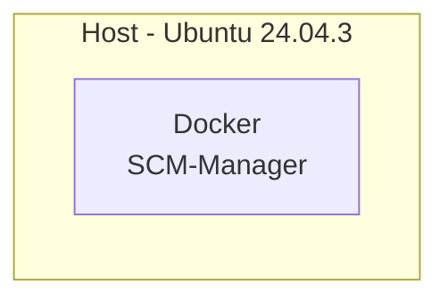

## 2.1. [Install scm-manager with docker](https://scm-manager.org/docs/latest/en/installation/docker)

#### A. docker run

```bash
# Grab the latest version from download page
$ export SCM_DOCKER_NAME=lanka-scm
$ export SCM_HOME_DIR=/work/scm
$ docker run -d \
  --name $SCM_DOCKER_NAME \
  -p 8080:8080 \
  -v $SCM_HOME_DIR:/var/lib/scm \
  scmmanager/scm-manager
```

#### B. Image and Container

```bash
$ docker images
REPOSITORY               TAG       IMAGE ID       CREATED       SIZE
scmmanager/scm-manager   latest    44ee2b1dde98   12 days ago   301MB

$ docker ps
CONTAINER ID   IMAGE                    COMMAND                  CREATED         STATUS                   PORTS                                       NAMES
bdaa68b8ae74   scmmanager/scm-manager   "/opt/scm-server/bin…"   2 minutes ago   Up 2 minutes (healthy)   0.0.0.0:8080->8080/tcp, :::8080->8080/tcp   lanka-scm

```

#### C. docker logs

>  Startup token for initial user creation

```bash
$ docker logs $SCM_DOCKER_NAME
...
2025-08-14 07:13:50.092 [main] [          ] WARN  sonia.scm.lifecycle.AdminAccountStartupAction - ====================================================
2025-08-14 07:13:50.092 [main] [          ] WARN  sonia.scm.lifecycle.AdminAccountStartupAction - ==                                                ==
2025-08-14 07:13:50.092 [main] [          ] WARN  sonia.scm.lifecycle.AdminAccountStartupAction - ==    Startup token for initial user creation     ==
2025-08-14 07:13:50.092 [main] [          ] WARN  sonia.scm.lifecycle.AdminAccountStartupAction - ==                                                ==
2025-08-14 07:13:50.095 [main] [          ] WARN  sonia.scm.lifecycle.AdminAccountStartupAction - ==              Xj3o99vkKqrYTXBEZ2vb              ==
2025-08-14 07:13:50.095 [main] [          ] WARN  sonia.scm.lifecycle.AdminAccountStartupAction - ==                                                ==
2025-08-14 07:13:50.095 [main] [          ] WARN  sonia.scm.lifecycle.AdminAccountStartupAction - ====================================================

...

```

#### D. docker exec

```bash
$ docker exec -it $SCM_DOCKER_NAME /bin/bash
```

# 3. Showtime

> http://127.0.0.1:8080/scm/
>
> Startup Token: 請見前一章節

## 3.1. Administration Account

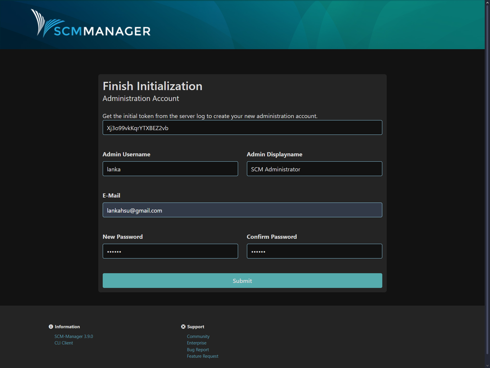

## 3.2. Plugin Sets

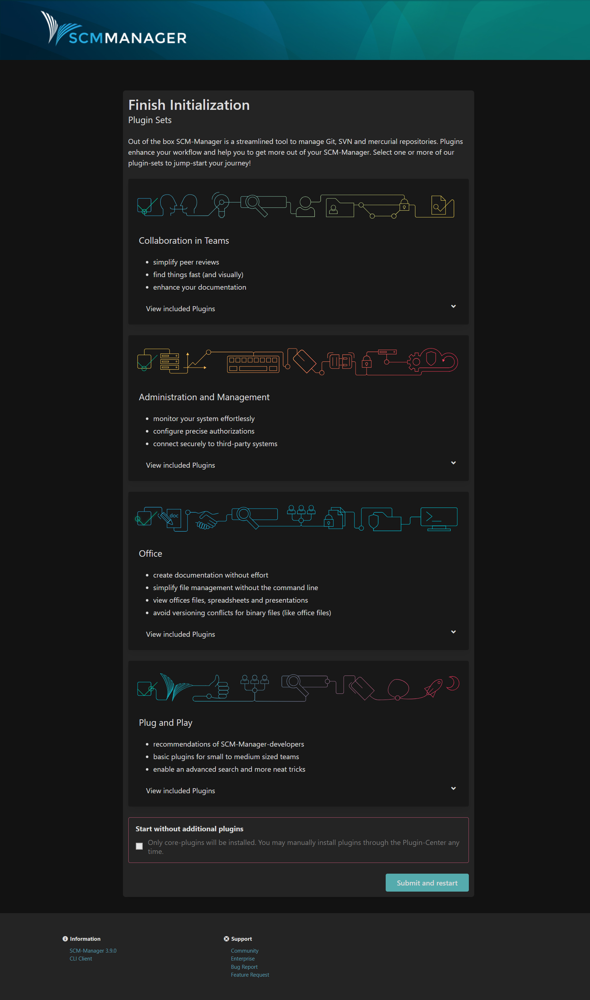

## 3.3. Login

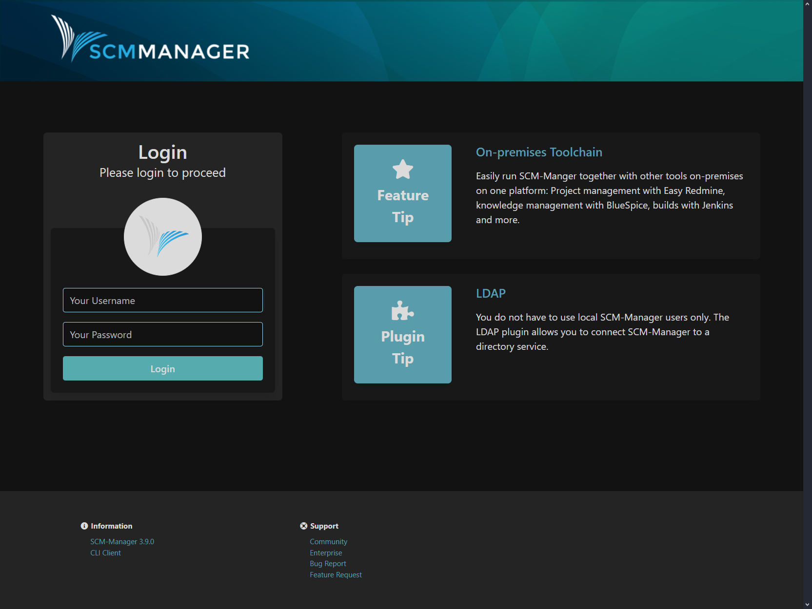

## 3.4. mySCM

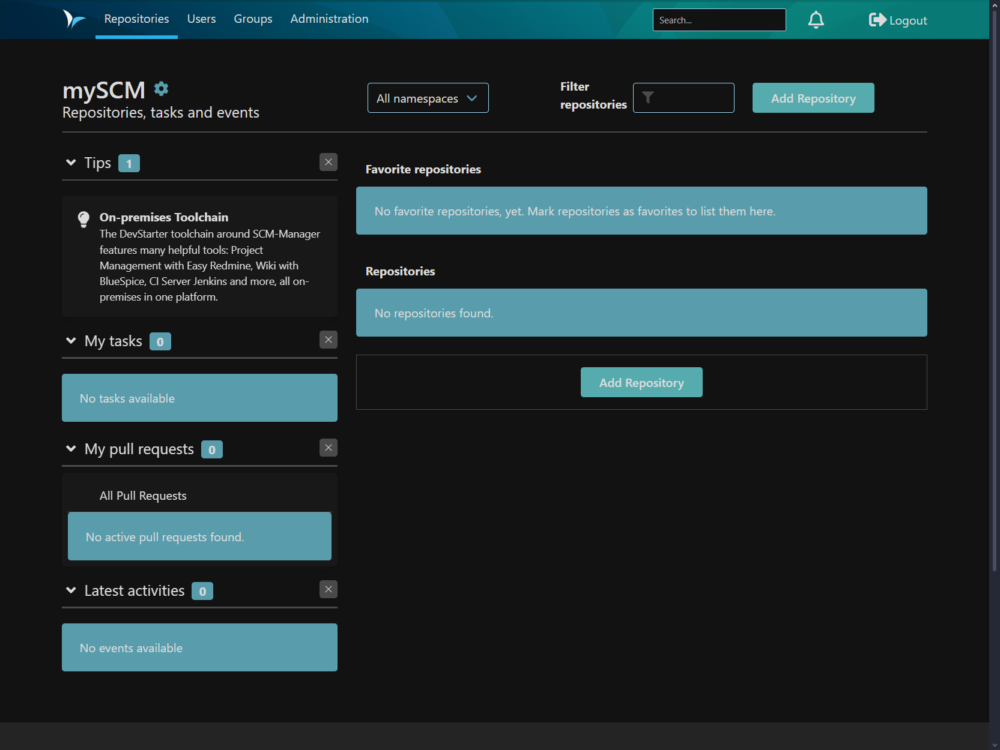


# 4. Repository

## 4.1. Add Repository

### 4.1.1. Create a new repository

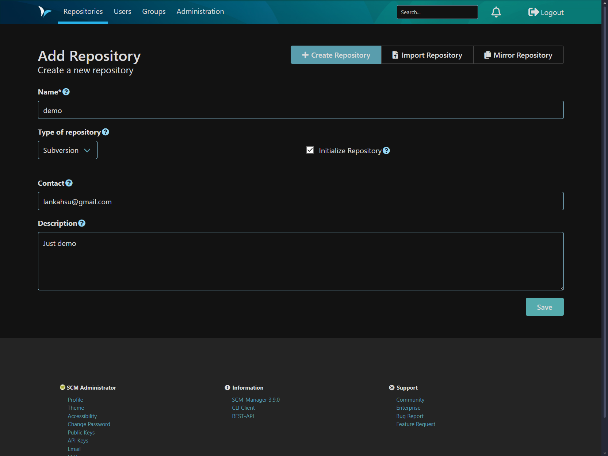

### 4.1.2. Information

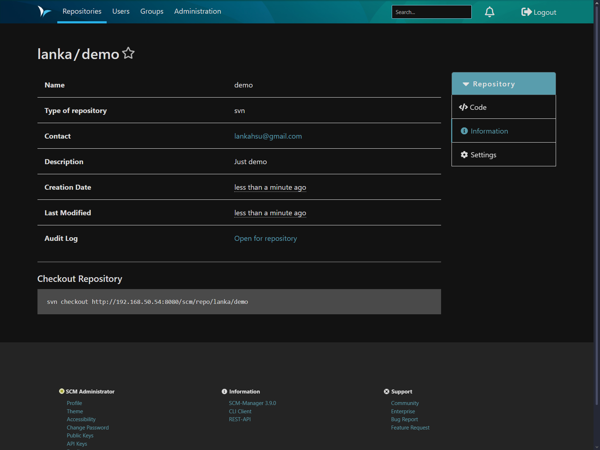

### 4.1.3. List

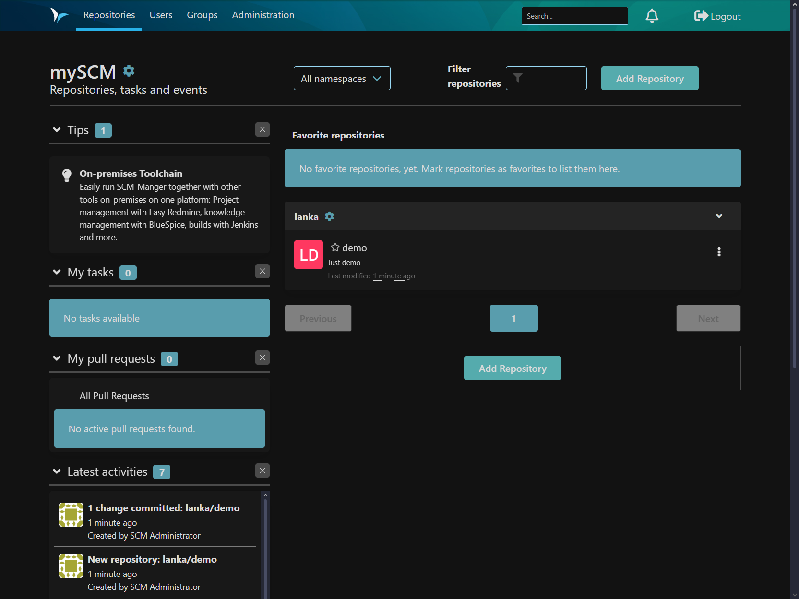

### 4.1.4. Repository

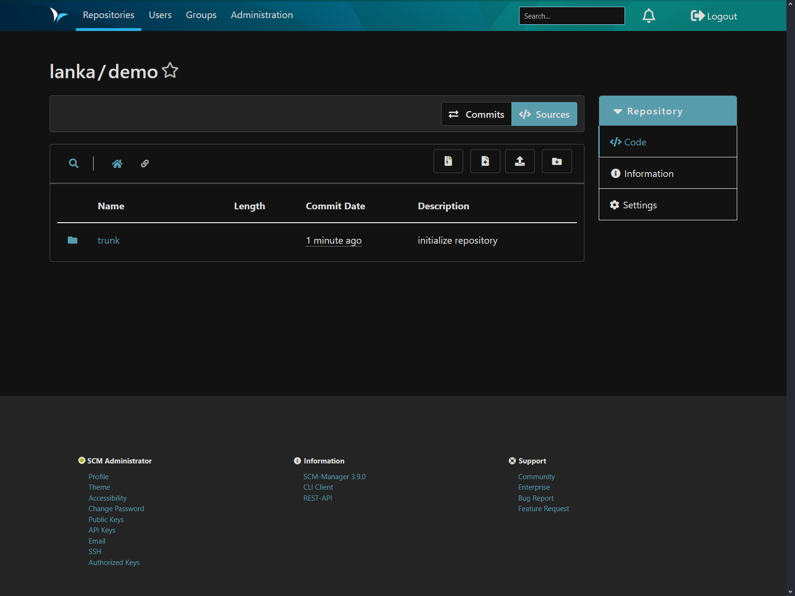

### 4.1.5. Files


```bash
$ echo $SCM_HOME_DIR
/work/scm

$ tree -L 4 /work/scm/repositories
/work/scm/repositories
└── 63UttW9SyP
    ├── data
    │   ├── conf
    │   │   ├── authz
    │   │   ├── passwd
    │   │   └── svnserve.conf
    │   ├── db
    │   │   ├── current
    │   │   ├── format
    │   │   ├── fsfs.conf
    │   │   ├── fs-type
    │   │   ├── min-unpacked-rev
    │   │   ├── rep-cache.db
    │   │   ├── revprops
    │   │   ├── revs
    │   │   ├── transactions
    │   │   ├── txn-current
    │   │   ├── txn-current-lock
    │   │   ├── txn-protorevs
    │   │   ├── uuid
    │   │   └── write-lock
    │   ├── format
    │   ├── hooks
    │   │   ├── post-commit.tmpl
    │   │   ├── post-lock.tmpl
    │   │   ├── post-revprop-change.tmpl
    │   │   ├── post-unlock.tmpl
    │   │   ├── pre-commit.tmpl
    │   │   ├── pre-lock.tmpl
    │   │   ├── pre-revprop-change
    │   │   ├── pre-revprop-change.tmpl
    │   │   ├── pre-unlock.tmpl
    │   │   └── start-commit.tmpl
    │   ├── locks
    │   │   ├── db.lock
    │   │   └── db-logs.lock
    │   ├── README.txt
    │   └── scm-manager.conf
    ├── metadata.xml
    └── store
        ├── config
        │   ├── branchWritePermission.xml
        │   ├── executedUpdates.xml
        │   └── pathWritePermission.xml
        └── data
            ├── file-locks
            └── repository-avatar

16 directories, 32 files

```

### 4.1.6. Clone

```bash
$ svn checkout http://192.168.50.54:8080/scm/repo/lanka/demo
A    demo/trunk
A    demo/trunk/README.md
Checked out revision 1.

$ tree -L 4 demo/
demo/
└── trunk
    └── README.md

2 directories, 1 file
```

## 4.2. Import existing repository

### 4.2.1. Import SVN repository (Not export from SCM)

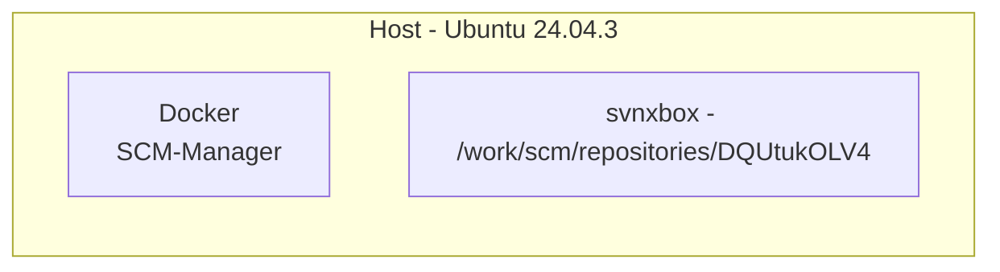

> <font color="red">以下是非正規操作。</font>
>
> 目的是想將 SCM-Manager 取代掉 Trac，照道理只是換個 UI，總不能連個資料庫的內容都保不住。
>
> 這邊也有一個問題，讓大家試想一下，如果該 repository已經達到 1GB 以上，如果還是使用網頁提供 import/export 方法時，幾乎都會失敗收場！

#### A. Dump the existing repository

> 這邊先用 [svndumpsanitizer](https://github.com/dsuni/svndumpsanitizer) filter 出想要的檔案

```bash
$ cd /work_svnxbox
export SVN_NAME_SRC=svnxbox
export SVN_DUMP_SOURCE_FILE="/work/dump-svn-all"

# 先把所有的的資料 dump 出來
svnadmin dump $SVN_NAME_SRC > $SVN_DUMP_SOURCE_FILE

# filter
export SVN_DUMP_FILTER=""
export SVN_DUMP_FILTER="$SVN_DUMP_FILTER trunk/xbox"

# 這邊採用 include
export SVN_DUMP_FILTER_FILE_INCLUDE="/work/dump-svn-include"

svndumpsanitizer \
 --infile $SVN_DUMP_SOURCE_FILE \
 --outfile $SVN_DUMP_FILTER_FILE_INCLUDE \
 --include $SVN_DUMP_FILTER \
 --drop-empty

$ cd /work
tar -zcvf dump-svn-include.tar.gz dump-svn-include
```

#### B. Create a new repository

> 記得勾選 Initialize Repository

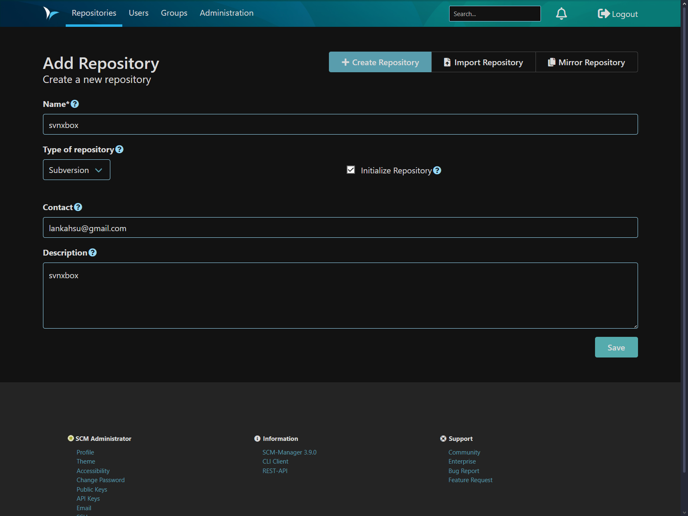

```bash
# 這的建立在 DQUtukOLV4
$ tree -L 4 /work/scm/repositories/DQUtukOLV4

# clone repository
$ cd /work
$ svn checkout http://192.168.50.54:8080/scm/repo/lanka/svnxbox

$ docker stop $SCM_DOCKER_NAME
$ docker rm $SCM_DOCKER_NAME
```

#### C. Import from dump

```bash
$ cd /work/scm/repositories/DQUtukOLV4
$ mv data data-bak

$ export SVN_NAME_DST=data
$ svnadmin create $SVN_NAME_DST
$ svnadmin load --ignore-uuid $SVN_NAME_DST < $SVN_DUMP_FILTER_FILE_INCLUDE

$ cp data-bak/db/uuid data/db/uuid
$ cp data-bak/hooks/pre-revprop-change data/hooks/pre-revprop-change
$ cp data-bak/scm-manager.conf data/scm-manager.conf

# 之後重啟
$ docker run -d \
 --name $SCM_DOCKER_NAME \
 -p 8080:8080 \
 -v $SCM_HOME_DIR:/var/lib/scm \
 scmmanager/scm-manager
```

#### D. Check

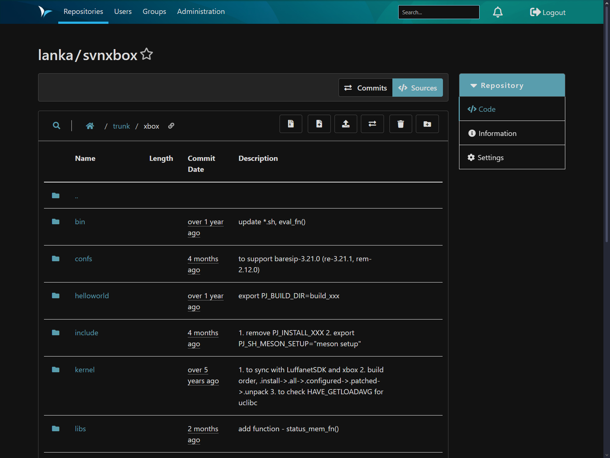

```bash
$ cd /work/svnxbox
$ svn up

$ svn add trunk/xbox/platform/ubuntu/02_install/apt_install2404.sh
$ svn ci ./

# 確定能正常使用就將原來的備份移除
$ cd /work/scm/repositories/DQUtukOLV4
$ rm -rf data-bak
```

#### E. Move DB

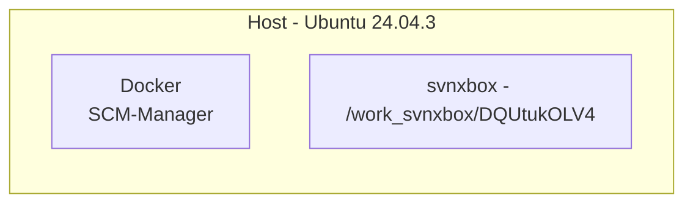

```bash
$ mv /work/scm/repositories/DQUtukOLV4 /work_svnxbox/

$ export SCM_DOCKER_NAME=lanka-scm
$ export SCM_HOME_DIR=/work/scm
$ docker run -d \
  --name $SCM_DOCKER_NAME \
  -p 8080:8080 \
  -v $SCM_HOME_DIR:/var/lib/scm \
  -v /work_svnxbox/DQUtukOLV4:/var/lib/scm/repositories/DQUtukOLV4 \
  scmmanager/scm-manager
```

# Appendix

# I. Study

## I.1. [ Apache Allura](https://forge-allura.apache.org/docs/index.html#)

# II. Debug

# III. Glossary

# IV. Tool Usage

# Author

> Created and designed by [Lanka Hsu](lankahsu@gmail.com).

# License

> [HelperX](https://github.com/lankahsu520/HelperX) is available under the BSD-3-Clause license. See the LICENSE file for more info.

