# SVN vs. Git
[](https://github.com/lankahsu520/HelperX)
[![GitHub license][license-image]][license-url]
[![GitHub stars][stars-image]][stars-url]
[![GitHub forks][forks-image]][forks-url]
[![GitHub issues][issues-image]][issues-image]
[![GitHub watchers][watchers-image]][watchers-image]

[license-image]: https://img.shields.io/github/license/lankahsu520/HelperX.svg
[license-url]: https://github.com/lankahsu520/HelperX/blob/master/LICENSE
[stars-image]: https://img.shields.io/github/stars/lankahsu520/HelperX.svg
[stars-url]: https://github.com/lankahsu520/HelperX/stargazers
[forks-image]: https://img.shields.io/github/forks/lankahsu520/HelperX.svg
[forks-url]: https://github.com/lankahsu520/HelperX/network
[issues-image]: https://img.shields.io/github/issues/lankahsu520/HelperX.svg
[issues-url]: https://github.com/lankahsu520/HelperX/issues
[watchers-image]: https://img.shields.io/github/watchers/lankahsu520/HelperX.svg
[watchers-url]: https://github.com/lankahsu520/HelperX/watchers

# 1. Overview

## 1.1. 基本認知

> 為什麼介紹版本控制系統，需要討論這些。
>
> 世界就這麼小，身邊就遇到奇葩的人事物。

### 1.1.1. Mind

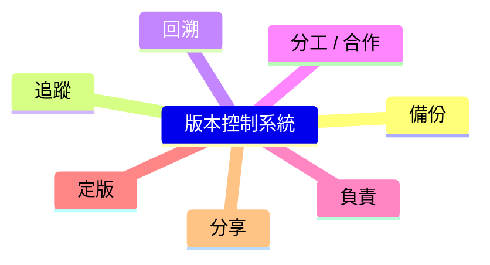

### 1.1.2. 認知扭曲

#### A. 版本控制系統只能存放程式碼

>錯，不只程式碼、圖檔、執行檔、文件等都可放入。

#### B. 分散式比集中式好

> 錯，分散式和集中式只是差在操作時的限制，所以沒有好和壞。是因為不了解什麼是分散式，什麼是集中式才會這種認知。

> 在離線的狀能下，查看 log 時， git log 會有結果，而 svn log 會失敗。
>
> 在離線的狀能下，查看 diff 時， git diff 會有結果，而 svn diff 會失敗。

#### C. git 就是好棒棒，svn 就是爛

>會有這想法的人，本身認知就很扭曲，而且不太會用 svn。

#### D. svn 沒有 merge, branch or tag

> 錯，merge 就請見 svn  merge。而 branch or tag 在 svn 中，只是呈現方式不同於 git。
>
> 想學，請見後面章節。
>
> （身邊的軟體工程師，教了很多次後還是不會，心寒）

#### E. 沒有解決衝突的能力

>後面很多問題，都是因為沒有解決衝突的能力，就怪東怪西的。

#### F. 每次 svn commit 時都會衝突

>跟前一問題有關係，沒有良好的習慣，要隨時同步工作區的檔案和 server repository。
>
>```bash
>$ svn up
>$ git pull
>```
>
>再來就是本身的無知， svn ci = git commit + git push

#### G. 使用 git 不是有 local repository，為什麼 commit 前要 pull

>就是對 local repository 一知半解，認為 commit 沒事就好。
>
>忘了還有 server repository，在你工作的同時，你的夥伴也是很努力的在工作，

#### I. 個人管個人的檔案，怎麼會衝突

>專案是分工，不是分檔案，版本控制系統不負責這類問題。

>沒有合作精神的人才會問這個。

#### J. 那要改檔案，每個人都各自開 branch 再改

>此法看似沒問題，如 Opensource 進程，當非成員要修改檔案時，在 github 和 gitlab 兩大平台上。一個使用 pull request，而另一個則是 merge request，最後再進行 branch 間的 merge。

>一般的專案管理，團隊都會決定在那個 branch 進行開發，而不是每個人個別開 branch 開發後再 merge。其中的原因有很多，整理一些如下
>
>- 時間不允許。
>- 員工必須緊密的合作，如同事間提供 api。
>- Daily build 不只試著編譯有無出錯，甚至有時要交給 QA 進行測試。
>- 再來公司請不起專職、專業的 code reviewer，雖然能讓同事來支援，但支援久了，不只沒有錢拿，還算加重該同事的負擔。
>- 就算 merge request/pull request (A) 已提出，但是在等待 accept 時間，有新的提交進入目標分支，一樣有可能發生衝突。
>- branch 進行 merge 時，是進行批次的匯入，反而更不利於解決衝突。
>- 延續前面項目，如果版本有先後關係，未完成前面的 merge (A)，如果其它人要繼續開發，也只能使用目前的版本另開 branch，當前面完成 merge (A) 後，手邊的版本不是要再一次進行 merge，這看似簡單，如果是 10個人等待這個版本呢 ？又或是這個 merge (A) 的變動很大時，這之後的功夫更是難上加難。

> 個人是建議，只要個人工作到一個斷點就上傳 codes，而不是等解決某個 bug  或完成整個功能才上傳。

### 1.1.3. 致命傷

#### A. git

> git 的 **Commit Hash** 沒辦法很快的分辨先後順序。
>
> 在不查看系統的情況下，是無法知道目前的版本已經解決某個問題。

#### B. svn

> 如果不小心把密碼放入，想從記錄中完全移除就得使用 svnadmin dump，這就等於要放棄原有的 repository，建立新的 repository。

## 1.2. System Environment

### 1.2.1. Install

#### svn

```bash
# install subversion-tools
$ sudo apt-get --yes install subversion-tools
```

```bash
# to set the default editor
$ export SVN_EDITOR=vim
```

#### git

```bash
# install git
$ sudo apt-get --yes install git
```

```bash
# to set the default editor
$ export GIT_EDITOR=vim

$ git config --global core.editor "vim"
```

```bash
# git diff
$ export LESS=Rx2

$ git config --global core.pager "less -FRSX"

# prevent 'git diff' from using a pager
$ git config --global pager.diff false
```

```bash
$ vim ~/.gitconfig
[user]
  email = lankahsu@gmail.com
  name = Lanka Hsu
[color]
  ui = auto
[http]
  cookiefile = /home/lanka/.gitcookies
[pager]
  diff = false
[core]
  pager = less -FRSX

$ git config –global user.name "name"
$ git config –global user.email "email address"

$ git config --global user.email "lankahsu@gmail.com"
$ git config --global user.name "Lanka Hsu"

$ git config --global -l
user.email=lankahsu@gmail.com
user.name=Lanka Hsu
color.ui=auto
http.cookiefile=/home/lanka/.gitcookies
pager.diff=false
```

# 2. Repository

#### svn

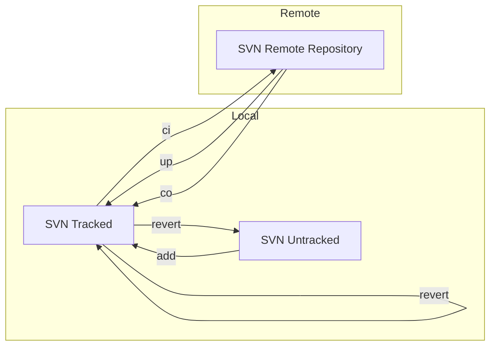
> SVN：沒有所謂的 Local Repository。需要一個 SVN Server 擺放 Repository。
#### git

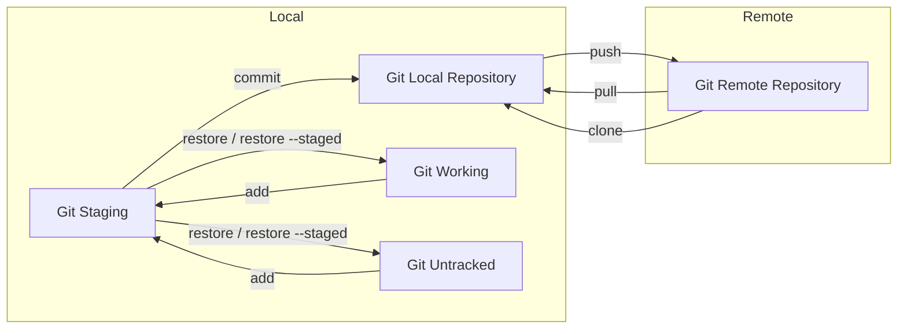
> Git：分別存在 Remote Repository 和 Local Repository。
```bash
# Create an empty Git repository or reinitialize an existing one
$ mkdir HelloWorld
$ cd HelloWorld
$ git init
```

## 2.1. Branch

#### svn cp

> svn 基本上沒有 git branch 的概念，那要如何實作相同的功能，就用不同目錄來代表。如 svnroot/trunk/xbox、svnroot/brancees/xbox-b1。
>
> 也因此 svn 可以擷取單一目錄，不用抓取整個 repository，也因此省下不少時間！
>

#### git branch

```bash
# the current
$ git branch

# list all
$ git branch -a
$ git branch -r

# delete
$ git branch -d new-branch
# force to delete
$ git branch -D new-branch
# rename
$ git branch -m old-branch new-branch
# push
$ git push origin :old-branch new-branch

```

#### git checkout

```bash
# List all branch
$ git branch -a

# switch to new-branch (exist)
$ git checkout new-branch

# git checkout remotes/origin/branch1 -> branch1
git checkout -b branch1 remotes/origin/branch1
# create branch
$ git checkout -b new-branch
$ git checkout -b new-branch origin

# List all tag
$ git tag
# switch to tag
$ git checkout 1.0.0
# switch back
$ git switch -
```

>很重要！很重要！很重要！當要 checkout 或是切換至其它 branch 時，記得 local files 是否有更動且已經將其備份或保留。
>
><font color="red">如果需要查看 branch1 和 branch2 的程式碼，建議在硬碟存放兩份。</font>

```bash
$ git clone -b branch1 http://trac-vbx/gitroot/gitroot.git gitroot-branch1
$ git clone -b branch2 http://trac-vbx/gitroot/gitroot.git gitroot-branch2
```

#### git switch

```bash
$ git switch -c hardknott remotes/origin/hardknott
```

## 2.2. Tag

#### svn cp

> svn 基本上沒有 git tag 的概念，那要如何實作相同的功能，就用不同目錄來代表。如 svnroot/trunk/xbox、svnroot/tags/xbox-v1。
>
> 也因此 svn 可以擷取單一目錄，不用抓取整個 repository，也因此省下不少時間！
>
> 另外因為是不同目錄代表，所以可以繼續延伸開發。不像 Git tag 在定錨後就不能進版。

#### git tag

```bash
# Create, list, delete or verify a tag object signed with GPG
# list
$ git tag

# create
$ git tag -a v1.1.0
$ git push origin v1.1.0

# delete
$ git tag -d v1.1.0
$ git push --delete origin v1.1.0

```
## 2.3. Git Local Repository

```bash
#** 四個狀態 **
Untracked files

Working directory
	Changes not staged for commit
		$ git checkout -- *
Staging area
	Changes to be committed
		$ git reset
Repository
	Committed
		$ git reset --hard HEAD
```

### 注意！注意！注意！

> 從上可以知道 Git 有四個狀態，感覺上管理的很有制度，但是如果 Working <--> Staging 變動過多，就算只有“你”一位修改人員，之後 commit、push 和 pull時，也會發生衝突！
>
> 所以要小心！再小心！

> 另外 Git 使用中有所謂的 Index，這個反而會讓使用者有困擾。
>
> 我們應該把事情簡單化，將 Git 的使用方式同化為  SVN Tracked 和 SVN Untracked。

# 3. General Commands

## 3.1. Clone a repository into a new directory

#### svn co

```bash
$ svn co http://trac-vbx/svnroot/trunk/xbox xbox-123

# to get the special folder - test 
$ svn co http://trac-vbx/svnroot/trunk/xbox/test xbox-test

# with username
$ svn co --username lanka http://trac-vbx/svnroot/trunk/xbox/test
```

#### git clone

```bash
$ git clone http://trac-vbx/gitroot/xbox xbox-123
$ git clone --recurse-submodules http://trac-vbx/gitroot/xbox xbox-456

# to get the special branch - test
$ git clone -b test http://trac-vbx/gitroot/xbox xbox-test

# to get the special branch - v3.6.1 and submodule
git clone -b v3.6.1 --recursive https://github.com/Mbed-TLS/mbedtls.git mbedtls-3.6.1
```

## 3.2. Record changes to the repository

#### svn ci

```bash
$ svn ci ./
or
$ svn commit ./
```

#### git commit and git push

```bash
$ git commit ./
# Update remote refs along with associated objects.
$ git push ./

# 不建議使用，要就一起上，Not pushed + most recent commit
git commit --amend ./s

```

## 3.3. Fetch from and integrate with another repository or a local branch

#### svn up

```bash
$ svn up
```

#### git pull

```bash
$ git pull
```

## 3.4. Add file contents to the index

#### svn add

```bash
$ svn add helloworld.c
```

#### git add

```bash
$ git add helloworld.c
```

## 3.5. Remove files from the working tree and from the index

#### svn rm

```bash
$ svn rm helloworld.c
```

#### git rm

```bash
$ git rm helloworld.c
```

## 3.6. Move an item in a working copy

#### svn mv

```bash
$ svn mv helloworld.c helloworld_bak.c
```

#### git mv

```bash
$ git mv helloworld.c helloworld_bak.c
```

## 3.7. Copy files and directories in a working copy or repository

#### svn cp

```bash
$ svn cp helloworld.c helloworld_cp.c
```

#### git ??

```bash
```

# 4. Show difference, log

## 4.1. Show the working tree status

#### svn status

```bash
$ svn status

# don't print unversioned items
$ svn st -q

# disregard default and svn:ignore and svn:global-ignores property ignores
$ svn status --no-ignore
```

#### git status

```bash
$ git status
```

## 4.2. Show changes between commits, commit and working tree

#### svn diff

```bash
$ svn diff

# show history
$ svn diff -r2600
```

#### git diff

```bash
$ git diff
```

#### git show

```bash
$ git show

# show history
$ git show HEAD
$ git show 366aace
```

## 4.3. Show commit logs

#### svn log

```bash
$ svn log | more
```

#### git log

> Placeholders that expand to information extracted from the commit:
>
> %H    commit hash
> %h    abbreviated commit hash
> %T    tree hash
> %t    abbreviated tree hash
> %P    parent hashes
> %p    abbreviated parent hashes
> %an   author name
> %aN   author name (respecting .mailmap, see git-shortlog(1) or git-blame(1))
> %ae   author email
> %aE   author email (respecting .mailmap, see git-shortlog(1) or git-blame(1))
> %al   author email local-part (the part before the @ sign)
> %aL   author local-part (see %al) respecting .mailmap, see git-shortlog(1) or git-blame(1))
> %ad   author date (format respects --date= option)
> %aD   author date, RFC2822 style
> %ar   author date, relative
> %at   author date, UNIX timestamp
> %ai   author date, ISO 8601-like format
> %aI   author date, strict ISO 8601 format
> %as   author date, short format (YYYY-MM-DD)
> %cn   committer name
> %cN   committer name (respecting .mailmap, see git-shortlog(1) or git-blame(1))
> %ce   committer email
> %cE   committer email (respecting .mailmap, see git-shortlog(1) or git-blame(1))
> %cl   author email local-part (the part before the @ sign)
> %cL   author local-part (see %cl) respecting .mailmap, see git-shortlog(1) or git-blame(1))
> %cd   committer date (format respects --date= option)
> %cD   committer date, RFC2822 style
> %cr   committer date, relative
> %ct   committer date, UNIX timestamp
> %ci   committer date, ISO 8601-like format
> %cI   committer date, strict ISO 8601 format
> %cs   committer date, short format (YYYY-MM-DD)
> %d    ref names, like the --decorate option of git-log(1)
> %D    ref names without the " (", ")" wrapping.
> %S    ref name given on the command line by which the commit was reached (like git log --source), only works with git log
> %e    encoding
> %s    subject
> %f    sanitized subject line, suitable for a filename
> %b    body
> %B    raw body (unwrapped subject and body)
> %N    commit notes
> %GG   raw verification message from GPG for a signed commit
> %G?   show "G" for a good (valid) signature, "B" for a bad signature, "U" for a good signature with unknown validity, "X" for a good signature that has expired, "Y" for a good signature made by an expired key, "R" for a
>       good signature made by a revoked key, "E" if the signature cannot be checked (e.g. missing key) and "N" for no signature
> %GS   show the name of the signer for a signed commit
> %GK   show the key used to sign a signed commit
> %GF   show the fingerprint of the key used to sign a signed commit
> %GP   show the fingerprint of the primary key whose subkey was used to sign a signed commit
> %gD   reflog selector, e.g., refs/stash@{1} or refs/stash@{2 minutes ago}; the format follows the rules described for the -g option. The portion before the @ is the refname as given on the command line (so git log -g
>       refs/heads/master would yield refs/heads/master@{0}).
> %gd   shortened reflog selector; same as %gD, but the refname portion is shortened for human readability (so refs/heads/master becomes just master).
> %gn   reflog identity name
> %gN   reflog identity name (respecting .mailmap, see git-shortlog(1) or git-blame(1))
> %ge   reflog identity email
> %gE   reflog identity email (respecting .mailmap, see git-shortlog(1) or git-blame(1))
> %gs   reflog subject

```bash
$ git log
commit 27bdad703b263227ef211cc69dedf946a5750e41 (HEAD -> master, origin/master, origin/HEAD)
Author: LankaHsu <lankahsu@gmail.com>
Date:   Sat May 4 23:00:29 2024 +0800

    update helper_linux.md, 22. usb Hadler

$ git log --oneline --graph -1

$ git log --oneline
27bdad7 (HEAD -> master, origin/master, origin/HEAD) update helper_linux.md, 22. usb Hadler

$ git log --oneline --graph
* 27bdad7 (HEAD -> master, origin/master, origin/HEAD) update helper_linux.md, 22. usb Hadler

$ git log --pretty=reference --graph
* 27bdad7 (update helper_linux.md, 22. usb Hadler, 2024-05-04)

$ git log --graph --pretty=format:"%C(auto)%h%d%Creset %C(cyan)(%cr)%Creset %C(green)%cn <%ce>%Creset %s"
* 27bdad7 (HEAD -> master, origin/master, origin/HEAD) (2 days ago) LankaHsu <lankahsu@gmail.com> update helper_linux.md, 22. usb Hadler

$ git log --graph --pretty=format:"%C(auto)%h%d%Creset %C(cyan)(%ci)%Creset %C(green)%cn <%ce>%Creset %s"
* 27bdad7 (HEAD -> master, origin/master, origin/HEAD) (2024-05-04 23:00:29 +0800) LankaHsu <lankahsu@gmail.com> update helper_linux.md, 22. usb Hadler

$ git log --graph --pretty=format:"%C(auto)%h%d%Creset %C(cyan)(%cs)%Creset %s"
* 27bdad7 (HEAD -> master, origin/master, origin/HEAD) (2024-05-04) update helper_linux.md, 22. usb Hadler

$ git log --graph --pretty=format:"%C(auto)%h%d%Creset %C(cyan)(%cd)%Creset %C(green)<%cn>%Creset %s" --date="format:%Y/%m/%d %T"
* 27bdad7 (HEAD -> master, origin/master, origin/HEAD) (2024/05/04 23:00:29) <LankaHsu> update helper_linux.md, 22. usb Hadler
```

## 4.4. Ignore Files

#### svn:ignore

```bash
$ svn propedit svn:ignore .
# enter your ignore files
```

#### svn:global-ignores
```bash
$ svn propedit svn:global-ignores .
# 測試過好像沒什麼效果
```

#### .gitignore

```bash
$ touch .gitignore
$ vi .gitignore
# enter your ignore files
```

# 5. Advanced Commands

## 5.1. Restore working tree files

#### svn revert

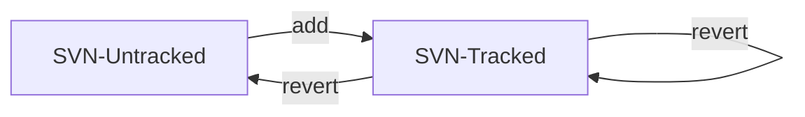

```bash
$ svn revert helloworld_cp.c 
```

#### git restore or ? checkout

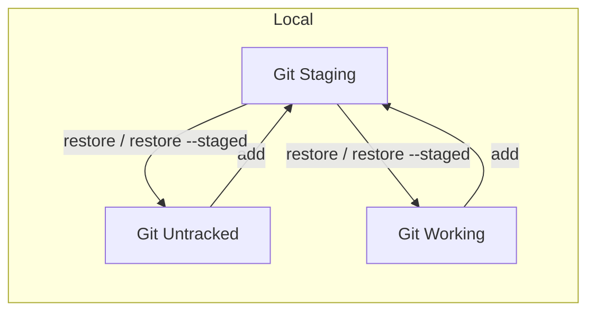

```bash
$ git restore helloworld_cp.c
$ git restore --staged helloworld_cp.c

$ git checkout -- *
```

## 5.2. Manage set of tracked repositories (change the url of repositorie)

#### svn relocate

```bash
# to check the repository root URL 
$ svn info

$ svn relocate http://trac-vbx/svnroot/trunk/xbox
```

#### svn switch

```bash
# to check the repository root URL 
$ svn info

$ svn switch http://trac-vbx/svnroot/trunk/xbox
```

#### git remote

```bash
# to check the repository root name
$ git remote
origin

# to check the repository root URL
$ git remote -v

$ git remote set-url origin http://trac-vbx/gitroot/xbox
```

## 5.3. Roll back

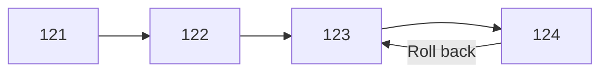

#### svn merge

```bash
# Undo a committed change
SVN_LAST=`svn info 2>/dev/null | grep 'Last Changed Rev' | cut -d':' -f2 | awk '{print $1}'`
svn merge -c -${SVN_LAST} .

svn ci ./
```

#### git reset

```bash
$ git reset --hard xxxxxx
$ git reset --hard ORIG_HEAD

# back 2*committed
$ git reset HEAD^^

# back 3*committed
$ git reset HEAD~3

$ git push -f
```

## 5.4. Merge

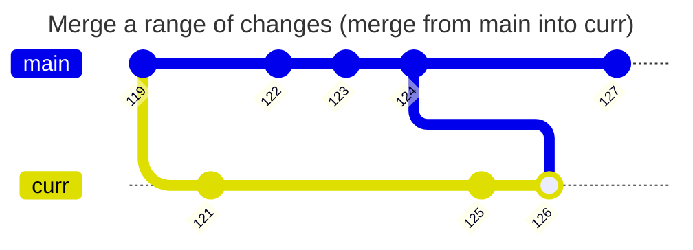

---

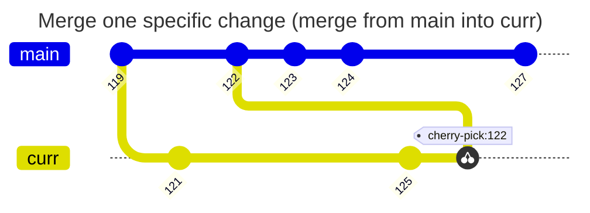
#### svn merge


```bash
# Merge a range of changes
$ svn merge -r 122:124 http://trac-vbx/svnroot/trunk/xbox ./
$ svn ci ./
```


```bash
# Merge one specific change
$ svn merge -c 122 ./
$ svn ci ./
```

```bash
# Remove svn:mergeinfo
$ svn propget svn:mergeinfo --depth=infinity | grep -v "^/" | grep -v "^\." | cut -d- -f1 | xargs svn propdel svn:mergeinfo

$ svn ci ./
```

#### git merge

```bash
$ git checkout curr
Switched to branch 'curr'

# master -> curr
$ git merge master
# 儘量使用這個，可保留分支線形，比較好閱讀
$ git merge --no-ff master
```
```bash
# Merge one specific change
$ git cherry-pick 122
```

## 5.5. Show what revision and author last modified each line of a file

#### svn blame


```bash
$ svn blame helper_SVNvsGit.md
```

#### git blame

```bash
$ git blame helper_SVNvsGit.md
```

# 6. Server with apache2

> 請見 [helper_VCS-Trac.md](https://github.com/lankahsu520/HelperX/blob/master/helper_VCS-Trac.md)

## ~~6.1. apache2~~

#### ~~A. sites-available/*.conf~~

```bash
# enable the svn site configuration
$ sudo vi /etc/apache2/sites-available/svn.conf
$ sudo a2ensite svn.conf

$ sudo htpasswd -c /work_svnroot/.htpasswd lanka

# enable the git site configuration
$ sudo vi /etc/apache2/sites-available/git.conf
$ sudo a2ensite git.conf

$ sudo htpasswd -c /work_gitroot/.htpasswd lanka

# apache2 reload
$ systemctl reload apache2

```

##### ~~A.1. [git.conf](./SVNvsGit/git.conf)~~

```conf
	SetEnv GIT_PROJECT_ROOT /work_gitroot
	SetEnv GIT_HTTP_EXPORT_ALL

	ScriptAlias /gitroot /usr/lib/git-core/git-http-backend/

	Alias /gitroot /work_gitroot
	<Directory /usr/lib/git-core>
		Options +ExecCGI -MultiViews +SymLinksIfOwnerMatch
		AllowOverride None
		Require all granted
	</Directory>
	<Directory /work_gitroot>
		Options Indexes FollowSymLinks MultiViews
		AllowOverride None
		Require all granted
	</Directory>
	#<LocationMatch /gitroot/.*\.git>
	#	Dav On
	#	AuthType Basic
	#	AuthName "Git Verification"
	#	AuthUserFile /work_gitroot/authz
	#	Require valid-user
	#</LocationMatch>

	<Location /gitroot/gitroot.git>
		AuthType Basic
		AuthName "Git Repository - /gitroot"
		AuthUserFile /work_gitroot/.htpasswd
		Require valid-user
	</Location>
```

##### ~~A.2. [svn.conf](./SVNvsGit/svn.conf)~~

```conf
	<Location /svnroot>
		DAV svn
		SVNPath /work_svnroot/svnroot
		AuthType Basic
		AuthName "SVN Repository - /svnroot"
		AuthUserFile /work_svnroot/.htpasswd
		AuthzSVNAccessFile /work_svnroot/authz
		Require valid-user
	</Location>
```

#### ~~B. ports.conf~~

```bash
$ sudo vi /etc/apache2/ports.conf
```

#### ~~C. enable Apache modules~~

```bash
$ sudo apt-get install libapache2-mod-python
$ sudo a2enmod python

# enable Apache mod_env, mod_cgi, mod_alias, mod_rewrite, ... modules
$ sudo a2enmod env cgi alias rewrite dav dav_svn dav_fs

```

#### ~~D. restart apache2~~

```bash
$ sudo service apache2 restart
```

## ~~6.2. Git Server~~

#### ~~A. Add User and Group~~

```bash
$ sudo addgroup git
$ sudo usermod -G git -a www-data
$ sudo usermod -G git -a lanka
```

#### ~~B. Create Repository - [git-create-repo.sh](./SVNvsGit/git-create-repo.sh)~~

```bash
$ cd /work_gitroot
$ ./git-create-repo.sh gitroot.git
$ ll
drwxrwxr-x  7 www-data git    4096 十一 28 14:56 gitroot.git/

# Please make sure group is git
```

#### ~~C.  git clone~~

```bash
$ git clone http://trac-vbx/gitroot/gitroot.git

# save the specified Git credentials in the “.git/config”
$ git config credential.helper store
```

## ~~6.3. SVN Server~~

#### ~~A. Add User and Group~~

```bash
$ sudo addgroup subversion
$ sudo usermod -G subversion -a www-data
$ sudo usermod -G subversion -a lanka
```

#### ~~B. Create Repository - [svn-create-repo.sh](./SVNvsGit/svn-create-repo.sh)~~

```bash
$ cd /work_svnroot
$ ./svn-create-repo.sh svnroot
$ ll
drwxrwxr-x  7 www-data www-data 4096 十一 28 17:05 svnroot/

```

#### ~~C. Authz~~

```bash
$ sudo vi /work_svnroot/authz
```

```authz
[groups]
administrators = lanka
developers = lanka
releaser = lanka
viewers =

[/]
@administrators = rw
@developers =
@releaser =
@viewers =

[svnroot:/]
@administrators = rw
@developers = rw
@releaser =
@viewers =
```

#### ~~D. pre-revprop-change~~

```bash
$ cd /work_svnroot/svnroot/hooks
$ tree -L 1 ./
./
├── post-commit.tmpl
├── post-lock.tmpl
├── post-revprop-change.tmpl
├── post-unlock.tmpl
├── pre-commit.tmpl
├── pre-lock.tmpl
├── pre-revprop-change.tmpl
├── pre-unlock.tmpl
└── start-commit.tmpl

0 directories, 9 files

$ sudo mv pre-revprop-change.tmpl pre-revprop-change
$ sudo chmod 755 pre-revprop-change
```

```bash
# 更動 Changeset:123 的log
$ svn propedit svn:log --revprop -r 123
```

# 7. Special

## 7.1. SVN

### 7.1.1. Split / Filter Repository

#### A. [Chapter 4. Branching and Merging](https://svnbook.red-bean.com/en/1.7/svn.branchmerge.summary.html)

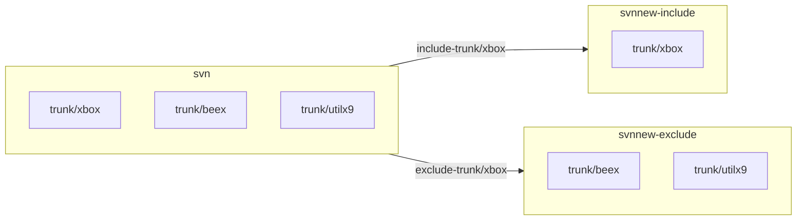

```bash
$ ls -al 
drwxrwxrwx 12 lanka    lanka            4096  八  22 13:18 ./
drwxr-xr-x 30 root     root             4096  八  12 06:19 ../
drwx------  2 root     root            16384  一   6  2021 lost+found/
drwxrwxrwx  6 www-data www-data         4096  一   3  2019 svn/
-rwxrwxr-x  1 lanka    lanka           52072  八  22 13:16 svndumpsanitizer*

```

##### A.1. **[svndumpsanitizer](https://github.com/dsuni/svndumpsanitizer)**

```bash
$ git clone https://github.com/dsuni/svndumpsanitizer.git
$ cd svndumpsanitizer
$ gcc svndumpsanitizer.c -o svndumpsanitizer
$ ./svndumpsanitizer --help
```

##### A.2. generate history

###### A.2.1. dump 

```bash
export SVN_NAME_SRC=svn
export SVN_DUMP_SOURCE_FILE="./dump-svn-all"

svnadmin dump $SVN_NAME_SRC > $SVN_DUMP_SOURCE_FILE
```

###### A.2.2. filter

```bash
export SVN_DUMP_FILTER=""
export SVN_DUMP_FILTER="$SVN_DUMP_FILTER trunk/xbox"

```

###### A.2.3. include/exclude

```bash
export SVN_DUMP_FILTER_FILE_INCLUDE="./dump-svn-include-xbox"

./svndumpsanitizer \
	--infile $SVN_DUMP_SOURCE_FILE \
	--outfile $SVN_DUMP_FILTER_FILE_INCLUDE \
	--include $SVN_DUMP_FILTER \
	--drop-empty

```

```bash
export SVN_DUMP_FILTER_FILE_EXCLUDE="./dump-svn-exclude-xbox"

./svndumpsanitizer \
	--infile $SVN_DUMP_SOURCE_FILE \
	--outfile $SVN_DUMP_FILTER_FILE_EXCLUDE \
	--exclude $SVN_DUMP_FILTER \
	--drop-empty

```

##### A.3. create new repository

###### A.3.1. include

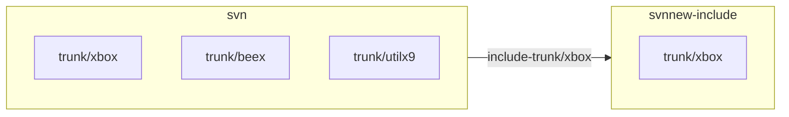

```bash
export SVN_DUMP_FILTER_FILE_INCLUDE="./dump-svn-include-xbox"
export SVN_NAME_DST=svnnew-include

svnadmin create $SVN_NAME_DST
svnadmin load --ignore-uuid $SVN_NAME_DST < $SVN_DUMP_FILTER_FILE_INCLUDE
sudo chown -R www-data:www-data $SVN_NAME_DST

sudo chmod -R 775 $SVN_NAME_DST
sudo chmod -R 777 $SVN_NAME_DST/db

```

###### A.3.2. exclude

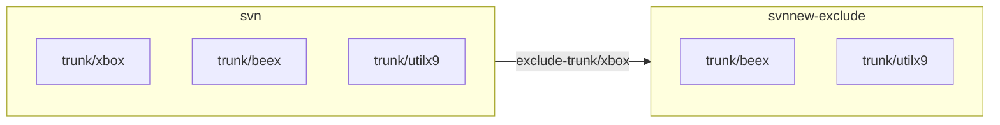

```bash
export SVN_DUMP_FILTER_FILE_EXCLUDE="./dump-svn-exclude-xbox"
export SVN_NAME_DST=svnnew-exclude

svnadmin create $SVN_NAME_DST
svnadmin load --ignore-uuid $SVN_NAME_DST < $SVN_DUMP_FILTER_FILE_EXCLUDE
sudo chown -R www-data:www-data $SVN_NAME_DST

sudo chmod -R 775 $SVN_NAME_DST
sudo chmod -R 777 $SVN_NAME_DST/db

```

##### A.4. ? Merge repository - include (main) + exclude

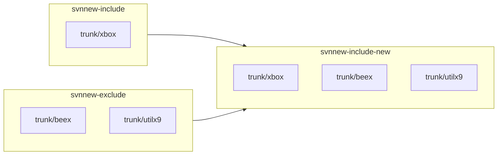

```bash
svnadmin load --parent-dir svnnew-include < $SVN_DUMP_FILTER_FILE_EXCLUDE

```

### 7.1.2. externals / submodules

#### [svn:externals](https://svnbook.red-bean.com/zh/1.6/svn.advanced.externals.html)

```bash
# http://trac-vbx/svnroot/trunk/xbox
$ svn propedit svn:externals ./
```
```bash
../helloworld

# 相對於設置 svn:externals 屬性的目錄的 URL。
# http://trac-vbx/svnroot/trunk/helloworld
```
```bash
^/branches/helloworld

# 相對於設置 svn:externals 屬性的版本庫的根。
# http://trac-vbx/svnroot/branches/helloworld
```

```bash
//build20-vbx/svnroot/trunk/helloworld

# 相對於設置 svn:externals 屬性的目錄的 URL 的方案。
# http:build20-vbx/svnroot/branches/helloworld
```

```bash
/svnhello/trunk/helloworld

# 相對於設置 svn:externals 屬性的服務器的根 URL。
# http://trac-vbx/svnhello/trunk/helloworld
```

### 7.1.3. propset

> Set *`PROPNAME`* to *`PROPVAL`* on files, directories, or revisions.

#### svn:executable

```bash
find * -name "*.exe" | xargs svn propset svn:executable on
find * -name "*.bat" | xargs svn propset svn:executable on
find * -name "*.dll" | xargs svn propset svn:executable on
```

### 7.1.4. propdel

> Remove a property from an item.

```bash
svn propdel svn:global-ignores
svn propdel svn:ignore
svn propdel svn:externals
```

## 7.2. Git

### 7.2.1. prune
> Prune tracking branches not on the remote

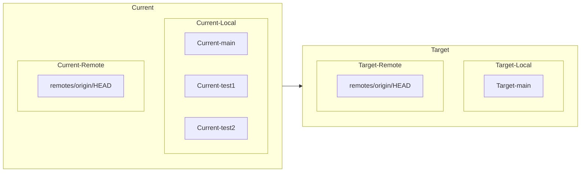

```bash
$ git remote prune origin
```

### 7.2.2. externals / submodules

#### A. List all submodules

```bash
$ git submodule
 8518684c0f33d004fa93971be2c6a8eca3167d1e examples/common/QRCode/repo (v1.6.0-19-g8518684)
 a6299b6c7c0b2e3eb62fa08ee4bf7155c39bad1f examples/common/m5stack-tft/repo (heads/master)
 e9ca8d1ca225ef94fd20890b5440b22f490a410a third_party/abseil-cpp/src
...
```

```bash
$ git submodule status
 8518684c0f33d004fa93971be2c6a8eca3167d1e examples/common/QRCode/repo (v1.6.0-19-g8518684)
 a6299b6c7c0b2e3eb62fa08ee4bf7155c39bad1f examples/common/m5stack-tft/repo (heads/master)
 e9ca8d1ca225ef94fd20890b5440b22f490a410a third_party/abseil-cpp/src
...
```

```bash
$ cat .gitmodules
[submodule "nlassert"]
        path = third_party/nlassert/repo
        url = https://github.com/nestlabs/nlassert.git
        branch  = master
[submodule "nlio"]
        path = third_party/nlio/repo
        url = https://github.com/nestlabs/nlio.git
        branch  = master
[submodule "mbedtls"]
        path = third_party/mbedtls/repo
        url = https://github.com/ARMmbed/mbedtls.git
        branch = mbedtls-2.28
...
```

```bash
$ git config --file .gitmodules --get-regexp path
submodule.nlassert.path third_party/nlassert/repo
submodule.nlio.path third_party/nlio/repo
submodule.mbedtls.path third_party/mbedtls/repo
submodule.qrcode.path examples/common/QRCode/repo
...
```

#### B. Add submodule

```bash
$ git submodule add https://github.com/lankahsu520/utilx9 Submodules/utilx9
$ git submodule add https://github.com/lankahsu520/utilx9 utilx9
$ git commit
```

#### C. Remove submodule

```bash
$ git rm utilx9
$ git commit
```

#### D. Update submodule

```bash
$ git submodule update --init --recursive

# pull main and submodules
$ git pull --recurse-submodules

# clone and pull submodules with recurse mode
$ git clone --recurse-submodules  <repo>
```

# 8. Others ???

```bash
# Cleanup unnecessary files and optimize the local repository
$ git gc --prune=now #清除 git reflog

# Stash the changes in a dirty working directory away
# 不常用，會忘掉。不要用
git stash -u
git stash list
git stash pop
git stash clear
```

# Appendix

# I. Study

## I.1. SVN

#### A. [版本控制工具 SVN – 常用的基本指令 / 狀態表示](https://eeepage.info/svn-usage/)

#### B. [SVN 基本指令教學](https://blog.longwin.com.tw/2007/07/svn_tutorial_2007/)

## I.2. Git

#### A. [Git 初學筆記 - 指令操作教學](https://blog.longwin.com.tw/2009/05/git-learn-initial-command-2009/)

#### B. [連猴子都能懂的Git入門指南](https://backlog.com/git-tutorial/tw/)

#### C. [GIT教學](https://kingofamani.gitbooks.io/git-teach/content/)

#### D. [[ 狀況題 ] 如何徹底將檔案從 Git 中移除？](https://mtr04-note.coderbridge.io/2020/08/09/about-git-deletefile/)

```bash
$ git filter-branch -f --tree-filter "rm -f helloworld_bak.c"
$ rm .git/refs/original/refs/heads/master
$ git reflog expire --all --expire=now
$ git fsck --unreachable
$ git gc --prune=now
$ git fsck
$ git push -f
```

#### E. [Configure Git Server with HTTP on Ubuntu](https://linuxhint.com/git_server_http_ubuntu/)

# II. Debug

## II.1. svn: E170013: Unable to connect to a repository at URL 'https:..'

```bash
$ rm -f ~/.subversion/auth/svn.simple/*
```

## II.2. error: You have not concluded your merge (MERGE_HEAD exists).

>當 local repository 的重要性大於 cloud repository。

```bash
$ git pull
error: You have not concluded your merge (MERGE_HEAD exists).
hint: Please, commit your changes before merging.
fatal: Exiting because of unfinished merge.

$ git reset --merge
$ git push -f
```

## II.3. fatal: cannot do a partial commit during a merge.

> 當 BranchA -> B 時，有部分衝突，就算解決了，還是沒有辦法commit。雖然已用肉眼解決了 conflict 或是還原該 conflict 檔案。
>
> 個人覺得這是 git 的 bugs；試試以下指令，多試幾次，就可以了

```bash
$ git commit -am 'Merge branch BranchA into BranchB'

or

$ git commit -a ./
fatal: paths './ ...' with -a does not make sense
```


# III. Glossary

# IV. Tool Usage

## IV.1. svn Usage

```bash
$ svn help
usage: svn <subcommand> [options] [args]
Subversion command-line client.
Type 'svn help <subcommand>' for help on a specific subcommand.
Type 'svn --version' to see the program version and RA modules,
     'svn --version --verbose' to see dependency versions as well,
     'svn --version --quiet' to see just the version number.

Most subcommands take file and/or directory arguments, recursing
on the directories.  If no arguments are supplied to such a
command, it recurses on the current directory (inclusive) by default.

Available subcommands:
   add
   auth
   blame (praise, annotate, ann)
   cat
   changelist (cl)
   checkout (co)
   cleanup
   commit (ci)
   copy (cp)
   delete (del, remove, rm)
   diff (di)
   export
   help (?, h)
   import
   info
   list (ls)
   lock
   log
   merge
   mergeinfo
   mkdir
   move (mv, rename, ren)
   patch
   propdel (pdel, pd)
   propedit (pedit, pe)
   propget (pget, pg)
   proplist (plist, pl)
   propset (pset, ps)
   relocate
   resolve
   resolved
   revert
   status (stat, st)
   switch (sw)
   unlock
   update (up)
   upgrade

(Use '-v' to show experimental subcommands.)

Subversion is a tool for version control.
For additional information, see http://subversion.apache.org/

```

## IV.2. git Usage

```bash
$ git help
usage: git [--version] [--help] [-C <path>] [-c <name>=<value>]
           [--exec-path[=<path>]] [--html-path] [--man-path] [--info-path]
           [-p | --paginate | -P | --no-pager] [--no-replace-objects] [--bare]
           [--git-dir=<path>] [--work-tree=<path>] [--namespace=<name>]
           <command> [<args>]

These are common Git commands used in various situations:

start a working area (see also: git help tutorial)
   clone             Clone a repository into a new directory
   init              Create an empty Git repository or reinitialize an existing one

work on the current change (see also: git help everyday)
   add               Add file contents to the index
   mv                Move or rename a file, a directory, or a symlink
   restore           Restore working tree files
   rm                Remove files from the working tree and from the index
   sparse-checkout   Initialize and modify the sparse-checkout

examine the history and state (see also: git help revisions)
   bisect            Use binary search to find the commit that introduced a bug
   diff              Show changes between commits, commit and working tree, etc
   grep              Print lines matching a pattern
   log               Show commit logs
   show              Show various types of objects
   status            Show the working tree status

grow, mark and tweak your common history
   branch            List, create, or delete branches
   commit            Record changes to the repository
   merge             Join two or more development histories together
   rebase            Reapply commits on top of another base tip
   reset             Reset current HEAD to the specified state
   switch            Switch branches
   tag               Create, list, delete or verify a tag object signed with GPG

collaborate (see also: git help workflows)
   fetch             Download objects and refs from another repository
   pull              Fetch from and integrate with another repository or a local branch
   push              Update remote refs along with associated objects

'git help -a' and 'git help -g' list available subcommands and some
concept guides. See 'git help <command>' or 'git help <concept>'
to read about a specific subcommand or concept.
See 'git help git' for an overview of the system.

```

## IV.3. ~/.bash_aliases

#### A. SVN

```bash
#** svn **
export SVN_EDITOR=vim

alias svn-up="svn up"

alias svn-diff="svn diff $*"
alias svn-diff2file="svn diff $* > /tmp/diff"

alias svn-stq="svn st -q"
alias svn-new="svn status --no-ignore | grep -e ^?"
alias svn-new-I="svn status --no-ignore | grep -e ^I"
alias svn-new-all="svn status --no-ignore"
alias svn-st="svn status --no-ignore"

alias svn-external="svn propedit svn:externals"

alias svn-blame="svn blame"

alias svn-log="svn log | perl -l40pe 's/^-+/\n/'"

alias svn-revision="svn info 2>/dev/null | grep Revision | cut -d' ' -f2"

function svn-rm()
{
	svn st | grep '^!' | awk '{$1=""; print " --force \""substr($0,2)"@\"" }' | xargs svn delete > /dev/null 2>&1
}

function svn-add()
{
	svn status --no-ignore | grep -e ^? | awk '{$1=""; print "\""substr($0,2)"\"" }' | xargs svn add > /dev/null 2>&1
}

function svn-add-all()
{
	svn status --no-ignore | awk '{$1=""; print "\""substr($0,2)"\"" }' | xargs svn add
}

function svn-rollback()
{
	SVN_LAST=`svn info 2>/dev/null | grep 'Last Changed Rev' | cut -d':' -f2 | awk '{print $1}'`
	svn merge -c -${SVN_LAST} .
}

function svn-revert()
{
	HINT="Usage: ${FUNCNAME[0]} <files>"
	FILES="$*"

	if [ ! -z "$FILES" ]; then
		svn revert $FILES
	else
		echo $HINT
	fi
}

function svn-revert-sh()
{
	svn st -q | grep '.sh' | cut -d' ' -f8 | xargs svn revert
}
```

#### B. Git

```bash
export GIT_EDITOR=vim

export LESS=Rx2

alias git-push="git push"
alias git-pull="git pull"

alias git-diffc="git diff --cached $*"
alias git-diffc2file="git diff --cached $* > /tmp/diff"
alias git-diff="git diff HEAD $*"
alias git-diff2file="git diff HEAD $* > /tmp/diff"

alias git-st="git status $*"

alias git-blame="git blame"

alias git-log="git log --oneline"
alias git-log-graph="git log --pretty=reference --graph"

alias git-rev="git log --oneline 2>/dev/null | cut -d' ' -f1 | head -n1"

alias git-remote="git remote"
alias git-seturl="git remote set-url origin"

#清除 git reflog
alias git-reflog="git gc --prune=now"

alias git-prune="git remote prune origin"

function git-addchangs()
{
	#git ls-files . -m
	#git diff --name-only | git add
	git status --porcelain | grep ' M'| awk '{$1=""; print "  \""substr($0,2)"\"" }' | xargs git add
}

function git-adduntracked()
{
	#git ls-files . -m
	#git diff --name-only | git add
	git status --porcelain | grep '??'| awk '{$1=""; print "  \""substr($0,2)"\"" }' | xargs git add
}

function git-revertchanges()
{
	HINT="Usage: ${FUNCNAME[0]} <files>"
	FILES="$*"
	[ ! -z "$FILES" ] || FILES="./"

	git restore --staged $FILES
}

function git-revert()
{
	HINT="Usage: ${FUNCNAME[0]} <files>"
	FILES="$*"
	[ ! -z "$FILES" ] || FILES="./"

	git checkout -- $FILES
}

alias git-branch="git branch"

function git-checkoutb()
{
	HINT="Usage: ${FUNCNAME[0]} <branch-name>"
	BRANCH_NAME=$1

	if [ ! -z "$BRANCH_NAME" ]; then
		git checkout $BRANCH_NAME
	else
		echo $HINT
	fi
}
```


# Author

> Created and designed by [Lanka Hsu](lankahsu@gmail.com).

# License

> [HelperX](https://github.com/lankahsu520/HelperX) is available under the BSD-3-Clause license. See the LICENSE file for more info.

du
