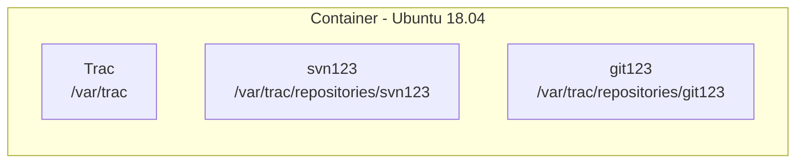

# [Trac](https://trac.edgewall.org)
[](https://github.com/lankahsu520/HelperX)
[![GitHub license][license-image]][license-url]
[![GitHub stars][stars-image]][stars-url]
[![GitHub forks][forks-image]][forks-url]
[![GitHub issues][issues-image]][issues-image]
[![GitHub watchers][watchers-image]][watchers-image]

[license-image]: https://img.shields.io/github/license/lankahsu520/HelperX.svg
[license-url]: https://github.com/lankahsu520/HelperX/blob/master/LICENSE
[stars-image]: https://img.shields.io/github/stars/lankahsu520/HelperX.svg
[stars-url]: https://github.com/lankahsu520/HelperX/stargazers
[forks-image]: https://img.shields.io/github/forks/lankahsu520/HelperX.svg
[forks-url]: https://github.com/lankahsu520/HelperX/network
[issues-image]: https://img.shields.io/github/issues/lankahsu520/HelperX.svg
[issues-url]: https://github.com/lankahsu520/HelperX/issues
[watchers-image]: https://img.shields.io/github/watchers/lankahsu520/HelperX.svg
[watchers-url]: https://github.com/lankahsu520/HelperX/watchers

# 1. Overview

> 用於管理 Git、SVN Repository 等。
>
> <font color="red">有試過在 Ubuntu 20.04 以後的版本安裝過，始終沒有成功過！最終停在 Ubuntu 18.04。最主要的原因是支援的 Python 版本過舊。</font>

> 為什麼堅持使用Trac
>
> - Range diff
> - 同個畫面可以瀏覽所有的 repositories
> - 

> [ChatGPT] Trac 是什麼
>
> - **Trac** 是一個開源、輕量級的 **專案管理與缺陷追蹤系統（Issue Tracker / Project Management Tool）**，最初是為軟體專案設計的。它同時整合了 **版本控制瀏覽、Wiki、Timeline**，適合需要簡單、直接管理程式碼專案的團隊。
>  
> ------
> 
>  ## 📌 主要特色
> 
>  | 功能                       | 說明                                                         |
>   | -------------------------- | ------------------------------------------------------------ |
>   | **版本控制整合**           | 支援 SVN、Git，可瀏覽程式碼、檢視歷史紀錄、Diff              |
>   | **Timeline / Activity**    | 顯示專案所有事件（Issue、提交紀錄、Wiki 變更）               |
>   | **Wiki**                   | 每個專案可建立 Wiki，方便文件化專案資訊                      |
>   | **Issue Tracker / Ticket** | 缺陷追蹤、任務分配、優先級、狀態流程                         |
>   | **多專案管理**             | 雖然不是多專案平台，但可以透過多個 Trac 獨立實例管理多個專案 |
>   | **簡單界面**               | UI 非常簡單、輕量，無需大量資源                              |
>   | **插件擴充**               | 支援多種插件，例如報表、時間追蹤、甘特圖等                   |
> 
> ------
> 
>   ## 📌 適合的使用場景
> 
>   - 使用 **SVN / Git** 並希望輕量管理專案
>   - 需要 **Timeline / Issue / Wiki** 功能，但不需要大型整合平台
>  - 對 UI 不介意簡單、偏向文字導向的操作
>   - 希望快速部署，低維護成本
>
> ------
>
>   ## 📌 Trac 的限制
> 
>   - 對 **多 SCM 系統整合**不如 Allura 或 Redmine 完整
>  - UI 比較老舊，現代感不足
>   - 不適合大型多專案、多人管理的複雜環境
>  - 需要手動安裝或配置插件來支援 Gantt / 日曆等進階功能

# 2. Trac


> Trac 1.4
>
> - [Python](https://www.python.org/), version ≥ 2.7 and < 3.0 (note that we dropped the support for Python 2.6 in this release)
> - [setuptools](https://pypi.org/project/setuptools), version ≥ 0.6
> - [Jinja2](https://pypi.org/project/Jinja2), version ≥ 2.9.3

> Trac 1.5
>
> - [Python](https://www.python.org/), version >= 3.5
> - [setuptools](https://pypi.org/project/setuptools), version > 5.6
> - [Jinja2](https://pypi.org/project/Jinja2), version >= 2.9.3

## 2.1. Install

### 2.1.1. Step by Step

> 大致的命令如下，適用於
>
>  Ubuntu 18.04 LTS
>
> Python 2.7
>
> Trac 1.2.4

#### A. initenv

```bash
$ sudo apt-get install trac
$ pip install multipart

#** 設定安裝環境 **
$ export MYPROJECT_TRACDIR=/work/trac
$ export MYPROJECT_ADMIN=lanka

$ trac-admin $MYPROJECT_TRACDIR initenv

#** 設定目錄 Owner & 讀寫權限 **
sudo cp $MYPROJECT_TRACDIR/VERSION $MYPROJECT_TRACDIR/conf
sudo cp $MYPROJECT_TRACDIR/VERSION $MYPROJECT_TRACDIR/db
sudo cp $MYPROJECT_TRACDIR/VERSION $MYPROJECT_TRACDIR/htdocs
sudo cp $MYPROJECT_TRACDIR/VERSION $MYPROJECT_TRACDIR/log
sudo cp $MYPROJECT_TRACDIR/VERSION $MYPROJECT_TRACDIR/plugins
sudo cp $MYPROJECT_TRACDIR/VERSION $MYPROJECT_TRACDIR/templates
```

#### B. authz

```bash
#** 新增使用者帳號 **
$ htpasswd -c $MYPROJECT_TRACDIR/.htpasswd $MYPROJECT_ADMIN
$ cat $MYPROJECT_TRACDIR/conf/.htpasswd

#** 設定管理者帳號 **
$ trac-admin $MYPROJECT_TRACDIR permission add $MYPROJECT_ADMIN TRAC_ADMIN

$ sudo vi $MYPROJECT_TRACDIR/conf/authz
[groups]
administrators = lanka
developers = lanka
newbie = mary
releaser = lanka
viewers =

[svnxbox:/]
@administrators = rw
@developers =
@newbie =
@releaser =
@viewers =

[svnopt:/]
@administrators = rw
@developers =
@newbie =
@releaser =
@viewers =

[gitroot:/]
@administrators = rw
@developers =
@newbie =
@releaser =
@viewers =
```

#### C. [Plugin](https://trac.edgewall.org/wiki/PluginList)

```bash
#** Plugin **
# 這裏就會失敗
sudo easy_install https://trac-hacks.org/svn/accountmanagerplugin/tags/acct_mgr-0.5.0
sudo easy_install https://trac-hacks.org/svn/tracwysiwygplugin/0.12
sudo easy_install https://trac-hacks.org/svn/svnauthzadminplugin/1.0
sudo easy_install https://trac-hacks.org/svn/markdownmacro/trunk

# 改用 python setup.py
PJ_PYTHON_BIN=python
PJ_PYTHON_VER=2.7

svn co https://trac-hacks.org/svn/accountmanagerplugin/tags/acct_mgr-0.5.0 /tmp/acct_mgr \
    && cd /tmp/acct_mgr && $PJ_PYTHON_BIN setup.py bdist_egg \
    && cp dist/*.egg /usr/local/lib/python${PJ_PYTHON_VER}/dist-packages/ \
    && mkdir -p $MYPROJECT_TRACDIR/plugins \
    && cp dist/*.egg $MYPROJECT_TRACDIR/plugins

svn co https://trac-hacks.org/svn/tracwysiwygplugin/0.12 /tmp/tracwysiwygplugin \
    && cd /tmp/tracwysiwygplugin && $PJ_PYTHON_BIN setup.py bdist_egg \
    && cp dist/*.egg /usr/local/lib/python${PJ_PYTHON_VER}/dist-packages/ \
    && mkdir -p $MYPROJECT_TRACDIR/plugins \
    && cp dist/*.egg $MYPROJECT_TRACDIR/plugins

svn co https://trac-hacks.org/svn/svnauthzadminplugin/1.0 /tmp/svnauthzadminplugin \
    && cd /tmp/svnauthzadminplugin && $PJ_PYTHON_BIN setup.py bdist_egg \
    && cp dist/*.egg /usr/local/lib/python${PJ_PYTHON_VER}/dist-packages/ \
    && mkdir -p $MYPROJECT_TRACDIR/plugins \
    && cp dist/*.egg $MYPROJECT_TRACDIR/plugins

```

#### D. trac.ini

```bash
$ sudo vi $MYPROJECT_TRACDIR/conf/trac.ini

[ticket]
restrict_owner = enabled

[account-manager]
force_passwd_change = true
htpasswd_file = /work/trac/conf/.htpasswd
htpasswd_hash_type = crypt
#password_file = /work/svn/conf/passwd
#password_format = htpasswd
#password_store = SvnServePasswordStore
password_file = /work/trac/.htpasswd
password_store = HtPasswdStore
Password_format = htpasswd
persistent_sessions = False
refresh_passwd = False
verify_email = False

[components]
tracopt.ticket.deleter = enabled
tracwysiwyg.wysiwygmodule = enabled
acct_mgr.admin.accountmanageradminpanel = enabled
acct_mgr.api.accountmanager = enabled
acct_mgr.guard.accountguard = enabled
acct_mgr.htfile.htpasswdstore = enabled
acct_mgr.macros.accountmanagerwikimacros = enabled
acct_mgr.notification.accountchangelistener = enabled
acct_mgr.notification.accountchangenotificationadminpanel = enabled
acct_mgr.pwhash.htdigesthashmethod = enabled
acct_mgr.pwhash.htpasswdhashmethod = enabled
acct_mgr.register.basiccheck = enabled
acct_mgr.register.bottrapcheck = enabled
acct_mgr.register.emailcheck = enabled
acct_mgr.register.emailverificationmodule = enabled
acct_mgr.register.regexpcheck = enabled
acct_mgr.register.registrationmodule = enabled
acct_mgr.register.usernamepermcheck = enabled
acct_mgr.svnserve.svnservepasswordstore = enabled
acct_mgr.web_ui.accountmodule = enabled
acct_mgr.web_ui.resetpwstore = enabled

# 如果要使用apache 的登入方式，請將下面兩項對調
acct_mgr.web_ui.loginmodule = enabled
trac.web.auth.loginmodule = disabled

$ sudo chown -R www-data: $MYPROJECT_TRACDIR
$ sudo chmod -R 775 $MYPROJECT_TRACDIR
```

#### E. Apache - trac.conf

```bash
$ sudo vi /etc/apache2/sites-available/trac.conf

	<Location /trac>
		SetHandler mod_python
		PythonInterpreter main_interpreter
		PythonHandler trac.web.modpython_frontend
		PythonOption TracEnv /work/trac
		PythonOption TracEnvParentDir /work/trac
		PythonOption TracUriRoot /trac
		# PythonOption TracEnvIndexTemplate /work/trac/templates/index-template.html
		PythonOption TracLocale en_US.UTF8
		PythonOption PYTHON_EGG_CACHE /tmp
		PythonDebug on
		Order allow,deny
		Allow from all
	</Location>

$ sudo vi /etc/apache2/ports.conf
# 設定 port

#** 啟動 **
$ sudo apt-get install libapache2-mod-python
$ sudo a2enmod python

# enable Apache mod_env, mod_cgi, mod_alias, mod_rewrite, ... modules
$ sudo a2enmod env cgi alias rewrite dav dav_fs

# enable the trac site configuration
$ sudo a2ensite trac.conf
$ sudo service apache2 restart

$ service apache2 reload
```

### 2.1.2. Install  trac with docker

#### A. Build and Run

> 會用到的參數有
>
> MYPROJECT_ADMIN: lanka
> MYPROJECT_ADMIN_PASS: 123456
> MYPROJECT_TRACDIR: /var/trac
> MYPROJECT_NAME: lanka520

```bash
# 個人習慣放在 /work
$ cp -avr Docker-trac /work/trac
$ cd /work/trac
$ tree -L 2 ./
./
├── auth
│   └── authz
├── compose
│   ├── dbusX.conf
│   ├── docker-compose.yml
│   ├── Dockerfile-1.2
│   ├── supervisord.conf
│   └── trac_banner.png
├── conf
├── conf-sample
│   └── trac.ini
├── repositories
│   └── svn-create-repo.sh
└── sites-available
    ├── svn.conf
    └── trac.conf

7 directories, 10 files

# 設定管理者帳號和密碼
$ MYPROJECT_ADMIN=lanka
$ MYPROJECT_ADMIN_PASS=123456
$ htpasswd -b -c auth/.htpasswd $MYPROJECT_ADMIN $MYPROJECT_ADMIN_PASS

$ cd compose
$ docker compose up -d --build
$ docker images
REPOSITORY               TAG       IMAGE ID       CREATED              SIZE
trac520                  latest    6d0210261d91   About a minute ago   611MB

$ docker ps
CONTAINER ID   IMAGE                    COMMAND                  CREATED              STATUS                PORTS                                       NAMES
4a3aa760362e   trac520                  "/usr/bin/supervisor…"   About a minute ago   Up About a minute     0.0.0.0:9981->80/tcp, [::]:9981->80/tcp     hello-trac
```

#### b. Create an SVN repostory

> 這邊建議進入 container 後再建立，因為有 db 版本的問題

```bash
$ docker exec -it hello-trac /bin/bash

root@4a3aa760362e:/# REPO_NAME=svn123
root@4a3aa760362e:/# cd /var/trac/repositories; ./svn-create-repo.sh $REPO_NAME
root@4a3aa760362e:/var/trac/repositories# tree -L 1 $REPO_NAME
svn123/
├── conf
├── db
├── format
├── hooks
├── locks
└── README.txt

4 directories, 2 files
```

```bash
cat /var/log/apache2/access.log
cat /var/log/apache2/error.log
```

#### B. Create an GIT repostory

```bash
root@61819b799ee2:/# REPO_NAME=git123
root@61819b799ee2:/# cd /var/trac/repositories; ./git-create-repo.sh $REPO_NAME
root@61819b799ee2:/var/trac/repositories# tree -L 1 $REPO_NAME
git123
├── branches
├── config
├── description
├── HEAD
├── hooks
├── info
├── objects
└── refs

5 directories, 3 files
```

### 2.1.3. Configuration

> 大置的佈局如下



> 相關的設定請見以下的檔案

#### A. trac.ini

```bash
# 可以看到要管理的 repositories

[repositories]
.alias = svn123
.sync_per_request = true

svn123.dir = /var/trac/repositories/svn123
svn123.hidden = false
#svn123.sync_per_request = true
svn123.type = svn
svn123.url = svn123

git123.dir = /var/trac/repositories/git123
git123.hidden = false
git123.sync_per_request = true
git123.type = git
git123.url = git123
```

#### B. Apache - svn.conf

```bash
<Location /svn123>
  DAV svn
  SVNPath /var/trac/repositories/svn123
  AuthType Basic
  AuthName "SVN Repository - /svn123"
  AuthUserFile /var/trac/auth/.htpasswd
  AuthzSVNAccessFile /var/trac/auth/authz
  Require valid-user
</Location>

```

#### C. Apache - git.conf

```bash
SetEnv GIT_PROJECT_ROOT /var/trac/repositories
SetEnv GIT_HTTP_EXPORT_ALL

ScriptAlias /git /usr/lib/git-core/git-http-backend/

Alias /git /var/trac/repositories
<Directory /usr/lib/git-core>
  Options +ExecCGI -MultiViews +SymLinksIfOwnerMatch
  AllowOverride None
  Require all granted
</Directory>

<Directory /var/trac/repositories>
  Options Indexes FollowSymLinks MultiViews
  AllowOverride None
  Require all granted
</Directory>

<Location /git/git123>
  AuthType Basic
  AuthName "Git Repository - /git123"
  AuthUserFile /var/trac/auth/.htpasswd
  Require valid-user
</Location>
```

## 2.2. Showtime

> http://127.0.0.1:80/trac

> 如果用 Docker
>
> http://127.0.0.1:9981/trac


## 2.3. Features

### 2.3.1. Clone repositories on Host

#### A. svn

```bash
$ cd /tmp
$ svn co http://127.0.0.1:9981/svn123
$ cd svn123
$ echo "Hello trac" > README.md
$ svn add README.md
$ svn ci ./
```

#### B. git

```bash
$ cd /tmp
$ git clone http://127.0.0.1:9981/git/git123
$ cd git123
$ echo "Hello git" > README.md
$ git add README.md
$ git commit ./
$ git push
```

### 2.3.2. Browse Source

#### A. All repositories

> 可以一次瀏覽所有的 repositories；這在其它管理工具很少見到。


#### B. Range diff

> 很多管理工具不支援此功能


### 2.3.3. Timeline

> 可以很簡單的知道所有的流水帳。
>
> 如果依管理角度，訊息簡單、直接，沒有花俏的畫面。其它管理工具都太複雜，有時還要點選n個畫面。


## 2.4. Command Reference

### 2.5.1. Log

```bash
cat /var/trac/log/trac.log

cat /var/log/apache2/access.log
cat /var/log/apache2/error.log
```

### 2.4.2. trac-admin

```bash
trac-admin /var/trac repository list
# 將 repository-svn123 加入
trac-admin /var/trac repository add svn123 /var/trac/repositories/svn123 svn

# 如果 repository-svn123 與 trac 非同步時，記得
trac-admin /var/trac repository resync 'svn123'

# 查看 trac 的權限狀況
trac-admin /var/trac permission list

pip install --upgrade Trac
trac-admin /var/trac upgrade
trac-admin /var/trac wiki upgrade
```

### 2.4.3. apache

```bash
a2ensite svn.conf
a2ensite git.conf
a2ensite trac.conf
service apache2 reload

cat /var/log/apache2/access.log
cat /var/log/apache2/error.log

cat /etc/apache2/sites-available/trac.conf
cat /etc/apache2/sites-available/svn.conf
```

### 2.4.4. docker

```bash
#build image
docker compose up -d --build

# enter container-hello-trac
docker exec -it hello-trac /bin/bash

# remove docker-trac520
docker-stopall; docker-rmexited; sleep 1; docker-rmimage trac520
```

# Footnote

[^1]:
[^2]:

# Appendix

# I. Study

# II. Debug

## II.1. ubuntu 18.04

```bash
sudo apt-get install python-setuptools

#sudo apt-get install python python-babel
sudo apt-get install trac

#sudo easy_install Trac
#sudo easy_install Babel

ubuntu 16 -> 18時會出現錯誤
https://trac.edgewall.org/wiki/TracUpgrade#UpdatetheTracCode
sudo apt-get update
sudo apt-get upgrade
sudo apt-get install python-setuptools
sudo apt-get install python-pip

E: You must put some 'deb-src' URIs in your sources.list
sudo cp /etc/apt/sources.list /etc/apt/sources.list~
sudo sed -Ei 's/^# deb-src /deb-src /' /etc/apt/sources.list
sudo apt update

sudo apt-get remove libapache2-mod-python libapache2-mod-wsgi
sudo apt-get build-dep libapache2-mod-python libapache2-mod-wsgi
```

# III. Glossary

# IV. Tool Usage

# Author

> Created and designed by [Lanka Hsu](lankahsu@gmail.com).

# License

> [HelperX](https://github.com/lankahsu520/HelperX) is available under the BSD-3-Clause license. See the LICENSE file for more info.

