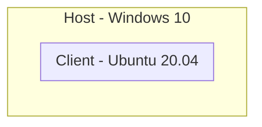
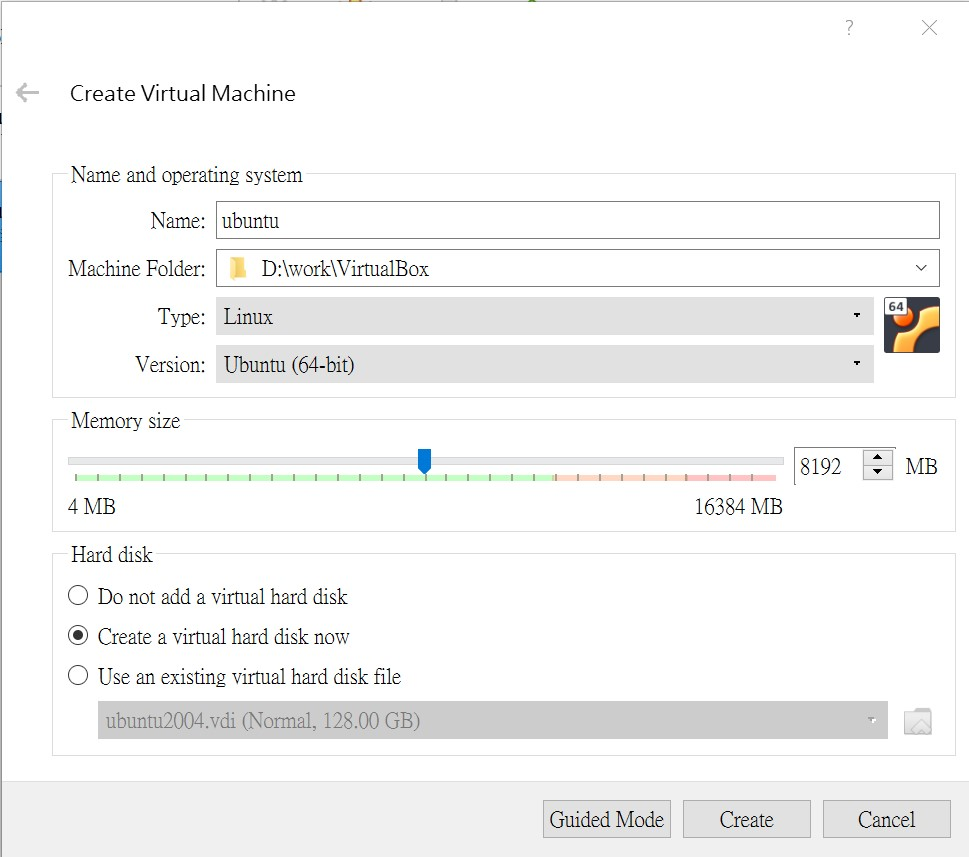
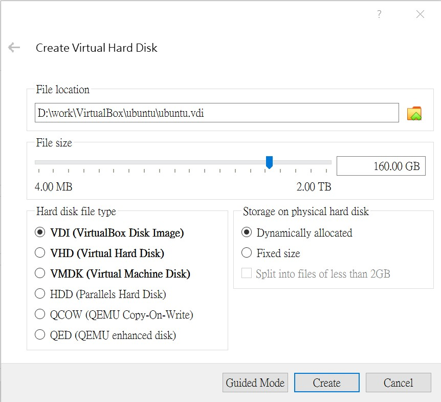
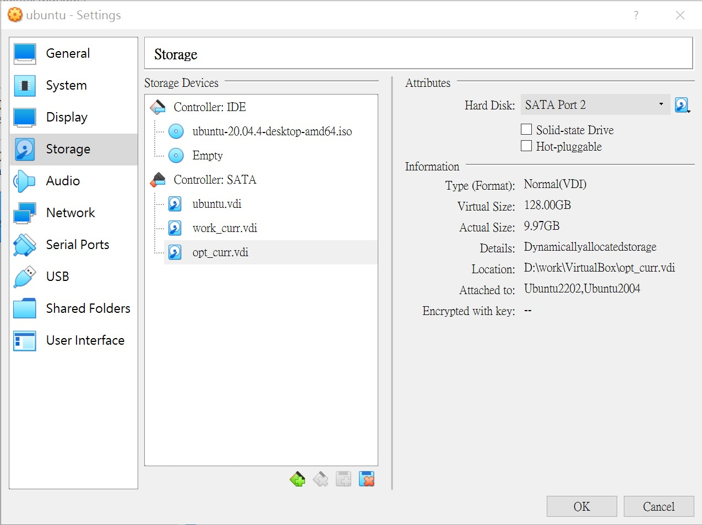
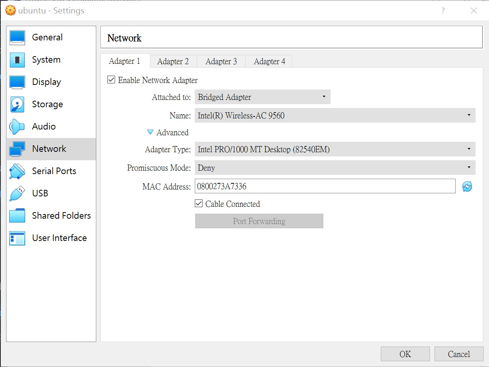
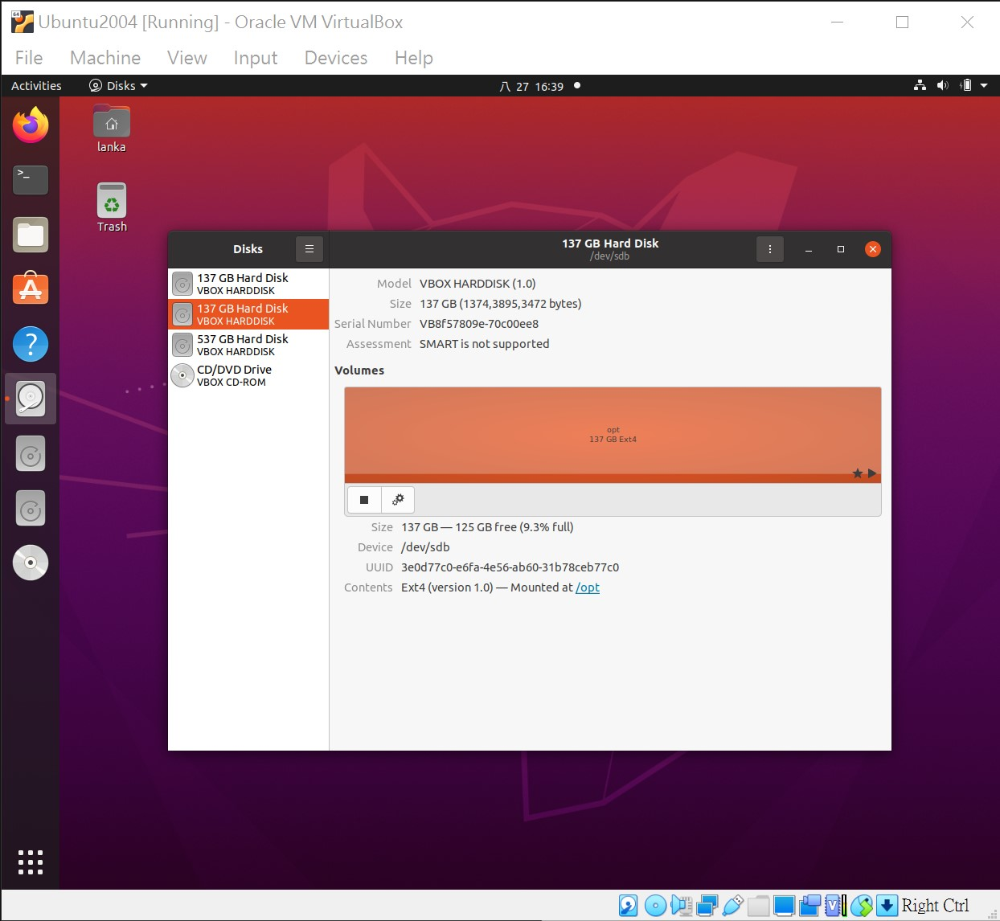

# VirtualBox
[](https://github.com/lankahsu520/HelperX)
[![GitHub license][license-image]][license-url]
[![GitHub stars][stars-image]][stars-url]
[![GitHub forks][forks-image]][forks-url]
[![GitHub issues][issues-image]][issues-image]


[license-image]: https://img.shields.io/github/license/lankahsu520/HelperX.svg
[license-url]: https://github.com/lankahsu520/HelperX/blob/master/LICENSE
[stars-image]: https://img.shields.io/github/stars/lankahsu520/HelperX.svg
[stars-url]: https://github.com/lankahsu520/HelperX/stargazers
[forks-image]: https://img.shields.io/github/forks/lankahsu520/HelperX.svg
[forks-url]: https://github.com/lankahsu520/HelperX/network
[issues-image]: https://img.shields.io/github/issues/lankahsu520/HelperX.svg
[issues-url]: https://github.com/lankahsu520/HelperX/issues
# 1. Host - Windows 10

# 2. Client - Ubuntu 20.04


## 2.1. Download [Ubuntu 20.04.4 LTS (Focal Fossa)](https://releases.ubuntu.com/20.04/)

```bash
Ubuntu 22.04 already uses OpenSSL 3.0 and gcc is too brand new to compile.
```

## 2.2. [VirtualBox](https://www.virtualbox.org)

#### A. Download

##### A.1. [Windows hosts](https://download.virtualbox.org/virtualbox/6.1.36/VirtualBox-6.1.36-152435-Win.exe)

#### B. Install

#### C. Machine / New





#### D. Settings

##### D.1. Storage

- ubuntu-20.04.4-desktop-amd64.iso
- ubuntu.vdi
- work_curr.vdi - please create by yourself ! about 500GB.
- opt_curr.vdi - please create by yourself ! about 128GB.



##### D.2. Netowrk - use Bridged Adapter



#### E. Start

- please install Ubuntu step by step !!!

# 3. Ubuntu

## 3.1. Disks

- work_curr.vdi - Mounted at /work.
- opt_curr.vdi - Mounted at /opt.



## 3.2. System Configuration

#### /etc/hostname

```bash
sudo vi /etc/hostname
sudo hostname -F /etc/hostname
```

#### /etc/hosts

```bash
sudo vi /etc/hosts
```

## 3.3 apt-get

```bash
sudo apt-get --yes update
sudo apt-get --yes upgrade

cd /bin && sudo rm sh; sudo ln -s bash sh

sudo chmod 777 /work
sudo chmod 777 /opt

```

## 3.4. Service

#### A. ssh

```bash
sudo apt-get --yes install openssh-server

```

#### B. samba

```bash
sudo apt-get --yes install samba
sudo apt-get --yes install cifs-utils

sudo usermod -a -G sambashare `whoami`
sudo pdbedit -a -u `whoami` # 設定密碼

sudo mkdir -p /etc/samba
sudo nano /etc/samba/smb.conf

sudo service smbd restart
```
- /etc/samba/smb.conf
```conf
[work]
  path = /work

  vfs object = recycle
  recycle: keeptree = yes
  recycle: versions = yes
  recycle: repository = ../work/recycle/%u

  write list = @sambashare
  browseable = yes
  writeable = yes
  read only = no

[recycle]
  path=/work/recycle/%u
  comment = Recycle Bin
  browseable = no
  writable = yes
```

#### C. nfs

```bash
sudo apt-get --yes install nfs-common
sudo apt-get --yes install nfs-kernel-server
sudo nano /etc/exports

sudo /etc/init.d/nfs-kernel-server restart
```
- /etc/exports
```conf
/work  *(rw,sync,no_root_squash,no_subtree_check)

```

#### D. tftp

```bash
mkdir -p /work/tftpboot
sudo apt-get --yes install xinetd
sudo apt-get --yes install tftpd-hpa
sudo nano /etc/default/tftpd-hpa

```

- /etc/default/tftpd-hpa
```conf
# /etc/default/tftpd-hpa

TFTP_USERNAME="tftp"
TFTP_DIRECTORY="/work/tftpboot"
TFTP_ADDRESS=":69"
TFTP_OPTIONS="--secure"

```

#### E. rsyslog

```bash
sudo nano /etc/rsyslog.conf

sudo systemctl restart rsyslog
```

- /etc/rsyslog.conf

```bash
# add the below lines
$EscapeControlCharactersOnReceive off
```


# 4. VBoxManage modifyhd

#### A. Client (Ubuntu 20.04)

```bash
#!/bin/sh

telinit 1

MOUNT_DISK="work"
PURGE_DISK=`mount | grep $MOUNT_DISK | cut -d" " -f1`
mount -o remount,ro $PURGE_DISK
zerofree -v $PURGE_DISK

```

#### B. Host (Windows 10)

```bash
"C:\Program Files\Oracle\VirtualBox\VBoxManage.exe" modifyhd work_curr.vdi --compact

```

# Appendix

# I. Study

# II. Debug

# III. Images
#### A. [OSBoxes - Virtual Machines for VirtualBox & VMware](http://www.osboxes.org/#)

#### B. [Android-x86](https://www.android-x86.org)


# Author

Created and designed by [Lanka Hsu](lankahsu@gmail.com).

# License

[HelperX](https://github.com/lankahsu520/HelperX) is available under the BSD-3-Clause license. See the LICENSE file for more info.

