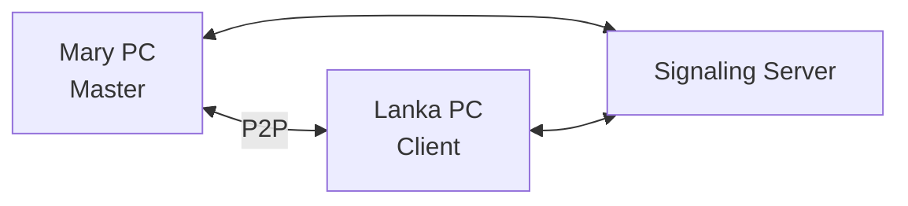
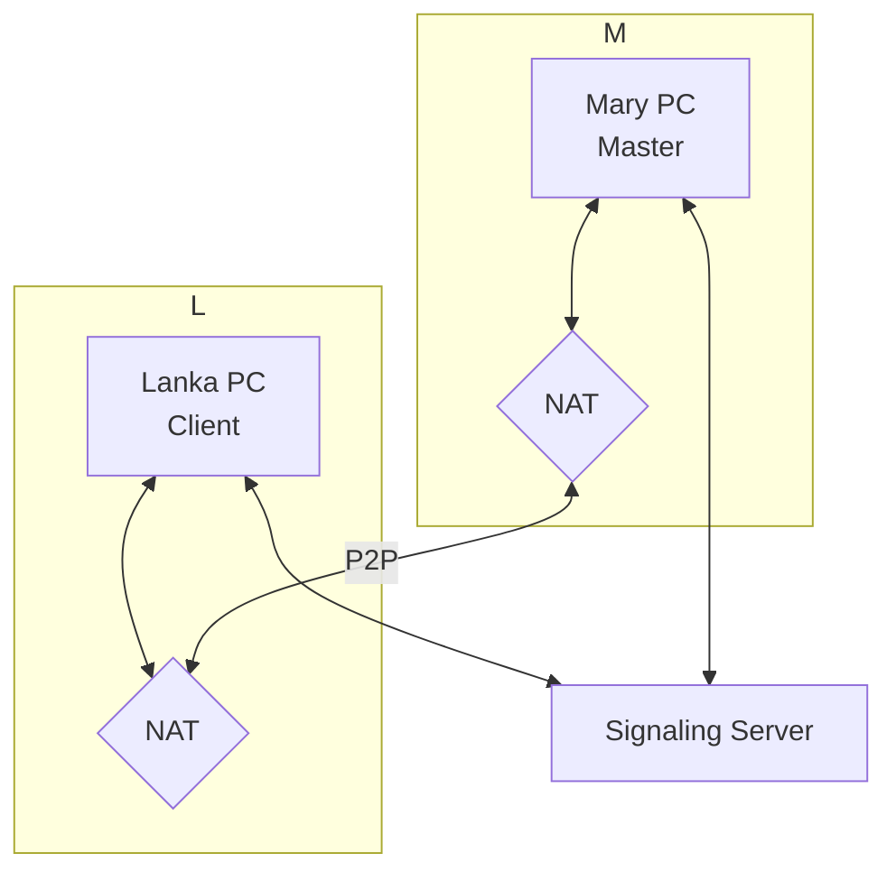
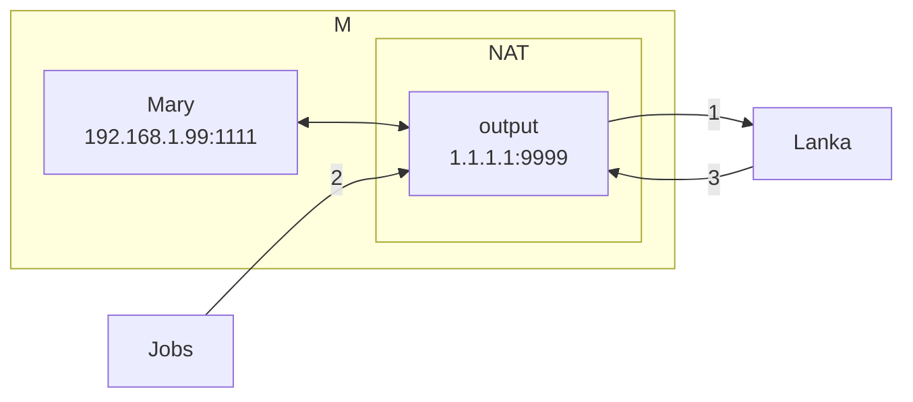
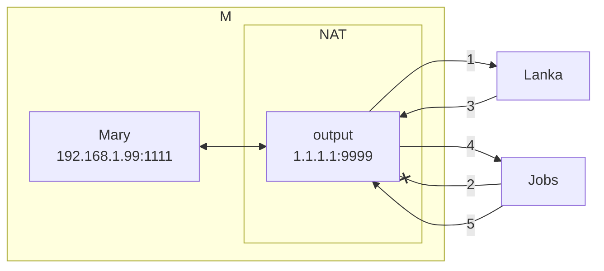
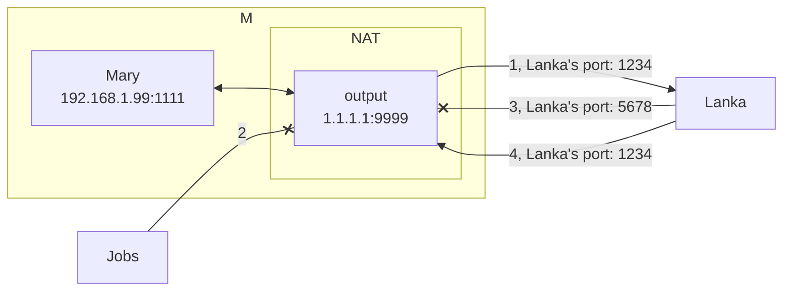
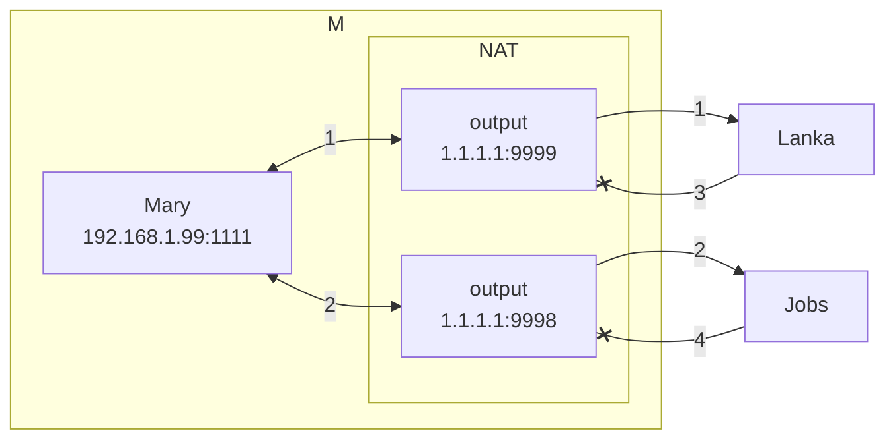
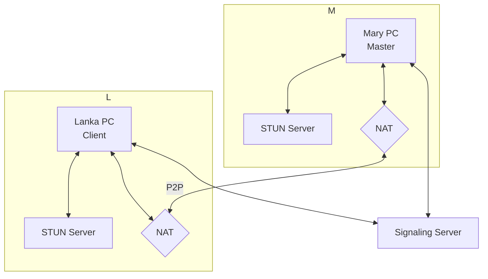
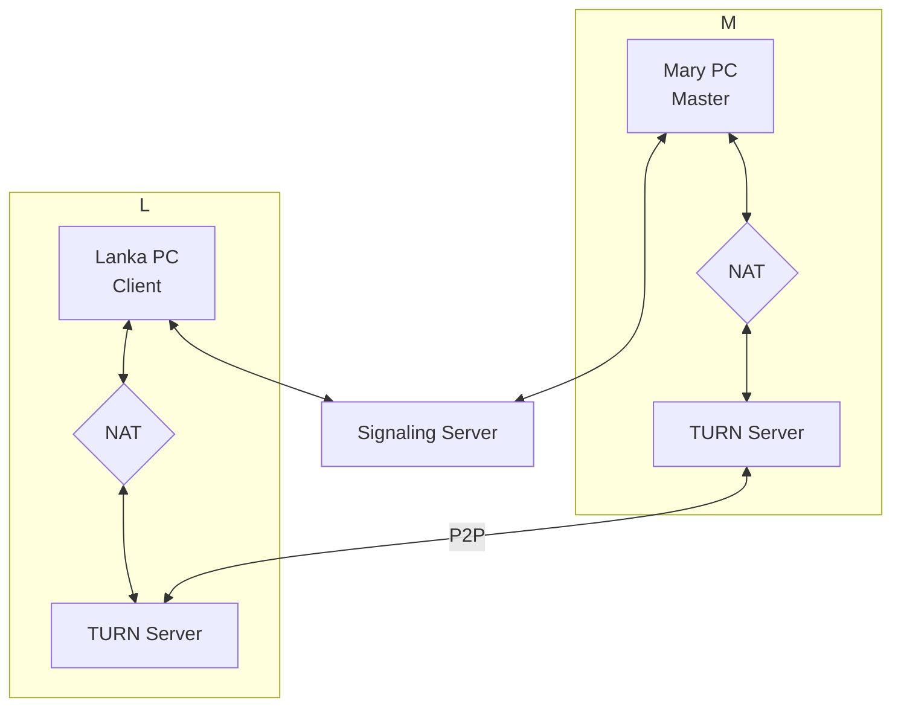
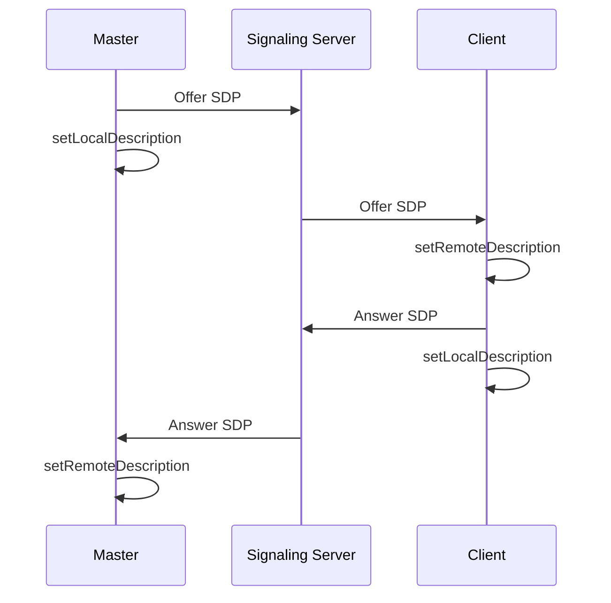

# WebRTC

[](https://github.com/lankahsu520/HelperX)
[![GitHub license][license-image]][license-url]
[![GitHub stars][stars-image]][stars-url]
[![GitHub forks][forks-image]][forks-url]
[![GitHub issues][issues-image]][issues-image]
[![GitHub watchers][watchers-image]][watchers-image]

[license-image]: https://img.shields.io/github/license/lankahsu520/HelperX.svg
[license-url]: https://github.com/lankahsu520/HelperX/blob/master/LICENSE
[stars-image]: https://img.shields.io/github/stars/lankahsu520/HelperX.svg
[stars-url]: https://github.com/lankahsu520/HelperX/stargazers
[forks-image]: https://img.shields.io/github/forks/lankahsu520/HelperX.svg
[forks-url]: https://github.com/lankahsu520/HelperX/network
[issues-image]: https://img.shields.io/github/issues/lankahsu520/HelperX.svg
[issues-url]: https://github.com/lankahsu520/HelperX/issues
[watchers-image]: https://img.shields.io/github/watchers/lankahsu520/HelperX.svg
[watchers-url]: https://github.com/lankahsu520/HelperX/watchers

# 1. Overview

> WebRTC (Web Real-Time Communication)，處理影像、聲音和資料的串流，並且是標榜 P2P (peer-to-peer)。
>
> 目前市面上的瀏覽器已經提供相關的 Web APIs 來進行連線。
>
> 本篇之目的是用簡單的方式讓大家知道 WebRTC。
>
> 但因為 WebRTC 用到很多網路技術，而個人時間，所學有限，本人也不是專門搞研究的，只希望能小小幫助各位。

> [維基百科] [WebRTC](https://zh.wikipedia.org/zh-tw/WebRTC)
>
> **WebRTC**，名稱源自**網頁即時通訊**（英語：Web Real-Time Communication）的縮寫，是一個支援[網頁瀏覽器](https://zh.wikipedia.org/wiki/網頁瀏覽器)進行即時語音對話或影片對話的[API](https://zh.wikipedia.org/wiki/API)。它於2011年6月1日開源並在[Google](https://zh.wikipedia.org/wiki/Google)、[Mozilla](https://zh.wikipedia.org/wiki/Mozilla基金會)、[Opera](https://zh.wikipedia.org/wiki/Opera_Software)支援下被納入[全球資訊網協會](https://zh.wikipedia.org/wiki/万维网联盟)的[W3C推薦標準](https://zh.wikipedia.org/wiki/W3C推荐标准)[[2\]](https://zh.wikipedia.org/zh-tw/WebRTC#cite_note-#1-2)[[3\]](https://zh.wikipedia.org/zh-tw/WebRTC#cite_note-3)[[4\]](https://zh.wikipedia.org/zh-tw/WebRTC#cite_note-4)。

# 2. Network Topology

> 我們先不管資料流的順序，只是很簡單畫出三個主要元件，Signaling Server、Master 和 Client。
>
> 網路上常會號稱 WebRTC 是去中心化的溝通，但是交換訊息時，還是需要 Signaling Server。
>
> Signaling Server 可以用 WebSocket、SIP、XMPP 或其他自定義協議來實現。




>用 mermaid 的圖示這麼好看，借用
>
>[WebRTC Signaling Servers: Everything You Need to Know](https://www.wowza.com/blog/webrtc-signaling-servers)


# 3. Routing Decision

> 因為要實現P2P (peer-to-peer) 的連線機制，其中使用了3 種定址（穿牆）的方式。分別為 NAT, STUN and TURN。而它們的先後順序為 NAT, STUN, TURN。

> 其中有個專有名詞 ICE（網絡技術框架）。如果你跟網路小白說 ICE 技術或名稱，99% 的人會連名稱都不知道在說什麼。但如果你說是 routing  的技術，並且有穿牆的能力，應該大部分的人會清楚你在說什麼，細究內容又是一囘事。有時用 Network Path 來進行解釋可能會比較好理解。
>

## 3.1. NAT

> 就算知道對方的  ip:port，也不見得可以穿過 NAT 進行連線。

> [NAT（四），受限錐形、對稱 NAT](https://ithelp.ithome.com.tw/m/articles/10325516)
>
> [30-28之 WebRTC 連線前傳 - 為什麼 P2P 連線很麻煩 ? ( NAT )](https://ithelp.ithome.com.tw/articles/10209590)



#### A. Full Cone NAT

> 1. Mary 曾經使用 192.168.1.99:1111 進行對外連線 Lanka
>
> 2. 這時 Jobs 知道了 1.1.1.1:9999，就可以可連至 Mary (192.168.1.99:1111 
>
> 3. Lanka 針對 1.1.1.1:9999 進行連線，並轉至 Mary (192.168.1.99:1111 )


#### B. Restricted Cone NAT

> 這個只限定 ip:any
>
> 1. Mary 曾經使用  192.168.1.99:1111 進行對外連線 Lanka
>
> 2. 這時 Jobs 知道了 1.1.1.1:9999，<font color="red">不被充許</font>連至 Mary (192.168.1.99:1111)
>
> 3. 只有 Lanka <font color="blue">充許</font>連至1.1.1.1:9999，並轉至 Mary (192.168.1.99:1111 )
>
> 4. Mary 曾經使用  192.168.1.99:1111 進行對外連線 Jobs
>
> 5. Jobs 這時用 1.1.1.1:9999，<font color="blue">充許</font>連至 Mary (192.168.1.99:1111)



#### C. Port Restricted Cone NAT

> 大致跟 Restricted Cone NAT相同，跟限定 ip:port
>
> 1. Mary 曾經使用  192.168.1.99:1111 進行對外連線
>
> 2. 這時 Jobs 知道了 1.1.1.1:9999，<font color="red">不被充許</font>連至 Mary (192.168.1.99:1111)
>
> 3. 而 Lanka (使用 port: 4567) <font color="red">不被充許</font>連至 Mary (192.168.1.99:1111)
>
> 4. 只有 Lanka (使用 port: 1234) <font color="blue">充許</font>連至 192.168.1.99:1111，並轉至 Mary (192.168.1.99:1111)


#### D. Symmetric NAT

>Mary 對外時，都會變更對外 ip or port or ip:port
>
>1. Mary 使用  192.168.1.99:1111 (1.1.1.1:9999)進行對外連線 Lanka
>
>2. Mary 使用  192.168.1.99:1111 (1.1.1.1:9998)進行對外連線 Jobs
>
>之後就算 Lanka or Jobs 使用原來對接的 ip:port 也<font color="red">不被充許</font>連至 Mary (192.168.1.99:1111)




## 3.2. STUN

> STUN Server 用於獲取外部網路地址
>

> [30-29之 WebRTC 的 P2P 打洞術 ( ICE )](https://ithelp.ithome.com.tw/articles/10209725)


> 以下相關的時序圖，多多少少有些不同，那個才是最佳解，我也不知道
>

#### A. ICE exchange diagram

> 以下圖片取自於 [WebRTC 筆記](https://naurudao.blogspot.com/2016/07/webrtc.html)


#### B. ICE exchange diagram
> 以下圖片取自於 [WebRTC connectivity](https://developer.mozilla.org/en-US/docs/Web/API/WebRTC_API/Connectivity#the_entire_exchange_in_a_complicated_diagram)


#### C. ICE exchange diagram

> 以下圖片取自於 [WebRTC中的ICE Candidate](https://zhuanlan.zhihu.com/p/476577799)


#### D. ICE exchange diagram

> 以下圖片取自於 [webRTC学习笔记](https://www.yuyoung32.com/post/webrtc学习笔记/)


## 3.3. TURN

> 如果對連失敗，TURN Server 用于中繼轉運站。
>
> 如果進行到這一步，就不是所謂的P2P。又回到 Client-Server。



# 4. SDP

> [RFC 8839 Session Description Protocol (SDP) Offer/Answer Procedures for Interactive Connectivity Establishment (ICE)](https://www.rfc-editor.org/rfc/rfc8839.pdf)

## 4.1. Sequence



## 4.2. Format

> 以下圖片取自於 [webRTC学习笔记](https://www.yuyoung32.com/post/webrtc学习笔记/)


```json
v=0
o=jdoe 2890844526 2890842807 IN IP4 203.0.113.141
s=
c=IN IP4 192.0.2.3
t=0 0
a=ice-options:ice2
a=ice-pacing:50
a=ice-pwd:asd88fgpdd777uzjYhagZg
a=ice-ufrag:8hhY
m=audio 45664 RTP/AVP 0
b=RS:0
b=RR:0
a=rtpmap:0 PCMU/8000
a=candidate:1 1 UDP 2130706431 203.0.113.141 8998 typ host
a=candidate:2 1 UDP 1694498815 192.0.2.3 45664 typ srflx raddr
 203.0.113.141 rport 8998
```

#### A. [RTP payload formats](https://en.wikipedia.org/wiki/RTP_payload_formats)

# 5. WebRTC API


## 5.1. [WebRTC API](https://developer.mozilla.org/zh-CN/docs/Web/API/WebRTC_API#webrtc_概念和用法)

### 5.1.1. MediaStream

> 媒體流，如音訊、視訊

### 5.1.2. RTCPeerConnection

> 建立連線、監控、加密

### 5.1.3. RTCDataChannel

> 傳輸非音視訊的資料，如文字、圖片

## 5.2. WebRTC Native C++ API

## 5.3. Session management / Abstract signaling (Session)

## 5.4. Transport

## 5.5. VoiceEngine

## 5.6. VideoEngine


# Appendix

# I. Study

## I.1. [WebRTC: Real-Time Communication in Browsers](https://www.w3.org/TR/webrtc/)

## I.2. [Introduction to WebRTC](https://medium.com/dvt-engineering/introduction-to-webrtc-cad0c6900b8e)

## I.3. [webRTC学习笔记](https://www.yuyoung32.com/post/webrtc学习笔记/)

## I.4. [後疫情時代的 WebRTC 微學習](https://ithelp.ithome.com.tw/users/20130062/ironman/3918)

## I.5. [Real-time communication with WebRTC: Google I/O 2013](https://www.youtube.com/watch?v=p2HzZkd2A40&t=1272s)

# II. Debug

# III. Glossary

#### ICE, Interactive Connectivity Establishment

> [維基百科] [ICE](https://zh.wikipedia.org/wiki/互動式連接建立)
>
> **互動式連接建立**（Interactive Connectivity Establishment），一種綜合性的[NAT穿越](https://zh.wikipedia.org/wiki/NAT穿越)的技術。
>
> 互動式連接建立是由[IETF](https://zh.wikipedia.org/wiki/IETF)的MMUSIC工作組開發出來的一種framework，可整合各種[NAT穿透](https://zh.wikipedia.org/wiki/NAT穿透)技術，如[STUN](https://zh.wikipedia.org/wiki/STUN)、[TURN](https://zh.wikipedia.org/wiki/TURN)（Traversal Using Relay NAT，中繼NAT實現的穿透）、RSIP（Realm Specific IP，特定域IP）等。該framework可以讓SIP的客戶端利用各種NAT穿透方式打穿遠程的[防火牆](https://zh.wikipedia.org/wiki/防火牆)。

> [ChatGPT] 什麼是 ICE
>
> **ICE (Interactive Connectivity Establishment)** 是一種網絡技術框架，主要用於在存在 NAT（網絡地址轉換）和防火牆的情況下，幫助建立點對點（P2P）連接。ICE 是 WebRTC（Web Real-Time Communication）協議的重要組成部分，廣泛應用於實時通信應用程序，如視頻通話、VoIP、文件共享和在線遊戲等。ICE 的主要目的是找到最佳的網絡路徑，使兩個對等端能夠直接進行通信，即使它們位於不同的私有網絡或有防火牆保護。
>
> ### 1. **ICE 的工作原理**：
>
> ICE 協議通過收集和測試多種候選路徑（candidates），來確保兩個對等端可以建立有效的通信。ICE 的工作過程可以分為以下幾個步驟：
>
> #### **候選收集**：
>
> - 每個對等端收集各種候選地址（稱為 candidates），這些地址代表了可能用於連接的網絡路徑。這些候選地址包括：
>   - **主機候選（Host Candidates）**：設備本地網絡接口的 IP 地址和端口。
>   - **服務中繼候選（Server Reflexive Candidates）**：通過 STUN 服務器（Session Traversal Utilities for NAT）獲取的公共 IP 地址和端口，這些地址顯示了 NAT 和防火牆看到的對等端的公共網絡地址。
>   - **中繼候選（Relay Candidates）**：通過 TURN 服務器（Traversal Using Relays around NAT）獲取的中繼地址，用於在直接連接失敗的情況下進行數據傳輸。
>
> #### **候選優先排序**：
>
> - 每個對等端對收集到的候選進行優先排序。一般來說，本地（主機）候選優先級最高，因為直接連接往往延遲最低且性能最佳。反射性候選和中繼候選的優先級較低。
>
> #### **候選交換**：
>
> - 對等端之間通過信令通道（例如 WebRTC 使用的 SDP，Session Description Protocol）交換候選列表。這使得每個對等端都能知道如何嘗試與另一端建立連接。
>
> #### **連接測試**：
>
> - 每個對等端根據交換的候選列表，開始測試連接的可行性。測試是通過發送 STUN 請求來檢查候選對之間是否可以建立雙向通信路徑。
> - ICE 遵循一種稱為“搶占式”（aggressive）的測試方法，即它會同時測試多個候選對，並選擇第一個成功建立的連接。
>
> #### **選擇最佳候選對**：
>
> - 一旦找到可行的候選對（即內外都能通過），ICE 將選擇延遲最低、最可靠的連接作為通信路徑。
>
> #### **連接維護**：
>
> - 在通信期間，ICE 還會定期檢查選擇的連接是否仍然可用，以應對網絡變化。必要時，它會切換到其他可用的候選對，以保持連接穩定。
>
> ### 2. **ICE 的優勢**：
>
> - **NAT 和防火牆穿透**：ICE 可以穿透不同類型的 NAT 和防火牆，這是現代網絡中普遍存在的挑戰。通過多種候選類型，ICE 提高了成功建立 P2P 連接的可能性。
> - **提高連接速度**：ICE 通過並行測試多個候選，可以快速確定最佳的連接路徑，減少連接建立的時間，特別是在使用 Trickle ICE 技術的情況下。
> - **可靠性和恢復能力**：ICE 提供了連接的冗餘性，即使一個路徑失敗，它仍然可以嘗試使用其他候選路徑來維持連接。
>
> ### 3. **使用 ICE 的典型應用**：
>
> - **WebRTC 應用程序**：如 Google Meet、Zoom 和 Microsoft Teams 等視頻會議工具使用 ICE 來幫助用戶之間建立可靠的 P2P 連接。
> - **VoIP（Voice over IP）**：如 Skype 和 WhatsApp 等語音通話應用程序使用 ICE 來確保用戶之間的語音數據能夠順利傳輸。
> - **在線遊戲和文件共享**：許多在線遊戲和文件共享應用也使用 ICE 來優化網絡連接，減少延遲和提高數據傳輸速度。
>
> ### 4. **ICE 的限制和挑戰**：
>
> - **性能開銷**：ICE 需要測試大量候選對，這可能會消耗計算資源和網絡帶寬，特別是在大量用戶同時進行連接測試的情況下。
> - **複雜性**：實現和調試 ICE 過程可能相當複雜，特別是當涉及不同類型的 NAT 設置和網絡環境時。
> - **依賴外部伺服器**：ICE 通常依賴 STUN 和 TURN 伺服器來獲取候選地址和作為中繼，這意味著需要設置和維護這些伺服器。
>
> ### 總結
>
> ICE 是實時通信應用中解決 NAT 穿透問題的核心技術，通過收集、交換和測試多種候選連接，來確保 P2P 連接的成功建立和穩定性。這使得像 WebRTC 這樣的技術能夠在現代網絡環境中有效工作，並為用戶提供流暢的音視頻體驗。

#### NAT, **N**etwork **A**ddress **T**ranslation

> [維基百科] [NAT](https://zh.wikipedia.org/zh-tw/网络地址转换)
>
> **網路位址轉譯**（英語：**N**etwork **A**ddress **T**ranslation，縮寫：**NAT**），又稱**IP動態偽裝**（英語：IP Masquerade）[[1\]](https://zh.wikipedia.org/zh-tw/网络地址转换#cite_note-1):176，是一種在IP[封包](https://zh.wikipedia.org/wiki/封包)通過[路由器](https://zh.wikipedia.org/wiki/路由器)或[防火牆](https://zh.wikipedia.org/wiki/防火牆)時重寫來源或目的[IP位址](https://zh.wikipedia.org/wiki/IP地址)或[埠](https://zh.wikipedia.org/wiki/端口)的技術。這種技術普遍應用於有多台主機，但只通過一個公有IP位址訪問[網際網路](https://zh.wikipedia.org/wiki/網際網路)的[私有網路](https://zh.wikipedia.org/wiki/私有网络)中。
>
> NAT技術部署方便，且得到了廣泛應用。然而，NAT也讓主機之間的通訊變得複雜，導致了通訊效率的降低。

#### SDP, Session Description Protocol

>[維基百科] [SDP](https://zh.wikipedia.org/zh-tw/会话描述协议)
>
>會話描述協議**（**Session Description Protocol**或簡寫**SDP**）描述的是[流媒體](https://zh.wikipedia.org/wiki/流媒体)的初始化參數。此協議由[IETF](https://zh.wikipedia.org/wiki/IETF)發表為 [RFC 2327](https://tools.ietf.org/html/rfc2327)。**
>
>SDP最初的時候是會話發布協議（Session Announcement Protocol或簡寫SAP）的一個部件，1998年4月推出第一版[[1\]](https://zh.wikipedia.org/zh-tw/会话描述协议#cite_note-1)，但是之後被廣泛用於和[RTSP](https://zh.wikipedia.org/wiki/RTSP)以及[SIP](https://zh.wikipedia.org/wiki/会话发起协议)協同工作，也可被單獨用來描述[多播](https://zh.wikipedia.org/wiki/多播)會話。

#### STUN,  Session Traversal Utilities for NAT

> [維基百科] [STUN](https://zh.wikipedia.org/zh-tw/会话描述协议)
>
> STUN（用戶資料報協定[UDP]簡單穿越網路位址轉換器[NAT])伺服器允許所有的NAT客戶終端(如防火牆後邊的電腦)與位於局區域網以外的VOIP服務商實現電話通話。
>
> 通過STUN伺服器，客戶終端可以瞭解他們的公共位址、擋在他們前面的NAT類型和通過NAT與特定局部埠相連的因特網方埠。這些資訊將被用於建立客戶終端與VOIP服務商之間的UDP通信，以便實現通話。STUN協定在[RFC 3489](https://www.ietf.org/rfc/rfc3489.txt)中予以定義。
>
> 雖然是在UDP 埠3478連接STUN伺服器，但會暗示客戶終端在另外一個IP和埠號上實施測試（STUN伺服器有兩個IP位址）。RFC 規定這個埠和IP是隨意的。
#### Symmetric NAT,

> [ChatGPT] 什麼是 Symmetric NAT
>
> **Symmetric NAT** 是 NAT（Network Address Translation）的一種類型，主要用於在網絡中進行地址和端口轉換。與其他類型的 NAT 相比，Symmetric NAT 提供了更高的安全性，但也使得點對點（P2P）連接的建立更加困難。以下是關於 Symmetric NAT 的詳細說明：
>
> ### 1. **Symmetric NAT 的定義**：
>
> - 在 Symmetric NAT 中，每當內部網絡中的設備（如計算機或手機）發起一個新的外部連接（例如訪問互聯網上的某個伺服器）時，NAT 會使用不同的端口號來映射這個連接。此外，如果同一個內部 IP 和端口向不同的外部目標發送數據包，Symmetric NAT 會為每個目標分配不同的外部端口號。
> - 簡單來說，Symmetric NAT 為每個唯一的內部和外部目標組合分配一個唯一的公共 IP 地址和端口映射。
>
> ### 2. **工作原理**：
>
> - 當內部設備嘗試向外部目標（如伺服器或另一個設備）發送數據包時，Symmetric NAT 會創建一個新的映射，並分配一個唯一的公共端口號來表示這個特定的連接。
> - 如果內部設備發送的數據包到達不同的外部目標，Symmetric NAT 會創建新的映射，並使用不同的公共端口號。因此，每個內部-外部對應都需要一個單獨的映射。
>
> ### 3. **與其他 NAT 類型的比較**：
>
> - **Full Cone NAT**：允許外部設備只要知道內部設備的公共 IP 和端口，就可以通過這些公共地址直接訪問內部設備。
> - **Restricted Cone NAT**：只允許內部設備曾經與之通信過的外部地址發起的連接。
> - **Port Restricted Cone NAT**：進一步限制，只允許來自特定端口的外部地址發起連接。
> - **Symmetric NAT**：最嚴格的一種，每個內部到外部的連接都有一個唯一的映射，外部設備只能通過這些唯一映射進行通信。外部設備要反向訪問內部設備，必須符合最初的內部-外部對映，否則會被拒絕。
>
> ### 4. **安全性**：
>
> - **更高的安全性**：Symmetric NAT 提供了較高的安全性，因為外部設備無法輕易猜測到內部設備的公共端口映射，也無法輕易發起未經授權的連接。這種隨機化的端口分配使得惡意設備更難預測網絡的映射方式。
>
> ### 5. **挑戰和問題**：
>
> - **P2P 連接困難**：由於 Symmetric NAT 的嚴格映射規則，進行點對點（P2P）連接變得更加困難。這對於依賴直接設備間通信的應用，如視頻聊天、VoIP 通話、在線遊戲等，可能會產生問題。
> - **STUN 協議無效**：STUN（Session Traversal Utilities for NAT）協議通常用於檢測 NAT 類型並嘗試進行 NAT 穿透。但由於 Symmetric NAT 為每個連接分配不同的端口，STUN 協議無法在這種 NAT 配置中正常工作。
> - **依賴 TURN 伺服器**：在許多情況下，解決 Symmetric NAT 問題的方法是使用 TURN（Traversal Using Relays around NAT）伺服器。TURN 伺服器充當中介，使得兩個設備能夠通過公共伺服器間接進行通信，但這增加了延遲和帶寬消耗。
>
> ### 6. **應用場景**：
>
> - **企業網絡**：Symmetric NAT 常見於企業網絡中，這些網絡需要更高的安全性來保護內部資源免受外部威脅。
> - **高安全性需求的環境**：由於 Symmetric NAT 提供的嚴格控制，某些高安全性需求的環境可能會使用這種 NAT 配置。
>
> ### 總結
>
> Symmetric NAT 是一種提供較高安全性和隱私保護的 NAT 類型，但它也帶來了挑戰，尤其是在需要點對點連接的應用場景中。理解 Symmetric NAT 的工作方式對於設計可靠的網絡應用程序，特別是在涉及實時通信的情況下，如 WebRTC、VoIP 和視頻會議等，是非常重要的。

#### TURN, Traversal Using Relay around NAT

> [維基百科] [TURN](https://zh.wikipedia.org/zh-tw/TURN)
>
> **TURN**（全名**Traversal Using Relay around NAT**），是一種資料傳輸協定（data-transfer protocol）。允許在TCP或UDP的連線上跨越[NAT](https://zh.wikipedia.org/wiki/网络地址转换)或[防火牆](https://zh.wikipedia.org/wiki/防火牆)。
>
> TURN是一個client-server協定。TURN的NAT穿透方法與[STUN](https://zh.wikipedia.org/wiki/STUN)類似，都是通過取得應用層中的公有位址達到NAT穿透。但實現TURN client的終端必須在通訊開始前與TURN server進行互動，並要求TURN server產生"relay port"，也就是relayed-transport-address。這時TURN server會建立peer，即遠端端點（remote endpoints），開始進行中繼（relay）的動作，TURN client利用relay port將資料傳送至peer，再由peer轉傳到另一方的TURN client。

# IV. Tool Usage

# V. Tools

# Author

> Created and designed by [Lanka Hsu](lankahsu@gmail.com).

# License

> [HelperX](https://github.com/lankahsu520/HelperX) is available under the BSD-3-Clause license. See the LICENSE file for more info.
