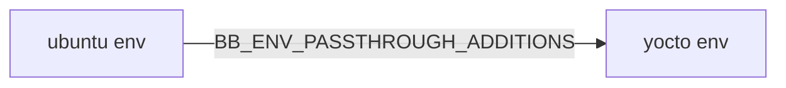

# [Yocto](https://www.yoctoproject.org)
[](https://github.com/lankahsu520/HelperX)
[![GitHub license][license-image]][license-url]
[![GitHub stars][stars-image]][stars-url]
[![GitHub forks][forks-image]][forks-url]
[![GitHub issues][issues-image]][issues-image]


[license-image]: https://img.shields.io/github/license/lankahsu520/HelperX.svg
[license-url]: https://github.com/lankahsu520/HelperX/blob/master/LICENSE
[stars-image]: https://img.shields.io/github/stars/lankahsu520/HelperX.svg
[stars-url]: https://github.com/lankahsu520/HelperX/stargazers
[forks-image]: https://img.shields.io/github/forks/lankahsu520/HelperX.svg
[forks-url]: https://github.com/lankahsu520/HelperX/network
[issues-image]: https://img.shields.io/github/issues/lankahsu520/HelperX.svg
[issues-url]: https://github.com/lankahsu520/HelperX/issues

# 1. bb helper

## 1.1. utils - [layers/poky/bitbake/lib/bb/utils.py](layers/poky/bitbake/lib/bb/utils.py)

#### def contains(variable, checkvalues, truevalue, falsevalue, d):

```bb
"""Check if a variable contains all the values specified.

DEPENDS += "${@bb.utils.contains('DISTRO_FEATURES', 'x11', '${X11DEPENDS}', '', d)}"

PACKAGECONFIG = "${@bb.utils.contains('DISTRO_FEATURES', 'x11', 'x11', '', d)}"

ENDIANNESS_GCC = "${@bb.utils.contains("LE_UBOOT_FOR_ARMBE_TARGET", "1", "-mlittle-endian", "", d)}"
ENDIANNESS_LD = "${@bb.utils.contains("LE_UBOOT_FOR_ARMBE_TARGET", "1", "-EL", "", d)}"

CFLAGS += "${@bb.utils.contains('SELECTED_OPTIMIZATION', '-Og', '-DXXH_NO_INLINE_HINTS', '', d)}"

```

#### def filter(variable, checkvalues, d):

```bb
"""Return all words in the variable that are present in the checkvalues.

PACKAGECONFIG ??= "${@bb.utils.filter('DISTRO_FEATURES', 'x11', d)}"

```

# 2. Others

## 2.1. BB_ENV_EXTRAWHITE

```bb
ERROR: Variable BB_ENV_EXTRAWHITE has been renamed to BB_ENV_PASSTHROUGH_ADDITIONS
ERROR: Variable BB_ENV_EXTRAWHITE from the shell environment has been renamed to BB_ENV_PASSTHROUGH_ADDITIONS
ERROR: Exiting to allow enviroment variables to be corrected

```

## 2.2. [BB_ENV_PASSTHROUGH_ADDITIONS](https://docs.yoctoproject.org/bitbake/dev/bitbake-user-manual/bitbake-user-manual-ref-variables.html#term-BB_ENV_PASSTHROUGH_ADDITIONS)



```bb
BB_ENV_PASSTHROUGH_ADDITIONS="ALL_PROXY BBPATH_EXTRA BB_LOGCONFIG BB_NO_NETWORK BB_NUMBER_THREADS BB_SETSCENE_ENFORCE BB_SRCREV_POLICY DISTRO FTPS_PROXY FTP_PROXY GIT_PROXY_COMMAND HTTPS_PROXY HTTP_PROXY MACHINE NO_PROXY PARALLEL_MAKE SCREENDIR SDKMACHINE SOCKS5_PASSWD SOCKS5_USER SSH_AGENT_PID SSH_AUTH_SOCK STAMPS_DIR TCLIBC TCMODE all_proxy ftp_proxy ftps_proxy http_proxy https_proxy no_proxy"

```

```bash
$ export BB_EXTRA_SRCREV="AUTOINC"
$ export BB_ENV_PASSTHROUGH_ADDITIONS="${BB_ENV_PASSTHROUGH_ADDITIONS} BB_EXTRA_SRCREV"

```

```bb
SRCREV = "${@bb.utils.contains('BB_EXTRA_SRCREV','AUTOINC','${AUTOREV}','${SRCREV_RELEASE}',d)}"

or

SRCREV = "${@'${AUTOREV}' if d.getVar('BB_EXTRA_SRCREV', 'AUTOINC') \
         else '${SRCREV_RELEASE}'}"
```

# Appendix

# I. Study

# II. Debug


# Author

Created and designed by [Lanka Hsu](lankahsu@gmail.com).

# License

[HelperX](https://github.com/lankahsu520/HelperX) is available under the BSD-3-Clause license. See the LICENSE file for more info.

