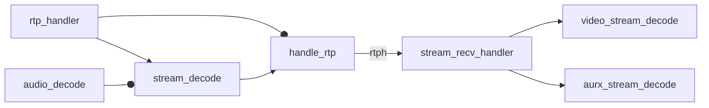
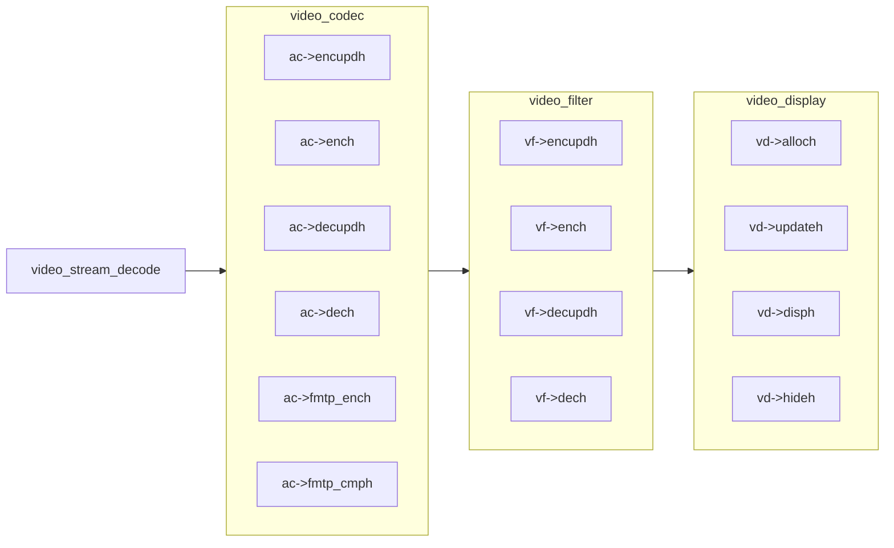
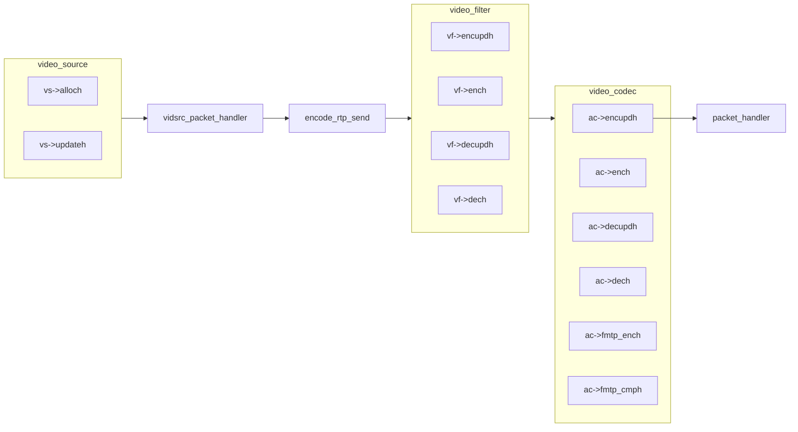
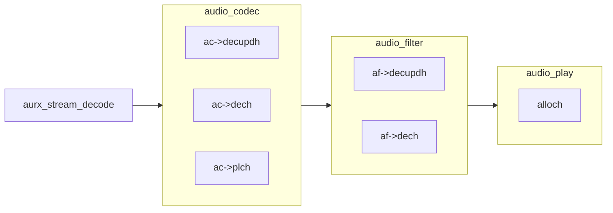

# [baresip](https://github.com/baresip/baresip)
[](https://github.com/lankahsu520/HelperX)
[![GitHub license][license-image]][license-url]
[![GitHub stars][stars-image]][stars-url]
[![GitHub forks][forks-image]][forks-url]
[![GitHub issues][issues-image]][issues-image]
[![GitHub watchers][watchers-image]][watchers-image]

[license-image]: https://img.shields.io/github/license/lankahsu520/HelperX.svg
[license-url]: https://github.com/lankahsu520/HelperX/blob/master/LICENSE
[stars-image]: https://img.shields.io/github/stars/lankahsu520/HelperX.svg
[stars-url]: https://github.com/lankahsu520/HelperX/stargazers
[forks-image]: https://img.shields.io/github/forks/lankahsu520/HelperX.svg
[forks-url]: https://github.com/lankahsu520/HelperX/network
[issues-image]: https://img.shields.io/github/issues/lankahsu520/HelperX.svg
[issues-url]: https://github.com/lankahsu520/HelperX/issues
[watchers-image]: https://img.shields.io/github/watchers/lankahsu520/HelperX.svg
[watchers-url]: https://github.com/lankahsu520/HelperX/watchers

# 1. Overview

> Baresip is a portable and modular SIP User-Agent with audio and video support. 

> 體會過 baresip 後，覺得在編譯和修改非常容易上手。縱觀其它 sip client(s)，不只編譯困難，引用的 open source 過多過舊，甚至已沒有維護，更重要的就是連怎麼執行都不交待，


# 2. STATE 
## 2.1. CALL_STATE_INCOMING




## 2.2. CALL_STATE_ESTABLISHED


# 3. video

## 3.1. decode and encode

### 3.1.1. decode ( baresip --> output)



### 3.1.2. encode ( source --> baresip)

## 3.2. video_codec


#### A. baresip.c

```c
# baresip.c
struct list *baresip_vidcodecl(void)
{
	return &baresip.vidcodecl;
}

# baresip.h
struct vidcodec {
	struct le le;
	const char *pt;
	const char *name;
	const char *variant;
	const char *fmtp;
	videnc_update_h *encupdh;
	videnc_encode_h *ench;
	viddec_update_h *decupdh;
	viddec_decode_h *dech;
	sdp_fmtp_enc_h *fmtp_ench;
	sdp_fmtp_cmp_h *fmtp_cmph;
	videnc_packetize_h *packetizeh;
};
```

#### B. vidcodec.c

```c
# vidcodec.c
void vidcodec_register(struct list *vidcodecl, struct vidcodec *vc)
```

#### C. video.c

```c
# video.c
# 422 - vc->ench
static void encode_rtp_send(struct vtx *vtx, struct vidframe *frame,
			    struct vidpacket *packet, uint64_t timestamp)
{
	...
	err = vtx->vc->ench(vtx->enc, vtx->picup, frame, timestamp);
	...
}

# 695 - vc->dech
static int video_stream_decode(struct vrx *vrx, const struct rtp_header *hdr,
			       struct mbuf *mb)
{
	...
	err = vrx->vc->dech(vrx->dec, frame, &intra, hdr->m, hdr->seq, mb);
	...
}

# 963 - vc->fmtp_ench, vc->fmtp_cmph
int video_alloc(struct video **vp, struct list *streaml,
		const struct stream_param *stream_prm,
		const struct config *cfg,
		struct sdp_session *sdp_sess,
		const struct mnat *mnat, struct mnat_sess *mnat_sess,
		const struct menc *menc, struct menc_sess *menc_sess,
		const char *content, const struct list *vidcodecl,
		const struct list *vidfiltl,
		bool offerer,
		video_err_h *errh, void *arg)
{
	...
		err |= sdp_format_add(NULL, stream_sdpmedia(v->strm), false,
				      vc->pt, vc->name, 90000, 1,
				      vc->fmtp_ench, vc->fmtp_cmph, vc, false,
				      "%s", vc->fmtp);
	...
}

# 1434 - vc->encupdh
int video_encoder_set(struct video *v, struct vidcodec *vc,
		      int pt_tx, const char *params)
{
	...
		err = vc->encupdh(&vtx->enc, vc, &prm, params,
	...
}

# 1483 - vc->decupdh
int video_decoder_set(struct video *v, struct vidcodec *vc, int pt_rx,
		      const char *fmtp)
{
	...
		err = vc->decupdh(&vrx->dec, vc, fmtp);
	...
}
```

## 3.3. video_filter

#### A. baresip.c

```c
# baresip.c
struct list *baresip_vidfiltl(void)
{
	return &baresip.vidfiltl;
}

# baresip.h
struct vidfilt {
	struct le le;
	const char *name;
	vidfilt_encupd_h *encupdh;
	vidfilt_encode_h *ench;
	vidfilt_decupd_h *decupdh;
	vidfilt_decode_h *dech;
};
```

#### B. vidfilt.c

```c
# vidfilt.c
# 17
void vidfilt_register(struct list *vidfiltl, struct vidfilt *vf)

# 61 - vf->encupdh
int vidfilt_enc_append(struct list *filtl, void **ctx,
		       const struct vidfilt *vf, struct vidfilt_prm *prm,
		       const struct video *vid)
{
	...
		err = vf->encupdh(&st, ctx, vf, prm, vid);
	...
}

# 105 - vf->decupdh
int vidfilt_dec_append(struct list *filtl, void **ctx,
		       const struct vidfilt *vf, struct vidfilt_prm *prm,
		       const struct video *vid)
{
	...
		err = vf->decupdh(&st, ctx, vf, prm, vid);
	...
}
```

#### C. video.c

```c
# video.c
# 422 - vf->ench
static void encode_rtp_send(struct vtx *vtx, struct vidframe *frame,
			    struct vidpacket *packet, uint64_t timestamp)
{
	...
			err |= st->vf->ench(st, frame, &timestamp);
	...
}

# 695 - vf->dech
static int video_stream_decode(struct vrx *vrx, const struct rtp_header *hdr,
			       struct mbuf *mb)
{
	...
			err |= st->vf->dech(st, frame, &timestamp);
	...
}

# 886 - vf->ench
static int vtx_print_pipeline(struct re_printf *pf, const struct vtx *vtx)
{
	...
		if (st->vf->ench)
			err |= re_hprintf(pf, " ---> %s", st->vf->name);
	...
}

# 963
int video_alloc(struct video **vp, struct list *streaml,
		const struct stream_param *stream_prm,
		const struct config *cfg,
		struct sdp_session *sdp_sess,
		const struct mnat *mnat, struct mnat_sess *mnat_sess,
		const struct menc *menc, struct menc_sess *menc_sess,
		const char *content, const struct list *vidcodecl,
		const struct list *vidfiltl,
		bool offerer,
		video_err_h *errh, void *arg)
{
	...
		err |= vidfilt_enc_append(&v->vtx.filtl, &ctx, vf, &prmenc, v);
		err |= vidfilt_dec_append(&v->vrx.filtl, &ctx, vf, &prmdec, v);
	...
}
```

## 3.4. video_display


#### A. baresip.c

```c
# baresip.c
struct list *baresip_vidispl(void)
{
	return &baresip.vidispl;
}

# baresip.h
/** Defines a Video display */
struct vidisp {
	struct le        le;
	const char      *name;
	vidisp_alloc_h  *alloch;
	vidisp_update_h *updateh;
	vidisp_disp_h   *disph;
	vidisp_hide_h   *hideh;
};
```

#### B. vidisp.c

```c
# vidisp.c
# 31
int vidisp_register(struct vidisp **vp, struct list *vidispl, const char *name, vidisp_alloc_h *alloch, vidisp_update_h *updateh, vidisp_disp_h *disph, vidisp_hide_h *hideh)

# 91
int vidisp_alloc(struct vidisp_st **stp, struct list *vidispl,
		 const char *name,
		 struct vidisp_prm *prm, const char *dev,
		 vidisp_resize_h *resizeh, void *arg)
{
	struct vidisp *vd = (struct vidisp *)vidisp_find(vidispl, name);
	if (!vd)
		return ENOENT;

	return vd->alloch(stp, vd, prm, dev, resizeh, arg);
}
```

#### C. video.c

```c
# video.c
# 695 - vd->disph
static int video_stream_decode(struct vrx *vrx, const struct rtp_header *hdr,
			       struct mbuf *mb)
{
	...
		err = vrx->vd->disph(vrx->vidisp, v->peer, frame, timestamp);
	...
}

# 1090 - vd->alloch
static int set_vidisp(struct vrx *vrx)
{
	...
	err = vd->alloch(&vrx->vidisp, vd, &vrx->vidisp_prm, vrx->device,
			 vidisp_resize_handler, vrx);
	...
}

# 1299 - set_vidisp
int video_start_display(struct video *v, const char *peer)
{
	...
	if (vidisp_find(baresip_vidispl(), NULL)) {
		err = set_vidisp(&v->vrx);
		...
	}
	...
}

# 1382 - vd->updateh
static int vidisp_update(struct vrx *vrx)
{
	...
		err = vd->updateh(vrx->vidisp, vrx->vidisp_prm.fullscreen,
				  vrx->orient, NULL);
	...
}
```

## 3.5. video_source


#### A. baresip.c

```c
# baresip.c
struct list *baresip_vidsrcl(void)
{
	return &baresip.vidsrcl;
}

# baresip.h
/** Defines a video source */
struct vidsrc {
	struct le         le;
	const char       *name;
	struct list      dev_list;
	vidsrc_alloc_h   *alloch;
	vidsrc_update_h  *updateh;
};
```

#### B. vidsrc.c

```c
# vidsrc.c
int vidsrc_register(struct vidsrc **vsp, struct list *vidsrcl,
		    const char *name,
		    vidsrc_alloc_h *alloch, vidsrc_update_h *updateh)

# 103 - vs->alloch
int vidsrc_alloc(struct vidsrc_st **stp, struct list *vidsrcl,
		 const char *name,
		 struct vidsrc_prm *prm,
		 const struct vidsz *size, const char *fmt, const char *dev,
		 vidsrc_frame_h *frameh, vidsrc_packet_h *packeth,
		 vidsrc_error_h *errorh, void *arg)
{
	...
	return vs->alloch(stp, vs, prm, size, fmt, dev,
			  frameh, packeth, errorh, arg);
}
```

#### C. video.c

```c
# video.c
# 1226
int video_start_source(struct video *v)
{
	...
		err = vs->alloch(&vtx->vsrc, vs, &vtx->vsrc_prm,
				 &vtx->vsrc_size, NULL, v->vtx.device,
				 vidsrc_frame_handler, vidsrc_packet_handler,
				 vidsrc_error_handler, vtx);
	...
}

# 1413
static void vidsrc_update(struct vtx *vtx, const char *dev)
{
	...
		vs->updateh(vtx->vsrc, &vtx->vsrc_prm, dev);
	...
}

# 1694
int video_set_source(struct video *v, const char *name, const char *dev)
{
	...
	err = vs->alloch(&vtx->vsrc, vs, &vtx->vsrc_prm,
			 &vtx->vsrc_size, NULL, dev,
			 vidsrc_frame_handler, vidsrc_packet_handler,
			 vidsrc_error_handler, vtx);
	...
}
```

# 4. audio

## 4.1. decode (baresip -> output)



## 4.2. audio_codec


#### A. baresip.c

```c
# baresip.c
struct list *baresip_aucodecl(void)
{
	return &baresip.aucodecl;
}

# baresip.h
struct aucodec {
	struct le le;
	const char *pt;
	const char *name;
	uint32_t srate;             /* Audio samplerate */
	uint32_t crate;             /* RTP Clock rate   */
	uint8_t ch;
	uint8_t pch;                /* RTP packet channels */
	uint32_t ptime;             /* Packet time in [ms] (optional) */
	const char *fmtp;
	auenc_update_h *encupdh;
	auenc_encode_h *ench;
	audec_update_h *decupdh;
	audec_decode_h *dech;
	audec_plc_h    *plch;
	sdp_fmtp_enc_h *fmtp_ench;
	sdp_fmtp_cmp_h *fmtp_cmph;
};
```

#### B. aucodec.c

```c
# aucodec.c
void aucodec_register(struct list *aucodecl, struct aucodec *ac)
```
#### C. audio.c

```c
# audio.c
# 406 - ac->fmtp_ench, ac->fmtp_cmph
static int add_audio_codec(struct sdp_media *m, struct aucodec *ac)
{
	...
	return sdp_format_add(NULL, m, false, ac->pt, ac->name, ac->crate,
			      ac->pch, ac->fmtp_ench, ac->fmtp_cmph, ac, false,
			      "%s", ac->fmtp);
}

# 453 - ac->ench
static void encode_rtp_send(struct audio *a, struct autx *tx,
			    int16_t *sampv, size_t sampc, enum aufmt fmt)
{
	...
  err = tx->ac->ench(tx->enc, &marker, mbuf_buf(tx->mb), &len,
			   fmt, sampv, sampc);
	...
}

# 1005 - ac->dech
static int aurx_stream_decode(struct aurx *rx, bool marker,
			      struct mbuf *mb, unsigned lostc)
{
	...
	if (lostc && rx->ac->plch) {

		err = rx->ac->plch(rx->dec,
				   rx->dec_fmt, rx->sampv, &sampc,
				   mbuf_buf(mb), mbuf_get_left(mb));
	...
 	else if (mbuf_get_left(mb)) {

    err = rx->ac->dech(rx->dec,
				   rx->dec_fmt, rx->sampv, &sampc,
				   marker, mbuf_buf(mb), mbuf_get_left(mb));
	...
}

# 2017 - ac->encupdh
int audio_encoder_set(struct audio *a, const struct aucodec *ac,
		      int pt_tx, const char *params)
{
	...
		err = ac->encupdh(&tx->enc, ac, &prm, params);
	...
}

# 2091 - ac->decupdh
int audio_decoder_set(struct audio *a, const struct aucodec *ac,
		      int pt_rx, const char *params)
{
	...
		err = ac->decupdh(&rx->dec, ac, params);
	...
}

# 2577 - ac->encupdh
int audio_set_bitrate(struct audio *au, uint32_t bitrate)
{
	...
			err = ac->encupdh(&tx->enc, ac, &prm, NULL);
	...
}
```

## 4.3. audio_filter

#### A. baresip.c

```c
# baresip.c
struct list *baresip_aufiltl(void)
{
	return &baresip.aufiltl;
}

# baresip.h
struct aufilt {
	struct le le;
	const char *name;
	aufilt_encupd_h *encupdh;
	aufilt_encode_h *ench;
	aufilt_decupd_h *decupdh;
	aufilt_decode_h *dech;
};
```

#### B. aufilt.c

```c
# aufilt.c
void aufilt_register(struct list *aufiltl, struct aufilt *af)
```

#### C. audio.c

```c
# audio.c
# 563 - af->ench
static void poll_aubuf_tx(struct audio *a)
{
	...
			err |= st->af->ench(st, &af);
	...
}

# 1535 - af->ench
static int autx_print_pipeline(struct re_printf *pf, const struct autx *autx)
{
	...
		if (st->af->ench)
			err |= re_hprintf(pf, " ---> %s", st->af->name);
	...
}

# 1560 - af->dech
static int aurx_print_pipeline(struct re_printf *pf, const struct aurx *aurx)
{
	...
		if (st->af->dech)
			err |= re_hprintf(pf, " <--- %s", st->af->name);
	...
}

# 1594 - af->encupdh
static int aufilt_setup(struct audio *a, struct list *aufiltl)
{
	...
			err = af->encupdh(&encst, &ctx, af, &encprm, a);
	...
			err = af->decupdh(&decst, &ctx, af, &decprm, a);
	...
}

static int aurx_stream_decode(struct aurx *rx, bool marker, struct mbuf *mb, unsigned lostc)
{
	...
		if (st->af && st->af->dech)
			err |= st->af->dech(st, &af);
	...
}
```

## 4.4. audio_play


#### A. baresip.c

```c
# baresip.c
struct list *baresip_auplayl(void)
{
	return &baresip.auplayl;
}

# baresip.h
/** Defines an Audio Player */
struct auplay {
	struct le        le;
	const char      *name;
	struct list      dev_list;
	auplay_alloc_h  *alloch;
};
```

#### B. auplay.c

```c
# auplay.c
int auplay_register(struct auplay **app, struct list *auplayl, const char *name, auplay_alloc_h *alloch)

# 99 - ap->alloch
int auplay_alloc(struct auplay_st **stp, struct list *auplayl,
		 const char *name,
		 struct auplay_prm *prm, const char *device,
		 auplay_write_h *wh, void *arg)
{
	...
	return ap->alloch(stp, ap, prm, device, wh, arg);
}
```

#### C. audio.c

```c
# audio.c
# 716 - 
static void auplay_write_handler(struct auframe *af, void *arg)
{
	...
	aubuf_read(rx->aubuf, af->sampv, num_bytes);
	...
}

# 1660
static int start_player(struct aurx *rx, struct audio *a,
			struct list *auplayl)
{
	...
		err = auplay_alloc(&rx->auplay, auplayl,
				   rx->module,
				   &prm, rx->device,
				   rx->jbtype == JBUF_ADAPTIVE ?
				   auplay_write_handler2 :
				   auplay_write_handler, a);
	...
}

# 1896
int audio_start(struct audio *a)
{
	...
	err  = start_player(&a->rx, a, baresip_auplayl());
	err |= start_source(&a->tx, a, baresip_ausrcl());
	...
}

# 2534
int audio_set_player(struct audio *a, const char *mod, const char *device)
{
	...
		err = auplay_alloc(&rx->auplay, baresip_auplayl(),
				   mod, &rx->auplay_prm, device,
				   rx->jbtype == JBUF_ADAPTIVE ?
				   auplay_write_handler2 :
				   auplay_write_handler, a);
	...
}
```

## 4.5. audio_source


#### A. baresip.c

```c
# baresip.c
struct list *baresip_ausrcl(void)
{
	return &baresip.ausrcl;
}

# baresip.h
/** Defines an Audio Source */
struct ausrc {
	struct le        le;
	const char      *name;
	struct list      dev_list;
	ausrc_alloc_h   *alloch;
};
```

#### B. ausrc.c

```c
# ausrc.c
int ausrc_register(struct ausrc **asp, struct list *ausrcl, const char *name, ausrc_alloc_h *alloch)

# 97 - as->alloch
int ausrc_alloc(struct ausrc_st **stp, struct list *ausrcl,
		const char *name, struct ausrc_prm *prm, const char *device,
		ausrc_read_h *rh, ausrc_error_h *errh, void *arg)
{
	struct ausrc *as;

	as = (struct ausrc *)ausrc_find(ausrcl, name);
	if (!as)
		return ENOENT;

	return as->alloch(stp, as, prm, device, rh, errh, arg);
}
```

#### C. audio.c

```c
# audio.c
# 1896
int audio_start(struct audio *a)
{
	...
	err  = start_player(&a->rx, a, baresip_auplayl());
	err |= start_source(&a->tx, a, baresip_ausrcl());
	...
}

# 2493
int audio_set_source(struct audio *au, const char *mod, const char *device)
{
	...
		err = ausrc_alloc(&tx->ausrc, baresip_ausrcl(),
				  mod, &tx->ausrc_prm, device,
				  ausrc_read_handler, ausrc_error_handler, au);
	...
}
```

# Appendix

# I. Study

# II. Debug

# III. Glossary

# IV. Tool Usage

# Author

>  Created and designed by [Lanka Hsu](lankahsu@gmail.com).

# License

> [HelperX](https://github.com/lankahsu520/HelperX) is available under the BSD-3-Clause license. See the LICENSE file for more info.

