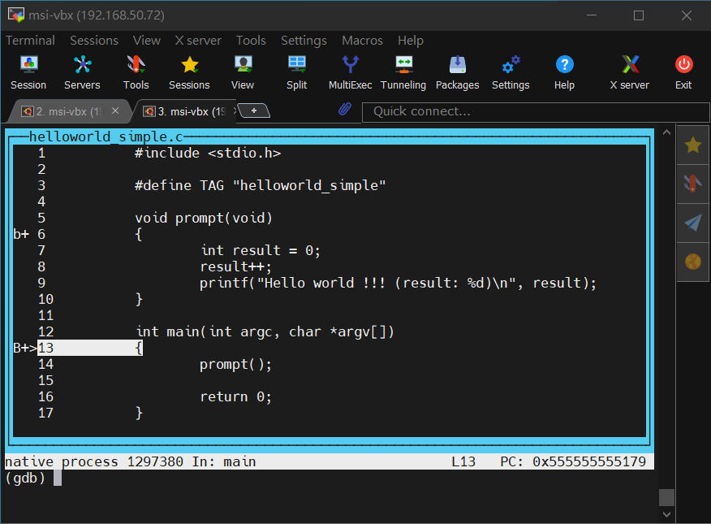
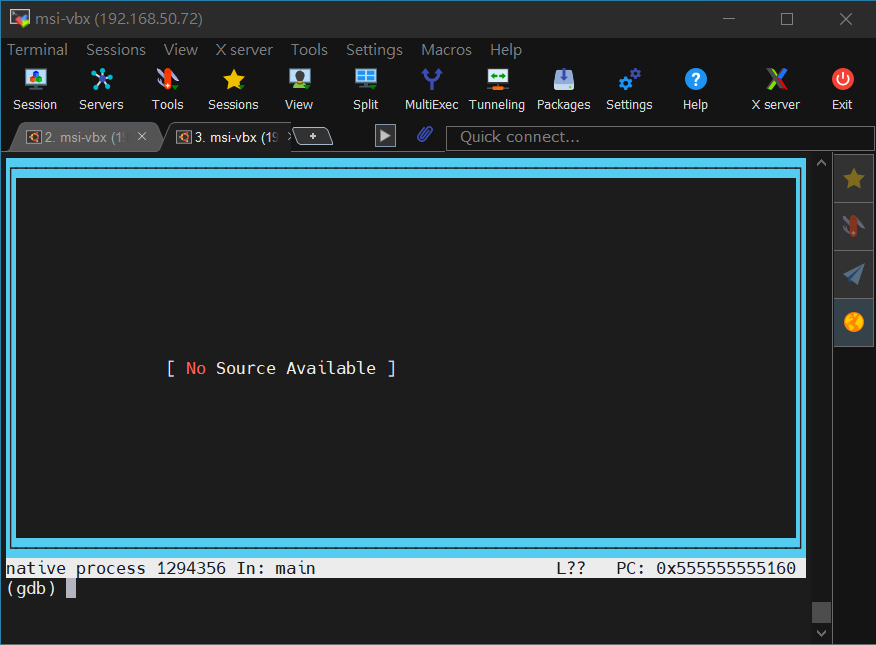
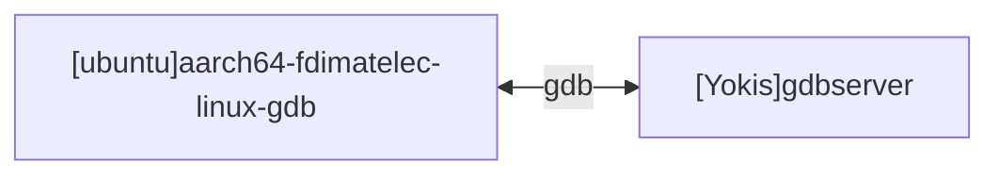

[TOC]

# [The GNU Project Debugger (gdb)](https://www.sourceware.org/gdb/)

# 1. 為什麼要 [Debug](https://zh.wikipedia.org/wiki/葛麗絲·霍普)／測試（軟體開發）

當我們撰寫原始碼時，有時會出現語法錯誤、邏輯錯誤或其他問題，這些問題可能會導致軟體無法正常運行或產生不預期的結果。透過 Debug，我們可以找出問題所在，並進行修正。

- 抓出[昆蟲](https://zh.wikipedia.org/wiki/葛麗絲·霍普)：因為一隻昆蟲卡在了計算機的電線上造成短路，抓出昆蟲，進行修正。
- 系統並未如預期的方式運作：找出該錯誤的發生點，修復之，然後再進行測試。
- 提升系統的品質：一而再，再而三的對系統進行除錯和改善，其運行的穩定度也將隨提高。
- 節省運行時間和成本：找出系統某處是否運行過久，或是高溫產生的成本消耗，然後對其進行最佳化或是刪減不必要的功能。
- 測試/問題經驗的累積：解決不同的問題後，如要再進行類似的系統開發，可從中避免相同問題的產生。
- 開發時間縮短：經驗累積下，套用至新專案的開發，開發時間也得以縮短。
- 獲得客戶滿意：推出開發時程短、品質好的系統，將會得到客戶較正面的回覆。

# 2. 軟體除錯的方式

## 2.1. 軟體品質改善

- 原始碼排版：縮排、空格或斷行要前後一致。
- 變數先宣告再使用：儘量不要在使用時才宣告該變數。
- 變數宣告時給定初值：宣告變數時，一定要給值。就算是 null 也要指定。
- 注意 alloc、free：在使用變數時，一定要檢查其存在或是已被釋放。
- 儘量少用 poniter to poniter：改使用 array 或 struct。
- 結構化原始碼：改用類或是函數表示。
- 繼承/使用已驗證的原始碼：避免過度的創作，除非花更多的時間去驗證。

## 2.2. Compile 時除錯

- 禁上 Error Messages：當 Compile 時，發生 Error Messages 時，一定要解決。

- 避免 Warning Messages：儘量解決。以下是較不嚴重的範例

	```bash
	warning: unused variable ‘ret’ [-Wunused-variable]
  ```
```bash
$ gcc -o helloworld_warning helloworld_warning.c
helloworld_warning.c: In function ‘main’:
helloworld_warning.c:24:2: warning: implicit declaration of function ‘printf’ [-Wimplicit-function-declaration]
   24 |  printf("Hello world !!! (%d)\n", strlen(buff));
      |  ^~~~~~
helloworld_warning.c:24:2: warning: incompatible implicit declaration of built-in function ‘printf’
helloworld_warning.c:1:1: note: include ‘<stdio.h>’ or provide a declaration of ‘printf’
  +++ |+#include <stdio.h>
    1 | /***************************************************************************
helloworld_warning.c:24:35: warning: implicit declaration of function ‘strlen’ [-Wimplicit-function-declaration]
   24 |  printf("Hello world !!! (%d)\n", strlen(buff));
      |                                   ^~~~~~
helloworld_warning.c:24:35: warning: incompatible implicit declaration of built-in function ‘strlen’
helloworld_warning.c:1:1: note: include ‘<string.h>’ or provide a declaration of ‘strlen’
  +++ |+#include <string.h>
    1 | /***************************************************************************
helloworld_warning.c:24:28: warning: format ‘%d’ expects argument of type ‘int’, but argument 2 has type ‘long unsigned int’ [-Wformat=]
   24 |  printf("Hello world !!! (%d)\n", strlen(buff));
      |                           ~^      ~~~~~~~~~~~~
      |                            |      |
      |                            int    long unsigned int
      |                           %ld

```
## 2.3. 列印 Debug message

- 即時查看：終端機中直接查看相關訊息
- 日誌記錄：將訊息導至檔案，然後可利用串流的技術進行查看。查看的工具有 cat, tail, 也有呈現如網頁-CloudWatch。

## 2.4. Code Review

- 避免軟體工程師的盲點：軟體工程師觀看自己的原始碼時存在有盲點，適當的 Code Review 過程可糾出錯誤。
- 互相學習：借用 Code Review 的機制，可以改進彼此的寫作習慣，也熟悉彼此做的東西。
- 預防一些重工：當有相同功能原始碼發生，可以歸類成函式庫。

## 2.5. 使用 gdb、gdbserver

前面幾項運作的良好，基本上 gdb 就沒有上場的機會。

# 3. <font color="red">釐清問題所在後，解決問題的還是人！</font>

# 4. [gdb（GNU Debugger）](http://gnu.ist.utl.pt/software/gdb/gdb.html) 是什麼

GDB, the GNU Project debugger, allows you to see what is going on `inside' another program while it executes -- or what another program was doing at the moment it crashed.

[GNU](https://zh.wikipedia.org/zh-tw/GNU)軟體系統中的標準[偵錯器](https://zh.wikipedia.org/wiki/调试工具)。就是軟體的除錯工具。

- <font color="red">Runtime Checking</font>：在軟體執行下，進行除錯。
- <font color="red">Get immediate response</font>：在軟體執行下，立即得到回饋。

## 4.1. gdb/gdbserver <font color="red">無法使用</font>的情境

```bash
$ sudo apt get install gdb
$ sudo apt get install gdbserver
```

- 沒有 gdb
- 沒有 gdbserver

## 4.2. gdb/gdbserver <font color="red">受限</font>的情境

- 進行最佳化編譯：進行最佳化編譯，改善軟體執行速度和效能。
- No debugging symbols：簡單的說就是執行檔內沒有原始碼。

```bash
# 使用 file 查看執行檔，有沒有 with debug_info
$ file helloworld_simple-nosymbols
helloworld_simple-nosymbols: ELF 64-bit LSB shared object, x86-64, version 1 (SYSV), dynamically linked, interpreter /lib64/ld-linux-x86-64.so.2, BuildID[sha1]=da50a58ea6acc03b05554b17ae52ec804d48cace, for GNU/Linux 3.2.0, not stripped

$ file helloworld_simple-symbols
helloworld_simple-symbols: ELF 64-bit LSB shared object, x86-64, version 1 (SYSV), dynamically linked, interpreter /lib64/ld-linux-x86-64.so.2, BuildID[sha1]=b3d9495b5c42cd0f7961c5dcfe3e0357845e2caf, for GNU/Linux 3.2.0, with debug_info, not stripped
```

## 4.3. gdb 的使用情境

- 設置斷點：允許軟體運行時停止在所設置的斷點，等待軟體工程師判斷。
  - 軟體 crash 點：可以在軟體 crash 前追踪相關信息（<font color="red">但是先決條件是要軟體能停上在錯誤發生之前</font>）。

- 查看執行當下的狀態
  - 監視變數值的改變。
  - 軟體是否存取無效的記憶體區塊。

- line-by-line, function-by-function：可以逐行進行除錯或是針對函數的跳轉進行除錯。
- 軟體運行的先後順序：前一功能的輔助之下，有利於軟體工程師解析軟體運行狀況。

## 4.4. gdbserver 的使用情境

gdbserver 是 gdb 中的一個組件。允許在一台計算機上運行 GDB  Client，同時在另一台計算機上運行目標 GDB  Sever。

- 遠端偵錯模式：如圖所示。但並<font color="red">不限定</font>於嵌入式系統偵錯使用。


> [ChatGPT]GDB server 應用情境
>
> GDB（GNU Debugger）伺服器是指一種軟體組件，可用於遠程調試軟體應用程序，使用的是 GDB 調試器。它使開發人員能夠調試運行在遠程目標設備上的代碼，這些設備可以是從嵌入式系統到遠程伺服器的任何東西。以下是 GDB 伺服器使用的典型情境概述：
>
> 1. **嵌入式系統開發：** GDB 伺服器在嵌入式系統開發中被廣泛使用。在這種情況下，目標設備可能沒有圖形用戶界面或完整的操作系統。開發人員使用 GDB 伺服器連接到目標設備，設置斷點，檢查變數，並逐步執行代碼來排除故障並理解在嵌入式系統上運行的軟體中的問題。
>
> 2. **遠程伺服器調試：** GDB 伺服器也可用於調試運行在遠程伺服器或虛擬機上的軟體。開發人員可以在遠程機器上運行 GDB 伺服器，並從他們的本地開發環境連接到它，而無需在遠程機器上運行 GDB，因為可能沒有適合的開發環境。
>
> 3. **跨平台開發：** 當為多個平台開發軟體時，例如 Windows 和 Linux，開發人員可以使用 GDB 伺服器來調試在不同平台上運行的代碼。這在針對資源有限或系統架構不同的平台時特別有用。
>
> 4. **內核開發：** GDB 伺服器對於內核級調試非常有價值。開發人員可以將 GDB 連接到運行中的內核，設置斷點，並實時分析內核的行為，幫助識別和修復操作系統核心的問題。
>
> 5. **遠程性能分析：** GDB 伺服器也可用於性能分析應用程序。通過分析不同函數中所花費的時間，性能分析有助於識別代碼中的性能瓶頸。GDB 伺服器使遠程設備或伺服器上運行的應用程序的性能分析成為可能。
>
> 6. **自動化測試和持續集成：** GDB 伺服器可以集成到自動化測試和持續集成流程中。這使開發人員能夠自動在遠程設備或伺服器上運行測試並調試在測試過程中出現的任何失敗。
>
> 7. **交叉編譯和調試：** 當為具有不同指令集或架構的平台開發軟體時，開發人員可以在本機機器上進行交叉編譯，然後使用目標平台上的 GDB 伺服器進行調試。
>
> 在每種情況下，GDB 伺服器充當了開發人員機器上運行的 GDB 調試器與目標設備或系統之間的中介。它實現了無縫通信，斷點管理，記憶體檢查以及逐步執行，所有這些都來自開發人員熟悉的開發環境。
>
> 需要注意的是，有多種 GDB 伺服器實現可用，其設置和使用的具體細節可能因目標平台、架構和使用的開發工具而有所不同。

# 5. gdb 的指令
- **run / r：** 開始執行程式，可以搭配參數。例如：`run my_program arg1 arg2`
- **break / b：** 設置斷點。你可以在特定的行數或函數上設置斷點。例如：`break main` 或 `b 15`
- **continue / c：** 繼續執行程式直到下一個斷點。
- **step / s：** 單步執行，逐行執行並進入函數內部。
- **next / n：** 單步執行，但不進入函數內部。
- **finish：** 執行程式，直到當前函數執行完畢。
- **print / p：** 顯示變數的值。例如：`print x`
- **info locals：** 顯示當前函數的局部變數。
- **info breakpoints：** 顯示已設置的斷點。
- **backtrace / bt：** 顯示當前的呼叫堆疊。
- **watch：** 監視變數的變化。
- **set variable：** 設置變數的值。
- **list / l：** 顯示程式碼，預設是當前行附近的代碼。
- **delete breakpoints：** 刪除斷點。
- **quit / q：** 退出 GDB。

# 6. Example

## 6.1. No debugging symbols

>-g  Produce debugging information in the operating system's native format (stabs, COFF, XCOFF, or DWARF).  GDB can work with this debugging information.

```bash
# No debugging symbols
$ gcc -o helloworld_simple-nosymbols helloworld_simple.c
$ file ./helloworld_simple-nosymbols
./helloworld_simple-nosymbols: ELF 64-bit LSB shared object, x86-64, version 1 (SYSV), dynamically linked, interpreter /lib64/ld-linux-x86-64.so.2, BuildID[sha1]=24cd4ee4c08c6dc82c0ce6082fc713b9c49fceef, for GNU/Linux 3.2.0, not stripped

# add -g
$ gcc -g -o helloworld_simple-symbols helloworld_simple.c
$ $ file ./helloworld_simple-symbols
./helloworld_simple-symbols: ELF 64-bit LSB shared object, x86-64, version 1 (SYSV), dynamically linked, interpreter /lib64/ld-linux-x86-64.so.2, BuildID[sha1]=7350b48b14914a06cd7f4e1f63569cfacccb0574, for GNU/Linux 3.2.0, with debug_info, not stripped
```

```C
#include <stdio.h>

#define TAG "helloworld_simple"

void prompt(void)
{
	int result = 0;
	result++;
	printf("Hello world !!! (result: %d)\n", result);
}

int main(int argc, char *argv[])
{
	prompt();

	return 0;
}
```

```bash
$ gdb ./helloworld_simple-symbols
Reading symbols from ./helloworld_simple-symbols...
(gdb) b main
(gdb) b prompt
(gdb) r
```
按下 **Ctrl+x+a**
- helloworld_simple-symbols

- helloworld_simple-nosymbols


## 6.2. value has been optimized out

```bash
# add -O?
$ gcc -g -O0 -o helloworld_simple-symbols0 helloworld_simple.c
$ gcc -g -O1 -o helloworld_simple-symbols1 helloworld_simple.c
$ gcc -g -O2 -o helloworld_simple-symbols2 helloworld_simple.c
$ gcc -g -O3 -o helloworld_simple-symbols3 helloworld_simple.c
$ ll helloworld_simple-*
-rwxrwxr-x 1 lanka lanka 16744  八  23 09:14 helloworld_simple-nosymbols*
-rwxrwxr-x 1 lanka lanka 19432  八  23 09:15 helloworld_simple-symbols*
-rwxrwxr-x 1 lanka lanka 19440  八  23 09:14 helloworld_simple-symbols0*
-rwxrwxr-x 1 lanka lanka 19440  八  23 09:11 helloworld_simple-symbols1*
-rwxrwxr-x 1 lanka lanka 20640  八  23 09:11 helloworld_simple-symbols2*
-rwxrwxr-x 1 lanka lanka 20640  八  23 09:11 helloworld_simple-symbols3*
```

- helloworld_simple-symbols0

```bash
$ gdb ./helloworld_simple-symbols0
(gdb) b main
Breakpoint 1 at 0x1179: file helloworld_simple.c, line 13.
(gdb) b prompt
Breakpoint 2 at 0x1149: file helloworld_simple.c, line 6.
(gdb) b 7
Breakpoint 3 at 0x1155: file helloworld_simple.c, line 7.
(gdb) r
Starting program: /work/codebase/xbox/xbox_123/helloworld/helloworld_simple-symbols0

Breakpoint 1, main (argc=0, argv=0x7fffffff89b0) at helloworld_simple.c:13
13      {
(gdb) n
14              prompt();
(gdb) n

Breakpoint 2, prompt () at helloworld_simple.c:6
6       {
(gdb) watch result
Hardware watchpoint 4: result
(gdb) n

Breakpoint 3, prompt () at helloworld_simple.c:7
7               int result = 0;
(gdb) n

Hardware watchpoint 4: result

Old value = 21845
New value = 0
prompt () at helloworld_simple.c:8
8               result++;
(gdb) n

Hardware watchpoint 4: result

Old value = 0
New value = 1
prompt () at helloworld_simple.c:9
9               printf("Hello world !!! (result: %d)\n", result);
(gdb) n
Hello world !!! (result: 1)
10      }
(gdb) n

Watchpoint 4 deleted because the program has left the block in
which its expression is valid.
main (argc=1, argv=0x7fffffff89b8) at helloworld_simple.c:16
16              return 0;
(gdb) n
17      }
(gdb) n
__libc_start_main (main=0x555555555179 <main>, argc=1, argv=0x7fffffff89b8, init=<optimized out>, fini=<optimized out>,
    rtld_fini=<optimized out>, stack_end=0x7fffffff89a8) at ../csu/libc-start.c:342
342     ../csu/libc-start.c: No such file or directory.
(gdb) n
[Inferior 1 (process 1309017) exited normally]
(gdb) n
The program is not being run.
(gdb)
```

- helloworld_simple-symbols2

```bash
$ gdb ./helloworld_simple-symbols2
(gdb) b main
Breakpoint 1 at 0x1060: file helloworld_simple.c, line 13.
(gdb) b prompt
Breakpoint 2 at 0x1068: prompt. (2 locations)
(gdb) b 7
Note: breakpoint 1 also set at pc 0x1060.
Breakpoint 3 at 0x1060: file helloworld_simple.c, line 13.
(gdb) r
Starting program: /work/codebase/xbox/xbox_123/helloworld/helloworld_simple-symbols2

Breakpoint 1, main (argc=1, argv=0x7fffffff89b8) at helloworld_simple.c:13
13      {
(gdb) n
107       return __printf_chk (__USE_FORTIFY_LEVEL - 1, __fmt, __va_arg_pack ());
(gdb) n

Breakpoint 2, prompt () at helloworld_simple.c:9
9               printf("Hello world !!! (result: %d)\n", result);
(gdb) watch result
Watchpoint 4: result
(gdb) n
Hello world !!! (result: 1)

Watchpoint 4 deleted because the program has left the block in
which its expression is valid.
main (argc=<optimized out>, argv=<optimized out>) at helloworld_simple.c:16
16              return 0;
(gdb) n
__libc_start_main (main=0x555555555060 <main>, argc=1, argv=0x7fffffff89b8, init=<optimized out>, fini=<optimized out>,
    rtld_fini=<optimized out>, stack_end=0x7fffffff89a8) at ../csu/libc-start.c:342
342     ../csu/libc-start.c: No such file or directory.
(gdb) n
[Inferior 1 (process 1309061) exited normally]
(gdb) n
The program is not being run.
(gdb)
```

## 6.3. helloworld-int-conversion.c

```bash
helloworld-int-conversion.c:14:18: warning: implicit declaration of function ‘json_loads_easy’; did you mean ‘json_load_file’? [-Wimplicit-function-declaration]
   14 |  json_t *jroot = json_loads_easy("{}");
      |                  ^~~~~~~~~~~~~~~
      |                  json_load_file
helloworld-int-conversion.c:14:18: warning: initialization of ‘json_t *’ {aka ‘struct json_t *’} from ‘int’ makes pointer from integer without a cast [-Wint-conversion]
```

```bash
$ gdb ./helloworld-int-conversion
Reading symbols from ./helloworld-int-conversion...
(gdb) b main
Breakpoint 1 at 0x125a: file helloworld-int-conversion.c, line 13.
(gdb) r
Starting program: /work/codebase/xbox/xbox_123/helloworld/helloworld-int-conversion
[Thread debugging using libthread_db enabled]
Using host libthread_db library "/lib/x86_64-linux-gnu/libthread_db.so.1".

Breakpoint 1, main (argc=21845, argv=0x7ffff7f932e8 <__exit_funcs_lock>) at helloworld-int-conversion.c:13
13      {
(gdb) watch jroot
Hardware watchpoint 2: jroot
(gdb) n
14              json_t *jroot = json_loads_easy("{}");
(gdb) s
json_loads_easy (payload=0x0) at helloworld_json.c:20
20      {
(gdb) watch jroot
Hardware watchpoint 3: jroot
(gdb) n
21              json_t *jroot = NULL;
(gdb) n
22              if ( (payload) && (strlen(payload)>0))
(gdb) n
24                      json_error_t jerror = {0};
(gdb) n
25                      jroot = json_loads(payload, JSON_DISABLE_EOF_CHECK, &jerror); \
(gdb) n

Hardware watchpoint 3: jroot

Old value = (json_t *) 0x0
New value = (json_t *) 0x5555555592c0
json_loads_easy (payload=0x555555556008 "{}") at helloworld_json.c:28
28              return jroot;
(gdb) n
29      }
(gdb) n

Watchpoint 3 deleted because the program has left the block in
which its expression is valid.
0x000055555555527f in main (argc=1, argv=0x7fffffff8a98) at helloworld-int-conversion.c:14
14              json_t *jroot = json_loads_easy("{}");
(gdb) n

Hardware watchpoint 2: jroot

Old value = (json_t *) 0x0
New value = (json_t *) 0x555592c0
main (argc=1, argv=0x7fffffff8a98) at helloworld-int-conversion.c:16
16              if (jroot)
(gdb)
```

## 6.4. Run gdb on Yokis

```bash
$ gdb ./helloworld_simple-symbols0
gdb: error while loading shared libraries: libncursesw.so.5: cannot open shared object file: No such file or directory
```

## 6.5. gdb <--> gdbserver


- [Yokis]gdbserver

```bash
$ gdbserver :6666 ./helloworld_simple-symbols0
Process ./helloworld_simple-symbols0 created; pid = 2629
Listening on port 6666
Remote debugging from host ::ffff:192.168.50.72, port 60682
Hello world !!! (result: 1)

Child exited with status 0
```

- [ubuntu]gdb (target remote 127.0.0.1:6666)

```bash
b main
b prompt
b 7
c
n
watch result
n
n
n
n
n
n
n
n
```

```bash
$ gdb
(gdb) target remote 192.168.50.184:6666
Remote debugging using 192.168.50.184:6666
warning: while parsing target description (at line 4): Target description specified unknown architecture "aarch64"
warning: Could not load XML target description; ignoring
Reading /usr/bin/helloworld_simple-symbols0 from remote target...
warning: File transfers from remote targets can be slow. Use "set sysroot" to access files locally instead.
Reading /usr/bin/helloworld_simple-symbols0 from remote target...
Reading symbols from target:/usr/bin/helloworld_simple-symbols0...
Remote register badly formatted: T051d:0000000000000000;1f:10fcffffffff0000;20:d09cfdf7ffff0000;thread:pa4f.a4f;core:1;
here: 00000000;1f:10fcffffffff0000;20:d09cfdf7ffff0000;thread:pa4f.a4f;core:1;
(gdb)

```

```bash
$ /opt/yokis-distro/fdi-linux-2022.08/sysroots/x86_64-fdimatelecsdk-linux/usr/bin/aarch64-fdimatelec-linux/aarch64-fdimatelec-linux-gdb
(gdb) target remote 192.168.50.184:6666
Remote debugging using 192.168.50.184:6666
Reading /usr/bin/helloworld_simple-symbols0 from remote target...
warning: File transfers from remote targets can be slow. Use "set sysroot" to access files locally instead.
Reading /usr/bin/helloworld_simple-symbols0 from remote target...
Reading symbols from target:/usr/bin/helloworld_simple-symbols0...
Reading /lib/ld-linux-aarch64.so.1 from remote target...
Reading /lib/ld-linux-aarch64.so.1 from remote target...
Reading symbols from target:/lib/ld-linux-aarch64.so.1...
Reading /lib/.debug/ld-linux-aarch64.so.1 from remote target...
Reading /lib/.debug/ld-linux-aarch64.so.1 from remote target...
Reading symbols from target:/lib/.debug/ld-linux-aarch64.so.1...
0x0000fffff7fd9cd0 in _start () from target:/lib/ld-linux-aarch64.so.1
(gdb) b main
Breakpoint 1 at 0xaaaaaaaa0868: file helloworld_simple.c, line 14.
(gdb) l
1       #include <stdio.h>
2
3       #define TAG "helloworld_simple"
4
5       void prompt(void)
6       {
7               int result = 0;
8               result++;
9               printf("Hello world !!! (result: %d)\n", result);
10      }
(gdb) b prompt
Breakpoint 2 at 0xaaaaaaaa0824: file helloworld_simple.c, line 7.
(gdb) r
The "remote" target does not support "run".  Try "help target" or "continue".
(gdb) c
Continuing.
Reading /lib/libc.so.6 from remote target...
Reading /lib/.debug/libc.so.6 from remote target...
Reading /lib/.debug/libc.so.6 from remote target...

Breakpoint 1, main (argc=1, argv=0xfffffffffc18) at helloworld_simple.c:14
14              prompt();
(gdb) n

Breakpoint 2, prompt () at helloworld_simple.c:7
7               int result = 0;
(gdb) watch result
Hardware watchpoint 3: result
(gdb) n

Hardware watchpoint 3: result

Old value = 65535
New value = 0
prompt () at helloworld_simple.c:8
8               result++;
(gdb) n

Hardware watchpoint 3: result

Old value = 0
New value = 1
prompt () at helloworld_simple.c:9
9               printf("Hello world !!! (result: %d)\n", result);
(gdb) n
10      }
(gdb) n

Watchpoint 3 deleted because the program has left the block in
which its expression is valid.
main (argc=1, argv=0xfffffffffc18) at helloworld_simple.c:16
16              return 0;
(gdb) n
17      }
(gdb) n
__libc_start_call_main (main=main@entry=0xaaaaaaaa0854 <main>, argc=argc@entry=1, argv=argv@entry=0xfffffffffc18) at ../sysdeps/nptl/libc_start_call_main.h:74
74      ../sysdeps/nptl/libc_start_call_main.h: No such file or directory.
(gdb) n
[Inferior 1 (process 2629) exited normally]
(gdb) n
The program is not being run.
(gdb)
```

# Appendix

# I. Study

# II. Debug

# III. Glossary

# IV. Tool Usage

# Author

> Created and designed by [Lanka Hsu](lankahsu@gmail.com).

# License

> [HelperX](https://github.com/lankahsu520/HelperX) is available under the BSD-3-Clause license. See the LICENSE file for more info.

