# macOS
[](https://github.com/lankahsu520/HelperX)
[![GitHub license][license-image]][license-url]
[![GitHub version][version-image]][version-url]
[![GitHub stars][stars-image]][stars-url]
[![GitHub forks][forks-image]][forks-url]
[![GitHub issues][issues-image]][issues-image]


[license-image]: https://img.shields.io/github/license/lankahsu520/HelperX.svg
[license-url]: https://github.com/lankahsu520/HelperX/blob/master/LICENSE
[version-image]: https://img.shields.io/github/package-json/v/lankahsu520/HelperX.svg
[version-url]: https://github.com/lankahsu520/HelperX/blob/master/package-json
[stars-image]: https://img.shields.io/github/stars/lankahsu520/HelperX.svg
[stars-url]: https://github.com/lankahsu520/HelperX/stargazers
[forks-image]: https://img.shields.io/github/forks/lankahsu520/HelperX.svg
[forks-url]: https://github.com/lankahsu520/HelperX/network
[issues-image]: https://img.shields.io/github/issues/lankahsu520/HelperX.svg
[issues-url]: https://github.com/lankahsu520/HelperX/issues

# 1. Upgrade [Mac Mini](https://www.apple.com/tw/mac-mini/)

## 1.1. mac mini ssd upgrade

#### A. [Hard Drive Upgrade SSD - Mac Mini 2014 - 2017 (A1347)](https://www.youtube.com/watch?v=LMGaZ9rdSeI)

#### B. Disassemble

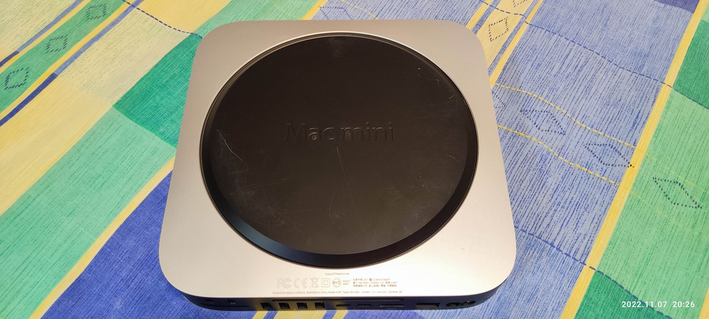

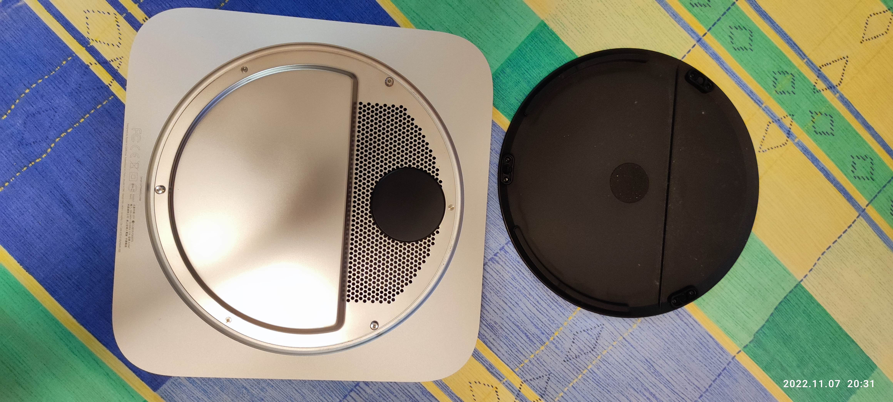

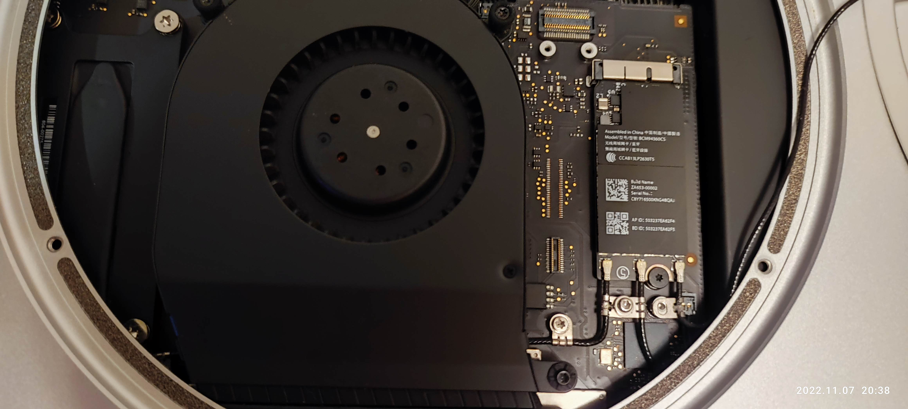

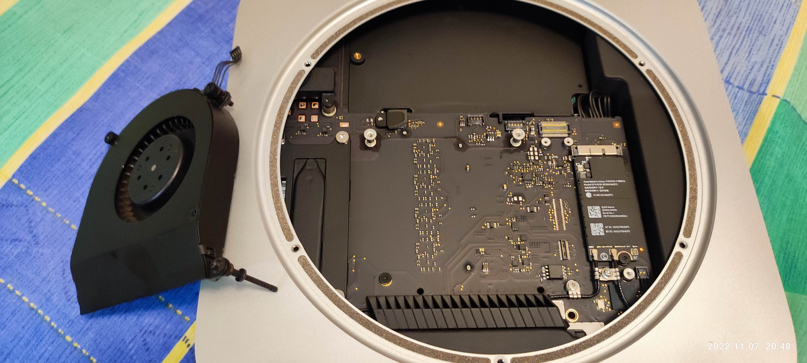

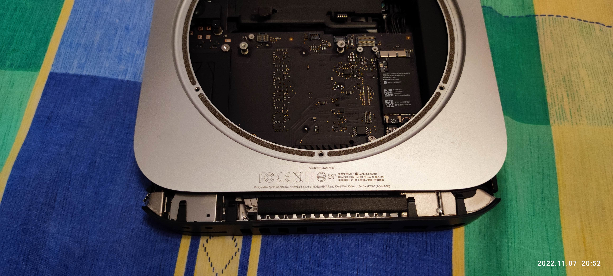

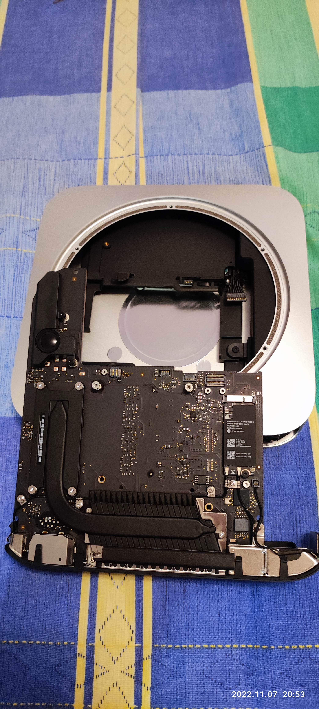

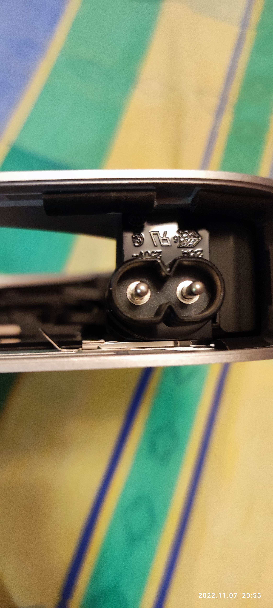

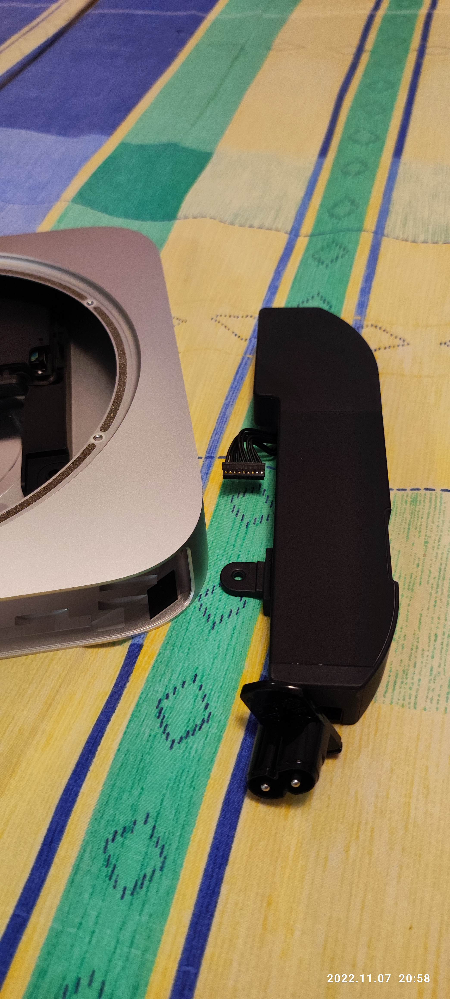

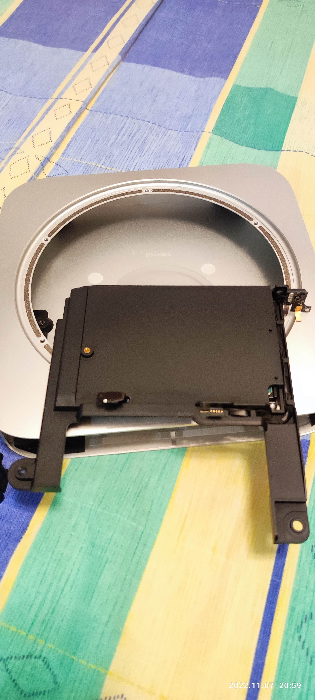

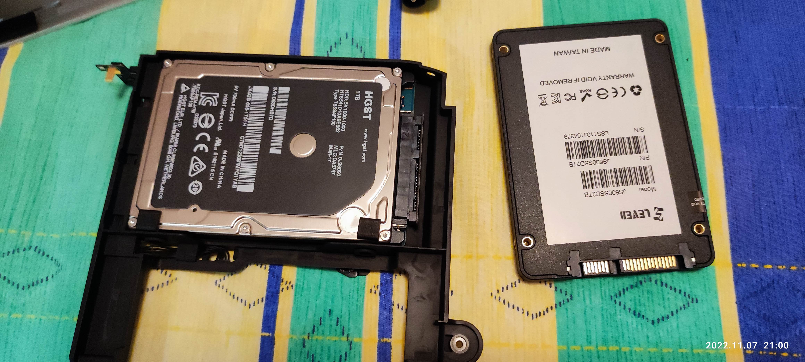

## 1.2. Install macOS on a new disk

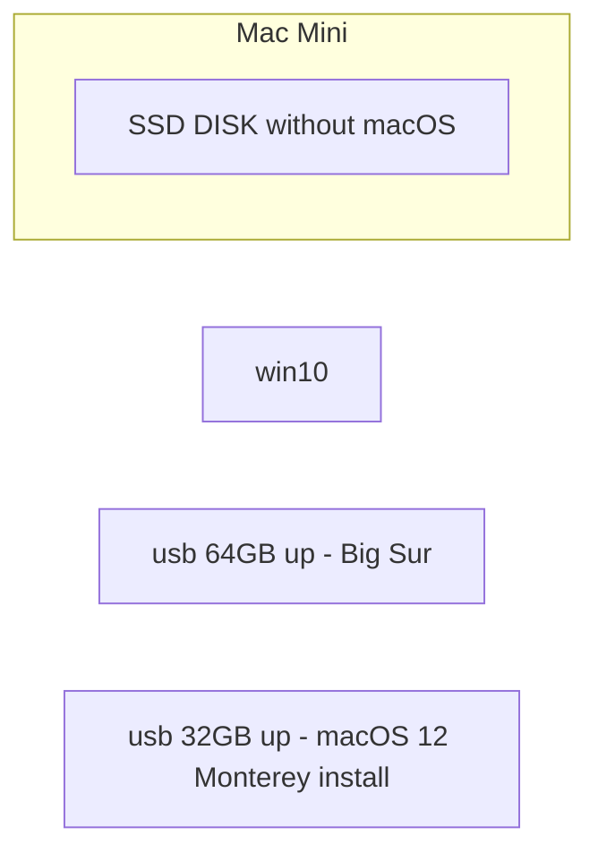


### 1.2.1 create a usb (64GB up) with Big Sur

#### A. [Mac無法開機了? 自行建立macOS Catalina或Big Sur緊急開機診斷碟!](https://www.osslab.com.tw/catalina-boot-diag-usb/)

#### B. [如何下載 macOS](https://support.apple.com/zh-tw/HT211683)

#### C. resize the partition 32GB to 64GB

### 1.2.2. create a usb (32GB up) with macOS 12 Monterey install

#### A. [macOS 12 Monterey 系統安裝 USB 隨身碟製作與重灌教學](https://applealmond.com/posts/123180)

#### B. reset user's password

#### C. [為 macOS 製作可開機安裝磁碟](https://support.apple.com/zh-tw/HT201372)

##### C.1. Ventura

```bash
$ sudo /Applications/Install\ macOS\ Ventura.app/Contents/Resources/createinstallmedia --volume /Volumes/MyVolume
```

##### C.2. Monterey

```bash
$ sudo /Applications/Install\ macOS\ Monterey.app/Contents/Resources/createinstallmedia --volume /Volumes/MyVolume
```

### 1.2.3. install macOS

#### A. [使用「磁碟工具程式」清除 Intel 型 Mac](https://support.apple.com/zh-hk/HT208496)

#### B. [如何重新安裝 macOS](https://support.apple.com/zh-hk/HT204904)

# 2. Customize UI

## 2.1. How to reset the Mac Dock to default
```bash
$ defaults delete com.apple.dock; killall Dock
```

## 2.2. Resize the Dock

#### A. System Preferences/ Dock & Menu Bar

# 3. System & Service
## 3.1. sshd

#### A. System Preferences / Sharing / Remote Login

```bash
or

$ sudo systemsetup -setremotelogin on 

```

## 3.2. smbd

#### A. System Preferences / Sharing / File Sharing

## 3.3. zsh <-> bash

#### A. System Preferences / Users & Groups / user ??? / Advanced Options / Login shell

```zsh
or

$ chsh -s /bin/bash

$ chsh -s /bin/zsh
```

```bash
$ cat /etc/shells
```

## 3.3. .bash_profile

```bash
$ vi .bash_profile
```

#### A. ~/.profile

```bash
. ~/.profile
```

#### B. LANG

```bash
export LC_ALL=en_US.UTF-8
export LANG=en_US.UTF-8
```

#### C. Terminal Color

```bash
export CLICOLOR=1
export TERM=xterm-color

```


## 3.4. Launch Binary with command line arguments

#### A. Opera

```bash
$ mv /Applications/Opera.app/Contents/MacOS/Opera /Applications/Opera.app/Contents/MacOS/Operabin
$ vi /Applications/Opera.app/Contents/MacOS/Opera
$ chmod 777 /Applications/Opera.app/Contents/MacOS/Opera
```

```sh
#!/bin/bash

#open -a
/Applications/Opera.app/Contents/MacOS/OperaBin --private
```

# 4. Package Manager

## 4.1. [Fink](https://www.finkproject.org/download/index.php?phpLang=en)（Prebuild binary code）

## 4.2. [Homebrew](https://brew.sh/index_nl) (重編且引用系統libs，/usr/local)

#### A. Installeer Homebrew

```bash
$ /bin/bash -c "$(curl -fsSL https://raw.githubusercontent.com/Homebrew/install/HEAD/install.sh)"
```

#### B. [Homebrew Formulae](https://formulae.brew.sh/)

## 4.3. [MacPorts](https://www.macports.org/install.php) (重編且引用私有libs，/opt/local)

#### A. [Install Xcode](https://guide.macports.org/#installing.xcode)

#### B. [Install and upgrade open source software on macOS.](https://ports.macports.org)

# 5. Packages

```bash

echo "**************************************************"
echo "** compiler **"
echo "**************************************************"

echo "==> subversion"; #read yn_reply;
sudo port install subversion

echo "**************************************************"
echo "** network **"
echo "**************************************************"

echo "==> youtube-dl"; #read yn_reply;
sudo port install youtube-dl
```


# Appendix

# I. Study

### A. [比较Fink, macports 和 homebrew](https://www.iteye.com/blog/tetsu-1507524)

# II. Debug


# Author

Created and designed by [Lanka Hsu](lankahsu@gmail.com).

# License

[HelperX](https://github.com/lankahsu520/HelperX) is available under the BSD-3-Clause license. See the LICENSE file for more info.

