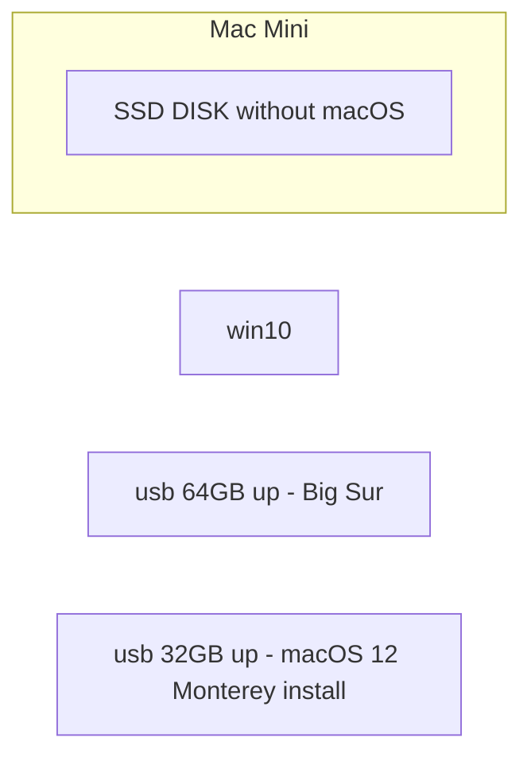

# 1. Install macOS on a new disk



## 1.1. create a usb (64GB up) with Big Sur

#### A. [Mac無法開機了? 自行建立macOS Catalina或Big Sur緊急開機診斷碟!](https://www.osslab.com.tw/catalina-boot-diag-usb/)

#### B. [如何下載 macOS](https://support.apple.com/zh-tw/HT211683)

#### C. resize the partition 32GB to 64GB

## 1.2. create a usb (32GB up) with macOS 12 Monterey install

#### A. [macOS 12 Monterey 系統安裝 USB 隨身碟製作與重灌教學](https://applealmond.com/posts/123180)

#### B. reset user's password

#### C. [為 macOS 製作可開機安裝磁碟](https://support.apple.com/zh-tw/HT201372)

##### C.1. Ventura

```bash
$ sudo /Applications/Install\ macOS\ Ventura.app/Contents/Resources/createinstallmedia --volume /Volumes/MyVolume
```

##### C.2. Monterey

```bash
$ sudo /Applications/Install\ macOS\ Monterey.app/Contents/Resources/createinstallmedia --volume /Volumes/MyVolume
```

## 1.3. install macOS

#### A. [使用「磁碟工具程式」清除 Intel 型 Mac](https://support.apple.com/zh-hk/HT208496)

#### B. [如何重新安裝 macOS](https://support.apple.com/zh-hk/HT204904)

# 2. Mac Dock

## 2.1. How to reset the Mac Dock to default
```bash
$ defaults delete com.apple.dock; killall Dock
```

## 2.2. Resize the Dock

#### A. System Preferences/ Dock & Menu Bar

# 3. Service
## 3.1. sshd

#### A. System Preferences/ Sharing / Remote Login

```bash
or

$ sudo systemsetup -setremotelogin on 

```

## 3.2. smbd

#### A. System Preferences/ Sharing / File Sharing
