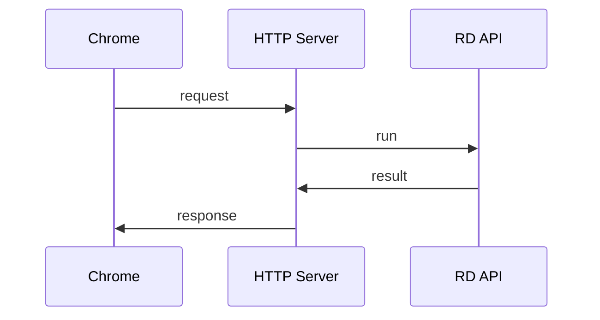
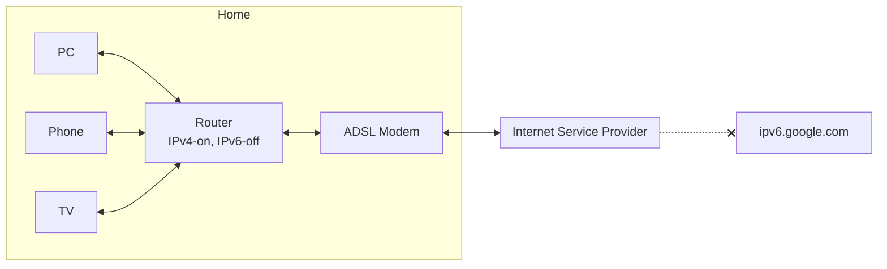

# Network (IP base)

[![GitHub license][license-image]][license-url]
[![GitHub stars][stars-image]][stars-url]
[![GitHub forks][forks-image]][forks-url]
[![GitHub issues][issues-image]][issues-image]
[![GitHub watchers][watchers-image]][watchers-image]

[license-image]: https://img.shields.io/github/license/lankahsu520/HelperX.svg
[license-url]: https://github.com/lankahsu520/HelperX/blob/master/LICENSE
[stars-image]: https://img.shields.io/github/stars/lankahsu520/HelperX.svg
[stars-url]: https://github.com/lankahsu520/HelperX/stargazers
[forks-image]: https://img.shields.io/github/forks/lankahsu520/HelperX.svg
[forks-url]: https://github.com/lankahsu520/HelperX/network
[issues-image]: https://img.shields.io/github/issues/lankahsu520/HelperX.svg
[issues-url]: https://github.com/lankahsu520/HelperX/issues
[watchers-image]: https://img.shields.io/github/watchers/lankahsu520/HelperX.svg
[watchers-url]: https://github.com/lankahsu520/HelperX/watchers

# 1. Overview

> 筆記 only。

# 2. TCP/IP 四層架構 vs OSI七層架構

> 網路上很多教學，可以幫助大家。你可以不用深入了解，有概念即可。
>
> 這邊要提醒要踏入此業的同仁，要先搞清楚 socket、listen、connect、read 和 write 等簡單操作和資料流。

> 遇到了幾位，請他們畫出簡單的 HTTP 時序圖都不會。

# 3. IPv4 vs IPv6

> IPv6 和 IPv4 是不相容的！
>
> IPv6 和 IPv4 是不相容的！
>
> IPv6 和 IPv4 是不相容的！

> 當初為了解決 IPv4 數量不足的問題，而推出 IPv6。但是 ISP 這端並沒有“義務”提供 IPv6，這就造成IPv6的推展不足。

> 基本上終端使用者的設備都已經有支援 IPv6，只差在 Router 開啟 IPv6 的功能。
>
> 網路很多 Q&A 都是請各位回去查看終端設備，完全沒有提及 Router 和 ISP 的問題。

> 要解決此問題，就要看看當初是申請 ADSL 動態 IP，則只要更動終端使用者的 Router。
>
> 但是使用固定 IP 的情狀下，就得跟 ISP 申請 + 更動終端使用者的 Router。

# Footnote

[^1]:
[^2]:

# Appendix

# I. Study

# II. Debug

# III. Glossary

# IV. Tool Usage

# Author

> Created and designed by [Lanka Hsu](lankahsu@gmail.com).

# License

> [HelperX](https://github.com/lankahsu520/HelperX) is available under the BSD-3-Clause license. See the LICENSE file for more info.

