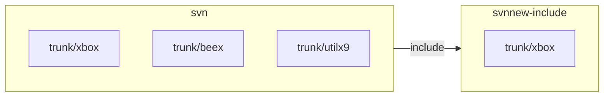
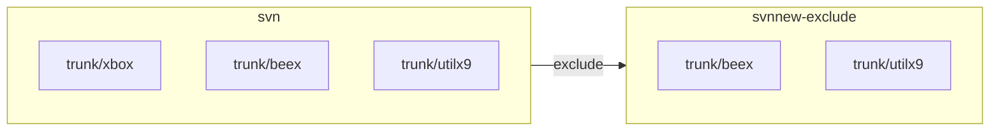
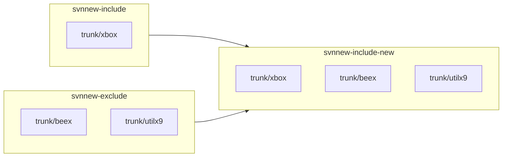
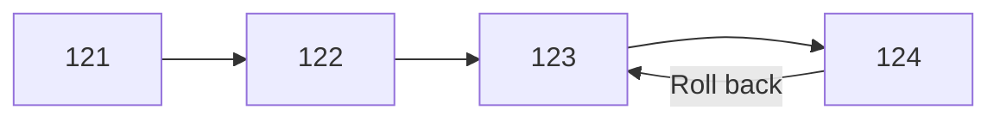
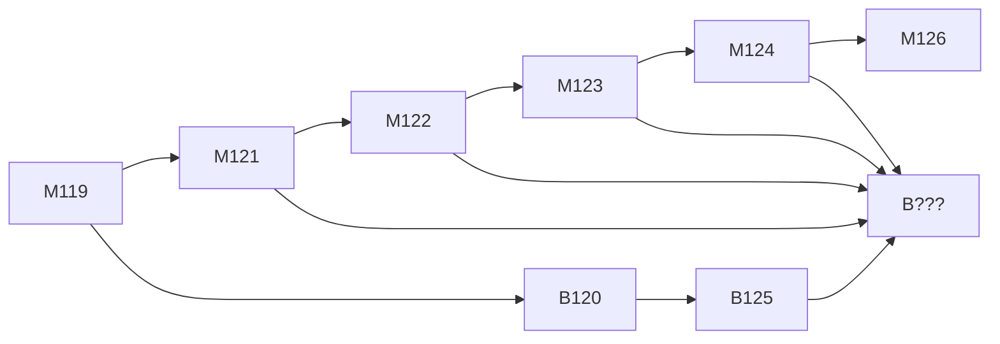

# 1. svn copy between repositories with history

```bash
$ ls -al 
drwxrwxrwx 12 lanka    lanka            4096  八  22 13:18 ./
drwxr-xr-x 30 root     root             4096  八  12 06:19 ../
drwx------  2 root     root            16384  一   6  2021 lost+found/
drwxrwxrwx  6 www-data www-data         4096  一   3  2019 svn/
-rwxrwxr-x  1 lanka    lanka           52072  八  22 13:16 svndumpsanitizer*

```

#### A. dump

```bash
export SVN_NAME_SRC=svn
export SVN_DUMP_SOURCE_FILE="./dump_svn_20220822"

svnadmin dump $SVN_NAME_SRC > $SVN_DUMP_SOURCE_FILE
```

#### B. filter

```bash
export SVN_DUMP_FILTER=""
export SVN_DUMP_FILTER="$SVN_DUMP_FILTER trunk/xbox"

```

#### C. include/exclude

```bash
export SVN_DUMP_FILTER_FILE_INCLUDE="./dump_svn_20220822include"

./svndumpsanitizer \
	--infile $SVN_DUMP_SOURCE_FILE \
	--outfile $SVN_DUMP_FILTER_FILE_INCLUDE \
	--include $SVN_DUMP_FILTER \
	--drop-empty

```

```bash
export SVN_DUMP_FILTER_FILE_EXCLUDE="./dump_svn_20220822exclude"

./svndumpsanitizer \
	--infile $SVN_DUMP_SOURCE_FILE \
	--outfile $SVN_DUMP_FILTER_FILE_EXCLUDE \
	--exclude $SVN_DUMP_FILTER \
	--drop-empty

```

## 1.1. create new repository - include

```bash
export SVN_DUMP_FILTER_FILE_INCLUDE="./dump_svn_20220822include"
export SVN_NAME_DST=svnnew-include

svnadmin create $SVN_NAME_DST
svnadmin load --ignore-uuid $SVN_NAME_DST < $SVN_DUMP_FILTER_FILE_INCLUDE
sudo chown -R www-data:www-data $SVN_NAME_DST

sudo chmod -R 775 $SVN_NAME_DST
sudo chmod -R 777 $SVN_NAME_DST/db

```

## 1.2. create new repository - exclude

```bash
export SVN_DUMP_FILTER_FILE_EXCLUDE="./dump_svn_20220822exclude"
export SVN_NAME_DST=svnnew-exclude

svnadmin create $SVN_NAME_DST
svnadmin load --ignore-uuid $SVN_NAME_DST < $SVN_DUMP_FILTER_FILE_EXCLUDE
sudo chown -R www-data:www-data $SVN_NAME_DST

sudo chmod -R 775 $SVN_NAME_DST
sudo chmod -R 777 $SVN_NAME_DST/db

```
## 1.3. ? Merge repository - include (main) + exclude

```bash
svnadmin load --parent-dir svnnew-include < $SVN_DUMP_FILTER_FILE_EXCLUDE

```

# 2. svn merge

## 2.1. Remove svn:mergeinfo

```bash
svn propget svn:mergeinfo --depth=infinity | grep -v "^/" | grep -v "^\." | cut -d- -f1 | xargs svn propdel svn:mergeinfo

svn ci ./

```

## 2.2. Roll back



```bash
# Undo a committed change
SVN_LAST=`svn info 2>/dev/null | grep 'Last Changed Rev' | cut -d':' -f2 | awk '{print $1}'`
svn merge -c -${SVN_LAST} .

svn ci ./
```

## 2.3. Merge



```bash
# Merge a range of changes
svn merge -r 121:124 http://trac-vbx/svnroot/trunk/xbox ./

# Merge one specific change
svn merge -c 122 ./

svn ci ./
```

# 3. Relocate

```bash
svn relocate http://trac-vbx/svnroot/trunk/xbox

```

# Appendix

# I. Study

- [Chapter 4. Branching and Merging](https://svnbook.red-bean.com/en/1.7/svn.branchmerge.summary.html)


# II. Debug

# III. svn Usage

```bash
usage: svn <subcommand> [options] [args]
Subversion command-line client.
Type 'svn help <subcommand>' for help on a specific subcommand.
Type 'svn --version' to see the program version and RA modules,
     'svn --version --verbose' to see dependency versions as well,
     'svn --version --quiet' to see just the version number.

Most subcommands take file and/or directory arguments, recursing
on the directories.  If no arguments are supplied to such a
command, it recurses on the current directory (inclusive) by default.

Available subcommands:
   add
   auth
   blame (praise, annotate, ann)
   cat
   changelist (cl)
   checkout (co)
   cleanup
   commit (ci)
   copy (cp)
   delete (del, remove, rm)
   diff (di)
   export
   help (?, h)
   import
   info
   list (ls)
   lock
   log
   merge
   mergeinfo
   mkdir
   move (mv, rename, ren)
   patch
   propdel (pdel, pd)
   propedit (pedit, pe)
   propget (pget, pg)
   proplist (plist, pl)
   propset (pset, ps)
   relocate
   resolve
   resolved
   revert
   status (stat, st)
   switch (sw)
   unlock
   update (up)
   upgrade

(Use '-v' to show experimental subcommands.)

Subversion is a tool for version control.
For additional information, see http://subversion.apache.org/

```

# IV. **[svndumpsanitizer](https://github.com/dsuni/svndumpsanitizer)**

# V. ~/.bash_aliases

```bash
#** svn **
export SVN_EDITOR=vim

alias svn-up="svn up"

alias svn-diff="svn diff $*"
alias svn-diff2file="svn diff $* > /tmp/diff"

alias svn-stq="svn st -q"
alias svn-new="svn status | grep -e ^?"
alias svn-st="svn status --no-ignore"

alias svn-log="svn log | perl -l40pe 's/^-+/\n/'"

alias svn-revision="svn info 2>/dev/null | grep Revision | cut -d' ' -f2"

function svn-rm()
{
	svn st | grep '^!' | awk '{$1=""; print " --force \""substr($0,2)"@\"" }' | xargs svn delete
}

function svn-add()
{
	svn status | grep -e ^? | awk '{$1=""; print "\""substr($0,2)"\"" }' | xargs svn add
}

function svn-rollback()
{
	SVN_LAST=`svn info 2>/dev/null | grep 'Last Changed Rev' | cut -d':' -f2 | awk '{print $1}'`
	svn merge -c -${SVN_LAST} .
}

function svn-revert()
{
	HINT="Usage: ${FUNCNAME[0]} <files>"
	FILES="$*"

	if [ ! -z "$FILES" ]; then
		svn revert $FILES
	else
		echo $HINT
	fi
}
```

