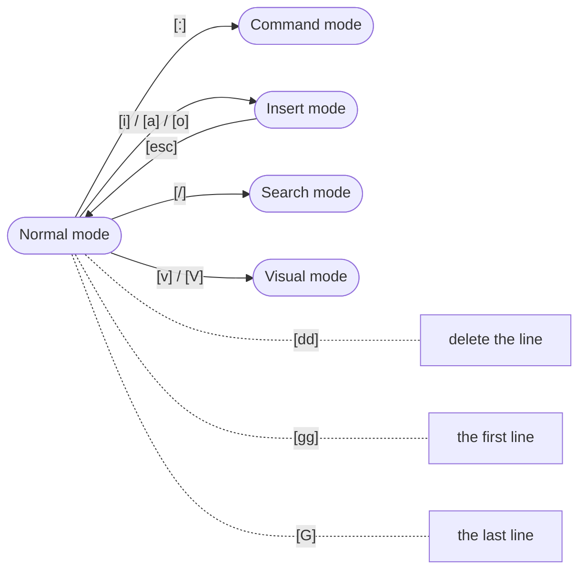

# vi / vim
[](https://github.com/lankahsu520/HelperX)
[![GitHub license][license-image]][license-url]
[![GitHub stars][stars-image]][stars-url]
[![GitHub forks][forks-image]][forks-url]
[![GitHub issues][issues-image]][issues-image]
[![GitHub watchers][watchers-image]][watchers-image]

[license-image]: https://img.shields.io/github/license/lankahsu520/HelperX.svg
[license-url]: https://github.com/lankahsu520/HelperX/blob/master/LICENSE
[stars-image]: https://img.shields.io/github/stars/lankahsu520/HelperX.svg
[stars-url]: https://github.com/lankahsu520/HelperX/stargazers
[forks-image]: https://img.shields.io/github/forks/lankahsu520/HelperX.svg
[forks-url]: https://github.com/lankahsu520/HelperX/network
[issues-image]: https://img.shields.io/github/issues/lankahsu520/HelperX.svg
[issues-url]: https://github.com/lankahsu520/HelperX/issues
[watchers-image]: https://img.shields.io/github/watchers/lankahsu520/HelperX.svg
[watchers-url]: https://github.com/lankahsu520/HelperX/watchers

# 1. Vim cheatsheet

> https://overapi.com/static/cs/vim-cheat-sheet-full.png

# 



## 1.1. File Handler

#### - Close file

```bash
: q

# 強制離開
: q!
```

#### - Current directory

```bash
: pwd
```

#### - File navigation

```bash
: e ./
```

#### - Restore file

```bash
: e!
```

#### - Save file

```bash
: w

# save and close files
: wq

# 另存新檔
: w newfile
```

## 1.2. Editing

#### - Goto the line

```bash
: 123
```

#### - Replace String

```bash
# replace all lines, lanka -> mary
: %s/lanka/mary/g

# replace the current line, lanka -> mary
: s/lanka/mary/g
```

## 1.3. Options

#### - Show or hide line numbers

```bash
# show line numbers
: set nu

# hide line numbers
: set nu!
```
# 2. System Environment

## 2.1. .vimrc

```bash
$ ~/.vimrc
```


```bash
set nocp                "指定 VIM 工作在不兼容模

"https://magiclen.org/vimrc/
syntax enable          "程式碼語法高亮功能

"set autoindent         "自動縮排有「autoindent」、「smartindent」和「cindent」
set backspace=2         "可隨時用倒退鍵刪除
set bg=dark             "顯示不同的底色色調
"set expandtab          "輸入 tab 都會被轉換成 space
set hlsearch            "搜尋結果高亮提示
set mouse-=a            "「n」為一般模式；「v」為視覺模式；「i」為插入模式；「c」為命令列模式；「a」為所有模式
set noexpandtab         "關閉vim的TAB擴展功能
set nowrap              "指定不換行
set nu                  "可以在每一行的最前面顯示行號啦！
set ruler               "右下角顯示游標座標
set shiftwidth=2        "自動縮排對齊間隔數
set showmode            "在底部顯示目前使用的操作模式是一般、插入、取代還是選取模式
set tabstop=2           "縮排間隔數
set softtabstop=2

" Reopen the last edited position in files
au BufReadPost * if line("'\"") > 1 && line("'\"") <= line("$") | exe "normal! g'\"" | endif

```

## 2.2. git editor

```bash
$ export GIT_EDITOR=vim
```

## 2.3. svn editor

```bash
$ export SVN_EDITOR=vim
```

# Appendix

# I. Study

## I.1. [Beautiful Vim Cheat Sheet](https://vimcheatsheet.com)

## I.2. [Vim cheatsheet](https://quickref.me/vim.html)

## I.3. [Vim Cheat Sheet](https://vim.rtorr.com/)

# II. Debug

# III. Glossary

# IV. Tool Usage

# Author

Created and designed by [Lanka Hsu](lankahsu@gmail.com).

# License

[HelperX](https://github.com/lankahsu520/HelperX) is available under the BSD-3-Clause license. See the LICENSE file for more info.

